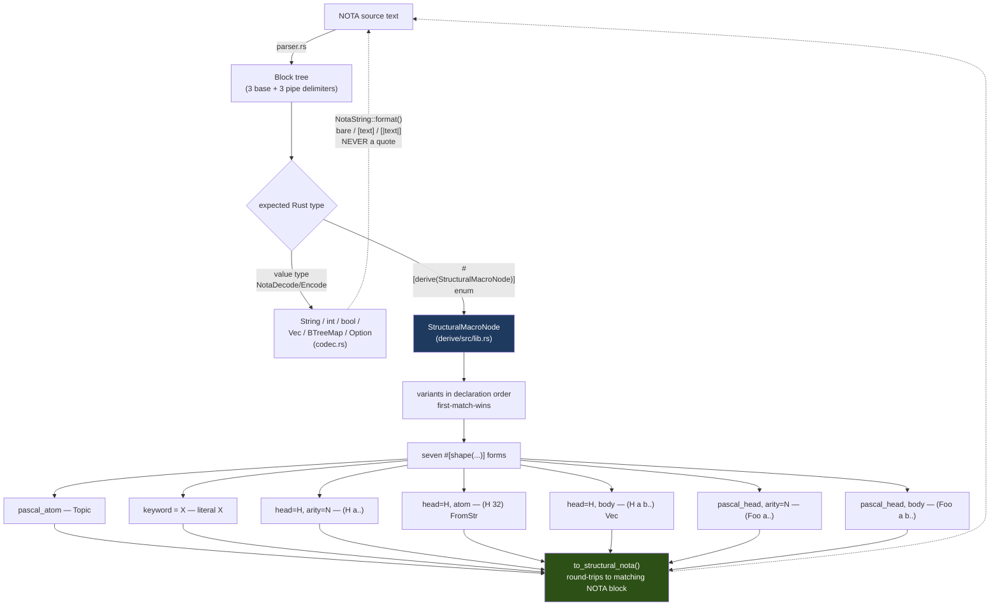
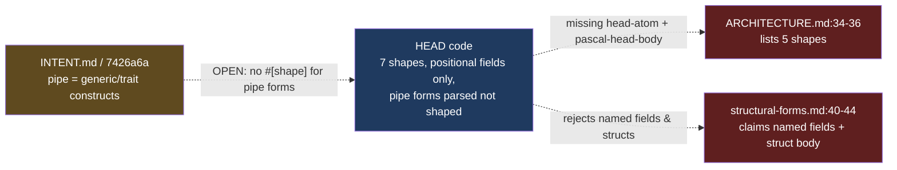

# 690 / 3 — nota-next engine audit

**TL;DR.** The structural-macro-node codec is real and artifact-green: the
seven-shape `#[derive(StructuralMacroNode)]` vocabulary is complete in
`derive/src/lib.rs`, each shape has a cited decode↔encode round-trip test, and
all **75 tests pass on the live `cargo 1.96` toolchain I ran** (not just a CI
witness). The load-bearing finding is a **documentation/skill drift, not a code
defect**: (a) `skills/structural-forms.md:40-41` claims structural-macro-node
enum variants "may carry **named** fields" and that **structs** derive a body —
both are *rejected* by the current HEAD derive (`derive/src/lib.rs:760-765`
rejects named fields; `:664-666` rejects `Data::Struct`); and (b) the repo's
own `ARCHITECTURE.md:34-36` derive description lists only **five** shape
attributes, missing the two newest ones (`head atom` / commit `3e18e37`,
`pascal_head body` / commit `db0f10a`) even though a *later* commit (`7426a6a`)
touched the same file. The pipe-delimiter work (`7426a6a`) is **documentation of
a constraint that is explicitly still OPEN at the shape layer** — the parser
produces `PipeParenthesis`/`PipeBrace` blocks but no `#[shape(...)]` recognizes
them yet. That is the one genuine intent-vs-implementation gap.

## What the engine is

`nota-next` is the raw NOTA structural floor plus the typed structural-macro-node
codec. The substrate (`parser.rs`) is meaning-free: it parses delimiter-balanced
blocks and reports the closed delimiter set (3 base pairs + 3 piped forms). The
codec (`codec.rs`) owns Rust value ↔ NOTA value shapes with a strict
never-emit-quotation-marks string discipline. The macro layer (`macros.rs` +
`derive/src/lib.rs`) is the engine under audit: a consumer enum *is* the
specification — its variants list structural shapes in declaration order, the
codec selects the first matching shape (recursively), decodes captures into the
typed payload, and encodes back to a matching NOTA block.

## Commit verification

| Commit | Claim | Status | Evidence |
|---|---|---|---|
| `7426a6a` | document pipe delimiter construct constraints | **Real (doc only)** | Touches only `ARCHITECTURE.md` + `INTENT.md`; adds the closed-delimiter-set paragraph and the `CONSTRAINT … OPEN (how)` block (`ARCHITECTURE.md:115-137`). No code change. |
| `00d0050` | integrate structural macro shapes (merge) | **Real** | Merge of `db0f10a`+`3e18e37`; `derive/src/lib.rs` +174, `tests/macro_nodes.rs` +184. Both shapes present at HEAD. |
| `db0f10a` | PascalHeadBody derive shape (captured head + variable-arity body) | **Real** | `StructuralVariantShape::PascalHeadBody` (`derive/src/lib.rs:935`); decode `:826-865`; encode `:1298-1312`; tests `tests/macro_nodes.rs:755-828`. |
| `3e18e37` | HeadedAtom structural shape for numeric-atom leaf fields | **Real** | `StructuralVariantShape::HeadedAtom` (`derive/src/lib.rs:932`); FromStr decode `:866-888`; Display encode `:1261-1264`; tests `tests/macro_nodes.rs:835-935`. |

## The seven-shape vocabulary — complete, each with a round-trip test

The vocabulary is exactly the seven `StructuralVariantShape` variants
(`derive/src/lib.rs:928-936`). The parser produces them; the derive matches
(`direct_match_condition`, `:1156-1198`), decodes (`direct_decode_constructor`,
`:798-908`), and encodes (`encode_body`, `:1254-1314`) each one. Field-count
validation is enforced at derive time (`check_field_count`, `:1056-1073`).

| Shape | `#[shape(...)]` | Decode/encode cite | Round-trip test (`tests/macro_nodes.rs`) |
|---|---|---|---|
| PascalAtom | `pascal_atom` | `:1158` / `:1256-1259` | `structural_macro_node_type_reference_round_trips_each_form` (`Entry`), `:913` |
| Keyword | `keyword = "X"` | `:1159` / `:1260` | `…_keyword_field_discriminates_inner_marker` `:565`; `…_atom_keyword_sibling_stays_distinct` `:886` |
| Headed (fixed arity) | `head = "H", arity = N` | `:1160-1169` / `:1278-1287` | `…_type_reference_round_trips_each_form` (`(Vector Integer)`, `(Map …)`) `:913`; `…_map_head_decodes_two_typed_children` `:894` |
| HeadedAtom | `head = "H", atom` | `:1170-1176` / `:1261-1264` | `…_atom_shape_decodes_numeric_width` `:853`; `…_atom_shape_round_trips_distinct_widths` `:865` |
| HeadedBody | `head = "H", body` | `:1177-1182` / `:1265-1277` | `…_body_shape_reads_headed_tail_as_vector` `:696`; `…_body_shape_accepts_empty_tail` `:718` |
| PascalHead (fixed arity) | `pascal_head, arity = N` | `:1183-1191` / `:1288-1297` | `…_decodes_and_encodes_data_variant` `:314`; `…_keyword_field_discriminates_inner_marker` (arity 4) `:565` |
| PascalHeadBody | `pascal_head, body` | `:1192-1196` / `:1298-1312` | `…_pascal_head_body_reads_captured_head_with_tail` `:763`; `…_accepts_empty_tail` `:780`; `…_does_not_shadow_fixed_arity_sibling` `:798` |

There is also a comprehensive **mixed-vocabulary** round-trip test,
`structural_macro_node_type_reference_round_trips_each_form`
(`tests/macro_nodes.rs:913-935`), which mirrors schema-next `TypeReference` and
round-trips `Bytes`, `(Bytes 32)`, `(Vector Integer)`, `(Optional Boolean)`,
`(ScopeOf Path)`, `(Map String Integer)`, `Entry` — asserting both
`decoded.to_structural_nota() == source` (text identity) and
`from(to(x)) == x` (value identity). That is a stronger claim than capability:
it is **byte-exact text round-trip**, the artifact-discipline form.

The `Vec<Item>` node impl (`macros.rs:1338-1368`) and `Box<Inner>` impl
(`:1310-1333`) make `body` tails and recursive references decode without an
extra wrapper object — both are exercised by the tests above.

### Declaration-order / first-match-wins is enforced, not just relied on

`StructuralVariantSet::new` runs `validate_no_silent_conflicts`
(`macros.rs:492-506`): a general Pascal-headed variant placed *before* a
same-arity literal-headed variant is rejected at construction. Tested two ways:
`structural_block_shape_order_controls_specific_head_shadowing`
(`tests/macro_nodes.rs:257`) and the derive-level
`structural_macro_node_derive_uses_enum_variant_order` (`:342`, where
`MisorderedDerivedReference` is rejected). This is the keystone safety property
of "decode by shape, first-match-wins" and it holds.

## Pipe-delimiter constraints vs. the bare-atom / never-emit-quote rules

The string-encoding discipline matches the workspace rule
("NOTA strings are bare atoms unless they need delimiters; never emit quotation
marks"). `NotaString::format` (`codec.rs:465-479`) has exactly three branches —
bare atom, `[|…|]` pipe-text, `[…]` inline — and **structurally cannot emit a
`"`**, matching `skills/nota-design.md:190`. Bare eligibility
(`qualifies_as_bare_string_atom`, `:481-493`) excludes whitespace, structural
delimiters, `;;`, and the pipe-close sequences `|)` `|]` `|}`. Redundant
delimiters are rejected on decode (`reject_redundant_delimiter`, `:495-503`,
error `NonCanonicalStringDelimiter`), which is the canonicality enforcement the
INTENT.md promises. Pipe-text escaping uses backslash (`\\`, `\|]`) on both
parse (`parser.rs:751-779`) and encode (`codec.rs:505-520`) — lossless and
symmetric.

For the *recursive* pipe forms: the parser reports `(| … |)` as
`PipeParenthesis` and `{| … |}` as `PipeBrace` without interpreting them
(`parser.rs:250-305`, `MacroDelimiter::PipeParenthesis`/`PipeBrace` at
`macros.rs:46-47`), and `design_examples.rs:100-126` proves they parse as
recursive blocks whose inner objects remain accessible. This matches INTENT.md
(per Spirit `hh3z`: `(|…|)` = generic declaration; `bpyu`: `{|…|}` = trait/impl;
`j9du`: the closed delimiter set). The substrate is correctly meaning-free.

## Named-field enum variants — NOT supported at HEAD (skill is stale)

The audit prompt asks to verify "named-field enum variants work." **They do
not at HEAD, and the skill that claims they do is stale.** The structural-derive
explicitly rejects named-field variants:
`StructuralVariantDerive::parse` (`derive/src/lib.rs:760-765`) returns
`Error::new_spanned(fields, "StructuralMacroNode variants carry unnamed fields,
not named fields")`. The codec-side `NotaDecode`/`NotaEncode` enum derive also
rejects named *payload* fields (`:551-555`, `:613-617`). All shapes map captures
to fields by **positional tuple order** (`field_types: Vec<syn::Type>`,
`:746`, populated only from `Fields::Unit`/`Fields::Unnamed`, `:753-766`).

Task #411 ("Implement nota-next derive named-field structural-variant support")
is marked completed in the session task list, but the named-field path is not in
the current HEAD code. Either it was reverted during the
`next/structural-forms` consolidation (#414-#416) or the task closed without the
feature landing. The functional behavior is fine — positional tuple fields cover
every shape — but `skills/structural-forms.md:40-41` actively misleads a reader
into writing `Apply { head, arguments }`, which will fail to compile.

## Test / build result (artifact-grade, observed)

Ran `cargo test --offline` once on `cargo 1.96.0` (toolchain pinned 1.85, but
the installed channel resolved cleanly). **All green:**

| Suite | Tests |
|---|---|
| `src/lib.rs` unit | 0 |
| `tests/block_queries.rs` | 10 |
| `tests/codec.rs` | 14 |
| `tests/derive.rs` | 9 |
| `tests/design_examples.rs` | 6 |
| `tests/macro_nodes.rs` | **24** |
| `tests/operator_271_closed_claims.rs` | 6 |
| Doc-tests | 0 |
| **Total** | **75 passed, 0 failed** |

`cargo build --example structural_macro_round_trip` also compiles. This is an
*artifact* claim for the codec round-trips (real toolchain, real assertions),
not merely a capability claim.

## Drift and gaps

- **Gap (Medium): pipe-delimiter shape layer unimplemented.** INTENT.md and
  `ARCHITECTURE.md:127-137` declare `(|…|)`/`{|…|}` as the generic-declaration
  and trait/impl constructs and call out the optional-ends matching as the
  vocabulary needed, but no `#[shape(...)]` recognizes `PipeParenthesis`/
  `PipeBrace` (the `StructuralVariantShape` enum, `derive/src/lib.rs:928-936`,
  has no pipe variant, and `MacroDelimiter` is never used by the structural
  shapes). ARCHITECTURE.md is honest that this is OPEN, so it is a tracked gap
  not silent drift. *Bead:* `add #[shape(pipe_parenthesis)]/#[shape(pipe_brace)]
  with optional-ends matching to nota-next StructuralVariantShape so the
  generic/trait pipe constructs decode through the derive (parser already emits
  the blocks).`

- **Drift (Low, in-repo doc): ARCHITECTURE.md derive list is stale.**
  `ARCHITECTURE.md:34-36` enumerates only `pascal_atom`, `keyword`, `head/arity`,
  `head/body`, `pascal_head/arity` — missing `head = "...", atom` (HeadedAtom)
  and `pascal_head, body` (PascalHeadBody), both of which landed in this repo
  *before* the `7426a6a` commit that edited the same file. *Bead:* `update
  nota-next ARCHITECTURE.md derive description to list all seven structural
  shapes (add head-atom and pascal-head-body).`

- **Drift (Medium, skill): structural-forms.md overstates the derive.**
  `skills/structural-forms.md:40-44` claims (a) enum variants may carry named
  fields and (b) structs derive a positional body — both rejected by HEAD
  (`derive/src/lib.rs:760-765`, `:664-666`). A reader following the skill writes
  code that fails to compile. *Bead:* `correct skills/structural-forms.md: HEAD
  StructuralMacroNode derive supports enums with positional-tuple fields only —
  named fields and Data::Struct are rejected; remove the named-field and
  struct-body claims (or file the feature if intended).`

- **No gap:** never-emit-quote / bare-atom / `[text]` / `[|text|]` rules — fully
  matched by `codec.rs:465-520` and consistent with `skills/nota-design.md:169-190`;
  nota-design.md is **not** stale on the string-encoding discipline.

## Coherence with the codegen stack

This engine is the bottom of the codegen tier (`nota-next` → `schema-next` →
`schema-rust-next`). The seven shapes are exactly what schema-next's
`TypeReference` needs — the audit's `DerivedTypeReference` test enum
(`tests/macro_nodes.rs:835-851`) is a faithful mirror (`Bytes` keyword,
`(Bytes 32)` HeadedAtom, `Vector`/`Optional`/`ScopeOf` Headed-arity-2, `Map`
Headed-arity-3, `Plain` PascalAtom). The `body` shape + `Vec`/`Box` node impls
are the seam schema-next uses for variable-arity declaration bodies. The
named-field-rejection finding should be cross-checked by the schema-next auditor:
if schema-next emits or expects named-field structural variants anywhere, it
will not compile against this HEAD — but given the derive only ever accepted
positional fields at HEAD, the more likely truth is that schema-next already
uses positional fields and only the *skill* is out of date.
