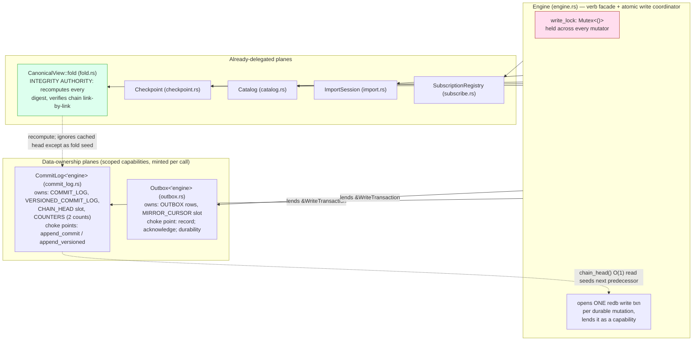
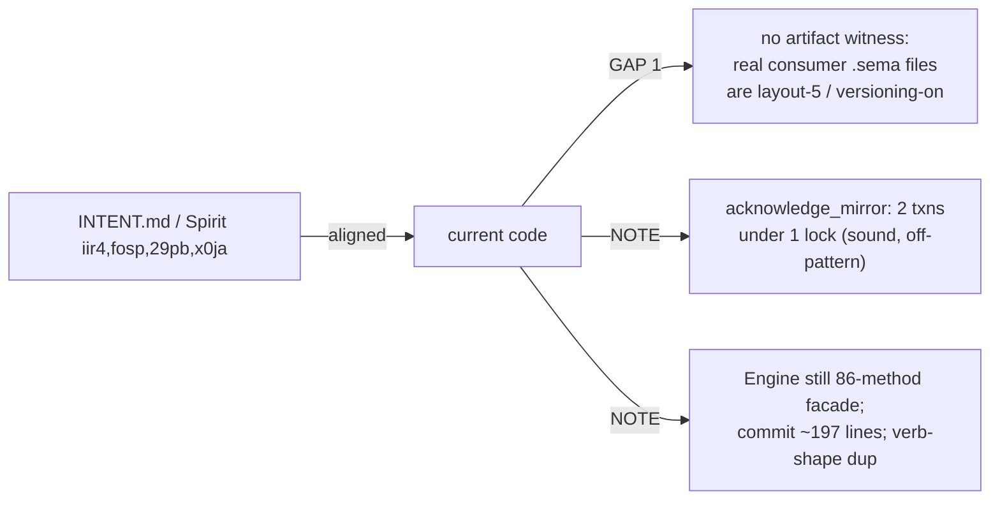

# 690 / 4 — sema-engine (storage engine) audit

**TL;DR.** The load-bearing finding: the storage substrate the whole
state-bearing stack rests on (criome, mind, router, spirit, mirror,
persona all depend on `sema-engine` via `branch = "main"`) just took a
**clean, evidenced refactor + correctness hardening**, and it holds. The
"decompose the Engine god-impl by data-ownership" claim is **real** —
the durable-state planes (`CommitLog`, `Outbox`) now own their tables,
counters, chain head, and the single append choke point; `Engine`
retained the verb facade + the one-write-transaction-per-mutation
coordinator. The single-writer lock is **sound** (one `Mutex<()>` held
across the entire read-compute-write of every mutator + checkpoint +
rebuild + acknowledge; no `&self` mutator skips it; no second writer path
exists). `RecordKey` is a **genuinely closed 2-arm sum** — the enum is
the discrimination, the old fallible decimal-string parse and its dead
`MaterializeIdentifierParse` error are gone, and digest backward-compat
is preserved by hashing the identifier's decimal string. The O(1)
chain-head digest is **actually O(1)** — a point-get on a fixed-key
`CHAIN_HEAD` table, advanced in the same write transaction as each
versioned entry, with integrity still recomputed link-by-link by the
fold (it is an optimization, never the integrity source). **116 tests
pass, observed directly** (`cargo test --offline` at HEAD `73eea24`) —
an artifact witness, not a capability claim. The one consumer-facing
edge worth a bead: the layout 4→5 bump **hard-fails any layout-4 store
that did not opt into versioning** (no log to refold from), and that is
by design but is unwitnessed for the real consumer `.sema` files in the
field.

## What the engine is (and the no-daemon discipline)

`sema-engine` is a **library-only** database engine over the `sema`
storage kernel (redb + rkyv + schema-version guard) and the
`signal-sema` operation vocabulary. There is no shared sema daemon: each
component that needs durable state holds its own `Engine` inside its own
actors against its own `.sema` file. INTENT.md
(`/git/github.com/LiGoldragon/sema-engine/INTENT.md:1-9`) and Spirit
`fosp` (Correction, quoted verbatim in INTENT: *"Sema-engine is the
exclusive interface to the database. No component daemon may make direct
redb calls."*) govern that boundary. The versioned operation log is the
authoritative source of truth and the redb store is a rebuildable
materialized view (Spirit `iir4`, quoted in INTENT.md:11-13).

Boundary discipline is enforced by **architectural-truth witnesses**, not
just behavior tests, exactly as AGENTS.md requires:
`tests/dependency_boundary.rs:43` (`sema_engine_ships_no_daemon_binary`
asserts no `[[bin]]` and no `src/main.rs`), `:62` (no `kameo`/`tokio`/
`signal-persona`), `:93` (no raw `redb =` dependency), `:101` (kernel
deps are git not path); `tests/storage_boundary.rs:93`
(`storage_reader_has_a_read_affordance_and_no_write_affordance` — the
type system is the witness that no durable write bypasses the logged
choke points). All green.

## The decomposition at a glance

The shape: every mutator acquires `write_lock`, computes the next
sequence / snapshot / predecessor-digest / identifier, opens **one** redb
write transaction, and inside it lands the data row + the metadata commit
row + the versioned entry (advancing `CHAIN_HEAD` and the counts) + the
outbox row + the latest-sequence/snapshot counters — atomically. The
planes never open their own transaction for the write path.

## Verified findings (file:line)

### 1. God-impl decomposition by data-ownership — Real

`f074b98` split the durable-state planes off `Engine`. `1afcd01` is the
**merge commit** (two parents: `909eaa0` and the decomposition branch
`f074b98→65a6126→e5e38e8→22b9de1`) that integrates the whole branch onto
trunk — so the apparent "re-add" of `commit_log.rs` in both stats is the
merge net-diff, not a duplicate; both are ancestors of HEAD, clean
feature-branch merge.

- `CommitLog<'engine>` (`src/commit_log.rs:51-255`) is a scoped capability
  borrowing `&'engine sema::Sema`, minted per call at `engine.rs:1189`
  (`log_plane`). It owns the two log tables, the `CHAIN_HEAD` slot, and the
  two count counters (`commit_log.rs:25-44`), and is the single append
  choke point (`append_commit` `:166`, `append_versioned` `:183`).
- `Outbox<'engine>` (`src/outbox.rs:129-248`) is the symmetric plane,
  minted at `engine.rs:1197` (`outbox_plane`); its `record` choke point
  (`:171`) writes only the outbox row into the lent transaction.
- The bridge `Engine::insert_versioned_entry` (`engine.rs:2077-2086`)
  calls `CommitLog::append_versioned` then `Outbox::record` against the
  **same** lent `&WriteTransaction` — so versioned entry + chain head +
  count + outbox row land atomically.

**Discipline check — no free functions.** Scanned all of `src/`: zero
module-top-level `fn`, no `src/main.rs`, no `[[bin]]`. Every function is a
method/associated-function on a data-bearing type or a trait impl. The
newtypes flagged by the ZST scan (`RecordIdentifier`, `EntryDigest`,
`CommitSequence`, `SnapshotIdentifier`, `LogCounts`, the digest/hash
wrappers in `versioning.rs`/`checkpoint.rs`) all carry real data — none is
a ZST namespace. `LogCounts` (`commit_log.rs:261-288`) is a genuine
data-bearing value (two counts) with behavior methods (`next_commit`,
`next_versioned`). Conversions use `impl From` (`OutboxEntry::from`
`outbox.rs:41`, `MirrorHead::from` `:78`, `CommitLogEntry::from` per
ARCHITECTURE.md:395). **Passes** the `skills/rust/methods.md` rule.

Caveat (Partial, not a defect): `Engine` is still an 86-method facade and
the largest residual body is `commit` at ~197 lines (a multi-operation
atomic-write coordinator — legitimately the engine's job, but chunky;
`assert/retract/mutate*` are 64-88 lines each with structural repetition
across the keyed/identified variants). The decomposition pulled out
*state ownership*, not *verb-shape duplication*. Not a violation; a
future simplification surface.

### 2. Single-writer internal lock — Real, sound

`Engine.write_lock: std::sync::Mutex<()>` (`engine.rs:84`).
`write_guard()` (`engine.rs:1816-1820`) locks it, propagating poison via
`expect` (correct: poison means a writer panicked mid-mutation and the
redb txn already rolled back). Every mutator acquires it at the top
before any read-compute step:
`assert_identified:175`, `retract_identified:239`,
`mutate_identified:321`, `assert_keyed:410`, `mutate_keyed:510`,
`retract:592`, `commit:680`, `checkpoint:1306`, `rebuild_from_log:1428`,
`acknowledge_mirror:1604`. (`assert`/`mutate` are thin wrappers that
delegate to the keyed forms which take the guard.)

**Soundness — no double-writer path.** The lock serializes the engine's
own read-compute-write so two `&self` callers cannot read the same chain
head + commit sequence and fork. `Engine` stays `Send + Sync` for
`Arc<Engine>` sharing; the lock is the engine's *own* serializer, not an
`Arc<Mutex>` shared across actors (so it does not break the
no-shared-mutex rule — `engine.rs:74-83` documents this). I checked for a
write path that skips the guard: the only writes are (a) the per-mutation
lent transaction (guarded) and (b) `register_table`/
`register_identified_table` (`engine.rs:124-162`) and `apply_layout_plan`
(`:1752`), which take `&mut self` (registration) or run single-threaded
at `open` before the engine is shared — neither can race a `&self`
mutator. **One residual pattern note:** `acknowledge_mirror`
(`engine.rs:1603-1610`) holds the guard but performs a **read txn** (logged
digest) then `Outbox::acknowledge` opens its **own** `storage.write`
(`outbox.rs:217`) — two redb transactions under one held lock rather than
one lent transaction. Still sound (the held `write_lock` excludes every
other engine writer for the whole span), but it diverges from the
single-lent-transaction pattern the mutators use; the cursor advance is a
single-row idempotent write so atomicity is not at risk.

**Witness (artifact):** `tests/concurrency.rs:119`
(`arc_shared_engine_serializes_concurrent_writers`) spawns 8 threads ×
16 asserts through one `Arc<Engine>`, then asserts the versioned log has
exactly 128 strictly-increasing contiguous unique commit sequences and a
`rebuild_from_log` fold verifies the chain without a `VersionedChainBroken`
— a forked chain or duplicate sequence would fail it. Observed pass.

### 3. RecordKey closed sum + dead-variant drop — Real

`65a6126` replaced the old `RecordKey { kind, value: String }` struct
(which recovered the identifier via a **fallible** `value.parse()` and a
`MaterializeIdentifierParse` error) with a closed 2-arm sum
(`src/record.rs:59-62`): `Domain(String)` / `Identifier(RecordIdentifier)`.

- The enum **is** the discrimination — `kind()` (`record.rs:77`) maps
  arms, no string parse recovers it. `identifier_value()` (`:98-103`) is
  **infallible** (returns the typed identifier from the arm or `None`).
- `MaterializeIdentifierParse` is **gone** from the whole crate (grep:
  absent from `src/*.rs`).
- **Closed:** exactly two arms; ARCHITECTURE.md:75-77 documents the sum;
  no `_ =>` catch-all is needed anywhere (the fold/digest/storage all
  match both arms exhaustively). Genuinely closed, not an open enum.
- **Digest backward-compat preserved:** `update_digest` (`record.rs:109`)
  hashes `kind().digest_tag()` (Domain=1, Identifier=2) then the
  canonical string, where an `Identifier` hashes its **decimal string**
  (`to_owned_string` `:88` → `identifier.value().to_string()`), matching
  every store written before `RecordKey` became a sum. Witnessed by
  `record.rs:239` (`identifier_key_digest_matches_tag_two_and_decimal_
  string_bytes`) and the byte-reconstruction test `:212`.

### 4. O(1) chain-head digest — Real, actually O(1)

`22b9de1` persists the chain head in a dedicated `CHAIN_HEAD` table keyed
by the fixed string `latest_entry_digest` (`commit_log.rs:35-37`).
`chain_head()` (`commit_log.rs:138-142`) is a single `CHAIN_HEAD.get` —
a **point lookup on one fixed key**, O(1), no scan. The write path mints
the next predecessor via `latest_versioned_entry_digest`
(`engine.rs:2058-2059` → `log_plane().chain_head()`). `append_versioned`
(`commit_log.rs:183-191`) advances the slot **in the same write
transaction** as the entry, so the slot can never disagree with the last
entry that transaction wrote. The two log counts get the same treatment
(`counts()` `:149-160` is two fixed-key point-gets; `LogCounts` lets
`ensure_versioned_log_complete`-style comparisons run O(1) instead of
materializing + rkyv-decoding both whole logs).

**Critically, the cached head is an optimization, never the integrity
source.** `CanonicalView::fold` (`fold.rs:147-177`) recomputes
`EntryDigest::from_entry_fields` for **every** entry and rejects on
`previous_entry_digest() != previous || recomputed != entry.entry_digest()`
with a typed `VersionedChainBroken` (`fold.rs:166-169`) — it ignores the
cached slot except as the optional fold seed parameter. Witnessed by
`tests/concurrency.rs:197`
(`cached_chain_head_equals_the_fresh_fold_recomputation` — cached slot ==
last entry digest == fresh-import recomputation) and the whole
`tests/tamper.rs` suite (11 tests: `forged_log_row_breaks_the_digest_
chain_at_its_successor`, `rewritten_payload_fails_per_entry_digest_
recomputation`, etc.). Observed pass. Spirit `x0ja` (blake3 for all
content addressing) is satisfied — `EntryDigest`/`SegmentDigest`/
`StoreSchemaHash` are all blake3.

### 5. Layout 4→5 + refold-on-open — Real, one consumer caveat (Partial)

`22b9de1` bumped `STORAGE_LAYOUT` to 5 (`engine.rs:57`); `e5e38e8` made
the open path **refold** the layout-introduced derived slots (chain head
+ two counts) from the store's complete versioned log when a layout-4
store opened. `validated_storage_layout` (`engine.rs:1694-1747`) returns
a `LayoutOpenPlan`; `apply_layout_plan` (`:1752-1767`) executes it only
**after every read-only validation passes** (an open that rejects a store
must not mutate it). The refold lives on the owning plane:
`CommitLog::rebuild_derived_slots` (`commit_log.rs:206-238`) recomputes
the whole chain from genesis (`CanonicalView::fold(&[], &entries, None)`)
before writing any derived slot — verification-by-recomputation, the
rebuilt head can never trust a stored digest.

Witnesses (`tests/layout_rebuild.rs`): `:141`
(`layout_four_store_with_versioned_log_rebuilds_derived_slots_on_open`),
`:305` (`old_layout_store_without_versioned_log_still_hard_fails_typed`),
`:345` (`reopening_a_layout_five_store_does_not_rebuild`). Observed pass.

**Caveat / consumer edge:** a layout-4 store that did **not** opt into
versioning (empty versioned log) cannot refold its derived slots and
**hard-fails** with `StorageLayoutMismatch` (`engine.rs:1717-1725`). That
is intentional (state loss is unacceptable — Spirit `29pb`; pre-versioning
stores are owned by the previous-engine `StoreMigration`), and spirit's
`Cargo.toml` already pins `sema-engine-previous`/`sema-engine-layout3`
behind a `production-migration` feature for exactly this. But the audit
finds **no witness that real consumer `.sema` files in the field are
either layout-5 or versioning-opted-in** — the hard-fail is a unit-test
truth, not an artifact-verified migration of the actual consumer stores.
This is the gap below.

### 6. Portable checkpoint bytes — Real

`da959d6` added `PortableCheckpoint` (rkyv-serialized checkpoint artifact)
with `from_checkpoint` / `to_portable` / `as_bytes` / `into_bytes` /
`decode` (`src/checkpoint.rs`, verified via the commit diff). Realizes the
INTENT.md fold surface ("a digest verifies; a segment restores",
INTENT.md:44-50). Tamper witnesses in `tests/tamper.rs` cover the
checkpoint integrity path (forged segment, doctored metadata, segment
count mismatch). Observed pass.

### 7. Domain keys vs identifiers — Real

`909eaa0` distinguished domain keys from engine identifiers across the
log/view boundary (the precursor to the `65a6126` closed sum;
`RecordKeyKind` Domain/Identifier with distinct digest tags so a domain
key and an engine identifier with the same text never collide in the
hash — ARCHITECTURE.md:367). Folded into the `RecordKey` finding above.

## Build / test evidence

`cargo test --offline` at HEAD `73eea24` (== audit target), run once,
**observed**: **116 tests passed, 0 failed** across 16 test binaries plus
unit tests (per-binary: engine 22, tamper 11, subscriptions 9, concurrency
8, family_identity 11, fold/import/operation_log/layout_rebuild/outbox/
seam_gap_falsification/signal_frame_seam/checkpoint/storage_boundary/
dependency_boundary the remainder; doctests 0). This is an **artifact**
witness (real production library build, prior target/ present so deps
resolved offline), matching the `f074b98` commit message's "116 tests"
claim exactly. No warnings surfaced in the run tail.

## Drift / gaps

- **Drift:** none material. ARCHITECTURE.md reflects the decomposition
  (CommitLog/Outbox/chain-head/RecordKey-sum all documented, lines 38-40,
  75-77, 455). Code matches INTENT.md and the cited design.

## Coherence with the rest of the stack

`sema-engine` is the storage floor for **criome, mind, router, spirit,
mirror, persona** (all `branch = "main"`; also referenced by introspect,
lojix, upgrade, repository-ledger, domain-criome, terminal,
schema-rust-next, orchestrate — verified via `grep` over
`/git/.../Cargo.toml`). Every one tracking `main` inherits the layout-5
bump on next dependency refresh. The hardening (lock soundness, closed
`RecordKey`, O(1) head) strictly improves them. The library-only / no-
daemon / no-shared-sema discipline is exactly the substrate the other
phase-1 engines (criome's per-Unix-user store, spirit's chain, mirror's
outbox shipper) build on — those audits should confirm each consumer
opens its **own** `Engine` and never reaches around the logged choke
points (the `StorageReader` read-only handoff is the only transitional
escape and it has no write affordance).

## Suggested operator beads

- **sema-engine: artifact-verify consumer store layouts** (High) — Add an
  e2e/migration witness (or a deploy-time check) that the live `.sema`
  files for criome/mind/router/spirit/mirror are layout-5 or
  versioning-opted-in before the layout-4 hard-fail bites a real store on
  the next `main` refresh; close the gap between the unit-test truth and
  the field.
- **sema-engine: unify acknowledge_mirror onto the lent-transaction
  pattern** (Low) — Have `acknowledge_mirror` lend one write transaction
  to `Outbox::acknowledge` (read logged digest + advance cursor in one
  txn) to match every other mutator's single-transaction coordination
  shape; current path is sound but off-pattern.
- **sema-engine: collapse verb-shape duplication in the Engine facade**
  (Low) — The keyed/identified assert/mutate/retract bodies (64-88 lines
  each) and `commit` (~197 lines) repeat the
  sequence/snapshot/entry/counts/lent-txn scaffold; extract the shared
  write-coordination shape so the facade thins further. Quality, not
  correctness.
