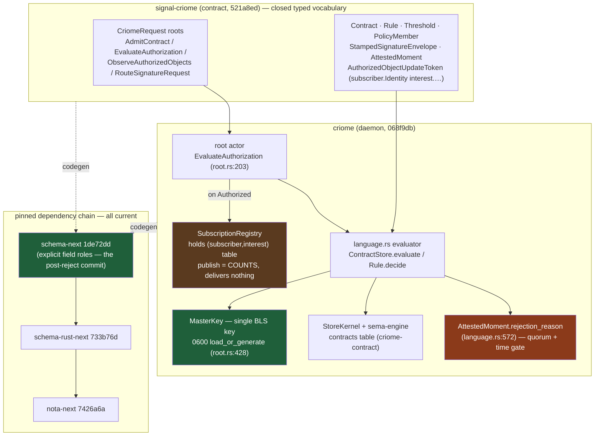

# 690 / 5 — criome + signal-criome engine audit

**TL;DR.** criome is the week's biggest mover and the audit is mostly
good news: the **strict-contract port landed and is green** (criome
`068f9db`, signal-criome `521a8ed`), and the two highest-severity items
from design-report 684 that blocked the dependency chain are now
**resolved** — signal-criome's schema is migrated to the strict
positional/explicit-role grammar and the whole stack pins `schema-next`
at `1de72dd` (the exact post-rejection commit 684 said the refresh
needed). Built and observed green offline at the audited HEADs: **70
tests pass** (criome 50, signal-criome 20). The two load-bearing
crypto-safety woes 684 flagged are **still real and unaddressed**: (Woe 3)
the quorum verifier enforces only `required <= authorities.len()`, **not**
`k > n/2` majority — partition-fork remains undetected at both guard
sites; and (Woe 5) BLS verification is **still a per-signature pairing
loop**, no `FastAggregateVerify`, so the direct-lane latency claim
degrades exactly as 684 predicted. One **drift** stands out: the
post-684-clarified `m0p2` ("router is the SOLE operational matcher;
criome keeps NO operational delivery registry, only observation/audit")
is contradicted by criome still holding an interest-matching subscription
table in `SubscriptionRegistry` and by its own `ARCHITECTURE.md` prose;
the code delivers nothing (consistent) but still *matches* (the role
m0p2 reassigned to the router). EscalateToPsyche dead-letter (gc0n),
the a-priori attested window (ay3y), and single-key `0600` custody
(psc6) are all confirmed correct-by-intent, not defects.

## What changed and whether it is real

| Change | Commit(s) | Status | Evidence |
|---|---|---|---|
| Strict signal-criome contract port (daemon) | criome `068f9db` | **Real** | builds offline 25.8s; 50 tests green (`tests/language.rs` 16, `daemon_skeleton.rs` 21, lib 11, actor_discipline 2) |
| Strict schema port (contract) | signal-criome `ca3624c` | **Real** | `schema/lib.schema` rewritten 430 lines; builds 8.9s; 20 tests green (round_trip 17, canonical 3) |
| Schema migrated off retired field syntax (684 Woe 4) | `ca3624c` | **Real / RESOLVED** | structs now `name.Type` (lib.schema:256-291); newtypes are bare `Name Type` (lib.schema:57-73); pins `schema-next 1de72dd` |
| Persist policy contracts + stamp quorum sigs | criome `3c05122` | **Real (artifact)** | `StoredContract` + `contracts` table family `criome-contract` (tables.rs:30,42,215,448-456); admit-then-persist in `store_contract` (store.rs:442-450) |
| Evaluate schema-emitted policy contracts | criome `03d2b32` | **Real** | full evaluator `language.rs:280-355`; production path `root.rs:203-237` |
| Bind policy evaluation to attested moments | criome `92a703b` | **Real** | `OperationStatement` folds `stamp.proposition.digest()` (language.rs:208-218); `envelope.stamp == self.stamp` guard (language.rs:530) |
| Authorized-object pulse (refs not payloads) | criome `0cf326c`/`b9bc29f`/`4250cbb` | **Partial** | emits `AuthorizedObjectUpdate` references (root.rs:210-224); but see Drift 1 — matcher lives in criome, delivers nothing |
| Interest-bearing authorized-object tokens | signal-criome `e33ea04`; accessors `521a8ed`/`a04e595` | **Real** | `AuthorizedObjectUpdateToken { subscriber.Identity interest.AuthorizedObjectInterest }` (lib.schema:266-269); filter (subscription.rs:217-229) |
| Policy contract wire surface | signal-criome `947f271` | **Real** | `Contract`/`Rule`/`Threshold`/`PolicyMember` consumed by `language.rs:9-14` |
| Attested-moment policy evidence + naming | signal-criome `8459fb4`/`f10fb54` | **Real** | `StampedSignatureEnvelope` (lib.schema:325) in Evidence (191) + Grant (419); bare `TimeSignature` exception preserved |
| Contract-programmed time pulses (doc + POC) | criome `255660a`; schedule/run | **Real (POC)** | `ScheduleContractTimeCheck`/`RunDueContractChecks` (subscription.rs:155-190); ARCHITECTURE.md:117-126 |
| Explicit psyche escalation outcome | criome `9719703` | **Real (inert by design)** | `EscalateToPsyche` verdict (language.rs:318) propagated through All/Any (650-671); 37 lines of tests |
| Crayome→Criome naming fix | criome `a04157a`/`865f8b3` | **Real / complete** | schema file renamed; zero `Crayome` residue in src/schema/docs |
| Single master BLS key, `0600` custody (psc6) | (standing) | **Real (artifact)** | `load_or_generate` at daemon startup `root.rs:428`; atomic `create_new(0o600)` + symlink reject (master_key.rs:65-102) |

### Build / test precision (artifact vs capability)

Observed **green offline** at the audited HEADs (real artifact, not a
sketch): `cargo build --offline` succeeded for both repos; `cargo test
--offline` ran criome's full suite (50 pass) and signal-criome's
`nota-text` suite (20 pass: 17 round-trip + 3 canonical-example). The
round-trip and canonical tests are **capability** witnesses (they prove
the NOTA codec round-trips and the canonical example parses *in a test*),
not production-artifact-discipline claims. The contract-persistence path,
by contrast, is a stronger **artifact** claim: `store_contract` admits
then writes to a real sema-engine table and evaluation rebuilds the
`ContractStore` from the persisted rows (`store.rs:442-473`), so admission
validation and evaluation run over durably-stored contracts, not an
in-memory fixture.

## The engine at a glance



## Governing-intent verification

### m0p2 — references not payloads; router sole matcher; criome keeps no operational delivery registry → **DRIFT**

`m0p2` was clarified this session (confirmed live via Spirit) to:
"*the router, as the sole operational matcher for all non-direct message
passing, matches component subscriptions and fans the reference out…
Criome keeps no operational delivery registry; any criome-local
subscription surface is observation and audit only.*"

- **References not payloads: CONFIRMED.** `root.rs:210-224` publishes an
  `AuthorizedObjectUpdate` carrying `AuthorizedObjectReference {component,
  digest, kind}` + contract digest + decision + stamp — no object
  payload. ARCHITECTURE.md:105-110 states the reference-only discipline.
- **No delivery: CONFIRMED (narrow sense).**
  `publish_authorized_object_update` (subscription.rs:142-153) only
  `.count()`s matching subscribers and pushes the update to a local
  `Vec`; it delivers to no one. The unchanged-since-684 count-only stub.
- **No operational matcher in criome: VIOLATED.** criome's
  `SubscriptionRegistry` still **holds an interest table**
  (`authorized_object_subscriptions: Vec<AuthorizedObjectUpdateToken>`,
  subscription.rs:24) and **matches against it** by interest
  (`token.interest.matches_update(&update)`, subscription.rs:149;
  `AuthorizedObjectFilter` impl 217-229). That interest-matching is the
  exact "operational matcher" role m0p2 now assigns **solely to the
  router**. criome's own `ARCHITECTURE.md:110-116` still describes this
  as criome filtering "snapshots **and publications** by that declared
  interest," with socket fan-out as "a transport follow-up" — i.e. the
  doc and code both still place the matcher inside criome. This is the
  registry-owner fork (684 Woe 1), now psyche-decided router-sole but
  **not yet reflected in criome's code or docs.**

### l2ha — router + subscribers own fan-out → **consistent, unrealized**

No fan-out is built in criome (correct: it should not be). The router
side (`Attend`/`Withdraw` + attendance table) is the operator-unblocked
follow-up; absence here is intent-faithful, not a defect.

### ay3y — attested moment crystallized PAST, a-priori window → **CONFIRMED (window-expiry branch)**

The window is **inside the signed digest, fixed before any signature**:
`AttestedMomentStatement::to_signing_bytes` folds
`self.proposition.digest()` (language.rs:226-232), and the proposition's
`window {opens_at, closes_at}` is part of that digest. The verifier uses
`closes_at()` = `proposition.window.closes_at` (language.rs:568-570) as
the crystallized closure instant — **NOT** measured at the k-th
signature. `ay3y` phrases closure as "at the last signature **or at
window expiry**"; the code realizes the *window-expiry* branch, which
preserves ay3y's load-bearing safety property (a non-forgeable monotonic
lower bound on now). "Measured closure at last signature" is not
implemented — a value-prop reframe, not a code defect, exactly as 684
Woe 2 concluded.

### gc0n — EscalateToPsyche is an inert dead-letter, not a defect → **CONFIRMED**

`Self::EscalateToPsyche => Ok(EvaluationDecision::EscalateToPsyche)`
(language.rs:318) returns a typed verdict that propagates through `All`
(language.rs:653) and `Any` (language.rs:670). gc0n (live) states: "until
that UI exists the EscalateToPsyche outcome is intentionally an inert
dead-letter and not a defect." The terminal human rung is UI-gated by
design. Correct.

### z9d6 — content-addressed composable contracts → **CONFIRMED**

Contracts are keyed by `ContractDigest` (`Contract::digest()`); admission
rejects dangling references and validates shape before a contract becomes
addressable (`ContractStore::admit` → `ContractAdmission::validate_against`,
language.rs:116-126, 245-254). `ObjectMember`/`All`/`Any`/`TimeSwitch`
rules compose by digest reference (language.rs:322-337). Composable and
content-addressed.

### psc6 / q1le — key custody → **CONFIRMED (single key today; q1le is the target)**

Single master BLS key generated on first run and persisted `0600`:
`load_or_generate` (master_key.rs:56) is wired into production daemon
startup at `root.rs:428`. Custody discipline is strong — atomic
`create_new().mode(0o600)` so the secret never exists world-readable
(master_key.rs:94-99), symlink/regular-file check and `mode & 0o077`
reject on load (master_key.rs:65-80). The **q1le multi-key encrypted
store** (confirmed live: "extends psc6 from a single generated master BLS
key to a managed multi-key store") is the **target, not built** —
`MasterKey` holds exactly one `SecretKey` (master_key.rs:38-41).
INTENT.md:58-67 matches: single key today.

## Critical design checks (from report 684) — the load-bearing two

### Woe 3 — quorum-majority NOT enforced → **REAL, unaddressed, untested**

684 asked: does the verifier enforce `k > n/2` majority or only
`required > authorities.len()`? The answer is the latter, at **both**
guard sites — neither checks majority. Quoted guards:

Runtime, attested-moment quorum (`language.rs:574-582`):

```rust
let required = self.proposition.required_signatures.into_u16();
if self.proposition.window.opens_at.into_u64()
    >= self.proposition.window.closes_at.into_u64()
    || required == 0
    || required > authorities.len() as u16
    || DuplicateIdentityScan::new(authorities).has_duplicates()
{
    return Some(EvaluationRejectionReason::TimeNotProven);
}
```

Admission, policy `Threshold` (`language.rs:413-418`):

```rust
let required = self.required_signatures.into_u16();
if required == 0 || required > self.members().len() as u16 {
    return Err(AdmissionError::rejected(
        ContractAdmissionRejectionReason::ThresholdUnsatisfiable,
    ));
}
```

Neither has the `required > n/2` term. A `2-of-5` quorum admits and
verifies. In partition, `{A,B,C}` and `{D,E}` each reach a 2-signature
quorum and can mint AttestedMoments / authorize objects over divergent
content with no cryptographic fork detection — the partition-tolerance
intersection property is unprotected. **No test exercises sub-majority,
partition, or majority enforcement** (grep over `tests/language.rs`:
`majority|n/2|partition` → only string literals `b"network fork"`, not a
test of the property). This is the one-line safety fix 684 named, still
open. Load-bearing for fork-safety.

### Woe 5 — BLS verification is still a per-signature pairing loop → **REAL, unaddressed**

684 asked: is BLS aggregate verify present (`FastAggregateVerify` shape)
or still a per-signature loop? Still a loop. The quorum check
(`language.rs:588-601`) calls single-signature `verify_bls` once per
signature over the identical `statement`:

```rust
for signature in self.signatures() {
    if !authorities.contains(&signature.signer) || satisfied.contains(&signature.signer) {
        continue;
    }
    let Some(admitted_key) = registry.public_key(&signature.signer) else { continue; };
    if matches!(signature.envelope.scheme, SignatureScheme::Bls12_381MinPk)
        && &signature.envelope.public_key == admitted_key
        && admitted_key.verify_bls(&signature.envelope.signature, &statement)
    {
        satisfied.push(signature.signer.clone());
    }
}
```

`master_key.rs` confirms it: the `VerifyBls` trait has **only**
`verify_bls(&self, signature, message) -> bool` (master_key.rs:125-146),
a single `parsed_signature.verify(...)` pairing call. There is **no**
`aggregate_verify_bls` / `FastAggregateVerify` / `blst` aggregate path
anywhere in the crate. For a k-of-n quorum the verifier pays k full
pairings instead of one aggregated check — the latency degradation 684
quantified (headline 5-10x → ~1.5-2x for small quorums). Because all k
signatures bind the identical preimage, `FastAggregateVerify` is directly
applicable. Unchanged since 684; load-bearing for the direct-lane latency
claim.

## Cross-check against reports 674 / 677 / 678 / 684

This audit corroborates 684's woe list and **upgrades the status** of two
of its high-severity items:

- **684 Woe 4 (schema migration) → RESOLVED.** 684 reported signal-criome
  on the retired `{ value String }` syntax pinned to `schema-next
  e7216260` "which masks the failure." Now: schema migrated (structs
  `name.Type`, newtypes bare `Name Type`), and pinned to `schema-next
  1de72dd` — the exact commit 684 said the refresh needed to reach.
  signal-standard / peer-verb additions are unblocked on this axis.
- **684 Woe 1 (registry-owner fork) → DECIDED but not yet realized.** The
  psyche decision (router-sole) is captured in `m0p2`; criome's code and
  ARCHITECTURE.md have not yet been brought into line (Drift 1 above).
- **684 Woe 3 / Woe 5 → still real**, both verified here at current HEAD
  with quoted guards (above).
- 684's "Resolved this session" items (quorum-member distinctness,
  EscalateToPsyche-not-a-woe, signature-envelope placement) all hold at
  this HEAD: `DuplicateIdentityScan` (language.rs:579, 619-628) and the
  `satisfied.contains(&signer)` guard (language.rs:589) prevent padding;
  EscalateToPsyche dead-letter confirmed.

## Coherence with the rest of the stack

criome consumes the **same** codegen chain the codegen-tier audits cover
(`schema-next 1de72dd`, `schema-rust-next 733b76d`, `nota-next 7426a6a`),
so the strict-positional port here is the downstream proof that the
grammar change propagated cleanly to a real component contract — a useful
cross-engine witness for the coherence critic. The pulse contract
(`AuthorizedObjectUpdate` references) is the seam to the **router** audit:
criome emits references and (per the decided m0p2) the router must own the
matcher — so the router audit should confirm whether the router's
`Attend`/`Withdraw` + attendance table exists yet (684 said
signal-router had zero subscription surface). The `signal-standard`
shared-library question (does criome re-declare vs consume) is for the
mentci/completeness audits; criome's BLS quorum types are still
criome-local (intent: lift to signal-standard only once a second
component proves the shape).
