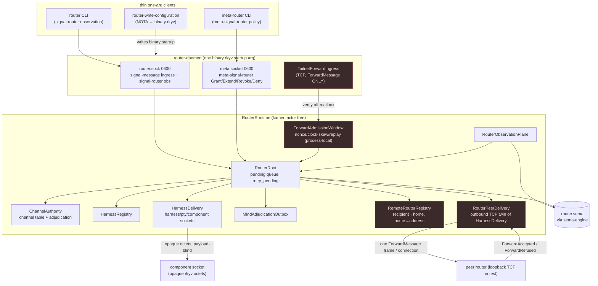
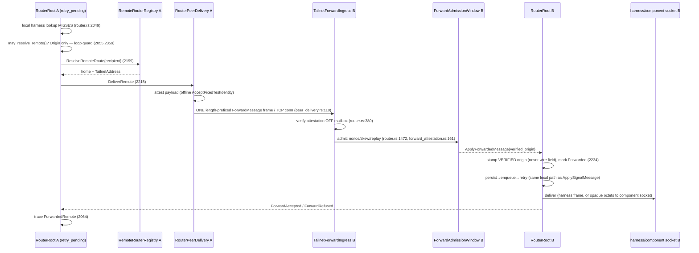

# 690 · Engine audit — router (the routing/transport engine)

**Audited HEAD `430f1de` (`port persona integration to current contract`).**

## TL;DR — the load-bearing finding

The router's last-week work is **real and green where it claims transport, and
honestly scoped where it does not.** I ran the suite offline: **64 tests pass
that I observed directly** — the milestone-2 two-router forward, 32
actor-runtime-truth, 12 observation-truth, 16 smoke, 2 schema-generated, 1
no-shared-locks. The networked router-to-router forwarding (`075ca73`) moves
**real length-prefixed `signal-router::ForwardMessage` frames over a real TCP
socket** between two `RouterRuntime`s — but the witness binds both ends to
`127.0.0.1:0` in-process, so it is a **same-host loopback-TCP capability claim,
not a cross-host artifact**: no test, nix check, or witness drives the frame
between two machines over tailnet/Yggdrasil, and the `.criome` service-name
resolution + literal-Yggdrasil-address lowering described in ARCHITECTURE §2.9.1
is **design prose with zero code or test behind it**. The router is genuinely
**payload-blind** (it routes on the envelope `to`/`from`, never decodes the
opaque `RoutedContractObject` octets — confirmed at `harness_delivery.rs:130`).
The single biggest **gap against governing intent**: the designer-688 #2 handoff
— the `Attend`/`Withdraw` subscription surface + durable attendance table keyed
by the signal-standard `Differentiator`, the mechanism that makes m0p2/l2ha's
"router is the sole operational matcher / router+subscribers own object-update
fan-out" *true* — is **not in router at all** (zero references in `src/`, and
`signal-router`'s contract declares no such root). The router can forward and
deliver point-to-point; it cannot yet *match subscriptions and fan out object
references*, which is the very job m0p2 names for it.

## What the engine is now

Red = the milestone-2 networking surface (real over loopback TCP, unproven
cross-host). The **subscription/fan-out matcher named in m0p2/l2ha does not
appear in this diagram because it does not exist in the code yet.**

## The forward path, precisely (the seam)

## Verified changes

| Commit | Claim | Status | Evidence |
|---|---|---|---|
| `075ca73` | Networked router-to-router forwarding (milestone 2) | **Partial** | Real over loopback TCP; cross-host unproven. `src/peer_delivery.rs:97-119` (one `TcpStream::connect`, one frame); `src/router.rs:1124-1149` eager bind in `RouterRuntime::on_start`; `src/router.rs:2030-2226` seam in `retry_pending`; test `tests/end_to_end_remote_forward.rs:325-607` binds both ends `127.0.0.1:0`. **I ran it: 1 passed.** |
| `075ca73` | Payload-blind beyond envelope | **Real** | Router routes on `message.to`/`message.from` only; `RoutedContractObject` octets are never decoded — `src/harness_delivery.rs:130-146` writes raw octets to the component socket under a length-prefix; verifier digests octets opaquely (`src/forward_attestation.rs:85-94`). |
| `075ca73` | Loop guard (forwarded msgs never re-resolved) | **Real** | `ForwardMarker::{Origin,Forwarded}`; `may_resolve_remote()` gates remote resolution to `Origin` only — `src/router.rs:2055,2316-2361`. |
| `075ca73` | Verified origin stamped, never wire-claimed field | **Real** | `apply_forwarded` stamps `SignalConnectionClass::network(verified_origin)`, ignores `payload.from` for auth — `src/router.rs:2234-2246`. |
| `075ca73` | m3 admission scaffold (replay/skew window) | **Real (process-local)** | `ForwardAdmissionWindow` rejects nonce mismatch, `ClockSkew`, `ReplayDetected`; checked in `RouterRuntime::handle(ApplyForwardedMessage)` before apply — `src/router.rs:1472-1478`, `src/forward_attestation.rs:161-205`. Durable SEMA replay state explicitly deferred (INTENT.md:130-135). Replay refusal asserted in e2e `tests/end_to_end_remote_forward.rs:585-601`. |
| `37f9387` | Accept routed contract objects over forward ingress | **Real** | `ForwardedMessagePayload.routed_objects` carried into pending and the digest covers them — `src/forward_attestation.rs:85-94`; test `attestation_digest_covers_routed_contract_object_octets` (`src/forward_attestation.rs:371-390`). |
| `629ca92` | Deliver routed objects to component sockets | **Real (inbound only)** | `deliver_to_component_socket` (`src/harness_delivery.rs:130`), wired through `DeliverHarness.routed_objects` (`src/router.rs:2128`); e2e drives a `signal-mirror::NotifyObject` opaque object to a `ComponentSocket` witness (`tests/end_to_end_remote_forward.rs:537-581`). |
| `dc9a3bb` | Port to strict schema contracts | **Real** | `schema/signal.schema` fields became positional structural field roles (`recipient Recipient` → `Recipient`), matching the codegen grammar change — `git show dc9a3bb -- schema/signal.schema`; consumers updated across `src/router.rs`, `config.rs`, `forward_attestation.rs`, tests. Suite green (I ran it). |
| `4faee08` | Port nexus frame to schema generics | **Real** | `schema/nexus.schema` now declares `(Work …)` / `(Action …)` generic frames and applies them — the code-is-data generics from the codegen arc; `src/schema/nexus.rs` regenerated (−298/+270). `tests/schema_generated.rs` green. |
| `430f1de` | Port persona integration to current contract | **Real** | `src/adjudication.rs`, `channel.rs`, `supervision.rs`, `tables.rs` updated; `tests/{actor_runtime_truth,observation_truth,smoke}.rs` adjusted and green (I ran 32+12+16). |

## Governing-intent cross-check

- **`57f9` (router owns the standardized routing protocol; payload-blind):**
  **Honored.** `RoutedContractObject` = contract name + operation + declared
  size + opaque octets; the router carries it as an envelope and never decodes
  it (`harness_delivery.rs:130`, `forward_attestation.rs:85`). The declared-size
  vs actual-octet check (`harness_delivery.rs:148-165`) validates the *envelope*,
  not the *payload* — consistent with payload-blindness.
- **`d6he` (spirit→criome→router→mirror; router transport-only):** **Honored in
  shape.** The forward carries an authenticated object notice to a peer; the
  receiving side delivers an opaque `signal-mirror` object to a component socket.
  The criome attestation is the offline stand-in (`AcceptFixedTestIdentity`);
  the real criome client is the named milestone-3 seam.
- **`lt44` (two transport lanes: router general fabric + direct criome lane):**
  **Partially honored.** Router owns the general router-to-router lane (real over
  loopback). The criome direct peer lane is not router's concern and is correctly
  absent here. Tailnet confidentiality + BLS per-frame authenticity are assumed,
  not exercised.
- **`m0p2` / `l2ha` (router is the SOLE operational matcher; router + subscribers
  own object-update fan-out):** **NOT yet realized.** The router does
  point-to-point routing (recipient → harness/peer) but has **no subscription
  matcher and no fan-out**: it cannot take an authorized-object reference and
  match it against subscribed components. This is the load-bearing missing
  mechanism (see gaps).

## The designer-688 #2 handoff — stated precisely

Report `688-handoff-to-system-designer.md:22-28` named the system-designer #2
build as: *"Build the `Attend`/`Withdraw` surface … + a durable attendance table
keyed by the signal-standard `Differentiator`."* **Status in router: NOT BUILT.**
- `grep -rn 'Attend|Withdraw|attendance|Differentiator|Subscribe|subscription|StreamingReply' src/` returns **nothing**.
- `signal-router/schema/` declares **no** `Attend`/`Withdraw`/`Subscribe` root.
- ARCHITECTURE.md §4 lists future push subscriptions as an explicit *future*
  invariant ("Future router-side push subscriptions … follow the canonical
  lifecycle"), and §1 marks subscription push as "follows the canonical
  five-state lifecycle" prose — i.e. designed, not implemented.

So the answer to the prompt's precise question: the Attend/Withdraw subscription
surface + durable attendance table is **not yet in router** — neither in the
component crate nor in its `signal-router` contract. It remains an open
operator/system-designer build.

## Gaps

| Gap | Severity | Suggested operator bead |
|---|---|---|
| No subscription matcher / object-reference fan-out — m0p2/l2ha's "sole operational matcher" is not realized; router only does point-to-point. | **High** | `router: add Attend/Withdraw subscription surface + durable attendance table keyed by signal-standard Differentiator, and a fan-out path that matches an authorized-object reference to subscribers (m0p2/l2ha, designer-688 #2)` |
| Cross-host transport is unproven — every forward test binds `127.0.0.1:0` in-process; no two-machine / tailnet / Yggdrasil witness. | **High** | `router: add a cross-host forward witness (two daemons on two hosts over tailnet) so milestone-2 is an artifact, not a loopback capability` |
| `.criome` service-name resolution + literal-Yggdrasil-address lowering (ARCHITECTURE §2.9.1, INTENT) has zero code/test — startup-fails-closed-on-mismatch invariant is prose only. | **Medium** | `router: implement + test the .criome service-name → literal Yggdrasil socket lowering and the fail-closed startup binding audit (ARCHITECTURE §2.9.1)` |
| Outbound internal-submission forwarding drops routed objects — `RouterPeerDelivery::payload_for` hardcodes `Vec::new()` (`peer_delivery.rs:79`); only the *direct ForwardMessage ingress* path carries objects, so a locally-submitted message that resolves to a remote route cannot forward its routed objects. | **Medium** | `router: carry pending.routed_objects in RouterPeerDelivery::payload_for so internal-submission remote forwards transport objects, not just direct ingress` |
| Replay/freshness window is process-local memory only — a daemon restart forgets seen nonces; ARCHITECTURE §2.9 names `router-forward-replay` SEMA state as future. | **Medium** | `router: persist forward replay/freshness state to router.sema (router-forward-replay family) so replay defense survives restart` |
| Forward refusals collapse distinct failures to `RecipientUnknown` — actor-call errors and runtime refusals both map to `RecipientUnknown` (`router.rs:401-407`), losing the real reason on the wire. | **Low** | `router: map forward-application failures to distinct RouterForwardRefusalReason variants instead of collapsing to RecipientUnknown` |
| No nix-check witness observed this session — I ran `cargo test` (real) but not `nix flake check`; the commit *claims* nix green. The ARCHITECTURE constraint-test table lists ~30 `nix build .#checks…` witnesses I did not execute. | **Low** | `router: confirm nix flake check is green on 430f1de in CI and record the witness (cargo-test green observed; nix unobserved)` |

## Drift flags

- **ARCHITECTURE §2.9.1 over-claims relative to code.** The `.criome`
  service-name binding, fail-closed startup audit, and literal-Yggdrasil
  lowering are written as component invariants (§4: "Networked Router
  live-fabric configuration may use a service-scoped `.criome` name … startup
  fails closed if the audited service name does not resolve to that same
  address") but no code or test implements resolution or the fail-closed check.
  This is design-ahead-of-code drift — acceptable as documented direction, but
  the invariant phrasing reads as enforced when it is not.
- **Loopback labeled "tailnet" throughout.** `TailnetForwardIngress`,
  `TailnetAddress`, `offline_listening` all carry tailnet names while every
  exercised path is loopback. Naming is aspirational; the artifact is same-host.
  Not a bug, but a reader could mistake capability for deployment.
- **`signal-router` pinned to a branch in the audited window.** `075ca73` notes
  `signal-router pinned to branch router-network-transport (74484ac3)`. Whether
  that contract branch has since merged to main is outside this repo's HEAD; the
  cross-cutting/coherence critic should confirm the contract pin is on a merged
  ref, not a dangling branch.

## Coherence notes (how router connects to the other engines)

- **Toward criome (`5-criome.md`):** the `ForwardAttestationVerifier` trait is
  the exact criome seam — milestone-2 ships `AcceptFixedTestIdentity`, milestone
  3 swaps a criome client behind the same trait without touching routing. The
  coherence critic should check the criome pulse contract (authorized-object
  reference shape) matches what router would need to *match and fan out* once
  the subscription surface lands — today they don't meet because router has no
  matcher.
- **Toward the codegen engines (`1`–`3`):** router consumes the strict
  positional grammar (`dc9a3bb`) and the code-is-data generic frame
  (`4faee08`, the `(Work …)`/`(Action …)` nexus frame) — it is a real consumer
  of the schema-language → component-codegen arc, and its green suite is
  evidence the grammar port did not break a downstream daemon.
- **Toward mirror / spirit (`7-spirit.md`):** the e2e drives a real
  `signal-mirror::NotifyObject` object end-to-end as opaque octets, realizing
  the `d6he` transport leg in test form. The mirror fetch/restore action is not
  router's concern and is correctly absent.
- **Toward signal-standard (`8-mentci.md`):** the designer-688 attendance table
  is to be keyed by the signal-standard `Differentiator` — router does not yet
  import or use it, so the "signal-standard consumed not re-declared" coherence
  check is vacuously satisfied here (nothing consumed) and becomes load-bearing
  only when the subscription surface is built.
