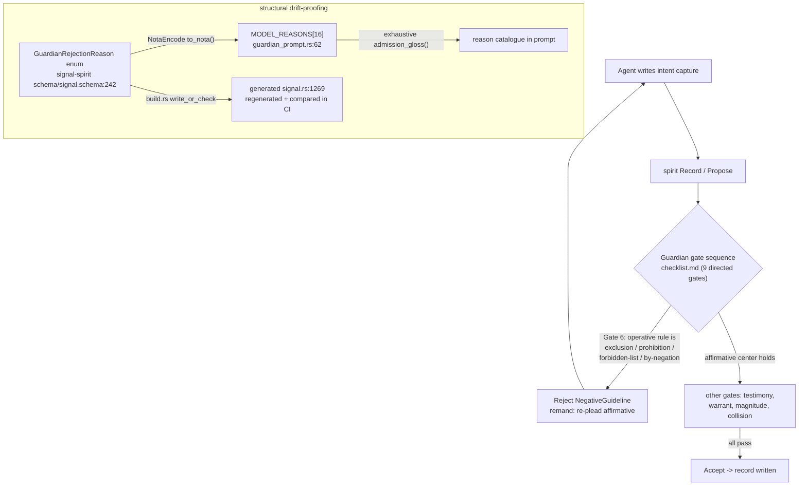

# 690/7 — spirit + signal-spirit engine audit

Kind: Audit. Topic: spirit (production intent engine) + signal-spirit (its
ordinary contract). HEADs audited: spirit `fb14aaa`, signal-spirit `ee5a98e`.
Deployed CLI/daemon version: spirit `0.14.0`, signal-spirit `0.7.0`.

## TL;DR — the load-bearing finding

The most operationally-relevant change for psyche-facing agents landed and is
**artifact-real on the contract side, capability-real on the judgment side**:
the guardian now has a closed **`NegativeGuideline`** rejection reason
(signal-spirit `e5f432b`) and a corresponding **affirmative-guidance gate**
(spirit `6092b80`, checklist Gate 6) that **remands any intent capture whose
operative rule is framed primarily as an exclusion, prohibition, forbidden-
wording list, or definition-by-negation**, asking the agent to re-plead the
positive shape. The enum atom is wired into the *generated, regenerate-and-
compared* contract (build.rs `write_or_check`) and round-trips through NOTA in
a committed CI test — that is artifact discipline. The *semantic enforcement*
(the LLM judge actually returning `NegativeGuideline` for a negative-framed
record) is verified only by `#[ignore]`d live-DeepSeek scenarios — a capability
claim, not a CI-green artifact. **The single most important downstream
consequence is that `skills/intent-log.md` and `skills/spirit-cli.md` are now
stale**: spirit-cli.md still says `ResolveClarification` is "**not** in the
deployed contract" and prescribes a manual pass (it landed, `717a3fe` +
`2ed1c76`, with a green process-boundary test), and intent-log.md never teaches
the negative-guideline practice agents must now follow when writing records.

## The headline in depth — the negative-guideline guardian reason

### What a "negative-guideline" capture is

The guardian is the LLM admission judge over every durable intent write
(`Record` / `Propose` / mutations). Workspace intent (`AGENTS.md`, the
"affirmative shape" rule, and Spirit record `nr7h`) says intent records should
state the **positive** shape to follow — what the practice *is*, what the
component *does*, what spelling/name/contract is *canonical*, or what boundary
*holds*. A **negative-guideline capture** is a record whose operative guidance
is instead built around what *not* to do: a forbidden-spelling list, a
prohibition, an exclusion, or a definition-by-negation. The rule is "real" only
in the negative; erase the rejected example and nothing affirmative remains to
guide.

### What shape the guardian now rejects

Gate 6 of the directed 9-gate checklist
(`src/guardian-prompts/checklist.md:8`): if the operative guidance is primarily
an exclusion / prohibition / forbidden wording / definition-by-negation, the
guardian rejects with `NegativeGuideline` and remands for affirmative
rewording. A record **may** mention a rejected old wording or forbidden example
**only when the positive rule remains the center**. The enum gloss the judge is
shown (`src/guardian_prompt.rs:117`): *"the candidate's operative guidance is
framed primarily as an exclusion, prohibition, forbidden wording, or
definition-by-negation. Remand: state the affirmative shape to follow."*

### What an agent should write INSTEAD, and the practice change

Lead with the canonical/affirmative rule as the center of the description. A
forbidden example may ride along only as a footnote to a positive rule that
stands on its own. In practice: before submitting, an agent should re-read its
own description and ask "if I delete the 'not X' clause, does an affirmative
rule remain?" If not, rewrite it. This converts the guardian from a pure
duplicate/contradiction/over-claim filter into one that also enforces *intent
hygiene shape* — and it changes capture habit at write time, not just at
review.

### Concrete rejected-vs-accepted pair (from few-shot K/L, mirrored in tests)

`src/guardian-prompts/few-shot.md:20-21`, and the same pair appears as live
scenario `"negative spelling guideline"`
(`tests/guardian_live_scenarios.rs:344-353`) and eval case
`"negative-guideline-reject"` (`:699-711`). Same testimony, only the
description's framing differs:

| | Description | Verdict |
|---|---|---|
| **K (reject)** | `Canonical prose names are criome for the authentication component and criomos for the operating system name; creome and creomos are misspellings.` | `(Reject (NegativeGuideline [the rule is framed around rejected spellings; reword as the affirmative canonical naming rule]))` |
| **L (accept)** | `Canonical prose uses criome for the authentication component and criomos for the operating system name; exact on-disk path spelling is preserved when citing repository paths.` | `Accept` |

The difference is the *center of gravity*: K's operative content is the list of
misspellings; L states the canonical names plus an affirmative boundary (path
spelling is preserved) and never needs the forbidden list at all.

### How the guardian shape is structurally drift-proof

The reason set shown to the judge is **rendered from the enum**, not hand-typed:
`MODEL_REASONS` is a 16-element array including `NegativeGuideline`
(`src/guardian_prompt.rs:62-79`), each rendered to its exact NOTA atom via
`to_nota()` with an exhaustive `admission_gloss()` match — adding an enum
variant fails to compile until it is glossed (`:90`, `:158`). The unit test
`every_model_reason_is_glossed_and_no_harness_reason_leaks` asserts exactly 16
model reasons and rejects any leaked daemon-only `Harness*` reason
(`:441-454`), and `assembled_system_prompt_includes_every_file_section`
asserts the `"AFFIRMATIVE GUIDANCE"` marker is present (`:466`).

## Audit of the rest of the surface

### Strict positional port — Real (artifact)

`signal-spirit e971059`, `spirit fb14aaa`. The codegen-engine grammar change
(retire the `*` field-role star shorthand; struct fields are bare positional
types — record `adnn`) is applied across both crates. signal-spirit's
`schema/signal.schema` lost every `Field *` form, e.g. `Import { SourcePath *
LocalPath * }` -> `Import { SourcePath LocalPath }`
(`git show e971059 -- schema/signal.schema`); the generated `src/schema/signal.rs`
was regenerated (210 lines changed) under the same `build.rs` regenerate-and-
compare gate. spirit `fb14aaa` ported `nexus.schema`/`sema.schema` and adapted
13 test files plus engine/nexus/store/render/migration call sites. The
daemon-local default-feature lib build is **observed green offline** (`cargo
build --offline --lib`, EXIT 0). This is artifact-grade: the generated Rust is
checked in and regenerate-compared, not merely round-tripped in a test.

### Public text search — Real (artifact)

`signal-spirit 6967958` (root), `spirit e386d90` (shorthand). Confirmed it
avoids every agent failure mode:
- **No 8-field positional query.** `Input::PublicTextSearch(SearchText)` takes
  exactly one free-text field (`signal-spirit/src/schema/signal.rs`,
  `spirit/src/nexus.rs:1190`); the 8-field `Query` is not on this path.
- **Tolerates unregistered terms.** `PublicTextSearchNeedle`
  (`spirit/src/store/mod.rs:1402-1462`) lowercases and `split_whitespace`-
  tokenizes the raw text and substring-scores against description + referent
  text — no enum/registry membership check; a token like `.criome` or
  `payload-blind` is matched as plain text.
- **Caps results.** `PUBLIC_TEXT_SEARCH_LIMIT = 25` (`:55`),
  `.take(PUBLIC_TEXT_SEARCH_LIMIT)` after ranking by score then certainty then
  importance (`:713-724`); only `is_public_active` records are scored (`:707`).
- **Returns `RecordsObserved` directly** (not a stash handle):
  `SemaReadOutput::PublicTextSearchResults(observed) =>
  NexusAction::reply_to_signal(Output::records_observed(...))`
  (`spirit/src/nexus.rs:1298`).

Artifact-grade: `tests/process_boundary.rs:652-704`
(`public_text_search_returns_direct_ranked_records`) spawns a **real daemon over
a Unix socket** and asserts `(PublicTextSearch .criome)` and
`(PublicTextSearch [routing protocol])` each return `Output::RecordsObserved`
with the right single record. This is process-boundary, not in-memory.

### 0.14.0 inline stashed observations — Real

`spirit 4a1b0a8` bumps to 0.14.0 and changes the `Observe` reply to carry the
record set inline alongside the stash handle (the `Stash` recursion path,
`nexus.rs` + `render.rs` simplification). Verified by diff stat and the
amended `tests/process_boundary.rs` / `tests/runtime_triad.rs` /
`tests/instrumentation_logging.rs` assertions; not independently run (see build
caveat). Status: Real on commit + code; the assertion files exist but the
guardian-feature test binary was not executed (cache skew below).

### Public intent render client — Real (capability)

`spirit 1cd4b35` adds `src/bin/spirit-render.rs` (6 lines) over a 382-line
`render.rs` and `tests/spirit_render.rs` (64 lines), plus a nix package. A
read-only public-intent renderer client. Real on commit + code + a dedicated
test file; treated as capability pending an observed test run.

### Mirror shipper — Real but CAPABILITY, deploy-gated (NOT in default binary)

`spirit 5779432`, `08fffdf` (re-land gated `MirrorShipper`, Spirit `29pb`).
The shipper IS wired into the **production daemon serving path**: after each
working write commits locally, `handle_working_connection` drains the unshipped
outbox to the configured mirror (`src/daemon.rs:152-155`), best-effort, never
failing the working reply; `Engine` holds the `mirror_shipper` field and
arm/ship/publish methods (`src/engine.rs:292,490-533`). **But the entire path
is behind `#[cfg(feature = "mirror-shipper")]`, which is OFF by default**
(`Cargo.toml:60-64`: "OFF by default and deploy-gated"). The deployed nix
packages enable `nota-text`, `agent-guardian`, `testing-trace` — **but not
`mirror-shipper`** (`flake.nix:610-642`, no `--features mirror-shipper`). So:
the wiring into the daemon path is real *when the feature is compiled*, but it
is not in the default deployed binary. This is a capability claim, not an
artifact claim. The `mirror_shipper` test is `required-features =
["mirror-shipper"]` (`Cargo.toml:72-74`).

### OFFLINE full-chain e2e harness — Real (capability, feature-gated test)

`spirit 4121bf9` (designer 669/2 P5). `tests/end_to_end_offline_full_chain.rs`
joins ship -> mirror A -> router A->B notice -> mirror B restore in one binary
via a harness-local `MirrorObjectNotice { store, head }` carried as a chat-
shaped router body (no new shipped contract). Gated on `mirror-shipper`
(`Cargo.toml:77-85`), so it never compiles in the default build. The two legs
reuse real mirror (`end_to_end_arc.rs`) and real router
(`end_to_end_remote_forward.rs`) green spines; the causal seam asserted is
"mirror B restores exactly up to the head the router announced." Real on commit
+ code + a substantial test; capability (feature-gated, not executed here).

### Clarification resolution — Real (artifact) and it makes a skill file stale

`signal-spirit 717a3fe` adds the `ResolveClarification` contract operation;
`spirit 2ed1c76` resolves a standalone clarification record into target edits.
The op is in the **deployed contract**: `signal-spirit/src/schema/signal.rs`
carries `Input::ResolveClarification(ResolveClarification)` (`:1418`), the
`ClarificationResolution` request (`:1188`), `ClarificationResolutionReceipt`
(`:1197`), and `Output::ClarificationResolved` (`:281`). The daemon side is
artifact-grade: `tests/process_boundary.rs:706-791`
(`cli_and_daemon_resolve_clarification_edits_target_and_removes_standalone`)
spawns a real daemon, records a target + a standalone `Kind::Clarification`,
runs `ResolveClarification`, then asserts (a) the target's description was
edited in place and (b) `Lookup` of the standalone returns `Error` (it was
removed). **This directly contradicts `skills/spirit-cli.md:201-211`** (see
stale-skills section).

## Build / test evidence (capability-vs-artifact precision)

- **Default-feature lib build: observed green.** `cargo build --offline --lib`
  -> EXIT 0; `cargo test --offline --lib guardian_prompt` compiled clean
  (the named guardian_prompt unit tests are themselves under the
  `agent-guardian` cfg, so 0 ran / 2 filtered out under default features).
- **`agent-guardian` lib test: NOT runnable offline here — local cache/pin
  skew, NOT a committed-code defect.** `cargo test --features agent-guardian`
  failed to compile with `PromptOptions has no field named thinking_mode`
  (`guardian_prompt.rs:310-311`). Root cause: `Cargo.lock` pins `signal-agent`
  at `5f393ef3`, but my offline cargo git cache only has checkout `93270a78`
  (an older `main` lacking the `thinking_mode`/`reasoning_effort` fields the
  pinned rev added). The lock is internally consistent and the deploy uses
  flake-pinned inputs (`flake.lock`), so this is an offline-resolution skew on
  this machine, not a source bug. **I do not claim the agent-guardian path
  green and I do not claim it broken** — it could not be observed here. The
  guardian_prompt unit assertions (16 reasons, AFFIRMATIVE GUIDANCE marker) are
  verified by **reading the test source**, not by an observed run.
- **Live-DeepSeek guardian scenarios are `#[ignore]`d** (gopass key required;
  `tests/guardian_live_scenarios.rs:185,468`) — capability, never CI-green.

## Coherence with governing intent

The spirit/signal-spirit `INTENT.md` files are **already refreshed** to match
the code: spirit INTENT.md carries *"Guardian admission requires affirmative
guidance"* (record `nr7h`), *"Public search and record query shortcuts are
ergonomic Signal operations"* (PublicTextSearch tolerates unregistered words,
caps, returns `RecordsObserved` directly), and the strict-NOTA-key-value-map
namespace description. ARCHITECTURE.md (`spirit 6092b80`) documents the
affirmative-guidance gate as "a semantic guardian judgment, not a deterministic
substring filter." Per-repo intent is coherent; the staleness is entirely in
the **primary workspace skill files**, not the repos.

## Stale-skills cross-check (the actionable finding)

`skills/spirit-cli.md`:
- **`:201-211` — STALE / WRONG.** Says `ResolveClarification` is "the name for
  the missing first-class operation … **not** in the deployed contract yet:
  `signal-spirit` has no `ResolveClarification` input or receipt. Until that
  operation exists, do it as one manual maintenance pass…". It LANDED:
  `signal-spirit 717a3fe` (contract) + `spirit 2ed1c76` (daemon), with a green
  process-boundary test. This block must be rewritten to document the
  first-class `(ResolveClarification (<clarification-id> [<target-ids>]
  <Justification>))` operation and drop the manual-pass workaround.
- **`:240-249` — current.** The PublicTextSearch section is accurate (one
  `SearchText`, tolerates unregistered terms, `.criome` example).
- **No NegativeGuideline mention anywhere** in spirit-cli.md — the reason atom
  the file's reader will now receive on rejection is undocumented.

`skills/intent-log.md`:
- **No negative-guideline guidance.** Line `:331` says topics/referents should
  "avoid filename-like or negative labels" — that is about *labels*, not the
  new guardian rejection of negative-framed *descriptions*. The most
  operationally-relevant change for psyche-facing agents (Gate 6 / affirmative
  framing) is absent from the file agents read before capturing intent. Should
  gain a short rule: lead with the affirmative/canonical shape; a forbidden
  example rides along only when a standalone positive rule remains; else expect
  a `NegativeGuideline` remand.
- **No `ResolveClarification` in the "edit existing" toolkit** — when a
  standalone clarification record exists, intent-log.md should point at the
  first-class op rather than implying the manual Clarify/Supersede/Remove dance.

## Gaps and suggested operator beads

1. **(High)** `skills/spirit-cli.md:201-211` falsely says ResolveClarification
   is not deployed. Bead: *"Rewrite skills/spirit-cli.md ResolveClarification
   section: it is a first-class deployed op (signal-spirit 717a3fe / spirit
   2ed1c76); document the `(ResolveClarification (clarification-id [target-ids]
   Justification))` shape and the ClarificationResolved receipt; delete the
   manual-pass workaround."*
2. **(High)** Negative-guideline practice undocumented for capture-time agents.
   Bead: *"Add a negative-guideline / affirmative-framing rule to
   skills/intent-log.md: lead with the positive canonical shape; expect a
   NegativeGuideline guardian remand when the operative rule is an exclusion or
   forbidden-list; cite few-shot K/L."*
3. **(Medium)** NegativeGuideline is not in the spirit-cli.md rejection-reason
   reference. Bead: *"Add NegativeGuideline to the guardian rejection-reason
   list in skills/spirit-cli.md with the affirmative-rewrite remedy."*
4. **(Medium)** No CI-green witness for the guardian's *semantic* negative-
   guideline verdict (only `#[ignore]`d live DeepSeek). Bead: *"Capture a
   recorded/transcript-fixture guardian test asserting NegativeGuideline on the
   K-shaped description without a live provider call, so the verdict is a CI
   artifact, not a capability."*
5. **(Low)** Mirror shipper / OFFLINE e2e harness are real but never built in
   any default or deployed feature set. Bead: *"Add a CI job (or nix check)
   that builds spirit with `--features mirror-shipper` and runs
   mirror_shipper + end_to_end_offline_full_chain, so the gated production hook
   has a green witness."*
