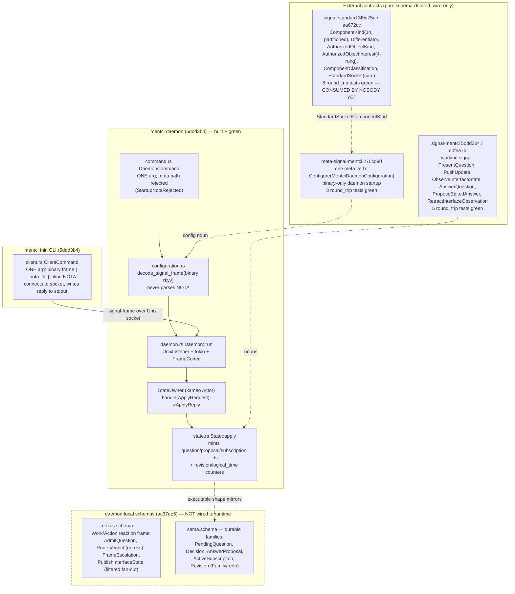
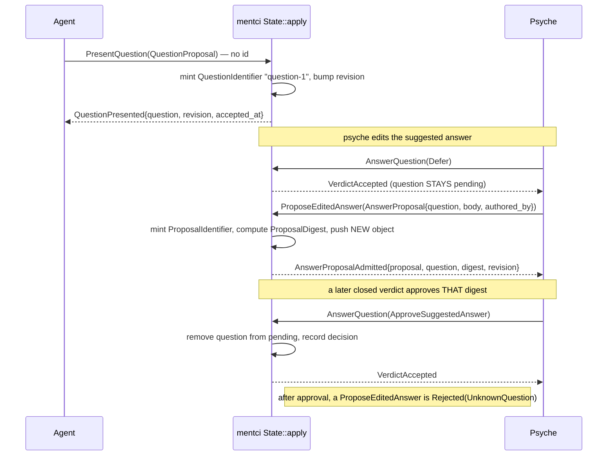

# 690 / 8 — mentci component + signal-standard (engine audit)

**TL;DR (load-bearing finding).** The new mentci component is **real, built,
and green** — not a schema skeleton. `mentci` (HEAD `5ddd3b4`) is a buildable
daemon crate with a one-argument binary-only daemon, a thin one-argument CLI, a
kameo-actor state machine, a `signal-frame` Unix-socket server, and 10 tests
that all pass on `cargo test --offline` (observed, this session). The **closed
verdict (`gc0n`) is genuinely closed**: `ApprovalDecision` is exactly
`[ApproveSuggestedAnswer Reject Defer]` in the schema, in the generated Rust
enum, and in the runtime — `PendingAnswer` survives only inside comments
marked DELETED, and there is no open `Answer(...)` variant anywhere. The
**edited-answer path is correctly a separate typed object**: `ProposeEditedAnswer`
admits a new `AnswerProposal` (question + body + authored_by + canonical
`ProposalDigest`) and crucially does **not** retire the question — proven by the
test `defer_keeps_question_open_for_later_answer_proposal`. The daemon mints all
ids and tokens (clients carry none). `signal-standard` is a **pure vocabulary
library** — both root sections empty — that emits the 14-variant partitioned
`ComponentKind`, `AuthorizedObjectKind`, `Differentiator`, the four-rung
`AuthorizedObjectInterest` lattice, `ComponentClassification`, and the
`StandardSocket` sum. The two load-bearing **gaps** are integration-shaped and
self-declared: (1) `signal-standard` is **consumed by nobody yet** — every
consumer (`signal-criome`, `signal-persona`) still declares its own local
`ComponentKind`, and the three mentci contracts each declare their own
divergent local `StandardSocket` rather than importing the canonical sum; (2)
the durable SEMA, the notification fan-out beyond request/reply, and the
cryptographic **verdict egress to criome** live only in `nexus.schema`, not in
the runtime — the runtime is the in-memory executable shape of the state
machine.

## Shape of the component

The component triad is correct per the AGENTS.md override: `mentci`
(daemon + bundled thin CLI), `signal-mentci` (working signal),
`meta-signal-mentci` (meta policy signal). The CLI is the daemon's first
client, not a triad leg. `signal-standard` is the shared cross-component
library, not a leg of any triad.

## The verdict / edited-answer flow (the gc0n closed verdict)

The edit produces a **new admitted object** that re-enters the normal
authorization path; it never edits a verdict and never carries free text into
one. `state.rs:157-183` (`propose_answer`) pushes an `AnswerProposalRecord` and
does **not** touch `pending_questions`; `state.rs:132-155` (`answer`) is the
only path that removes a question.

## Verified changes

| Change (commit) | Status | Evidence |
|---|---|---|
| mentci daemon runtime + thin client (`5ddd3b4`) | **Real** | `cargo test --offline` GREEN: 10 tests across lib(1) + client(2) + configuration(2) + frame_codec(1) + state(4). Crate has `Cargo.toml` (deps on git remotes, not paths), `src/{daemon,client,command,configuration,state,frame_codec,error}.rs`, `src/bin/mentci-daemon.rs`, `src/main.rs`. |
| mentci daemon-local schemas bootstrap (`ac37ee5`) | **Real** | `git show --stat ac37ee5` = `schema/nexus.schema` (476 lines) + `schema/sema.schema` (355) + docs only. Both schemas read; rich Work/Action + Family vocabulary. |
| Closed verdict genuinely closed (`gc0n`) | **Real** | `signal-mentci/schema/lib.schema:168-172` and generated `signal-mentci/src/schema/lib.rs:173-177` = `enum ApprovalDecision { ApproveSuggestedAnswer, Reject, Defer }`. `grep PendingAnswer` across all four repos hits **only comments** (nexus.schema:132, sema.schema:176, signal-mentci/schema/lib.schema:44), each saying DELETED. No open `Answer(...)` variant exists. |
| Edit keeps the question pending (AnswerProposal = separate typed object) | **Real** | `mentci/tests/state.rs:77-105` `defer_keeps_question_open_for_later_answer_proposal` — after Defer, `ProposeEditedAnswer` returns `AnswerProposalAdmitted{proposal-1, question-1, digest "answer-proposal-question-1-proposal-1", revision 2}`. Counterpart `approving_question_closes_it_against_later_edits` (108-130) — after Approve, the edit is `Rejection(UnknownQuestion)`. Production path: `state.rs:157-183`. |
| Daemon mints ids/tokens; client carries none | **Real** | Schema: `PresentQuestion QuestionProposal` (no id; `QuestionProposal` has none, lib.schema:137-143); `ObserveInterfaceState InterfaceStateObservation` (no token, 266-269). Runtime: `mint_question_identifier`/`mint_proposal_identifier`/`mint_subscription_token` (`state.rs:242-258`) return ids in replies; test `present_question_mints_question_and_revision` (state.rs:32-44). |
| Filtered subscriptions + projected slice (`d0fea7b`, operator 421 §4) | **Real** | `InterfaceInterest [FullInterfaceState StatusOnly Notifications PendingQuestions]` (lib.schema:254-259); `ProjectedInterfaceState{revision, projection}` (279-282) carries only the declared slice; runtime `project()` matches each interest to one `InterfaceProjection` arm (`state.rs:208-227`). Tests: `observe_returns_subscription_token_and_current_projection` (state.rs:46-74); contract test `projected_state_can_hide_full_question_context` (round_trip.rs:188). `d0fea7b` returns token+snapshot together via `InterfaceObservationOpened`. |
| meta-signal-mentci config contract (`270cd90`) | **Real** | One verb `(Configure MentciDaemonConfiguration)` (schema/lib.schema:66); generated; 3 round_trip tests GREEN. Daemon consumes it binary-only: `configuration.rs:26` `MetaInput::decode_signal_frame(&bytes)`; `command.rs:34-36` rejects `.nota` startup path. |
| signal-standard pure shared library (`3f9d75e`, `aa672cc`) | **Real** | Both root sections empty `[]` (schema/lib.schema:28,30). Generated `signal-standard/src/schema/lib.rs` emits `enum ComponentKind` (14 variants, counted), `enum AuthorizedObjectKind`, `struct Differentiator`, `enum AuthorizedObjectInterest`, `enum StandardSocket`, `struct ComponentClassification`. 8 round_trip tests GREEN. `src/lib.rs` adds only escape-hatch methods. |
| Daemon = one-arg, binary-only (override compliance) | **Real** | `command.rs:46-51` accepts exactly `[path]` else `StartupArgumentCount`; rejects `.nota` (`StartupNotaRejected`, command.rs:34-39 + error.rs:13-14); reads binary rkyv frame. Daemon `Configure`-only startup; virgin-daemon/self-resume documented in meta schema header. CLI `client.rs:60-65` takes exactly one input (binary frame, `.nota` file, or inline NOTA). |

## Gaps

| Gap | Severity | Suggested operator bead |
|---|---|---|
| `signal-standard` is consumed by nobody — `signal-criome/schema/lib.schema:86` still declares its own 7-variant `ComponentKind`; no consumer imports `signal-standard:lib:ComponentKind`. The reconciled roster is a library with zero clients; drift risk grows the longer the local copies diverge. | **High** | operator: migrate signal-criome + signal-persona to import ComponentKind/interest-lattice from signal-standard, deleting both local copies in one coordinated breaking change |
| The three mentci contracts each declare a **divergent** local `StandardSocket`: signal-standard's is a SUM (`enum {UnixSocket, NetworkSocket}`, lib.rs:121); signal-mentci (lib.rs:457) and meta-signal-mentci (lib.rs:39) declare a NEWTYPE `struct StandardSocket(SocketPath)`. The Unix-only stand-in cannot represent a network endpoint, so the eventual cross-import is a shape change, not a swap. | **High** | operator: once signal-mentci/meta-signal-mentci can lower with imports, replace both local StandardSocket stand-ins with `signal-standard:lib:StandardSocket` and adapt `StandardSocket::unix` callers to the sum |
| Verdict egress to criome is schema-only: `nexus.schema` declares `RouteVerdict`/`SignedVerdict`/`VerdictRouting` but the runtime has no signing path (only `configuration.rs:56-57` reads the home-criome socket field). The component cannot yet complete a real approval round-trip to criome. | **High** | operator: wire the RouteVerdict egress — carry a SignedVerdict over the home-criome StandardSocket once criome key custody lands (blocked on criome) |
| The SEMA is in-memory; `sema.schema`'s five `Family`/redb declarations (PendingQuestion, Decision, AnswerProposal, ActiveSubscription, Revision) are not wired. No durable persistence, so a daemon restart loses all pending questions — contradicts the "self-resume from persisted SEMA state" override. | **Medium** | operator: implement durable SEMA storage from sema.schema families so the daemon self-resumes pending questions on restart |
| `nexus.schema` (the Work/Action operations engine, AdmitQuestion/FrameEscalation/PublishInterfaceState fan-out) is bootstrapped as a schema but the runtime hand-rolls an equivalent in-memory `State::apply` instead of generating the reaction loop from it. The two can drift; `FrameEscalation` (criome -> QuestionProposal) and the fan-out delivery have no runtime at all. | **Medium** | operator: generate the Nexus reaction loop from nexus.schema (or formally mark it future-target) and implement FrameEscalation + PublishInterfaceState fan-out |
| `ProposalDigest` is a `format!("answer-proposal-{q}-{p}")` placeholder (`state.rs:166-170`), not a canonical content hash of the AnswerProposal. The digest criome would authorize is non-canonical, so an edited answer's authorization identity is not yet content-addressed (`z9d6`). | **Medium** | operator: compute ProposalDigest as the canonical content-addressed hash of the rkyv AnswerProposal, not a formatted string |
| No notification fan-out beyond request/reply: `meta-signal-mentci` carries `NotificationClient [StatusBar Popup Email]` and the daemon stores the enabled set, but there is no push/stream path. The `InterfaceStateStream` + `MentciEvent` exist in the contract but are not served. | **Low** | operator: serve InterfaceStateStream — push MentciEvent::InterfaceStateChanged to subscribed notification clients on revision bump |

## Drift flags

| Flag | Detail |
|---|---|
| Capability-vs-artifact precision | The `signal-*` round_trip tests are **capability** claims (encode/decode + NOTA round-trip in-test of each noun, plus `closed_verdict_has_no_authored_answer_variant`). The stronger claims come from `mentci/tests/state.rs`, which drives the **production** `State::apply` path for present/observe/defer-keeps-pending/approve-closes. The wire is exercised end-to-end only in `daemon.rs`'s one unit test (`connection_handler_returns_signal_reply_frame`), and only for `PushUpdate`. No test exercises a real socket-connected daemon+CLI round-trip for the approval flow; that is a coverage gap, not a contradiction. |
| Three local copies of two standard types | Until the migration bead lands, `ComponentKind` and `StandardSocket` exist in 4 places (signal-standard canonical + signal-criome + signal-mentci + meta-signal-mentci), and `StandardSocket` is structurally inconsistent (sum vs newtype). This is exactly the "Woe 4 / deferred cross-import" the schema headers self-document, so it is honest drift, not hidden — but it is drift, and it widens with each edit. |
| Daemon names a contract leg it does not depend on | `mentci/Cargo.toml` depends on `meta-signal-mentci`, `signal-mentci`, `signal-frame` — **not** `signal-standard`. The daemon reaches the standard types only transitively through meta-signal-mentci's local re-declaration. Correct for today's deferral, but means mentci never sees the canonical `ComponentKind`/`StandardSocket` it conceptually conforms to. |

## Coherence notes

mentci is the keystone that closes a loop the rest of the stack left open. The
`5-criome` audit covers `gc0n`'s explicit psyche-escalation outcome
(`9719703`) — criome's `EscalateToPsyche` was a documented dead-letter until a
UI existed. mentci is that UI: its `ApprovalSource::CriomeEscalation` and
`nexus.schema`'s `FrameEscalation` (criome escalation -> QuestionProposal) are
the receiving end. The closed-verdict discipline here is the same `gc0n`
invariant criome enforces — criome only authorizes submitted content-addressed
objects, so mentci cannot mint an answer from a verdict side-channel; an edit
becomes a new `AnswerProposal` object whose `ProposalDigest` re-enters the
normal authorization path. This is the **same** content-addressed-object
discipline (`z9d6`) the criome engine audit verifies, viewed from the
psyche-facing side.

mentci is built on the same daemon skeleton the `7-spirit` audit describes
(`signal-frame` envelope, length-prefixed rkyv frames, kameo actor owning
state, one-arg binary-only daemon) — confirming the strict-positional-schema
port and the signal-frame wire framing are now the reusable component shape, not
spirit-specific. The single biggest cross-cutting risk for the
**coherence critic** is `signal-standard`: it was lifted out of `signal-criome`
to be the one shared `ComponentKind`/interest-lattice, but the criome audit
(`5-criome`) will still find criome carrying its own local roster. The library
exists and is green; the consumers have not moved. Until that coordinated
breaking change lands, the "one reconciled census" intent (`eeeo`) is aspiration,
not fact — flag it to the completeness critic as the highest-value next bead.
