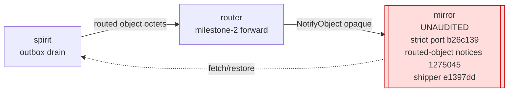

# 690 — cross-cutting: coherence + completeness (with branch verification)

TL;DR. Within its scope the 8-engine audit is deep and well-evidenced
(every engine builds + tests green on `main` at the audited HEADs). But
it has **one central blind spot — it read `main`-HEAD only** — and that
blind spot inverts three of its own HIGH gaps. I **verified the
completeness critic's branch claims directly** (lesson from this
session: re-check cross-lane state before asserting a blocker): the
matcher, the Attend/Withdraw surface, signal-standard's first consumer,
and the cross-host transport witness **all exist on active branches
dated the audit day itself**. So the honest verdict is two-layered:
**on `main`, the pulse-delivery chain is genuinely incoherent; counting
in-flight branches, it is being closed right now.** A second blind spot
is scope: ~12 schema-derived consumer daemons — most decisively
**mirror**, the chain endpoint — changed in the window and no agent
owned them.

## What is genuinely coherent (confirmed, both on main)

```mermaid
flowchart LR
  subgraph CODEGEN["codegen tier — COHERENT"]
    nn[nota-next<br/>7-shape codec] --> sn[schema-next<br/>schema-cc resolver<br/>build-time freshness gate] --> srn[schema-rust-next<br/>quote!/ToTokens<br/>string emitter retired]
  end
  CODEGEN -->|"strict positional grammar<br/>(0 retired star-roles)"| CONS
  subgraph CONS["consumer contracts — all ported, all green"]
    sc[signal-criome] & sr[signal-router] & ss[signal-spirit] & sm[signal-mentci]
  end
  sema[sema-engine<br/>god-impl decomposed<br/>sound lock · closed RecordKey · O(1) head] -.->|storage floor| CONS
```

- **Strict-positional grammar port is uniform** across every consumer —
  the coherence critic confirmed zero retired star-role syntax and
  uniform dot-role/positional fields in signal-criome (156 dot fields),
  signal-router (all six schemas), signal-spirit, signal-mentci. criome
  pins schema-next at exactly `1de72dd`, the post-rejection commit. The
  one grammar change propagated everywhere; no consumer left behind.
- **Codegen chain is intact and token-native** — schema-cc *replaced*
  the hand-written `from_parenthesis_objects` match with a
  build-time-freshness-gated generated dispatch (fails build on drift —
  artifact discipline, not just capability); schema-rust-next emits via
  `quote!`/`ToTokens` with `RustWriter` gone (0 `self.line` for source).
- **sema-engine hardening strictly improves every consumer** — sound
  single-writer lock, genuinely closed `RecordKey` sum, true O(1)
  chain-head digest; 116 tests observed green.
- **Attestation / closed-verdict axis is coherent** — criome folds the
  a-priori window into the signed digest (matches `ay3y`); the `gc0n`
  `EscalateToPsyche` dead-letter (criome `9719703`) is received
  coherently by mentci's `FrameEscalation` + closed `ApprovalDecision`
  (no open `Answer`/`PendingAnswer`; an edit becomes a separate typed
  `AnswerProposal` keeping the question pending).

## The conflicts — and the branch correction (VERIFIED)

The coherence critic found three real conflicts on `main`. I verified
each against the active branches; the verification changes the verdict.

### 1. The authorized-object pulse is undeliverable on `main` — but the matcher is on a branch

On `main`: criome correctly emits **reference-only** pulses
(`actors/root.rs:210`) but **still owns an operational interest-matcher**
(`actors/subscription.rs:71-152`, `interest.matches_update`) — the role
the post-684 `m0p2` clarification reassigned to the router as the *sole*
operational matcher. Meanwhile router on `main` has **no** matcher (no
`Attend`/`Withdraw`/attendance/Differentiator anywhere). So on `main`
the matcher is **double-booked in criome and absent in router** — the
pulse cannot fan out end-to-end.

**Verified branch correction:**

| Claim (HEAD-only audit) | Branch reality (verified by me) |
|---|---|
| router has no subscription matcher (HIGH gap) | `router origin/attendance-fanout-139` **23312d9** — "attendance table + interest-lattice match + ObjectAvailable fan-out", with `tests/attendance_fanout_truth.rs` |
| signal-router has no Attend/Withdraw surface | `signal-router origin/attendance-fanout-139` **1a9b02e** — "Attend/Withdraw subscribe surface + ObjectAvailable reference-push" |
| router cross-host transport unproven (HIGH gap) | `router origin/transport-two-kernel-e2e-138` tip **453bc28** — two-kernel transport test, *past* its P3-findings review |

So the **router half of `m0p2` is built and in operator's integration
pipeline**, dated the audit day. What genuinely remains is the **criome
half**: retire criome's operational interest-matcher down to
observation/audit-only and rewrite `criome/ARCHITECTURE.md:110-116`. That
is the one real, un-started piece of the matcher reconciliation.

### 2. signal-standard "zero clients" — refuted by the same branch

On `main`, signal-standard is a real 14-variant `ComponentKind` /
interest-lattice library imported by nobody (signal-criome still
declares its own 7-variant copy; signal-mentci / meta-signal-mentci
re-declare locally). **But** `router origin/attendance-fanout-139`'s
`Cargo.toml` **imports `signal-standard`** (Differentiator + interest
lattice as the attendance-table key) — verified. So signal-standard's
**first real consumer exists on a branch**; the `eeeo`
one-reconciled-census is partially realized, not pure aspiration. The
remaining migration (signal-criome + the mentci contracts drop their
local copies) is still real and is a coordinated breaking change.

### 3. `StandardSocket` shape conflict — real, on main, no branch fix seen

signal-standard generates `enum StandardSocket` (a sum:
`UnixSocket`|`NetworkSocket`) while signal-mentci and meta-signal-mentci
generate `struct StandardSocket(SocketPath)` (a newtype). Callers use
`StandardSocket::unix(...)` against the newtype. The eventual cross-import
is a **breaking shape change, not a swap**. No branch resolves this yet —
it stays a live bead, and it should be settled (sum vs newtype) *before*
the mentci contracts migrate onto signal-standard.

## What was missed entirely — scope (verified)



- **mirror is unowned and is the chain endpoint.** It did the same
  strict port (`b26c139`), added routed-object-notice handling
  (`1275045` — the receiving end router delivers to), and an
  `Arc<Engine>` shipper for the shared spirit engine (`91ec76f`).
  Both the spirit audit (mirror-shipper) and the router audit
  (`NotifyObject` as opaque octets) explicitly deferred "the mirror
  chain" — and no engine agent verified mirror builds or that its
  routed-object handling matches router delivery + spirit outbox-drain.
  This is the convergence point of the `d6he`/`lt44`/`nfvm` milestone.
- **~12 consumer daemons changed with no build/test witness** — message
  (13 commits), lojix (14), terminal (7), introspect (7), mind (7),
  persona (3), cloud (4), domain-criome (5), upgrade (4), orchestrate
  (5), repository-ledger (4), triad-runtime (3). All did the strict
  port and/or the sema layout-5 migration. This is exactly the
  sema-engine audit's own HIGH gap: *no witness that live consumer
  `.sema` stores are layout-5 before the layout-4 hard-fail bites.* The
  whole point of a breaking grammar+layout change is that every consumer
  regenerates and still builds — and nobody owned "do they?".
- **triad-runtime generic reaction frame** (`9877928`) is the proven
  runtime leg both codegen audits *depend on* (the `Work`/`Action` enums
  schema-rust-next emits must satisfy `triad-runtime::NextStep`), but
  neither verified it. If the generated frame and the runtime frame
  drift, both "Real" codegen verdicts are half-true.
- **No nix/CI build witness anywhere** — every engine recorded only
  `cargo --offline` green and deferred the nix path, at the exact moment
  the shared `rust-build` toolchain source policy changed across the
  workspace. The spirit local-cache-skew note shows offline resolution
  can diverge from the lock; cargo-offline-green does not witness the
  deployed binary.
- **Two governing-record ids did not resolve** — `vez8` (the prompt's
  cited Asschema-removal record; the removal is confirmed in code but
  the id is wrong). **Resolved post-audit:** the actual Asschema-removal
  record is **`6cfr`** (Decision VeryHigh — "the separate Assembled
  Schema (Asschema) IR is removed; the resolution it performed … lives as
  methods on schema-in-rust types … the emitter does only Rust
  projection"); related governing records are `549v`/`vpbx`/`v0n6`.
  `active-repositories.md` was corrected (`vez8` → `6cfr`). The other
  miss, `aipc` (lojix Test-op "proven end-to-end"), remains unverified.

## The genuinely-open safety items (no branch, real)

These are internal-completeness items, not cross-engine disagreements,
and no branch addresses them:

- **criome quorum-majority (`k > n/2`) is not enforced** — only
  `required <= authorities.len()` (`language.rs:574-582`). A 2-of-5
  admits; partition-fork is undetected. (684 Woe 3, still open.)
- **criome BLS is a per-signature pairing loop** (`language.rs:588-601`),
  no `FastAggregateVerify` — so the direct-lane latency claim degrades
  ~5-10× → ~1.5-2× for small quorums. (684 Woe 5, still open.)
