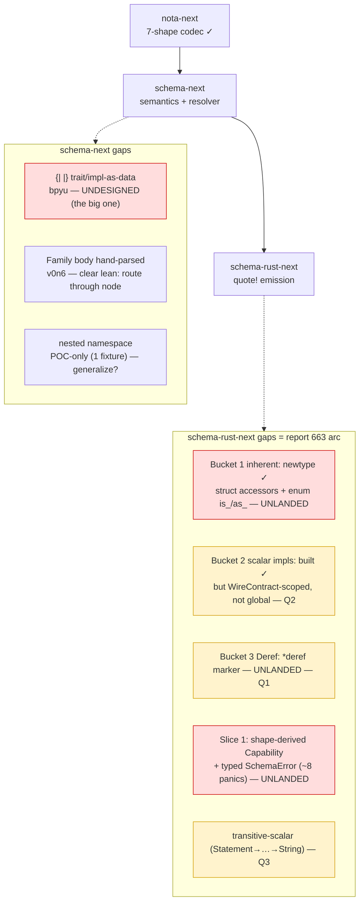

# 692 — schema-next + schema-rust-next gaps: the go-over

Prep for the psyche's *"go over the schema and schema-rust gaps."* The
remediation pass (691) closed the doc/skill drifts. What remains in the
two codegen engines is **real design + code work**, and most of it
clusters on one arc: **report 663's standard-impl policy, which ended
with four open questions for the psyche that were never answered.** Those
four questions are the heart of this go-over; the rest are clear-lean
cleanups or one genuinely-undesigned construct.



## The whole list, with disposition

| Gap | Engine | Sev | My lean | Needs psyche? |
|---|---|---|---|---|
| `{\| \|}` trait/impl-as-data construct (`bpyu`) | schema-next | Med | design it as impls-as-data (see below) | **Yes — design call** |
| Family body hand-parsed above seed (`v0n6`) | schema-next | Med | route through a typed structural-macro node | No — operator |
| Nested namespace is POC-only (1 fixture) | schema-next | Low | generalize once a 2nd consumer needs it | Lightly |
| Nix/crane build witness not run | schema-next | Low | CI runs it | No — system |
| **663 Q1**: `Deref` default-on vs `*deref` marker | schema-rust | Med | **opt-in `*deref` marker** (189 vs 24) | **Yes** |
| **663 Q2**: flip scalar impls to global default | schema-rust | Med | *was* WireContract-scoped (691); **lean toward global — the scalar gate is the real safety boundary** | **Yes** |
| **663 Q3**: transitive-scalar leaf following | schema-rust | Low | compute it (deletes `.payload().payload()`) | **Yes** |
| **663 Q4**: a named `as_str` exception | schema-rust | Low | **none** — `AsRef<str>`+`Display` cover it | **Yes** |
| Slice 1: shape-derived `Capability` + typed errors | schema-rust | Med | do it — converts ~8 `panic!`s to `SchemaError` | No — operator (once Q's settled) |
| Slice 4: struct accessors + enum `is_/as_` | schema-rust | Low | emit them (Bucket 1 completion) | No — operator |
| `rust_type()→String` + `syn::parse_str` residual | schema-rust | Low | fold onto token-native `RustTypeReferenceTokens` | No — operator |

## schema-rust-next — the 663 arc (the substance)

**What is actually landed today** (verified, audit 690/2): Bucket 1's
*newtype* inherent surface (`new`/`payload`/`into_payload`/`From<Inner>`,
unconditional) and Bucket 2's scalar standard impls
(`Display`/`AsRef`/`PartialEq<scalar>`/`PartialOrd<scalar>`, gated on
`scalar_like()`) — but Bucket 2 is enabled **only on the WireContract
build path**, not flipped to a global default. Everything else in 663 is
unlanded: struct/enum Bucket-1 accessors, the `Deref` marker, the
shape-derived `Capability` resolution, and the ~8 generator `panic!`s
that should be typed `SchemaError`.

So the schema-rust gaps are not bugs — they are **the unbuilt back half
of a design report whose front half shipped**. And 663 explicitly left
four calls to the psyche. Here they are, restated with my lean:

### Q1 — `Deref`: opt-in `*deref` marker, or blanket default-on?

The census: **189** newtypes wrap another schema type, only **~24** want
`Deref` — 88% deliberately stay opaque. d3r2's recorded text says
"newtype Deref … by default"; 663 recommends *refining* that to a
template-generated capability **applied per-newtype via a `*deref`
marker**. **My lean: the marker.** Blanket-on would punch transparent
holes in 165 abstraction boundaries the authors kept opaque (a
`RecordIdentifier` is not its inner string). This is the one place a
marker earns its keep.

### Q2 — flip scalar standard impls to a global default?

This is where my **691 lean and 663's recommendation diverge**, and it's
worth settling deliberately. In 691 I leaned *keep it WireContract-scoped*
(don't impose `Display`/`AsRef` outside wire types). Re-reading 663, I
now think that was over-conservative: the **`scalar_like()` gate is the
real safety boundary** — only scalar-backed newtypes ever get the impls,
and those impls are always correct for a scalar regardless of which
module the newtype lives in. So **I lean toward 663's global default**,
with one honest caveat to weigh: a global flip gives *every* scalar
newtype `PartialEq<&str>` (loose comparison to raw strings), which is
clearly right for identifier/name/path types but you may not want on
every internal scalar. That caveat is the whole reason this is your call,
not mine.

### Q3 — transitive-scalar leaf following?

`Statement(StatementText(String))` is scalar at depth 2, but the gate
only checks depth 1, so it's skipped today (its hand-written
`PartialEq<&str>` does a double `self.payload().payload()` hop). 663
recommends following single-field newtype chains to the first scalar.
**My lean: do it** — it's structural (not a marker, not intent) and
deletes the remaining hand-written scalar delegations. Coupled to Q2.

### Q4 — a named `as_str` method exception?

663 recommends **zero** named std-leaf methods — `AsRef<str>` + `Display`
cover every current `.as_str()` use, and a leaf allowlist (`as_str`,
`trim`, `chars`) has an arbitrary boundary (`trim` appears 9× in real
code, always inside validators, never as a delegating primitive). **My
lean: agree — none.** Reach scalar leaves through std *traits*, never a
method-name registry.

If you settle Q1–Q4, the operator slices fall out mechanically: Slice 1
(Capability resolution + typed errors), Bucket-2 flip + transitive-scalar
(Q2/Q3), the `*deref` marker (Q1), struct/enum accessors (Bucket-1
completion). None then needs another psyche turn.

## schema-next — one design call, the rest clear

### The one design call: `{| |}` trait/impl-as-data (`bpyu`)

This is the genuinely-undesigned piece and the more interesting half of
the go-over. `schema-next` recognizes `{| |}` (PipeBrace) as a delimiter
but **rejects it at type-reference position** — the trait/impl construct
"is still to be designed" (e721626 doc, Spirit `bpyu`/`d3r2`). It is the
schema-language expression of **impls-as-data** — declaring, in the
schema, that a type implements a trait, so the emitter can generate the
impl. The audit 690 census shows the shape the design must cover:

```nota
{| Trait Target |}                     ;; marker impl, non-generic
{| [T] Trait (Target T) |}             ;; marker impl, generic
{| Trait Target [ (deref ...) ] |}     ;; method-bearing impl, non-generic
{| [T] Trait (Target T) [ (f ...) ] |} ;; method-bearing impl, generic
```

**My lean on the shape:** an impl is **one** pipe-brace object (never a
map key/value split — binders must live inside the same structural
object), with optional `[params]` and optional `[body]` ends the matcher
structurally sugars. The `*deref` marker from Q1 is the *degenerate
method-less case* of this construct — which is a good sign the two should
be designed together: `Deref` is the first trait the `{| |}` form should
express, so Q1's marker and the `{| |}` design are one arc, not two. This
is the natural next depth-first slice once the 663 questions are settled,
because it's what turns "the emitter generates standard impls" into "the
schema declares which impls exist."

### The clear-lean cleanups (operator/system, no psyche call)

- **Family body `v0n6` cleanup.** `SourceFamilyFields::from_block` reads
  the brace body with a hand-written `chunks_exact(2)` + field-name
  `match` (`src/source.rs:1321-1350`) instead of a typed structural-macro
  node — a live `v0n6` violation. Lean: route it through the node. (Same
  class as the `{| |}` work — both are "stop hand-parsing above the
  seed.")
- **Nested namespace** is proven by one fixture (`61aa1bf`). Lean: it's a
  correct POC; generalize when a second real consumer needs scoped
  sub-namespaces, not speculatively.
- **Nix/crane witness** for `b3be7d0` (the shared `rust-build` toolchain
  pin) was not run in the audit — only the cargo-offline path. Lean:
  CI/system records it; not an engine-logic gap.

## What I recommend we settle in the go-over

Five calls, in order of leverage:

1. **Q1 + the `{| |}` design together** — `Deref` via `*deref` marker is
   the first case of the impls-as-data construct. Settle the marker shape
   and the `{| |}` shape as one arc.
2. **Q2** — global default vs WireContract-scoped for scalar impls (my
   lean shifted toward global; the `PartialEq<&str>`-everywhere caveat is
   yours to weigh).
3. **Q3, Q4** — transitive-scalar (yes) and `as_str` (none); low-stakes,
   quick confirms.
4. Then the operator slices are mechanical, and the `v0n6` family cleanup
   rides along with the `{| |}` work.
