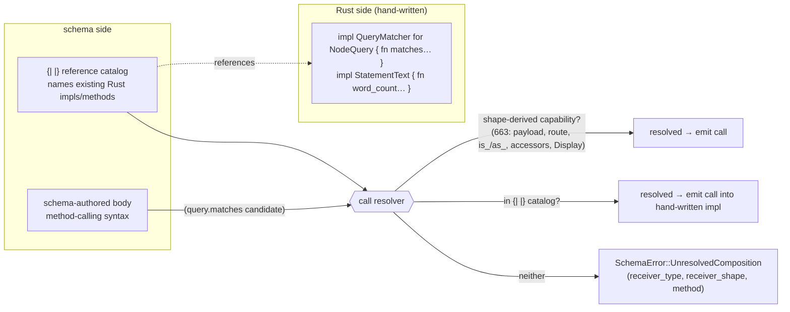

# 693 — the `{| |}` vision: reference existing Rust impls + a method-calling syntax

The psyche's redirect, verbatim: *"I dont care about the default deref,
it was a spinoff idea of how to quick-start impl syntax. but now I
realize I just need a list of impls that are already there in the
rust-side which I can refer to in schema, and a method-calling syntax."*

That reframes `{| |}` cleanly. It is **not** an impl *generator* (writing
Rust bodies from schema). It is a **two-part bridge** between
schema-authored composition and hand-written Rust:

1. **`{| |}` — a reference catalog.** Declare, in schema, the
   traits/methods that *already exist on the Rust side*, so schema can
   name them.
2. **A method-calling syntax.** Invoke those referenced methods (and the
   shape-derived generated ones) from schema-authored bodies.

This keeps the `d3r2` resolution principle intact — *a schema-authored
body is valid only when every call resolves from the receiver's schema
shape* — and just **widens the resolvable set** to include the catalog.
It needs no "broad callable method language" (`d3r2`) and no
generated impl bodies except the narrow mechanical family. (Captured:
`bpyu` Clarified this session.)



## Construct 1 — `{| |}` is a reference catalog

`{| |}` declares that a Rust-side impl/method exists so schema may name
it. The emitter generates **nothing** for a reference — the impl is
already in Rust; the catalog feeds the call resolver and lets typed
bounds accept the type. Per `bpyu`: one structural object, optional
leading `[params]`, optional trailing `[body]`.

```nota
;; MARKER reference — a known trait is implemented on the Rust side.
;; The trait's methods are implied (Display ⇒ to_string; Ord ⇒ cmp/lt/…).
{| Display RecordIdentifier |}
{| Ord RecordIdentifier |}

;; GENERIC marker — for all T, (Work T) participates in a plane.
{| [T] PlaneMember (Work T) |}

;; METHOD-BEARING reference — a hand-written trait impl whose call shape
;; schema does NOT otherwise know: list the callable SIGNATURES
;; (name, parameter types, return type), NOT a body.
{| QueryMatcher NodeQuery [
     (matches (candidate Node) Boolean)
   ] |}

;; INHERENT reference — methods that exist on the type itself, no trait.
{| StatementText [
     (word_count Integer)
   ] |}
```

The body element `(matches (candidate Node) Boolean)` is a **signature**:
method name `matches`, one parameter `candidate: Node`, return `Boolean`.
This is the difference from the old framing — the body lists *what schema
may call*, not *how it is implemented* (the impl is in Rust). A marker
form like `{| Display RecordIdentifier |}` carries no body because the
trait's methods are already known.

## Construct 2 — the method-calling syntax

A call's head is a **dotted lowercase atom** `binding.method`. This
extends the existing parenthesis-reference dispatch (schema-cc grammar):
a PascalCase head is a type/variant/macro (`(Vector T)`); a
lowercase-dotted head is a **method call**.

```nota
;; NULLARY call (bare dotted atom in expression position)
record.payload            ;; shape-derived capability (663 Bucket 1) → RecordRequest::payload
statement.word_count      ;; referenced inherent method → StatementText::word_count(&statement)
question.is_pending       ;; shape-derived enum predicate (663) → ApprovalQuestion::is_pending

;; CALL WITH ARGS (parenthesized, dotted head)
(query.matches candidate)        ;; referenced trait method → NodeQuery::matches(&query, candidate)
(identifier.compare other)       ;; Ord (marker reference) → RecordIdentifier::cmp

;; CHAINED (left-to-right; each hop resolves on the prior result's type)
(record.payload.word_count)      ;; payload() : StatementText, then word_count() : Integer
```

The dot is **context-disambiguated**, no new sigil:

| Position | `name.Type` / `binding.method` means |
|---|---|
| struct field **declaration** | field role — `field.Type` (the dot differentiator) |
| body / **expression** | method call — `binding.method` |

## Resolution — one rule, two sources

Every call `binding.method` resolves `method` against `binding`'s type,
in order:

1. **Shape-derived capability** (`663`): is `method` in the receiver's
   structural capability set? — newtype `payload`/`into_payload`/`new`;
   enum `route`/`is_<v>`/`as_<v>`/constructors; struct field accessors;
   scalar `Display`/`AsRef`/`PartialEq`. Generated, always present, never
   listed in a catalog.
2. **Referenced catalog** (`{| |}`): is there a marker/method-bearing
   reference whose target is `binding`'s type and that provides `method`?
   — resolves to the **hand-written** Rust impl.
3. **Neither** → typed `SchemaError::UnresolvedComposition { receiver_type,
   receiver_shape, method }` — a schema author gets a typed error, never
   a generator panic (closes `663` slice 1).

So the catalog *widens* the resolvable set without changing the
principle: "valid only when every call resolves from the receiver's
schema shape" becomes "…from the receiver's shape **or** the schema's
declared reference catalog" — and the catalog is part of the schema, so
the principle holds.

## Worked end-to-end — a schema-authored matcher body

A reaction `Work` step that decides whether a node query admits a
candidate, composing one referenced call with a shape-derived one:

```nota
;; --- reference catalog (top of the namespace) ---
{| QueryMatcher NodeQuery [ (matches (candidate Node) Boolean) ] |}
{| Display RecordIdentifier |}

;; --- the Work frame leg, body schema-authored over the catalog ---
AdmitCandidate (Work
  { query NodeQuery  candidate Node }          ;; inputs (struct, positional-typed)
  Boolean                                       ;; output
  (query.matches candidate))                    ;; body: one referenced call, resolves to NodeQuery::matches
```

`(query.matches candidate)` resolves via the catalog to the hand-written
`NodeQuery::matches`; `candidate` type-checks against the declared
`Node` parameter; the body's type is the declared `Boolean` return. The
emitter generates the `Work` enum + the call expression; the *matcher
logic itself stays hand-written in Rust*, reached through the reference.
This is the bridge the redirect asked for: **schema composes, Rust
implements, the catalog connects them.**

## What I need from you (syntax calls)

1. **Method-call head** — `binding.method` dotted-lowercase head, reusing
   the dot differentiator in expression position (disambiguated from
   field-role by declaration-vs-body context). Good, or do you want a
   distinct call marker so the dot never overloads?
2. **Nullary form** — bare `record.payload` vs always-parenthesized
   `(record.payload)`. I lean bare for nullary (reads like a field), parens
   only when there are args. Agree?
3. **Marker vs signature for known std traits** — is `{| Display T |}`
   (methods implied by the trait) enough, or do you want every callable
   signature listed explicitly even for std traits?
4. **Catalog placement** — inline `{| |}` declarations at the namespace
   top (shown above), or a dedicated `rust { … }` section that groups all
   references? I lean inline (one construct, no new block).
5. **Chaining** — allow `(a.b.c)` multi-hop, or single-hop `(a.b)` only,
   composing longer chains through named let-bindings in the body? I lean
   allow shallow chaining; deep chains read better as bindings.

Pick the leans you like and I'll prove the chosen shape on a schema-next
worktree branch (a fixture that lowers a `{| |}` catalog + a body whose
calls resolve, plus a red test that an unresolved call yields the typed
error).
