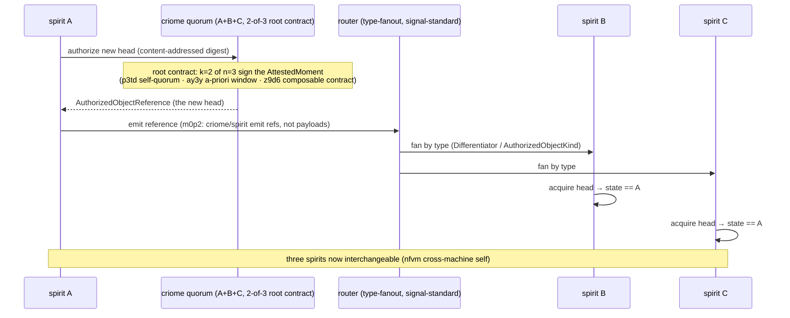

# 694 — cluster-propagation PoC (frame and method)

The psyche's order: *"put a workflow of research/design/poc-implement
massive effort to use best wisdom and previous direction/design to port
all our best design together in a working spirit/criome/router cluster
propagation."* Three concrete mechanisms named:

1. **criome auth propagates, from a root contract with 2-of-3 auth.**
2. **spirit state validates on criome then propagates to the other 2
   machines' spirit — which acquire the new state and can be used
   interchangeably.**
3. **router passes messages based on their "type" (signal-standard).**

This is the capstone: every arc of the last weeks — the criome agreement
machine, the spirit mirror / cross-machine self, the router type-fanout,
signal-standard — converging into **one working end-to-end loop**.

## The target loop (one sentence, three hops)

Machine **A**'s spirit accepts a new state object → asks its criome to
authorize the new **authorized head** under a **root contract requiring
2-of-3** quorum signatures across the principal's three machines → the
authorized-head reference is fanned by the **router**, matched by its
**type** (signal-standard `ComponentKind`/`Differentiator`/
`AuthorizedObjectKind`) → machines **B** and **C** spirit **acquire** the
new head and are thereafter **interchangeable** with A.

## Governing intent this PoC ports together (already recorded)

- **2-of-3 root contract** — `p3td` (each principal runs >1 node; a
  self-quorum makes attestations reliable; forging needs a threshold of
  your own nodes), `z9d6` (content-addressed composable authorization
  contracts), `ermr` (cluster-root admission signs member keys), the
  `k > n/2` majority guard (684 Woe 3 — n=3, k=2 is the first real
  majority), `ay3y` (attested-moment a-priori window in the signed
  digest), `psc6`/`q1le` (BLS key custody).
- **spirit validates-on-criome → propagates → interchangeable** — `d6he`
  (the spirit→criome→router→mirror chain, first e2e milestone), `nfvm`
  (mirror = cross-machine self; criome holds the authorized head; spirit
  fetches/receives it), `2st7`/`w2g3` (spirit asks criome to authorize an
  exact content-addressed digest), `9s52` (per-Unix-user criome).
- **router by type** — `m0p2` (router is the sole operational matcher;
  criome/spirit emit references, components fetch), `l2ha` (router +
  subscribers own fan-out), `57f9` (router-typed envelope, payload-blind),
  `eaf7`/`eeeo` (signal-standard `ComponentKind`/`Differentiator`/socket
  vocabulary — the "type").

## Method — four phases (Workflow)

- **Research (parallel).** Five agents gather best wisdom + exact current
  code/branch state: criome quorum surface; spirit propagation +
  mirror-shipper/offline-e2e; router type-fanout (incl. the
  `attendance-fanout-139` / `transport-two-kernel-e2e-138` branches the
  690 audit found); the integration seam + minimal-real cut; and the
  buildable-state table (HEADs, branches, git-dep coordinates, what
  compiles).
- **Design (panel → synthesis).** Three angles (topology-first,
  contract-first, minimal-loop-first) → one integrated PoC design + the
  **falsifiable end-to-end test** + the sequential build plan.
- **Implement (sequential harness build).** Scaffold the self-contained
  harness (real contract crates via git dep where they build; the e2e
  test lands red) → criome 2-of-3 authorize-head → spirit
  accept/validate/acquire → router type-fanout → wire the e2e green.
- **Verify (adversarial).** Independently run the suite, inspect the e2e
  for fakery (real 2-of-3? real type-fanout? real acquire, or stubbed?),
  report honest green/red and exactly what is proven vs shimmed.

## PoC discipline

- **Real components, harness wiring.** Depend on the real
  `signal-criome`/`signal-spirit`/`signal-router`/`signal-standard` (and
  `criome`/`spirit`/`router`/`sema-engine`) via git deps; the harness
  provides only the 3-instance wiring + the propagation glue + the test.
  Single-host, three in-process instances (the cluster is the *logic*,
  not three physical machines) — the convincing logic-level proof, with
  the physical-deploy step left to system-operator.
- **Unblock the blocker inside the test.** If a real crate can't be used
  in the harness, shim the minimal piece *inside the harness* and mark it
  RED/shimmed explicitly. Never fake green (`skills/human-interaction.md`).
- **Designer lane.** The harness is a self-contained code witness for
  operator to harvest into the real repos; it touches no repo's `main`.
- **Honest boundary.** If the full loop doesn't reach green in one pass,
  land the furthest-working slice + the exact red, and name the operator
  beads to close it. Maximum value either way.

## Report layout

`0-frame` (this) · `1`–`5` research · `6` integrated design + e2e test
spec · `7` implementation + result · `8` verification · `9` synthesis +
harvest beads (orchestrator).
