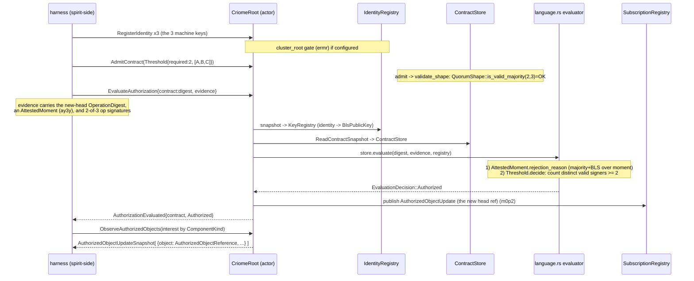

# 1 — criome 2-of-3 root-contract auth (research)

How criome authorizes a new content-addressed object/head with a quorum
**today**, the exact call surface a harness drives, how to build a real
2-of-3 authorize-head, and what must be shimmed.

## Headline findings

- **The `k > n/2` majority guard is LANDED and on `origin/main`.** Report
  684 Woe 3 (sub-majority thresholds enable fork attacks) is **closed**.
  The fix is commit `22801af` ("criome: enforce majority quorums"), which
  **is** criome `origin/main` HEAD (the prompt's `068f9db` is its
  grandparent). The guard is `QuorumShape::is_valid_majority`
  (`criome/src/language.rs:623-626`): `required != 0 && required <=
  authorities && required > authorities / 2`. It runs in **both**
  enforcement points — contract `Threshold` admission
  (`language.rs:414`) and `AttestedMoment` time-attestation verification
  (`language.rs:577`). Not on a side branch; merged.
- **2-of-3 is the first real majority and is admitted/authorized today.**
  `n=3, k=2`: `2 > 3/2 == 2 > 1` true, so it admits; `2 > 5/2 == 2 > 2`
  false, so a 2-of-5 is rejected at admission. The existing test
  `threshold_contract_accepts_only_enough_distinct_admitted_authorities`
  (`tests/language.rs:268-317`) **is** the 2-of-3 quorum authorize: 3
  KeyMembers, `required=2`, one signature rejected (QuorumShort), two
  signatures Authorized.
- **The cluster-root admission gate (`ermr`) is LANDED and wired**, not
  just a branch. `ClusterRoot::admits` (`src/admission.rs:86-101`) is
  enforced inside `RegisterIdentity` (`src/actors/registry.rs:96-121`):
  when a `cluster_root` is configured, a registration is rejected
  (`RejectionReason::UnauthorizedRegistration`) unless it carries a valid
  cluster-root BLS signature over the registration statement. Woe 6
  (no production *ceremony* to mint admissions) remains — but the gate and
  its verification are real and tested (`cluster_root_gates_registration`).
- **BLS is real (`blst` min-pk), not stubbed** (`src/master_key.rs`). The
  placeholder string is retired.
- **Observed green** (offline, locked deps): `cargo test --test language`
  = 18/18; `cargo test --test daemon_skeleton` = 21/21. The actor-path
  end-to-end `criome_root_admits_and_evaluates_policy_contracts` (drives
  `EvaluateAuthorization` and reads back the `AuthorizedObjectUpdate`
  pulse) is in that green set.

## The authorize-a-head loop, as built

Two independent gates make the verdict (both must pass):

| Gate | Where | What it checks |
|---|---|---|
| **Attested moment** (ay3y) | `AttestedMoment::rejection_reason` `language.rs:572-606` | window `opens<closes`; `is_valid_majority(required, authorities)`; no duplicate authorities; then **k valid BLS sigs** over `AttestedMomentStatement` from admitted authority keys. Fail = `TimeNotProven`. |
| **Threshold quorum** (z9d6/p3td) | `Threshold::decide` `language.rs:370-395` | counts **distinct** PolicyMembers satisfied; a `KeyMember` is satisfied by a valid BLS op-signature (`Evidence::has_valid_signature_from` `language.rs:520-535`); `satisfied >= required` -> Authorized, else `QuorumShort`. |

## Exact call surface the PoC must touch

Public criome modules: `criome::language` and `criome::master_key` are
`pub` (`src/lib.rs:12-13`); `criome::admission` is `pub` (`:8`). Two ways
in — pick per integration agent's seam:

### Path A — pure evaluator (no actor, no tokio): fastest 2-of-3 witness

This is the `tests/language.rs` recipe — synchronous, no daemon.

- `criome::master_key::MasterKey::generate() -> Result<MasterKey>`
  (`master_key.rs:45`); `.public_key() -> BlsPublicKey` (`:105`);
  `.sign(&[u8]) -> BlsSignature` (`:117`, DST
  `CRIOME-ATTESTATION-BLS12381G2-...`). **Verification** trait
  `criome::master_key::VerifyBls::verify_bls` on `BlsPublicKey`
  (`master_key.rs:129`).
- `criome::language::KeyRegistry::new()` then `.admit(Identity,
  BlsPublicKey)` (`language.rs:166-185`) for each of the 3 machine keys +
  the time authority.
- `criome::language::ContractStore::new()` then `.admit(Contract) ->
  Result<ContractDigest, AdmissionError>` (`language.rs:116`). Admission
  runs `validate_shape` -> the majority guard.
- `signal_criome::Contract::new(Rule::Threshold(Threshold::new(
  RequiredSignatureThreshold::new(2), vec![PolicyMember::KeyMember(a),
  KeyMember(b), KeyMember(c)])))` — the **root contract** (z9d6).
- `ContractStore::evaluate(&ContractDigest, &Evidence, &KeyRegistry) ->
  Result<EvaluationDecision, EvaluationError>` (`language.rs:136-147`).
  `EvaluationDecision::Authorized` is the authorized verdict.
- **Statement preimages** (must be signed exactly): the op signature is
  over `criome::language::OperationStatement::new(&Identity,
  &OperationDigest, &AttestedMoment).to_signing_bytes()`
  (`language.rs:195-218`, tag `CRIOME-OPERATION-AUTHORIZATION-V1`); the
  moment signature is over
  `criome::language::AttestedMomentStatement::new(&AttestedMomentProposition)
  .to_signing_bytes()` (`language.rs:221-233`, tag
  `CRIOME-ATTESTED-MOMENT-V1`). **`MasterKey::sign` is NOT used over the
  attestation preimage here — sign these statement bytes.**

### Path B — full actor + pulse (this is the real production path)

Adds the `EvaluateAuthorization` -> `AuthorizedObjectUpdate` emission
(m0p2). This is `tests/daemon_skeleton.rs:491-630`.

- `criome::actors::root::CriomeRoot::start(Arguments) ->
  Result<ActorRef<CriomeRoot>>` (`root.rs:115`). `Arguments::new(
  StoreLocation)` (`root.rs:50`), `Arguments { store, cluster_root:
  Option<BlsPublicKey> }` (`root.rs:29-32`).
- Drive via `root.ask(SubmitRequest::new(CriomeRequest::<...>))`
  (`root.rs:34,58`). The verbs the PoC needs:
  - `CriomeRequest::RegisterIdentity(IdentityRegistration::new(identity,
    public_key, PublicKeyFingerprint, KeyPurpose, Option<admission>))` x3
    + time authority (`root.rs:145`, registry handler `registry.rs:96`).
  - `CriomeRequest::AdmitContract(Contract)` -> `ContractAdmitted`
    carrying the `ContractDigest` (`root.rs:201,337-351`).
  - `CriomeRequest::EvaluateAuthorization(AuthorizationEvaluation{
    contract: ContractDigest, evidence: Evidence })` (`root.rs:203-238`).
    On `Authorized` it publishes the head and replies
    `AuthorizationEvaluated{contract, decision}`.
  - `CriomeRequest::ObserveAuthorizedObjects(AuthorizedObjectObservation{
    subscriber: Identity, interest: AuthorizedObjectInterest })` ->
    `AuthorizedObjectUpdateSnapshot` of `AuthorizedObjectUpdate`
    (`root.rs:239-247`). The head ref is `update.object`:
    `AuthorizedObjectReference{ component: ComponentKind, digest:
    ObjectDigest, kind: AuthorizedObjectKind::Operation }` — **the typed
    head the router fans (57f9/eaf7).**
- `criome::admission::RegistrationStatement::from_registration(&reg)
  .to_signing_bytes()` (`admission.rs:36-67`, tag
  `CRIOME-REGISTRATION-ADMISSION-V1`) is what the cluster-root signs to
  mint an admission envelope (the ermr ceremony shim).

### Wire nouns (all `signal_criome::`, the contract crate)

`Contract`, `Rule::{Threshold, SignedBy, All, Any, TimeSwitch,
ActiveAfter, ActiveUntil, Agreement, EscalateToPsyche}`, `Threshold`,
`PolicyMember::{KeyMember(Identity), ObjectMember(ContractDigest)}`,
`RequiredSignatureThreshold`, `Identity::{Persona,Agent,Host,Developer,
Cluster}`, `Evidence`, `AttestedMoment`, `AttestedMomentProposition`,
`TimeWindow`, `TimeSignature`, `SignatureEnvelope`,
`StampedSignatureEnvelope`, `SignatureScheme::Bls12_381MinPk`,
`OperationDigest`, `ObjectDigest`, `ContractDigest`,
`AuthorizationEvaluation`, `EvaluationDecision`, `AuthorizedObjectUpdate`,
`AuthorizedObjectReference`, `AuthorizedObjectKind`, `ComponentKind`,
`AuthorizedObjectInterest`, `AuthorizedObjectObservation`,
`IdentityRegistration`, `KeyPurpose`, `PublicKeyFingerprint`.

`Evidence::new` arg order (from `language.rs:236` / `daemon_skeleton.rs:558`):
`(ComponentKind, OperationDigest, AttestedMoment,
Vec<StampedSignatureEnvelope>, Vec<AgreementFact>)`.
`AttestedMomentProposition::new` order: `(TimeWindow,
RequiredSignatureThreshold, Vec<Identity>)`.

## How the harness builds a real 2-of-3 authorize-head

Concrete recipe (composes Path A inside Path B; or Path A alone for a
synchronous witness). This is the **content-addressed root contract**
(z9d6) requiring **majority** (684 Woe 3 guard) of the **principal's three
machine keys** (p3td self-quorum), over a **new-head digest** stamped with
an **AttestedMoment** (ay3y):

1. Generate three `MasterKey`s — `machine_a`, `machine_b`, `machine_c`
   (the principal's three nodes, p3td) — plus one `timekeeper` MasterKey
   (the time authority for ay3y).
2. Identities: `Identity::host("machine-a")` etc. (or `Cluster`/`Agent`
   per the real topology); `Identity::cluster("timekeeper")`.
3. `KeyRegistry` (Path A) or `RegisterIdentity` x4 (Path B) admitting each
   identity -> its `public_key()`.
4. **Root contract**: `Contract::new(Rule::Threshold(Threshold::new(
   RequiredSignatureThreshold::new(2), [KeyMember(a), KeyMember(b),
   KeyMember(c)])))`; admit it -> `ContractDigest` (admission passes
   because `is_valid_majority(2,3)`).
5. New head: `OperationDigest::from_bytes(<rkyv of the new state object>)`
   — content-addressed (2st7/w2g3, the exact digest spirit asks to
   authorize).
6. **AttestedMoment**: build `AttestedMomentProposition::new(TimeWindow{
   opens_at, closes_at}, RequiredSignatureThreshold::new(1),
   [timekeeper])` (a 1-of-1 timekeeper is itself a valid majority); sign
   `AttestedMomentStatement` with the timekeeper key into a
   `TimeSignature`; wrap as `AttestedMoment::new(proposition, [sig])`.
   (For a real time-quorum, use >=2 timekeepers with majority `required`.)
7. **Two of three machine keys sign** the `OperationStatement` over
   `(machine_identity, head_operation, stamp)` -> two
   `StampedSignatureEnvelope`s. Assemble `Evidence::new(ComponentKind::
   Spirit, head_operation, stamp, [sig_a, sig_b], [])`.
8. Evaluate: Path A `store.evaluate(&digest, &evidence, &registry)`; Path
   B `EvaluateAuthorization{contract: digest, evidence}`. Verdict:
   `EvaluationDecision::Authorized`.
9. Path B additionally publishes the head; `ObserveAuthorizedObjects`
   returns the `AuthorizedObjectReference` (this is the fan-out feed for
   the router research lane).

Negative controls (prove it is real 2-of-3, not a rubber stamp): one
signature -> `Rejected(QuorumShort)`; a duplicate of one signer ->
`Rejected(QuorumShort)` (distinctness guard, `language.rs:381`); attempt
to admit a 2-of-5 -> `AdmissionError::Rejected(ThresholdUnsatisfiable)`;
a sub-majority time authority -> `Rejected(TimeNotProven)`.

## Gaps to shim (and how)

| Gap | Reality | Shim in the harness |
|---|---|---|
| **No production cluster-root ceremony** (684 Woe 6) | The `ermr` gate verifies admissions but nothing in prod *mints* them. Only tests create the envelope. | The harness mints them: hold a `cluster_root` MasterKey, sign each machine's `RegistrationStatement::to_signing_bytes()` into a `SignatureEnvelope`, pass it as the `IdentityRegistration` admission. Path B with `Arguments{cluster_root: Some(root.public_key())}` exercises the **real** gate. Mark as harness-minted ceremony. |
| **Per-frame transport / cross-criome peer lane** | The 3 "machines" are in-process; there is no built criome-to-criome signature-solicitation transport on main (the direct peer-responder handler is unbuilt, 684 Woe 7). | Don't ship 3 daemons over a network. Co-locate the 3 machine keys in one harness; each "machine" is a key + identity; the 2-of-3 signing is the principal's self-quorum (p3td) computed in-process. Logic-level proof per the frame's PoC discipline; physical deploy left to system-operator. |
| **AttestedMoment is a-priori window, not measured closure** (684 Woe 2) | `closes_at` is a fixed promise in the signed digest, not when the k-th sig arrived. | No shim needed; use a fixed `[opens,closes]`. Set the contract `ActiveAfter/Until` boundaries relative to `closes_at` if the head needs a time-lock. |
| **BLS not aggregated** (684 Woe 5) | Verification is a sequential per-signature loop. | No correctness shim — only a latency note; functionally complete for the PoC. |
| **signal-criome field-name skew** | criome `origin/main` (`22801af`) is locked to signal-criome `521a8ed` (Cargo.lock); current signal-criome `main` HEAD `beed19c` renamed fields (`required_signature_threshold`, `Window` wrapper, `evidence_signatures`) and **does not match the criome code**. | Pin signal-criome by **rev `521a8ed`**, not `branch=main`, in the harness git dep. The locked rev is what compiles green. If the harness needs signal-criome main, it must wait for criome to be ported to it (operator work). |
| **Head kind is `Operation`** | `publish_authorized_object_update` hardcodes `AuthorizedObjectKind::Operation` (`root.rs:218`). The router research lane fans by `ComponentKind`/`Differentiator`/`AuthorizedObjectKind`. | Fine: the head ref carries `component` (from `evidence.component`) and `kind: Operation`. The router lane keys on those. No shim; just thread `ComponentKind::Spirit` through `Evidence`. |

## Branch/state map

| Item | State |
|---|---|
| criome HEAD (checkout) | detached `22801af` == `origin/main` HEAD. Builds + tests green offline. |
| `k > n/2` majority guard | **landed on `origin/main`** (`22801af`). Closes 684 Woe 3. Superseded the side branch `attested-moment-majority-guard-139` (`ed2f3b5`). |
| cluster-root gate (`ermr`) | landed on main, wired into `RegisterIdentity`. Ceremony to mint admissions is the only open piece (Woe 6). |
| signal-criome dep | Cargo.lock pins rev `521a8ed` (`branch=main` in Cargo.toml is stale vs current main `beed19c`). Use the rev. |
| `language-content-addressed-bls` | the local `+` worktree branch; earlier prototype lineage (content-addressed BLS + attested clock), now folded into main. Not needed by the PoC. |

## Citations

- `criome/src/language.rs`: `QuorumShape::is_valid_majority` `:623-626`;
  used at `:414` (Threshold admission) and `:577` (AttestedMoment);
  `Threshold::decide` `:370-395`; `ContractStore::{admit:116, evaluate:136,
  resolve:128}`; `KeyRegistry::{admit:172, public_key:187}`;
  `OperationStatement::to_signing_bytes:208`;
  `AttestedMomentStatement::to_signing_bytes:226`;
  `Evidence::has_valid_signature_from:520`;
  `AttestedMoment::rejection_reason:572`.
- `criome/src/master_key.rs`: `MasterKey::{generate:45, public_key:105,
  sign:117}`; `VerifyBls::verify_bls:129`; DST `:33`.
- `criome/src/actors/root.rs`: `EvaluateAuthorization` handler `:203-238`;
  `publish_authorized_object_update:370`; `key_registry:389`;
  `contract_store:377`; `CriomeRoot::start:115`; `Arguments:29`.
- `criome/src/actors/registry.rs`: cluster-root gate enforced `:96-121`.
- `criome/src/admission.rs`: `ClusterRoot::admits:86-101`;
  `RegistrationStatement:30-67`.
- `criome/tests/language.rs:268-317` (2-of-3 threshold authorize) and
  `:445-467` (2-of-5 rejected at admission).
- `criome/tests/daemon_skeleton.rs:491-630` (actor-path
  EvaluateAuthorization -> AuthorizedObjectUpdate pulse), `:921-970`
  (cluster-root gate).
- `signal-criome/src/schema/lib.rs`: `Threshold:877`,
  `AttestedMomentProposition:934`, `AuthorizedObjectReference:1050`,
  `Evidence:974`, `AuthorizationEvaluation:985`,
  `AuthorizedObjectKind:1022`, `EvaluationDecision`/`...RejectionReason`.
- Observed: `cargo test --offline --test language` 18/18;
  `--test daemon_skeleton` 21/21; `cargo check --offline` finished.
