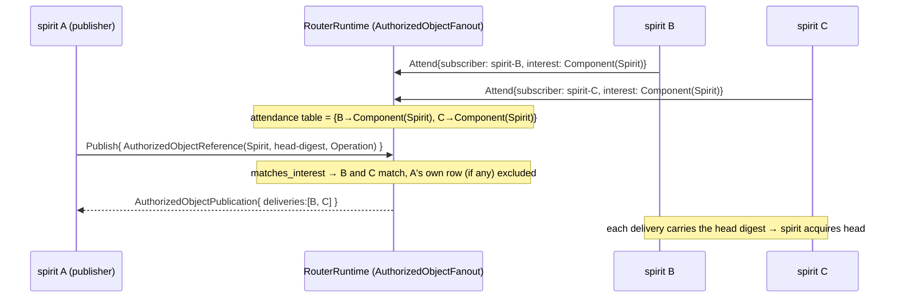

# 694·3 — Router type-fanout via signal-standard

Research input for the cluster-propagation PoC: how does the router fan an
authorized-head reference to exactly the spirits that asked for that
**type**, and what is the exact surface the harness calls?

## Load-bearing finding (correction to the frame's assumption)

The frame and this agent's brief assume the type-fanout matcher lives only
on the `attendance-fanout-139` BRANCH. **That is now stale.** A second,
cleaner in-memory implementation — `AuthorizedObjectFanout` — was merged to
`router` **main** at commit `ce578f1` ("router: add authorized object
fanout"), one commit *ahead* of the `430f1de` the frame names as HEAD. I
ran its test suite and observed **3/3 green** (below). The PoC should wire
to the **main-HEAD `AuthorizedObjectFanout` actor**, not the branch.

There are therefore two real, divergent implementations of the same idea.
The PoC wants the simpler one (main); the branch is the durable/persisted
variant operator will likely reconcile later.

```
ROUTER main (ce578f1)            ROUTER branch attendance-fanout-139 (0f444f8 / 23312d9)
─────────────────────           ────────────────────────────────────────────────────
AuthorizedObjectFanout actor     RouterObservationPlane + RouterTables.attendance
  in-memory Vec subscriptions      SEMA-engine durable attendance table
kameo ask: Attend / Withdraw     signal-router wire roots: OpenAttendance /
  / Publish / ReadStatus           CloseAttendance, replies ObjectAvailable push
matches via signal-standard      matches via signal-standard
  AuthorizedObjectReference        AuthorizedObjectInterest
  ::matches_interest(&interest)    ::matches_reference(&reference)   (inverted name+receiver)
test authorized_object_fanout.rs test attendance_fanout_truth.rs (pushes to bound
  (3 tests, OBSERVED GREEN)         ComponentSocket; not run by this agent)
signal-router dep = branch=main  signal-router dep = attendance-fanout-139 (Attend/Withdraw schema)
```

## How the router routes by TYPE (the matcher)

The "type" is the **signal-standard** `(component, kind)` coordinate. Every
authorized object reference carries it; every subscription expresses an
*interest* over it; the router keeps a table of open interests and on each
admitted reference runs the lattice predicate against every row.

The type vocabulary (all in `signal-standard/src/schema/lib.rs`, generated;
methods in `signal-standard/src/lib.rs`):

| Type | Where | Role as the "type key" |
|---|---|---|
| `ComponentKind` (enum, 14 variants: Spirit, Criome, Router, Mirror, …) | `schema/lib.rs:28` | which component owns the object |
| `AuthorizedObjectKind` (Operation, Contract, Agreement, Time) | `schema/lib.rs:57` | what kind of authorized object |
| `Differentiator { component, kind }` | `schema/lib.rs:67` | the (component,kind) pair = the canonical "type" |
| `AuthorizedObjectReference { component, digest, kind }` | `schema/lib.rs:129` | the fanned reference — type coordinate + content digest, **no payload** (m0p2/57f9) |
| `AuthorizedObjectInterest` (AnyAuthorizedObject \| Component(ComponentKind) \| ObjectKind(AuthorizedObjectKind) \| ComponentObject(ComponentObjectInterest)) | `schema/lib.rs:83` | the **4-rung interest lattice** a subscriber attends with |
| `ComponentObjectInterest { component, kind }` | `schema/lib.rs:75` | the most-specific rung (exact component+kind) |
| `StandardSocket` (UnixSocket \| NetworkSocket) | `schema/lib.rs:121` | discovery connection point (eaf7) — not used by the in-memory matcher |
| `ComponentClassification { differentiator, advertises }` | `schema/lib.rs:138` | a component's nameplate (its type + what it advertises interest in) |

The matcher itself — `signal-standard/src/lib.rs:70-79`:

```rust
impl AuthorizedObjectReference {
    pub fn matches_interest(&self, interest: &AuthorizedObjectInterest) -> bool {
        match interest {
            AuthorizedObjectInterest::AnyAuthorizedObject => true,
            AuthorizedObjectInterest::Component(c) => self.component == *c,
            AuthorizedObjectInterest::ObjectKind(k) => self.kind == *k,
            AuthorizedObjectInterest::ComponentObject(o) =>
                self.component == o.component && self.kind == o.kind,
        }
    }
}
```

This single predicate IS the type-fanout. It is "lattice" because the four
rungs match at different granularities (any / by component / by kind / by
exact pair) and several rungs can match one reference — so matching is a
**filter over the table**, never a key lookup. (`m0p2` makes router the
*sole* operational matcher; `l2ha` puts fan-out in router+subscribers;
`57f9` keeps router payload-blind — the reference carries only the type
coordinate + a digest, never the object body.)

Branch note: the branch's signal-standard names the same predicate
`AuthorizedObjectInterest::matches_reference(&reference)` (receiver and
name inverted), `signal-standard@attendance-fanout-139 src/lib.rs:77`.
Identical four arms. Operator reconciliation will pick one spelling.

## The exact main-HEAD surface (what the PoC calls)

The `AuthorizedObjectFanout` kameo actor —
`router/src/authorized_object.rs` (ce578f1), re-exported from
`router/src/lib.rs:40-45`. Held as a child of `RouterRuntime`
(`router/src/router.rs:1023` field, `:1101` spawn, `:1204` accessor); the
runtime forwards each message to it (`router/src/router.rs:1580-1650`).

Messages (kameo `ask` on `ActorRef<RouterRuntime>`):

| Message (struct) | Fields | Reply | Effect |
|---|---|---|---|
| `AttendAuthorizedObjects` | `subscriber: ActorIdentifier`, `interest: AuthorizedObjectInterest` | `RouterResult<AuthorizedObjectAttendanceSnapshot>` (token + already-matching refs) | register a type interest; idempotent (dedup on `(subscriber, interest)`); **back-fills** matching prior references |
| `PublishAuthorizedObjectReference` | `reference: AuthorizedObjectReference` | `RouterResult<AuthorizedObjectPublication>` (`deliveries: Vec<AuthorizedObjectDelivery>`) | the FAN-OUT: filter subscriptions by `reference.matches_interest(&token.interest)`, emit one `AuthorizedObjectDelivery { subscriber, reference }` per match |
| `WithdrawAuthorizedObjects` | `token: AuthorizedObjectAttendanceToken` | `RouterResult<AuthorizedObjectAttendanceWithdrawn>` (`retracted: bool`) | drop a subscription |
| `ReadAuthorizedObjectFanoutStatus` | `requester: ActorIdentifier` | `AuthorizedObjectFanoutStatus` (subscription/update/delivery counts) | observation |

The fan-out body — `router/src/authorized_object.rs:119-138`:

```rust
fn publish(&mut self, publication: PublishAuthorizedObjectReference) -> AuthorizedObjectPublication {
    let deliveries: Vec<_> = self.subscriptions.iter()
        .filter(|token| publication.reference.matches_interest(&token.interest))
        .map(|token| AuthorizedObjectDelivery {
            subscriber: token.subscriber.clone(),
            reference: publication.reference.clone(),
        })
        .collect();
    self.updates.push(publication.reference);
    self.deliveries.extend(deliveries.clone());
    AuthorizedObjectPublication { deliveries }
}
```

The reply's `deliveries` is the *exact* "fanned to these subscribers" set —
which the PoC test asserts on directly.

### The criome→standard projection seam (already in the test)

`router/tests/authorized_object_fanout.rs` includes
`criome_reference_projects_to_router_reference_only_pulse`, which takes a
`signal_criome::AuthorizedObjectReference` (criome's own type), projects it
via `impl From<signal_criome::…> for StandardReference` into the
signal-standard `AuthorizedObjectReference`, and publishes it. This is
exactly the spirit-A→criome→router seam the PoC needs, **already written and
green**. `signal-criome` is a `[dev-dependencies]` of router
(`Cargo.toml:58-59`) precisely so this projection can be proven in-repo.

## How the PoC wires three-spirit type-fanout

Single host, one `RouterRuntime`, three spirit identities. Type = the
authorized-head's `Differentiator`, e.g.
`(ComponentKind::Spirit, AuthorizedObjectKind::Operation)` — or
`(Criome, Contract)` for the contract head.



Concrete steps (mirrors the existing test, `tests/authorized_object_fanout.rs`):

1. `let router = RouterRuntime::start().await;`
2. Register B and C as attendees for the head TYPE:
   `router.ask(AttendAuthorizedObjects { subscriber: ActorIdentifier::new("spirit-B"), interest: AuthorizedObjectInterest::Component(ComponentKind::Spirit) }).await?` — and the same for `spirit-C`. (Use `ComponentObject(ComponentObjectInterest::new(Spirit, Operation))` for the tightest rung if A also subscribes to a different kind and must be excluded.)
3. From A's side, after criome authorizes the head, emit the reference:
   `router.ask(PublishAuthorizedObjectReference { reference: AuthorizedObjectReference::new(ComponentKind::Spirit, ObjectDigest::new(head_digest), AuthorizedObjectKind::Operation) }).await?`.
   (If the reference comes from criome's own types, project it through the `From<signal_criome::AuthorizedObjectReference>` shim the test already demonstrates.)
4. Assert `publication.deliveries` == exactly `{spirit-B, spirit-C}` and that A is not in the set (give A a non-matching interest or no attendance). Each delivery's `reference.digest` == the head digest → B and C "acquire" by fetching that digest. That fetch/acquire step is **out of router scope** (object-distribution layer; m0p2) and is the spirit-side research's concern.

This is the whole type-fanout leg, provable in-process against the real
`router` crate via a git dep — no shim needed for the matcher itself.

## Milestone-2 forwarding (075ca73) and payload-blindness

`075ca73` ("networked router-to-router forwarding transport, milestone 2")
is **in main's ancestry** (verified `git merge-base --is-ancestor 075ca73
ce578f1` → YES). It lifts mirror's tailnet-TCP into the router:
`RemoteRouterRegistry` (`src/remote_router.rs`),
`RouterPeerDelivery` (`src/peer_delivery.rs`, an off-mailbox
`TcpStream::connect` + one `ForwardMessage` frame), and `TailnetForwardIngress`
eager-bound in `RouterRuntime::on_start`. This is the cross-host transport
that, in a *physical* three-machine deploy, would carry a delivery from A's
router to B's and C's routers. **For the single-host in-process PoC it is
not needed** — all three spirits share one `RouterRuntime`, so fan-out is a
single in-memory `Publish`. The forwarding path is the system-operator's
physical-deploy step (frame's "physical-deploy left to system-operator").

Payload-blindness (`57f9`) holds throughout: `AuthorizedObjectReference`
carries `component` + `digest` + `kind` only — never the object body. The
router matches and fans the **reference**; the subscriber fetches the rkyv
object by digest elsewhere.

## What I observed (not claimed)

- `router` main HEAD = `ce578f1` (one ahead of frame's `430f1de`); worktree clean.
- `cargo test --test authorized_object_fanout` on `ce578f1`:
  **3 passed, 0 failed** —
  `..._delivers_reference_only_updates_to_matching_subscribers`,
  `..._returns_matching_snapshot_on_late_attend`,
  `criome_reference_projects_to_router_reference_only_pulse`.
- `signal-standard` main HEAD `49da9bf`: `cargo test` builds clean (0 unit
  tests — the matcher is exercised through router).
- Spirit `m0p2`, `l2ha`, `57f9`, `eaf7`, `eeeo` all confirmed via
  `spirit "(Lookup …)"` and quoted above.

## Git-dep coordinates for the harness

- `router = { git = ".../router.git", branch = "main" }` → `ce578f1`
  (has `AuthorizedObjectFanout`). Re-exports the full message surface from
  `lib.rs`. **Use this** for the PoC matcher.
- `signal-standard = { git, branch = "main" }` → `0b7ae20`
  (router's Cargo.lock pin) / repo HEAD `49da9bf`. `matches_interest`.
- `signal-criome = { git, branch = "main" }` → `521a8ed` (router dev-dep;
  has the criome `AuthorizedObjectReference` the projection shim consumes).
- `signal-router = { git, branch = "main" }` → router pins `e36e773`. NOTE:
  this is **before** the Attend/Withdraw wire surface (`1a9b02e`, on
  `attendance-fanout-139`). The main-HEAD `AuthorizedObjectFanout` does NOT
  need the signal-router wire roots — it uses its own router-local kameo
  message structs. So the PoC needs only signal-router main.

## Gaps for the PoC

1. **No `RouterRuntime` self-push of `ObjectAvailable`.** The main-HEAD
   actor *returns* the delivery set in the `Publish` reply; it does not
   actively push a frame to each subscriber's ComponentSocket. The branch
   (`attendance_fanout_truth.rs`) does push to a bound socket. **Workaround:**
   the PoC reads `publication.deliveries` directly and drives each spirit's
   acquire from it (the in-process harness owns all three spirits, so it can
   route the reply to B and C synchronously). Honest framing: the PoC proves
   *match-and-fan*; active socket-push is the branch's concern, not needed
   in-process.
2. **Two divergent matchers (main vs branch).** Picking main means the
   durable SEMA attendance table is not exercised. **Workaround:** state
   plainly that the PoC proves the in-memory matcher; persistence/restart
   replay is operator's reconciliation (harvest bead).
3. **Acquire is out of router scope (m0p2).** The router fans a *reference*;
   B and C fetching the head body by digest is the object-distribution
   layer. **Workaround:** the spirit-side leg owns acquire; this leg ends at
   "B and C received the head digest." Wire the two legs in the integration.
4. **`signal-router` Attend/Withdraw wire roots are branch-only.** If the
   PoC later wants the *wire* subscribe verbs (not the in-process kameo
   ask), it must pin `signal-router@attendance-fanout-139` + the matching
   `router@attendance-fanout-139` + `signal-standard@attendance-fanout-139`
   (the `matches_reference` spelling) as a consistent set. **Workaround:**
   the in-process PoC uses the kameo `ask` surface on main and avoids the
   branch set entirely.
