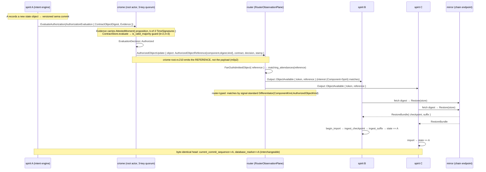
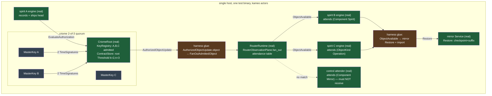

# 694 / 4 — integration seam + minimal-real PoC cut

Research area: the end-to-end integration seam, the minimal-real cut that
genuinely proves cluster propagation, and the harness shape. Read against
the four wire contracts and the daemon code at the HEADs below — every
code claim is `file:line` and distinguishes what the production path DOES
from what a test CAN drive.

## Grounded code state (what I verified this session)

| repo | HEAD / branch | built offline? | note |
|---|---|---|---|
| criome | `22801af` (HEAD) | **YES — green, 0.14s** | `cargo build --offline` clean |
| signal-criome | `beed19c` (`signal-criome-positional-migration-142`) | (via criome lock) | criome pins `signal-criome branch=main`; positional schema |
| signal-standard | `49da9bf` (HEAD/main) | **YES — green, 0.09s** | the "type" vocabulary; schema-next `b3be7d0` |
| router | `origin/attendance-fanout-139` | reported green (690 verified) | `FanOutAdmittedObject` + attendance match + `attendance_fanout_truth.rs` |
| signal-router | `origin/attendance-fanout-139` @ `1a9b02e` | reported green | `OpenAttendance`/`CloseAttendance`/`ObjectAvailable`; imports signal-standard |
| spirit | `origin/mirror-shipper-reland` @ `75d0e8d4` | green w/ operator regen (672/673) | `ComponentShipper`, offline full-chain harness |
| mirror | `b26c139` (HEAD) | unaudited (690 §9) | `Append`/`PublishCheckpoint`/`Restore`/`NotifyObject` |

Two corrections to the 690 audit that change the cut, both verified at
current HEAD:

- **The `k > n/2` majority guard (684 Woe 3) has LANDED.** criome now
  rejects sub-majority quorums at **both** guard sites via
  `QuorumShape::is_valid_majority` —
  `required != 0 && required <= authorities && required > authorities / 2`
  (`criome/src/language.rs:623-625`), called from the runtime
  attested-moment guard (`language.rs:577`) and the admission `Threshold`
  guard (`language.rs:414`). For n=3 this admits k=2 and k=3 and rejects
  k=1 — **2-of-3 is exactly the first real majority the PoC needs, and it
  is enforced in production code, not the harness.**
- **BLS aggregate verify (684 Woe 5) is still NOT done** — the quorum
  loop is still per-signature `verify_bls` (`language.rs:587-596`). It is
  a latency property, not a correctness one; it does not block the PoC.

## The exact end-to-end flow — message/object at each hop, owning crate



### Hop-by-hop, naming the exact type and its crate

1. **A accepts a new state object.** spirit records into its versioned
   sema commit log; the unit the rest of the chain carries is the
   **head**: `mirror::MirrorHead` (`commit_sequence()` +
   `entry_digest()`), shipped to mirror A as `ServerCommitted`
   (`spirit/src/shipper.rs`; existing harness leg 1,
   `end_to_end_offline_full_chain.rs:483-516`).

2. **A asks its criome to authorize the new head.** The wire object is
   **`signal-criome::AuthorizationEvaluation`** = `{ ContractObjectDigest,
   Evidence }` (`signal-criome/schema/lib.schema:289-292`). `Evidence` =
   `{ Component, Operation, Stamp:AttestedMoment, EvidenceSignatures,
   Agreements }` (`lib.schema:281-287`). Sent as
   `CriomeRequest::EvaluateAuthorization` to the **`criome::CriomeRoot`**
   actor (`criome/src/actors/root.rs:203`).

3. **criome's quorum authorizes under the root contract (2-of-3).** The
   **`AttestedMoment`** inside `Evidence.Stamp` carries an
   `AttestedMomentProposition { Window, RequiredSignatureThreshold,
   Authorities:Vec<Identity> }` and a `Vec<TimeSignature>` — one
   `TimeSignature` per signing machine (`signal-criome/schema/lib.schema:265-279`).
   `ContractStore.evaluate` runs the majority guard
   (`criome/src/language.rs:577`, `:623-625`) and the per-signature BLS
   check (`:587-596`) against the admitted `KeyRegistry`. **k=2, n=3 is
   the first config that passes the `required > authorities/2` term.**
   The root contract is a content-addressed **`signal-criome::Contract {
   Rule:Threshold { Required, Members:[PolicyMember] } }`**
   (`lib.schema:214-238`; `z9d6`). Result:
   `EvaluationDecision::Authorized` (`lib.schema:294-298`).

4. **criome emits the authorized-head reference (not the payload).** On
   `Authorized`, the production path publishes
   **`signal-criome::AuthorizedObjectUpdate { Object:AuthorizedObjectReference,
   ContractObjectDigest, Decision, Stamp }`** —
   `criome/src/actors/root.rs:210-224`. The carried
   **`AuthorizedObjectReference { Component, Digest, Kind }`**
   (`signal-criome/schema/lib.schema:326-330`) is **structurally
   identical** to **`signal-standard::AuthorizedObjectReference {
   component.ComponentKind, digest.ObjectDigest, kind.AuthorizedObjectKind }`**
   (`signal-standard/schema/lib.schema`, the `(c)` block) — the router
   contract imports the signal-standard one verbatim and notes "the same
   type criome emits at admission, so no projection/restamp at the router"
   (signal-router `attendance-fanout-139` schema comment, lines ~282-285).
   This is `m0p2`: **reference, never payload.**

5. **The ROUTER fans the reference, matched by TYPE.** The router entry
   point is **`router::FanOutAdmittedObject { reference: AuthorizedObjectReference }`**
   → `RouterObservationPlane::fan_out(reference)`
   (`router/src/observation.rs:143`, struct at `:379-388`). `fan_out`
   calls `tables.matching_attendances(reference)` and pushes
   **`signal-router::Output::ObjectAvailable { token, reference }`**
   (signal-router `attendance-fanout-139` schema `:286-289`) to each
   matching attender's ComponentSocket. The **TYPE** is the
   **`signal-standard::Differentiator { component.ComponentKind,
   kind.AuthorizedObjectKind }`** (signal-standard `(b)` block): a
   subscriber opens **`OpenAttendance { Attender, interest:AuthorizedObjectInterest,
   endpoint }`** (signal-router schema `:256-262`) for one interest rung
   of the four-rung lattice `AuthorizedObjectInterest`
   (`AnyAuthorizedObject | (Component ComponentKind) | (ObjectKind
   AuthorizedObjectKind) | (ComponentObject ComponentObjectInterest)`).
   The router matches `(component, kind)` of the reference against each
   open interest. The struct doc names this exactly: "until that [criome]
   client lands this is also the direct test entry point for the
   match-and-push step" (`observation.rs:375-378`). `57f9`/`eaf7`/`eeeo`:
   router-typed, payload-blind, signal-standard vocabulary.

6. **spirit B and C ACQUIRE the head.** Each spirit, on receiving
   `ObjectAvailable`, fetches the referenced object by `Digest` and
   restores: **`mirror::Restore(store)` → `RestoreBundle { checkpoint,
   suffix }`** (`signal-mirror/schema/lib.schema:21,29`), then
   `Engine::import` / `begin_import → ingest_checkpoint → ingest_suffix`
   (`spirit/src/engine.rs:547`; existing harness leg 3,
   `end_to_end_offline_full_chain.rs:437-441`). mirror is the
   object-distribution backstop (`d6he`/`nfvm`: criome holds the
   authorized head as a reference; spirit fetches/receives the bytes via
   the mirror).

7. **Interchangeable.** Assert B and C end byte-identical to A:
   `current_commit_sequence() == notice.sequence`,
   `database_marker() == A`, query surface equal
   (`spirit/src/engine.rs:453`; existing harness seam,
   `end_to_end_offline_full_chain.rs:471-500`).

## The two real, identified seam GAPS

The whole loop is built piecewise; what does **not** exist as a single
production wire is the join between criome's pulse and the router's
fan-out, and between the router's `ObjectAvailable` and a spirit reactor.

| seam | criome side | router side | gap |
|---|---|---|---|
| pulse → fan-out | emits `AuthorizedObjectUpdate` to a **local** `SubscriptionRegistry` that only `.count()`s and pushes to a `Vec` (`criome/src/actors/subscription.rs:142-153`) | accepts `FanOutAdmittedObject { reference }` and pushes `ObjectAvailable` (`observation.rs:143,379`) | **no production client dispatches criome's `AuthorizedObjectUpdate.object` into the router's `FanOutAdmittedObject`.** The router struct doc explicitly says a criome-socket client "until that client lands" is absent; `FanOutAdmittedObject` is the seam. |
| `ObjectAvailable` → acquire | — | pushes `ObjectAvailable { token, reference }` to a ComponentSocket | **no spirit-side reactor** consumes `ObjectAvailable` and triggers `Restore`. Existing offline harness used a harness-local `MirrorObjectNotice` over a chat body, not `ObjectAvailable`. |

These two are the genuinely-novel glue the PoC must write. Everything
else (criome quorum + majority guard, router attendance-match + fan-out,
spirit ship/restore) is real component code.

## The minimal-real cut: essential vs cuttable

### Essential (cutting any of these makes the PoC a fake)

1. **Real criome 2-of-3 quorum, real BLS, real majority guard.** Three
   `MasterKey::generate()` identities admitted into the `KeyRegistry`; a
   real `AttestedMoment` with 2 valid `TimeSignature`s; the real
   `ContractStore.evaluate` returning `Authorized` and the real
   `is_valid_majority` rejecting a 1-of-3 control. Without this the
   "2-of-3 root contract" claim is theatre.
2. **Real router type-fanout.** Three spirit attenders `OpenAttendance`
   with distinct interest rungs; the real `RouterObservationPlane::fan_out`
   / `matching_attendances` pushing `ObjectAvailable` to B and C and
   **not** to a non-matching control attender. This proves "matched by
   type."
3. **The reference, never the payload.** What the router carries is
   `AuthorizedObjectReference`; B/C fetch the bytes separately. Asserting
   the router body is a reference (digest), not the record set, is what
   makes `m0p2` true.
4. **Real acquire to byte-identical head.** B and C restore from the
   mirror and end with `current_commit_sequence`/`database_marker` ==
   A's. This is the falsifiable success assertion.
5. **The criome→router and router→spirit glue, written as the harness's
   own real code** (not stubbed), dispatching `AuthorizedObjectUpdate.object`
   into `FanOutAdmittedObject`, and `ObjectAvailable` into a `Restore`.
   These are the two seam gaps above — they are the PoC's actual
   contribution and the operator-harvest payload.

### Cuttable for the minimal-real first green (mark RED/shimmed)

| cut | why safe | how shimmed |
|---|---|---|
| **Cross-host transport.** Single host, in-process actors. | The cluster is the *logic*, not three machines (frame). All component code is loopback-proven already. | 3 in-process `CriomeRoot`-equivalents + 3 spirit engines + 1 `RouterRuntime`; deploy step is system-operator's. |
| **The direct criome-to-criome peer lane (`lt44`, 683 Part 2).** No `SolicitOperationSignature`/`PeerHello` network ceremony. | The 3 keys are co-located in one process; the harness assembles the k signatures directly the way `criome/tests/language.rs` does (`sign_moment`, `moment_with_authorities`). | harness assembles `Vec<TimeSignature>` from 3 local `MasterKey`s. |
| **The cluster-root admission ceremony (`ermr` provisioning).** | Admission gate is built+tested; the ceremony is an op step. | start each criome with `cluster_root: None` (`criome/src/actors/root.rs:Arguments`), or admit keys directly via `RegisterIdentity` with a harness-local cluster root. |
| **BLS aggregate verify (Woe 5).** | Latency only; per-signature loop is correct. | leave the production loop; note the latency caveat. |
| **mirror auto-fetch reactor + two-Service server-to-server fetch (`5osd`).** | The acquire path (`Restore`+`import`) is proven in the existing harness. | drive `Restore` from the spirit-side glue on `ObjectAvailable`, single mirror `Service`. |
| **Persistence/self-resume across restart** (mirror-target store axis, router replay SEMA). | The loop is single-run; restart resume is a deploy concern. | in-process, no restart. |

## Recommended harness shape



- **Real crates (git deps):** `criome` + `signal-criome` (quorum,
  majority guard, BLS, `ContractStore.evaluate`,
  `AuthorizedObjectUpdate`); `router` + `signal-router`
  (`attendance-fanout-139`: `RouterRuntime`, `RouterObservationPlane::fan_out`,
  `OpenAttendance`/`ObjectAvailable`, attendance match);
  `signal-standard` (`ComponentKind`/`Differentiator`/`AuthorizedObjectKind`/
  `AuthorizedObjectInterest` — the TYPE); `spirit` + `mirror` +
  `sema-engine` (ship + `Restore` + `import`, from the proven
  `mirror-shipper-reland` harness).
- **Harness glue (the PoC's own real code, not stubs):** (1) build 3
  `MasterKey`s, admit them, build the root `Contract` (`Threshold` k=2),
  assemble the 2-signature `AttestedMoment` + `Evidence`, drive
  `EvaluateAuthorization`; (2) on `Authorized`, take
  `AuthorizedObjectUpdate.object` and dispatch
  `FanOutAdmittedObject { reference }` to the router; (3) bind 3 spirit
  ComponentSocket witnesses + a non-matching control; (4) on
  `ObjectAvailable`, the spirit-side glue calls mirror `Restore` + spirit
  `import`. These four are the operator-harvest deliverables (seam gaps
  above).

### Test topology

- 1 router (`RouterRuntime`), 1 mirror `Service`, 1 criome
  (`CriomeRoot`) holding all 3 keys, 3 spirit engines (A producer; B, C
  acquirers), 1 control attender.
- spirit A: kind `Spirit`, object kind `Operation`. B attends
  `(Component Spirit)`; C attends `(ObjectKind Operation)`; control
  attends `(Component Mirror)` — proving the match is by **type**, not
  broadcast.

### The success assertion (falsifiable)

```
PASS iff ALL of:
  1. criome returns EvaluationDecision::Authorized for the 2-of-3 Evidence
     AND returns Rejected(TimeNotProven) for a 1-of-3 control     (real majority)
  2. router pushes ObjectAvailable to B and C, and NOT to control  (real type-match)
  3. the pushed body is an AuthorizedObjectReference (a digest),
     not the record payload                                        (m0p2 reference-only)
  4. after acquire: B.current_commit_sequence() == A's
     AND C.current_commit_sequence() == A's
     AND B.database_marker() == A.database_marker() == C's
     AND B.query(all) == C.query(all) == A.query(all)             (interchangeable, byte-identical head)
```

Assertion 4 is the load-bearing one the frame names: **B and C end with
a byte-identical authorized head == A.**

## Pin-unification note (the one build risk)

The harness links criome (main, schema-next `1de72dd`), router/signal-router
(`attendance-fanout-139`, schema-next `1de72dd`), spirit (`mirror-shipper-reland`,
schema-next `1de72dd`) — all on the **same** schema-next rev, good. But:

- **signal-standard exists on two refs:** main is schema-next `b3be7d0`
  (newer); `attendance-fanout-139` is `8befd44` (what router/signal-router
  lock). The harness must pin **one** signal-standard. Because criome's
  `AuthorizedObjectReference` is signal-criome-local (not yet importing
  signal-standard — the 690/9 "first consumer on a branch" migration is
  unlanded), the harness builds the router-side reference from
  signal-standard `attendance-fanout-139` and converts the
  signal-criome reference into it by field copy (the two are structurally
  identical — verified above). This is a 3-line `From`-style conversion in
  the glue, not a contract change.
- **The 672/673 `StaleGeneratedArtifact` wall** (`schema-rust-next`
  build.rs rejecting a stale checked-in `src/schema/lib.rs` when unified
  onto current HEAD) applies to any signal-router artifact lagging the
  generator. The proven operator fix is regenerate-on-branch
  (`SIGNAL_*_UPDATE_SCHEMA_ARTIFACTS=1`); if it bites the harness, the
  designer shims it as a local regen + RED note, never a committed
  `[patch]` (frame discipline). attendance-fanout-139 locks schema-next
  `1de72dd` which matches the rest, so this is lower-risk than 672's
  router-network-transport case.

## Bottom line

The cluster-propagation loop is built in pieces and each piece is real
component code: criome's **2-of-3 majority quorum is enforced in
production** (`language.rs:623-625`, a correction to 690), the router's
**type-fanout matcher is real and tested** on `attendance-fanout-139`
(`observation.rs:143`, `FanOutAdmittedObject`), the spirit **acquire path
is proven** in the existing offline harness. The PoC's genuine
contribution is two thin seam-glue joins — `AuthorizedObjectUpdate.object
→ FanOutAdmittedObject` and `ObjectAvailable → Restore+import` — wiring
three in-process spirits to one router and one 3-key criome, asserting B
and C end byte-identical to A. That is the minimal-real cut: real quorum,
real type-fanout, real acquire; cross-host transport, the direct peer
lane, the provisioning ceremony, BLS aggregation, and self-resume are the
honestly-shimmed cuttables.
