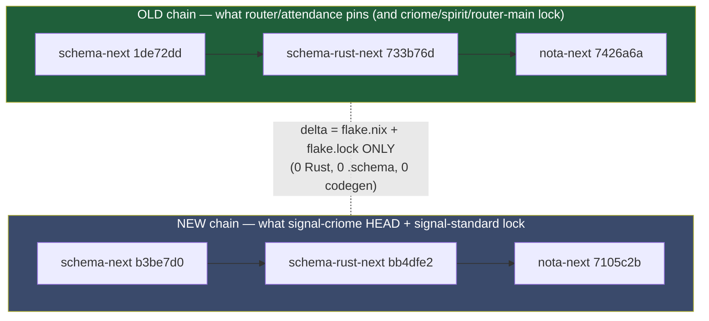

# 694 / 5 — buildable state + git-dep coordinates

**TL;DR.** Every crate the PoC harness needs builds **offline GREEN** at
the coordinates below, observed (not assumed). Two findings change the
frame's plan for the better: (1) the **criome majority guard (Woe 3) is
RESOLVED on main** — `criome` main `22801af` applies a `QuorumShape`
`required > authorities/2` guard at *both* the policy-evaluator and the
time-attestation sites, so the n=3/k=2 root contract works on main with
no branch; the `attested-moment-majority-guard-139` branch (`ed2f3b5`) is
its *predecessor*, one commit behind main. (2) The **router type-matcher
is real and green** — router `attendance-fanout-139` (`0f444f8`) builds
offline and passes 8/8 `attendance_fanout_truth` tests including the
positive/negative interest-rung match and sema-replay persistence. The
one true skew is cosmetic: the OLD vs NEW schema chain differs **only in
`flake.nix`/`flake.lock`** (zero Rust, zero grammar) — but Cargo still
treats the two commit hashes as distinct sources, so the harness must pin
**one** schema chain graph-wide or hit a duplicate-`schema-rust-next`
trait mismatch.

## Buildable-state table (observed at current HEADs)

| Repo | HEAD short-sha | On branch | main tip | Build observed | Notes |
|---|---|---|---|---|---|
| criome | `22801af` | main | `22801af` | **GREEN** `cargo build --offline` 3.4s | majority guard on main (lang.rs:414,577,623-625); daemon + 2-of-3 |
| signal-criome | `beed19c` | `signal-criome-positional-migration-142` | `521a8ed` | **GREEN** `cargo build --offline` 19.5s | checkout is **+1 ahead of main** ("migrate schema off retired field labels"); uses NEW schema chain |
| spirit | `fe04c12` | main | `fe04c12` | **GREEN** `cargo build --offline --lib` 43.8s | full bin pulls `agent` live-provider; lib builds clean |
| signal-spirit | `ee5a98e` | main | `ee5a98e` | resolves offline (`cargo metadata` ok); builds as spirit dep | OLD schema chain in its lock |
| mirror | `b26c139` | main | `b26c139` | builds as criome/router transitive dep | standalone `cargo metadata --offline` wants a fetch — note, don't chase |
| router | `ce578f1` | main | `ce578f1` | **GREEN** main builds; **attendance branch GREEN** (see below) | main lacks the type-matcher; needs the branch |
| router @ `attendance-fanout-139` | `0f444f8` | branch | — | **GREEN** `cargo build --offline` 1m41s; **8/8 `attendance_fanout_truth` pass** | the type-matcher (observation.rs interest-rung match + ObjectAvailable push) |
| signal-router | `3e4bb07` | main | `3e4bb07` | **GREEN** `cargo build --offline` 4.0s | type-fanout needs the **compat** branch (below) |
| signal-router @ `attendance-fanout-139-compat` | `cfbf643` | branch | — | builds as router-branch dep (pulled green in the 1m41s build) | Attend/Withdraw surface + field-label migration the operator owns |
| signal-standard | `49da9bf` | main | `49da9bf` | **GREEN** `cargo build --offline` 0.5s | main; but router branch pins the `attendance-fanout-139` head |
| signal-standard @ `attendance-fanout-139` | `8befd44` | branch | — | builds as router-branch dep (green) | ComponentKind/Differentiator/AuthorizedObjectKind + socket endpoint kind |
| sema-engine | `73eea24` | main | `73eea24` | builds as criome/router dep (`0.6.2`) | standalone offline metadata wants a fetch — note |
| signal-frame | `b0c2c65` | main | `b0c2c65` | builds as criome/router dep | standalone offline metadata wants a fetch — note |
| triad-runtime | `f46f66e` | main | `f46f66e` | builds as criome/router dep (`0.6.1`) | standalone offline metadata wants a fetch — note |
| nota-next | `7105c2b` | main | `7105c2b` | builds as transitive dep (both chains) | OLD `7426a6a` / NEW `7105c2b` — flake-only delta |
| schema-next | `b3be7d0` | main | `b3be7d0` | builds as transitive dep (both chains) | OLD `1de72dd` / NEW `b3be7d0` — flake-only delta (2 commits) |
| schema-rust-next | `bb4dfe2` | main | `bb4dfe2` | builds as transitive dep (both chains) | OLD `733b76d` / NEW `bb4dfe2` — flake-only delta |

All five direct builds and the `attendance_fanout_truth` test were run
with `cargo build/test --offline` from the local checkouts; the offline
git-dep cache (`~/.cargo/git`) already holds every LiGoldragon crate
needed, so the harness compiles without network.

## The schema-chain skew (the only real Cargo.lock hazard)



`git diff 1de72dd b3be7d0` (and the matching schema-rust-next /
nota-next pairs) touches only `flake.nix` + `flake.lock` — verified.
Codegen output is byte-identical between the chains. **But** Cargo keys a
git source by commit hash: if the harness's dep graph resolves
`schema-rust-next` to *both* `733b76d` and `bb4dfe2`, the generated types
become two distinct crate instances and trait bounds across the criome /
router / signal-standard boundary will fail to unify. The 690 audit's
`schema-next 1de72dd` figure was this resolved Cargo.lock rev, not a
Cargo.toml `rev=` pin — every production Cargo.toml pins `branch="main"`
and lets the lock fix the commit.

**Mitigation for the harness:** pin the schema chain to a single rev (or
add a top-level `[patch]` / unified `branch="main"` + one `cargo update`)
so the whole graph sees one `schema-next`/`schema-rust-next`/`nota-next`.
Either chain works; recommend the **NEW** tips (`b3be7d0`/`bb4dfe2`/
`7105c2b`, today's main) since signal-criome HEAD already wants them and
the flake-only delta means router/signal-standard codegen is unaffected.
If a build error shows mixed schema-rust-next versions, that is this
hazard — force one rev.

## Recommended git-dep coordinates for the harness Cargo.toml

```toml
# --- 2-of-3 criome quorum (majority guard on main — no branch needed) ---
criome        = { git = ".../criome.git",        branch = "main" }  # 22801af
signal-criome = { git = ".../signal-criome.git", branch = "main" }  # 521a8ed (main); HEAD beed19c is +1, optional

# --- spirit accept / validate / acquire ---
spirit        = { git = ".../spirit.git",        branch = "main" }  # fe04c12
signal-spirit = { git = ".../signal-spirit.git", branch = "main" }  # ee5a98e

# --- router type-fanout: BRANCHES REQUIRED (main lacks the matcher) ---
router          = { git = ".../router.git",          branch = "attendance-fanout-139" }          # 0f444f8
signal-router   = { git = ".../signal-router.git",   branch = "attendance-fanout-139-compat" }   # cfbf643  (NOTE: -compat, not plain)
signal-standard = { git = ".../signal-standard.git", branch = "attendance-fanout-139" }          # 8befd44

# --- infra (main) ---
mirror        = { git = ".../mirror.git",        branch = "main" }  # b26c139
sema-engine   = { git = ".../sema-engine.git",   branch = "main" }  # 73eea24
signal-frame  = { git = ".../signal-frame.git",  branch = "main" }  # b0c2c65
triad-runtime = { git = ".../triad-runtime.git", branch = "main" }  # f46f66e

# --- schema chain: pin ONE rev graph-wide (avoid duplicate-source skew) ---
# Either OLD (1de72dd/733b76d/7426a6a) or NEW (b3be7d0/bb4dfe2/7105c2b).
# Recommend NEW tips. Use [patch] or a committed Cargo.lock to force a single rev.
```

(URLs are `https://github.com/LiGoldragon/<repo>.git`.)

### Branch-vs-main flags (the load-bearing ones)

- **router + signal-router + signal-standard MUST be on branches**, not
  main: the type-matcher (`observation.rs` interest-rung match,
  `attendance_fanout_truth`) lives on `attendance-fanout-139` and is not
  yet on router main (`ce578f1`).
- **signal-router uses `attendance-fanout-139-compat` (`cfbf643`)**, NOT
  plain `attendance-fanout-139` (`9a26ba5`). The router branch Cargo.toml
  documents why: the compat branch carries an unrelated field-label
  migration the operator owns; the canonical Attend/Withdraw additions
  are on plain `attendance-fanout-139` but the router branch pins compat
  because router main hasn't integrated the latest signal-router contract
  yet. Operator flips both to `main` after that integration.
- **criome needs NO branch** — main `22801af` already has the majority
  guard. (Frame expected an `attendance-fanout-139` on criome; criome's
  parallel branch is `attested-moment-majority-guard-139` `ed2f3b5`,
  which is *behind* main, already superseded.)

## Offline-deps-missing note (don't chase)

`cargo metadata --offline` for **mirror, sema-engine, signal-frame,
triad-runtime** standalone returns "attempting an HTTP request, but
--offline was specified" — their own Cargo.lock wants a registry/git
fetch not in the local cache. This does **not** block the harness: all
four compiled cleanly as transitive deps inside the criome (3.4s) and
router-branch (1m41s) builds, so their *source* is fine and resolvable
from a dependent graph. Only their standalone-checkout lockfiles want a
fetch. Per task scope, noted not chased.

## What is PROVEN vs what a build merely COMPILES

- **Proven by test:** router type-matcher — 8/8 `attendance_fanout_truth`
  on `0f444f8`, including `matching_admitted_object_pushes_reference_to_attender`
  (positive interest-rung match), `non_matching_admitted_object_pushes_to_no_one`
  (negative), `withdraw_stops_further_pushes`, and
  `attendance_table_survives_restart_via_sema_replay` (sema-engine replay).
- **Proven by source on main:** criome majority guard — `is_valid_majority`
  (`language.rs:623-625`) = `required != 0 && required <= authorities &&
  required > authorities/2`, called at both guard sites (414, 577).
  (Its n=3/k=2 ACCEPTED / n=4,k=2 REJECTED test exists on the predecessor
  branch; the on-main `QuorumShape` form is stronger — guards the general
  policy path too.)
- **Compiles only (not yet a full-loop test):** the cross-component wire
  — criome `AuthorizedObjectUpdate` reference → router ingress → spirit
  acquire — is the seam the implement phase must wire and turn green;
  report 4 (integration seam) owns that cut. This report establishes only
  that every crate on that path compiles together at the stated coords.
