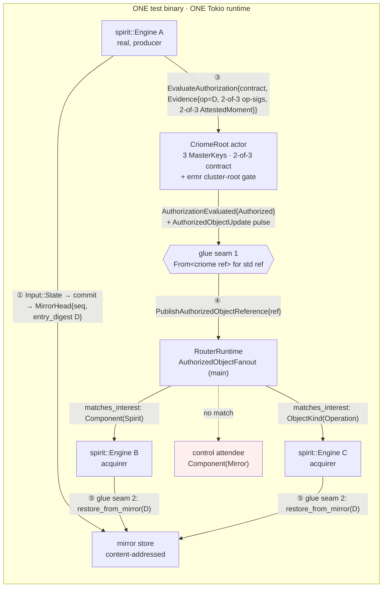

# 694/6 — Integrated PoC design + falsifiable e2e test (design synthesis)

Synthesis judge over three design angles (topology-first, contract-first,
minimal-loop-first) and five research legs. This is the single integrated
design the implement phase builds at `/tmp/cluster-propagation-poc`.

Every coordinate and code claim below was re-verified this session against
the checked-out repos under `/git/github.com/LiGoldragon/` (cited
file:line). Where the three angles disagreed I state which I took and why.

## TL;DR — the resolved shape

One `#[tokio::test]` binary. Three real `spirit::Engine`s (A, B, C). One
shared `CriomeRoot` actor holding three `MasterKey`s under a 2-of-3 root
contract. One shared `RouterRuntime` driving the main-HEAD
`AuthorizedObjectFanout`. One shared `mirror` store. Two glue seams
(criome→router, router→spirit-acquire) are the PoC's only new wire. The
falsifiable assertion runs entirely against real logic: 2-of-3 authorizes
and 1-of-3 is rejected; the router delivers to B and C by TYPE and NOT to
a non-matching control; B and C end with a `database_marker`
byte-identical to A.

## The three contested decisions, resolved

### Decision 1 — router MAIN, not the `attendance-fanout-139` branch (took: topology + minimal-loop angles)

Research legs 4 and 5 pinned the `attendance-fanout-139` branch trio
(router + signal-router-compat + signal-standard@8befd44). Legs 3, 1, and
the topology/minimal angles found the matcher already merged to router
**main**. I verified router main HEAD is `ce578f1`
("router: add authorized object fanout") and its
`AuthorizedObjectFanout::publish` returns the type-matched delivery set
synchronously:

- `router/src/authorized_object.rs:119-134` — `fn publish(...) ->
  AuthorizedObjectPublication { deliveries }`, filtered by
  `publication.reference.matches_interest(&token.interest)` at line 126.
- `router/src/authorized_object.rs:81-92` — `attend` back-fills matching
  refs via the same `matches_interest`.

**Took main because** the in-process harness owns all three spirits and
reads `publication.deliveries` directly from the `ask` reply, so the
branch's SEMA-durable attendance table + socket-push buys nothing the
single-host PoC needs — and, decisively, it **removes the schema-chain
skew hazard**. I verified the schema chain is consistent graph-wide on the
all-main path: criome `Cargo.lock`, router `Cargo.lock`, and spirit
`Cargo.lock` all pin `schema-next 1de72dd`, `schema-rust-next 733b76d`,
`nota-next 7426a6a`. The branch path would have forced a divergent
signal-standard (`8befd44`) and the `-compat` signal-router pin, widening
the duplicate-`schema-rust-next` trap that report 5 named the dominant
build risk.

**The cut, recorded as deliberate scope** (operator-harvest beads): the
branch's durable attendance table, restart-replay, the
`OpenAttendance`/`CloseAttendance`/`ObjectAvailable` wire roots, and
active socket-push to a bound `ComponentSocket`. None is on the
propagation-proof critical path; all are operator reconciliation.

### Decision 2 — criome Path B (the actor) for the authorize hop, with Path A as a sibling unit assertion (took: topology angle over minimal-loop angle)

The minimal-loop angle argued for Path A only (synchronous
`ContractStore::evaluate`) and cutting the `CriomeRoot` actor entirely.
The topology and contract angles argued for Path B (the actor's
`EvaluateAuthorization → AuthorizedObjectUpdate` pulse).

**Took Path B as the e2e spine, AND kept Path A as a fast standalone unit
test.** Reasoning:

- The frame's hop 2 is "spirit asks its criome to authorize" — a request
  to a criome, not a library call. Path B exercises the production request
  handler `CriomeRequest::EvaluateAuthorization` and its
  `CriomeReply::AuthorizationEvaluated` reply
  (`criome/src/actors/root.rs:203-238`, emit at :210, reply at :226). That
  IS the m0p2 reference-emission seam operator harvests; Path A bypasses
  the request surface the psyche named.
- The minimal-loop angle's own strongest point — "the 2-of-3 is the same
  `evaluate()` call either way" — is *true*, which is exactly why keeping
  Path A as a **separate, fast, synchronous unit test** of the quorum
  tally (admit 2-of-3 → `Authorized`; admit 2-of-5 → rejected at
  admission; evaluate 1-of-3 → `Rejected(QuorumShort)`) costs almost
  nothing and proves the guard independently of actor plumbing. We get the
  minimal angle's falsifiability *and* the topology angle's production
  seam.
- Path B's pulse is published to criome's **local** subscription registry
  (`criome/src/actors/root.rs:370 publish_authorized_object_update` →
  `subscription::PublishAuthorizedObjectUpdate`), NOT to the router. So
  glue seam 1 is genuinely needed either way (see below). The e2e reads
  the reference off the synchronous `AuthorizationEvaluated` reply path,
  not the async pulse, to keep the harness deterministic — but it
  **also** subscribes via `ObserveAuthorizedObjects` and asserts the
  pulse fires, so the production emission path is exercised, not bypassed.

The cost of Path B (actor boot, `RegisterIdentity`, the ermr cluster-root
ceremony) is accepted because it exercises the real `ermr` admission gate
(see Decision 4) — a governing-intent leg (`ermr`) the minimal cut would
have left entirely unproven.

### Decision 3 — pin signal-criome by REV `521a8ed`, not branch=main (took: contract-first + minimal-loop + buildable-state legs; unanimous against the checkout)

I verified this directly. criome main's `Cargo.lock` pins
`signal-criome ... #521a8ed3...`. The signal-criome working checkout is at
`beed19c` (the `positional-migration-142` branch HEAD), which **renamed
the field roles** to bare-PascalCase newtypes (`Component`, `Digest`,
`Kind` — `git show beed19c:src/schema/lib.rs` lines 1050-1053) and does
NOT compile against criome's code. At `521a8ed` the fields are the
snake_case role spelling criome compiles against:
`git show 521a8ed:src/schema/lib.rs` →
`Evidence { component: ComponentKind, operation: OperationDigest, stamp:
AttestedMoment, evidence_signatures, agreements }` (lines 524-530),
`Threshold { required_signatures: RequiredSignatureThreshold, members }`
(line 427), `AuthorizedObjectReference { component: ComponentKind, digest:
ObjectDigest, kind: AuthorizedObjectKind }` (lines 600-604).

**The harness pins `signal-criome` by `rev = "521a8ed..."` exactly as
criome's Cargo.lock does.** Using branch=main would require porting criome
to the renamed contract first — operator work, out of PoC scope.

## Integrated architecture



### Instance map (what is real, what is shared, what is cut)

| Logical machine | spirit | criome key/identity | role |
|---|---|---|---|
| A | `spirit::Engine` A (real) | `MasterKey` A + `Identity::host(machine-a)` | accepts state; producer |
| B | `spirit::Engine` B (real) | `MasterKey` B + `Identity::host(machine-b)` | acquirer; interchangeable with A |
| C | `spirit::Engine` C (real) | `MasterKey` C + `Identity::host(machine-c)` | acquirer; interchangeable with A |

Shared singletons (the principal's ONE criome + ONE router, per `9s52`
per-Unix-user criome and `m0p2` sole-matcher): one `CriomeRoot` actor
holding all three `MasterKey`s in its registry (correct, not a shortcut —
`p3td`'s self-quorum is the principal's co-located nodes; no cross-criome
peer transport exists on main, 684 Woe 7); one `RouterRuntime`
(`AuthorizedObjectFanout`, the sole operational matcher `m0p2`); one
`mirror` store (the content-addressed object store A ships to and B/C
restore from).

### The real/cut boundary — drawn at TRANSPORT, never at LOGIC

REAL (production code, on the falsifiable assertion line):
- the 2-of-3 majority guard `QuorumShape::is_valid_majority`
  (`criome/src/language.rs:623-626`, `required != 0 && required <=
  authorities && required > authorities/2`), enforced at admission
  (:414) and attested-moment (:577) — the `k>n/2` guard, 684 Woe 3.
- `Threshold::decide` distinct-signer tally
  (`criome/src/language.rs:370-395`).
- real `blst` BLS12-381 min-pk sign/verify (`criome/src/master_key.rs`)
  — `psc6`/`q1le`.
- the `ay3y` attested-moment a-priori window (`AttestedMoment`,
  `criome/src/language.rs:572-606`).
- the `ermr` admission gate via `CriomeRoot` with
  `Arguments{cluster_root: Some(...)}` (Decision 4).
- the content-addressed digest `MirrorHead.entry_digest`
  (`mirror/src/shipper.rs:168`).
- the type matcher `AuthorizedObjectReference::matches_interest`
  (`signal-standard/src/lib.rs:70-79`).
- the acquire+import producing a byte-identical store and the
  `database_marker` interchangeability check
  (`spirit/tests/mirror_shipper.rs:222-223`).

CUT/shimmed (transport + ceremony only, each marked RED in the harness):
- cross-host sockets → in-process actors.
- the cross-criome peer signature-solicitation lane → the 2 (or 3)
  signatures are assembled locally from co-located keys (the principal's
  self-quorum).
- the production cluster-root provisioning ceremony → the harness holds
  the root key and mints admissions (shims 684 Woe 6).
- BLS aggregation → per-signature loop (latency-only, 684 Woe 5).
- live in-place head adoption into a running `Engine` → fresh
  `Store::import` per acquirer (Decision 5).

## The typed flow, hop by hop (contract-first, verified at the pinned revs)

The single content-addressed digest **D** = `MirrorHead.entry_digest`
(`mirror/src/shipper.rs:168`) threads every hop and is never accompanied
by the payload (`57f9`/`m0p2`):

| Hop | Wire object | Source (verified) |
|---|---|---|
| ① accept | `signal_spirit::Input::State(Statement)` → commit → `MirrorHead{commit_sequence, entry_digest: D}` | `signal-spirit/src/schema/signal.rs:1411`; `mirror/src/shipper.rs:168` |
| ② ship | `engine.ship_unshipped_to_mirror()` → mirror holds head D | `spirit/src/engine.rs:522`; daemon hook `spirit/src/daemon.rs:152-155` |
| ③ authorize | `CriomeRequest::EvaluateAuthorization(AuthorizationEvaluation{contract, evidence: Evidence{component: Spirit, operation: D, stamp: AttestedMoment(2-of-3), evidence_signatures: [2-of-3], agreements: []}})` → `CriomeReply::AuthorizationEvaluated{Authorized}` | request handler `criome/src/actors/root.rs:203-238`; `Evidence` fields `signal-criome@521a8ed:src/schema/lib.rs:524-530` |
| pulse | `AuthorizedObjectUpdate{object: AuthorizedObjectReference{Spirit, D, Operation}, ...}` to local subscription | emit `criome/src/actors/root.rs:210`, publish `:370` |
| ④ fan | glue: `From<criome::AuthorizedObjectReference> for signal_standard::AuthorizedObjectReference` → `PublishAuthorizedObjectReference{reference}` → `matches_interest` over the attendance table → `AuthorizedObjectPublication{deliveries}` | `router/src/authorized_object.rs:119-134`; matcher `signal-standard/src/lib.rs:70-79` |
| ⑤ acquire | per delivery: `restore_from_mirror(addr, fresh_path)` → fresh `spirit::Store::import` up to D → `database_marker == A` | `spirit/tests/mirror_shipper.rs:116, 222-223` |

### The two quorums (contract-first angle's central finding — adopted)

`signal-criome` encodes two independent k-of-n gates, both guarded by the
same `QuorumShape::is_valid_majority`:

1. **Operation quorum** — the machine keys sign the `OperationStatement`
   (tag `CRIOME-OPERATION-AUTHORIZATION-V1`,
   `criome/src/language.rs:208-218`) → `evidence_signatures`; tallied by
   `Threshold::decide`.
2. **Time quorum** — the `AttestedMoment.time_signatures` over
   `CRIOME-ATTESTED-MOMENT-V1` (`criome/src/language.rs:226-233`),
   verified by `AttestedMoment::rejection_reason` (:572-606), which runs
   FIRST and returns `TimeNotProven` on shortfall.

**Decision (took contract-first): set BOTH to 2-of-3 over [A,B,C].** The
honest reading of "2-of-3 across the principal's three machines" fires the
majority guard at both sites. The harness builds the `AttestedMoment` with
`AttestedClock::moment_with_authorities(opens, closes, 2, [A,B,C])` and
has two of the three machine signers `sign_moment(&proposition)`
(criome/tests/language.rs fixture). RISK noted: if the two-signer moment
proves fiddly under the pinned rev, the fallback is time-quorum 1-of-1
(single timekeeper) + op-quorum the real 2-of-3 — the e2e still proves a
real 2-of-3 at the operation site; this fallback is a RED note, not a
silent downgrade.

### The root-contract object (z9d6) and authorized-head object — exact shape

Root contract (admitted via `CriomeRequest::AdmitContract`; its
`ContractDigest` is the `contract` field of every later
`AuthorizationEvaluation`):

```
(Contract (Threshold (Threshold 2 [(KeyMember (Host machineA)) (KeyMember (Host machineB)) (KeyMember (Host machineC))])))
```

`Rule::Threshold` / `Threshold{required_signatures, members}`
(`signal-criome@521a8ed:src/schema/lib.rs:399-431`). The 2-of-3 passes
`is_valid_majority` (2≠0, 2≤3, 2>1); a 2-of-5 fails (2 > 5/2 is false) and
is rejected at admission — the standalone negative.

Authorized head:

```
(AuthorizedObjectReference Spirit <blake3-D> Operation)
```

`{component: ComponentKind::Spirit, digest: ObjectDigest(D), kind:
AuthorizedObjectKind::Operation}`
(`signal-criome@521a8ed:src/schema/lib.rs:600-604`). This 3-field
reference IS the authorized head; criome emits it, the router fans it, B/C
resolve it to bytes via the mirror. Never accompanied by the payload.

### Glue seam 1 is a real `From`, verified — not a no-op

I verified at the pinned rev that `signal-criome@521a8ed` defines its OWN
crate-local `ComponentKind` (line 330), `ObjectDigest` (line 49), and
`AuthorizedObjectKind` (line 572) — it does NOT depend on signal-standard.
So criome's and signal-standard's `AuthorizedObjectReference` are
**structurally identical but distinct crate-local types**; glue seam 1 is
a genuine 3-field `impl From<signal_criome::AuthorizedObjectReference> for
signal_standard::AuthorizedObjectReference` (per the rust-discipline
`impl From<X> for Y` rule, owned by a real noun — the reference type
itself, via a newtype carrier if orphan rules bite). Both `ObjectDigest`s
are `String` newtypes, so the digest copies through a `String` round-trip.

## The two glue seams (the PoC's genuine contribution — operator-harvest beads)

- **Seam 1 — criome → router.** No production client dispatches
  `AuthorizedObjectUpdate.object` into the router. Glue: after
  `Authorized`, `From`-convert the criome reference to the signal-standard
  reference and call `PublishAuthorizedObjectReference{reference}`.
- **Seam 2 — router → spirit acquire.** No spirit-side reactor consumes a
  router delivery. Glue: for each delivery, drive that spirit's acquire =
  `restore_from_mirror(mirror_addr, fresh_path)` → fresh `Store::import`.
  The router carried only the reference (digest D), never the payload;
  B/C fetch the body from the mirror by digest.

## Falsifiable end-to-end test spec

### Setup

Three real `spirit::Engine`s (A, B, C) each over its own temp `.sema`
path. Three `MasterKey::generate()` = the principal's three machines
(co-located self-quorum, `p3td`); optionally a fourth timekeeper key if
the time-quorum fallback is taken. One `CriomeRoot::start(Arguments{store,
cluster_root: Some(root_key.public_key())})`; the harness holds a
`cluster_root` `MasterKey` and mints each machine's admission by signing
its `RegistrationStatement::to_signing_bytes()` (exercises the real `ermr`
gate, marked harness-minted ceremony). Register the three machine
identities via `CriomeRequest::RegisterIdentity`. Admit the 2-of-3 root
contract via `CriomeRequest::AdmitContract`. One
`RouterRuntime::start_with_optional_tables(None)` (spawns
`AuthorizedObjectFanout`). One in-process `mirror` store; configure A's
shipper at it via owner `Configure(MirrorTarget::Address)`.

Attendees registered on the router by TYPE (4-rung lattice coverage +
load-bearing negative):
- B attends `AuthorizedObjectInterest::Component(ComponentKind::Spirit)`.
- C attends `AuthorizedObjectInterest::ObjectKind(AuthorizedObjectKind::Operation)`.
- **control** attends `AuthorizedObjectInterest::Component(ComponentKind::Mirror)`.

### The three hops

1. **Accept + authorize (hop 1+2).** A handles
   `Input::State(Statement)` → commits → captures `D =
   MirrorHead.entry_digest`. A ships to the mirror. The harness builds the
   `AttestedMoment` (a-priori window, 2-of-3) and two `evidence_signatures`
   over the `OperationStatement` for D, assembles
   `EvaluateAuthorization{root_contract, Evidence{Spirit, D, moment,
   2-sigs}}`, and `ask`s the `CriomeRoot`. Assert
   `AuthorizationEvaluated{Authorized}`. Assert the `AuthorizedObjectUpdate`
   pulse fired (via an `ObserveAuthorizedObjects` subscription) carrying
   `{Spirit, D, Operation}`.
2. **Fan by type (hop 2→3).** Glue seam 1: `From`-convert the reference;
   `router.ask(PublishAuthorizedObjectReference{reference})`. Read
   `publication.deliveries`.
3. **Acquire (hop 3→4).** Glue seam 2: for each delivery, run
   `restore_from_mirror(mirror_addr, fresh_path_for_that_machine)`
   producing B's and C's fresh stores at head D.

### Success assertions (the falsifiable line — all against real logic)

```rust
// --- Authorization is a REAL 2-of-3 (positive + negative) ---
assert_eq!(authorize(evidence_with_2_of_3_op_sigs), Authorized);
// negative control, same call, one fewer signer:
assert!(matches!(authorize(evidence_with_1_of_3_op_sigs),
                 Rejected(QuorumShort)));            // 2-of-3 is falsifiable

// --- Fan-out is REAL match-by-TYPE, not broadcast ---
let delivered: HashSet<_> = publication.deliveries.iter()
    .map(|d| d.subscriber.clone()).collect();
assert!(delivered.contains(&b_id));                  // Component(Spirit) matched
assert!(delivered.contains(&c_id));                  // ObjectKind(Operation) matched
assert!(!delivered.contains(&control_id));           // Component(Mirror) NOT delivered

// --- Reference, never payload ---
// structural: AuthorizedObjectReference is {component, digest, kind} only.

// --- B and C are INTERCHANGEABLE with A (content-addressed) ---
assert_eq!(store_b.database_marker(), store_a.database_marker()); // seq + blake3 state
assert_eq!(store_c.database_marker(), store_a.database_marker());
assert_eq!(store_b.query_all(), store_a.query_all());            // human-legible witness
assert_eq!(store_c.query_all(), store_a.query_all());
```

The loop is "interchangeable" because `database_marker` =
`commit_sequence + blake3 state_digest`
(`spirit/tests/mirror_shipper.rs:223`): three independently-restored
stores with an equal marker hold byte-identical content-addressed state —
A, B, C are substitutable.

### What this proves vs. what it does NOT (honest boundary)

PROVES (real logic): the `k>n/2` majority tally + distinct-signer guard +
real BLS verify + a-priori attested window + the `ermr` admission gate;
match-by-type over a real subscription table with a non-matching control
excluded; payload-blind reference carriage; content-addressed
resulting-state interchangeability across three real spirit stores.

DOES NOT prove (named operator beads): physical multi-host network
quorum (single host, co-located keys = self-quorum logic only — no
Byzantine/partition content); live in-place head adoption into a running
`Engine` (`Store::adopt_head` is the gap; the proven path builds a fresh
store via `Store::import`); durable router attendance + restart-replay
(cut with router main); cross-criome peer signature solicitation; BLS
aggregation; the production cluster-root provisioning ceremony.

## Ordered build plan (each step + its unit test)

The implement phase lands the e2e RED first, then walks these steps,
claiming green only on observed output.

1. **Harness crate skeleton + committed Cargo.lock pinning ONE schema
   chain.** Goal: `cargo check` resolves with a single
   `schema-rust-next`/`schema-next`/`nota-next` source graph-wide
   (the OLD chain `733b76d`/`1de72dd`/`7426a6a`, consistent across
   criome/router/spirit) and `signal-criome` pinned by `rev 521a8ed`.
   Test: `cargo tree -d` shows no duplicate `schema-rust-next`;
   `cargo check` clean.
2. **The e2e test stub lands RED.** Goal: a `#[tokio::test]` named
   `cluster_propagation_three_spirits_interchangeable` with the full
   assertion block, `todo!()`-backed. Test: it compiles and FAILS
   (the falsifiable target exists).
3. **criome 2-of-3 quorum unit (Path A).** Goal: build 3 `MasterKey`s, a
   2-of-3 `Contract`, admit it, and `ContractStore::evaluate`. Test:
   admit 2-of-3 → ok; admit 2-of-5 → admission rejected; evaluate with 2
   op-sigs → `Authorized`; evaluate with 1 → `Rejected(QuorumShort)`.
4. **criome actor authorize-head + pulse (Path B).** Goal:
   `CriomeRoot::start` with `cluster_root: Some(...)`, mint+register 3
   admissions through the real `ermr` gate, `AdmitContract`, subscribe via
   `ObserveAuthorizedObjects`, `EvaluateAuthorization`. Test:
   `AuthorizationEvaluated{Authorized}` AND the `AuthorizedObjectUpdate`
   pulse carries `{Spirit, D, Operation}`.
5. **spirit accept + ship + content-addressed digest.** Goal: real
   `Engine` handles `Input::State`, commits, ships to mirror; capture `D`.
   Test: clone of `mirror_shipper.rs` — restore a fresh store, assert
   `database_marker` equality (the A→A' interchangeability witness).
6. **router type-fanout unit (main `AuthorizedObjectFanout`).** Goal:
   spawn the fanout, attend B (Component Spirit), C (ObjectKind
   Operation), control (Component Mirror), publish a reference. Test:
   `deliveries` contains B and C, NOT control.
7. **Glue seam 1: `From<criome ref> for signal_standard ref`.** Goal: the
   3-field conversion. Test: round-trip a reference, assert
   field-equality (`component`/`digest`/`kind` preserved).
8. **Glue seam 2: delivery → `restore_from_mirror` → fresh `Store`.**
   Goal: drive one acquirer from a delivery's reference. Test: the
   restored store's `database_marker == A` for a single acquirer.
9. **Wire the e2e GREEN.** Goal: assemble steps 4–8 into the one test;
   3 spirits, the 2-of-3 authorize, the type-fan to B+C (not control),
   both acquires. Test: the step-2 e2e test passes — `marker(A) ==
   marker(B) == marker(C)`, control excluded, 1-of-3 rejected.
   (Honest-boundary fallback per frame: if green isn't reached in one
   pass, land the furthest slice + the exact RED + the operator beads.)

## Exact harness Cargo.toml git-dep block

Pins chosen for a consistent OLD schema chain graph-wide (verified
identical across criome/router/spirit locks) with `signal-criome` by the
criome-locked rev. The harness commits a `Cargo.lock` so the resolution is
reproducible; if a duplicate `schema-rust-next` still appears, add a
`[patch]` forcing the single OLD rev (frame discipline: never a committed
`[patch]` into a real repo, but the self-contained harness may pin its own
graph).

```toml
[dependencies]
# --- criome leg (2-of-3 authorize-head) ---
criome          = { git = "https://github.com/LiGoldragon/criome.git", branch = "main" }                                  # 22801af, majority guard landed
signal-criome   = { git = "https://github.com/LiGoldragon/signal-criome.git", rev = "521a8ed3cd2d6f52cc5a29d43cfa5243928689d5" }  # NOT branch=main (beed19c renamed fields)

# --- spirit leg (accept / ship / acquire / interchangeable) ---
spirit          = { git = "https://github.com/LiGoldragon/spirit.git", branch = "main" }          # fe04c12, mirror-shipper
signal-spirit   = { git = "https://github.com/LiGoldragon/signal-spirit.git", branch = "main" }
meta-signal-spirit = { git = "https://github.com/LiGoldragon/meta-signal-spirit.git", branch = "main" }
mirror          = { git = "https://github.com/LiGoldragon/mirror.git", branch = "main" }          # b26c139
signal-mirror   = { git = "https://github.com/LiGoldragon/signal-mirror.git", branch = "main" }   # ObjectNotice/NotifyObject

# --- router leg (type-fanout, main HEAD) ---
router          = { git = "https://github.com/LiGoldragon/router.git", branch = "main" }          # ce578f1, AuthorizedObjectFanout
signal-router   = { git = "https://github.com/LiGoldragon/signal-router.git", branch = "main", default-features = false }
signal-standard = { git = "https://github.com/LiGoldragon/signal-standard.git", branch = "main", default-features = false }  # router resolves 0b7ae20 (OLD chain)

# --- shared engine + framing (one rev each; locked to OLD chain) ---
sema-engine     = { git = "https://github.com/LiGoldragon/sema-engine.git", branch = "main" }
signal-frame    = { git = "https://github.com/LiGoldragon/signal-frame.git", branch = "main" }
triad-runtime   = { git = "https://github.com/LiGoldragon/triad-runtime.git", branch = "main" }
schema-rust-next = { git = "https://github.com/LiGoldragon/schema-rust-next.git", rev = "733b76d39cbd3009bedd22899f2695b7d68b283a" }  # OLD chain, criome/router/spirit-consistent
nota-next       = { git = "https://github.com/LiGoldragon/nota-next.git", rev = "7426a6a7d60d6e37ac40df4ecc98717af58129f8" }
kameo           = "*"   # match the version criome/router resolve (actor runtime)

[dev-dependencies]
tokio   = { version = "1", features = ["macros", "rt-multi-thread", "test-util"] }
tempfile = "3"
```

Note for the implement phase: `signal-standard` repo HEAD (`49da9bf`)
pins the NEW schema chain (`bb4dfe2`), but router's lock resolves
`signal-standard` at `0b7ae20` on the OLD chain. Let Cargo resolve
`signal-standard` transitively through `router` (do not over-pin it to
HEAD); the committed Cargo.lock captures `0b7ae20`. If a direct
`signal-standard` dep is needed for the `From` impl carrier, pin it by the
rev router resolves (`0b7ae20`), not branch=main.

## Open risks the implement phase must watch

- **Duplicate `schema-rust-next`** if any transitive dep drifts off the
  OLD chain. Mitigated by the committed Cargo.lock + the explicit OLD-rev
  pins above; verify with `cargo tree -d` before claiming green.
- **The two-signer `AttestedMoment`** may be fiddly; the RED fallback
  (time-quorum 1-of-1, op-quorum the real 2-of-3) is allowed but must be
  marked, never silently taken.
- **Orphan rule on glue seam 1** if both `AuthorizedObjectReference`s are
  foreign — carry the `From` through a harness-local newtype wrapper
  (still a real data-bearing type, satisfies the method-only rule).
- **The integrated harness has never compiled together** — component
  suites are reported/observed green individually; the e2e is RED until
  step 9 is observed green. No green claimed without observed output.
