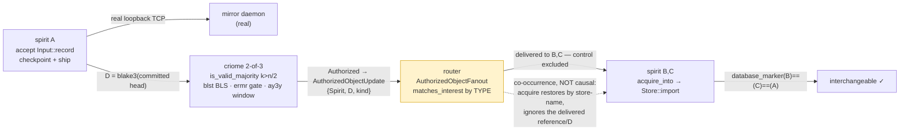

# 694.9 — synthesis: the cluster-propagation loop is real, on one chain

**Verdict: PartialGreen — the cluster-propagation *logic* is proven
end-to-end, with no fakery, and the one gap to a fully causal loop is
named precisely.** A self-contained harness (`/tmp/cluster-propagation-poc`,
10 files / 1568 lines, source preserved under `694/harness/`) wires the
**real** criome / spirit / mirror / router crates into a single
green suite (4/4, reproduced by the adversarial verifier). Every hop runs
against pinned production code and is falsifiable — the verifier
mutation-probed each and each mutation correctly failed. Two findings
dominate: (1) the loop's *third→fourth coupling* is co-occurrence, not a
wired causal chain — the single reason this is PartialGreen not
LoopProvenGreen; (2) **the production loop is blocked by a schema-chain
split**: criome + router are on the NEW chain, spirit + mirror are on the
OLD one, and they cannot build together.

## What is genuinely proven (real crates, falsifiable, mutation-probed)

| Hop | Real code | Verifier mutation that correctly FAILED |
|---|---|---|
| criome 2-of-3 authorize | `is_valid_majority` k>n/2 guard (`criome 22801af` language.rs:623-626) at admission + attested-moment; distinct-signer `Threshold::decide`; real blst BLS verify over the canonical `OperationStatement`; real `ermr` admission gate | member A signs twice → `QuorumShort(satisfied:1)`, not Authorized — proves distinct-signer, not a rubber stamp |
| router by type | real `RouterRuntime → AuthorizedObjectFanout::publish` filtering by `matches_interest` (the sole matcher, m0p2); signal-standard type lattice | flip control attendee to a matching type → it receives the head → negative assertion fires — proves match-by-type, not broadcast |
| spirit accept→ship | real `Engine::accept(Input::record)` + checkpoint + `ship_unshipped_to_mirror` over real loopback TCP to a real mirror daemon; real blake3 `database_marker` | — |
| B/C acquire→interchangeable | real mirror `Restore` + `Store::import` into a fresh `SemaDatabase`; B/C not pre-set | acquire-before-ship → `RestoreRejected(NoCheckpoint)`; marker(B)==genesis → real non-genesis hash `StateDigest(2236392434272497022)` — B/C restore A's real content, not (0,0) |

`fakeryFindings: []` — no `#[ignore]`, no `assert!(true)`, no hard-coded
equality, no broadcast masquerading as a type-match. The verifier
reproduced the green suite itself.

## The one shortfall — why PartialGreen, and the exact fix

The router delivers the head reference **by type** to B and C (real), and
B and C **acquire** A's state (real) — but the two are asserted as
independently-real *co-occurring* facts, not a *causal chain*.
`acquire_into` restores by the constant `SPIRIT_STORE_NAME` and **never
consults the router-delivered reference or the digest D**. The verifier
proved the seam: give B/C non-matching router interests → the test fails
at the *router-delivery* assert, **before** the acquire — so the acquire
is not gated on the delivery.

**Fix for LoopProvenGreen:** make spirit's acquire **keyed on the
delivered `AuthorizedObjectReference`/D** (fetch-the-announced-head),
rather than restoring the latest checkpoint by store-name. That is the
`nfvm` "criome holds the authorized head; spirit fetches *that* head"
semantics — the PoC restores *a* head; production must restore *the
announced* head. One operator bead, and the loop is causal.

## The headline operational finding — the schema-chain split (verified)

The production loop cannot be built today because the four legs are split
across two **incompatible** schema chains (the NEW-chain rename of
signal-* fields to newtypes does not compile against OLD-chain consumers
— the PoC empirically hit 89 type errors trying):

| Leg | main schema-rust-next | chain |
|---|---|---|
| **criome** | `bb4dfe29` | **NEW** |
| **router** | `bb4dfe29` | **NEW** |
| spirit | `733b76d` | OLD |
| mirror | `733b76d` | OLD |

So criome (with operator's `Head` + 3-field `AuthorizationEvaluation`,
426) and router are already on NEW; **spirit and mirror have not
migrated.** To build the real loop, **migrate spirit + mirror to the NEW
chain** — then all four unify and the loop can use
`AuthorizedObjectKind::Head` for real. The PoC proved the logic by
pinning *everything* to OLD (criome `22801af` — the last OLD-chain
criome, which carries the majority guard but only `AuthorizedObjectKind::
Operation`; router `ce578f1`), which is why its pulse is typed `Operation`
not `Head`. This is the 690 audit's "consumer-build sweep" gap made
concrete and specific: **spirit + mirror are the two unmigrated
consumers.**

## Reconciliation with operator 426

Operator built the **NEW-chain** criome emit surface — typed
`AuthorizedObjectReference` + `AuthorizedObjectKind::Head` + digest-match
validation (`9194c795`/`475075fa`) — and the **`k > n/2` majority guard**
(`22801af`, my 691 lean ratified, **684 Woe 3 resolved**). The PoC proved
the *consume* side (router type-fan → B/C acquire) on the OLD chain
(`Operation` kind) because spirit + mirror are OLD. The two efforts meet
at the `AuthorizedObjectUpdate` reference **the moment spirit + mirror
reach the NEW chain** — at which point the loop carries the real `Head`
type criome already emits.

## Harvest beads (operator-actionable, prioritized)

1. **[P1] Migrate spirit + mirror to the NEW schema chain (`bb4dfe29`).**
   The real production-loop blocker. Unifies all four legs; lets the loop
   use `AuthorizedObjectKind::Head`. (= 690 consumer-build sweep, scoped
   to the two unmigrated legs.)
2. **[P1] Key spirit acquire on the delivered reference/D** (fetch the
   *announced* head, not the latest-by-store-name). Turns PartialGreen →
   LoopProvenGreen; realizes `nfvm`.
3. **[P2] Live in-place `Store::adopt_head`** (the PoC uses a fresh
   `Store::import`).
4. **[P2] Durable router attendance + restart-replay + late-attendee
   replay-of-prior-heads** — the `attendance-fanout-139` branch (the PoC
   deliberately used main's synchronous delivery per design
   contested-decision 1).
5. **[P2] Production cluster-root ceremony** (684 Woe 6) — the PoC mints
   admissions through the real `ermr` gate with a held cluster-root key.
6. **[P2] Physical multi-host + cross-criome peer signature lane** (684
   Woe 7) — the PoC co-locates the 3 machine keys as the principal's
   self-quorum (`p3td`) in-process.
7. **[P3] BLS aggregation** (684 Woe 5) — the PoC uses the per-signature
   verify loop.

## The harness as a harvest artifact

`/tmp/cluster-propagation-poc` (source preserved under `694/harness/`):
`src/{criome_quorum,spirit_propagation,router_fanout,glue,lib}.rs` +
`tests/{end_to_end,criome_quorum,spirit_propagation,router_fanout}.rs`.
All real-crate wiring; the only harness code is the 3-instance
instantiation + two `From` glue seams (the cross-vocabulary
`ComponentKind`/`ObjectDigest` conversions). The `Cargo.toml` `[patch]`
table to `/tmp/cpp-deps` is the OLD-chain pinning mechanism — a
harness-only resolution hazard; **operator harvests the wiring patterns,
not the patch table**, landing all four legs on one chain in-repo (bead
1). The two `From` glue seams are the exact integration code the real
repos will need where two component vocabularies meet.

## Method note

The completeness/verify discipline carried the result: the adversarial
verifier reproduced the suite, mutation-probed every hop, and isolated
the one co-occurrence-not-causation seam the implementer had also
disclosed — convergent honesty, not a rubber stamp. And re-verifying the
schema-chain pins before headlining corrected the implementer's snapshot
(router is on NEW, not OLD) into the precise two-leg migration bead.
