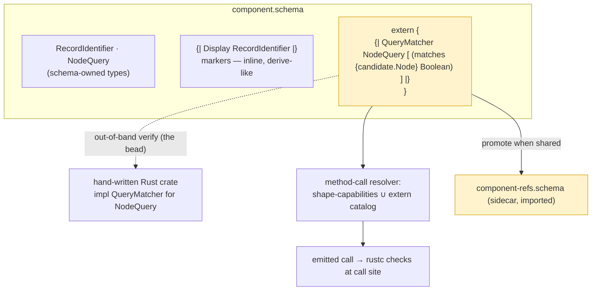

# 695 — `{| |}` catalog placement: the decision (grounded)

Decision, grounded by a 3-angle study (schema-next mechanism, FFI/IDL
prior art, seam/verification) that **independently converged**:

> **Hybrid, keyed to the two reference kinds.** Relationship **markers**
> (`{| Display RecordIdentifier |}`, plane participation) sit **inline,
> beside the type** they qualify — they read like a `derive`. Method-bearing
> **catalog** references (the external callable surface) are **grouped** in
> a conventionally-named `extern { … }` / `rust { … }` sub-namespace, and
> **promoted to a sidecar reference module** (imported via `crate:module:Type`)
> when the same Rust methods are referenced by more than one schema or need
> independent verification. **Inline-everything (my 693 lean #3) is wrong**
> and is dropped.

## Revision — the impl fuses onto the type (psyche; supersedes the marker-placement above)

The psyche cut the remaining complexity: *"then just create a new type of
object and combine them. separate objects introduce a lot of complexity."*
A free-standing `{| Display RecordIdentifier |}` **repeats the target** and
forces the reader, codec, and resolver to *associate* the marker with its
type — pure complexity. So the marker is **not a separate object beside the
type**; the **type declaration carries a trailing pipe-brace impl block,
target implicit** — the real `derive`/`impl` model, and exactly record
`3742` (a type's kind/participations are marked **at its declaration**).
This **supersedes `bpyu` → `ba6d`** (the impl is no longer a free-standing
object).

```nota
RecordIdentifier String {| Display Ord |}                              ;; markers fused onto the newtype
StatementText String   {| Display  (word_count {} Integer) |}          ;; marker + inherent method sig
NodeQuery { differentiator.Differentiator }
           {| QueryMatcher [ (matches { candidate.Node } Boolean) ] |} ;; trait + its method sigs
Work (| Input Output |) {| PlaneMember |}                              ;; plane participation on the decl
```

Inside the fused block each entry is: a **bare trait atom** (marker), a
**trait atom + `[method-sigs]`** (body-bearing trait impl), or a **bare
`(name { params } Return)`** (inherent method). Consequences for 695's
decision below:

- The **"markers inline as separate objects"** line is replaced by **fused
  onto the declaration** — no separate objects, no target repetition, no
  association step.
- **`extern { }` dissolves entirely** — resolved by the psyche's
  **body-optional form** (design-adopted; phrased "we could also allow", so
  not yet Spirit-firmed). Impls for a type whose declaration is *elsewhere*
  (locally separate, or imported) use **`TypeName {| impls |}`** — the type
  name leads, the impl block follows, **no inline body**:

  ```nota
  StatementText {| Display  (word_count {} Integer) |}   ;; impls for a type declared elsewhere
  ```

  The target still *leads*, so this is "impls for StatementText," resolved
  by ordinary symbol lookup — **not** a free-standing object that repeats
  the target inside the pipe-brace. So the one combined shape is
  `TypeName <body>? {| impls |}?` (need at least one of body / impl-block):
  body+block = declare-and-impl, body-only = plain declaration, block-only =
  impls for an elsewhere-declared type. **Zero free-standing impl objects,
  no forced re-import.** This is `ba6d`'s fuse principle with the body made
  optional, and it is exactly Rust's "a type's impls may live apart from its
  definition."
- The **verification goal survives intact**: the impl blocks remain a
  **typed, enumerable set** the out-of-band crate-checker walks across all
  type declarations (`schema.types().flat_map(|t| t.impls())`) — one
  logical manifest, even though it's syntactically fused, not a separate
  block.
- **Cross-schema reuse** now rides the existing **type import**: impls
  travel with their type, so importing the type brings its referenced
  impls — no sidecar needed for the common case.

Everything below stands as the *grounding* (mechanism, prior art, seam),
read through this revision: group→fuse-onto-declaration, sidecar→type-import.

## Why my 693 lean was wrong

I leaned "inline, one construct, no new block." The mechanism study killed
it on a fact I didn't have: **the schema root is rigidly positional**
(`imports?`, input-root, output-root, namespace-brace —
`engine.rs:388`), so there is **no free top-level slot** for inline
`{| |}` objects at all. "Inline at the namespace top" can only mean
`{| |}` entries *inside* the namespace brace — which is exactly where a
grouped `extern { }` sub-namespace also lives, except inline scatters the
trust-boundary claims among schema-owned types and loses the seam
distinction the reference exists to mark. Inline buys nothing grouping
doesn't, and gives up the grouping. And `extern { }` is **not a new
delimiter** — a lowercase-keyed brace is *already* a sub-namespace today
(`source.rs:609-616,2750-2756`), proven end-to-end by the nested-router
fixture; only the `{| |}` *values* inside need new handling (which every
option needs regardless).

## The three-way convergence

| Angle | Best | Why |
|---|---|---|
| **schema-next mechanism** | **B** (grouped namespace) | Reuses the one proven container for grouped, module-qualified declarations — the recursive sub-namespace. `A` is *structurally impossible* (fixed root arity). The `(\| \|)` generic-decl precedent (`generics.rs:230,327`) proves a pipe-delimited head integrates cleanly as a namespace entry. |
| **FFI/IDL prior art** | **B**, → **C** when shared | Cross-ecosystem law: external-implementation declarations are *grouped* (Rust `extern` block, WIT `import`, protobuf `service`), lifted to a *sidecar* (C header, TS `.d.ts`, IDL `include`) when shared/verified. Inline is the minority pattern, only for one-off local symbols. No mature ecosystem scatters extern declarations through normal code. |
| **seam / verification** | **C** for methods, **inline** for markers (hybrid) | The generator *never reads the hand-written Rust* (`build.rs:435-440`), so a `{| |}` method claim is **unverifiable at generation time** — caught only when cargo compiles the emitted call. The only feasible verifier is an out-of-band crate-checker, which wants **one enumerable manifest**. Markers are low-risk, derive-like, locality-valuable → inline. |

All three reject A as the home; two name B, one names C, and the seam
angle resolves the B-vs-C choice into the hybrid + the promote-when-shared
rule. That convergence from independent framings is the load-bearing
evidence.

## The decision in detail

### Relationship markers → inline, beside the type

`{| Display RecordIdentifier |}`, `{| Ord RecordIdentifier |}`,
`{| [T] PlaneMember (Work T) |}` — a marker is a low-risk property of one
adjacent type (its risk is bounded by a well-known trait), reads like a
`#[derive]`, and `663` already treats this intent as per-type (the
`*deref` newtype marker sits on the newtype). It belongs next to its
type, not exiled into a manifest.

### Method-bearing catalogs → grouped `extern { }`, sidecar when shared

The callable-signature references are the **genuine external surface** and
the **highest-risk, generator-unchecked** part of the seam. Group them:

```nota
my_component {
  RecordIdentifier String
  {| Display RecordIdentifier |}                 ;; marker — inline, beside its type
  {| Ord RecordIdentifier |}

  NodeQuery { differentiator.Differentiator }

  extern {                                        ;; the fenced schema↔Rust seam
    {| QueryMatcher NodeQuery [ (matches { candidate.Node } Boolean) ] |}
    {| StatementText [ (word_count {} Integer) ] |}
  }
}
```

Promote `extern { … }` to a **sidecar reference module** when the same Rust
methods are referenced by more than one schema (the C-header / `.d.ts`
case) — one verified claim, many importers, riding the existing
`crate:module:Type` + `ImportResolver` path rather than duplicating the
claim in every consumer:

```nota
;; component-refs.schema  (reference-only module)
extern { {| QueryMatcher NodeQuery [ (matches { candidate.Node } Boolean) ] |} }
;; component.schema imports the reference (ImportResolver gains a 3rd importable kind: trait/impl refs)
```

### The seam fact that decides it (and what placement does NOT change)

A `{| |}` reference is a **claim about external code the generator cannot
check**. Imports are different — the engine verifies a schema-name import
in-engine (`resolution.rs:254 declared_type_named`); a `{| |}` target is
hand-written Rust the engine has no loader for. So:

- Placement does **not** move where drift errors appear: a renamed/removed
  Rust method always surfaces as a rustc error at the *generated call
  site*, never at the catalog object — under A, B, or C alike.
- Placement **does** move the **human/tooling audit surface** and enables
  **reuse**: the only realistic verifier is an out-of-band test that parses
  the crate and confirms each referenced signature exists; that test wants
  **one enumerable manifest** (B/C), not a scatter-hunt (A), and the
  sidecar lets multiple schemas share a single verified claim.

## Build cost (shared by all options; B minimizes the rest)

Every option needs the same core: a **typed `{| |}` reference source-noun**
(decode via `StructuralMacroNode`, a `to_schema_text` writer, and lowering
to a new `extern`/reference declaration kind), and acceptance of `{| |}`
as a namespace value where `engine.rs:658-668` currently rejects PipeBrace.
B adds nothing beyond that (the `extern` sub-namespace already parses); C
additionally extends `ImportResolver` to treat trait/impl references as a
third importable kind. The method-signature leg `(name { params } Return)`
reuses the `Work`-frame-leg shape, and the `(| |)` generic precedent
proves the namespace-entry layer hosts a pipe-delimited head with its own
handler.

## The concrete next step (turns organization into verification)

Pair the 693 prototype's green fixture with an **out-of-band
catalog-verification test**: it parses the referenced Rust crate and
fails when a `{| |}` signature is absent or mismatched. That test is what
makes the `extern`/sidecar an actual *trust-boundary check* rather than
just tidy organization — and it is far cheaper to write against one
manifest (B/C) than against scattered inline claims (A). This is the
operator bead that closes the seam.



## Method note

The decision reversed my own lean, and reversed it on evidence I lacked
(the rigid root arity, the generator-never-reads-Rust seam fact) — exactly
what the study was for. Three independent angles converging on
group-the-external-surface, plus the seam analysis splitting markers from
method-catalogs, is stronger than any single take, including my prior one.
