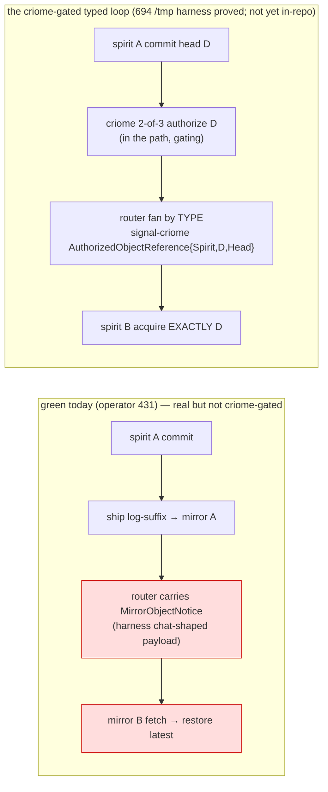

# 697 — propagation loop: refreshed state, blockers, questions

After operator 426 (criome typed Head reference + 2-of-3 majority) and
operator 431 (the 6-crate schema-chain unification). TL;DR: **the
schema-chain split is genuinely closed and a real ship/notify/restore
loop is Nix-gated green — but the green loop is *not yet the
criome-gated typed loop*.** The 694 `/tmp` harness wired
criome→router(by-type)→spirit-acquire-exactly-D; the real in-repo path
does not yet. So `PartialGreen → LoopProvenGreen` needs **three** wirings,
not just acquire-by-reference, plus the `m0p2` matcher retirement.

## Verified (I re-checked, not on trust)

- **Chain split closed.** `spirit 4d0e0ca`, `mirror 027a991`,
  `signal-spirit 6884d7a`, `signal-mirror d12dda9`, `meta-signal-mirror
  a5b625f` all on `schema-rust-next bb4dfe293` (NEW). criome + router were
  already NEW. (My earlier 5-crate scope missed `meta-signal-mirror` —
  operator's 6-crate closure was right.)
- **Router fanout is real on main** — `src/authorized_object.rs` +
  `ce578f1` "add authorized object fanout" + `4ce85c12` "route authorized
  head object references"; `Attend`/`Withdraw`/attendance present.
- **The offline full-chain test does NOT include criome or the typed
  reference.** `tests/end_to_end_offline_full_chain.rs`: leg 2 is *"a
  router-carried object-accepted NOTICE"* = `MirrorObjectNotice { store,
  head }`, *"a harness-local payload that the router carries as a
  chat-shaped message body"*, with the source comment noting *"promoting
  it into a real signal-router/signal-mirror MirrorObjectNotify later."*
  criome appears only in comments.
- **criome still operationally matches** — `actors/subscription.rs:68
  matches_update`, `:117`/`:149 interest.matches_update`. `m0p2`
  (router-sole; criome observation/audit-only) is not yet realized in
  criome.

## The real loop vs the target loop

## Blockers (operator beads)

1. **[P1] criome-gate + typed reference are missing from the real path.**
   Spirit must ask criome to authorize head `D` (2-of-3) *before*
   propagating, and the router must fan the **real** signal-criome
   `AuthorizedObjectReference { Spirit, D, Head }` by type — replacing the
   harness-local `MirrorObjectNotice` chat-payload (`d6he`/`nfvm`). This
   is the under-emphasized half of "not fully causal": it's not only the
   acquire, the *authorize gate and the typed reference* aren't in the
   real loop either. The 694 harness shows the shape; the wiring is the
   work.
2. **[P1] acquire-by-delivered-reference** (operator's named gap): a
   delivered `{ Spirit, D, Head }` must force acquisition of **exactly
   `D`**, not restore-latest. Falsifiable test (operator's): *deliver D1,
   make D2 latest, acquire must restore D1 or fail.*
3. **[P2] criome operational-matcher retirement (`m0p2`)** — retire
   `SubscriptionRegistry`'s `matches_update` to observation/audit-only;
   the router's fanout is the sole operational matcher. Today both match
   (double-booked).
4. **[P2] router-ecosystem closure edge** (operator's caveat): router
   main + its newest transitive `signal-router`/`signal-message`/
   `signal-persona` are not one freely-updatable closure; spirit pins
   compatible transitive versions. Converge them so a future update
   doesn't re-break.

## Questions for the psyche

- **Q1 — acquire-by-`D` semantics.** *Restore-by-digest* (mirror fetches
  the head whose content-digest is `D` — true `nfvm` "fetch the announced
  head"; needs mirror content-addressed restore) vs *verify-after-restore*
  (restore latest, assert `== D`, reject mismatch — simpler interim). My
  lean: verify-after-restore as the falsifiable interim (it satisfies
  operator's test), restore-by-digest as the production target — *does
  mirror support content-addressed restore by digest today?*
- **Q2 — integration home for the real loop.** Promote spirit's offline
  full-chain test in-repo (swap the placeholder notice for the typed
  reference + add the criome 2-of-3 gate) vs a dedicated cross-component
  integration harness/repo. My lean: promote the existing spirit test —
  it already proves the hard transport legs; add criome + the typed
  reference + acquire-by-`D`.
- **Q3 — priority.** Close the **single-host fully-causal loop**
  (blockers 1-3 → in-repo LoopProvenGreen) first, or push toward
  **multi-machine production** (684 woes: BLS aggregation, cluster-root
  ceremony, cross-criome peer transport), or pivot to the **schema-language
  arc** (the 696 method-call resolver follow-on)? My lean: close the
  single-host causal loop first — it's the smallest step that turns the
  green-but-not-causal loop into a real proof.
