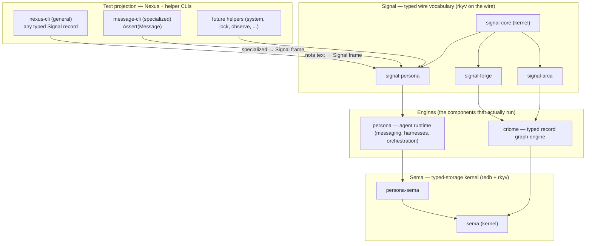
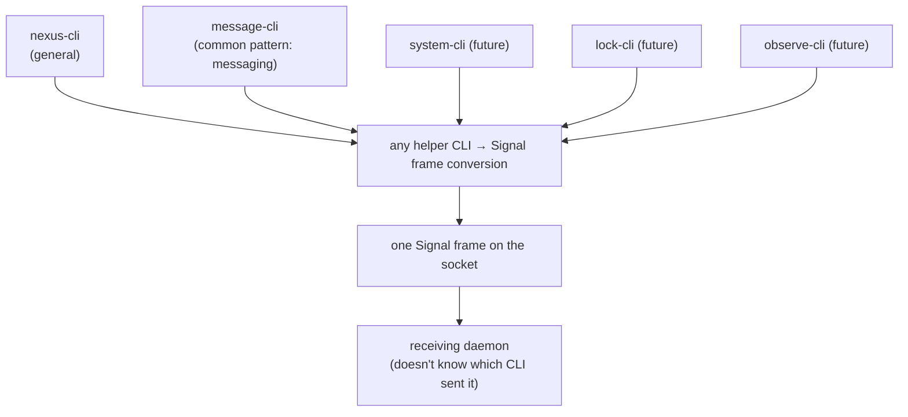
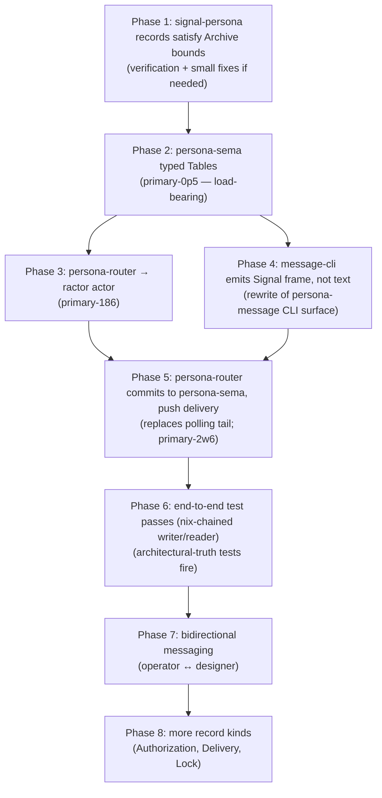
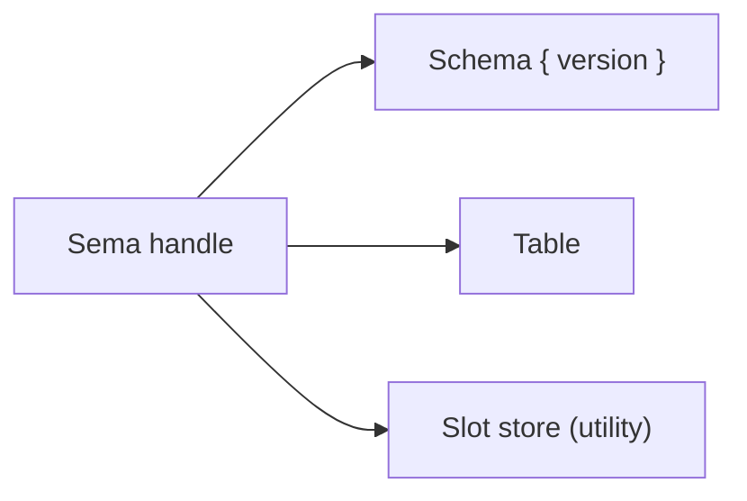
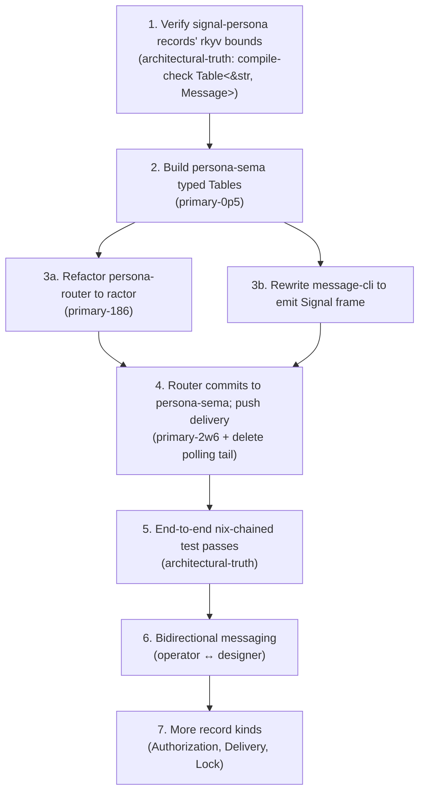

# 70 · Code-stack amalgamation — sema + signal + criome + persona, with messaging as first production stack

Status: companion to `designer/68` (workspace amalgamation).
Where 68 covered tooling/skills/protocols, this report
covers the **code architecture** — the four ecosystems that
do the actual work — plus the user's vision (per
2026-05-09):

1. **Nexus is the text format of Signal.** Helper CLIs
   (`message`, future `system`, etc.) are convenience
   wrappers that produce Signal frames; the receiving
   daemon doesn't know which CLI was used.
2. **Messaging is the first production stack.** Use the
   whole stack (sema + signal + criome + persona) for
   agent-to-agent messaging end-to-end, then iterate.
3. **Architectural-truth tests** (per
   `skills/architectural-truth-tests.md`, just landed)
   verify the architecture is followed, not just that the
   behavior succeeds.

Author: Claude (designer)

---

## 0 · TL;DR



| Layer | Status | Critical gap |
|---|---|---|
| Signal-core (wire kernel) | ✅ shipped | none |
| Signal-persona (wire contract) | ✅ shipped | naming drift (`primary-tlu`); FocusObservation duplication (`primary-3fa`) |
| Sema (state kernel) | ✅ shipped (post-audit fixes) | hygiene batch (`primary-4zr`); `Table::iter` (`primary-nyc`) |
| Persona-sema (state layer) | 🔄 open-handle only | **typed Tables missing (`primary-0p5`) — load-bearing** |
| Criome (engine) | ✅ shipped | reader_count migration to local (`primary-4zr`) |
| Persona (runtime) | 🔄 partial — drift register | **off-design polling tail (`primary-2w6`)**; not-ractor (`primary-186`); endpoint enum (`primary-0cd`) |
| Nexus-CLI | ✅ shipped (independent crate) | needs verification it produces typed Signal frames per the new vision |
| Message-CLI | 🔄 in `persona-message` (current behavior is text-files-with-polling, not Signal frames) | needs rewrite per vision §2 |

---

## 1 · The vision (2026-05-09)

### 1.1 · Nexus + helper CLIs

The user's framing:

> Nexus is the text format of Signal. There's the `nexus`
> CLI to send Nexus messages. And there are helper CLIs like
> `message` that convert their inputs into what Nexus
> converts into. The Message CLI doesn't convert into Nexus
> — it converts into what Nexus converts into. So a
> `message` is an `Assert`. When the message CLI is used, it
> basically converts all of its inputs into `(Assert
> (Message ...))` in Signal. The system doesn't even need to
> know that the message CLI was used or the nexus CLI was
> used — it should be all the same.



**Equivalent forms:**

```sh
# via nexus-cli — explicit, longer
nexus '(Assert (Message designer "need a layout pass"))'

# via message-cli — convenient, specialized
message designer "need a layout pass"
```

Both produce **the same Signal frame** on the wire. The
receiving persona-router doesn't distinguish them.

### 1.2 · Messaging as the first production stack

Phase 1 — **end-to-end one message**:

```mermaid
flowchart TB
    operator["operator agent"] -->|message designer "..."| msgcli["message-cli"]
    msgcli -->|Signal frame: (Assert (Message ...))| router["persona-router (ractor actor)"]
    router -->|persist via typed Table| sema["persona-sema"]
    sema -->|rkyv-archived| disk[(redb file)]
    sema -->|on-commit event| router
    router -->|push to recipient| harness["designer harness"]
    harness -->|pre-input projection| terminal["designer terminal"]
```

Pass conditions:
- The message goes through Signal (not direct file write)
- The router commits to persona-sema *before* delivery
- The recipient receives the message via push (not polling)
- The architectural-truth tests (next §) prove each step

Phase 2: bidirectional, multi-message conversations.
Phase 3: more record kinds (Authorization, Delivery, Lock).

### 1.3 · Architectural-truth tests

Per `skills/architectural-truth-tests.md` (just landed).
Specifically for the messaging stack:

| Constraint | Test |
|---|---|
| message-cli output equals nexus-cli equivalent | golden frame comparison: `nexus '(Assert (Message ...))' \| xxd` == `message ... \| xxd` |
| Router commits to persona-sema before delivery | typed event trace: `CommitMessage` precedes `DeliverToHarness` |
| persona-sema actually wrote to disk | **nix-chained**: writer derivation produces `state.redb`; reader derivation opens it via persona-sema and finds the message |
| Harness receives Signal, not raw text | wire-format witness on the harness socket |
| Push-only delivery (no polling) | `tokio-test` clock-pause: zero retries during paused time |
| router-to-message dependency only via signal-persona | `cargo metadata` test fails if persona-router pulls persona-message directly |

The nix-chained writer/reader pattern is the strongest
witness — it makes "agent claims database write but
actually keeps state in memory" mechanically detectable.

---

## 2 · The four ecosystems

### 2.1 · Signal — typed wire vocabulary

| Crate | Role | Status |
|---|---|---|
| `signal-core` | Kernel: `Frame`, `SemaVerb`, `PatternField<T>`, `Slot`, `Revision`, `ProtocolVersion`, `AuthProof` | ✅ shipped |
| `signal-persona` | Persona's wire records (Message, Lock, Harness, Delivery, Authorization, Binding, Observation, StreamFrame, Deadline, DeadlineExpired, Transition) | ✅ shipped (916 LoC) |
| `signal-forge` | Criome's forge effect verbs | ✅ shipped |
| `signal-arca` | Criome's arca-store effect verbs | ✅ shipped |

**Pattern**: `signal-core` (kernel) + `signal-<consumer>`
(layered effect crate). Each consumer adds typed payloads
for its narrow audience while reusing the kernel's
`Frame`/handshake/auth.

**Open question** (`primary-kxb` #2): does each channel
get its own physical `signal-persona-*` repo, or does
`signal-persona` own per-channel modules until a second
concrete consumer forces a split?

**Drift to fix**:
- `PersonaRequest`/`PersonaReply` violate no-crate-prefix
  rule (`primary-tlu`) — mechanical sweep
- `FocusObservation` duplicated in persona-system
  (`primary-3fa`) — converge on contract

### 2.2 · Sema — typed-storage kernel

| Crate | Role | Status |
|---|---|---|
| `sema` | Kernel: `Sema` handle, `Schema { version }`, `Table<K, V: Archive>`, `read`/`write` closures, version-skew guard, slot-store utility | ✅ shipped (post-audit-66 fixes) |
| `persona-sema` | Persona's typed-storage layer atop sema | 🔄 open-handle only — typed Tables MISSING |
| `forge-sema` | Forge's typed-storage layer (future) | 📋 designed in `designer/64` §0 |

**Critical gap (`primary-0p5` P1):** `persona-sema` today
declares `SCHEMA = Schema { version: SchemaVersion::new(1) }`
and a `PersonaSema::open(path)` handle. Zero typed `Table`
constants are exported. Until they land, persona-sema is
**just an open-wrapper, not a typed-storage layer**.

The shape that needs to land:

```rust
// persona-sema/src/tables.rs (proposed)
use sema::Table;
use signal_persona::{Authorization, Binding, Delivery, Harness, Lock, Message, Observation, ...};

pub const MESSAGES: Table<&str, Message> = Table::new("messages");
pub const LOCKS: Table<&str, Lock> = Table::new("locks");
pub const HARNESSES: Table<&str, Harness> = Table::new("harnesses");
pub const DELIVERIES: Table<&str, Delivery> = Table::new("deliveries");
pub const AUTHORIZATIONS: Table<&str, Authorization> = Table::new("authorizations");
pub const BINDINGS: Table<&str, Binding> = Table::new("bindings");
pub const OBSERVATIONS: Table<&str, Observation> = Table::new("observations");
// ... + StreamFrame, Deadline, DeadlineExpired, Transition
```

Verification needed: signal-persona's records satisfy the
`Archive + Serialize<...> + Deserialize + CheckBytes` bound
chain. They derive `Archive` already; bytecheck might need
explicit derives.

### 2.3 · Criome — the engine (sema's first major consumer)

| Crate | Role | Status |
|---|---|---|
| `criome` | Engine: takes Signal frames, validates, commits to sema, projects via prism, executes via forge | ✅ shipped |
| `arca` | Content-addressed artifact store; sema records reference arca by hash | ✅ shipped |
| `nexus` | Text format crate (consumes nota-codec) | ✅ shipped |
| `nexus-cli` | Text-to-Signal CLI for criome | ✅ shipped |
| `prism` | Sema → Rust source projector | ✅ shipped |
| `forge` | Build executor | ✅ shipped |

Criome owns its own redb file via sema; uses sema's slot
store + the typed records from `signal`. Reader-pool config
(`reader_count`) is currently in sema as a deprecated
accessor — pending move to criome (`primary-4zr`).

**Criome's role in the messaging vision**: criome is **not**
the messaging engine — that's persona. Criome is the
engine for the typed-record graph (code, schema, world data,
plans). The two engines coexist; both consume sema; their
record kinds don't overlap.

### 2.4 · Persona — the agent runtime (messaging, harnesses, orchestration)

The biggest ecosystem. 8 sibling crates totaling ~5400 LoC.

| Crate | Role | Status |
|---|---|---|
| `persona` | Meta repo + daemon composition | 🔄 in-flight |
| `signal-persona` | Wire contract (already in §2.1) | ✅ shipped |
| `persona-message` | Typed message records + CLI + first store | 🔄 has its own polling text-file store (off-design) |
| `persona-router` | Delivery routing actor + queue | 🔄 plain struct, not ractor; not contract-typed |
| `persona-sema` | Typed storage (already in §2.2) | 🔄 open-handle only |
| `persona-system` | OS facts (Niri focus source today; prompt buffer next) | ✅ shipped (operator/54) |
| `persona-harness` | Harness actor model | 📋 skeleton |
| `persona-wezterm` | PTY transport + terminal capture | ✅ shipped |
| `persona-orchestrate` | Workspace coordination (typed successor to bash `tools/orchestrate`) | 🔄 stub (designer/64 §4 design) |

Designer/4 is the apex design. The current state has 8
specific drifts catalogued in operator/67's gap audit.

---

## 3 · Parallel development — messaging-stack-first plan

The user's directive: **start using the whole stack for
messaging**. The first production use case forces every
component to be real, not stubbed.

### 3.1 · The dependency order (DAG)



### 3.2 · Phase-by-phase scope

#### Phase 1 — verify signal-persona records' rkyv bounds

**What**: each record type in signal-persona needs to
satisfy `Archive + Serialize<...> + Deserialize +
CheckBytes` so it fits in `sema::Table<K, V>`. Today they
derive `Archive`; verify bytecheck and the deserializer
bound.

**Test (architectural-truth)**: a `compile_check` that
declares `const _: Table<&str, signal_persona::Message> =
Table::new("...");` — fails to compile if bounds
unsatisfied.

**Effort**: 1-2 hours; small fixes if any.

#### Phase 2 — persona-sema typed Tables (`primary-0p5`)

**What**: `persona-sema/src/tables.rs` declares 11 typed
`Table<K, V>` constants, one per signal-persona Record
kind. `persona-sema/src/lib.rs` re-exports them. Tests in
`persona-sema/tests/round_trip.rs` round-trip each record
kind through `PersonaSema::open` + write + read.

**Architectural-truth tests**:
- *Insert+read round-trip per record kind* (one test per
  Table)
- *Schema-version-mismatch hard-fails* (already in sema's
  test suite; verify persona-sema inherits)
- *Nix-chained writer/reader for at least Message* (proves
  the typed Table actually wrote bytes to disk)

**Effort**: 1 day.

#### Phase 3 — persona-router → ractor (`primary-186`)

**What**: rewrite `persona-router/src/router.rs::RouterActor`
as `ractor::Actor`. The current `apply(&mut self, ...)`
becomes `handle(...)` per ractor's API. State migrates from
struct fields to `Actor::State`.

**Architectural-truth tests**:
- *No public method on RouterHandle except `start` +
  message-send shortcuts* (the actor surface IS the API)
- *Router talks to persona-sema only via PersonaSemaHandle
  (a typed actor reference), not via direct method calls*
  (compile-fail test on the bypass)
- *Sync-façade-on-State pattern for unit tests* (per
  lore/rust/testing.md)

**Effort**: 1-2 days.

#### Phase 4 — message-cli emits Signal frame

**What**: rewrite the CLI surface in `persona-message/src/`
(or a new `message-cli` crate) so `message designer "hi"`
constructs a `(Assert (Message ...))` Signal frame and
sends it on the persona-router's UDS — not appending to a
text file.

**Architectural-truth tests**:
- *`message X "..."` produces the same bytes as `nexus
  '(Assert (Message ...))'`* — golden byte comparison
- *No write to any file outside the router's socket* —
  process-tree witness via `lsof` or strace

**Effort**: 1 day.

#### Phase 5 — router commits to persona-sema, push delivery (`primary-2w6`)

**What**: persona-router's `handle(RouteMessage)` does:
1. Begin write txn on persona-sema
2. Insert into MESSAGES table
3. Commit
4. Send `DeliverEvent` to recipient harness via push (not polling)

The 200ms tail-loop in `persona-message/src/store.rs` is
deleted in the same change.

**Architectural-truth tests**:
- *Router emits CommitMessage before any DeliverToHarness*
  — typed event trace
- *Restart router after queued message; message survives
  only if committed* — nix-chained writer/reader, the
  writer derivation crashes the router after queueing
- *Zero work during `tokio-test` paused-clock period* —
  proves no polling

**Effort**: 2 days.

#### Phase 6 — end-to-end test passes (architectural-truth)

**What**: a nix-chained test where:
- Writer derivation: spawn router daemon, run `message
  designer "stack test"`, wait for commit, kill daemon,
  output `state.redb`.
- Reader derivation: open the state.redb via PersonaSema,
  read the messages table, assert the message landed with
  the right sender + body.

**Effort**: 0.5 days (the witnesses are already established;
this composes them).

#### Phase 7 — bidirectional

**What**: actual operator ↔ designer messaging in real
harness windows. Replace the persona-message text-files-
with-polling test path with the new Signal-based one.

**Effort**: 1-2 days; mostly integration + UX.

#### Phase 8 — more record kinds

**What**: incrementally use Authorization, Delivery, Lock
records from the same persona-sema tables. The
authorization gate from designer/4 §5.8 lands here.

**Effort**: open-ended; each record kind is its own slice.

### 3.3 · Total to first production messaging

Phases 1-6: ~6-8 days of operator work. Phases 7-8: open-
ended. **Phase 6 is the milestone** — at that point, the
whole stack is real for one use case, with witnesses
proving every architectural claim.

---

## 4 · Component-by-component status (post-vision)

### 4.1 · sema (kernel)



✅ Just-landed kernel works. 22 tests pass; 7 nix checks.
Hygiene batch open (`primary-4zr` — split lib.rs, namespace
internal tables, move reader_count to criome, OpenMode for
opt-in slot store). `Table::iter` open (`primary-nyc`).

### 4.2 · signal-core (wire kernel)

✅ Owns Frame, SemaVerb (12 verbs zodiacal), PatternField<T>,
Slot, Revision, ProtocolVersion, AuthProof. Stable.

### 4.3 · signal-persona (wire contract)

✅ 916 LoC, 12 modules. Records: Message, Lock, Harness,
Delivery, Authorization, Binding, Observation,
StreamFrame, Deadline, DeadlineExpired, Transition.
PatternField<T> migration done (24 sites).

⚠️ Drift: `PersonaRequest`/`PersonaReply` etc. violate
no-crate-prefix (`primary-tlu`). FocusObservation
duplicated in persona-system (`primary-3fa`).

### 4.4 · persona-sema (state layer)

🔄 **Open-handle only**. The load-bearing missing piece is
the typed Tables (`primary-0p5`). This blocks Phase 2 of
the messaging stack.

### 4.5 · persona-message → message-cli (text-projection layer)

🔄 Currently a 1572-LoC text-file-with-polling
implementation. Per Phase 4 of the stack plan, the CLI
surface gets rewritten to emit Signal frames. The
text-file store goes away (per Phase 5).

Open question (`primary-kxb` #3): is the harness boundary
text language Nexus, NOTA records, or a named projection
("PersonaText"?) when the model is text-trained?

### 4.6 · persona-router (delivery routing)

🔄 Plain struct, 457 LoC. Per Phase 3, becomes a ractor
actor. Per Phase 5, commits to persona-sema before
delivery.

### 4.7 · persona-system (OS facts)

✅ 740 LoC; NiriFocusSource shipped. Next: PromptObservation
fact source (per operator/67 §3 + audit 60 finding).

⚠️ Drift: invented `PromptObservation` instead of using
contract's `InputBufferObservation` (`primary-3fa`).

### 4.8 · persona-wezterm (PTY transport)

✅ 1053 LoC. Works. Open question (`primary-kxb` #5):
internal PTY byte protocol vs Signal at the harness actor
boundary.

### 4.9 · persona-harness (harness actor model)

📋 88-LoC skeleton. Implementation lands as Phase 5+ of
the messaging stack.

### 4.10 · persona-orchestrate (typed `tools/orchestrate`)

📋 75-LoC stub. Designer/64 §4 has the full design (CLAIMS
+ TASKS + CLAIM_LOG + TASK_LOG tables; atomic claim-and-
overlap-check; iterates the claims table not a hard-coded
role list). Implementation gated by `Table::iter`
(`primary-nyc`) + persona-sema typed Tables (`primary-0p5`).

### 4.11 · criome (the other engine)

✅ Mature. Uses sema directly. Reader pool from
sema's deprecated accessor (move pending — `primary-4zr`).

---

## 5 · Vision and open architectural decisions

### 5.1 · Vision (per user 2026-05-09, this report)

1. Nexus is the text format of Signal. Helper CLIs
   (`message`, etc.) are convenience wrappers that produce
   Signal frames. The receiving daemon is text-oblivious.
2. Messaging is the first production stack — agent-to-agent
   messages flowing through sema + signal + persona end-to-
   end.
3. Architectural-truth tests prove the architecture, not
   just behavior. Nix-chained writer/reader derivations are
   the strongest witness.
4. Everything component-to-component is Signal (rkyv on the
   wire); every channel has a contract repo or module; every
   stateful actor uses ractor.

### 5.2 · Open architectural decisions (`primary-kxb` aggregates)

| # | Question | Lean / blocker |
|---|---|---|
| 1 | Are `Bind` and `Wildcard` allowed to remain ZST records? Or must they be promoted to data-bearing? | Lean: keep ZST, name the exception (operator/67 §12 #1) |
| 2 | Channel repo granularity: single `signal-persona` or split into per-channel repos? | Wait for second concrete consumer per kernel-extraction trigger |
| 3 | Harness boundary text language: Nexus, NOTA, "PersonaText" projection? | Open — needs design report |
| 4 | Terminal adapter protocol: persona-wezterm internal PTY vs Signal at the boundary? | Lean: internal PTY for now; Signal at the harness actor boundary |
| 5 | Does the message-cli live in a new crate or stay inside persona-message? | Lean: new crate `message-cli` (per `skills/micro-components.md` — one capability per crate); `persona-message` becomes the typed-records library |
| 6 | When should signal-network be designed? (cross-machine messaging) | Defer until a second machine actually needs it (`primary-uea`) |

---

## 6 · Implementation order — concrete commitment

The phased plan from §3, restated as the punch list:



**Hygiene fixes that should land in parallel (not blocking
the messaging stack):**
- `primary-tlu` Persona* prefix sweep (rename pass)
- `primary-3fa` FocusObservation contract convergence
- `primary-0cd` endpoint.kind closed enum
- `primary-4zr` sema kernel hygiene batch
- `primary-nyc` Table::iter (needed for persona-orchestrate)

---

## 7 · See also

**Companion reports:**
- `~/primary/reports/designer/68-architecture-amalgamation-and-review-plan.md`
  — workspace amalgamation (this report's sibling for
  tooling/skills/protocols)
- `~/primary/reports/designer/4-persona-messaging-design.md`
  — apex Persona design
- `~/primary/reports/designer/12-no-polling-delivery-design.md`
  — no-polling principle (the rule the polling tail
  violates)
- `~/primary/reports/designer/19-persona-parallel-development.md`
  — parallel-crate organisation
- `~/primary/reports/designer/26-twelve-verbs-as-zodiac.md`
  — 12-verb scaffold
- `~/primary/reports/designer/40-twelve-verbs-in-persona.md`
  — verbs in Persona's surface
- `~/primary/reports/designer/45-nexus-needs-no-grammar-of-its-own.md`
  + `46-bind-and-wildcard-as-typed-records.md` — current
  pattern wire
- `~/primary/reports/designer/63-sema-as-workspace-database-library.md`
  + `64-sema-architecture.md` + `66-skeptical-audit-of-sema-work.md`
  — sema-family design + audit
- `~/primary/reports/operator/67-signal-actor-messaging-gap-audit.md`
  — the current Persona drift audit
- `~/primary/reports/operator/69-architectural-truth-tests.md`
  — the originating proposal for §1.3

**Skills:**
- `~/primary/skills/architectural-truth-tests.md` — just
  landed; the test discipline §1.3 references
- `~/primary/skills/contract-repo.md` — wire contracts
- `~/primary/skills/rust-discipline.md` §"redb + rkyv" +
  §"Actors" — the kernel + ractor rules
- `~/primary/skills/push-not-pull.md` — the polling-tail
  rule

**Open beads (per designer/68 §11):**
P1: `primary-0p5` (persona-sema typed Tables — Phase 2),
`primary-2w6` (off polling — Phase 5).
P2: `primary-186` (ractor — Phase 3a), `primary-tlu`,
`primary-3fa`, `primary-0cd`, `primary-4zr`, `primary-nyc`.

---

*End report.*
