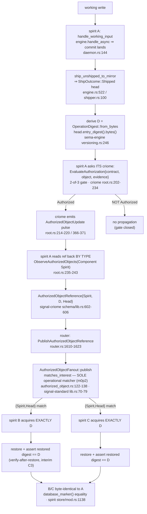

# 700 — Operator Implementation Brief: the criome-gated typed propagation loop

Designer brief for the operator lane. Every surface is cited `file:line`
against current main of each repo under `/git/github.com/LiGoldragon`.
The 694 PoC harness (`reports/designer/694-cluster-propagation-poc/harness`)
wired this whole loop against the real crates and is the integration
reference throughout.

## The target loop, in one paragraph

Spirit A accepts and commits a working write, producing a content-addressed
head **D**. Before A propagates anything, A asks **its criome** to authorize
D under a 2-of-3 root contract; the criome verdict — and only an `Authorized`
verdict — gates the fan-out. On authorization the criome emits a typed
`signal-criome AuthorizedObjectReference{component: Spirit, digest: D,
kind: Head}`. That typed reference enters the **router**, which is the sole
operational matcher: it fans the reference **by type** to every attendee that
advertised a `{Spirit, Head}` interest — spirit B and spirit C. B and C
acquire **exactly D** and become byte-identical to A. **What is missing
today** (operator 431's green loop): there is no criome gate (the head ships
with no authorize step), the reference on the wire is a placeholder
chat-shaped `MirrorObjectNotice` NOTA string instead of the typed
`AuthorizedObjectReference`, and acquisition restores the mirror's *latest*
head rather than *exactly D* (the mirror has no fetch-by-digest; restore is
keyed on store name only). This brief turns operator 431's PartialGreen loop
into a LoopProvenGreen one for the single-host fully-causal case.

## Target loop

## Binding requirements (designer constraints, verbatim)

These are the settled leans. Encode them as hard acceptance gates.

- **C1. CRIOME-GATED:** spirit asks criome to authorize head D (2-of-3)
  AFTER commit and BEFORE propagating; only the authorized head propagates
  (d6he/nfvm/2st7). The criome verdict gates the fan-out.
- **C2. TYPED REFERENCE:** the router carries the real signal-criome
  `AuthorizedObjectReference{Spirit, D, Head}` and fans it BY TYPE
  (m0p2/57f9) — REPLACE the placeholder chat-shaped `MirrorObjectNotice`.
- **C3. ACQUIRE-BY-D:** verify-after-restore is the INTERIM (restore, assert
  restored digest == D, reject mismatch — satisfies the falsifiable test);
  fetch-by-digest (mirror restores exactly D) is the TARGET, adopt it IF the
  mirror research says it is supported, else file it as the next mirror
  capability.
- **C4. m0p2 RETIRE:** criome's operational interest-matcher retires to
  observation/audit-only; the router is the sole operational matcher.
- **C5. INTEGRATION HOME:** UPGRADE spirit's existing
  `tests/end_to_end_offline_full_chain.rs` in place (add the criome gate +
  typed reference + acquire-by-D) — do NOT build a separate harness.
- **C6. PRIORITY (revised per Spirit `jk1w` — "we want multiple machine
  criome cluster running soon"):** the single-host fully-causal loop is
  **step 1, the prerequisite** (LoopProvenGreen in-repo) — the loop logic
  must work in one process before it works across machines. Multi-machine
  criome is now a **near-term goal, not deferred**: the cross-machine
  enablers (cross-criome peer transport, cluster-root ceremony, BLS
  aggregation, fetch-by-digest, cross-socket router push) are the immediate
  next arc, sequenced with per-lane beads in **report 701**. This brief
  delivers step 1; 701 sequences the rest. Items below marked "deferred" are
  deferred *relative to the single-host C7 acceptance*, **not** indefinitely
  — most are near-term 701 work.
- **C7. FALSIFIABLE TEST (the proof):** deliver D1, make D2 the latest,
  acquire MUST restore D1 or fail — this is what flips designer's
  PartialGreen to LoopProvenGreen.

### C3 resolution — VERDICT: verify-after-restore is adopted NOW

The mirror research is unambiguous: **fetch-by-digest is NOT supported on
current main**. The restore exchange is keyed solely on a store *name* —
`RestoreQuery StoreName` (signal-mirror `schema/lib.schema:100`), and
`Store::load_restore` (mirror `src/store.rs:510-540`) always returns the
*latest* checkpoint plus every entry past its covered_end for that store
(`latest_checkpoint_row`, `store.rs:320-329`). There is no digest-keyed read
anywhere in the Input vocabulary (`lib.schema:18-22`) or the generated
`ReadInput` enum (`mirror/src/schema/sema.rs:135-139`).

Per C3, this brief therefore **adopts verify-after-restore as the interim**:
restore-latest via the bundle→import path, then assert the restored tip's
digest equals the router-delivered D and **reject on mismatch**. That
rejection is exactly what makes C7 falsifiable. **Fetch-by-digest is filed
as the next mirror capability** (Slice 7, deferred) — a signal-mirror
contract change, out of spirit, tracked below.

One caveat the operator must honor in the verify step: today's harness asserts
byte-identity against A's *frozen* marker, which hides a live-loop race — if A
keeps committing after authorizing D, the mirror's latest may be a head NEWER
than D by fetch time. The interim verify must compare the restored tip against
**D specifically** (recompute the restored tip digest from the last suffix
`EntryEnvelope.digest`, signal-mirror `lib.schema:44-49`, or from the
delivered reference), not merely against A's current marker. This is precisely
what C7 exercises.

## Ordered implementation plan

Each slice: the exact insertion point (`file:line`), the change, the test.

### Slice 1 — Add a criome client to spirit and capture the shipped head

**Why first:** D only becomes available after the ship confirms, and spirit
holds no criome dependency today. Both gaps must close before any gate exists.

- **Capture the head.** `handle_working_input` (spirit `src/daemon.rs:139-157`)
  today *discards* the `ShipOutcome` — line 153 `if let Err(error)` throws away
  the `Ok(Some(...))`. Change the drain at `daemon.rs:152-155` to **capture**
  `engine.ship_unshipped_to_mirror().await` (`engine.rs:522-526`, returns
  `Result<Option<mirror::ShipOutcome>>`). On `Ok(Some(ShipOutcome::Shipped{
  head }))` (mirror `src/shipper.rs:175-227`, `head` produced at 224-226),
  proceed to derive D; otherwise the no-op/unshipped paths skip the gate.
- **Derive D — exact recipe.**
  `D = OperationDigest::from_bytes(head.entry_digest().bytes())`. `MirrorHead`
  at sema-engine `src/outbox.rs:56-76`; `EntryDigest::bytes() -> &[u8;32]` at
  sema-engine `src/versioning.rs:246-254`. The exact derivation to port is the
  694 harness `spirit_propagation.rs:168-174`.
- **Add the criome dependency + client.** Spirit's `Cargo.toml` has no
  criome/signal-criome entry — add both. Hold a `criome::CriomeClient`
  (`criome/src/transport.rs:107-138`) built via
  `CriomeClient::from_environment()` (reads `CRIOME_SOCKET`, default
  `/tmp/criome.sock`, `transport.rs:120-125`).
- **BLOCKING-CALL HAZARD:** `CriomeClient::send` (`transport.rs:127-137`) is a
  synchronous `UnixStream::connect`. The daemon hook is async
  (`daemon.rs:152`). Wrap the `send` in `tokio::task::spawn_blocking` (do NOT
  call the blocking client directly on the async runtime). An async criome
  transport does not exist in-repo; spawn_blocking is the interim — note an
  async `CriomeClient` as a follow-on if the hot path warrants it.

**Test:** unit-level — assert that after a working write under
`mirror-shipper`, the hook holds a `MirrorHead` and derives a 32-byte D equal
to `head.entry_digest().bytes()`. No criome socket yet; this slice proves D is
in hand at the insertion point.

### Slice 2 — Insert the criome authorize gate (C1)

**Insertion point:** spirit `src/daemon.rs`, immediately after D is derived in
the captured-`ShipOutcome` branch (between commit at line 144 and the rest of
the drain). This is the gate per 2st7/d6he.

- **Call surface (single entry point).** Everything funnels through
  `CriomeRoot` via `root.ask(SubmitRequest::new(CriomeRequest::...))` — but a
  live spirit reaches criome over the socket via `CriomeClient::send`, not the
  in-process `ActorRef` the harness used (see Gaps). The request to send is
  `CriomeRequest::EvaluateAuthorization(AuthorizationEvaluation{ contract,
  object, evidence })`.
- **PRODUCTION-VS-HARNESS DRIFT (must fix when porting 694).** Production
  `AuthorizationEvaluation` has **THREE** fields — `contract: ContractDigest`,
  `object: AuthorizedObjectReference`, `evidence: Evidence` (signal-criome
  `src/schema/lib.rs:535-539`). The 694 harness `authorize_head`
  (`criome_quorum.rs:328-331`) builds only **two** (`contract`, `evidence`) —
  it predates the `object` field. The operator MUST populate
  `object: AuthorizedObjectReference{ component: ComponentKind::Spirit,
  digest: D (ObjectDigest), kind: AuthorizedObjectKind::Head }`
  (signal-criome `schema/lib.rs:602-606`, `:573-579`, `:330-338`).
- **The gate's hard check.** The handler at criome `root.rs:202-234` rejects
  `MalformedRequest` unless
  `evaluation.object.digest == evaluation.evidence.operation.object_digest()`
  (`root.rs:205-209`). Both must equal D's true content address. It then loads
  the live registry+store and runs `store.evaluate(&contract, &evidence,
  &registry)` (`language.rs:136-147` → `Threshold::decide`
  `language.rs:370-395`).
- **Gate semantics.** On `EvaluationDecision::Authorized`, criome publishes the
  pulse (`root.rs:214-220` → `publish_authorized_object_update`
  `root.rs:366-371`) and replies `AuthorizationEvaluated{ contract, decision }`.
  On any non-`Authorized` decision, **spirit does NOT propagate** — the gate is
  closed; the head stays local. This is C1.
- **Evidence/contract prerequisites (single-host, C6).** For the in-repo
  single-host loop, the spirit-side test fixture builds the 2-of-3 contract and
  evidence the same way the 694 harness does (`criome_quorum.rs:281-348`):
  `Contract::new(Rule::Threshold(Threshold::new(req=2, [KeyMember a,b,c])))`
  (signal-criome `lib.rs:185-194`), an `AttestedMoment` time-quorum
  (`lib.rs:201-228`), and `Evidence::new(ComponentKind::Spirit,
  operation_digest, stamp, vec![env_a, env_b], vec![])` (`lib.rs:235-250`).
  All three keys co-resident in one criome (p3td self-quorum). Cross-machine
  signature solicitation (`RouteSignatureRequest`) is DEFERRED (C6).

**Test:** in the upgraded e2e (C5/Slice 6), assert that a head with valid
2-of-3 evidence yields `Authorized` and propagation proceeds; a head with
1-of-3 (short quorum) yields `QuorumShort`/non-`Authorized` and **nothing is
fanned**. The negative case is load-bearing — it proves the gate gates.

### Slice 3 — Read the typed reference back BY TYPE (C2 producer half)

The typed `AuthorizedObjectReference` does **NOT** ride the
`EvaluateAuthorization` reply (which is only `AuthorizationEvaluated{contract,
decision}`, type-free). It rides the emitted `AuthorizedObjectUpdate` pulse.

- **Read-back call.** After `Authorized`, send
  `CriomeRequest::ObserveAuthorizedObjects(AuthorizedObjectObservation{
  subscriber, interest: AuthorizedObjectInterest::Component(
  ComponentKind::Spirit) })` (criome `root.rs:235-243`; signal-criome
  `schema/lib.rs:650-653`). Reply is
  `CriomeReply::AuthorizedObjectUpdateSnapshot(snapshot)`;
  `snapshot.into_updates()` (signal-criome `lib.rs:487`) yields
  `Vec<AuthorizedObjectUpdate>`, each `.object` being the typed
  `AuthorizedObjectReference{Spirit, D, Head}`. For precise head matching use
  `AuthorizedObjectInterest::ComponentObject(ComponentObjectInterest{ Spirit,
  Head })` (signal-criome `schema/lib.rs:584-597`). Template:
  694 harness `criome_quorum.rs:341-369`.

**Test:** assert the read-back snapshot contains exactly one update whose
`.object.digest == D` and `.object.kind == Head` after one authorize.

### Slice 4 — Replace MirrorObjectNotice with the typed reference into the router (C2 router half)

**The thing to delete:** the harness-local chat-shaped placeholder.
`struct MirrorObjectNotice{store, sequence, digest}` and its NOTA
encode/decode live at spirit
`tests/end_to_end_offline_full_chain.rs:91-140`; it is built from the
confirmed head at line 526, encoded to a free-form NOTA string at lines
110-117, carried as a `MessageBody::new(notice.to_nota())` chat body at line
618, witnessed at 637-640, and parsed back at 645. The file's own comment
(lines 22-26) names it the seed of a future typed notify. **Remove all of it**
and route the typed reference instead.

- **Router publish entry.** Send
  `PublishAuthorizedObjectReference{ reference: AuthorizedObjectReference }`
  to the `ActorRef<RouterRuntime>` via `.ask(...)` (router
  `src/router.rs:1610-1623`). Reply is
  `RouterResult<AuthorizedObjectPublication{ deliveries:
  Vec<AuthorizedObjectDelivery> }>`. Each delivery (router
  `authorized_object.rs:54-58`) names a matched attendee.
- **Attendee registration (B/C subscribe).** Before publish, B and C register
  `AttendAuthorizedObjects{ subscriber: ActorIdentifier, interest }` (router
  `router.rs:1580-1593`) with `interest =
  AuthorizedObjectInterest::ComponentObject(ComponentObjectInterest::new(
  ComponentKind::Spirit, AuthorizedObjectKind::Head))` (signal-standard
  `schema/lib.rs:84-89`, `:76-79`; `ComponentObjectInterest::new`
  `lib.rs:55-58`). Reply replays already-published matching references
  (`authorized_object.rs:81-99`).
- **Cross-vocabulary conversion.** The criome reference
  (`signal_criome::AuthorizedObjectReference`) and the router/standard one
  (`signal_standard::AuthorizedObjectReference`,
  `signal-standard/src/schema/lib.rs:130-134`) are distinct types. The
  conversion exists ONLY in the 694 harness glue
  (`glue.rs:18-94`). Write a **production** conversion (an owning carrier with
  `From` impls — obey the method-only rule; this is `impl From<X> for Y`, not a
  free fn). **DO NOT copy the harness's lossy `cross_kind`:** harness
  `glue.rs:64-72` drops `Head` assuming criome lacks it, but production
  signal-criome HAS `AuthorizedObjectKind::Head` (`schema/lib.rs:578`). Carry
  `Head` through both ways.
- **Matcher (m0p2, the sole operational match).**
  `AuthorizedObjectFanout::publish` filters by
  `publication.reference.matches_interest(&token.interest)` (router
  `authorized_object.rs:122-138`, esp. `:129`); the matcher is
  `AuthorizedObjectReference::matches_interest` (signal-standard
  `lib.rs:70-79`) — a type lattice, **digest-blind**. Acquiring exactly D is
  the spirit/mirror leg (Slice 5), not the router.

**Test:** publish the typed reference; assert
`publication.deliveries` contains both `spirit-b` and `spirit-c`
`ActorIdentifier`s and each carries `reference.digest == D`. Add a
load-bearing negative: a reference of a non-matching type (e.g.
`{Persona, Head}` or `{Spirit, <other-kind>}`) yields zero deliveries to the
`{Spirit, Head}` attendees. Template: 694 harness
`tests/router_fanout.rs:40-186`.

### Slice 5 — Acquire EXACTLY D via verify-after-restore (C3 interim)

**Insertion point:** the restore-and-import block at spirit
`tests/end_to_end_offline_full_chain.rs:691-724`, driven by the
router-delivered reference (no longer the parsed `MirrorObjectNotice`).

- **Restore (latest, the only option today).** Keep
  `MirrorTailnetClient.exchange(MirrorInput::Restore(RestoreQuery::new(
  StoreName)))` (test `694-698`; `RestoreQuery StoreName` is store-name only,
  signal-mirror `schema/lib.schema:100`). It returns the mirror's latest
  bundle.
- **Import.** Bundle→import via `Store::import(path, checkpoint, suffix)`
  (spirit `src/store/mod.rs:382-409`). The bundle→import bridge
  (`PortableCheckpoint::from_bytes(...).decode()` + rkyv-decode each suffix
  `EntryEnvelope.payload` into `VersionedCommitLogEntry`) lives only in
  test/harness code today (spirit `tests/mirror_shipper.rs:128-142`; 694
  `spirit_propagation.rs:104-119`). **Promote it into a production method** on
  spirit's `Store`/`Engine` — `Store::import_from_bundle` /
  `Engine::acquire_into` — obeying the method-only rule. This promotion is also
  where the verify lands.
- **VERIFY (the new gate that makes C7 falsifiable).** After import, recompute
  the restored tip digest (from the last suffix `EntryEnvelope.digest`,
  signal-mirror `lib.schema:44-49`) and **assert it equals D** — the
  router-delivered `reference.digest`. **Reject on mismatch** (return an error
  / fail the acquire). Do NOT merely compare against A's current
  `database_marker()` (spirit `store/mod.rs:1138-1145`) — that hides the
  live-loop race. The byte-identity assertion (`database_marker()` equality,
  test `715-724`; 694 `tests/end_to_end.rs:140-155`) stays as the final
  identity proof AFTER the D-match gate passes.

**Test:** the C7 acceptance test (Slice 6).

### Slice 6 — Upgrade the e2e in place (C5) and assert C7

**Home:** `spirit/tests/end_to_end_offline_full_chain.rs` — upgrade in place,
NO separate harness. The upgraded chain:
commit (D1) → ship+capture head → criome `EvaluateAuthorization` (2-of-3) →
read typed reference by type → router `PublishAuthorizedObjectReference` →
B/C matched by `{Spirit, Head}` → acquire-by-D with verify.

**The C7 acceptance criterion (the proof, verbatim):** deliver **D1**, make
**D2** the latest, acquire MUST restore **D1** or fail.

Concretely in the test:
1. A commits D1; gate authorizes D1; the typed reference for **D1** fans to
   B/C.
2. A commits D2 (D2 becomes the mirror's latest).
3. B/C acquire **driven by the D1 reference**. Restore-latest returns D2's
   bundle; the verify step (Slice 5) recomputes the restored tip digest, sees
   `D2 != D1`, and **MUST fail/reject**.
4. With the (target) fetch-by-digest path, the same step would instead restore
   exactly D1 and pass.

Either way, the test cannot pass by silently restoring D2. **This is what
flips designer's PartialGreen to LoopProvenGreen.** Land it with the loop
state recorded as `LoopProvenGreen` once green under Nix.

### Slice 7 — m0p2 retire (C4): criome's operational matcher → observation/audit-only

**Surgical, not a deletion.** The criome trait
`AuthorizedObjectFilter::matches_update` (criome
`src/actors/subscription.rs:67-69`, impl `:217-229`) is called at three sites;
only ONE is operational delivery and retires.

- **RETIRE (operational delivery match):**
  `SubscriptionRegistry::publish_authorized_object_update`
  (`subscription.rs:142-153`) — remove the
  `.filter(|token| token.interest.matches_update(&update))` chain at
  `:147-150` and the `subscriber_count` semantics of
  `AuthorizedObjectPublication` (`:62-65`, `:211-215`). This match is provably
  dead residue: there is NO `Publish` variant in `CriomeRequest`
  (signal-criome `schema/lib.rs:1209-1211`), the only caller is the internal
  post-evaluation pulse (criome `root.rs:214-220`, `366-371`) whose reply is
  discarded (`let _ =` at `root.rs:367`), and no test reads `subscriber_count`.
- **KEEP the append.** Keep `self.authorized_object_updates.push(update)`
  (`:151`) — the observation snapshot reads from this Vec, and the 694 observe
  path expects `len()==1` after one authorize (`criome_quorum.rs:346`). Keeping
  it preserves audit history.
- **KEEP (observation/audit-only, NOT retired):**
  - `open_authorized_object_subscription` snapshot filter
    (`subscription.rs:106-121`, `matches_update` at `:117`) — the
    `ObserveAuthorizedObjects` read path (criome `root.rs:235-243`) that
    Slice 3 depends on.
  - `run_due_contract_checks` absence audit (`subscription.rs:160-190`,
    `matches_update` at `:173`) — contract-time-check audit.

The router's `AuthorizedObjectFanout::publish` (router
`authorized_object.rs:122-138`) is and remains the sole operational matcher
(m0p2).

**Test:** assert `ObserveAuthorizedObjects` still returns the snapshot after
the publish-side match is gone (the KEEP path is intact), and that the removed
`subscriber_count` reply type / operational match no longer compiles into the
delivery path. Confirm the criome crate still builds and its existing tests
pass.

## Tracked follow-ons (DEFERRED — file, do not block C7)

These are tracked, not in the single-host LoopProvenGreen scope (C6).

1. **Fetch-by-digest mirror capability (C3 target).** The real acquire-exactly-D.
   Requires a signal-mirror **contract change**: extend
   `RestoreQuery StoreName` to carry a target head, e.g.
   `RestoreQuery { store.StoreName (Target (Optional HeadMark)) }` (`HeadMark`
   already exists, signal-mirror `lib.schema:42`); add a `HeadNotHeld`
   rejection reason to `RestoreRejectionReason [UnknownStore NoCheckpoint]`
   (`lib.schema:108`); in `Store::load_restore` (mirror `store.rs:510-540`),
   when a target is present, locate the entry row whose stored digest == target
   and bound the suffix to that sequence (entry rows already carry `digest`, so
   a key-range scan + digest compare) instead of `u64::MAX` (`store.rs:530`),
   rejecting if the mirror does not hold the exact digest. Out of spirit;
   required to close the live-loop race structurally.

2. **Router closure-convergence (operator 431 edge).** The schema-chain skew is
   already gone (criome/router/spirit all on `schema-rust-next bb4dfe29` /
   `nota-next 7105c2be`; spirit's lock == router's lock on the closure crates).
   The remaining "not-freely-updatable" edge is exactly four crates whose main
   HEADs are AHEAD of the pinned lock: `signal-router`
   (`e36e773d → 3e4bb074`), `signal-message` (`56c6b873 → 97d9b14e`),
   `signal-persona` (`8c427aad → b4c66501`), `schema-rust-next`
   (`bb4dfe29 → e116cc46`). A free `cargo update` of any re-breaks router types
   (the 431-observed failure). Operator should verify by building whether the
   breakage still holds against current revs, then converge the lock as a
   distinct task.

3. **Cross-socket router push.** The router's matched delivery set is returned
   **in-process** to the `.ask` caller only (router `router.rs:1610-1623`,
   `authorized_object.rs`); NOTHING forwards it to a remote attendee
   (no signal-router wire type, no peer_delivery/remote_router integration).
   For the single-host loop both B/C are in-process attendees, so this is not
   blocking; a true multi-machine cluster needs a net-new transport leg that
   turns an `AuthorizedObjectDelivery` into an actual push. DEFERRED with C6's
   multi-machine woes.

4. **Async criome transport.** `CriomeClient::send` is blocking (criome
   `transport.rs:127`); Slice 1 uses `spawn_blocking`. An async criome client
   is a follow-on if the gate becomes a hot-path latency concern.

5. **Multi-machine quorum (DEFERRED, C6).** BLS aggregation, cluster-root
   admission ceremony, and cross-criome peer signature solicitation
   (`RouteSignatureRequest`/`SubmitSignature`, criome `root.rs:188-195`) — all
   out of single-host scope. Single-host uses p3td self-quorum (all three keys
   co-resident in one criome).

## Open facts the operator must resolve before/while landing

- **Socket framing unverified for spirit.** The 694 harness reached criome via
  the in-process `ActorRef<CriomeRoot>` + `SubmitRequest`
  (`criome_quorum.rs:310-316`), NOT via the cross-process `CriomeClient` socket
  (criome `transport.rs`). The on-socket request/reply framing path for
  spirit's use is unexercised — verify it end-to-end in Slice 2.
- **Who collects the 2-of-3 signatures in a live spirit?** The harness
  pre-builds `Evidence` with pre-collected signatures. Whether spirit gathers
  the quorum or criome routes a `SignatureSolicitation`
  (`Input::RouteSignatureRequest`, signal-criome `schema/lib.rs:1204`) is not
  settled in the production path. For single-host (C6) the test fixture
  pre-builds evidence; the live-collection question is a multi-machine
  follow-on.
- **AttestedMoment window enforcement.** `rejection_reason`
  (criome `language.rs:572-606`) requires `opens_at < closes_at` and a 2-of-3
  distinct-signer majority, but for a bare `Threshold` rule there is no check
  that evaluation occurs WITHIN `[opens_at, closes_at]` against a live clock
  (window-bounded enforcement only appears in
  ActiveAfter/ActiveUntil/TimeSwitch rules, `language.rs:296-316`). Confirm
  ay3y intends a-priori attestation, not live-clock gating, before relying on
  it.
- **Exact m0p2/d6he/nfvm/2st7/gc0n/ay3y record wording.** The research could
  not query the live Spirit daemon for the verbatim intent-record text (the
  `spirit` CLI rejected the observe query forms tried). The m0p2 reading used
  here ("router sole operational matcher; criome observation/audit only") is
  taken from the 694 design doc and operator 431, both of which cite m0p2
  directly, and is strongly corroborated by the harness depending on
  `ObserveAuthorizedObjects`. Confirm the exact record wording before landing
  the retire to be certain "audit-only" includes keeping the snapshot read
  path.
- **Marker reproduction under truncated suffix.** Not re-confirmed that
  sema-engine's `begin_import`/`ingest_suffix` reproduces a byte-identical
  marker for a suffix truncated at D rather than the full latest — relevant
  only once fetch-by-digest (follow-on 1) truncates the suffix.
- **431 breakage claim not re-verified by build.** The lock-vs-HEAD divergence
  (follow-on 2) is factual; the "re-breaks router types" claim is inherited
  from 431 and was not re-built against current revs.
