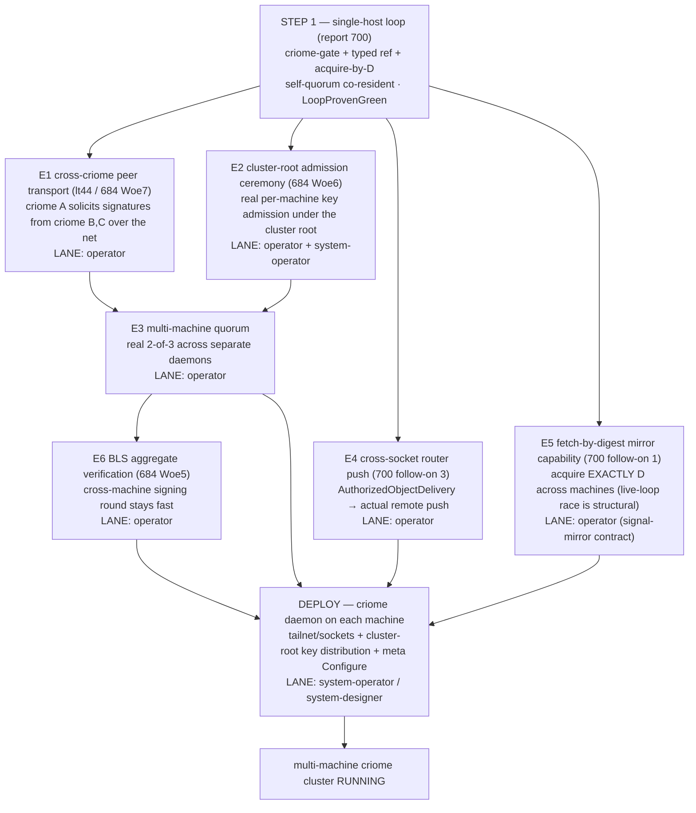

# 701 — multi-machine criome cluster: the roadmap (near-term, per `jk1w`)

Spirit `jk1w` (Decision): *"we want multiple machine criome cluster
running soon"* — multi-machine criome is elevated from eventual to
near-term, **not deferred** behind the single-host loop. This roadmap is
the path from the single-host fully-causal loop (report 700, **step 1**)
to a **real cluster of criome daemons on separate machines**, with the
enablers sequenced and split per lane. It is a three-lane effort —
operator (criome crypto + cross-criome transport), system-operator /
system-designer (deploy across machines), designer (the contract specs).

## The gap: single-host proves the logic; multi-machine signs across the wire

Report 700's loop proves the propagation **logic** in one process: spirit
A → criome authorizes (2-of-3) → router fans by type → spirit B/C acquire
exactly D. But it does it with the **self-quorum co-resident** — all three
criome keys live in one criome (`p3td`: a principal runs >1 node; the
2-of-3 is signed in-process). A real cluster needs the *same loop* with
the quorum **signing across three separate machines**, the references
**delivered across the network**, and the daemons **deployed and keyed**
on each machine. That's five enablers + a deploy.

## The enablers (each: what, why, the surface, the lane)

### E1 — Cross-criome peer transport (`lt44`, 684 Woe 7) — **operator** — the big one

Today criome has no cross-criome network lane: the 2-of-3 is assembled
**in-process** (the 694 harness pre-built `Evidence` with all three
signatures; 700 Slice 2 has the spirit-side fixture do the same). For a
cluster, criome A must **solicit signatures from criome B and C over the
network**. The request/reply *shapes* exist — `Input::RouteSignatureRequest`
/ `SubmitSignature` (signal-criome, criome `root.rs:188-195`) — but there
is **no cross-criome transport** that carries them between daemons. This is
`lt44`'s direct criome-to-criome peer lane: agreement/auth messages only,
over the tailnet. **It is the load-bearing multi-machine gap** — without
it there is no quorum-across-machines.

### E2 — Cluster-root admission ceremony (684 Woe 6) — **operator + system-operator**

Today admissions are harness-minted (700 Slice 2; 694
`criome_quorum.rs`): the test signs each machine's `RegistrationStatement`
with a held cluster-root key. A real cluster needs a **ceremony** that
admits each machine's criome key into the registry under the cluster root
(`ermr`: `RegisterIdentity` requires a valid root signature). Operator
builds the ceremony surface; system-operator runs it per machine and
distributes the cluster-root trust. The three machines' keys end up
mutually admitted.

### E3 — Multi-machine quorum — **operator** — built on E1 + E2

The real 2-of-3 across **separate** criome daemons (not the in-process
self-quorum). Once E1 (signing across the wire) and E2 (mutual admission)
land, the `EvaluateAuthorization` path runs with evidence gathered from
peers. `m0p2` holds throughout: criome stays authorize/agreement-only, the
router stays the sole operational matcher (confirmed — `m0p2`: *"criome
keeps no operational delivery registry; any criome-local subscription
surface is observation and audit only"*; this is exactly 700 Slice 7's
retire).

### E4 — Cross-socket router push (700 follow-on 3) — **operator**

Router's matched delivery set is returned **in-process** to the `.ask`
caller only (`router.rs:1610-1623`); nothing forwards an
`AuthorizedObjectDelivery` to a **remote** attendee. The single-host loop
has B/C in-process, so this is invisible there — but a cluster needs the
authorized reference to actually **cross to the remote spirit**. A net-new
transport leg that turns a delivery into a real push (router-to-router /
tailnet), reusing the milestone-2 router forwarding where possible.

### E5 — Fetch-by-digest mirror capability (700 follow-on 1) — **operator**

700 adopts verify-after-restore as the single-host interim because mirror
restore is store-name-only. Across machines the live-loop race is
**structural** (A keeps committing; the mirror's latest drifts past D), so
the cluster needs **acquire-exactly-D** for real. The signal-mirror
contract change is specified in 700 follow-on 1: extend `RestoreQuery` to
carry a target head (`HeadMark` exists), add a `HeadNotHeld` rejection,
and make `Store::load_restore` locate the entry whose digest == target.

### E6 — BLS aggregate verification (684 Woe 5) — **operator**

The cross-machine signing round adds the network term; if verification is
still a per-signature pairing loop, the latency win of the direct lane
collapses (the Amdahl argument, report 684/4). `FastAggregateVerify` +
proof-of-possession on cluster-root admission makes the multi-machine
quorum fast. Lower-priority than E1–E3 (correctness first), but near-term.

### Deploy — **system-operator / system-designer**

A running cluster needs criome daemons **on each machine**: the binary
deployed, the tailnet sockets bound (`signal-standard` `StandardSocket`,
`eaf7`), the cluster-root key material distributed, and each daemon's
`meta-signal-criome Configure` issued. The psyche named
`prometheus.goldragon.criome` earlier; a 2-of-3 needs **three** machines.
This is system-operator's lane — designer/operator hand them the criome
binary + the socket/config contract; they stand up the topology.

## Per-lane beads

**Operator:**
1. Cross-criome peer transport (E1, lt44) — carry `RouteSignatureRequest`/
   `SubmitSignature` between criome daemons over the tailnet.
2. Cluster-root admission ceremony surface (E2, Woe 6).
3. Multi-machine quorum: `EvaluateAuthorization` gathering peer signatures (E3).
4. Cross-socket router push of `AuthorizedObjectDelivery` (E4).
5. Fetch-by-digest mirror capability — signal-mirror contract change (E5).
6. BLS aggregate verify + PoP-on-admission (E6, Woe 5).
7. (from 700) the single-host loop, Slices 1–7 — **step 1, do first.**

**System-operator / system-designer:**
8. Stand up criome daemons on the three target machines — binary deploy,
   tailnet sockets, cluster-root key distribution, per-machine `Configure`.
9. Run the cluster-root admission ceremony per machine (with operator's E2).

**Designer:**
10. The signal-mirror `RestoreQuery` + `HeadNotHeld` spec (E5) and the
    cross-criome transport message contract review (E1) as operator surfaces them.

## Sequence

`700 single-host loop (step 1)` → **E1 + E2** (quorum signs across machines)
→ **E4 + E5** (reference delivered + head acquired across machines) → **E6**
(latency) → **Deploy** on the three machines → **cluster running**. E3
emerges from E1+E2; E6 can trail E3 (correctness before speed).

## The one input I need from the psyche

**Which three machines are the first cluster?** A 2-of-3 needs three
criome daemons. `prometheus.goldragon.criome` is one (you named it) —
which two others? Confirming the targets makes the Deploy bead concrete
and tells system-operator exactly what to stand up. (See also `9s52`:
criome is per-Unix-user; the system-tier criome is per-host service —
confirm whether the first cluster is three *hosts* or includes a
home-criome + system-criome split.)
