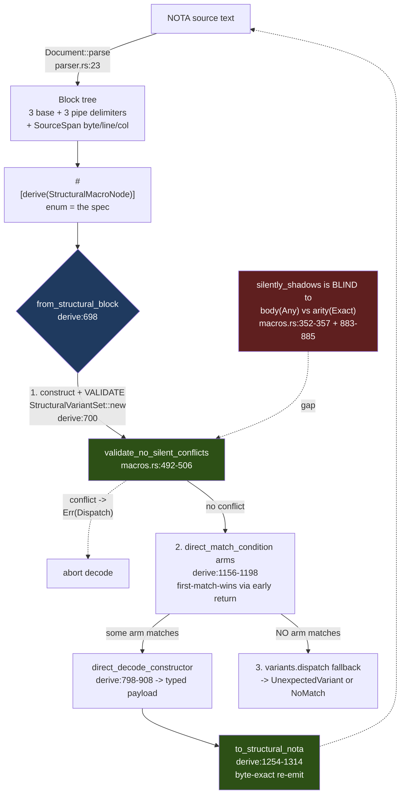

# 702 / 1 — nota-next codec foundation (deep engine analysis)

**HEAD audited:** `nota-next` `7105c2b` (unchanged on `main` since 690).
**Build evidence:** `cargo test --offline` ran live on `cargo 1.96` —
**75 tests pass** across all seven suites (0 lib + 10 block_queries + 14
codec + 9 derive + 6 design_examples + 24 macro_nodes + 6 operator_271 +
0 doc). The codec is a stable, green floor. This report does not re-audit
that greenness (690 did). It asks the harder question: *what does the
shape-directed codec actually guarantee, where is each guarantee
enforced, and where can the guarantee fail without anyone noticing.*

## The deepest finding, stated first

**The "decode by shape, declaration order, first-match-wins" promise
runs through TWO independent match engines that are only partially
reconciled, and the reconciliation gate (`validate_no_silent_conflicts`)
is blind to the exact shadow that the newest shapes introduce.**

There is a validated engine (`StructuralVariantSet` / `Pattern`,
`macros.rs`) and a fast engine (the derive's `direct_match_condition`
raw block predicates, `derive/src/lib.rs:1156-1198`). The derive's
production decode path (`from_structural_block`,
`derive/src/lib.rs:698-713`) constructs the validated set first —
`StructuralVariantSet::new(...).map_err(Dispatch)?` at `:700` — so a
construction-time conflict aborts decode before any direct arm runs. That
is the safety story, and it holds for the two shadow patterns the
validator knows. **But `silently_shadows` (`macros.rs:352-357`) only
detects (a) byte-identical match shapes and (b) a Pascal-headed
parenthesis preceding a same-arity literal-headed one. It returns `false`
for any variant whose object-count is `Any` — i.e. every `body` shape —
because `parenthesized_head_shape` bails the moment the count is not
`Exact` (`macros.rs:883-885`).** So a `pascal_head, body` or
`head = "H", body` variant declared *before* a fixed-arity sibling passes
validation, yet its direct arm (`block.is_parenthesis() && head-is-pascal`
with **no arity guard**, `:1192-1196` / `:1177-1182`) matches the
fixed-arity input first and **silently makes the specific variant
unreachable.** The round-trip still holds for the broad variant, so no
test catches it; the specific variant just never fires. The whole keystone
safety property — "a later specific variant cannot be made unreachable" —
is enforced for arity-vs-arity and pascal-vs-literal but **not for
body-vs-arity**, which is precisely the pairing the `db0f10a`/`3e18e37`
shapes added. The tests pass only because every fixture orders the
specific variant first (`DerivedApplication`, `tests/macro_nodes.rs:755-761`,
puts `Pair` arity-2 before `Apply` body); reverse them and validation
would wave through a broken node.

## What the engine is, and the two-engine topology



`nota-next` is the hand-authored recursion floor (`src/lib.rs:1-7`) plus
the typed structural-macro-node codec. Three planes, cleanly separated:

- **Raw structural floor** (`parser.rs`) — meaning-free. Parses
  delimiter-balanced blocks over the closed 6-delimiter set (3 base + 3
  pipe), preserves `SourceSpan` (byte/line/column, `parser.rs:3-14`), and
  exposes factual `is_*` predicates and structural `qualifies_as_*`
  classifiers. It does not know what a schema type is.
- **Value codec** (`codec.rs`) — Rust value ↔ NOTA value with a strict
  never-emit-quote string discipline.
- **Macro/shape layer** (`macros.rs` + `derive/src/lib.rs`) — the engine
  under audit: the consumer enum *is* the specification.

## Invariants — where each is enforced, and where it can break

| Invariant | Status | Enforced at | Risk if violated |
|---|---|---|---|
| Closed delimiter set (3 base + 3 pipe), nothing else | **Holds** | `parser.rs:309-316` (`from_opening` only `( [ {`), `:670-685` (dispatch); pipe forms recognized by `(\|`/`{\|`/`[\|` lookahead | A stray bracket family would silently parse as atom text — but the set is exhaustive |
| Byte-exact source span: `block.reemit(src)` == original slice | **Holds** | `parser.rs:76-79` slices `[start..end]`; every parse path records `start`/`end` from the cursor | Diagnostics/macro re-passes would point at wrong bytes |
| Bidirectional byte-exact round-trip for shaped nodes | **Holds (tested)** | encode `derive:1254-1314`; asserted text-identical in `tests/macro_nodes.rs:913-935` and `examples/structural_macro_round_trip.rs:109` | Schema sugar becomes one-way lowering, breaking INTENT's "specialized NOTA not lowering language" |
| Shape-directed decode is **unambiguous** (no two reachable variants match one block) | **AtRisk** | `validate_no_silent_conflicts` `macros.rs:492-506` via `silently_shadows` `:352-357` | **Blind to body(Any)-vs-arity; a mis-ordered body variant masks a specific one with zero diagnostic** (see deepest finding) |
| Validation gates the fast path (no decode without the conflict check) | **Holds** | derive emits `StructuralVariantSet::new(...)?` *before* direct arms, `derive:700` and `:720` | If skipped, the two engines could disagree on order; today they cannot diverge silently except via the blind spot above |
| Never emit a quotation mark | **Holds** | `NotaString::format` `codec.rs:465-479` has exactly 3 branches (bare / `[\|…\|]` / `[…]`); `is_bare_string` excludes `"` at `parser.rs:900` | Would break the workspace NOTA-string rule and every embed-in-host-quote use |
| String canonicality (reject redundant delimiters) | **Holds** | `reject_redundant_delimiter` `codec.rs:495-503` → `NonCanonicalStringDelimiter` | Two encodings of one string; non-deterministic artifacts |
| Pipe-text losslessness (`\|]`, `\\` escapes) symmetric parse/encode | **Holds** | parse `parser.rs:757-776`, encode `codec.rs:505-520` | Bracket-bearing text would corrupt on round-trip |
| Structure header packs first two levels into a `u64` | **Holds (bounded)** | `StructureHeader::packed_word` `:340-358`, depth cap `:485`, child cap 15 `:378` w/ overflow slot | Overflow degrades to `Unknown` slot — graceful, not a fault |

### The unambiguity invariant, in detail (the load-bearing one)

`silently_shadows` (`macros.rs:352-357`) is:

```
has_same_match_shape(later)  ||  parenthesized_head_shape().silently_shadows(later.parenthesized_head_shape())
```

`has_same_match_shape` requires equal element count and element-wise same
kind (`:359-366`, `:585-605`). `parenthesized_head_shape` (`:879-891`)
**short-circuits to `None` unless `object_count` is `Exact(arity)`**
(`:883-885`). A `body` shape is built with `MacroObjectCount::Any`
(`derive:1107`, `:1125`), so it has *no* `parenthesized_head_shape`, so
`silently_shadows` can never flag it. Meanwhile the body variant's
runtime `direct_match_condition` checks only `is_parenthesis()` + a
PascalCase (or literal) head — **no count check at all** (`derive:1177-1182`,
`:1192-1196`). Concretely: declare

```rust
enum Broken {
  #[shape(pascal_head, body)] Apply(Name, Vec<Name>),   // Any arity
  #[shape(pascal_head, arity = 2)] Pair(Name, Name),    // unreachable
}
```

`StructuralVariantSet::new` returns `Ok` (validation blind), and
`(Bar X)` decodes as `Apply(Bar, [X])` — `Pair` never fires. Contrast the
arity-vs-arity / pascal-vs-literal cases, which the validator *does*
catch and which the `MisorderedDerivedReference` test exercises
(`tests/macro_nodes.rs:343-358`, `derive` rejects it). The asymmetry is
real and untested.

## Soundness vs surface — is there a production consumer?

This is a **library**, not a daemon — the audit-precision question
becomes "does any production path call `from_structural_block` /
`to_structural_nota`, or is the codec exercised only by `#[cfg(test)]`?"
Within `nota-next` itself the answer is honest: **the only callers of the
typed-node entry points are tests and the `examples/` binary**
(`examples/structural_macro_round_trip.rs:104,110` for round-trip;
`tests/macro_nodes.rs` throughout). The crate ships the *mechanism*; the
production consumer is `schema-rust-next` (the codegen layer that emits
`#[derive(StructuralMacroNode)]` onto generated `TypeReference`-shaped
enums). The byte-exact round-trip assertions
(`tests/macro_nodes.rs:913-935`) are genuine artifact discipline — text
identity *and* value identity, on the live toolchain — not mere
capability. But the byte-exactness is only proven for the **seven shape
forms in the test corpus**; whether the *actual* schema-rust-next output
enums round-trip is a `2-schema-next.md` / `3-schema-rust-next.md`
question, not provable from inside this crate. The unambiguity blind spot
above is the one place where a real schema-rust-next emission could
compile, pass its own round-trip test, and still silently mis-route — so
the cross-crate lane must confirm schema-rust-next never emits a body
variant ahead of a same-head fixed-arity sibling.

## Design tensions

**T1 — two match engines, one truth.** `Pattern::matches`
(`macros.rs:326-350`) and `direct_match_condition` (`derive:1156-1198`)
encode the *same* shape semantics twice, in two languages (data-driven
patterns vs. raw `quote!` predicates). They agree today, but every new
shape must be written into both, and the validator
(`silently_shadows`) only understands the *Pattern* side. The blind spot
is a direct symptom: the derive grew `body`/`Any` shapes on the fast
side faster than the validator learned to reason about them. The clean
shape would be one engine — derive lowers to `Pattern`, decode runs
`dispatch`, and `direct_*` disappears — but that trades a little speed and
a lot of `quote!` for soundness the validator could then fully own.

**T2 — pipe constructs parsed but not shapeable (tracked OPEN).** The
parser emits `PipeParenthesis`/`PipeBrace` recursive blocks
(`parser.rs:672-718`; proven recursive in
`tests/design_examples.rs:100-114`), and `MacroDelimiter` carries both
(`macros.rs:46-47`). But **no `#[shape(...)]` recognizes them** — the
`StructuralVariantShape` enum (`derive:928-936`) has no pipe variant, and
`DelimitedShape` is never wired to a pipe form by the derive. INTENT.md
assigns `(\|…\|)` = generic declaration (Spirit `hh3z`) and `{\|…\|}` =
trait/impl (Spirit `bpyu`), and ARCHITECTURE.md is explicit this is
`OPEN (how)`. So the generic/trait constructs cannot decode through the
derive yet; they can only be hand-matched on the raw block. This is a
*tracked* gap (ARCHITECTURE.md:115-137), not silent drift — but it is the
single largest unimplemented piece of declared intent in this engine, and
the optional-ends matching it needs (`{\| [params]? Trait Target [body]?
\|}` discriminated by leading/trailing `[…]`) has no vocabulary at all.

**T3 — the validated-dispatch fallback is mostly dead code.** In
`from_structural_block` (`derive:698-713`), after the direct arms, control
reaches `variants.dispatch(&candidate)` (`:704`) only when **no direct arm
matched** — and in that case `dispatch` can only return `Ok` if the
*Pattern* engine matches where the *direct* engine did not (a divergence
that would itself be a bug) or `Err`. So the fallback exists to surface
"matched the pattern engine but not the fast engine" as an
`UnexpectedVariant` error — a self-consistency tripwire. It is sound, but
it means the rich `dispatch` diagnostics (tried/expected/found,
`macros.rs:469-490`) are reached only on the no-match path, and the
keystone *first-match* selection is actually performed by the fast engine,
not the validated one. The validated engine's job has narrowed to
"construct-time conflict check + no-match error text."

**T4 — `from_structural_candidate` (multi-block) skips re-validation per
item.** The `Vec` node impl (`macros.rs:1359-1367`) maps
`Item::from_structural_block` over each block, so each item *does* re-run
its own validation — fine. But the `Box`/`Vec` blanket impls
(`macros.rs:1310-1368`) inherit `structural_variants` from `Inner`/`Item`
and never add their own position semantics; recursion soundness rests
entirely on the leaf type. That is correct but undocumented as an
invariant.

## Rust-discipline lens (workspace rules)

The crate is **clean** on the method-only and typed-error rules, which is
notable for a parser-heavy codebase:

- **No free functions outside test/main.** Every `fn` is a method on a
  data-bearing type (`Parser`, `Document`, `Block`, `NotaString`,
  `Pattern`, `DelimitedShape`, etc.) or a trait impl. `operator_271`'s
  test `derive_crate_carries_no_zst_method_holders` actively guards this
  (`tests/operator_271_closed_claims.rs`, green).
- **Typed per-crate errors, not strings.** `NotaError` (`parser.rs:596`),
  `NotaDecodeError` (`codec.rs:7-40`), `MacroError` /
  `StructuralVariantError` / `StructuralMacroNodeError` /
  `StructuralMacroError` (`macros.rs:1173-1463`) — all enum-typed with
  `Display` + `std::error::Error`.
- **Typed domain values.** `AtomClassification`, `MacroObjectCount`,
  `AtomCase`, `SigilPosition`, `MacroDelimiter` are enums, not bools/ints.
- **Full English identifiers.** `holds_root_objects`, `demote_to_string`,
  `qualifies_as_pascal_case_symbol` — no abbreviations.
- **Hand-rolled parser — but this IS the sanctioned floor.** `parser.rs`
  is a hand-written recursive-descent scanner. The no-hand-rolled-parser
  rule targets *consumers* who should use this layer; `nota-next` is the
  one place a hand-rolled scanner is the point (`src/lib.rs:2-3` "the
  hand-authored recursion floor"). Not a finding.

One discipline note: `Delimiter::from_opening`/`from_closing`
(`parser.rs:309-325`) and `AtomClassification::classify`
(`parser.rs:580-593`) are associated functions (constructors), which the
rule explicitly permits — they own the type's job.

## Drift reconciliation vs 690

690 raised three drift items. State at HEAD `7105c2b`:

| 690 item | Now |
|---|---|
| `skills/structural-forms.md` claimed named fields + struct body | **FIXED.** `structural-forms.md:30-48` now lists all 7 shapes correctly and states "the HEAD derive rejects named-field variants"; even documents the #411/#416 tracker-vs-code tension (`:46-48`). |
| `ARCHITECTURE.md` derive list had only 5 shapes | **STILL DRIFTED.** `ARCHITECTURE.md:35-36` lists `pascal_atom`, `keyword`, `head/arity`, `head/body`, `pascal_head/arity` — missing `head = "...", atom` (HeadedAtom) and `pascal_head, body` (PascalHeadBody). The in-crate doc still understates its own derive by two shapes. |
| Pipe-shape layer unimplemented | **STILL OPEN** (T2 above), still honestly tracked. |

## Ranked findings

**P1 — soundness — `validate_no_silent_conflicts` is blind to
body-vs-arity shadowing.** A `body`/`Any`-arity structural variant
declared before a fixed-arity sibling with a compatible head passes
construction-time validation (`macros.rs:352-357` → `:883-885` bails on
non-`Exact`) yet its arity-less direct arm (`derive:1177-1182`,
`:1192-1196`) matches the specific shape first at runtime, making the
specific variant **unreachable with no diagnostic**. The keystone "no
later variant made unreachable" guarantee holds only for arity-vs-arity
and pascal-vs-literal. *Fix:* extend `silently_shadows` so an `Any`-count
parenthesized head shadows any *later* fixed-arity parenthesized head with
a compatible head (pascal-covers-pascal, literal-covers-matching-literal);
add a test that declares the body variant first and expects a construction
error. *Evidence:* `macros.rs:352-357`, `:879-891`; `derive/src/lib.rs:1177-1182`,
`:1192-1196`, `:698-713`; absence corroborated by `tests/macro_nodes.rs:798-828`
(only the specific-first ordering is tested).

**P2 — drift — ARCHITECTURE.md derive list omits two of seven shapes.**
`ARCHITECTURE.md:35-36` documents 5 `#[shape(...)]` forms; the derive
ships 7 (`derive/src/lib.rs:928-936`). HeadedAtom (`head="...", atom`) and
PascalHeadBody (`pascal_head, body`) are missing from the crate's own
architecture doc, even though `skills/structural-forms.md:32-38` now lists
all seven. *Fix:* add the two rows. *Evidence:* `ARCHITECTURE.md:35-36`
vs `derive/src/lib.rs:928-936`.

**P3 — tension — pipe-construct shape vocabulary unimplemented (tracked
OPEN).** Parser emits `PipeParenthesis`/`PipeBrace`
(`parser.rs:672-718`), INTENT/ARCHITECTURE assign them generic-decl /
trait-impl meaning (Spirit `hh3z`/`bpyu`), but no `#[shape]` recognizes
them and the optional-ends discrimination has no vocabulary
(`derive:928-936` has no pipe variant). Honestly tracked at
`ARCHITECTURE.md:115-137`; it is the largest unimplemented declared-intent
gap. *Fix:* add `#[shape(pipe_parenthesis)]` / `#[shape(pipe_brace)]` with
optional leading/trailing `[…]` matching once the consuming schema layer
needs to decode the constructs through the derive.

**P3 — tension — duplicated shape semantics across two engines.** Each
shape is encoded twice (`Pattern` data + `direct_match_condition`
`quote!`), and the validator only understands the `Pattern` side. This is
the structural cause of the P1 blind spot and a standing maintenance tax.
*Consider:* collapsing decode onto `dispatch` so the validator owns the
full match relation. *Evidence:* `macros.rs:326-350` vs
`derive/src/lib.rs:1156-1198`.

## Coherence with the codegen stack

`nota-next` is the bottom of `nota-next` → `schema-next` →
`schema-rust-next`. The seven shapes are exactly the
`TypeReference`/variant-signature vocabulary the upper layers need
(mirrored faithfully by `DerivedTypeReference`, `tests/macro_nodes.rs:835-851`,
and `DerivedVariantSignature`, `:620-633`). The `body` shape + `Vec`/`Box`
node impls (`macros.rs:1310-1368`) are the seam schema-next uses for
variable-arity declaration bodies. **The P1 blind spot is the cross-stack
hand-off most worth checking in `3-schema-rust-next.md`:** confirm the
codegen never emits a `body` variant ahead of a same-head fixed-arity
sibling — if it ever does, the generated node will compile, pass its own
round-trip, and silently mis-route, and `nota-next`'s validator will not
warn. That is the single highest-value cross-engine verification this
report hands forward.
