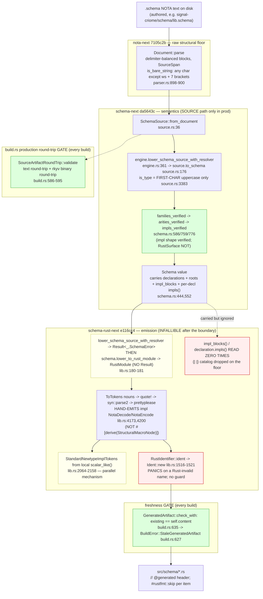

# 702/10 — codegen pipeline end-to-end (cross-cutting)

**Lane:** trace one authored `.schema` NOTA string all the way to typed
Rust across `nota-next` (`7105c2b`) → `schema-next` (`da5643c`) →
`schema-rust-next` (`e116cc4`). This lane does **not** re-audit each
engine (reports `1`/`2`/`3` did); it follows the *flow* across the three
seams and answers the four pipeline questions: (1) does `.schema` →
typed-Rust round-trip soundly end-to-end; (2) is the strict-positional
grammar wave consistent across all three layers and consumers; (3) does
`schema-rust-next` actually **consume** the `{| |}` impl-reference
catalog, or is impl emission a parallel mechanism; (4) where is the
migration debt.

## The pipeline, as production actually runs it

The whole codegen tier runs through **one** entry method — the build
driver's `GeneratedModule::from_emission` (`schema-rust-next`
`src/build.rs:517-552`) — and that method commits to **exactly one**
schema-next lowering path: the **typed-source path**. This is the single
most important fact for the soundness question, because it makes most of
the per-engine "two-engine divergence" findings *production-masked*.

**Production lowering uses the source path, not the macro path.**
`from_emission` calls `source.to_schema_source()` then, for ordinary
modules, `RustEmitter::emit_file_from_schema_source` (`build.rs:540`),
which is `source.lower_to_rust_file(...)` → `lower_to_rust_module` →
`engine.lower_schema_source_with_resolver(self, identity, resolver)`
(`schema-rust-next` `src/lib.rs:179`). For daemon modules it calls the
same `lower_schema_source_with_resolver` directly (`build.rs:532`). In
schema-next, `lower_schema_source_with_resolver` (`engine.rs:361-370`)
delegates to `source.to_schema(...)` (`source.rs:176`) — the source
codec. The macro/document path (`lower_source` / `lower_document`,
`engine.rs:344-396`) is reachable in production from **nowhere**: every
caller in `src/` chains to another macro-path method
(`engine.rs:350,379,387,396,503`), and neither `module.rs` nor any
schema-rust-next call site touches it (grep of
`lower_source|lower_document` over schema-rust-next `src/` returns
empty). So `2-schema-next.md`'s P1 (the macro path mislowers nested
namespaces and rejects relations) is real but **cannot fire in the
codegen pipeline** — the pipeline never invokes the divergent engine.

## (1) Does `.schema` → typed-Rust round-trip SOUNDLY end-to-end?

**Two answers, because there are two different round-trips, and only one
of them is the one that matters.**

**The source-artifact round-trip is sound and production-enforced.**
`SourceArtifactRoundTrip::validate` (`build.rs:586-595`) runs on *every*
build inside `from_emission` (`build.rs:524-528`). It re-serializes the
loaded source to NOTA text, re-parses it, asserts byte-stable equality
(`SchemaSourceRoundTrip` error on mismatch), then round-trips the same
value through the **rkyv binary** archive
(`SchemaSourceArchiveRoundTrip`). This is genuine artifact discipline at
the production boundary, not a `#[cfg(test)]` capability: an authored
`.schema` that does not round-trip text-stably *and* binary-stably fails
the build. This is the single strongest soundness guarantee in the whole
tier.

**The `.schema` → *typed-Rust* path is NOT sound at the final seam:
malformed-but-first-char-valid names panic the generator.** The seam
defect is the composition of three independently-correct-looking checks:

| Layer | What it admits | Evidence |
|---|---|---|
| nota-next | a bare atom is **any** character except whitespace and the 7 quote/bracket chars — `Foo<Bar`, `Foo:Bar`, `Foo@`, `Foo*`, `Foo;` are all valid atoms | `is_bare_string` `parser.rs:898-900` |
| schema-next | a type name is validated by **first char only** (`is_ascii_uppercase()`), with no full-identifier / Rust-keyword / alphanumeric check | `SourceIdentifierCase::is_type` `source.rs:3383-3388`; field gating `source.rs:2156,2179`; method `validate_name` is first-char-only too |
| schema-rust-next | turns the name into a Rust ident via `Ident::new(self.name, …)` with no sanitization — proc-macro2 **panics** on an invalid ident | `RustIdentifier::ident` `lib.rs:1516-1521`; no `validate_name`/`sanitize` guard anywhere in `src/lib.rs` |

The lowering is **infallible after the schema-next boundary**:
`lower_to_rust_module` (`lib.rs:179-181`) returns `Result` from
`lower_schema_source_with_resolver(...)` and then calls
`schema.lower_to_rust_module(emitter)` which returns a plain `RustModule`
— no `Result`. So once a Rust-invalid name clears schema-next's
first-char gate, the only outcomes downstream are *emit* or *panic*; there
is no typed-error channel left. This is the pipeline-level statement of
`3-schema-rust-next.md`'s P1 (Invariant 2): the semantic gap is not inside
any one engine — it is that **the validation each layer does is
first-char/structural, and none of the three checks that a declared name
is a legal Rust identifier**, so the contract "schema names are Rust
names" is enforced by *nobody* and breaks as a `panic!` at the very end.

The same wound recurs on the **family-closure** path:
`RustRecordFamily` construction calls
`self.family_closure(declaration.record.as_str()).expect("family record
closure builds for a verified schema").content_hash().expect("family
closure archives for content hashing")` (`lib.rs:946-950`). Note
`family_closure` in schema-next **does** return
`Result<FamilyClosure, SchemaError>` (`schema-next` `src/identity.rs:171`)
— so this is schema-rust-next *discarding a recoverable typed error with
a double `.expect()`* on the production codegen path, converting it into a
generator crash. The migration debt is not that schema-next can't error;
it is that schema-rust-next throws the error away.

**Net for (1):** the *artifact* round-trip (source text ↔ rkyv) is
sound and enforced in production. The *typed-Rust emission* round-trip is
sound for well-formed names but has a **panic-not-error** seam for any
name that is first-char-valid yet Rust-illegal, plus two more `.expect()`
crashes on the family path — exactly the unlanded 663 slice 1.

## (2) Is the strict-positional grammar wave consistent across the three layers?

**Yes within the production (source) path; the inconsistency is confined
to the dead macro path.** The strict-positional struct-field grammar is
enforced on the source path that production uses:
`RetiredStructFieldSyntax` rejects `*` and bare-lowercase field roles
(`source.rs:2148,2163,2180,2205`), and `RedundantExplicitFieldRole`
rejects `field.Type` where `field == type` (`source.rs:2211`). The
nota-next floor underneath is delimiter-consistent: the closed 3-base +
3-pipe delimiter set (`parser.rs:309-316`) is what both schema-next paths
read, and the schema-rust-next emission re-derives the positional shape
faithfully (the hand-emitted `from_nota_body` dispatches on
`demote_to_string()` for unit variants and `expect_fields(…, 2)` for
data-carrying ones, `lib.rs:4140-4170`).

The drift is the **duplication** flagged by `2-schema-next.md` nota-4:
the same strict-positional grammar is authored twice — once on the source
path (`source.rs:2134-2221`) and once on the now-dead macro path
(`declarative.rs:1768-1886`) — kept aligned only by discipline, with the
code itself admitting the two walks "must stay in lockstep"
(`engine.rs:895`). Because the macro path is unreachable in the pipeline,
this is a *latent* consistency risk (a future grammar change edited in
one file and not the other would diverge silently), not a live one. The
honest fix is the same one nota-1 recommends: delete the macro lowering of
declarations/roots so there is one grammar by construction.

**One residual encoder/decoder contradiction** rides the source path:
`SourceFieldValue::Derived` re-emits as the literal `*`
(`source.rs:2329`), a token the decoder rejects as
`RetiredStructFieldSyntax` (`source.rs:2147-2151`). It is unreachable on
the real decode→encode path (a `Derived` field is only produced from a
bare PascalCase type, which re-emits as the bare name), but it is the
encoder naming a token the decoder forbids — dead code that should be
deleted, not left as a trap that could re-admit retired syntax.

## (3) Does schema-rust-next CONSUME the `{| |}` impl catalog? — the key composition question

**No. Impl emission is a fully parallel mechanism; the `{| |}` catalog
is lowered, verified for internal shape, carried into the `Schema`, and
then dropped on the floor by the emitter.** This is decisive and I
grounded every limb:

- **The catalog reaches schema-rust-next.** The `Schema` value the
  emitter lowers carries both the standalone `impl_blocks: Vec<ImplBlock>`
  (`schema-next` `src/schema.rs:444`) and per-declaration `impls()`
  entries (read in `impls_verified` at `schema.rs:552-559,777`). It is on
  the value the pipeline hands to the emitter.
- **The emitter never reads it.** `grep -rn
  'ImplReference|impl_reference|ImplCatalog|impl_blocks|\.impls(' src/`
  over schema-rust-next returns **zero** references to the schema-next
  impl-reference API. The only `*Impl*` nouns in schema-rust-next's `src/`
  are its **own** local notions — `RuntimeRoleTraitImpl` (`lib.rs:4935`,
  runtime engine trait wiring), `NewtypeInherentImplTokens`
  (`lib.rs:2010`), `StandardNewtypeImplTokens` (`lib.rs:2064`) — none of
  which is the `{| |}` catalog.
- **Impls come from local shape inference instead.** Bucket-1 inherent
  surface (`new`/`payload`/`into_payload`/`From<Inner>`) is emitted
  unconditionally (`NewtypeInherentImplTokens`, `lib.rs:2010-2057`);
  Bucket-2 scalar impls (`Display`/`AsRef<str>`/`PartialEq<&str>`/…) are
  gated on `scalar_like()` (`lib.rs:2088-2090`), a *direct-leaf*
  `String`/`Path`/`Integer`/`Boolean` test (`lib.rs:2073-2086`) — pure
  local inference over the type's own reference, never a catalog lookup.

So the `da5643c` integration that merged `{| |}` to schema-next `main` is,
from the *codegen pipeline's* point of view, **inert**: nothing on the
emission side consumes it yet. This also explains why
`2-schema-next.md`'s nota-2 (the catalog's reason-to-exist trust boundary
`RustSurface::verify_catalog` is invoked only from
`tests/impl_catalog.rs`, `schema.rs:1498`) is a *pipeline* gap and not
just a schema-next gap: the whole trust chain — "the catalog references
impls that exist on the Rust surface" — has **neither** a production
verifier in schema-next **nor** a consumer in schema-rust-next. The
feature is a well-formed, rkyv-durable, internally-shape-verified data
structure with no downstream reader. It is built ahead of its consumer.

This is the composition question's sharp answer: the two impl mechanisms
are not in tension because they do not yet meet. The `{| |}` catalog is
the *declared* surface (authored intent: "this declared type also has
these traits/methods, defined out of band"), and the
`StandardNewtypeImplTokens` path is the *inferred* surface (the emitter
guessing ergonomics from shape). When the catalog is finally wired into
emission, the design decision will be whether catalog-declared impls
*replace*, *augment*, or *gate* the shape-inferred ones — and today
nothing forces that decision because the catalog reader does not exist.

## (4) Where is the migration debt?

Three distinct debts, ranked by how close they sit to the production
path:

**(a) `RustWriter` is gone, but the string-type-syntax sub-layer
survived and grew — the migration is *body-complete, type-incomplete*.**
INTENT.md (schema-rust-next) claims string emission is retired; that is
true for declaration *bodies* (`RustWriter`/`self.line` = 0 refs). But
`rust_type()` (`lib.rs:6904-6932`) still assembles Rust *type syntax* as
a `String` (`Vec<{}>`, `BTreeMap<{},{}>`, `Option<{}>`,
`FixedBytes<{w}>`) which `RustTypeTokens::to_tokens` re-parses via
`syn::parse_str::<syn::Type>(...).expect(...)` (`lib.rs:1597-1602`). At
HEAD this string-reparse path is **22 call sites** versus only **9** for
the token-native `RustTypeReferenceTokens` — the residual string layer is
*winning* the call-site count. This is the same wound as the name-panic
in (1): a type assembled as a string and reparsed, where a malformed
input crashes instead of erroring.

**(b) The generated NOTA codec is hand-emitted, not derived — the
nota-next shape-validation engine is bypassed on the production path.**
The biggest *surprise* of the trace: schema-rust-next does **not** emit
`#[derive(StructuralMacroNode)]` onto generated enums (grep of
`StructuralMacroNode|from_structural_block|StructuralVariantSet|#[shape`
over schema-rust-next `src/` = empty). Instead it hand-emits
`impl nota_next::NotaDecode` / `NotaEncode` blocks (`lib.rs:4173-4216`)
that dispatch on `demote_to_string()` + `expect_fields(…, 2)`. The
practical consequence is *good news* for `1-nota-next.md`'s P1: the
`silently_shadows` body-vs-arity blind spot lives in the
`StructuralVariantSet` validator, which the generated code never
constructs — so the codegen pipeline **cannot trip that specific blind
spot**, because the shape-directed multi-variant dispatcher is not what
the generated enums use. The cross-engine verification `1-nota-next.md`
asked for ("confirm the codegen never emits a body variant ahead of a
same-head fixed-arity sibling") resolves not by checking ordering but by
observing that the codegen emits a *different, simpler* dispatcher
entirely. The debt here is a coherence one: nota-next ships a
shape-directed structural-macro-node derive as its headline mechanism,
and the one production consumer in the stack does not use it — the derive
is exercised only by nota-next's own tests and `examples/`. Either the
codegen should adopt the derive (and inherit its validation, once the
P1 blind spot is fixed) or the stack should acknowledge the derive is
not on the codegen critical path.

**(c) The `e116cc4` "use Kameo lifecycle fork" commit is a non-event.**
`git show --stat e116cc4` is **Cargo.toml + Cargo.lock only** (3 + 6
lines), adding a `[patch.crates-io] kameo` override and nothing in `src/`.
`cargo tree -e no-dev -i kameo` prints "nothing to print" — kameo never
reaches the production emitter library; it arrives only through the
**dev-dependency** `triad-runtime`, so the patch exists purely to compile
the generated-daemon test fixtures against the fork. The codegen engine
links no actor runtime. The commit message is alarming on a codegen
layer, but the change is benign dev-closure plumbing — confirmed against
`3-schema-rust-next.md`. The only thing wrong is the message.

## Verdict for the lane

The codegen pipeline is **artifact-sound and semantically incomplete at
the seams.** The two production gates — the source-artifact text+binary
round-trip (`build.rs:586-595`) and the byte-exact freshness check
(`build.rs:635`) — are real, enforced on every build, and demonstrably
hold downstream (the wire-contract crates carry regenerated `@generated`
surfaces). Against that, three seam facts stand:

1. **No layer validates that a schema name is a legal Rust identifier**,
   so a first-char-valid-but-Rust-illegal name panics the generator at
   `Ident::new` (`lib.rs:1516-1521`) — the lowering channel is infallible
   after the schema-next boundary (`lib.rs:180-181`), leaving panic as the
   only failure mode. This is the highest-value next move: a single
   `RustIdentifier`-boundary validation returning `SchemaError`, plus
   converting the family-closure `.expect()` pair (`lib.rs:946-950`) back
   to the typed error schema-next already provides.
2. **The `{| |}` impl catalog has no consumer.** It is lowered, internally
   verified, carried, and ignored; impl emission is the parallel
   `scalar_like()` shape-inference mechanism. The catalog is built ahead
   of its reader, and its trust boundary (`RustSurface::verify_catalog`)
   is invoked only from tests on the schema-next side. Until schema-rust-next
   reads `schema.impl_blocks()`, the merge to schema-next `main` is inert
   for codegen.
3. **The strict-positional grammar is consistent on the live path** and
   inconsistent only on the dead macro path — a latent duplication, not a
   live divergence — and the migration is body-complete but type-syntax
   string emission grew rather than shrank.

The single most valuable structural simplification across the three
engines is to **collapse schema-next to one lowering engine** (delete the
macro path) so the grammar and namespace semantics cannot drift, and to
**collapse schema-rust-next's type emission onto the token-native path**
(fold `rust_type()` into `RustTypeReferenceTokens`) so the string-reparse
panic class and the migration-claim asterisk disappear together. Both are
the same shape of fix: delete the second, string-or-shadow mechanism so
the soundness the surviving one already has becomes the only behavior.
