# 11 — the propagation loop, end to end: criome-gated typed loop, real or partial?

Cross-cutting lane of session 702. The central question: **is the
criome-GATED TYPED loop real on `main` now, or still partial?** Traced
against the real code at `/git/github.com/LiGoldragon` and the branch
`origin/criome-gated-propagation-loop` (present on `criome`, `router`,
`spirit`). Every claim cites `file:line` and states what the PRODUCTION
path DOES, not what a test harness CAN do.

## Verdict: PartialGreen — the loop is GREEN as an in-process test on the
## branch, but it is fractured across three unmerged refs, lives entirely in
## test code, and has NO daemon caller on any of its four axes.

The honest one-line status: **`PartialGreen`.** The four legs each have a
correct, real implementation somewhere, and on `origin/criome-gated-propagation-loop`
they compose into one green end-to-end test (`spirit` branch `a9182f4`,
`tests/end_to_end_offline_full_chain.rs:459-744`). But every leg is
test-shaped, the criome/router legs are `[dev-dependencies]` behind the
off-by-default `mirror-shipper` feature, the production restore-verify
method and the criome gate live on **different, un-merged refs**, and no
daemon binary calls any leg. The loop is *proven in a test process*, not
*proven in the running system*. `LoopProvenGreen` — the standard set by
report 700 (C7) — requires the daemon to enforce the loop; cargo test
enforcing it is exactly the gap.

## The four sub-questions, resolved with file:line

| # | Question | Answer | Where |
|---|---|---|---|
| 1 | Does spirit ask criome to authorize head D **before** propagating in the real path, or only in comments? | **In test code on the branch, before the router fan — yes; in production — no.** The branch test calls the real `CriomeRoot` evaluator and gates the fan on `EvaluationDecision::Authorized` with a load-bearing negative (1-of-3 → not Authorized). But it is an in-process `ActorRef`, in a `#[tokio::test]`, gated by `mirror-shipper` (off by default), with criome a `[dev-dependency]`. On spirit `main` criome is **0×** in `Cargo.toml`; no daemon caller exists. | branch e2e `:401-428` (gate), `:543-567` (Authorized + negative); spirit `main` `Cargo.toml` (criome 0×); `src/daemon.rs` (0 criome refs) |
| 2 | Does the router fan the **real** `signal-criome AuthorizedObjectReference{Spirit,D,Head}` by type, replacing the harness `MirrorObjectNotice` chat payload? | **Yes, the typed reference fans by type — the chat payload is gone everywhere.** The router branch promotes `signal-criome` to a real `[dependencies]` entry and adds a production `src/authorized_object_projection.rs` carrying `impl From<signal_criome::AuthorizedObjectReference> for StandardReference` (method-only-clean). The branch e2e fans the projected typed reference through the real `AuthorizedObjectFanout`. BUT it is still wire-unreachable: `signal-router::Input` has only 4 variants (no Attend/Withdraw/Publish), and the daemon working-socket dispatch still has two arms — the projection is `pub mod` + `pub use` with no production caller. | router branch `src/authorized_object_projection.rs:1-24` (From), `src/lib.rs:3,46` (pub use, no caller); `signal-router/src/schema/lib.rs:703-707` (4 variants); router branch `src/daemon.rs:111-130` (2 arms); branch e2e `:611,614-639` |
| 3 | Does a delivered reference force acquire-**EXACTLY-D** (reject-stale + restore)? Is mirror fetch-by-digest possible, or store-name-only (E5)? | **Reject-stale exists in TWO places, neither composed with the gate; fetch-by-digest is structurally impossible (E5 unaddressed).** spirit `main` `aa7e9b0` has the **production** method `Store::import_mirror_restore_bundle → MirrorRestoreImport::into_store` raising `MirrorRestoreHeadMismatch` when `restored_head != expected_head`. The spirit **branch** (forked *before* `aa7e9b0`) re-implements the same check as a **test-local** `RestoreCandidate::tip_matches` and never calls the production method. Mirror restore is store-name-only: `RestoreQuery StoreName`, `load_restore` returns `covered_end+1..u64::MAX`; `RestoreRejectionReason [UnknownStore NoCheckpoint]` has no `HeadNotHeld`. So acquire-exactly-D = verify-after-restore (detect, never demand). | spirit `main` `src/store/mod.rs:136-149` (`into_store` reject), `:467-474` (`import_mirror_restore_bundle`, `#[cfg(mirror-shipper)]`); branch e2e `:449-451,725-733` (test-local `tip_matches`, 0 calls to the production method); signal-mirror `schema/lib.schema:100,108` (store-name-only, no `HeadNotHeld`) |
| 4 | Is criome's operational matcher retired to observation/audit-only (m0p2)? On main or the branch? | **One-third retired, on the branch only.** criome `6c75804` (branch) retires exactly the publish-side count match (`subscription.rs:149` on main) and makes `AuthorizedObjectPublication` a unit struct. The snapshot filter (`:117`, the observe path) and the time-pulse `absent` matcher (`:173`) survive. `main` (`454daf8`) still has all three. So the branch does **not** make the router the *sole* operational matcher m0p2 demands — and whether the two survivors are observation/audit (compliant) or operational (violating) is the open psyche decision. | criome `6c75804` diff (`subscription.rs:149` removed, unit struct); main `:117,149,173` (three sites); m0p2 verbatim "router … sole operational matcher … criome … observation and audit only" |

## Real loop today vs target loop — the gap, by ref

```mermaid
flowchart TB
  subgraph TARGET["TARGET (report 700 C1-C7) — the criome-gated typed loop, daemon-enforced"]
    direction LR
    TW[spirit A daemon commit] --> TG["criome 2-of-3 authorize D<br/>BEFORE fan-out (gate)"]
    TG -->|Authorized| TF["router fans REAL<br/>AuthorizedObjectReference{Spirit,D,Head}<br/>by type — SOLE matcher"]
    TF --> TPUSH["cross-socket PUSH to spirit B/C"]
    TPUSH --> TB["spirit B acquire EXACTLY D<br/>(production import_mirror_restore_bundle)"]
  end

  subgraph BRANCH["origin/criome-gated-propagation-loop — GREEN but TEST-ONLY, in-process"]
    direction LR
    BW[ComponentShipper.ship_unshipped] --> BG["CriomeRoot.ask EvaluateAuthorization<br/>2-of-3 gate, 1-of-3 negative<br/>e2e:401-428,543-567"]
    BG -->|Authorized| BF["AuthorizedObjectFanout<br/>StandardReference::from(criome ref)<br/>e2e:611-639 · projection src:1-24"]
    BF -.->|"NO socket push<br/>in-process .ask only"| BB["test-local RestoreCandidate.tip_matches<br/>e2e:449-451,725-733"]
  end

  subgraph MAIN["spirit/criome/router main — FRACTURED across legs"]
    direction LR
    MW[spirit daemon ships outbound] -->|"NO criome gate<br/>criome 0x in Cargo.toml"| MX[" "]
    MF["router fans signal_standard ref<br/>FABRICATED from mirror head<br/>main e2e:224-225 reference_for_head"]
    MR["Store::import_mirror_restore_bundle<br/>aa7e9b0 PRODUCTION method<br/>NO daemon caller, mirror-shipper OFF"]
  end

  style TG fill:#cfc,stroke:#080
  style TF fill:#cfc,stroke:#080
  style TPUSH fill:#fdd,stroke:#c00
  style TB fill:#cfc,stroke:#080
  style BF fill:#ffd,stroke:#cc0
  style BB fill:#ffd,stroke:#cc0
  style MX fill:#fdd,stroke:#c00
  style MF fill:#fdd,stroke:#c00
  style MR fill:#ffd,stroke:#cc0
```

Green = real and correct; yellow = real but test-only / not composed;
red = absent or fabricated. The target loop's only structurally-absent
piece (red) is the **cross-socket push** (E4) — every other target node
exists in correct form *somewhere*, but no single ref carries them
composed and daemon-driven.

## The decisive structural finding: the loop is split across THREE unmerged refs

The single most important fact this lane surfaces — not visible from any
one engine report — is that **the two load-bearing halves of the loop
live on different refs that were never composed:**

| Ref | merge-base | Has the criome GATE? | Has the production RESTORE-VERIFY? | Loop shape |
|---|---|---|---|---|
| spirit `main` `aa7e9b0` | — | **No** (criome 0× in `Cargo.toml`) | **Yes** (`import_mirror_restore_bundle`, `store/mod.rs:467`) but **no daemon caller** | restore-verify orphaned; fan-out uses a **fabricated** `signal_standard` reference (`reference_for_head`, main e2e `:224-225`), no criome |
| spirit branch `a9182f4` | `4d0e0ca` (**before** `aa7e9b0`) | **Yes** (real `CriomeRoot`, 2-of-3, negative) | **No** — re-implements the check as test-local `RestoreCandidate::tip_matches` (`e2e:449-451`); **0 calls** to `import_mirror_restore_bundle` | full loop green in one test, but in-process + test-local restore |
| criome branch `6c75804` | `454daf8` | retires publish-side match (1 of 3 m0p2 sites) | n/a | m0p2 one-third realized |
| router branch `9471219` | `fb403c4` | adds production `From` projection (`pub use`, no caller); fanout still wire-unreachable | n/a | typed fan correct, no on/off-ramp |

`git merge-base --is-ancestor aa7e9b0 origin/criome-gated-propagation-loop`
returns **NO** — the branch forked from `4d0e0ca` at 16:55, `aa7e9b0`
landed on main at 17:42 (same day). So the spirit branch's green loop
proves the *gate + typed fan + reject-stale* with a hand-copied verify,
while main's *production* reject-stale method sits with no gate and no
caller. **Merging the branch as-is would regress the production
`import_mirror_restore_bundle` method off the loop path** (the branch
predates it). Re-basing the branch onto `aa7e9b0` and making the e2e call
the production method is the missing compose step — and even then the loop
stays test-only until a daemon drives it.

## Where the loop is real vs surface, leg by leg (production path discipline)

- **Leg 1 — commit → ship.** Real and production-shaped on the branch e2e
  via `ComponentShipper::ship_unshipped → ShipOutcome::Shipped{head}`
  (branch e2e `:488-495`), D derived
  `OperationDigest::from_bytes(confirmed_head.entry_digest().bytes())`
  (`:534`). This is the genuine production shipper. But the spirit
  *daemon* (`src/daemon.rs`) discards the `ShipOutcome` — it ships
  best-effort and never captures the head to gate on (700 Slice 1's
  insertion point is still open).

- **Leg 2 — criome gate.** Real evaluator on the branch: `CriomeRoot`
  with `register_identities` + `admit_contract` + `EvaluateAuthorization`
  over a real `.sema` store (branch e2e `:537-567`), 2-of-3 with the
  load-bearing 1-of-3 negative. This exercises the production
  `ContractStore::evaluate` / majority-quorum guard (criome
  `language.rs:143,414,577`, the genuinely-closed Woe 3). But it is the
  in-process `ActorRef`, **not** the cross-process `CriomeClient` socket
  (`criome/src/transport.rs`) a live spirit would use — the on-socket
  framing for spirit's use is still unexercised (700 open fact).

- **Leg 3 — router typed fan.** Real production `From` conversion
  (router branch `authorized_object_projection.rs:14-24`, method-only-clean,
  carries `Head` both ways unlike the lossy 694 harness glue), real
  `AuthorizedObjectFanout::publish` matching by the digest-blind type
  lattice (`signal-standard/src/lib.rs:70`), with a real negative
  (`{Persona,Head}` → 0 deliveries, branch e2e `:631-639`). But **no wire
  on-ramp** (`signal-router::Input` has 4 variants, no Attend/Publish) and
  **no socket off-ramp** (`publish` returns a `Vec`, never pushes to a
  component socket). The matcher is an in-process library, not a service —
  this is the router-1 P1 finding, unchanged by the branch.

- **Leg 4 — acquire exactly D.** verify-after-restore only. The branch
  proves the C7 falsifiable seam — deliver D1, make D2 latest, the
  D1-driven acquire **rejects** (`!d2_candidate.tip_matches`, branch e2e
  `:728-732`) — but via a test-local comparison, not the production method,
  and over a mirror that **cannot** serve exactly-D (E5: `RestoreQuery`
  store-name-only, `load_restore` → `u64::MAX`). Detect-only, never demand.

## Map to reports 697 / 700: what is now landed

| 697/700 blocker | 700 slice | Landed where | Status |
|---|---|---|---|
| criome gate before propagation (C1, blocker 1a, d6he/2st7) | Slice 2 | spirit branch e2e (test, in-process actor) | **PartialGreen** — real evaluator, test-only, no socket, no daemon |
| typed reference replaces MirrorObjectNotice (C2, blocker 1b) | Slices 3-4 | router branch projection (src) + both e2e | **Mostly landed** — typed fan real; chat payload gone everywhere; wire on/off-ramp still missing |
| acquire-by-D / verify-after-restore (C3, blocker 2) | Slice 5 | spirit `main aa7e9b0` (production method) **AND** branch e2e (test-local copy) — **never composed** | **PartialGreen** — production method exists but orphaned; branch uses a copy |
| m0p2 retire (C4) | Slice 7 | criome branch `6c75804` | **1/3 done** — only publish-side; snapshot + time matchers survive; open psyche decision |
| fetch-by-digest (E5, 700 follow-on 1 / 701 E5) | deferred | nowhere | **Unaddressed** — structurally store-name-only; the cluster live-loop race is unclosed |
| cross-socket push (E4, 700 follow-on 3 / 701 E4) | deferred | nowhere | **Unaddressed** — the only structurally-absent target node |

## The single highest-value next move

**Compose the two halves, then give the loop a daemon.** Concretely, in
order: (1) re-base `origin/criome-gated-propagation-loop` onto spirit
`main aa7e9b0` and rewrite the branch e2e's restore leg to call the
**production** `Store::import_mirror_restore_bundle` (deleting the
test-local `RestoreCandidate::tip_matches`) — this composes the gate with
the real reject-stale method in one ref. (2) Land 700 Slice 1's daemon
capture (`handle_working_input` keeps the `ShipOutcome` head) + the criome
socket gate, so the loop runs in the daemon, not cargo test — this is what
flips `PartialGreen → LoopProvenGreen`. The two structurally-absent pieces
(E4 cross-socket push, E5 fetch-by-digest) and the m0p2 survivor
classification are the next arc (report 701), not this step.
