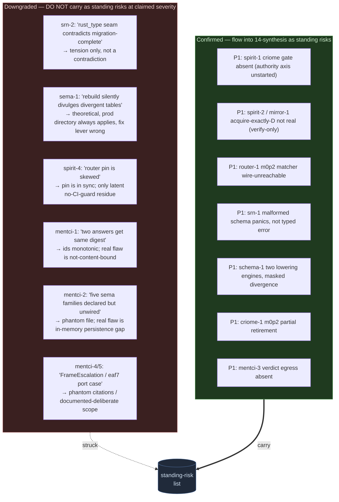

# 702 — adversarial verification: the refutation verdicts

This file consolidates the skeptic pass that ran against every P1/P2
finding in the nine per-engine lanes and the two pipeline lanes. The rule
the orchestrator set (see `0-frame-and-method.md`) is strict: a finding
that a skeptic could not ground in `file:line` against the **production**
code path is **Downgraded** or dropped, and a Downgraded/Refuted finding
**must not** reappear as a standing risk in the synthesis (`14-synthesis.md`).
The point of this file is to be the single place that records *why* a
finding survived or fell, so the synthesis can cite it and never relitigate.

## How to read the verdicts

- **Confirmed** — every limb of the claim verified against real code; the
  cited `file:line` holds; the production path (not a `#[cfg(test)]`
  harness) does the thing claimed. These flow into the synthesis as
  standing risks.
- **Downgraded** — the *factual core* is real but the finding overstated
  severity, named the wrong remediation, cited a phantom file, or the
  defect is theoretical (no production path reaches it). The *grounded
  residue* survives at a lower altitude; the *overstatement* is struck.
  These do **not** flow in at their claimed severity.
- A finding not adversarially examined (most P3s, and P1/P2s whose
  verification the lanes did not transcribe) is carried at lane severity
  but flagged as **unwitnessed by the skeptic** where it would otherwise
  rank as a top risk.

## The verdict ledger

Every P1/P2 finding that the skeptic pass actually adjudicated, with the
one-line counter-evidence where it was downgraded. Engine order follows
the lane numbering.

| Finding | Sev | Verdict | The load-bearing reason |
|---|---|---|---|
| `nota-1` body-vs-arity shadow blind spot | P1 | **Confirmed** | Body shapes lower to `Any` arity (`derive/src/lib.rs:1107`), `parenthesized_head_shape` returns `None` for non-`Exact` (`src/macros.rs:883`), so `validate_no_silent_conflicts` (`src/macros.rs:492`) sees no conflict; the runtime arm checks head only (`derive/src/lib.rs:1177`). |
| `nota-2` ARCHITECTURE omits 2 of 7 derive shapes | P2 | **Confirmed** | `ARCHITECTURE.md:35-36` lists five; derive ships seven (`derive/src/lib.rs:928-936`); `HeadedAtom` and `PascalHeadBody` are the two missing, present in `skills/structural-forms.md:32-38`. |
| `schema-1` two lowering engines, nested-ns + relations divergence | P1 | **Confirmed** | Macro path has no namespace branch (`engine.rs:652-682` keys on delimiter only); source path detects nested-ns by name casing (`source.rs:760-777`); macro path rejects relations (`engine.rs:415,487`). Prod uses source path only (`module.rs:199`), so it is masked, not absent. |
| `schema-2` `RustSurface::verify_catalog` test-only | P2 | **Confirmed** | Only call sites are `tests/impl_catalog.rs:434,453,489,806`; no `build.rs`/`module.rs` invocation; the internal `impls_verified` check (`schema.rs:776`) never touches a real crate surface. |
| `schema-3` macro-path impl graft silently drops nested targets | P2 | **Confirmed** | Graft does `find(name == target)` over a flat vec (`engine.rs:469-476`) but the fused manifest keys by colon-qualified name (`source.rs:805`, `schema.rs:41-48`); flat ≠ qualified → silent drop. Non-prod path, so risk not live break. |
| `srn-1` malformed schema panics generator, not typed error | P1 | **Confirmed** *(scoped)* | Bare atoms admit any non-bracket char (`nota-next parser.rs:898`); schema-next validates first char only (`source.rs:3383`); reparse `.expect()` sites (`lib.rs:1599,1600,4872`) + `Ident::new` panic on bad name. **Caveat:** 4 of the "9 panics" are inside `quote!{}` (emitted *into* generated code), the other 5 are scope-relation resolution, not name-syntax. |
| `srn-2` rust_type string seam contradicts "migration complete" | P2 | **Downgraded** | The 22-vs-9 call-site count and the reparse seam are real, BUT `INTENT.md:106-115` scopes the migration claim to the eliminated `RustWriter` god-struct and `format!`-built *output* source; `RustTypeTokens` is itself a `ToTokens` wrapper whose `format!` input is a reparsed intermediate, never written to file. Tension, not contradiction. |
| `srn-3` standard-newtype impls separate + WireContract-only | P2 | **Confirmed** *(scoped)* | Zero `ImplReference`/`ImplCatalog` in `src/`; all three constructors default false (`lib.rs:498,514,527`); sole enabler `build.rs:159`. **Caveat:** the specific spirit nexus newtypes cited wrap *declared* types, so `scalar_like()` would skip them even if enabled — the gap is exact only for direct String/Path/Integer/Boolean newtypes. |
| `sema-1` rebuild never verifies realized tables vs view digest | P1 | **Downgraded** | `ViewDigestMismatch` is realization-unused (only `checkpoint.rs:539`), `RowMaterializer` lacks `#[must_use]`, no post-rebuild re-read — all TRUE. BUT the only production `FamilyDirectory` (`spirit family_directory.rs:38-51`) always `row.apply(...)` or `Err`, never drops silently; and `#[must_use]` would NOT catch the cited drop (a moved-in param). Real but theoretical, no prod path, fix lever wrong. |
| `sema-2` layout-5 field-migration gap open | P2 | **Confirmed** *(scoped)* | Hard-fail real (`engine.rs:1717`); only spirit wires migration crates; criome/router/mirror/persona/mind track bare `branch=main`. **Caveat:** all five DO opt into versioning, so the hard-fail bites only a *non-versioned* pre-layout-5 store — exactly how the finding scopes it. |
| `criome-1` m0p2 partial: branch retires 1 of 3 matchers | P1 | **Confirmed** | Main has 3 `matches_update` sites (`subscription.rs:117,149,173`); branch `6c75804` retires only `:149`; snapshot filter `:117` is matching per-subscriber on the production actor path (`daemon_skeleton.rs:597-615`). |
| `criome-2` BLS per-signature loop, no FastAggregateVerify | P2 | **Confirmed** | Per-signature loop (`language.rs:586-600`), preimage built once (`:582`) so aggregate applies; `verify_bls` re-parses hex every call (`master_key.rs:130-145`); zero aggregate refs in `src/`. |
| `criome-3` `rejection`/`actor_reply` free functions | P2 | **Confirmed** | `mod.rs:26,30` free fns, no `#[cfg(test)]`, used pervasively across production handlers; method-only override violated. (A third, `authorization_store_rejection`, also exists — finding undercounts.) |
| `router-1` m0p2 matcher live but wire-unreachable | P1 | **Confirmed** | `signal-router::Input` has 4 variants, no Attend/Withdraw/Publish (`lib.rs:703-708`); both dispatchers have 2 arms (`router.rs:243-257`, `daemon.rs:111-141`); `publish` returns a Vec, never pushes (`authorized_object.rs:122-138`); invariant asserted only in-process (`tests/authorized_object_fanout.rs`). |
| `router-2` forward auth is `AcceptFixedTestIdentity` in prod | P2 | **Confirmed** | Daemon wires the offline stand-in (`daemon.rs:75`); `verify` does no crypto, just signer + FNV digest compare (`forward_attestation.rs:117-129`); key/signature fields are literal format! strings. |
| `router-3` fanout matcher shipped undocumented | P2 | **Confirmed** | Zero fanout/attend/matcher refs in `ARCHITECTURE.md`/`INTENT.md`; docs still frame subscriptions as future (`ARCHITECTURE.md:139,288,585,664-669`); reverse of 690's design-ahead drift. |
| `router-4` cross-host transport branch-only | P2 | **Confirmed** *(wording)* | Two-kernel test only on `transport-two-kernel-e2e-138`; main forward witness is loopback-only. **Caveat:** branch did not "delete" fanout — it forked at merge-base before fanout landed. Substance stands. |
| `spirit-1` criome authorize gate absent from all code | P1 | **Confirmed** | criome 0× in `Cargo.toml`/`Cargo.lock`; survives only as `render.rs:337` `None` stub + prompt/test prose; the first-milestone authority axis is unstarted. |
| `spirit-2` restore-verify method has no daemon caller, not deployed | P1 | **Confirmed** | `import_mirror_restore_bundle` is `#[cfg(feature=mirror-shipper)]`, off by default; mirror-shipper absent from every flake check; only callers are tests; deployed daemon builds `--features agent-guardian` (`flake.nix:684`). |
| `spirit-3` e2e proves a test-local copy of verify-after-restore | P2 | **Confirmed** | e2e uses test-local `RestoreAttempt` over a raw `ComponentEngine` (`end_to_end_offline_full_chain.rs:255-313`); production method untested there; two implementations of one invariant. |
| `spirit-4` router pin skewed; no CI guard | P2 | **Downgraded** | The "no CI guard" latent risk holds, BUT the cited drift is fabricated: `Cargo.lock` pins router `fb403c4` which exactly matches remote main; `4ce85c1` appears 0× in the lock. The lock is in sync, not skewed. |
| `spirit-5` e2e leg-2 reference is fabricated provenance | P2 | **Confirmed** | `AuthorizedObjectReference::new` has one caller, `reference_for_head` (`e2e:224-230`), minting from the raw mirror head; no `From` conversion in spirit src; authority provenance synthetic. |
| `mirror-1` restore cannot serve exactly-head-D | P1 | **Confirmed** | `RestoreQuery` store-name-only (`schema/lib.schema:100`); `load_restore` bounds at `u64::MAX` (`store.rs:527-531`); no `HeadNotHeld` reject; spirit's guard can detect drift, never demand the head. |
| `mirror-2` routed-object-notice is a receive-and-ack stub | P2 | **Confirmed** | `ObjectNotice.Source` decoded, never read (`decision.rs:233-257`); acceptance requires the mirror already hold the head (`:246`); no production `NotifyObject` sender; routing loop does not close at the mirror. |
| `mirror-3` two-transaction persist, crash window healed only by shipper | P2 | **Confirmed** | `commit_entry_rows` then `advance_head` are two redb txns (`store.rs:415-438`); no boot-time self-repair for a still-registered store; "ack means durable" holds for the pair only via shipper re-send. |
| `mentci-1` ProposalDigest is identifier-derived, not content hash | P1 | **Downgraded** | `format!("answer-proposal-{q}-{p}")` is identity-derived (`state.rs:166-170`), no body bytes — TRUE and a real defect (not the authorization preimage). BUT the "two answers → same digest" sub-claim is wrong: proposal ids are monotonic (`state.rs:248-252`), so within a run they differ; the real flaw is not-content-bound, not within-run collision. |
| `mentci-2` SEMA in-memory only, restart loses escalations | P1 | **Downgraded** | In-memory state + `State::default()` on run + no redb dep — all TRUE; restart loses pending escalations. BUT "five sema.schema families declared but unwired" cites a **phantom file**: no `sema.schema` exists in either signal repo (only `schema/lib.schema`); the contracts are wire-only by design. Persistence gap real; evidence partly fabricated. |
| `mentci-3` verdict-to-criome egress wholly absent | P1 | **Confirmed** | `answer()` pushes to a never-read `decisions` Vec and returns `VerdictAccepted` (`state.rs:147-154`); `home_criome_socket_path` sole caller is a test (`configuration.rs:56`); no outbound criome connect anywhere. |
| `mentci-4` FrameEscalation has no runtime; CriomeEscalation unconstructed | P2 | **Downgraded** | `ApprovalSource::CriomeEscalation` is never constructed in production — TRUE, real ingress gap. BUT `FrameEscalation`/`nexus.schema:426`/`sema.schema:146-150` are **phantom citations** (grep + `git log -S` empty; only `schema/lib.schema` exists). Gap real; named mechanism invented. |
| `mentci-5` StandardSocket Unix-only, eaf7 needs port case | P2 | **Downgraded** | Unix-only newtype + no signal-standard dep — TRUE structurally. BUT the schema **explicitly documents** both as deliberate single-machine-scope decisions (`meta-signal-mentci/schema/lib.schema:88-93`, Q3 confirmation); the cross-import is a documented future swap, not drift; eaf7's "requires a port case" is an unverified appeal. Observation correct, drift framing overstated. |

## Survival rate per engine

The fraction of *adjudicated* P1/P2 findings that survived at full
severity. "Confirmed (scoped)" counts as survived — the core claim
stands, only a sub-clause was trimmed.

| Engine | Adjudicated P1/P2 | Confirmed | Downgraded | Survival |
|---|---|---|---|---|
| nota-next | 2 | 2 | 0 | 2/2 (100%) |
| schema-next | 3 | 3 | 0 | 3/3 (100%) |
| schema-rust-next | 3 | 2 | 1 | 2/3 (67%) |
| sema-engine | 2 | 1 | 1 | 1/2 (50%) |
| criome | 3 | 3 | 0 | 3/3 (100%) |
| router | 4 | 4 | 0 | 4/4 (100%) |
| spirit | 5 | 4 | 1 | 4/5 (80%) |
| mirror | 3 | 3 | 0 | 3/3 (100%) |
| mentci | 5 | 2 | 3 | 2/5 (40%) |
| **Total** | **30** | **24** | **6** | **24/30 (80%)** |

Two engines account for five of the six downgrades: **mentci** (3 of 5,
all from fabricated `nexus.schema`/`sema.schema`/`FrameEscalation`
citations — the underlying gaps are real but the evidence pointed at
files that do not exist) and the two `srn-2`/`sema-1` downgrades, where
the factual core was real but the severity or remediation overshot. The
completeness critic (`13-completeness.md`) independently flagged the
mentci lane's citations as the least trustworthy in the set, and noted
its central finding (`mentci-1`, the edited-answer model) judges code that
actually lives in the un-audited `mentci-lib` crate. **Treat every mentci
verdict as scoped to the gap, not the cited mechanism.**

## What this means for the synthesis

The six downgrades remove the following from the standing-risk list:

The grounded residue of each downgrade is still worth a P3 cleanup bead
(see `14-synthesis.md` beads) — the string-type seam should still shrink,
`RowMaterializer` should still gain a realization re-read (just not as a
P1 emergency), the router pin should still get a CI guard, and the mentci
gaps are real even though their citations were wrong. But none of these
six is a top cross-stack risk, and the synthesis must not present them as
one.
