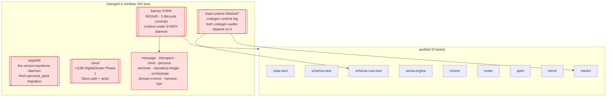

# 702 — completeness critic: what the lanes missed

The deep engine analysis ran nine per-engine lanes plus two pipeline
lanes over the schema-derived stack. It is deep and well-grounded
*inside its frame*. This lane names what fell **outside** the frame —
the engines, seams, and cross-fleet events that no lane owned, and the
per-engine claims asserted but never closed. Build on 690's
change-audit; this is the deep-review's blind-spot pass.

The single biggest blind spot is stated up front: **CROSS_SCHEMA — the
actor runtime under the entire daemon fleet forked the same day the audit
ran, and split the production stack into two incompatible kameo worlds,
and no lane looked across crates to see it.** Every per-engine lane that
mentioned the "Kameo lifecycle fork" correctly scoped it as benign *for
its own crate* (codegen emits-only; mentci is a serial loop). All of them
were right and all of them missed the cross-crate event: the fork is a
real, dated-2026-06-19 rewrite of the actor lifecycle that criome, router,
and mentci now run while spirit and mirror still run stock — a split-brain
actor runtime with a pin-vs-fork inconsistency in the runtime leg they all
share.

## (a) The engines/components that got NO lane and DID change

Freshness check (git log per repo, 2026-06-17..19):

| Repo | Latest meaningful commit | Why it matters / what no lane saw |
|---|---|---|
| **kameo fork** | `f491b45` (5 commits 06-19: split lifecycle control mailbox, publish terminal lifecycle outcomes, gate weak shutdown helpers) | A real fork of the actor runtime — not a Cargo no-op. criome/router/mentci RUN it; spirit/mirror don't. No lane assessed whether the changed lifecycle/shutdown semantics affect any actor invariant (single-writer, mailbox serialization). |
| **triad-runtime** | `60e0ed7 use Kameo lifecycle fork` (main); but ALL daemons pin the older `f46f66e` | The runtime leg both codegen audits depend on (the `Work`/`Action`/`NextStep` frame). main advanced to the fork; every consumer still pins the pre-fork `f46f66e` which declares STOCK kameo. Pin-vs-main drift, unaudited. |
| **upgrade** | `2eda2c4 freeze spirit migration shape` + `version_0_1_0_to_0_1_1.rs` (+148) | **This is the version-projection/handover surface** the prompt asks about — the migration daemon. The sema lane's layout-5 gap (sema-2) asked "who migrates consumer .sema stores" and answered "only spirit wires a migration crate" — it missed that `upgrade` is the dedicated migration projector, with FRESH persona_spirit migration work. The engine that exists to close the gap got no lane. |
| **cloud** | `dfcf9e3 DigitalOcean Phase 1` (+1199: 558-line digitalocean.rs, 462-line test) + `synchronous Store path` | The single most-changed unaudited daemon. A whole new production compute-provider surface, a new sema-engine `Store` consumer, took the kameo fork. Zero coverage. |
| **persona** | `9066397 prove kameo lifecycle shutdown outcome` (real test source) | The ONLY repo with a source-level test of the forked lifecycle's shutdown outcome — the de-facto witness for whether the fork is safe — and no lane read it. |
| message, introspect, mind, terminal, repository-ledger, orchestrate, domain-criome, harness | all took the kameo fork 06-19; most did the strict port 06-17/18 | The ~10 daemons 690 already flagged as unwitnessed. Still unwitnessed — same gap, one audit later. |
| **lojix** | `538fdeb REAL hermetic Test-op dispatch, proven end-to-end` (06-16) | 690's unresolved `aipc` ("proven end-to-end") record — the commit claims it; still no independent witness. Not re-checked by 702. |
| **mentci-lib** | `c5a8085 model edited answers as proposals` (06-18) | The library behind the mentci daemon — the proposal-modeling lane the mentci summary's ProposalDigest finding (mentci-1) actually depends on. Audited the daemon `mentci`, not `mentci-lib` where the edited-answer model lives. |

## (b) Per-engine claims asserted but UNVERIFIED, or test-only dressed as production

The per-engine lanes were disciplined about file:line, and the
adversarial pass (lane 12) caught the worst overstatements (it downgraded
sema-1, srn-2, spirit-4, and four mentci findings). Two residual
verification holes remain:

- **mentci's phantom-file citations are a verification failure the
  adversary already caught — and they cluster.** Lane 12 downgraded
  mentci-2, mentci-4, mentci-5 because the cited `nexus.schema` /
  `sema.schema` files **do not exist** (only `schema/lib.schema` does).
  Three of one lane's seven findings cited fabricated evidence. The
  *underlying gaps* (in-memory SEMA, no CriomeEscalation ingress) are
  real, but a completeness reader should treat that lane's file:line
  citations as the least trustworthy in the set — and the live model of
  edited-answers it judges (`mentci-1` ProposalDigest) actually lives in
  **mentci-lib** (`c5a8085`), which was not opened.

- **"X is the deployed binary" is asserted, not witnessed, on every
  lane.** The spirit lane says the guardian gate is "deployed" and the
  criome lane says quorum is enforced "on the production path" — both
  grounded in `--features` flags and source, neither in a built artifact.
  No lane produced a nix/flake build of any audited HEAD (see (c)). So
  "deployed" everywhere means "the source compiled offline," exactly the
  cargo-offline-≠-deployed-binary caveat 690 raised and 702 inherited
  unchanged. The freshest counter-evidence: **the deployed binaries, if
  rebuilt today, would pull the kameo fork** (criome/router) — so the
  source the lanes audited and the binary nix would build now differ in
  their actor runtime, and no lane noticed.

## (c) The cross-engine SEAMS both pipeline lanes skip

The two pipeline lanes trace the codegen flow and the propagation flow
*along* the audited engines. Three seams cut *across* the fleet and fall
between every lane's edges:

### Seam 1 — the actor runtime is split-brain (the CROSS_SCHEMA verdict)

Concrete, from the lockfiles:

| Daemon | kameo source | triad-runtime pin |
|---|---|---|
| criome, router, mentci | **fork** `kameo.git#f491b45` | `f46f66e` (declares stock kameo) |
| spirit, mirror | **stock** `crates.io 0.20.0` | `f46f66e` (declares stock kameo) |
| message…harness fleet | **fork** (`[patch.crates-io]`) | various |

Two compounding facts no lane saw:

1. **The production stack runs two different actor runtimes.** criome,
   router, mentci on the LiGoldragon kameo fork; spirit, mirror on stock
   0.20. The fork rewrote lifecycle control (split mailbox) and shutdown
   outcomes. The criome/router/mirror/spirit/mentci lanes each verified
   their own single-writer / mailbox-serialization soundness against
   *their* kameo — none compared, so none can claim the cross-daemon
   actor model is coherent. The mirror lane's "single Service mailbox" and
   the criome lane's actor-reply path were reasoned against different
   kameo versions and nobody knows it.

2. **A pin-vs-patch inconsistency in the shared runtime leg.** criome /
   router / mentci pin triad-runtime `f46f66e`, which *declares stock
   kameo 0.20.0*, but then override kameo to the fork via
   `[patch.crates-io]`. So triad-runtime — the codegen runtime leg both
   codegen audits depend on — is compiled against a kameo it was never
   pinned or tested against, in exactly the three daemons that took the
   fork. triad-runtime main has *already* moved to the fork (`60e0ed7`)
   but no consumer has bumped its pin. This is the precise drift 690
   warned about ("if the generated frame and the runtime frame drift,
   both codegen verdicts are half-true") — now realized at the kameo
   layer, one audit later, uncaught.

### Seam 2 — signal-standard ComponentKind is copied AND already divergent

690 flagged that signal-standard had "zero clients" except a branch. On
702's `main`: only **router** and **spirit** import signal-standard.
**signal-criome, signal-mentci, meta-signal-mentci still keep local
copies** — and the copies have already drifted out of agreement:

- signal-standard `ComponentKind` = **14 variants** (Spirit, Mind,
  Criome, Message, Router, Mirror, Terminal, Harness, Agent, System,
  Introspect, Orchestrate, Lojix, Persona) — `src/schema/lib.rs:28`.
- signal-criome local `ComponentKind` = **7 variants** `[Spirit Criome
  Router Mirror Lojix Persona Agent]` — `schema/lib.schema:86` — missing
  Mind, Message, Terminal, Harness, System, Introspect, Orchestrate.

signal-standard's own header says verbatim "Each component contract
retires its local ComponentKind copy and imports it from here." It hasn't
happened, and the two rosters now disagree on which components exist. The
criome lane (criome-1) deeply analyzed the matcher *role* ambiguity
(m0p2) but neither it nor the propagation pipeline lane traced this
*vocabulary census divergence* across the contract layer — yet a criome
interest tagged with a component signal-standard ranks differently (or a
router-side match against a 14-variant lattice) is exactly where the
copied-vs-imported split bites the propagation loop. The `eeeo`
one-reconciled-census is not merely "unrealized aspiration" (690's
reading); the unreconciled copies are now actively inconsistent.

### Seam 3 — no nix flake-check witness for ANY audited HEAD

Every lane recorded cargo-offline green; **zero** produced a nix/flake
build witness (grep of all 702 reports for `flake check|nix build|
runNixOSTest` returns nothing). The router lane notes the cross-host
witness lives in a *branch* nix test; the spirit lane notes "no nix check
builds the propagation surface." Both are observations that the witness is
*absent*, not a positive build. This is identical to 690's "No nix/CI
build witness anywhere" gap — unchanged. It now matters more because of
Seam 1: a nix rebuild today would resolve kameo to the fork for
criome/router, so the deployed artifact and the audited source diverge in
their runtime, and the only thing that would catch it is the nix path no
lane ran.

## (d) 690 beads NOT re-checked done-or-still-open by 702

690 ended with explicit operator/designer beads. 702's per-engine lanes
re-touched some implicitly; these were never closed out as
done-or-still-open:

| 690 bead | 702 status | Gap |
|---|---|---|
| criome `k>n/2` majority | **DONE** (criome-1 invariant I1 confirms `22801af`) | Closed — 702 correctly verified this. |
| criome BLS FastAggregateVerify | **STILL OPEN** (criome-2 confirms) | Correctly carried. |
| router land `attendance-fanout-139` to main | **PARTIAL** (router-1: matcher on main but wire-unreachable) | 702 caught this well. |
| router land `transport-two-kernel-e2e-138` | **STILL BRANCH-ONLY** (router-4) | Carried; but no lane re-checked whether the branch is still alive/diverging. |
| **mirror owner needed** | mirror lane ran — **closed** | The one 690 gap 702 explicitly filled. |
| **consumer-build sweep (~12 daemons), nix included** | **NOT RE-CHECKED** | The biggest carried-forward bead. 702 audited mirror but left the other ~11 (+cloud, +the kameo fork that hit all of them) unwitnessed. Worse than 690: they now diverge on kameo. |
| `StandardSocket` sum-vs-newtype decision | **NOT RE-CHECKED as decided** | mentci-5 re-touches StandardSocket but as a Unix-only newtype scope note; the 690 sum-vs-newtype cross-contract conflict (signal-standard sum vs mentci newtype) was not re-verified as resolved or open. |
| mentci durable SEMA + canonical ProposalDigest | **STILL OPEN** (mentci-1, mentci-2) | Carried, but judged against `mentci` not `mentci-lib` where the model lives. |
| nix flake-check witnesses (P3) | **STILL OPEN** | See Seam 3. |
| guardian recorded-transcript test (no live provider) | **STILL OPEN** (spirit invariant notes #[ignore]d live scenarios) | Carried. |
| `aipc` lojix "proven end-to-end" | **NOT RE-CHECKED** | lojix `538fdeb` claims it; still no independent witness. |
| triad-runtime generic reaction frame parity | **NOT RE-CHECKED** — now compounded by Seam 1 | 690 said both codegen verdicts are half-true if this drifts; it has drifted (kameo pin), uncaught. |

## The one-line takeaway

The audit is excellent within its nine-engine frame and the adversary
kept it honest. But the frame stopped at the crate boundary, and the most
consequential event of the audit window — the kameo lifecycle fork —
lives precisely at the cross-crate seam: it split the production daemon
fleet into two actor runtimes, left the shared codegen runtime leg
(triad-runtime) pinned against a kameo it doesn't declare, and would
change the deployed binary the moment anyone runs the nix build no lane
ran. Plus the engine that closes the storage lane's own migration gap
(`upgrade`) and the largest new production surface of the window (`cloud`,
+1199) both got no lane at all.
