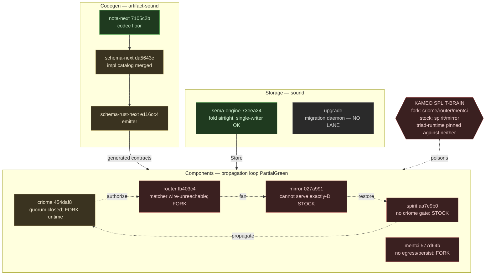
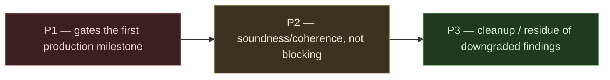

# 702 — synthesis: the engine stack after a week of consolidation

**Headline finding:** the codegen tier is artifact-sound and the storage
and agreement engines are individually sound, but the strategically
central criome-gated propagation loop is `PartialGreen` — proven in one
in-process test fractured across three unmerged refs with **no daemon
caller on any axis** — and a same-day kameo fork has split the running
daemon fleet into two incompatible actor runtimes that no per-engine lane
saw.

This is the highest-numbered file of the 702 session and it folds in only
**Confirmed** findings (see `12-adversarial-verification.md` for the
refutation ledger; the six Downgraded findings do not appear here as
standing risks). Read `0-frame-and-method.md` for scope and the
what-moved-since-690 table. The depth lives in the numbered per-engine
files (`1-` through `9-`) and the two pipeline lanes (`10-`, `11-`); the
completeness critic (`13-`) supplied the cross-crate findings the
per-engine frame could not see.

## The state of the engine after a week of consolidation

690 asked *"is each change real and does the stack cohere?"* 702 asked the
harder questions — *what does each engine guarantee, where is the
invariant enforced, does the production path do it, where will the seam
bite.* The answer divides cleanly into three altitudes.

**The codegen tier is the strongest layer in the stack.** `nota-next`
(stable since 690 at `7105c2b`), `schema-next` (now `da5643c`, the
`{| |}` impl-reference syntax merged from branch to main), and
`schema-rust-next` (`e116cc4`) compose into a pipeline whose two
artifact-discipline invariants are genuinely enforced on every build: the
source-artifact text+rkyv round-trip (`schema-rust-next build.rs:586-595`)
and the byte-exact freshness gate (`build.rs:635`, typed
`BuildError::StaleGeneratedArtifact`). Downstream contract crates carry
the regenerated `@generated` surface; a schema edit cannot land without
its generated diff. That is real artifact discipline, not round-trip-in-
test. Rust and component discipline across the codegen crates is clean.

**The storage and agreement engines are individually sound at their
load-bearing invariants.** `sema-engine` (`73eea24`) rests its
correctness on the fold being the definition of the view, and the fold
itself is airtight (`fold.rs:147-177` recomputes every digest link-by-
link); the single-writer `write_lock` is load-bearing and correct
(`engine.rs:84`), closing a genuine read-then-write race. `criome`
(`454daf8`) closed 684 Woe 3: majority quorum `k > n/2` is now enforced at
both the runtime moment guard and the admission threshold, gating
evaluation unconditionally before any rule decides (`language.rs:143,414,
577,623-626`), with real adversarial tests. The attested-moment time
model (`ay3y`), object-digest binding, and binary-only daemon startup all
hold.

**The component-engine layer is where soundness and surface diverge
sharply, and it is exactly the propagation loop.** Every component engine
has the *logic* for its role somewhere, but the running daemon does not
exercise it: criome's quorum is real but spirit never calls criome
(`criome` is 0× in spirit's `Cargo.lock`); router's m0p2 matcher is live
in-process but has no wire on-ramp; mirror's restore cannot serve
exactly-head-D; mentci closes `EscalateToPsyche` in tests but cannot
deliver a verdict, persist an escalation, or content-address an edited
answer in running code. The propagation arc — the strategically important
part — remains test/library-shaped on every axis that matters.

## The codegen pipeline verdict

**Artifact-sound, semantically incomplete at the seams.** Lane 10 traced
one authored `.schema` NOTA string end-to-end through the real production
build path and found two structural results worth more than any single
engine report.

First, the whole codegen tier commits to exactly **one** schema-next
lowering path — the typed-source path (`lower_schema_source_with_resolver
-> source.to_schema`, invoked at `schema-rust-next lib.rs:179` and
`build.rs:532/540`). The macro/document path is reachable from nowhere in
production, which **production-masks** schema-next's `schema-1` P1
(nested-namespace divergence) and its relations rejection — they cannot
fire in the pipeline. The two-engine hazard is real (Confirmed) but
latent, not live; the right fix remains collapsing to one engine
(`lower_source` delegates to `SchemaSource::lower`) so the divergence
cannot recur, not another parity test.

Second, the `.schema → typed-Rust` path is **not** sound at the final
seam: no layer validates that a schema name is a legal Rust identifier.
nota-next's `is_bare_string` admits any non-whitespace/non-bracket char
(`parser.rs:898`), schema-next's `is_type` checks first-char-uppercase
only (`source.rs:3383`), and `schema-rust-next` feeds the name straight to
`Ident::new` with no guard (`lib.rs:1516`). Lowering is infallible after
the schema-next boundary (`lib.rs:180-181` returns `RustModule`, not
`Result`), so **panic is the only failure mode** — a name like `Foo<Bar`
or `Foo:Bar` crashes the generator instead of yielding the advertised
`SchemaError`. This is `srn-1` (Confirmed, scoped), and lane 10 confirmed
it is reachable across the full three-crate seam.

A surprising and *good* result: schema-rust-next does **not** emit
`#[derive(StructuralMacroNode)]` — it hand-emits `impl NotaDecode/
NotaEncode` (`lib.rs:4173,4200`), so nota-next's `silently_shadows`
body-vs-arity P1 blind spot (`nota-1`, Confirmed) is **bypassed on the
production codegen path** — the `StructuralVariantSet` validator is never
constructed by the one production consumer in the stack. This resolves the
cross-engine verification nota-next requested, at the cost of a coherence
debt: nota-next's headline shape-directed derive is exercised only by its
own tests, not by the codegen tier.

The unfinished business: the `{| |}` impl-reference catalog merged to
schema-next has **no consumer**. The `Schema` carries `impl_blocks`
(`schema-next schema.rs:444`) but `schema-rust-next` references
`ImplReference`/`ImplCatalog` **zero times** — it derives all impls from a
fully parallel `scalar_like()` shape-inference mechanism
(`StandardNewtypeImplTokens lib.rs:2064-2158`). The catalog is lowered,
internally shape-verified, carried into the pipeline, and dropped on the
floor; its trust boundary `RustSurface::verify_catalog` is test-only
(`schema-2`, Confirmed). The feature is built ahead of its consumer.

## The propagation loop verdict: PartialGreen, not LoopProvenGreen

This is the honest answer the psyche needs. The criome-gated typed
propagation loop is **`PartialGreen`** — green in exactly one in-process
test, fractured across three unmerged refs, with no daemon caller — and
**not `LoopProvenGreen`** (the 700 C7 bar: daemon-enforced end-to-end).

All four legs have a real, correct implementation *somewhere*. But the
decisive structural finding, visible only from the end-to-end lane, is
that **the loop's two load-bearing halves live on different refs that were
never composed**:

```mermaid
flowchart LR
    subgraph MAIN["spirit MAIN aa7e9b0"]
        M1["Store::import_mirror_restore_bundle<br/>(production restore-verify, raises<br/>MirrorRestoreHeadMismatch)<br/>store/mod.rs:467"]
        M2["criome = 0× in Cargo.toml<br/>NO gate"]
        M3["router fan uses FABRICATED<br/>signal_standard ref minted<br/>from mirror head — e2e:224"]
    end
    subgraph BRANCH["spirit BRANCH (forked at 4d0e0ca, BEFORE aa7e9b0)"]
        B1["real CriomeRoot 2-of-3 gate<br/>+ 1-of-3 negative"]
        B2["typed router fan via production<br/>From projection"]
        B3["reject-stale re-implemented as<br/>test-local RestoreCandidate.tip_matches<br/>— calls production method 0×"]
        B4["criome/router = [dev-dependencies]<br/>behind off-by-default mirror-shipper"]
    end
    MAIN -.never composed.-> BRANCH
    note["merge-base --is-ancestor aa7e9b0 branch = NO<br/>Merging branch as-is REGRESSES the production restore method off the loop"]
    BRANCH --> note
    style MAIN fill:#2a2030,stroke:#a070a0,color:#f0d0f0
    style BRANCH fill:#202a30,stroke:#5090a0,color:#d0f0f0
    style note fill:#3a2020,stroke:#a05050,color:#f0d0d0
```

Leg-by-leg (all Confirmed):

- **Gate before propagation** — yes in the *branch* test, via in-process
  `ActorRef` not a socket, no production. spirit main has no criome
  dependency at all (`spirit-1`). The first-milestone authority axis
  (`d6he`/`nfvm`/`2st7`) is unstarted in running code.
- **Typed reference replaces `MirrorObjectNotice`** — yes everywhere; the
  router branch promotes signal-criome to a real dep and adds a production
  `impl From` projection. But the fanout stays **wire-unreachable**:
  `signal-router::Input` has 4 variants (no Attend/Withdraw/Publish), the
  daemon dispatch has 2 arms, `publish` returns a Vec it never pushes
  (`router-1`). The m0p2 sole-matcher role is asserted by cargo test, not
  enforced by the daemon.
- **Acquire-exactly-D** — verify-after-restore only (detect, never
  demand). Mirror fetch-by-digest is structurally impossible:
  `RestoreQuery` is store-name-only, `load_restore` bounds at `u64::MAX`,
  no `HeadNotHeld` reject (`mirror-1`). The reject-stale guard lives in
  spirit (a *neighbouring* engine) and can reject a drifted bundle but
  never compel the mirror to serve head D, so the cross-machine live-loop
  race is unclosed. E5 (701 line 93-95) is unaddressed on every ref.
- **m0p2 retirement** — one-third done, branch-only. criome `6c75804`
  retires the publish-side count match; the snapshot filter (`:117`, the
  observe path) and the time-pulse matcher (`:173`) survive (`criome-1`).
  Whether the survivors are observation/audit (keep) or operational
  matching (lift to router) is the open **psyche decision** that gates
  whether the branch is a complete m0p2 retirement.

## The cross-stack risk no per-engine lane saw

The completeness critic (`13-completeness.md`) found the single most
consequential fact of the window, invisible from inside any crate
boundary: **the actor runtime is split-brain across the production daemon
fleet.** The LiGoldragon kameo fork (`kameo.git#f491b45`, five real
lifecycle commits dated 2026-06-19 — split lifecycle control mailbox,
publish terminal lifecycle outcomes, gate weak shutdown helpers) split the
stack — **criome / router / mentci run the fork; spirit / mirror run stock
crates.io kameo 0.20.0.** Worse, every audited daemon pins triad-runtime
`f46f66e`, which *declares* stock kameo, and the fork-takers override it
via `[patch.crates-io]` — so the shared codegen runtime leg is compiled
against a kameo it was never pinned against. Each actor lane verified its
single-writer/mailbox soundness against its *own* kameo; none compared, so
cross-daemon actor-model coherence is unestablished. This is the exact
frame/runtime drift 690 warned would make both codegen verdicts half-true,
now realized at the kameo layer and uncaught until the critic looked
across crates.

Two further completeness gaps matter for the synthesis: the **`upgrade`
daemon** — the dedicated migration-orchestration engine — got no lane, yet
it is the literal answer to sema-engine's open layout-5 migration gap
(`sema-2`), and it landed fresh `persona_spirit` migration work in the
window. And **no nix/flake-check witness exists for any audited HEAD** — a
rebuild today would resolve kameo to the fork for criome/router, so the
deployed binary diverges from the audited source in its actor runtime, and
the only thing that would catch it is the nix path no lane ran.

## Top cross-stack risks (Confirmed only)

Ranked, with the single highest-value next move each:

1. **Kameo fork split-brain across the daemon fleet (P1, cross-stack).**
   criome/router/mentci run the fork; spirit/mirror run stock; triad-
   runtime is pinned against neither. Highest-value move: decide one
   runtime for the whole fleet, bump every daemon's triad-runtime pin to a
   version that declares the chosen kameo, and add a nix/flake check that
   builds the fleet so the deployed binary matches audited source.

2. **The criome authority axis is unstarted in running code (P1).**
   criome is 0× in spirit; the gate the High-certainty records
   `d6he`/`nfvm`/`2st7` make the centerpiece of the first production
   milestone does not exist. spirit ships outbound to a mirror with no
   authorization step — the exact shape those records forbid. Move: add
   criome as a real dependency and put `EvaluateAuthorization` in the
   daemon post-commit path before fan-out.

3. **The propagation loop has no daemon caller on any axis (P1).** It is
   proven in one in-process test fractured across three unmerged refs, and
   merging the branch as-is regresses spirit's production restore method
   off the loop path. Move: re-base the branch onto `aa7e9b0`, call the
   *production* `import_mirror_restore_bundle`, then land 700 Slice 1
   (daemon capture + criome socket gate) so a daemon — not cargo test —
   enforces the loop.

4. **Acquire-exactly-D is structurally impossible at the mirror (P1).**
   `RestoreQuery` is store-name-only; the only defence is spirit's
   after-the-fact detection. Move: implement E5 — add a target `HeadMark`
   to `RestoreQuery`, a `HeadNotHeld` rejection, and locate-by-digest +
   suffix-bound in `Store::load_restore` — turning detect-only into
   acquire-exactly-D in the right engine.

5. **The m0p2 sole-matcher role is asserted by cargo test, not the daemon
   (P1).** The matcher is live in production but wire-unreachable. Move:
   add Attend/Withdraw/Publish to `signal-router::Input`, a third dispatch
   arm, and a push edge from `publish` to subscriber sockets via
   `HarnessDelivery`. (Gated on the psyche decision in risk 7.)

6. **Malformed schema panics the generator instead of erroring (P1).** No
   layer validates a schema name as a legal Rust identifier; panic is the
   only failure mode after the schema-next boundary. Move: land 663
   slice 1 — convert the reparse `.expect()` sites and the `Ident::new`
   path to typed `SchemaError`, and fold `rust_type()` into the token-
   native path (the string-type seam is the same wound).

7. **m0p2 partial-retirement classification (P1, psyche decision).** The
   branch retires one of three criome matchers; whether criome's observe-
   time snapshot filter and the time-pulse matcher are observation/audit
   (keep) or operational matching (lift to router) gates whether the
   branch is mergeable as a complete m0p2 realization. This is a decision,
   not a fix — it needs the psyche.

8. **mentci verdict round-trip does not close in running code (P1).** No
   durable SEMA (restart loses escalations), no criome egress (verdicts go
   to a never-read Vec), no content-addressed `ProposalDigest`. Move: wire
   durable SEMA, computing the content-addressed digest in the same
   storage pass since the durable record is the exact rkyv object whose
   hash the digest should be.

## Beads

An audit without beads is incomplete. Each names a lane, priority, and a
concrete title. Confirmed findings only; the six Downgraded findings
appear at most as P3 residue.

| Lane | Priority | Title |
|---|---|---|
| system-operator | P1 | Resolve kameo fork split-brain: pick one runtime for criome/router/mentci/spirit/mirror, bump every triad-runtime pin to declare it, add a nix flake check that builds the fleet |
| operator | P1 | Add criome as a real spirit dependency and call EvaluateAuthorization in the daemon post-commit path before fan-out (d6he/nfvm/2st7) |
| operator | P1 | Re-base criome-gated-propagation-loop onto spirit aa7e9b0 and call the production import_mirror_restore_bundle, not the test-local copy |
| operator | P1 | Land 700 Slice 1: spirit daemon captures head D and gates on a criome socket so a daemon (not cargo test) enforces the loop |
| operator | P1 | Implement mirror E5: target HeadMark on RestoreQuery, HeadNotHeld rejection, locate-by-digest + suffix-bound in load_restore (acquire-exactly-D) |
| operator | P1 | Give the router m0p2 matcher a wire: Attend/Withdraw/Publish in signal-router::Input, a third dispatch arm, and a push edge from publish to subscriber sockets |
| operator | P1 | Land 663 slice 1: convert schema-rust-next panic!/parse_str().expect()/Ident::new sites to typed SchemaError; validate schema names as legal Rust identifiers |
| operator | P1 | Wire mentci durable SEMA + criome verdict egress + content-addressed ProposalDigest (hash the durable rkyv record) |
| designer | P1 | Psyche decision: are criome's surviving snapshot filter + time-pulse matcher observation/audit (keep) or operational (lift to router) — gates m0p2 branch merge |
| designer | P2 | Collapse schema-next to one lowering engine: lower_source delegates to SchemaSource::lower so the nested-ns/relations divergence cannot recur |
| operator | P2 | Make schema-rust-next consume the {| |} impl catalog (or document it as intentionally deferred) and invoke RustSurface::verify_catalog outside tests |
| operator | P2 | criome: aggregate BLS verification (FastAggregateVerify) and stop re-parsing the public key from hex on every signature in the quorum loop |
| operator | P2 | criome: convert rejection()/actor_reply()/authorization_store_rejection free functions to assoc fns / From impls (method-only override) |
| operator | P2 | router: replace AcceptFixedTestIdentity with the real criome attestation client on the forward ingress (milestone 3) |
| system-operator | P2 | Add nix/flake-check witnesses for the audited HEADs so deployed binary == audited source (no lane ran the nix path) |
| designer | P2 | Audit the upgrade migration daemon (no lane) — it is the answer to sema-engine's open layout-5 consumer-migration gap |
| designer | P2 | Retire local ComponentKind copies in signal-criome/signal-mentci/meta-signal-mentci; they have diverged (7 vs 14 variants) from signal-standard |
| operator | P3 | sema-engine: mark RowMaterializer #[must_use] and add a post-rebuild realization re-read vs view.digest() (downgraded sema-1 residue) |
| operator | P3 | schema-rust-next: shrink the rust_type() string-reparse seam toward the token-native path (downgraded srn-2 residue) |
| operator | P3 | spirit: add a CI guard so a future router pin bump cannot re-break propagation types undetected (downgraded spirit-4 residue) |
| designer | P3 | Update ARCHITECTURE.md / INTENT.md across nota-next, router, spirit for the shipped-but-undocumented surfaces (derive shapes, fanout matcher, restore-verify) |
| designer | P3 | Audit mentci-lib (where the edited-answer model actually lives) — the mentci lane judged the wrong repo |
