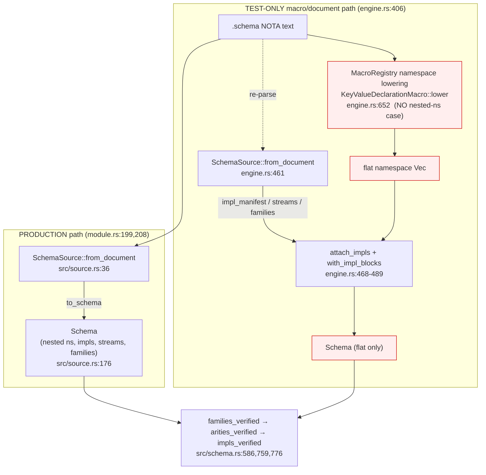

# 702.2 — deep engine analysis: `schema-next` (semantics + resolver + impl-reference)

HEAD audited: `da5643c` (`schema-next: impl-reference integration-bar
fixes 1-5`). Build + full test suite run **offline and green** at this
HEAD: `cargo build --offline` clean; `cargo test --offline` all suites
pass (the impl-catalog suite at `tests/impl_catalog.rs` is 26 tests, the
whole crate plus the `schema-cc` member is ~250 tests, 0 failed). 690.1
already proved every *change* real-and-green; this report does not redo
that. It interrogates the engine's **invariants** now that the
`{| |}` impl-reference arc has merged from branch to `main`, and it
isolates the one place where the engine's central promise — *one schema
text lowers to one semantics regardless of path* — is **guaranteed only
for the flat shape and silently false for nested namespaces**.

## The deepest finding, stated first

schema-next has **two lowering engines for the same surface**, not one:

- the **typed-source path** `SchemaSource::to_schema` (`src/source.rs:176`)
  reached through `SchemaEngine::lower_schema_source[_with_resolver]`
  (`src/engine.rs:353,361`), and
- the **macro/document path** `lower_document_with_resolver`
  (`src/engine.rs:406`) reached through `lower_source` /
  `lower_document`.

The impl-reference integration-bar Fix 3 ("lowering-path parity") did not
*merge* these two engines. It made the macro path **re-parse the very same
document into a `SchemaSource`** (`src/engine.rs:461`) and graft three
slices off that source value — the impl manifest
(`source.impl_manifest()`, `src/engine.rs:468`), stream declarations, and
family declarations (`src/engine.rs:462-467`) — onto the namespace the
macro registry produced independently. So for impls/streams/families the
macro path now literally delegates to the source codec; for **type
declarations and roots it still lowers through the macro registry on its
own**, and the two are kept in agreement only by two **hand-mirrored
entry walks** that the code itself flags must "stay in lockstep"
(`SourceNamespaceWalk` at `src/source.rs:650` vs `NamespaceEntryWalk` at
`src/engine.rs:961`, comment `src/engine.rs:895`).

That lockstep holds for the **flat** namespace — and the parity witness
proves it for the flat shape. It does **not** hold for a **nested
namespace**: the source path lowers a lowercase-led colon-keyed brace
entry as a sub-namespace (`SourceNamespaceEntry::value_from_body`,
`src/source.rs:760-777`, gated on `SourceIdentifierCase::is_namespace`,
`src/source.rs:3391`), whereas the macro path's
`KeyValueDeclarationMacro::lower` (`src/engine.rs:652`) has **no
namespace case at all** — a brace body unconditionally dispatches to
`lower_struct` (`src/engine.rs:659-663`). The same schema text therefore
lowers to a **nested-namespace `Schema` on the source path and a mangled
flat struct on the macro path**. No test catches this because the only
nested-namespace test (`tests/source_codec.rs:111`) lowers **exclusively
through the source path** (`recovered.source().lower(...)`,
`tests/source_codec.rs:154-160`), and **production never uses the macro
path** — `SchemaModuleSource::lower` calls `lower_schema_source`
(`src/module.rs:199-200`) and the resolver form calls
`lower_schema_source_with_resolver` (`src/module.rs:208`). The macro path
is now a **test-only shadow engine** carrying a latent, untested
divergence.

This reframes the parity claim precisely: *"one schema → one semantics
regardless of path"* is **true and tested for the flat impl/declaration
shape**, **false and untested for nested namespaces**, and the question is
moot for production because production has exactly one path. The honest
move is to delete the macro lowering of declarations/roots and make
`lower_source` a thin `SchemaSource::from_schema_text(...).lower(...)`
wrapper — one engine, by construction, not by hand-mirrored walks.

## What the engine guarantees, and where each invariant lives

| Invariant | Status | Enforced at | Risk if it breaks |
|---|---|---|---|
| One schema text → one semantics across both lowering paths | **AtRisk** | flat parity tested `tests/impl_catalog.rs:673`; **nested untested**, macro path lacks a namespace case `src/engine.rs:659` | divergent codegen if any caller ever uses `lower_source` on a nested schema; today masked because prod uses only the source path (`src/module.rs:199`) |
| A `{| |}` impl block targets a type declared in this schema | **Holds** | `Schema::impls_verified` → `UnresolvedImplTarget` `src/schema.rs:776-783`; called on **both** paths `src/source.rs:206` and `src/engine.rs:492` | a free-standing impl over an arbitrary name → unverifiable catalog |
| No true-duplicate impl entry per target (distinct compose) | **Holds** | `impl_entries_distinct` → `DuplicateImplEntry` `src/schema.rs:791-808`, keyed by `ImplCompositionKey` `src/schema.rs:1250` | the same trait/method counted twice; composition becomes ambiguous |
| A `{| |}` trait atom is a PascalCase type name | **Holds** | `SourceImplCatalog::from_block` → `NonTypeNameTrait` `src/source.rs:1069-1073` | a lowercase atom silently accepted as a trait |
| Every referenced impl exists on the real Rust surface | **Unverified (test-only)** | `RustSurface::verify_catalog` `src/schema.rs:1498` — **never called by any production/build path** (only `tests/impl_catalog.rs`) | the catalog references methods/traits a crate does not provide; nothing checks it outside tests |
| Struct field grammar is strictly positional (no `*`, no redundant role) | **Holds (both paths)** | source `src/source.rs:2148,2163,2180,2205,2211`; macro `src/declarative.rs:1773,1802,1808,1833,1839` | retired pair/star syntax re-admitted; two parsers drift |
| Single-field brace → Newtype, multi-field → Struct | **Holds** | `to_declaration_group_with_visibility` `src/source.rs:2050-2054` | an invented one-field struct with a synthetic field name |
| Parenthesis-reference dispatch comes from data, not a hand match | **Holds (artifact)** | generated `src/reference_resolver_generated.rs`; `build.rs:83` byte-checks against schema-cc emission and **fails the build on drift** | dispatch precedence silently diverges from the grammar |
| Reserved scalars cannot be shadowed as type names | **Holds** | `ReservedScalarTypeName` `src/engine.rs:873`; field path `is_reserved_scalar_name` `src/source.rs:2223` | a user `String` declaration colliding with the scalar leaf |
| Source codec round-trips byte-stably, incl. `{| |}` | **Holds** | `tests/impl_catalog.rs:36,59,79`; binary archive `tests/impl_catalog.rs:103` | a non-canonical surface; archive not the source of truth |

## (a) The impl-reference feature — deep read

**The catalog is genuinely data.** `ImplCatalog` is `Vec<ImplReference>`
(`src/schema.rs:1176`); `ImplReference` is `Marker(Name) |
TraitImpl(Name, Vec<MethodSignature>) | InherentMethod(MethodSignature)`
(`src/schema.rs:1215`). All of it derives rkyv + `NotaDecode`/`NotaEncode`
(`src/schema.rs:1164-1175`) and survives the binary archive boundary in a
production-shaped test (`tests/impl_catalog.rs:103-121`). A catalog
references impls that **already exist on the Rust side** — it carries no
generated body — which is exactly the report-695/Spirit-`ba6d` intent:
mark participations at the declaration, do not generate behavior.

**The four claimed errors are real and enforced, not dead code:**

- `UnresolvedImplTarget` (`src/schema.rs:218`) fires in `impls_verified`
  for any standalone `ImplBlock` whose target is not `type_named`
  (`src/schema.rs:778`). Tested on **both** paths
  (`tests/impl_catalog.rs:544,564`).
- `DuplicateImplEntry` (`src/schema.rs:224`) fires in
  `impl_entries_distinct` (`src/schema.rs:799`), keyed by
  `composition_key` (`src/schema.rs:1250`): a trait keys on its name (so
  `Display` and `Display [ … ]` collide), a method keys on its full
  `render()` (so same-name/different-signature **compose**, proven at
  `tests/impl_catalog.rs:655`).
- `NonTypeNameTrait` (`src/schema.rs:230`) fires at decode time in
  `SourceImplCatalog::from_block` (`src/source.rs:1069`), on both the bare
  marker and the body-bearing trait form (`tests/impl_catalog.rs:747,762`).
- `UnverifiedImplReference` (`src/schema.rs:207`) carries the **full**
  signature via `MethodSignature::render` (`src/schema.rs:1550-1553`), so a
  name-matches/signature-differs mismatch is legible
  (`tests/impl_catalog.rs:783`). **But** — see the soundness caveat below.

**The parity witness is load-bearing over a non-empty manifest.**
`both_lowering_paths_produce_the_same_impls` (`tests/impl_catalog.rs:673`)
lowers `RecordIdentifier String {| Display Ord |} StatementText String
StatementText {| Display (word_count {} Integer) |}` through both
`lower_via_macro_path` and `lower_via_source_path`, asserts equal
`manifest_pairs` **and** equal standalone `impl_blocks`, and explicitly
asserts the manifest is non-empty (`tests/impl_catalog.rs:712-715`) so the
witness cannot pass vacuously. This is a genuine correctness witness — for
the **flat** shape. It says nothing about nested namespaces, which is the
gap above.

**Soundness caveat on `UnverifiedImplReference` (the trust boundary).**
`RustSurface::verify_catalog` is the *whole point* of the impl-reference
design — the schema names impls that live out-of-band on the Rust side, so
something must confirm they exist before any consumer trusts the catalog.
That boundary check is **invoked only from `tests/impl_catalog.rs`**
(`grep RustSurface src/` finds only the type definition and doc-comments,
`src/schema.rs:1481-1556`; no `build.rs`, no `module.rs`, no emitter call
site). So at HEAD the production answer to *"do the referenced impls
actually exist?"* is **nobody checks** — the catalog lowers, verifies its
internal shape (`impls_verified`), and is handed downstream **unverified
against any real crate surface**. `RustSurface` exists, is well-shaped, and
is unit-proven falsifiable (`tests/impl_catalog.rs:444,480,783`), but it is
not yet wired into any pipeline. This is the correct audit-precision
statement: the trust boundary is **built and tested, not enforced**.

## (b) Strict-positional field-role grammar — wired on both paths

The retired-pair rejection and redundant-role rejection are real on **both**
lowering engines, and the two implementations are near-identical (which is
itself the duplication risk):

- Source path: `SourceField::from_positional_block`
  (`src/source.rs:2134`) rejects `*` (`:2148`), bare lowercase / non-type
  (`:2163`), explicit structural field with a scalar name (`:2180`); and
  `from_explicit_field_reference` rejects a malformed dot field (`:2205`)
  and a redundant `field.Type` where `field == type` (`:2211`).
- Macro path: `MacroExpansionField::lower` (`src/declarative.rs:1768`)
  mirrors it arm-for-arm: explicit-pair reject (`:1773`), `*`/lowercase
  reject (`:1802`), scalar reject (`:1808`), redundant dot reject
  (`:1839`).

Both are exercised by typed-error tests (`tests/lowering.rs:208` asserts
the exact `RedundantExplicitFieldRole { found: "topic.Topic", type_name:
"Topic" }`). The grammar is sound. The tension is that it is **authored
twice** — a quietly load-bearing duplication that the impl-manifest fix's
own comments admit ("the two walks must stay in lockstep",
`src/engine.rs:895`). One change to the field grammar must be made in two
files or the paths drift; nothing structurally prevents the drift.

**Minor round-trip asymmetry (P3).** `SourceFieldValue::Derived` re-emits
as the literal `"*"` (`src/source.rs:2329`), yet a `*` atom at a field
position is a hard `RetiredStructFieldSyntax` error
(`src/source.rs:2147-2151`). A `Derived` field is only ever *produced* from
a bare PascalCase type (`src/source.rs:2156-2161`), which re-emits as the
bare name, so the `"*"` branch is unreachable on the real decode→encode
path — but it is a latent contradiction: the encoder can name a token the
decoder forbids. It is dead today; it should be deleted, not left as a trap.

## (c) schema-cc capability resolver + (d) the rigidly-positional root

The schema-cc integration is the strongest artifact in the engine and
needs no re-litigation beyond 690.1: `resolve_parenthesis_reference` is
generated from `schemas/reference-grammar.nota`
(`src/reference_resolver_generated.rs:1-3`), and `build.rs:90-95`
byte-compares the committed file against a fresh schema-cc emission **on
every compile, failing the build on drift** — verified because the offline
build succeeded at this HEAD. This is data-driven dispatch with a real
freshness gate, satisfying the "no hand-parsing above the seed" intent.

The root is rigidly positional and now polymorphic in body shape:
`SchemaSource::from_document` (`src/source.rs:36`) accepts 3–5 root objects
— optional leading imports brace, input, output, namespace, optional
trailing relations — and `SourceRootBody::from_block`
(`src/source.rs:441`) admits **two** root forms, the enum body `[…]` and
the application form `(Head Arg…)` (`src/source.rs:442-452`), the latter
projecting through the same `to_type_reference` a field application takes.
This is clean. **One asymmetry to note:** the source path accepts 3–5 root
objects (relations supported, `src/source.rs:37`), but the macro path
accepts only **3 or 4** (`src/engine.rs:415`) and hard-codes
`relations = Vec::new()` (`src/engine.rs:487`). A schema carrying a
trailing relations vector lowers on the source path and is **rejected** on
the macro path — another concrete one-text/two-outcomes divergence
reinforcing the top finding, again invisible because production uses only
the source path.

## (e) The macro path's graft is itself fragile

Even setting nested namespaces aside, the Fix-3 graft on the macro path
has a name-matching seam. `lower_document_with_resolver` computes
`fused_impls` from `source.impl_manifest()` then does
`namespace.iter_mut().find(|d| d.name() == &target)` and
`attach_impls(catalog)` (`src/engine.rs:469-476`). `attach_impls`
**replaces** (`self.impls = impls`, `src/schema.rs:1122`), it does not
union. The source manifest qualifies nested targets via `qualified_under`
(`src/source.rs:806`, `:535`), but the macro path's `namespace` holds
**flat** names — so for any nested target the `find` silently fails and the
impls are **dropped with no error**. Compounded with the missing
nested-namespace case, the macro path is doubly wrong on nesting: it
mislowers the declarations *and* drops their impls. The graft works only
because every impl fixture is flat (`tests/fixtures/impl-catalog/*.schema`
are all top-level).

## Design tensions and Rust-discipline notes

- **Two engines masquerading as parity (P1).** The intent is *one* schema
  semantics. The implementation keeps two lowerers and bolts a re-parse on
  the secondary one. The lockstep is hand-maintained and already broken for
  nesting and relations. Collapse to one engine.
- **Trust boundary built but not enforced (P2).** `RustSurface` is the
  feature's reason to exist; nothing calls it outside tests
  (`src/schema.rs:1498`). Until the emitter or build step verifies the
  catalog against a real surface, the "references impls that exist" promise
  is aspirational.
- **Rust discipline: clean on the audited surface.** Every function I read
  is a method on a data-bearing type or a trait impl; `build.rs` keeps its
  only free function as `fn main()` plus a data-bearing `GeneratedResolver`
  whose freshness gate is a method (`build.rs:65-101`). `SchemaError` is a
  single typed per-crate enum (`src/engine.rs:49`). Domain values are typed
  (`Name`, `TypeReference`, `MethodSignature`, `ImplCompositionKey`) rather
  than bare strings; the one place a `String` is the identity —
  `ImplCompositionKey::Method(signature.render())`
  (`src/schema.rs:1255,1279`) — is a deliberate canonical rendering with
  the documented property "render equal iff `Eq`" (`src/schema.rs:1328`),
  acceptable but worth noting as a stringly key inside an otherwise typed
  model. No hand-rolled parsers on the reference surface (schema-cc
  generated). No ZST-namespace methods seen.
- **Method-name casing (informational).** Impl method names decode as
  camel/snake via `SourceIdentifierCase::is_method` = lowercase-led
  (`src/source.rs:3402`); the fixtures use `word_count` (snake_case),
  which is correct Rust method casing and does not conflict with the
  full-English-word identifier rule. No finding.

## Ranked findings

| id | sev | kind | claim |
|---|---|---|---|
| nota-1 | P1 | soundness | Two lowering engines; "one schema → one semantics" holds for flat, **fails for nested namespaces** (macro path has no namespace case, `src/engine.rs:659`) and for trailing relations (`src/engine.rs:415,487`); untested + prod-masked. |
| nota-2 | P2 | gap | `RustSurface::verify_catalog` — the impl-reference trust boundary — is **never invoked outside tests** (`src/schema.rs:1498`); catalogs ship unverified against any real crate surface. |
| nota-3 | P2 | risk | Macro-path impl graft uses `find(name == target)` + replacing `attach_impls`; **silently drops impls for nested/qualified targets** (`src/engine.rs:469-476`, `src/schema.rs:1122`). |
| nota-4 | P3 | coherence | Field grammar authored twice (`src/source.rs:2134`, `src/declarative.rs:1768`); drift prevented only by discipline. |
| nota-5 | P3 | tension | `Derived` field encodes as `"*"` (`src/source.rs:2329`) which the decoder rejects (`src/source.rs:2147`); dead but contradictory. |

**Top risk.** nota-1: the engine presents "one schema → one semantics
regardless of path" as a settled invariant, but it is only enforced for the
flat shape; the macro/document path silently mislowers nested namespaces
and rejects relations, and is kept correct only by two hand-mirrored walks.
The right move is not another parity test — it is to **delete the macro
lowering of declarations/roots and make `lower_source` delegate to
`SchemaSource::lower`**, giving one engine by construction so the
divergence cannot recur.
