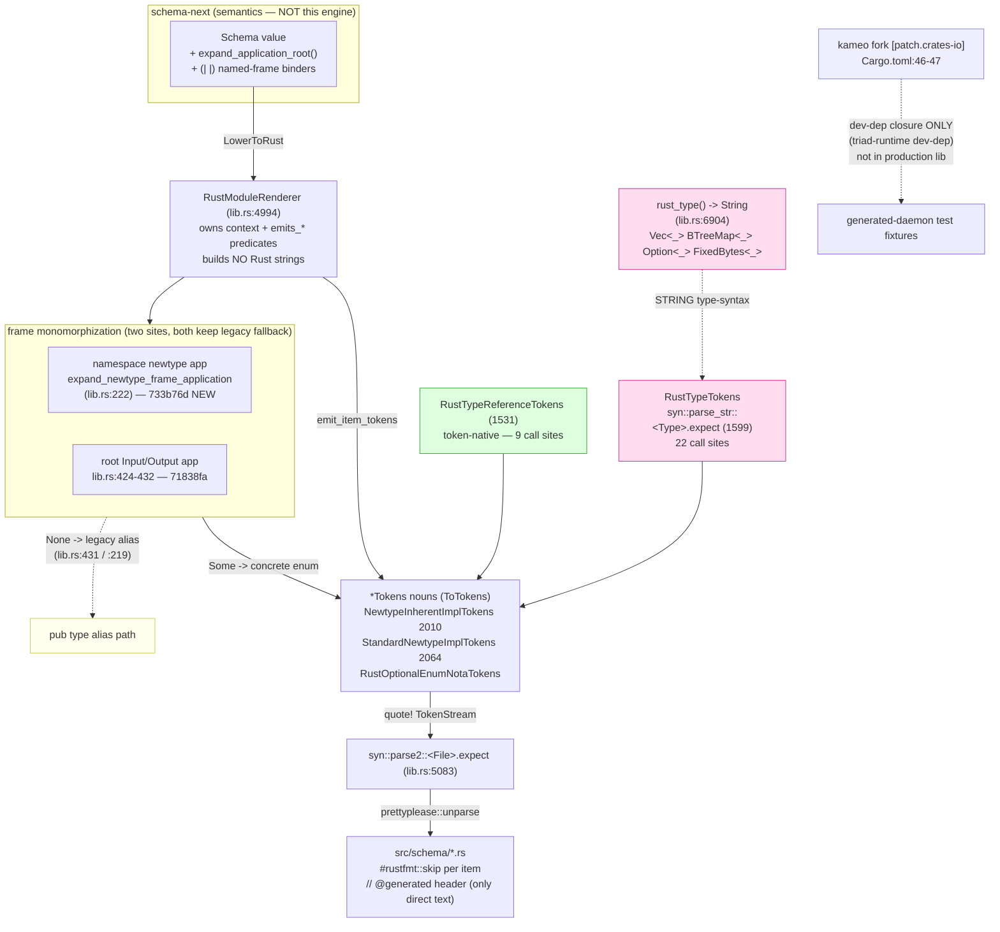

# 702/3 — schema-rust-next: deep engine analysis (Rust emission)

**HEAD audited:** `e116cc4` ("use Kameo lifecycle fork"), the only commit
since 690's `bb4dfe2`. **Test state:** `cargo test --offline` → **92
passed / 0 failed** across 10 binaries (observed this session). Builds on
report 690/2 (the change-audit); does not redo it.

**Deepest finding — the engine has not moved, and its one moving part is a
non-event.** Between 690 and 702 the emitter's *codegen logic is
byte-identical*: `git log bb4dfe2..e116cc4` is a single commit that adds a
`[patch.crates-io] kameo` override (`Cargo.toml:46-47`) and nothing else.
The "Kameo lifecycle fork on a codegen layer" anomaly is **resolved as a
test-closure artifact, not a real dependency**: `cargo tree -e no-dev -i
kameo` prints *"nothing to print"* — kameo never reaches the production
emitter library; it arrives only through the **dev-dependency**
`triad-runtime` (`Cargo.toml:39`, Cargo.lock:521-533 lists no kameo under
`schema-rust-next`; the only consumer is `triad-runtime [dev-dependencies]`,
Cargo.lock:750-764). The patch exists so the *generated-daemon fixtures the
tests compile* link the fork. So the genuine story of this engine is what
did **not** move: the migration claim, the panic surface, the string-syntax
seam, and the 663 gap are all exactly where 690 left them — and three of
those are real invariant risks the production path carries today.

## What this engine is

`schema-rust-next` lowers a semantic `schema_next::Schema` into Rust
*source* via Rust's macro substrate (`proc_macro2::TokenStream` + `quote!`
+ `ToTokens`), parsed once through `syn`/`prettyplease` into pretty-printed
`src/schema/*.rs`. It owns emission only; semantics live in `schema-next`.
The layering is intact: `expand_application_root` (the frame
monomorphizer) is **not defined in `src/`** — `grep -rn 'fn
expand_application_root' src/` returns nothing; it is called as a method on
`&Schema` (`lib.rs:238`, `lib.rs:429`), so it lives in `schema-next`.

## The Kameo anomaly, resolved

The prompt flagged `e116cc4` "use Kameo lifecycle fork" landing on the
*codegen* layer as suspect. It is benign, and the evidence is decisive:

| Probe | Result | Meaning |
|---|---|---|
| `cargo tree -e no-dev -i kameo` | "nothing to print" | kameo absent from the production lib |
| `cargo tree -i kameo` (with dev) | `kameo → triad-runtime [dev-dependencies] → schema-rust-next` | reaches only the test closure |
| Cargo.lock:521-533 (`schema-rust-next` deps) | no `kameo` | not a direct dep |
| `kameo`/`Kameo`/`Actor` in `src/` outside `quote!` | **0** | every reference is *emitted tokens*, not emitter code |

Every `triad_runtime::kameo::*` line in `src/daemon_emit.rs:424-427` sits
inside a `quote!` block (`DaemonImportsTokens::to_tokens`,
`daemon_emit.rs:416-431`) — the emitter *writes* those `use` lines into the
generated daemon, it does not *run* them. Likewise the 24
`triad_runtime::*` references in `lib.rs` (e.g. `lib.rs:2319, 2339, 2446`)
are inside `quote!`/string-literal type names. The fork exists because the
generated **daemon fixtures** the integration tests compile pull
`triad-runtime`, and triad-runtime needs the Kameo lifecycle fork for its
actor `EngineActor` lifecycle hooks. **The codegen engine itself links no
actor runtime.** This is the correct place for the patch (the dev-closure
that compiles fixtures), even if the commit message reads alarmingly.

## Invariant 1 — one schema → one semantics across lowering paths (AT RISK)

The engine's core promise is that a given `Schema` lowers to one canonical
Rust artifact. Two transitional seams put a crack in that:

**Seam A — the legacy fallback duplicates the lowering path.** Frame
expansion runs at two sites and *each keeps a legacy fallback*:
- namespace newtype applications: `expand_newtype_frame_application`
  returns `Some(concrete enum)` or falls through to
  `declaration.lower_to_rust` (the alias path), `lib.rs:216-219`;
- root Input/Output applications: `Some(expanded) =>` concrete enum, `None
  =>` `application.lower_to_rust(context)` (the legacy alias),
  `lib.rs:429-432`.

The comment is explicit that the alias path "stays until the expansion is
proven" (`lib.rs:414-416`). So the same applied-frame head can lower **two
different ways** depending on whether `schema-next`'s resolver finds the
head — a concrete `pub enum` (gaining constructors / `From` / accessors /
NOTA / wire) or a bare `pub type Input = Work<…>` alias (gaining none).
This is a genuine *one-schema-two-shapes* fork. It is correct as a
rollback, but it is a seam that will bite the day a head silently fails to
resolve and the consumer compiles against a thin alias missing the wire
surface. The deep-design move is to make an unresolvable applied root a
**typed error**, not a silent downgrade — which connects to Invariant 2.

**Seam B — the string-type-syntax layer.** `rust_type()` (`lib.rs:6904`)
is a method that builds Rust *type syntax* as a `String`: `Vec<{}>`
(6913), `std::collections::BTreeMap<{}, {}>` (6914), `Option<{}>` (6919),
`FixedBytes<{width}>` (6911), `{name}Scope` (6921), `{}<args>` (6930). That
string is re-parsed by `RustTypeTokens` via
`syn::parse_str::<syn::Type>(...).expect("generated Rust type token
parses")` (`lib.rs:1597-1602`). This is exactly the "Rust as ad-hoc
formatted strings" that INTENT.md:96-98 and Spirit `4np2`/`vez8` forbid for
the emitter — surviving as a *type-name* sub-layer beneath the
token-native body emission. **It grew since 690:** `RustTypeTokens::new`
(the string-reparse constructor) is now **22 call sites** in `lib.rs`,
versus only **9** for the token-native `RustTypeReferenceTokens::new`
(`lib.rs:1531`). The migration is declared complete (INTENT.md:106-121,
"there is no `self.line`/`format!`-built Rust source left"), and that holds
for declaration *bodies* — `RustWriter`/`self.line` references are **0**
(verified) — but the type-syntax string path is the residual the claim
elides, and the wrong path is winning the call-site count.

## Invariant 2 — malformed schema yields a typed error, not a generator crash (VIOLATED)

The emit boundary advertises a typed `SchemaError` (`lib.rs:6` import; the
public `RustEmitter` methods return `Result<_, SchemaError>`). But internal
shape misalignments **panic**, not error. Counts at HEAD (unchanged from
690):
- `lib.rs`: **9 `panic!`** — `3629, 3635, 3647, 3657, 3813` (scope/payload
  projection) and `6260, 6356, 6367, 6378` (nexus→action/SEMA projection),
  e.g. `panic!("nexus work cannot project to a generated nexus action")`
  (`lib.rs:6260`).
- `migration.rs`: 2 `unreachable!` (`163, 186`, position-discriminant
  guards — defensible internal invariants).

On top of these, **6 `.expect()` reparse panics** convert a malformed
generated fragment into a crash rather than a typed error: `lib.rs:1600,
2178, 4872, 5083`, `daemon_emit.rs:334`, `migration.rs:64`. Of these, the
three `parse2::<File>(tokens).expect` sites (lib.rs:5083, daemon_emit:333,
migration:63) reparse the *final quote!-built* stream and are defensible (a
quote! token stream is structurally valid by construction). But the
`parse_str::<Type/Expr/ItemUse>(string).expect` sites (`lib.rs:1599, 2177,
4871`, `daemon_emit.rs:210`) reparse **strings built by `rust_type()` /
`format!`** — so a schema-declared name containing a character invalid in
Rust syntax panics the generator with `expect("generated Rust type token
parses")` rather than surfacing a `SchemaError`. This is report 663's
slice-1 (shape-derived `Capability` resolution + typed `SchemaError` for
the generator panics), **still unlanded**: `Capability`,
`UnresolvedComposition`, `receiver_shape` all return **0** in `src/`.
ARCHITECTURE.md carries no notion of typed shape-error resolution either —
the design itself has not absorbed slice 1.

## Invariant 3 — checked-in generated artifacts are byte-fresh (HOLDS)

This is the engine's strongest invariant and it is enforced in the
production build path. `GeneratedArtifact::check_with` (`build.rs:619-631`)
does an exact byte match — `existing == self.content` (`build.rs:635`) — and
on mismatch returns the typed `BuildError::StaleGeneratedArtifact`
(`build.rs:627, 707`) carrying the update env-var. The contract-crate entry
point `ContractCrateBuild::expect_fresh` (`build.rs:429-431`) runs the
check and `.expect()`s — in a `build.rs` that is a build failure with a
clear message, which is the intended gate (not a hidden runtime panic). A
missing file is treated as stale (`build.rs:636`), and a present
`FAMILY_REGEN`-style env var flips to write mode (`build.rs:672-679`). The
freshness invariant therefore turns any schema edit into a visible
generated diff or a red build. **Soundness confirmed at the consumer
boundary**, not just in test: the downstream wire-contract crates carry
`// @generated by schema-rust-next` headers and the regenerated surface —
signal-criome (106 delegating-impl/payload markers), signal-router (141),
signal-mentci (83), meta-signal-mentci (22), signal-standard (4).

## Standard newtype impls — a separate mechanism from the `{| |}` catalog

The prompt asks whether schema-rust-next *consumes* the schema-next
impl-reference catalog (`{| |}`, merged to main as `da5643c`) or emits
newtype impls by a separate mechanism. **Separate, decisively:** `grep -rn
'ImplReference\|impl_reference\|ImplCatalog\|{|' src/` returns **0**. The
emitter derives impls from *local shape inference*, not a declared catalog:

- `NewtypeInherentImplTokens` (`lib.rs:2010-2057`) — Bucket 1 inherent
  surface (`new`, `payload`, `into_payload`, `From<Inner>`),
  **unconditional**, emitted at `lib.rs:5251`.
- `StandardNewtypeImplTokens` (`lib.rs:2064-2158`) — Bucket 2, gated on
  `scalar_like()` (`lib.rs:2088-2090`), which matches **only direct**
  `String`/`Path`/`Integer`/`Boolean` references (`lib.rs:2073-2086`).
  Returns early for non-scalar (`lib.rs:2095-2097`). String/Path →
  `Display` + `AsRef<str>` + `PartialEq<&str>`; Integer → `PartialEq<u64>`
  + `PartialOrd<u64>`; Boolean → `PartialEq<bool>`.

Two consequences for soundness. First, because the policy is shape
inference and not a catalog lookup, a **transitive scalar**
(`Statement(StatementText(String))`) is skipped — `scalar_like` sees a
`Plain` reference, not a `String`, so the inner-most String's guarantee is
lost (663 slice-2 sub-case, unlanded). Second, the impls are **WireContract
only**: all three `RustEmissionOptions` constructors set
`standard_newtype_impls: false` (`lib.rs:498, 514, 527`), and the **sole
production enabler** is `ContractCrateBuild::wire_contract_module`
(`build.rs:154-160`, `.with_standard_newtype_impls()`). The single test
enables it via `binary_only().with_standard_newtype_impls()`
(`tests/standard_newtype_impls.rs:9`). The option doc-comment still calls
it "a proposal surface for schema-implied capabilities" (`lib.rs:535-539`).

This is the **per-target ergonomics tension** made concrete: in
signal-criome (WireContract), `PrincipalName`/`PrincipalId`/`DaemonPath`
get the full `Display`+`AsRef<str>`+`PartialEq<&str>` surface
(signal-criome `src/schema/lib.rs:1269-1380`); in spirit's NexusRuntime
`src/schema/nexus.rs` the same shape of newtype gets **zero**
(`grep -c 'impl AsRef<str> for'` → 0). Ergonomics depend on *which target
emitted the type*, not on the type's intrinsic shape — which fights
ESSENCE's correctness/clarity priorities and report 663's recommendation #2
(flip to default-ON, remove the flag). The shipped subset is correct
*where it lands*; the drift is that it does not land uniformly.

## 663-design vs landed subset — still narrower (confirmed)

| 663 slice | Status at `e116cc4` | Evidence |
|---|---|---|
| Bucket 1 inherent (`new`/`payload`/`into`/`From`) | **landed** | `lib.rs:2010-2057`, emitted `lib.rs:5251` |
| Bucket 2 scalar impls | **landed, WireContract-only** | `lib.rs:2064-2158`, enabled `build.rs:159` |
| Slice 1 — `Capability` resolution + typed `SchemaError` for panics | **NOT landed** | 0 `Capability`/`receiver_shape`; 9 `panic!` in `lib.rs` |
| Slice 2 sub-case — transitive scalar | **NOT landed** | `scalar_like` matches direct leaves only (`lib.rs:2073-2086`) |
| Slice 3 — `Deref` `*deref` marker | **NOT landed** | 0 `Deref`/`*deref` in `src/` |
| Slice 4 — struct field / enum `is_`/`as_` accessors | **NOT landed** | no `FieldAccessor`/`VariantPredicate` noun; enum `route` is the only emitted accessor |

## Rust-discipline lens

The engine is largely discipline-clean and improved over the era 690
audited: `RustWriter`/`self.line` gone (0 refs), lowering is `ToTokens` on
named nouns, typed per-crate `BuildError` (`build.rs:690`) and `SchemaError`
at the public boundary. The new 733b76d methods (`lower_namespace_declaration`,
`expand_newtype_frame_application`, `lib.rs:211-244`) are methods on
`RustLoweringContext` (a data-bearing type holding `generator_name` +
`options`) — not free fns, not ZST-namespace. The two residual smells are
both string-codegen, not method-placement: (1) `rust_type()` is the
string-type-syntax layer (Invariant 1 seam B); (2) the `panic!`/`.expect`
surfaces violate the typed-error rule for malformed schemas (Invariant 2).

## Coherence with neighbours

Layering with `schema-next` holds (semantics not redefined here;
`expand_application_root` lives upstream). The freshness invariant ties the
whole codegen tier together — downstream contract crates are demonstrably
regenerated against this emitter. The one cross-engine tension is the
WireContract-only newtype-impl scope: a daemon-local newtype and a
wire-contract newtype of identical shape get different ergonomics, so a
consumer reading `criome` vs `signal-criome` source sees an asymmetry the
type shapes do not justify.

## Governing intent

Spirit `4np2` (VeryHigh — token-native emission, not string codegen),
`e6v5`/`de8i` (High — lowering as methods/`ToTokens`), `vez8` (Maximum —
string emitter replaced entirely), `0bw0`/`o7a3` (High — migration debt).
The body-emission migration honors these; the `rust_type()` string
type-syntax layer is the residual that `4np2`/`vez8` would still flag.
Standard-newtype work co-signs psyche+operator `d3r2` (Clarified) via
nota-designer report 663 — the landed subset is the conservative slice.

## Ranked findings

- **P1 (Invariant 2 / soundness):** malformed schema crashes the
  generator instead of returning `SchemaError` — 9 `panic!` + 4
  string-reparse `.expect` panics in the production emit path; 663 slice 1
  unlanded; `Capability` resolution absent. The string-reparse panics
  (`lib.rs:1599, 2177, 4871`) are reachable from `rust_type()` output.
- **P2 (Invariant 1 / tension):** the `rust_type()` → `syn::parse_str`
  string-type-syntax seam (`lib.rs:6904`, `1599`) contradicts the
  "migration complete" claim and has **grown** (22 string-reparse vs 9
  token-native call sites) — the wrong path is winning.
- **P2 (coherence / tension):** standard newtype impls are WireContract-only
  (`build.rs:159`; defaults `false` at `lib.rs:498/514/527`), so identical
  newtype shapes get different ergonomics by target — 663 recommendation #2
  (default-ON) unlanded; spirit nexus newtypes lack what signal-criome's get.
- **P3 (drift, benign):** `e116cc4` "Kameo lifecycle fork on a codegen
  layer" is a dev-closure `[patch.crates-io]`, not a production dependency
  (`cargo tree -e no-dev -i kameo` empty). No risk; the commit message is
  the only thing wrong.
- **P3 (Invariant 1 / transitional seam):** the legacy alias fallback for
  unresolvable applied frame heads (`lib.rs:431`, `:219`) is a one-schema
  -two-shapes fork that should become a typed error once expansion is proven.

## Top risk and highest-value move

**Top risk:** a schema whose shape the emitter's projection logic does not
expect crashes the generator (`panic!`/`.expect`) instead of producing a
typed `SchemaError` — the build fails opaquely, and a head that silently
fails to resolve downgrades to a thin alias missing the wire surface
(Invariant 1 seam A + Invariant 2). **Highest-value move:** land 663 slice
1 — convert the 9 `lib.rs` `panic!`s and the 4 `parse_str(...).expect`
reparse sites to `SchemaError` variants, *and* fold `rust_type()` into the
token-native `RustTypeReferenceTokens` so the string-type-syntax layer
(seam B) disappears with it. The two are the same wound: type names are
assembled as strings, re-parsed, and a malformed one panics. Removing the
string layer removes both the migration-claim asterisk and the largest
class of production panic in one cut.
