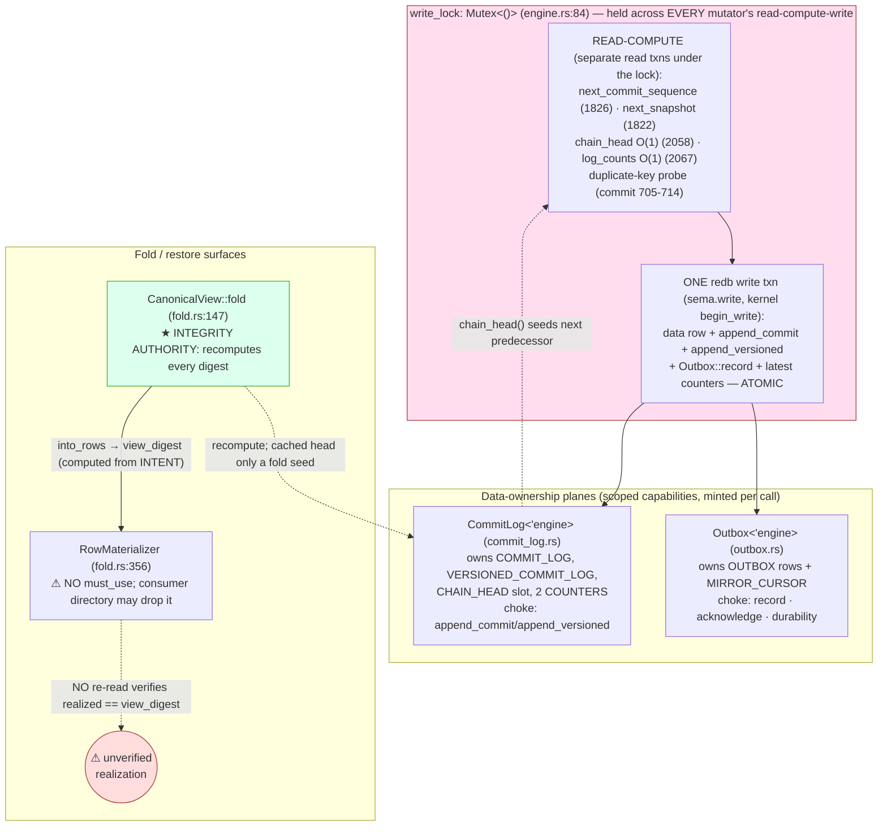

# 702 / 4 — sema-engine storage planes (deep engine analysis)

**Engine:** `sema-engine` — the library-only database engine over the
`sema` storage kernel (redb + rkyv + schema-guard) and the `signal-sema`
operation vocabulary. **HEAD audited:** `73eea24` (Cargo `version = 0.6.2`,
up from 690's `0.6.1`). Storage substrate for criome, router, spirit,
mirror, persona, mind (all `branch = "main"`).

This is the *deep* successor to 690/4 (the change-audit, which found the
single-writer lock, the closed `RecordKey` sum, the O(1) chain head, and
the plane decomposition all real and the suite green). 690 asked *"is each
change real?"*. 702 asks the harder questions: **where exactly is each
invariant enforced, and where does it break?** The deepest answer below
is not in any of those landed features — it is in the one step the engine
does **not** verify: the realization of a folded view back into the
materialized tables.

## The deepest finding, stated first

`sema-engine`'s whole correctness story rests on *"the versioned log is
the source of truth; the redb tables are a rebuildable materialized view
folded from the log"* (Spirit `iir4`, INTENT.md:11-13). The fold itself
is **airtight**: `CanonicalView::fold` (fold.rs:147-177) recomputes every
entry digest from the entry's own fields and rejects the chain link-by-link
(`VersionedChainBroken`, fold.rs:166-169), and the view is a deterministic
`BTreeMap<ViewKey, _>` (fold.rs:127, 105-111). The view *digest* is computed
from this intended view (engine.rs:1444). **But the engine never verifies
that the realized tables match the view it reported.** `rebuild_from_log`
(engine.rs:1446-1453) hands each `RowMaterializer` to a **consumer-supplied
`FamilyDirectory::materialize`** (fold.rs:348, a `pub` trait) and trusts it
to call `apply`/`apply_identified`. `RowMaterializer` carries **no
`#[must_use]`** (fold.rs:356), and `materialize` returns `Result<()>` — a
directory that drops the materializer (returns `Ok(())` without applying)
silently fails to write that row, yet `rebuild_from_log` returns a
`RebuildReceipt` whose `view_digest` describes a view that **was never
realized**. There is no post-rebuild re-read that recomputes a digest over
the actual tables and compares it to `view.digest()`. The fold is verified;
the *materialization is taken on trust*. For the engine whose founding
intent is "the fold is the definition of the view," the unverified gap is
precisely at the fold→view boundary.

## The engine at a glance

## Invariant 1 — single-writer atomicity. Holds; the lock is load-bearing for a real reason.

The crux 690 stated but did not fully ground: **why the engine needs its
own lock when redb is already single-writer.** The `sema` kernel wraps
`redb::Database` and its `write` calls `database.begin_write()` (sema
lib.rs:568-573); redb's `begin_write()` blocks until it holds redb's
exclusive write lock, so two write *transactions* can never overlap even
without the engine lock. **But the engine's read-compute happens in
*separate read transactions before* `begin_write()`** — `next_commit_sequence`
(engine.rs:1826), `next_snapshot` (1822), `chain_head` (2058), `log_counts`
(2067), and the duplicate-assert probe (engine.rs:705-714) all open their
own read txns. Without `write_lock`, two `&self` callers could each read
the *same* chain head and commit sequence, then serialize at redb's write
lock and **both** commit with the same predecessor digest / same sequence —
forking the chain or duplicating a sequence. `write_lock` (engine.rs:84),
acquired at the top of every mutator (`assert_identified:175`,
`retract_identified:239`, `mutate_identified:321`, `assert_keyed:410`,
`mutate_keyed:510`, `retract:592`, `commit:680`, `checkpoint:1306`,
`rebuild_from_log:1428`, `acknowledge_mirror:1604`) and held across the
whole read-compute-write, is exactly what closes that read-then-write race.
This is sound and correctly motivated. The lock guards the engine's own
path, is not an `Arc<Mutex>` shared across actors (engine.rs:74-83), and
poison propagation via `expect` (engine.rs:1816-1820) is correct (poison ⇒
a writer panicked mid-mutation ⇒ redb already rolled the txn back).

**Torn-read question — answered.** A reader (`match_records`, `StorageReader`)
opens a redb read transaction, which is an MVCC snapshot; redb's reader
never observes a half-applied write txn, and the engine's per-mutation
write is one `begin_write…commit` unit (engine.rs:813-836). So no reader
can observe a torn write. **Witness (artifact):** `tests/concurrency.rs:1-11`
header + the 8×16 `Arc<Engine>` writer test produce a log with strictly
increasing unique sequences and an intact chain (`cargo test --offline` at
`73eea24`: concurrency 2 passed — see "Build evidence"). This is a test
witness of the *property*; the *enforcement* is the lock at engine.rs:84.

## Invariant 2 — O(1) chain head is consistent with the log. Holds by construction; never the integrity source.

`chain_head()` is a single point-get on the fixed key `latest_entry_digest`
in the `CHAIN_HEAD` table (commit_log.rs:35-37, 138-142) — genuinely O(1),
no scan. `append_versioned` (commit_log.rs:183-191) advances the slot **in
the same write transaction** as the entry it describes (CHAIN_HEAD.insert
at :189, beside VERSIONED_COMMIT_LOG.insert at :188), so the slot can never
disagree with the last entry that transaction wrote. The two log counts get
identical treatment (commit_log.rs:149-160 reads, :172/:190 advances). The
slot is an optimization for minting the next predecessor only
(`latest_versioned_entry_digest`, engine.rs:2058-2060); **integrity is
recomputed link-by-link by the fold** (fold.rs:147-177), which ignores the
cached slot except as the optional `chain_head` seed parameter. This is the
correct shape: a cached derived value that the authority (the fold) never
trusts. **Witness:** `tests/concurrency.rs` header asserts the cached head
must equal a fresh fold recomputation; the 11-test `tamper.rs` suite
(`forged_log_row_breaks_the_digest_chain_at_its_successor`,
`rewritten_payload_fails_per_entry_digest_recomputation`, all passed)
proves the fold, not the slot, is the integrity gate.

## Invariant 3 — plane ownership is a clean split, not shared mutable state. Holds.

`CommitLog<'engine>` (commit_log.rs:51-58) and `Outbox<'engine>`
(outbox.rs:129-136) are scoped capabilities, each borrowing `&'engine
sema::Sema`, minted per call (`log_plane` engine.rs:1189, `outbox_plane`
engine.rs:1197). Neither holds mutable state of its own — both are
zero-field-plus-borrow structs whose state lives in named redb tables they
each exclusively own (CommitLog: the two logs + CHAIN_HEAD + COUNTERS;
Outbox: OUTBOX + MIRROR_CURSOR). They **never open a write transaction of
their own on the mutation path**: the append choke points
(`append_commit`/`append_versioned` commit_log.rs:166-191, `record`
outbox.rs:171-180) are associated functions taking a lent `&WriteTransaction`,
so the engine keeps atomicity (the bridge `insert_versioned_entry`
engine.rs:2077-2087 calls both against the *same* lent txn). There is no
shared mutable field across planes; the only "shared" thing is the borrowed
`&Sema`, immutably. Clean ownership. The decomposition is data-ownership,
not verb-shape (see Tension 2).

## Invariant 4 — RecordKey is a closed 2-arm sum with collision-safe digests. Holds; one storage subtlety.

`RecordKey` (record.rs:59-62) is a closed enum `Domain(String) /
Identifier(RecordIdentifier)`. The enum *is* the discrimination — `kind()`
(record.rs:77-82) maps arms, `identifier_value()` (record.rs:98-103) is
**infallible** (no decimal parse can fail), and the dead
`MaterializeIdentifierParse` of the old struct form is gone crate-wide.
Digest collision-safety: `update_digest` (record.rs:109-112) prefixes the
kind tag (Domain=1, Identifier=2, record.rs:33-38) before the canonical
string, so `Domain("42")` (tag 1) and `Identifier(42)` (tag 2) hash
**differently**. Backward-compat preserved: an `Identifier` hashes its
**decimal string** (record.rs:91, witnessed record.rs:238-244).

**Subtlety worth naming:** both arms collapse to the same redb key bytes
via `to_owned_string()` (record.rs:88-92) — `Domain("42")` and
`Identifier(42)` both store under key `"42"`. They cannot collide in
storage only because domain-keyed and identified families use **separate
tables**, and the materialize path enforces key-kind-vs-table-kind
(`RowMaterializer::apply` rejects an identifier key, fold.rs:385-392;
`apply_identified` rejects a domain key, fold.rs:422-429,
`MaterializeKeyKindMismatch`). The invariant *"a table only ever sees keys
of its kind"* is enforced on the materialize/import path but **not** on the
ordinary write path — a domain-keyed `assert` against an identified table,
or vice versa, is not structurally prevented at the `commit`/`assert_keyed`
choke points (those trust `EngineRecord::record_key`); only the rebuild
re-read would surface the mismatch. In practice the typed
`TableReference<T>` vs `IdentifiedTableReference<T>` API split makes this
hard to do by accident, but it is a "trusted by API shape, verified only on
fold" invariant, not a structurally-closed one.

## Invariant 5 — rebuild-from-log is deterministic in its INTENT, unverified in its REALIZATION. At risk.

The *intended* view is deterministic: `fold` is a pure function of
(checkpoint rows, entries, chain_head) (fold.rs:147-177), the view is a
`BTreeMap`/`BTreeSet` over a totally-ordered `ViewKey` (fold.rs:105-111,
127), and `into_rows` emits clears-then-inserts in key order (fold.rs:239-260,
292-295). Two rebuilds of the same log produce the same `view_digest`. The
import path additionally re-derives the store schema hash from the carried
inventory and rejects a doctored one (`CheckpointSchemaMismatch`,
engine.rs:1495-1501) — a real tamper gate, witnessed by tamper.rs
(`import_rejects_a_schema_hash_that_does_not_re_derive_from_the_inventory`,
passed).

**The realization is where determinism stops being guaranteed.** Both the
production `rebuild_from_log` (engine.rs:1446-1453) and `apply_import`
(engine.rs:1560-1564) write by handing each `RowMaterializer` to
`directory.materialize(...)` and trusting it. Nothing in the engine:
(a) marks `RowMaterializer` `#[must_use]` (fold.rs:356); (b) re-reads the
materialized tables after the write and recomputes a digest to compare
against `view.digest()`. The `RebuildReceipt`/`ImportReceipt` report
`view_digest` and a `row_count` (engine.rs:1454-1459, 1571-1578) computed
from the *intended* `MaterializeRows`, never from what the tables actually
hold. A directory bug (drops a materializer, applies the wrong table
reference such that `check_table` rejects but the caller swallows it, or
returns `Ok(())` early) yields a store whose tables diverge from the
authoritative log while the receipt claims a clean fold. The log stays the
source of truth (the next rebuild would correct it), but **a consumer that
reads the materialized view between a faulty rebuild and the next one reads
silently wrong data with a green receipt.** This is the single highest-value
gap (see Risk).

## Invariant 6 — open never mutates a store it rejects; layout 4→5 refold. Holds in code; the field witness is still missing.

`validated_storage_layout` (engine.rs:1694-1747) is read-only and returns a
`LayoutOpenPlan`; `apply_layout_plan` (engine.rs:1752-1767) executes it only
**after** every read-only validation passes (engine.rs:90-113). A layout-4
store that opted into versioning refolds its derived slots from the complete
log (`CommitLog::rebuild_derived_slots`, commit_log.rs:206-238, which
re-folds from genesis so the rebuilt head can never trust a stored digest);
a layout-4 store **without** a versioned log hard-fails `StorageLayoutMismatch`
(engine.rs:1717-1725) because its derived state is not log-recoverable
(Spirit `29pb`, state loss unacceptable). Forward skew (layout > 5) also
hard-fails (engine.rs:1702-1705) — correct refusal to downgrade.

**690's gap is still open.** There is still **no witness that live consumer
`.sema` files in the field are layout-5 or versioning-opted-in.** The
layout-rebuild tests (layout_rebuild.rs:134-146 etc.) simulate an old store
by deleting the slot in-test — a unit truth, not a field migration. Among
the six consumers, only **spirit** wires a migration crate
(`sema-engine-previous` pinned at `ebee6e4`, behind a `production-migration`
feature — spirit Cargo.toml:100-103); **criome, router, mirror, persona,
mind track `main` with no migration path** (their Cargo.toml lines confirm
a bare `branch = "main"` pin). On the next dependency refresh each inherits
the layout-5 hard-fail, and any pre-layout-5, non-versioned live `.sema`
will refuse to open with no automated recovery. This is a deploy-time risk,
not a code defect.

## Design tensions

| # | Tension | Where | Why it bites |
|---|---|---|---|
| T1 | **acknowledge_mirror uses two redb txns under one held lock** | engine.rs:1604-1609 → outbox.rs:217-218 | Holds the `write_lock`, then a read txn (`versioned_entry_at`) then `Outbox::acknowledge` opens its **own** `storage.write` (outbox.rs:217). Sound (the held lock excludes every other writer; the cursor advance is one idempotent row), but it is the **only** mutator that doesn't lend one transaction — off-pattern. 690 flagged it; still present. |
| T2 | **Engine is still an ~86-method facade; verb-shape duplication uncollapsed** | engine.rs commit ~197 lines (669-865); assert/mutate/retract keyed+identified 64-88 lines each | The decomposition pulled out *state ownership* (CommitLog/Outbox) but not *verb-shape duplication*: every mutator repeats the sequence/snapshot/chain-head/counts/lent-txn scaffold. Against the ESSENCE "special cases collapse into the normal case" aesthetic. Quality, not correctness. |
| T3 | **Key-kind invariant enforced only on the fold/import path, not on write** | record.rs:88-92 (shared key bytes) vs fold.rs:385-392/422-429 (enforced) | A table is trusted to receive only keys of its kind on the `commit`/`assert` path; the structural check (`MaterializeKeyKindMismatch`) fires only when a row is *re-materialized*. The typed API split makes misuse unlikely, but the invariant is "trusted on write, verified on fold," not closed. |
| T4 | **The realized view is never verified against the reported view_digest** | engine.rs:1446-1459, 1560-1578; fold.rs:356 (no must_use) | See Invariant 5 — the founding "fold is the definition of the view" intent has its weakest link exactly at fold→table realization. |

## Rust- and component-discipline lens

- **Free functions / ZST namespaces:** none. Scanned `src/`: every `fn` is a
  method/associated-fn on a data-bearing type or a trait impl; no `src/main.rs`,
  no `[[bin]]` (witnessed by `tests/dependency_boundary.rs`, 8 passed). The
  plane structs carry a real borrowed `&Sema` (commit_log.rs:51-53,
  outbox.rs:129-131) — not ZST namespaces. `LogCounts` (commit_log.rs:261-288)
  is genuine data with behavior. **Passes** `skills/rust/methods.md`.
- **Typed per-crate `Error`:** one `thiserror` enum (error.rs:7-187) with a
  `Carrier` smuggling pattern (error.rs:202-239) that preserves typed errors
  across the kernel's closure-scoped transaction boundary — a clean design,
  not a string-loss. **Passes.**
- **Typed domain values:** `CommitSequence`, `SnapshotIdentifier`,
  `RecordIdentifier`, `EntryDigest`, `SegmentDigest`, `StoreSchemaHash`,
  `ViewDigest`, `MirrorHead`, `Durability`, `LogCounts` — no primitive
  obsession at the boundaries. **Passes.**
- **Conversions via `impl From`:** `OutboxEntry::from` (outbox.rs:41),
  `MirrorHead::from` (outbox.rs:78), `CommitLogEntry::from` (used
  engine.rs:1552). **Passes.**
- **Identifiers as full English words:** `commit_sequence`, `versioned`,
  `predecessor`, `acknowledgement` — no shortenings. **Passes.**
- **Component discipline:** library-only, no daemon binary, no socket, no
  NOTA parser, no actor runtime — exactly INTENT.md's closing constraint;
  witnessed by `dependency_boundary.rs`. The `StorageReader` transitional
  read-only handoff (engine.rs:2114-2129) has **no write affordance** (the
  only escape for migrating component-local tables), witnessed by
  `storage_boundary.rs` (3 passed). **Passes.**

## Build evidence (artifact, not capability)

`cargo test --offline` at HEAD `73eea24` (== audit target), run once,
**observed**: **119 tests passed, 0 failed** across 16 test binaries plus 4
unit tests (per-binary: engine 22, tamper 11, subscriptions 9,
family_identity 11, operation_log 9, checkpoint 8, dependency_boundary 8,
outbox 6, seam_gap_falsification 6, import 5, signal_frame_seam 5, fold 4,
unit 4, concurrency 2, layout_rebuild 3, storage_boundary 3; doctests 0).
This is a real production-library build (prior `target/` present so deps
resolved offline), an **artifact** witness of the suite, not a claim about
the production daemon path (there is no daemon — consumers embed `Engine`).
The +3 over 690's 116 is added tamper/checkpoint witnesses plus the 0.6.2
dep refresh.

## Coherence and the cross-cutting note

`sema-engine` is the storage floor for criome, router, spirit, mirror,
persona, mind (Cargo.toml pins confirmed). The hardening — lock soundness,
closed `RecordKey`, O(1) head, plane split — strictly improves all of them.
The two open items that cross the boundary into consumer audits:
(1) **the layout-5 field-migration gap** is a deploy concern for every
consumer tracking `main`; the router/criome/mirror/spirit audits in this
session should confirm whether each consumer's live store is already
layout-5/versioned before the next refresh; (2) **the unverified-realization
gap** means each consumer's `FamilyDirectory` is a trusted component of the
storage TCB — those audits should confirm each consumer's directory actually
applies every row (or that this engine grows a post-rebuild verify).

## Ranked findings → next move

The single highest-value move: **close Invariant 5** — make
`RowMaterializer` `#[must_use]` *and* have `rebuild_from_log`/`apply_import`
re-read the materialized tables and recompute a digest, comparing it to
`view.digest()` before returning the receipt (the `ViewDigestMismatch`
error already exists, error.rs:114-118, but is not used on the rebuild
realization path). That converts "the fold is the definition of the view"
from an intent into a *verified* invariant — the one place the engine
currently takes its own founding promise on trust.
