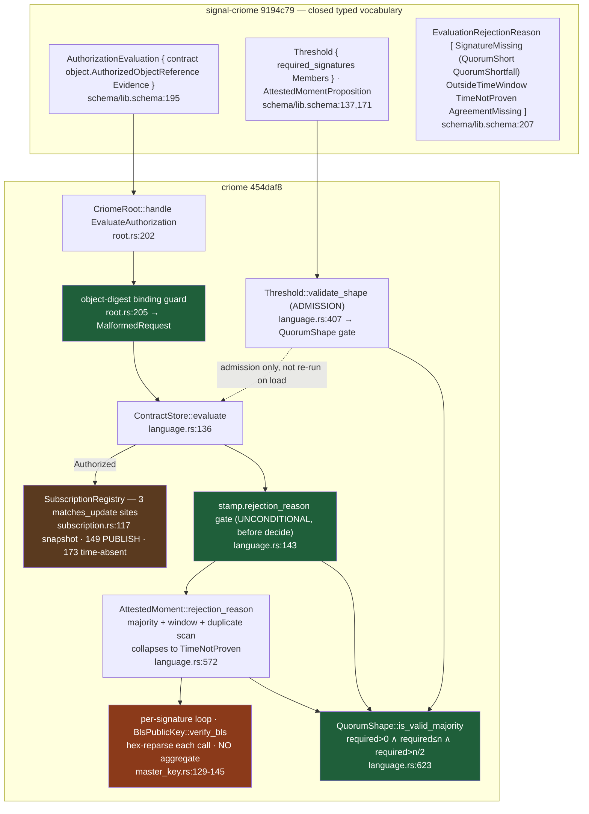

# 702 / 5 — criome + signal-criome: deep engine analysis

**Engine:** the auth / agreement engine — "Criome verifies; Persona
decides" (`INTENT.md:60-65`). A per-Unix-user Kameo daemon holding a
master BLS key, an identity registry, a content-addressed policy-contract
DAG, an attested-moment time substrate, and a reference-only
authorized-object pulse.

**Audited HEADs:** criome `454daf8` (= `main`, = checkout, confirmed by
`git rev-parse main`), signal-criome `9194c79` (= `main`). Plus the live
branch `origin/criome-gated-propagation-loop` `6c75804`, which is **exactly
one commit ahead of main** (merge-base = `454daf8`) and builds cleanly on
it. There is **no** `criome-gated-propagation-loop` branch on the
signal-criome remote — the m0p2 retirement is criome-internal and needs no
wire change.

## The deepest finding, stated up front

The two load-bearing crypto woes 690 left open have **split**: one closed,
one still open. **Woe 3 (majority quorum) is now genuinely enforced on the
production path** — `22801af` introduced a `QuorumShape::is_valid_majority`
gate computing `required > authorities/2` at *both* guard sites, and it
runs at the top of `ContractStore::evaluate` before any rule decides
(`language.rs:143`), over durably-rebuilt contracts and keys
(`root.rs:373-411`). **Woe 5 (BLS `FastAggregateVerify`) is still open** —
the verifier is still a per-signature pairing loop and the public key is
re-parsed from hex on every call.

But the structurally interesting finding is **m0p2 coherence**, and the
answer is sharper than 690's "VIOLATED": criome on `main` holds *three*
`interest.matches_update` call sites; the live branch `6c75804` retires
**exactly one** of them — the publish-side subscriber-count match — and
leaves the other two standing. So the branch does not make the router the
*sole* matcher; it removes the one match that looked most like delivery
fan-out and leaves a **snapshot-read interest filter** and an
**internal time-pulse `absent` matcher** in criome. Whether those two
remaining matchers are "observation/audit only" (m0p2-compliant) or
"operational matching" (m0p2-violating) is a genuine intent question the
psyche must settle, not a code defect — and it is the top open decision for
this engine.

## What moved since 690 (extend, don't redo)

690 audited criome at `068f9db` and reported Woe 3 (majority) as "REAL,
unaddressed, untested" and the m0p2 drift as "VIOLATED — criome still
matches." Both statements were true at `068f9db`. Five commits have landed
on `main` since:

| Commit | What | Real on production path? | Evidence |
|---|---|---|---|
| `22801af` enforce majority quorums | `k > n/2` at both guards + `QuorumShape` + 2 real majority tests | **Yes** — gates `evaluate` at `language.rs:143` | `language.rs:414,577,623-626`; `tests/language.rs:347,444` |
| `068f9db`→`475075f` strict-contract port | port to strict signal-criome contract | Yes | (690 confirmed) |
| `3c05122`→ (in main) persist + stamp | durable contracts, stamped quorum sigs | Yes (690 confirmed artifact) | `store.rs:442-450` |
| `0cf326c`/`475075f` authorized-object refs | refs not payloads + object-digest binding guard | Yes | `root.rs:205-220` |
| `454daf8` use Kameo lifecycle fork | runtime dep bump | n/a | log only |

The one truly new safety guard since 690 beyond majority is the
**object-digest binding** in `475075f`: `EvaluateAuthorization` now rejects
`MalformedRequest` when `evaluation.object.digest !=
evidence.operation.object_digest()` (`root.rs:205-209`), so the published
reference *cannot* claim a different object than the one the evidence
actually authorized. The matching wire change is signal-criome `9194c79`
adding `object.AuthorizedObjectReference` to `AuthorizationEvaluation`
(`schema/lib.schema:195-199`) and an `AuthorizedObjectKind::Head`
(`schema/lib.schema:215`) for the spirit→criome head-authorization chain
(d6he/nfvm). Both are tested at the *daemon* level
(`tests/daemon_skeleton.rs:617-637`).

## The engine on main, and where the branch cuts



The branch `6c75804` deletes **only** the `subscription.rs:149` arm (the
PUBLISH-side count) and turns `AuthorizedObjectPublication` into a unit
struct; the snapshot filter (`:117`) and the time-pulse `absent` matcher
(`:173`) survive. Verified by grep: main has `matches_update` at
`subscription.rs:117,149,173`; the branch has it at `:115,166` only (plus
the trait/impl), with **zero orphan `subscriber_count` callers** — a clean,
buildable cut.

## Invariants — what criome guarantees and where it is enforced

### I1 · Majority quorum `k > n/2` — **Holds** (the headline fix)

Both the runtime attested-moment guard and the admission policy-threshold
guard route through one helper:

```rust
// language.rs:623-626
fn is_valid_majority(&self) -> bool {
    let required = usize::from(self.required);
    required != 0 && required <= self.authorities && required > self.authorities / 2
}
```

Integer-division majority is correct at the tie boundary: `n=4 → n/2=2 →
required>2 → required≥3`; a 2-of-4 (a tie under partition) is rejected.
`n=5 → required≥3`. Call sites:

- **Runtime** (`AttestedMoment::rejection_reason`, `language.rs:577`) —
  this is the partition-fork-relevant path: it validates the *timekeeper*
  quorum that mints the moment. It gates `evaluate` unconditionally at
  `language.rs:143` before `decide`, and *also* gates every agreement-fact
  stamp at `language.rs:550` (`fact.signature.stamp.rejection_reason(...)`).
- **Admission** (`Threshold::validate_shape`, `language.rs:414`) — a
  sub-majority policy threshold is rejected at `store.admit`
  (`language.rs:116-117`) with `ThresholdUnsatisfiable`, so it never becomes
  content-addressable.

**Tests are real and exercise the property** (690 said none existed):
`submajority_time_authority_rejects_attested_moment`
(`tests/language.rs:347`) builds a 2-of-5 timekeeper quorum and asserts
`store.evaluate(...) == Rejected(TimeNotProven)`;
`admission_rejects_submajority_thresholds_before_evaluation`
(`tests/language.rs:444`) asserts a 2-of-5 policy threshold rejects at
admission. Neither names "partition," but a 2-of-5 quorum is *exactly* the
quantity two partitions could each independently satisfy — the test
encodes the fork-safety property even without the word.

**Where it could still break:** see I2 (rebuild trust) and Tension T1
(diagnostic collapse).

### I2 · Admission validation is the sole majority gate for stored policy thresholds — **AtRisk**

The runtime majority guard protects the *timekeeper* quorum on every
evaluation. But the *policy-Threshold* majority is checked **only at
admission** (`validate_shape`, `language.rs:414`), and
`ContractStore::from_contracts` (`language.rs:99-106`) — the rebuild path
that production uses on every `EvaluateAuthorization` (`root.rs:373-382`) —
trusts the stored rows verbatim: it neither re-runs `validate_against` nor
re-derives the content digest to check it matches the stored contract. A
contract is content-addressed (`store_contract` keys by
`contract.digest()`, `store.rs:444-448`), and SEMA writes happen only via
`store_contract → admit`, so in the closed system a sub-majority policy
threshold cannot reach the table. But the invariant "*every evaluated
policy threshold is a valid majority*" is enforced by *admission integrity
plus storage integrity*, not by the evaluation path itself. The runtime
`Threshold::decide` (`language.rs:387`) only checks `satisfied >= required`
— it would honour a sub-majority `required` if one were ever present. This
is a transitional seam: the moment SEMA gains another writer, or a contract
is migrated/restored from an external source, the policy-threshold majority
guarantee evaporates with no second line of defence.

### I3 · Attested-moment time is crystallized-past, a-priori window (ay3y) — **Holds**

The closure instant is `proposition.window.closes_at`
(`AttestedMoment::closes_at`, `language.rs:568-570`), which is folded into
the signed preimage via `AttestedMomentStatement` (`language.rs:582`)
*before* any signature — fixed a-priori, not measured at the k-th
signature. This realizes ay3y's *window-expiry* branch (the record says
"closes at the last signature **or** at window expiry"); the
last-signature branch is unimplemented, which 690/684 already concluded is
a value-prop reframe, not a defect. The load-bearing property — a
non-forgeable monotonic lower bound on "now" — holds, because real time is
always past a window that has provably closed. `AttestedMoment` is the
self-grounding base case (carries `TimeSignature` not
`StampedSignatureEnvelope`, `schema/lib.schema:177-185`), which stops the
regress ay3y describes.

### I4 · Object-digest binding — published reference == authorized object — **Holds**

`root.rs:205-209` rejects `MalformedRequest` when the request's claimed
object digest differs from the digest the evidence actually signs
(`evidence.operation.object_digest()`). Tested at the daemon level
(`tests/daemon_skeleton.rs:617-637`). This is new since 690 and closes a
real gap: before it, the pulse could announce a reference unrelated to the
signed operation.

### I5 · EscalateToPsyche is a closed typed outcome, inert by design (gc0n) — **Holds**

`Rule::EscalateToPsyche => Ok(EvaluationDecision::EscalateToPsyche)`
(`language.rs:318`). gc0n (verbatim, confirmed live) states the outcome is
"intentionally an inert dead-letter and not a defect" until the
psyche-facing UI exists. It is a typed verdict over an
already-submitted object, never a carrier for newly-authored content —
consistent with gc0n's "vote-on-existing-object" discipline. Correct.

### I6 · Single master BLS key, 0600 custody (psc6); q1le is the target — **Holds (single-key today)**

INTENT.md:58-67 and ARCHITECTURE.md:584-606 both state single-key-today.
q1le (verbatim: "extends psc6 from a single generated master BLS key to a
managed multi-key store") is the target, not built. Not re-verified line-by-
line here (690 confirmed the atomic `0600 create_new` + symlink/mode reject
at `master_key.rs`); no regression in the diff range.

### I7 · Daemon takes one rkyv config, never parses NOTA (component discipline) — **Holds**

`CriomeDaemonConfigurationFile::configuration` reads bytes and calls
`CriomeDaemonConfiguration::from_rkyv_bytes` (`daemon.rs:120-125`) — rkyv
only. Witnessed by `criome_daemon_configuration_accepts_binary_file_argument`
and `criome_daemon_configuration_rejects_nota_arguments`
(`tests/daemon_skeleton.rs`). CLI takes one NOTA request, flag-shape
rejected (`criome_cli_request_argument_rejects_flag_shape`). Typed per-crate
`Error` (`src/error.rs:6`, thiserror) in both repos
(signal-criome `src/lib.rs:506-522`).

## Findings (ranked)

### P1 · m0p2 coherence — criome retains two operational-looking matchers; the branch retires only one (DRIFT / TENSION)

This is the load-bearing coherence question of the session. m0p2 (verbatim,
confirmed live): "the router, as the **sole operational matcher** for all
non-direct message passing, matches component subscriptions and fans the
reference out… Criome keeps **no operational delivery registry**; any
criome-local subscription surface is **observation and audit only**." l2ha
(verbatim): "Fork A is resolved: object-update fan-out is owned by
subscribing components and the router, not by criome computing per-object
impact."

On `main` (`454daf8`) criome calls `interest.matches_update` at three sites:

| Site | Code | Role | After branch `6c75804`? |
|---|---|---|---|
| `subscription.rs:149` | `publish_authorized_object_update` filters subscribers by interest to count them | The match that most resembles delivery fan-out | **Retired** |
| `subscription.rs:117` | `open_authorized_object_subscription` filters the returned snapshot by the subscriber's interest | Read-time projection on observe | **Survives** (`:115`) |
| `subscription.rs:173` | `run_due_contract_checks` uses `check.absent.matches_update` to ask "did the awaited event happen?" | Internal contract-programmed time logic | **Survives** (`:166`) |

So `6c75804` ("retire publish-side authorized-object match") does **exactly
what its title says and no more**: it deletes the subscriber-count match
and makes `AuthorizedObjectPublication` a unit struct. It does **not** make
the router the *sole* matcher. The remaining two are defensible as
m0p2-compliant — the snapshot filter is arguably "observation," the
time-pulse `absent` matcher is internal contract evaluation, not delivery —
but m0p2's words are absolute ("sole operational matcher," "no operational
delivery registry"), and the snapshot filter *is* criome computing
per-subscriber affected sets at observe time. The daemon-level test
`tests/daemon_skeleton.rs:597-615` exercises exactly this: a subscriber
opens with `interest = Component(Spirit)` and criome returns a snapshot
filtered to matching updates — criome matching by interest, on the
production actor path.

**Why P1, not a defect:** criome delivers nothing (the publish path only
pushed to a local `Vec`, never to a socket — confirmed unchanged), so there
is no *delivery* drift. But the m0p2 *role* assignment is contradicted by
code and by ARCHITECTURE.md:110-116, which still says
`SubscriptionRegistry` "filters snapshots **and publications** by that
declared interest." The decision the psyche must make: is criome's
observe-time snapshot filter "audit/observation" (keep it) or "operational
matching" (lift it to the router too)? Until that is settled, the branch is
a *partial* m0p2 realization that will read as "done" but isn't. **This is
the single most valuable thing to clarify for this engine.**

Evidence: `subscription.rs:117,149,173` (main); `6c75804` diff;
`ARCHITECTURE.md:110-116`; `tests/daemon_skeleton.rs:597-615`.

### P2 · BLS verification is still a per-signature pairing loop, hex-reparsed each call — no FastAggregateVerify (684 Woe 5, SOUNDNESS/RISK)

The quorum verifier (`AttestedMoment::rejection_reason`,
`language.rs:587-600`) calls single-signature `verify_bls` once per
signature over the *identical* `statement`. The trait has only
`verify_bls(&self, signature, message) -> bool` (`master_key.rs:125-126`),
and the impl re-parses the public key and signature **from hex strings on
every call** (`BlsPublicKey::verify_bls`, `master_key.rs:129-145`:
`Hexadecimal::from_str(self.as_str())` then `PublicKey::from_bytes`). There
is no `aggregate`/`FastAggregate`/`agg_verify` path anywhere in the crate
(grep: NONE). For a k-of-n quorum, the daemon pays k full pairings **plus k
hex-decodes plus k point-deserializations** instead of one aggregated
pairing over one aggregated key. Because all k signatures bind the same
preimage, `blst`'s `aggregate_verify` / fast-aggregate shape is directly
applicable. p3td ("everything is a quorum… each principal runs more than
one node and asks its own quorum") makes this the *common* path, not an edge
case — the self-quorum-for-reliability default means every meaningful
operation pays the loop. Still open exactly as 684/690 predicted; the
latency claim for the direct criome-to-criome agreement lane (lt44)
degrades with quorum size.

Evidence: `language.rs:587-600`; `master_key.rs:125-145`; grep for
aggregate = NONE.

### P2 · Free functions `rejection` and `actor_reply` violate the method-only rule (RUST DISCIPLINE)

`src/actors/mod.rs:26` `pub fn rejection(reason) -> CriomeReply` and
`:30` `pub fn actor_reply(reply) -> CriomeActorReply` are free functions
outside `#[cfg(test)]`/`main`, used throughout the production actors
(`root.rs`, `subscription.rs`, etc.). The workspace rule (AGENTS.md hard
override) is that every fn is a method/assoc-fn on a data-bearing type or a
trait impl. `actor_reply` is a gratuitous alias for `CriomeActorReply::new`
(`mod.rs:17`) — delete it, call the constructor. `rejection` should be
`CriomeReply::rejection(reason)` (assoc fn on the wire type, owned by
signal-criome) or `impl From<RejectionReason> for CriomeReply`. Small, but
it is exactly the disguised-namespace pattern the rule names, and it is in
the hot reply path of every handler.

Evidence: `src/actors/mod.rs:26,30`.

### P3 · Sub-majority and timekeeper-shortfall collapse to `TimeNotProven`, discarding the typed `QuorumShortfall` counts (TENSION / diagnostics)

The wire vocabulary carries a rich rejection reason
`(QuorumShort QuorumShortfall { required satisfied })`
(`schema/lib.schema:207-213,235-238`), and the *policy-Threshold* path
constructs it with real counts (`language.rs:390,693`). But the
*attested-moment* path — the one that rejects sub-majority timekeeper
quorums and partition forks — collapses **every** failure (bad window,
sub-majority, duplicate authority, signature shortfall) into the single
opaque `TimeNotProven` (`language.rs:580,584,604`). An operator debugging a
partition cannot tell "the timekeeper quorum was sub-majority" from "a
signature didn't verify" from "the window was inverted." Since p3td makes
self-quorum-credible-time the universal substrate, this is the path most
worth instrumenting. The typed vocabulary to do it well already exists
(`QuorumShortfall`); the moment guard just doesn't use it.

Evidence: `language.rs:580,584,604` vs `schema/lib.schema:209,235`.

### P3 · ContractStore rebuild does not re-validate or re-check digest (see I2) (RISK / transitional seam)

`from_contracts` (`language.rs:99-106`) trusts stored rows; the
content-address is never re-derived on load. Acceptable today (closed
system, single writer), but the policy-threshold majority guarantee rests
on admission + storage integrity rather than on the evaluation path. A
cheap defence: have `from_contracts` (or the SEMA load) assert
`contract.digest() == stored_key` per row, turning a content-address into a
checked invariant rather than a trusted one. Flagging as a seam, not a
present defect.

Evidence: `language.rs:99-106`; `root.rs:373-382`; `store.rs:444-448`.

## Cross-engine seams

- **To router (m0p2/l2ha):** criome emits `AuthorizedObjectUpdate`
  references; the router must be the matcher. The `6-router.md` lane should
  confirm whether the router now owns an attendance/interest table and
  whether `signal-standard e3ff47b`'s "interest matcher" is the *same*
  matcher criome should shed — if both criome and router match by interest,
  the m0p2 "sole" word is violated at the system level even if each side is
  individually defensible. This is the join to verify.
- **To spirit (d6he/nfvm):** `AuthorizedObjectKind::Head`
  (`schema/lib.schema:215`) + the daemon head-authorization test
  (`tests/daemon_skeleton.rs:560-615`) are the spirit→criome head-auth
  surface. The `criome-spirit-log-object-auth` branch (present on both
  repos: signal-criome `374d833`/`39e05cf`/`905aa8b`) adds a spirit-log
  object-auth purpose — the `7-spirit.md` / propagation-loop lanes own
  whether criome-holds-the-head is real end-to-end.
- **signal-standard shared types:** criome's BLS quorum types remain
  criome-local (intent: lift only when a second component proves the
  shape). No change.

## Bottom line

criome closed the majority hole that defined 690's criome verdict — the
fix is real, on the production path, and tested with the right adversarial
shape. The remaining open items are (1) the m0p2 *role* clarification: the
gated-propagation branch is a partial, not complete, retirement of criome's
matcher, and the psyche must decide whether the surviving snapshot/time
matchers count as "observation" or must also move to the router; and (2)
BLS aggregate verification, unchanged since 684 and now on the *common*
path because of self-quorum-credible-time. The single highest-value next
move is the m0p2 clarification, because it gates whether `6c75804` is
"merge it" or "it's only a third of the retirement."
