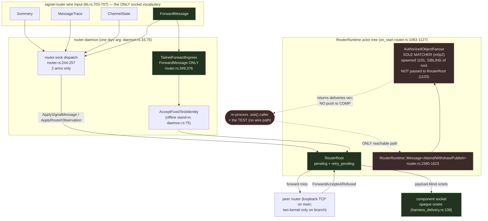

# 702 · Deep engine analysis — router + signal-router + signal-standard

**HEADs audited:** router `fb403c4` (*use Kameo lifecycle fork*),
signal-router `3e4bb07`, signal-standard `e3ff47b` (*add authorized head
object kind*). Branches inspected read-only:
`criome-gated-propagation-loop` (router `9471219`) and
`transport-two-kernel-e2e-138` (router head `453bc28`, on top of
`b536487`). This extends report 690 file 6 (HEAD `430f1de`); it does not
redo the change-audit.

## The deepest finding, stated once

690 found the fan-out matcher *missing* on main; it now exists and is
**sound in its logic but unreachable as a service**. The
`AuthorizedObjectFanout` actor — the literal m0p2 "router is the sole
operational matcher" mechanism — is spawned in the *production* runtime
(`router.rs:1101`, inside the non-test `RouterRuntime::on_start`), and its
four-rung interest match is correct (`signal-standard/src/lib.rs:70`).
But **no socket frame can address it.** The `signal-router` wire `Input`
enum has exactly four variants — `Summary`, `MessageTrace`,
`ChannelState`, `ForwardMessage` (`signal-router/src/schema/lib.rs:703-707`)
— with **no `Attend`/`Withdraw`/`Publish`**, and the working-socket
dispatch has exactly two arms (`router.rs:244-257`), neither reaching the
fanout. Every test drives it through an in-process kameo `.ask()`
(`tests/authorized_object_fanout.rs:19,38`), and `publish` *records and
returns* a `deliveries` vector to that in-process caller
(`authorized_object.rs:122-138`) — it **never pushes to a subscriber's
component socket**. So on main the matcher is a green in-process library,
not an operational router service: this is exactly the E4 gap report 701
named, now confirmed for the fanout path. The two genuine networked
surfaces are *both elsewhere*: point-to-point forwarding is real but
loopback-only on main (cross-host lives only on branch
`transport-two-kernel-e2e-138`), and the criome→standard projection that
feeds the matcher a real authorized head is a **dev-dependency-only**
test fixture on main (`Cargo.toml:58-59`), promoted to production source
only on `criome-gated-propagation-loop`.

## Two surfaces, drawn apart (because they are wired apart)

Green = the operational point-to-point forward path. Red = the matcher
that exists, is correct, and has no wire on-ramp and no socket off-ramp.
The dashed edge into `HANDLERS` has no solid counterpart: nothing on the
socket side feeds it.

## What is genuinely real on main

| Capability | Status on main | Evidence (file:line) |
|---|---|---|
| Fan-out matcher *logic* (4-rung interest lattice) | **Real, correct** | `signal-standard/src/lib.rs:70-79`; lattice `AnyAuthorizedObject/Component/ObjectKind/ComponentObject` at `signal-standard/src/schema/lib.rs:84-89`; `AuthorizedObjectKind::Head` at `:62` |
| Fanout actor in *production* runtime | **Real (spawned, not test-only)** | `router.rs:1101-1102` inside non-test `on_start`; `RouterRuntime::start()` is `pub async fn` (`router.rs:1034`), used by daemon (`router.rs:208`) and test alike |
| Attend snapshot replays matching prior updates | **Real (in-process)** | `authorized_object.rs:92-98` filters `updates` by interest on attend |
| Point-to-point forward, persist-before-deliver, verified origin | **Real (loopback)** | `apply_forwarded` stamps verified peer identity not wire field (`router.rs:2340-2342`), persists before retry (`:2350-2361`); loop guard `ForwardMarker` (`:2419`) |
| Payload-blindness (`e551f10`) | **Real** | `deliver_to_component_socket` writes raw octets (`harness_delivery.rs:138-141`); validates only declared-vs-actual size (`:148-157`), never decodes the contract |
| Daemon takes one rkyv arg, rejects NOTA config | **Real** | config decode is rkyv-only `from_rkyv_bytes` (`config.rs:68-77`); no NOTA parse in the daemon config path |
| Forward attestation verification | **Stand-in only** | production verifier is `AcceptFixedTestIdentity` (`daemon.rs:75`); real criome client is named milestone-3, unbuilt (`daemon.rs:69`) |

## What is surface, not soundness, on main

- **The matcher has no wire on-ramp.** `signal-router` `Input` carries no
  `Attend`/`Withdraw`/`Publish` (`signal-router/src/schema/lib.rs:703-707`);
  the only socket dispatch arms are `SignalMessage` and `RouterObservation`
  (`router.rs:244-257`). The `RouterRuntime::Message<Attend...>` handlers
  (`router.rs:1580-1623`) are reachable only by an in-process `.ask()`.
- **The matcher has no socket off-ramp.** `AuthorizedObjectFanout::publish`
  returns its `deliveries` to the caller (`authorized_object.rs:122-138`)
  and is *not* handed the `HarnessDelivery` ref — it cannot connect to a
  subscriber's component socket. The fanout is also a **sibling** of
  `RouterRoot`, not wired into it (`router.rs:1103-1111` omits it from the
  `RouterRoot::new` args), so the route/forward path cannot trigger it.
- **The criome→standard projection is test-only on main.** The
  `From<signal_criome::AuthorizedObjectReference>` conversion that yields a
  real authorized head lives inside the test file
  (`tests/authorized_object_fanout.rs:174-242`), and `signal-criome` is a
  **dev-dependency** (`Cargo.toml:58-59`) — the production daemon does not
  even link it. Branch `criome-gated-propagation-loop` (`9471219`) promotes
  this to `src/authorized_object_projection.rs` and a real dependency, but
  even there adds **no socket arm** — the gap above persists on the branch.
- **Cross-host transport is branch-only.** Main's sole forward witness is
  "two in-process routers forward over loopback TCP"
  (`ARCHITECTURE.md:753`); the `two_process_transport_artifacts.rs` probe
  still binds `127.0.0.1` (`tests/...:90,371` on the branch). The genuine
  cross-host artifact — two NixOS guests on pinned VM IPs over a real
  virtual L2, forward accepted with a non-zero minted slot and delivered to
  a harness witness — exists only on `transport-two-kernel-e2e-138`
  (`nix/tests/two-kernel-transport.nix:100-230`, `flake.nix:332`), and that
  branch diverged *before* the fanout work and deletes
  `authorized_object_fanout.rs`. **No single ref carries both the matcher
  and cross-host transport.**

## Invariant integrity

| Invariant | Holds? | Evidence | Risk if violated |
|---|---|---|---|
| Router is the sole operational matcher (m0p2) | **At risk** | matcher logic correct (`signal-standard/src/lib.rs:70`) and actor in production (`router.rs:1101`), but no wire reaches it (`signal-router/src/schema/lib.rs:703-707`; `router.rs:244-257`) | the m0p2 invariant is asserted by tests, not by the daemon; no external component can subscribe or be fanned out to |
| Router is payload-blind on routed objects | **Holds** | raw octets written, only size validated (`harness_delivery.rs:138-157`) | a decode leak would couple the router to every contract |
| Forward stamps verified origin, never the wire field | **Holds** | `apply_forwarded` uses `verified_origin` (`router.rs:2340-2342`) | spoofable origin / auth bypass |
| Forwarded messages are never re-resolved (loop guard) | **Holds** | `ForwardMarker` Origin/Forwarded (`router.rs:2419`); `may_resolve_remote` gates to Origin (690 confirmed `router.rs:2055`) | forward storms / routing loops |
| Daemon accepts only binary rkyv startup | **Holds** | `from_rkyv_bytes` only (`config.rs:73`); CLI bin is the client (`bin/router.rs`), daemon is `main.rs`→`RouterProcessDaemon` (`daemon.rs:33`) | daemon parsing NOTA violates the one-arg/no-flags rule |
| Forward authenticity is cryptographically verified | **Violated (by design, deferred)** | production verifier is `AcceptFixedTestIdentity` (`daemon.rs:75`) | any peer holding the fixed identity is admitted; real attestation is milestone-3 prose |
| Replay/freshness survives restart | **At risk** | window is actor-owned process-local (INTENT.md:134-135; 690 `router.rs:1472`) | a daemon restart forgets seen nonces; durable SEMA replay deferred |

## Design tensions

**The matcher landed in code but not in the architecture.** ARCHITECTURE.md
on `fb403c4` describes router-side subscriptions as a *future* surface
(`ARCHITECTURE.md:139,288,585,664-669`) and contains zero references to
"fanout", "Attend", "AuthorizedObject", or "matcher". The fan-out work
(`ce578f1`, `4ce85c1`) shipped without updating the doc, so the document
under-claims what the code carries — the reverse of 690's drift, and a
sign the matcher arrived as a fast green prototype, not a documented
service. The per-repo `INTENT.md` likewise still frames router subscription
output as "emits subscription deltas" (`router/INTENT.md:6`) without naming
the authorized-object fanout. This coherence gap is the natural fault line:
whoever wires the wire variant will have to author both the contract and
the architecture together.

**The fanout is structurally orphaned from the route path.** Because the
fanout is a sibling actor not passed into `RouterRoot` (`router.rs:1103`),
even an internally-triggered publish (e.g. on accepting a forwarded
authorized-head reference) cannot reach it without a new edge. The current
shape can *only* be driven from the top-level `RouterRuntime` handler — so
adding the wire arm and adding the route-path trigger are two distinct
follow-on builds, not one.

**Two transport lanes that never met.** `lt44` names two transport lanes
(router general fabric + direct criome). The cross-host fabric is proven on
`transport-two-kernel-e2e-138` and the matcher on main — but no integration
branch carries both, so the "spirit → criome → router(match+fanout) →
mirror over two kernels" loop has never run end-to-end in any single tree.

## Rust / component-discipline observations

- `RouterProcessDaemon` is a ZST (`daemon.rs:33`) but implements the
  schema-emitted `ComponentDaemon` trait (`daemon.rs:175`); a ZST that
  carries a trait impl driving the process shell is a legitimate marker,
  **not** a ZST-namespace violation (its methods are trait methods, not
  free functions in disguise). Acceptable.
- `matches_interest` is a method on the data-bearing
  `AuthorizedObjectReference` (`signal-standard/src/lib.rs:70`) — correct
  placement; `From` projections in the branch's
  `authorized_object_projection.rs` follow the conversion-as-`From` rule.
- Typed per-crate `Error`/`RouterDaemonError` with `#[from]`
  (`daemon.rs:43-62`) — compliant.
- **One nit:** the test-local `StandardComponentKind`/
  `StandardAuthorizedObjectKind` wrapper structs
  (`tests/authorized_object_fanout.rs:196-242`, mirrored on the branch)
  exist only to host a `From` and an `into_inner()` — borderline
  newtype-as-namespace, but confined to test/conversion glue.

## Ranked findings

1. **P1 (gap / soundness-vs-surface):** the m0p2 sole-matcher invariant is
   asserted by in-process tests, not by the daemon. The fanout actor is
   live in production (`router.rs:1101`) but has no wire on-ramp
   (`signal-router/src/schema/lib.rs:703-707`; `router.rs:244-257`) and no
   socket off-ramp (`authorized_object.rs:122-138`). **Highest-value next
   move:** add `Attend`/`Withdraw`/`Publish` to the `signal-router` `Input`
   contract, a third working-socket dispatch arm, and a push edge from
   `publish` to subscribers' component sockets (reuse `HarnessDelivery`).
2. **P2 (soundness):** forward authenticity is `AcceptFixedTestIdentity` in
   production (`daemon.rs:75`); the criome client (real BLS verification) is
   milestone-3 prose. Until then any peer presenting the fixed identity is
   admitted on the (loopback) forward ingress.
3. **P2 (drift):** ARCHITECTURE.md and `router/INTENT.md` do not mention the
   authorized-object fanout matcher at all (`ARCHITECTURE.md:139,288,664`);
   the matcher shipped undocumented, and the doc still calls router-side
   subscriptions "future."
4. **P2 (tension / cross-host):** cross-host transport is real but
   branch-only (`transport-two-kernel-e2e-138`,
   `nix/tests/two-kernel-transport.nix:100-230`); main's only witness is
   loopback (`ARCHITECTURE.md:753`). No ref carries both the matcher and the
   cross-host transport — the two-kernel branch even deletes the fanout
   test.
5. **P3 (risk):** replay/freshness window is process-local only
   (INTENT.md:134-135); a daemon restart forgets seen nonces. Durable SEMA
   replay state is deferred.
6. **P3 (gap):** the criome→standard projection is dev-dep/test-only on main
   (`Cargo.toml:58-59`, `tests/authorized_object_fanout.rs:174-242`);
   production cannot turn a real criome authorized head into a fanout
   reference until the `criome-gated-propagation-loop` projection
   (`9471219`) lands on main.

## Top risk

The router *advertises* the m0p2 sole-matcher role and *passes green tests*
for it, but the production daemon exposes no way to subscribe to or be
fanned out from the matcher — the capability is an in-process library, not a
service. The single highest-value move is to give the matcher a wire on-ramp
(`Attend`/`Withdraw`/`Publish` in `signal-router::Input`) and a socket
off-ramp (push deliveries to component sockets via `HarnessDelivery`), so
the m0p2 invariant is enforced by the daemon rather than by `cargo test`.
