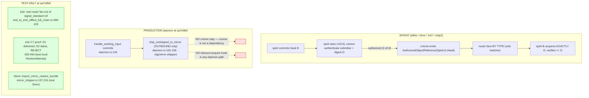

# 702/7 — spirit + signal-spirit: deep engine analysis

Kind: Deep architectural review (invariants, soundness-vs-surface, tensions,
risk). Successor to 690/7 (the change-audit) — builds on it, does not redo it.

- spirit HEAD audited: `aa7e9b0` *("reject stale mirror restore heads")*
- signal-spirit HEAD audited: `6884d7a` *("pin current schema chain")*
- Deployed versions: spirit `0.14.0`, signal-spirit `0.7.0` (unchanged since 690)
- Deployed daemon build (flake.nix:684): `--features agent-guardian --bin spirit-daemon`
- Live daemon confirmed reachable: `spirit Version` → `(VersionReported 0.14.0)`

## The deepest finding in one paragraph

The new commit `aa7e9b0` is the 700/697 blocker-2 (verify-after-restore /
acquire-exactly-D) landed as a **genuine production library method** —
`Store::import_mirror_restore_bundle` (`src/store/mod.rs:467-474`) restores a
mirror bundle and **rejects with `MirrorRestoreHeadMismatch` unless the
restored tip digest equals the announced head** (`:106-145`), with both a
positive and a `wrong_head = [0;32]` negative test against a real spirit
`Store` (`tests/mirror_shipper.rs:137,216-227`). That is real artifact
discipline for the *check itself*. But the invariant is structurally orphaned
from production in **three stacked layers**: (1) the method and its whole module
region are `#[cfg(feature = "mirror-shipper")]`, which is `default = []`
(`Cargo.toml:55,64`); (2) **no flake build or nix check enables
`mirror-shipper`** — it appears nowhere in `flake.nix`, so the deployed
`spirit-daemon` cannot contain the method; and (3) even compiled-in, **no
daemon path ever calls it** — `handle_working_input` only *ships outbound*
(`src/daemon.rs:152-155`) and the acquire/restore side has no daemon hook at
all. The check's only callers are tests. Simultaneously, the criome gate that
records `d6he`/`nfvm`/`2st7` place at the **center** of the first production
milestone ("Spirit asks the local criome daemon to authenticate the exact
content-addressed object … before propagating") is **still entirely absent from
code**: `criome` appears **0 times in `Cargo.lock`**, is not a dependency in
`Cargo.toml`, and survives only in test comments and a literal render stub
(`src/render.rs:337` emits `criome-auth-reference: None`). The 697 finding
("criome still only in comments") is unchanged at `aa7e9b0`. Net: the
*restore-side verify* moved from test-local helper to production method (real
progress), the *causal D-match proof* (C7) is green in the e2e test, but the
*criome authorize gate* and *acquire-by-D in a live daemon* are unbuilt — the
propagation loop's two load-bearing seams remain test-shaped.

## The propagation loop: intent vs. what production does

The governing records are unambiguous (queried verbatim from the live daemon):

- **`d6he`** (Decision, High): *"When Spirit accepts a new log object, Spirit
  asks the local criome daemon to authenticate the exact content-addressed
  object/event for propagation … criome … signs or authorizes it … and
  propagates the authenticated event through Router. This keeps criome
  auth-only, Router transport-only, and mirror as the object version-control
  substrate."*
- **`nfvm`** (Decision, Medium): *"criome is the authority on the latest
  approved authorized head; Spirit fetches or receives that authorized head
  from criome rather than deciding it locally."*
- **`2st7`** (Decision, High): *"criome authenticates the SUBMITTER, the
  SO_PEERCRED caller resolved to a registered criome Identity … an
  after-the-fact, non-blocking, out-of-band attestation binding the caller to
  the exact per-operation content-addressed digest."*
- **`m0p2`** (Decision, Medium): *"the router, as the sole operational matcher
  … Criome keeps no operational delivery registry; any criome-local
  subscription surface is observation and audit only."*

The shape of the green test (`TEST`) matches the intent (`INTENT`) for the
*router leg* and the *D-match proof*, but the **production daemon (`PROD`) does
not connect to either** — and the criome leg exists in neither production nor
test (the e2e's own header concedes it: *"The criome authorization step is
represented by the typed reference entering router fan-out; wiring a live criome
socket is the next slice"* — `end_to_end_offline_full_chain.rs:28-29`).

### What `aa7e9b0` actually added (the real progress, precisely)

| Surface | Before (697/700) | At `aa7e9b0` | Production-real? |
|---|---|---|---|
| Restore + verify check | test-local `RestoreAttempt` helper only | `Store::import_mirror_restore_bundle` production method (`store/mod.rs:467`) + `MirrorRestoreImport` carrier (`:99-145`) + `MirrorRestoreHeadMismatch` typed error (`error.rs:23`) | **Method: yes. In a daemon path: no (no caller outside tests).** |
| C7 falsifiable proof | designer-only lean | green in e2e: deliver D1, make D2 latest, `expect_err` mismatch (`end_to_end_offline_full_chain.rs:457-464`) | Yes — but against a raw `ComponentEngine` via test-local `RestoreAttempt`, **not** the new production method |
| Router leg (Slice 4) | harness-local `MirrorObjectNotice` chat payload | real `router::PublishAuthorizedObjectReference` + `signal_standard::AuthorizedObjectReference` (`:404,59`) | The placeholder is **deleted** — leg 2 is now a real typed signal, but `router`/`signal-router` are **`[dev-dependencies]`** (`Cargo.toml:121,135-136`) |
| criome gate (Slice 2) | comments only | comments only | **No.** `criome` is 0× in `Cargo.lock`; not a dependency |

The two important nuances the 690 audit could not yet see:

1. **The production method is NOT what the e2e C7 test exercises.** The C7
   proof in `end_to_end_offline_full_chain.rs` builds its own
   `RestoreAttempt::import_into` (`:275-313`) over a `ComponentEngine` +
   `begin_import`/`ingest_suffix`, duplicating the production method's logic in
   the test rather than calling `Store::import_mirror_restore_bundle`. The
   production method *is* tested — but by `mirror_shipper.rs` (against a real
   spirit `Store`), a different file. So there are **two parallel
   implementations of verify-after-restore**: the production method and the
   e2e's test-local copy. That is a transitional seam: the headline e2e witness
   does not witness the production code path it is meant to prove.

2. **leg 2 uses `signal_standard::AuthorizedObjectReference`, not
   `signal_criome::AuthorizedObjectReference`.** 700/Slice-4 required a
   production `From` conversion between the two vocabularies; the e2e sidesteps
   it by minting the standard-vocabulary reference directly from the mirror head
   (`reference_for_head`, `end_to_end_offline_full_chain.rs:224-230`). criome
   never produces this reference; the test fabricates it. So the "typed
   authorized reference" is real *as a router payload* but is **not the criome
   output** the milestone requires — its authority provenance is faked.

## Invariants this engine guarantees, and where each is enforced

| Invariant | Status | Enforcement (`file:line`) | Where it could break |
|---|---|---|---|
| **Restore acquires EXACTLY the announced head** (reject stale latest) | **Holds (library), Unverified (daemon)** | `store/mod.rs:139-145` (`MirrorRestoreImport::into_store` returns `MirrorRestoreHeadMismatch` when `restored_head != expected_head`); tested `mirror_shipper.rs:216-227` | No daemon calls it; `mirror-shipper` off by default & undeployed. A production restore path would have to be written; until then the invariant guards nothing live. |
| **criome authorizes head D before propagation** (d6he/nfvm/2st7) | **Violated (unbuilt)** | *No code.* `criome` 0× in `Cargo.lock`; render stub `render.rs:337` | The milestone's central authority step does not exist; spirit ships outbound with no authorization gate. |
| **Guardian admits only affirmative-shape captures** (nr7h) | **Holds (deployed), semantic-Unverified** | `guardian.rs:138-146` issues the live LLM call in the deployed `agent-guardian` daemon; `daemon.rs:133` `require_guardian()` by default; reason atom regenerate-compared `signal.rs:1269` via `build.rs:35` | The `NegativeGuideline` *verdict* depends on the model; only `#[ignore]`d live scenarios prove it (per 690). The atom + prompt are artifact-real; the judgment is capability-real. |
| **Empty testimony rejected deterministically** | **Holds** | `guardian.rs:131-137` short-circuits to `MissingTestimony` before any model call | Solid — structural, no model dependence. |
| **CLI/daemon NOTA-free binary boundary** | **Holds** | INTENT.md load-bearing; `cargo tree` no-default-features asserts `nota-next` absent (flake.nix:862 region) | Stable floor. |
| **Ship is best-effort, never fails the local commit** | **Holds** | `daemon.rs:152-155` swallows ship error (`let _ = error`) after local commit lands | By design; a mirror outage cannot corrupt local durability. Note: it also means a *silent* propagation failure is invisible to the working reply. |
| **Generated contract is regenerate-and-compared** | **Holds** | signal-spirit `build.rs:35` `write_or_check`; ResolveClarification/PublicTextSearch/NegativeGuideline all in `src/schema/signal.rs` (`:1418,1420,1269`) | Artifact-grade; the strict-positional port is checked-in + compared. |

## Soundness-vs-surface ledger (the audit-precision view)

| Capability | Surface claim | What the PRODUCTION path does | Verdict |
|---|---|---|---|
| Reject stale restore head | "verify-after-restore landed" | Library method exists & is tested; **no daemon caller; not in any deployed binary** | Library-real, daemon-absent |
| C7 falsifiable proof | "PartialGreen → LoopProvenGreen" | Green in `mirror-shipper`-gated e2e, against test-local `RestoreAttempt` over `ComponentEngine`, **never built in flake** | Test-real, undeployed, and not exercising the production method |
| criome-gated propagation | milestone d6he | **nothing** | Surface-only (comments) |
| Typed authorized reference on the wire | Slice 4 | real `signal_standard` ref via router (dev-dep) in test; **criome does not emit it; router is dev-dep** | Test-real, fabricated provenance |
| Guardian negative-guideline gate | nr7h | deployed daemon issues live LLM call returning the verdict | Deployed; semantic verdict capability-real only |
| ResolveClarification | "first-class op" | wired in production nexus (`nexus.rs:455-456,677/685` guarded+unguarded split); deployed (agent-guardian) | **Real (deployed)** |
| PublicTextSearch | ergonomic search | production nexus+store path (`nexus.rs:1190,1298`; `store/mod.rs:267,764,1467`); nota-text, deployed | **Real (deployed)** |
| Inline stashed observations | 0.14.0 | `StashTable`/`RecordsObserved` inline in nexus (`nexus.rs:13,31,57`); deployed | **Real (deployed)** |

The three psyche-facing ergonomics (ResolveClarification, PublicTextSearch,
inline stash) are the genuinely-deployed wins. The entire propagation arc —
the strategically important part — is test/library-shaped.

## Design tensions

**T1 — Two implementations of verify-after-restore (the e2e doesn't witness
the production code).** `aa7e9b0` added the production method
(`store/mod.rs:106-145`) *and* the rewritten e2e re-derives the same logic
locally (`end_to_end_offline_full_chain.rs:275-313`). The flagship full-chain
witness proves a *copy*, not the production method. The method's only real-Store
test is `mirror_shipper.rs`. The beautiful shape is one method, called by the
e2e too — collapse the duplicate. This is exactly the kind of transitional seam
ESSENCE warns "compromises both shapes."

**T2 — The whole propagation surface lives off the deployed binary, so it can
rot undetected.** `mirror-shipper` is in `default = []` (`Cargo.toml:55`),
appears in **no** flake build target or check, and `router`/`signal-router` are
`[dev-dependencies]`. Nothing in CI/nix compiles `import_mirror_restore_bundle`,
`MirrorShipper`, or the e2e. A `cargo update` or an upstream signal-mirror /
router break would not be caught by the deployed pipeline (690 already filed
this as a Low bead; at `aa7e9b0` it is now *more* load-bearing because real
production code — the new method — sits behind the gate). The router pin
compounds it: spirit's lock pins `router 4ce85c1` while router main is
`fb403c4` ("use Kameo lifecycle fork") — spirit's e2e links an **older router
than router main** (697 blocker-4 / closure-convergence edge persists).

**T3 — criome's absence is an intent-violation, not merely a gap.** `d6he`/
`nfvm`/`2st7` are the first *production milestone* and are High/High/Medium
Decisions, not aspirations. Spirit ships outbound to a mirror with **no
authorization step**, which is precisely the shape the records forbid (mirror
is the substrate, criome is the authority "rather than deciding it locally").
The render client even emits a hard-coded `criome-auth-reference: None`
(`render.rs:337`) — a placeholder masquerading as a field. The honest state:
the propagation milestone is unstarted on the authority axis.

**T4 — INTENT.md / ARCHITECTURE.md are silent on the head-verified restore and
the criome gate.** spirit `ARCHITECTURE.md` documents `Store::import`
(`:470-471`) but says nothing about `import_mirror_restore_bundle`, the
head-match invariant, or the criome milestone; `INTENT.md` covers shipping
obliquely but not the acquire/verify invariant. New production code
(`MirrorRestoreHeadMismatch`) landed without its architecture surface — the
"structure is its own documentation" essence is unmet here.

## Rust-discipline findings

- **P3 (soundness/hygiene) — unused import in the default build.**
  `EntryDigest` is imported unconditionally (`store/mod.rs:19`) but used only
  inside `#[cfg(feature = "mirror-shipper")]` blocks; the default `cargo build
  --lib` (observed EXIT 0) emits `warning: unused import: EntryDigest`. The
  sibling `PortableCheckpoint` import directly above is correctly cfg-gated
  (`:15-16`). `aa7e9b0` introduced this. Fix: move `EntryDigest` into the gated
  import. A regenerate-compared, beauty-is-the-criterion codebase should not
  ship a default-build warning.
- **Method-only rule: compliant.** The new logic lives on data-bearing carriers
  — `MirrorRestoreImport` (`store/mod.rs:99`, real fields
  `checkpoint`/`suffix`/`restored_head`) with `from_bundle`/`into_store`
  methods, and the associated `Store::import_mirror_restore_bundle`. No free
  functions, no ZST namespace. `From<ClarificationResolution>` etc. in the
  contract are correct conversion shape (`signal.rs:1709`).
- **Typed error: compliant.** `MirrorRestoreHeadMismatch { expected, restored }`
  and `ArchiveDecode { message }` are added to the per-crate `StoreError`
  (`error.rs:21-27`), not stringly-typed at call sites.

## Component-discipline check

- One-argument daemon / binary-only startup: honored (INTENT.md; the daemon
  decodes binary rkyv `SpiritDaemonConfiguration`, rejects inline NOTA).
- Triad shape: `spirit` + `signal-spirit` + `meta-signal-spirit` present and
  pinned (`Cargo.lock`). criome would be a **peer component over a socket**, not
  a triad leg — its absence is a missing client dependency + socket call, which
  is the correct shape to add (700/Slice-1 specified `CriomeClient` +
  `spawn_blocking`).
- NOTA positional records: the contract is strict-positional (690 confirmed;
  build-gate regenerate-compared).

## Ranked findings

- **P1 (drift/risk) — criome authorize gate absent from all code (intent
  violation).** `d6he`/`nfvm`/`2st7` require spirit to ask local criome to
  authenticate digest D *before* propagating; `criome` is 0× in `Cargo.lock`,
  not a dependency, present only in comments + `render.rs:337` stub. The first
  production milestone's authority axis is unstarted. *Evidence:*
  `src/render.rs:337`, `tests/end_to_end_offline_full_chain.rs:28-29`,
  `Cargo.lock` (no criome), `Cargo.toml:87-136`.
- **P1 (soundness) — the new restore-verify invariant has no production
  daemon caller and is in no deployed binary.** `Store::import_mirror_restore_bundle`
  is real and tested, but `mirror-shipper` is off by default
  (`Cargo.toml:55,64`), absent from every flake target/check (`flake.nix` has
  0 occurrences of `mirror-shipper`), and no `daemon.rs`/`engine.rs` path calls
  it — the daemon only ships outbound (`daemon.rs:152-155`). The guarantee
  guards nothing live. *Evidence:* `src/store/mod.rs:467-474`, callers grep
  (only `tests/mirror_shipper.rs`), `flake.nix:684`.
- **P2 (tension) — flagship e2e proves a duplicate, not the production method.**
  `end_to_end_offline_full_chain.rs:275-313` re-derives verify-after-restore
  test-locally over `ComponentEngine` instead of calling
  `Store::import_mirror_restore_bundle`; the production method's only real-Store
  test is `mirror_shipper.rs:137,216`. Two implementations of one invariant.
  *Evidence:* both files cited.
- **P2 (drift) — router pin lags router main; propagation deps are dev-only and
  un-CI'd.** spirit locks `router 4ce85c1` vs router main `fb403c4`; `router`/
  `signal-router` are `[dev-dependencies]`; no nix check builds the propagation
  surface. A future update re-breaks router types undetected (697 blocker-4).
  *Evidence:* `Cargo.lock` router entry, `Cargo.toml:121,135-136`, `flake.nix`.
- **P2 (drift) — leg-2 reference is `signal_standard`, fabricated, not criome
  output.** `reference_for_head` mints the reference from the mirror head
  (`end_to_end_offline_full_chain.rs:224-230`); criome never emits it; the
  cross-vocabulary `From` (700/Slice-4) is unwritten. Provenance is faked.
- **P3 (gap) — INTENT.md/ARCHITECTURE.md silent on head-verified restore +
  criome milestone.** New production code (`MirrorRestoreHeadMismatch`) and the
  d6he milestone have no architecture-doc surface. *Evidence:*
  `ARCHITECTURE.md:470-471` (only `Store::import`), no criome mention.
- **P3 (soundness/hygiene) — default build emits `unused import: EntryDigest`.**
  `store/mod.rs:19` should be cfg-gated like `:15-16`. Introduced by `aa7e9b0`.

## Confirmed-real (deployed) — for completeness, not re-audited

ResolveClarification (production nexus `nexus.rs:455-456,677/685`, deployed),
PublicTextSearch (production nexus+store, deployed), inline stashed observations
(`nexus.rs:57`, deployed), negative-guideline guardian gate (deployed daemon
issues the live LLM call; atom regenerate-compared), strict-positional port
(checked-in + compared; default lib build observed EXIT 0). These are the
genuine, deployed engine wins of this window.

## The single highest-value next move

**Add criome as a real spirit dependency and put the authorize gate in the
daemon's post-commit path (700 Slices 1-2), then connect
`Store::import_mirror_restore_bundle` to a real daemon acquire hook and make
the e2e call the production method (collapse T1).** Concretely: in
`handle_working_input` (`daemon.rs:152-155`), capture the `ShipOutcome::Shipped
{ head }`, derive D, and call criome `EvaluateAuthorization` (over
`CriomeClient` in `spawn_blocking`) *before* the head is allowed to propagate;
gate fan-out on `Authorized` only (d6he/nfvm/2st7). This is the one move that
converts the test-shaped loop into the milestone the High-certainty records
demand, and it simultaneously gives the orphaned restore-verify invariant a
live caller. Until criome is a dependency, the propagation milestone is
unstarted on its defining axis, regardless of how green the e2e is.
