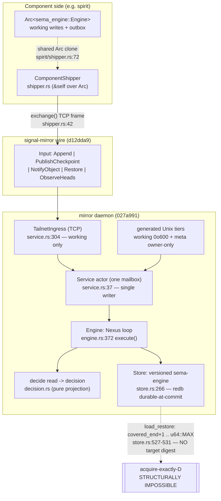

# 8 — mirror + signal-mirror: the unaudited chain endpoint

Engine: `mirror` (daemon, `main` 027a991) + `signal-mirror` (ordinary
working contract, `main` d12dda9). This is the first deep read of the
mirror triad — report 690 audited `mentci` in its file 8; the mirror was
never audited there. This report builds on the 700/701 propagation work
(E5 specifically) and verifies each structural claim against the code.

The mirror is the **cross-machine self**: a payload-blind append-ingest
remote that validates the blake3 digest chain and stores opaque bytes
(INTENT.md:3, INTENT.md:37-40). In the propagation neighbourhood
(`nfvm`, `d6he`) criome holds the *authorized* head and the mirror is
where another machine *restores* that head into a fresh store. The
deepest finding of this read is that **the mirror's restore surface is
structurally incapable of the one operation the cluster needs from it** —
fetch-exactly-head-D across machines — and the only defence today lives
in a *neighbouring* engine (spirit), not the mirror.

## What the engine guarantees, and where

One working request serialises Signal → Nexus decide → SEMA read →
Nexus decision → SEMA write → reply, and the reply leaves only after the
redb write transaction returned (engine.rs:59-68, store.rs:403-438). The
single-writer property is structural: both transports forward into one
`Service` mailbox (service.rs:158-171, service.rs:304-323; ARCHITECTURE.md:34-46).

### Invariants

| Invariant | Holds? | Enforced at | Risk if it breaks |
|---|---|---|---|
| Single writer (one mailbox, no concurrent engine touch) | Holds | service.rs:158-171 + TailnetIngress forwards into the same `ActorRef` service.rs:311; engine actor serves one ask per call stack (engine.rs comment 342-347) | Two writers race head/sequence; the whole append-decision soundness rests on read-decide-write being atomic |
| Ack-after-durable-write | Holds | `persist_suffix` returns only after redb commit (store.rs:403-408); reply composed strictly after the write completes (engine.rs:311-318) | A lost ack window would tell a shipper history is durable when it is not |
| Payload-blind (never decodes component record types) | Holds | store row holds raw `Bytes` (store.rs:180, 189); no decode of payload anywhere in mirror src; contract comment schema/lib.schema:9-14 | A decode dependency would couple the mirror to every component schema |
| Idempotent dedup against *loaded known rows* (not head seq) | Holds | novel remainder filters by `known_digest` (decision.rs:74-81); crash-window rows above the head are loaded (store.rs:366-374, range `first-1 .. last`) | Re-asserting a surviving row faults the store; the crash window self-heal depends on this |
| Expected-head names a STORED row, digest-verified | Holds | `expected_head_violation` checks the loaded known row, not the head (decision.rs:135-170); divergence → `DigestMismatch`/`HeadForked` (decision.rs:153-165) | A shipper could append onto history the mirror does not hold; fork acceptance |
| Coverage never regresses on checkpoint | Holds | `CheckpointDecision::into_decision` (decision.rs:206-225): `CoverageRegressed` on a lower sequence or covered_end | A regressed checkpoint shrinks the restore floor |
| Meta surface unreachable over TCP | Holds | TailnetIngress decodes only the ordinary `signal_mirror::Input` (service.rs:309); `MetaOrder` constructed only by the generated Unix meta tier (service.rs:175-183, schema_daemon.rs:78-99) | Tailnet peer could register/retire stores |
| **Restore can acquire EXACTLY head D** | **Violated** | `RestoreQuery StoreName` (schema/lib.schema:100) — store-name-only; `load_restore` returns `covered_end+1 .. u64::MAX` (store.rs:527-531) | The cross-machine live-loop race (E5): A keeps committing, the mirror's latest drifts past D, restore silently returns the *wrong* head |
| Retention enforced | Unverified by design | stored only; `persist_retention` writes the row (store.rs:494-506); no sweep exists. Deferred by decision (INTENT.md:57-58) | Unbounded growth; documented, not a defect |

## The deepest finding (E5): restore is store-name-only — fetch-by-digest is structurally impossible

The 701 roadmap (E5, lines 87-95) names this as a structural cluster
blocker but did not verify it at the code level. It is real and total:

1. **The contract cannot express the request.** `RestoreQuery StoreName`
   (schema/lib.schema:100) is a bare store name. There is no `HeadMark`,
   sequence, or digest field. `RestoreBundle` (schema/lib.schema:102-106)
   carries `checkpoint` + `Suffix` with no statement of *which* head it
   represents. `RestoreRejectionReason [UnknownStore NoCheckpoint]`
   (schema/lib.schema:108) has no `HeadNotHeld` variant.
2. **The daemon serves "latest", not "D".** `Store::load_restore`
   (store.rs:510-540) takes `query.payload()` (the store name, store.rs:514)
   and builds the suffix as `sequence_key(covered_end + 1) ..
   sequence_key(u64::MAX)` (store.rs:527-531) — every entry past the
   checkpoint *at query time*. There is no parameter to stop at D and no
   rejection if D has been superseded.
3. **The interim defence lives in spirit, not the mirror.** Spirit's
   production restore path `into_store` (spirit/src/store/mod.rs:136-148)
   compares the restored head against an out-of-band `expected_head` and
   raises `MirrorRestoreHeadMismatch` (spirit/src/store/error.rs:24-27) on
   drift. This is *verify-after-restore*: the caller must already know D,
   and the only achievable outcome on drift is a typed **failure**, never
   a correct exactly-D restore. The mirror itself contributes nothing to
   acquire-exactly-D.

Consequence for the cluster: with machine A still committing, a restore
on machine B races A's writes — `load_restore`'s `u64::MAX` upper bound
captures whatever A has shipped by the moment the read transaction runs.
The bundle is internally consistent (a valid prefix of a chain) but is
not pinned to the head the restorer asked for; spirit can only *detect*
the mismatch and retry, never *demand* D. This is the single highest
structural gap of the engine, and the fix is already specced
(701 line 93-95): extend `RestoreQuery` to carry the target `HeadMark`,
add a `HeadNotHeld` rejection, and make `load_restore` locate the entry
whose digest equals the target and bound the suffix there.

## The routed-object-notice handler is a receive-and-ack stub, not a sync

Commit 1275045 ("handle routed object notices") adds a `NotifyObject`
input path. The task framing asked whether this "matches router delivery
+ spirit outbox-drain." It does **not** — it is a notification
acknowledgement boundary with no fetch and no sender:

- The decision (decision.rs:237-258) accepts a notice **only if the
  mirror already holds that exact head** (`has_known_head`, decision.rs:261-265),
  otherwise refuses with `HeadBehind` (decision.rs:252-256) and reports
  its own current head. The `ObjectNotice.Source` field (schema/lib.schema:88)
  is decoded and then **never read** — the comment is explicit that
  fetching from `source` "is a later synchronization step" (decision.rs:235-236).
- There is **no `NotifyObject` sender anywhere in the mirror crate** —
  `ComponentShipper` exchanges only `Append` and `PublishCheckpoint`
  (shipper.rs:197, 245). The only `NotifyObject` construction in the repo
  is a test helper (tests/daemon_logic.rs:88-89).

So the notice surface is a half-edge: a mirror can *answer* "do you hold
head H?" but cannot *act* on "you are behind, fetch H from source." It
does not couple to router authorized-object delivery or to spirit's
outbox-drain in any production path. This is a clean, honest stub (the
`SourceUnavailable` reason in schema/lib.schema:93 is reserved for the
unbuilt fetch), but it is a stub — the routing loop does not close at the
mirror.

## The Arc<Engine> shared-engine shipper: sound, with one read-side hazard

The `from_shared_engine` / `with_shared_client` constructors (shipper.rs:109-128)
let spirit hand its `Arc<sema_engine::Engine>` to the shipper so both
hold clones of one engine (spirit/src/shipper.rs:72). This is necessary
because `sema_engine::Engine` is deliberately not `Clone`. The aliasing
is **memory-safe**: every `Engine` write method takes `&self` and
serialises through an internal `write_lock: Mutex<()>` held across the
whole read-compute-write unit (sema-engine engine.rs:84, 680, 1604), and
`acknowledge_mirror` holds that guard (sema-engine engine.rs:1603-1610).
`Engine` is `Send + Sync` (engine.rs:81-83), so the shared `Arc` cannot
data-race.

The real hazard is **read-side, time-of-check/time-of-use**. The shipper
computes its suffix from three *unguarded reads* — `unshipped_outbox`
(sema-engine engine.rs:1585, no write guard), `mirror_head` (engine.rs:1591),
and `versioned_replay_from_sequence` — then sends, then acknowledges. In
spirit the working path writes through the *same* engine concurrently
(spirit ships after each commit, shipper.rs comment :13-17). The only
guard against the outbox shifting between the two reads is
`OutboxSuffixMismatch` (shipper.rs:188-193), which checks
`outbox.len() == replay_entries.len()`. A concurrent commit landing
*between* `unshipped_outbox` and `versioned_replay_from_sequence` could
make those lengths agree by coincidence (a row drops off the shipped
cursor while a new one appears) and ship a suffix that no longer matches
the head the shipper believes it is at — caught downstream by the mirror's
`expected_head` digest check (a typed rejection, not corruption), but it
means the shipper's *own* consistency assumption is weaker than it reads.
This is a latent correctness-by-luck seam, not a present bug, because
spirit's drain is serialised by its own daemon actor today; it becomes
real the moment the shipper is driven from a second task.

## Design tensions

**Two-transaction persist vs single-writer elegance.** `persist_suffix`
is deliberately two transactions — entry rows (store.rs:415-422) then the
head row (store.rs:426-438) — because sema-engine has no multi-table
commit yet (ARCHITECTURE.md:81). The crash window between them is closed
by the known-rows dedup, which is genuinely beautiful (the special case
collapses into the normal append path). But it leaves a real durability
seam: a crash leaves entry rows above the head, and recovery depends
entirely on the shipper re-sending. The mirror cannot self-repair on
restart; it waits. The clean shape is the sema-engine multi-table commit
named as the follow-up — until then the invariant "ack means durable"
holds for the *pair* only via shipper cooperation.

**The contract carries un-wired vocabulary.** `ObjectNotice.Source`
(schema/lib.schema:88), `SourceUnavailable` (line 93), and the whole
notice/ack surface are in the wire types but inert in production. This is
the transitional-seam smell ESSENCE.md:97-104 warns against — the
contract describes a sync protocol the daemon does not yet run. It is
honest (commented as future work) but it means the wire shape is ahead of
the behaviour, which will bite a reader who trusts the contract as the
source of truth.

**Restore has no head-pinning, yet ObserveHeads exists.** The daemon can
already answer "what head do you hold?" (`ObserveHeads`/`HeadListing`,
engine.rs:251-253, store.rs:543-562). The missing E5 piece is small in
mechanism (locate-by-digest, bound the suffix) but the absence forces the
verify-after-restore workaround upstream — the design pushed a mirror
responsibility into spirit, which is the wrong owner for "did I get the
head I asked for."

## Rust- and component-discipline check

Clean overall. Every function examined is a method or trait impl on a
data-bearing type (Store, Engine, ComponentShipper, the schema-emitted
checked nouns); the `Daemon` ZST (schema_daemon.rs:40) is a legitimate
type-level daemon selector dispatched on by the emitted `DaemonCommand`,
not a namespace. Typed per-crate `Error` (error.rs:8-83); typed domain
values throughout (`StoreName`, `HeadMark`, `EntryDigest`, `CommitSequence`).
The daemon takes exactly one binary rkyv argument and never parses NOTA
(bin/mirror_daemon.rs:1-13, config.rs:26-27). NOTA records are positional
(schema/lib.schema). One minor identifier note: `KEY_SEPARATOR` /
`SEQUENCE_KEY_WIDTH` (store.rs:37, 41) are module consts, acceptable.

## Ranked findings

| # | Severity | Kind | Finding |
|---|---|---|---|
| mirror-1 | P1 | gap | Restore is store-name-only: `RestoreQuery StoreName` (schema/lib.schema:100) + `load_restore` `covered_end+1..u64::MAX` (store.rs:527-531) make acquire-exactly-D structurally impossible; the live-loop race is real across machines |
| mirror-2 | P2 | soundness | Routed-object-notice is a receive-and-ack stub: `Source` decoded but never used (decision.rs:235-236, schema/lib.schema:88), no `NotifyObject` sender in the crate (shipper.rs ships only Append/PublishCheckpoint) — the routing loop does not close at the mirror |
| mirror-3 | P2 | tension | Two-transaction persist (store.rs:415-438) leaves a crash window healed only by shipper re-send; the mirror cannot self-repair on restart (ARCHITECTURE.md:72-81) |
| mirror-4 | P3 | risk | Shipper suffix consistency rests on three unguarded reads + a length check (shipper.rs:176-193 over sema-engine engine.rs:1585-1592); correct-by-luck if the shared engine is ever drained from a second task |
| mirror-5 | P3 | drift | Contract carries inert vocabulary (`Source`, `SourceUnavailable`) ahead of behaviour — wire shape leads the daemon (ESSENCE.md:97-104) |

## Top risk and the single highest-value next move

**Top risk:** the restore surface cannot serve exactly-head-D, so the
multi-machine restore is correct only by spirit's after-the-fact
detection — across machines the mirror silently serves a drifted head and
the cluster has no way to *demand* the head it needs (mirror-1).

**Single highest-value move:** implement E5 exactly as 701 line 93-95
specs it — extend `signal-mirror`'s `RestoreQuery` to carry the target
`HeadMark`, add a `HeadNotHeld` rejection to `RestoreRejectionReason`
(schema/lib.schema:108), and make `Store::load_restore` (store.rs:510)
locate the entry whose digest equals the target and bound the suffix
there. This converts verify-after-restore (detect-only, in the wrong
engine) into acquire-exactly-D (demand, in the right engine), and is the
load-bearing prerequisite for the cross-machine propagation loop.
