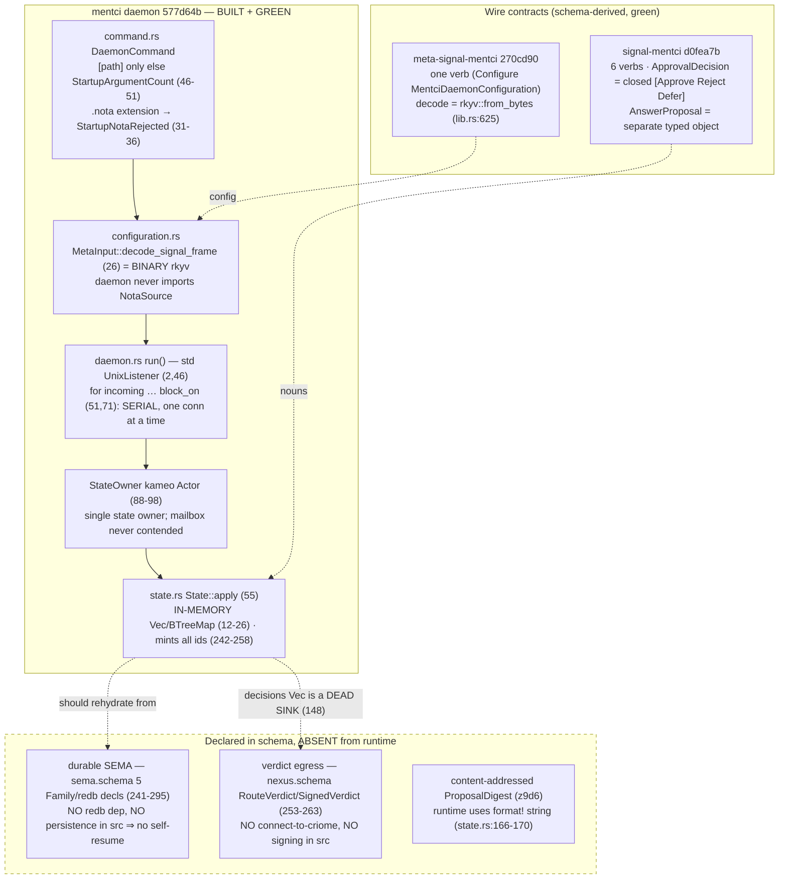

### 702 / 9 — mentci + signal-mentci + meta-signal-mentci (deep engine analysis)

**Audited HEADs.** `mentci` `577d64b` (the "use Kameo lifecycle fork" commit),
`signal-mentci` `d0fea7b`, `meta-signal-mentci` `270cd90`. Built and tested this
session: `cargo test --offline` at `577d64b` is **green — 10 tests** (lib 1 +
client 2 + configuration 2 + frame_codec 1 + state 4), zero build warnings.

**Deepest finding (the thing 690 named but did not pursue).** mentci is the only
engine in the stack whose *production daemon path* deliberately violates two of
its own governing disciplines, and both violations are load-bearing for the very
loop the daemon exists to close. (1) The closed verdict (`gc0n`) is genuinely
closed in the type system, but the **edited-answer object that re-enters the
authorization path is not content-addressed**: `ProposalDigest` is
`format!("answer-proposal-{question}-{proposal}")` over two minted identifiers
(`state.rs:166-170`), a value that does not depend on the proposal body at all —
so two different psyche-authored answers to the same question receive the **same**
digest, directly contradicting `z9d6` ("content-addressed composable objects")
and the `gc0n` clause "the authored value must be admitted as its own
content-addressed object before criome can authorize it." (2) The daemon's whole
reason to be a daemon (`7x5z`: "the daemon owns canonical interface state … on
restart it self-resumes from persisted SEMA state") is contradicted by an
**in-memory-only** `State` (`state.rs:12-26`, `Vec`/`BTreeMap`, no redb, no
storage dependency in `Cargo.toml`) — a restart silently drops every pending
escalation, which is the opposite of a self-resuming approval organ. Neither gap
is a skeleton excuse: the daemon is real, buildable, green, and serves the full
signal-mentci verb set over a real Unix socket — these two are *soundness*
failures inside a working daemon, the precise distinction this audit exists to
draw. The third structural fact — verdict→criome egress is wholly absent from the
runtime (`home_criome_socket_path()` at `configuration.rs:56-57` is read only by a
test, `tests/configuration.rs:49`) — means the daemon today is a write-only
approval recorder that **never completes the round trip to criome key custody**.

### What is genuinely real (soundness verified on the production path)

The triad shape is correct and matches `7sx6` (exactly two contracts) and `7x5z`
(daemon repo + the two signal repos). Three claims are verified strong on the
*production* path, not merely in tests:

| Invariant | Production-path evidence | Verdict |
|---|---|---|
| Closed verdict (`gc0n`) — no authored-answer variant | `signal-mentci/src/schema/lib.rs:173-176` `enum ApprovalDecision { ApproveSuggestedAnswer, Reject, Defer }`; `grep PendingAnswer` hits only DELETED comments. `state.rs:132-155` is the sole question-removal path; `propose_answer` (157-183) never touches `pending_questions`. | **Holds** |
| Daemon is binary-only, one argument | `command.rs:46-51` accepts `[path]` else `StartupArgumentCount`; `command.rs:31-36` rejects `.nota` *extension*; deeper, `configuration.rs:26` decodes via `rkyv::from_bytes` (`meta-signal-mentci/src/schema/lib.rs:625`), so NOTA *text* in a non-`.nota` file fails `ArchiveDecode` too. Daemon crate never imports `NotaSource` (only the CLI does, `client.rs:6`). | **Holds** |
| Daemon mints all ids/tokens; clients carry none | `state.rs:242-258` mint question/proposal/subscription; the wire payloads (`QuestionProposal`, `InterfaceStateObservation`) carry no id. | **Holds** |

The Defer path is also correctly sound: `state.rs:133-138` early-returns *before*
`bump_revision` (149), so a deferred question stays pending and the UI revision is
unchanged — exactly what a "defer keeps the question open" semantics demands
(test `defer_keeps_question_open_for_later_answer_proposal`, `tests/state.rs:77`).

### The `577d64b` Kameo fork is a no-op for the present runtime

The audited HEAD commit swaps registry `kameo 0.20` for the LiGoldragon fork at
`f491b45` and adds `[patch.crates-io]` (commit diff: `Cargo.toml`/`Cargo.lock`
only, **no source change**). The only lifecycle hook mentci uses is `on_start`
returning the actor unchanged (`daemon.rs:92-98`). Because the server is a
**serial blocking accept loop** (`std::os::unix::net::UnixListener` at
`daemon.rs:2,46`; `for incoming … block_on(state.ask(...).send())` at
`daemon.rs:51,71`), exactly one `ask` is ever in flight, the actor mailbox is
never contended, and no lifecycle/supervision feature is exercised. The fork is a
forward-looking dependency alignment, not a behavioural change at this HEAD; the
actor is, today, an elaborate `Mutex<State>`. This is a soundness-vs-surface note,
not a defect — but the "kameo-actor state machine" framing oversells what the
running code needs.

### The two structural gaps, verified against code (not re-asserted from 690)

**SEMA is in-memory; no self-resume.** `State` holds `pending_questions: Vec`,
`decisions: Vec`, `answer_proposals: Vec`, `subscriptions: BTreeMap`, and integer
counters (`state.rs:12-26`). `grep -niE 'redb|persist|family|sled|rehydrate|resume'
src/` returns nothing; `Cargo.toml` has no durable-storage dependency. The
`sema.schema` declares five durable families (`PendingQuestionsFamily`,
`DecisionsFamily`, `AnswerProposalsFamily`, `SubscriptionsFamily`,
`RevisionFamily`, lines 245/256/271/283/295) whose header explicitly says "on
restart the daemon self-resumes from them" (sema.schema:236) — none is wired. A
`Daemon::run` restart constructs `State::default()` (`daemon.rs:49`), so every
pending escalation is lost. This contradicts both `7x5z` and the AGENTS.md
component override ("on restart a daemon self-resumes from persisted SEMA state").
The schema is honest about the gap; the runtime simply does not have it.

**Verdict→criome egress is absent.** `nexus.schema:253-263` declares
`SignedVerdict { question decision preimage signature }` and `VerdictRouting`, and
`nexus.schema:427` declares the `RouteVerdict` operation. None exists in `src/`:
there is no second `UnixStream::connect` to the home criome, no signing, no
preimage construction. `configuration.home_criome_socket_path()`
(`configuration.rs:56-57`) — the only place the criome endpoint is reachable — has
exactly one caller, `tests/configuration.rs:49`; it is dead in production.
`State::answer` (`state.rs:147-148`) removes the question and pushes the verdict
into `decisions`, a `Vec` that is **never read anywhere** (a dead sink), then
returns `VerdictAccepted`. So the daemon acknowledges a verdict it never delivers.
Per `9s52`/`7x5z` the real signing waits on criome key custody, which is a
legitimate cross-engine blocker — but the *acknowledgement-without-delivery* shape
is a latent correctness trap: a client that receives `VerdictAccepted` has no
guarantee the verdict reached criome.

### Design tensions

The **ProposalDigest placeholder is the sharpest tension** because the test bakes
it in: `tests/state.rs:101` asserts the digest is literally
`"answer-proposal-question-1-proposal-1"` while the body is
`"replacement-nota-object"` — i.e. the test *encodes* that body content does not
participate in identity. When this is fixed to a real rkyv content hash (per
`z9d6`/`gc0n`), that assertion must change, and any downstream that pinned the
string digest breaks. Per the pre-production override this is fine, but it means
the "edited answer re-enters the normal authorization path" claim (true at the
*type* level) is **not yet true at the identity level** — criome could not
distinguish two different authored answers by their digests.

A second tension: the **`StandardSocket` shape divergence** persists (noted 690,
still live). `meta-signal-mentci/schema/lib.schema:99-101` and `nexus.schema:249`
declare `StandardSocket` as a single-field newtype over a Unix-only `SocketPath`,
while `eaf7` says the standard connection point carries "a port for network
cases." The Unix-only stand-in *cannot represent* a network endpoint, so the
eventual `signal-standard` cross-import (deferred Woe 4) is a shape change, not a
swap. mentci's `Cargo.toml` does not even depend on `signal-standard`; it reaches
the standard vocabulary only transitively through meta-signal-mentci's local
re-declaration — so the daemon never sees the canonical `ComponentKind`/
`StandardSocket` it conceptually conforms to.

A third, quieter tension: **Nexus is schema-only.** `nexus.schema` is a full
Work/Action reaction engine (`AdmitQuestion`, `FrameEscalation`,
`PublishInterfaceState`, `RouteVerdict` — lines 420-428) but the runtime
hand-rolls an equivalent in `State::apply`. The two can drift, and the
escalation-receiving side (`FrameEscalation`: criome escalation → QuestionProposal,
the literal mechanism `gc0n` calls "the psyche-facing UI") has **no runtime at
all** — `ApprovalSource::CriomeEscalation` exists as an enum variant but nothing
constructs a question from an inbound criome escalation. The dead-letter `gc0n`
describes is, for the escalation-ingress direction, still a dead letter.

### Rust- and component-discipline lens

The mentci daemon crate is **clean** on the workspace Rust rules: every `fn` is a
method/associated-fn on a data-bearing type (`Daemon`, `StateOwner`, `State`,
`DaemonCommand`, `ClientCommand`, `FrameCodec`, `ConfigurationFile`,
`DaemonConfiguration`) or a trait impl (`Actor`, `Message`, `Default`); no free
functions outside `#[cfg(test)]`/`main`; no ZST-namespace types; one typed
per-crate `Error` (`error.rs:5-60`); domain values are newtypes
(`QuestionIdentifier`, `ProposalDigest`, `SubscriptionToken`, …); the codec uses
generated `decode_length_prefixed`, no hand-rolled parser; identifiers are full
English words. One minor smell: `error.rs` carries four declared variants
(`ConfigurationArchiveDecode`, `ConfigurationInputNotConfigure`,
`ConfigurationArchiveEncode`, `UnsupportedSocket`, lines 28-38) that nothing
constructs in `src/` — dead error surface that overstates the failure modes the
daemon actually handles. Component discipline holds: one argument, binary-only
daemon, two contracts, positional records, bare atoms.

### Ranked findings

| # | Sev | Kind | Claim | Evidence |
|---|---|---|---|---|
| 1 | P1 | soundness | `ProposalDigest` is identifier-derived, not content-addressed — violates `z9d6`/`gc0n`; the edited-answer object's authorization identity does not depend on its body. | `mentci/src/state.rs:166-170`; test bakes it in at `tests/state.rs:101` |
| 2 | P1 | soundness | SEMA is in-memory only; restart constructs `State::default()` and loses all pending escalations — violates `7x5z` + the self-resume override. | `mentci/src/state.rs:12-26`; `mentci/src/daemon.rs:49`; `sema.schema:236-295` (declared, unwired) |
| 3 | P1 | gap | Verdict→criome egress wholly absent from the runtime; daemon returns `VerdictAccepted` it never delivers, and pushes verdicts into a never-read `decisions` Vec. | `mentci/src/state.rs:147-154`; egress decls at `nexus.schema:253-263,427`; `home_criome_socket_path` dead in prod (`configuration.rs:56`, sole caller `tests/configuration.rs:49`) |
| 4 | P2 | tension | `FrameEscalation` (criome escalation → QuestionProposal) — the literal `gc0n` UI-receiving mechanism — has no runtime; `ApprovalSource::CriomeEscalation` is an unconstructed variant. | `nexus.schema:426`; `sema.schema:146-150`; no constructor in `src/` |
| 5 | P2 | drift | `StandardSocket` is a Unix-only newtype but `eaf7` requires a network port case; eventual `signal-standard` import is a shape change, not a swap; mentci doesn't depend on `signal-standard` at all. | `meta-signal-mentci/schema/lib.schema:99-101`; `nexus.schema:249`; `mentci/Cargo.toml:10-17` |
| 6 | P3 | soundness | Serial blocking accept loop means the kameo actor (and the `577d64b` lifecycle fork) buys no concurrency at this HEAD; actor is effectively a `Mutex<State>`. | `mentci/src/daemon.rs:2,46,51,71`; commit `577d64b` is Cargo-only |
| 7 | P3 | coherence | Four `Error` variants are declared but never constructed in `src/`; `answered_by` is captured into the dead `decisions` sink and dropped from `VerdictAccepted`. | `mentci/src/error.rs:28-38`; `mentci/src/state.rs:148,150-154` |

### Top risk and highest-value next move

**Top risk:** mentci is the keystone that closes `EscalateToPsyche`, yet on the
production path it can neither *durably hold* a pending escalation across a restart
(finding 2) nor *deliver* the resulting verdict to criome (finding 3) nor
*content-address* an edited answer so criome could authorize it (finding 1). The
daemon is real and green, but the approval *round trip* it exists to perform does
not close in running code — and one restart erases the queue silently.

**Single highest-value next move:** wire durable SEMA from the five `sema.schema`
families (finding 2). It is the one fix that is *not* blocked on criome key custody
(findings 1 and 3 ultimately need the criome signing path), it directly satisfies
the self-resume override the daemon's own schema header promises, and it is the
prerequisite for finding 3 — a verdict egress is only meaningful once the question
it answers survives long enough to be answered. Compute the content-addressed
`ProposalDigest` (finding 1) in the same storage pass, since the durable
`AnswerProposalRecord` is exactly the rkyv object whose hash the digest should be.
