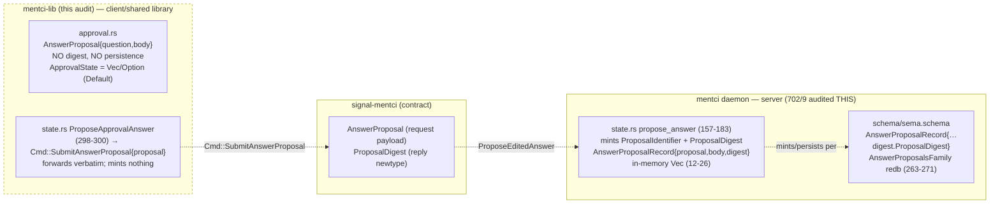

# 703 / 5b — mentci-lib completeness audit (the correction to 702/9)

**Why this file exists.** The 702 mentci lane (`702-deep-engine-analysis/9-mentci.md`)
audited the `mentci` *daemon* repo (`/git/github.com/LiGoldragon/mentci`) and
filed three P1 findings against `mentci/src/state.rs` — non-content-addressed
`ProposalDigest`, in-memory-only SEMA, absent verdict egress. The 703 frame
(`0-frame-and-method.md`) flagged that the *edited-answer model actually lives in
`mentci-lib`* and ordered a dedicated `mentci-lib` audit. This file does that
audit and reconciles where each 702 claim's evidence really sits. The short
version: **702/9's three findings are all correctly located in the daemon repo —
they are NOT mentci-lib's to fix.** mentci-lib carries a *parallel, in-memory,
client-side* edited-answer model that is a thinner cousin of the daemon's, and it
has its own (smaller, design-level) gap. The 702 lane judged the right repo for
its three findings; the 703 frame's worry that 702 "judged the wrong repo" is the
thing this audit resolves — and the answer is that the edited-answer *type name*
`AnswerProposal` exists in three places, which is what created the ambiguity.

**Verified green this session.** `cargo test --offline` in
`/git/github.com/LiGoldragon/mentci-lib` builds clean and passes **9 tests**
(`tests/approval.rs`, all 9), library + handshake example compile, zero failures.
mentci-lib is a running model, not a `todo!()` skeleton in the approval area
(the canvas/constructor area still is — see below).

## What mentci-lib actually contains

mentci-lib is the **shared MVU application library** for the Mentci component:
`WorkbenchState` (model) / `WorkbenchView` (snapshot) / `UserEvent` /
`EngineEvent` / `Cmd`. `src/lib.rs:20-34` lists 15 modules. By substance:

| Module | Lines | State |
|---|---|---|
| `approval.rs` | 478 | **Real, tested** — the edited-answer / proposal / subscription model |
| `state.rs` | 544 | **Real** for connection + approval + first-records; canvas/constructor handlers real, others `_ => Vec::new()` |
| `connection/driver.rs` | 306 | **Real** — tokio UDS dialer + handshake + frame I/O against criome |
| `event.rs` | 285 | Real — `UserEvent` + `EngineEvent` closed enums |
| `constructor.rs`, `canvas/*`, `inspector.rs`, `diagnostics.rs`, `wire.rs`, `theme.rs`, `layout.rs`, `schema.rs` | ~50-134 each | Mostly skeleton/first-paint — types pinned, several bodies still placeholder per `INTENT.md:71-78` |

The **edited-answer / proposal model lives in `approval.rs`** — that is the answer
to the prompt's first question. It is the workbench-side (client/library) model:

- `AnswerProposal { question: ApprovalIdentifier, body: AnswerBody }`
  (`approval.rs:166-176`). A separate typed object, explicitly **"not a verdict
  variant"** (doc comment `approval.rs:161-165`).
- `ApprovalDecision { ApproveSuggestedAnswer, Reject, Defer }` (`approval.rs:179-187`)
  — the **closed verdict set**, no authored-answer arm. Matches the daemon and
  `signal-mentci` exactly.
- `ApprovalState` (`approval.rs:336-469`) — the in-memory model: `pending`,
  `selected`, `answered`, `subscriptions`, `next_subscription`. Holds
  `receive`/`select`/`answer`/`subscribe`/`unsubscribe` plus delivery fan-out
  (`deliveries_for`, `delivery_for`, `accepts`).
- Subscription machinery: `ApprovalSubscription`, `ApprovalInterest`
  (`All`/`PendingQuestions`/`AnsweredResponses`), `ApprovalUpdate`,
  `ApprovalDelivery`, `ApprovalSubscriptionReceipt`, `ApprovalView`.

This is a **shell-state model, not a SEMA model.** It is the MVU in-memory model
a thin client paints from; it is `#[derive(Default)]` (`approval.rs:336`), all
`Vec`/`Option`, no redb, no rkyv, no persistence — by design, because mentci-lib's
own `INTENT.md:33-37` and `ARCHITECTURE.md:113-120` state that durable persistence
is the *daemon's* job, not the library's:

> "Future daemon-owned state (… approval queue, client subscriptions) lives behind
> the Mentci daemon. The in-memory library state is the shared model and test
> surface; durable persistence lands in the `mentci` daemon through typed
> SEMA/redb storage once the daemon exists." — `mentci-lib/ARCHITECTURE.md:115-120`

So mentci-lib does **not** contain "shell-state Sema patterns" in the
persistence/`Family`/redb sense. It contains the *in-memory MVU mirror* of what
the daemon will persist. The `Family`/redb SEMA patterns live only in the daemon
repo's `schema/sema.schema`.

## How mentci-lib relates to the mentci daemon

The flow: a thin shell raises `UserEvent::ProposeApprovalAnswer { proposal }`;
mentci-lib's `state.rs:298-300` turns it into `Cmd::SubmitAnswerProposal { proposal }`
**verbatim — the library mints no identifier and no digest**; the outer runtime
sends it over `signal-mentci`; the **daemon** (`mentci/src/state.rs:157-183`) is
where `propose_answer` mints `ProposalIdentifier`, computes `ProposalDigest`, and
stores `AnswerProposalRecord`. Identity (id + digest + persistence) is wholly a
daemon concern; mentci-lib is correct to omit it.

The type name `AnswerProposal` appears in **three repos** with three jobs — this
is the trap that made 702's repo-targeting look ambiguous:

| Repo | `AnswerProposal` is… | Carries a digest? |
|---|---|---|
| **mentci-lib** `approval.rs:166-176` | client model object: `{question, body}` | **No** (correct — minting is downstream) |
| **signal-mentci** (request payload, imported at `mentci/src/state.rs:4`) | wire request noun | No (request side) |
| **mentci daemon** `state.rs:29-33` wraps it as `AnswerProposalRecord{proposal, body: AnswerProposal, digest}` | persisted record | **Yes** — `digest: ProposalDigest` |

## Does the ProposalDigest / content-addressed model live here? — No.

**`ProposalDigest` does not exist in mentci-lib at all.** Confirmed by grep:
`AnswerProposal` and `SubmitAnswerProposal` appear in `approval.rs`, `event.rs:8,164`,
`cmd.rs:9,54`, `state.rs:299`; `ProposalDigest` / `digest` / "content-address"
appear in **none** of them. The content-addressing concern 702/9 finding #1 raises
is structurally **un-locatable in mentci-lib** — there is no digest to be
identifier-derived-vs-content-addressed, because mentci-lib never computes one.

Where it lives:
- `mentci/src/state.rs:166-170` — the actual placeholder digest:
  `ProposalDigest::new(format!("answer-proposal-{}-{}", proposal.question.as_str(), proposal_identifier.as_str()))`
  — over two minted ids, **body-independent**, exactly 702/9 finding #1.
- `mentci/schema/sema.schema:121` declares `ProposalDigest String`;
  `:263-271` `AnswerProposalRecord{… digest.ProposalDigest …}` +
  `AnswerProposalsFamily` redb table; `:317-325` `ProposalReceipt{… digest …}`.
- `mentci/schema/sema.schema:258-262` (the family doc) and the schema header
  already say the digest should be the rkyv content hash criome approves —
  "never a loose answer string."

So **702/9's finding #1 is correctly filed against the daemon repo.** Fixing it
means computing a real rkyv content hash where `propose_answer` mints today
(`mentci/src/state.rs:166`), against the persisted `AnswerProposalRecord` rkyv
bytes — nothing in mentci-lib changes for it.

## Reconciling the three 702/9 mentci findings against where the code is

| 702/9 finding | Located in 702/9 at | Correct repo? | mentci-lib's role |
|---|---|---|---|
| **#1 ProposalDigest not content-addressed** | `mentci/src/state.rs:166-170` + `tests/state.rs:101` | **Daemon — correct.** mentci-lib has no digest (it forwards `AnswerProposal{question,body}` raw, `state.rs:298-300`). | None to fix. The lib correctly leaves identity/digest minting downstream. |
| **#2 durable SEMA absent / no self-resume** | `mentci/src/state.rs:12-26`, `daemon.rs:49`, `sema.schema:236-295` | **Daemon — correct.** Persistence is explicitly the daemon's job per `mentci-lib/ARCHITECTURE.md:115-120`. mentci-lib's `ApprovalState` is *deliberately* in-memory `Default`. | None to fix. The lib being in-memory is intended, not a gap. |
| **#3 verdict→criome egress absent** | `mentci/src/state.rs:147-154`, `nexus.schema:253-263,427`, `configuration.rs:56` | **Daemon — correct.** Egress/signing/criome connection is daemon + criome-key-custody work. | None to fix. mentci-lib emits `Cmd::SubmitApproval{response}` (`state.rs:284-297`) — the side-effect the *outer runtime* dispatches; the lib's contract stops at the `Cmd` boundary by design (`ARCHITECTURE.md:80-86`). |

**Conclusion on the 703-frame worry.** The 703 frame said the 702 verification
"noted the mentci lane judged the wrong repo: the edited-answer model actually
lives in mentci-lib." That is **half right and worth nailing down precisely**: an
edited-answer model *does* live in mentci-lib (`approval.rs` `AnswerProposal` +
`ApprovalState`), but it is the **client-side MVU model**, not the
authorization/persistence model the three 702 findings are about. All three 702
findings concern *minting, persistence, and egress* — daemon responsibilities
that mentci-lib's own intent files explicitly disclaim. 702/9 audited the daemon
repo and filed daemon-repo findings; that targeting is **correct**. No 702/9
finding needs relocation to mentci-lib. The audit-the-wrong-repo concern resolves
to a *name-collision* (`AnswerProposal` in three repos), not a mis-filed finding.

## mentci-lib's own gaps (what an audit OF mentci-lib should add)

These are mentci-lib-native and were out of 702/9's daemon scope:

1. **(P2, design) Two parallel approval state machines that can drift.**
   mentci-lib's `ApprovalState` (`approval.rs:336-469`) and the daemon's `State`
   (`mentci/src/state.rs:54-259`) are hand-written twins: both mint subscription
   ids, both fan deliveries by interest, both implement defer-keeps-pending
   (`approval.rs:388-391` vs `mentci/src/state.rs:133-138`). They are *not*
   generated from one source. When the daemon gains durable SEMA + real digests,
   the lib's mirror must track by hand or the client paints a state the daemon
   no longer holds. This is the mentci-lib analogue of 702/9's "Nexus is
   schema-only; the runtime hand-rolls an equivalent" tension — here the *lib*
   hand-rolls a second equivalent of the daemon's in-memory state.

2. **(P2, contract) The lib's `ApprovalInterest` ≠ the daemon's `InterfaceInterest`.**
   Lib: `All / PendingQuestions / AnsweredResponses` (`approval.rs:207-214`).
   Daemon/`signal-mentci`: `FullInterfaceState / StatusOnly / Notifications /
   PendingQuestions` (`sema.schema:221-226`). These are different projection
   vocabularies for the same subscription concept. A thin client subscribing
   through mentci-lib cannot express `StatusOnly` or `Notifications`, and the lib
   has no `AnsweredResponses` equivalent on the daemon side. The two subscription
   models do not compose; one must become the source.

3. **(P2, gap) `ApprovalSource::CriomeEscalation` is an unconstructed variant
   here too.** `approval.rs:50-58` declares it, and the test fixture sets it
   (`tests/approval.rs:14`), but nothing in mentci-lib *ingests* a real criome
   escalation into an `ApprovalQuestion` — questions arrive only via the test-fed
   `EngineEvent::ApprovalQuestionArrived`. This mirrors 702/9 finding #4
   (`FrameEscalation` has no runtime); the ingress dead-letter is dead on both
   sides of the wire.

4. **(P3, coherence) The lib models `defer` as a no-op command** (`approval.rs:388-391`
   returns empty deliveries; `state.rs:294-296` returns `Vec::new()` when
   `outcome.question.is_none()`), so a deferred answer produces **no `Cmd` at
   all** — the daemon is never told. The daemon's `answer` does emit
   `VerdictAccepted` for defer (`mentci/src/state.rs:133-138`). The lib and
   daemon disagree on whether defer is observable to the server. Minor, but a
   real client/daemon semantic mismatch.

5. **(P3, doc) ARCHITECTURE/code-map drift.** `ARCHITECTURE.md:134-162` code-map
   omits `approval.rs` entirely and `connection.rs` is shown as a single file,
   but the tree is `connection/{mod,driver}.rs`. The doc predates the approval
   work (commits `b0385ce`/`81e852b`/`c5a8085`). The `ARCHITECTURE.md:69-71`
   header still says "four typed shapes" while the body and `INTENT.md:20-27`
   correctly say five (it adds `EngineEvent`).

## Rust- and component-discipline lens (mentci-lib)

Clean on the workspace rules in the audited modules. Every `fn` is a method/
assoc-fn on a data-bearing type (`ApprovalState`, `ApprovalQuestion`,
`ApprovalSubscription`, `WorkbenchState`, the newtypes) or a trait impl; the
private `accepts`/`delivery_for`/`deliveries_for` are methods on
`ApprovalInterest`/`ApprovalSubscription`/`ApprovalState`, not free fns. Domain
values are newtypes throughout (`ApprovalIdentifier`, `AnswerBody`,
`SuggestedAnswer`, `ApprovalPrompt`, `ApprovalExplanation`, `ApprovalContext`).
Closed enums; full English words, no crate-name prefix. One smell: the
constructor `*::new(value)` newtype wrappers are thin but legitimate (typed
domain values). No free functions outside `#[cfg(test)]`/example mains. The lib
holds **no GUI-library types** (per its `INTENT.md:33-37`) — confirmed.

## Ranked findings (mentci-lib-native)

| # | Sev | Kind | Claim | Evidence |
|---|---|---|---|---|
| 1 | P2 | drift | Lib `ApprovalState` and daemon `State` are hand-written twins of one state machine; will drift as the daemon gains SEMA/digests. No shared/generated source. | `mentci-lib/src/approval.rs:336-469` vs `mentci/src/state.rs:54-259` |
| 2 | P2 | contract | Lib `ApprovalInterest` (3 arms) ≠ daemon/`signal-mentci` `InterfaceInterest` (4 arms); subscription projection vocabularies do not compose. | `mentci-lib/src/approval.rs:207-214`; `mentci/schema/sema.schema:221-226` |
| 3 | P2 | gap | `ApprovalSource::CriomeEscalation` unconstructed in the lib; questions arrive only via test-fed `EngineEvent::ApprovalQuestionArrived`; no real escalation ingress. | `mentci-lib/src/approval.rs:50-58`; `mentci-lib/src/state.rs:311+`; `tests/approval.rs:14` |
| 4 | P3 | coherence | Defer produces no `Cmd` in the lib (server never told); daemon emits `VerdictAccepted` for defer — client/daemon disagree on defer observability. | `mentci-lib/src/approval.rs:388-391`; `mentci-lib/src/state.rs:294-296` vs `mentci/src/state.rs:133-138` |
| 5 | P3 | doc | `ARCHITECTURE.md` code-map omits `approval.rs`, shows `connection.rs` as one file, says "four typed shapes" while body/INTENT say five. | `mentci-lib/ARCHITECTURE.md:69-71,134-162` |

## Bottom line for the 703 operator brief

1. **No 702/9 mentci finding moves to mentci-lib.** Findings #1 (content-addressed
   digest), #2 (durable SEMA), #3 (verdict egress) are all daemon-repo work,
   correctly filed against `/git/github.com/LiGoldragon/mentci`. mentci-lib has no
   `ProposalDigest`, no persistence, and no egress *by design* — its intent files
   disclaim all three as daemon responsibilities.
2. **The name `AnswerProposal` exists in three repos** (lib model / signal wire /
   daemon record); the daemon's `AnswerProposalRecord` is the only one carrying a
   digest. That collision is what made the repo-targeting look ambiguous; it is
   not a mis-filed finding.
3. **mentci-lib's real, lib-native gap is the twin-state-machine drift + the
   subscription-interest vocabulary mismatch** (findings 1-2 above), surfacing now
   that *both* repos hand-roll the approval state machine. The structural fix is
   one source of truth for the approval model that both the daemon and the lib
   derive from — out of 703's "fix everything" code-fix scope (it needs a Spirit-
   level call on where the shared approval model lives), so this audit flags it
   rather than implementing it.
4. **mentci-lib is green** (9/9 tests, builds clean) — no green-faking, the
   approval area is a real running model, not a `todo!()` skeleton.
