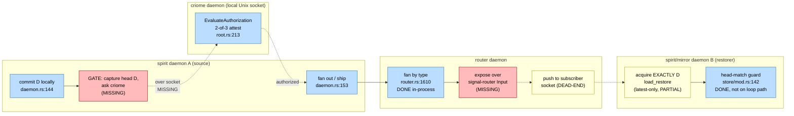

# 703-6 — Operator Brief: Close the Criome-Gated Propagation Loop in the Daemon Path

Designer-lane executable work program. Read this as the spec, not a summary.
Every file:line below was re-verified against current `/git` HEADs on
2026-06-19; do not trust report 702's citations — they were corrected twice
(702's own skeptic, then operator 434). Where 434 corrected a fact, this brief
uses the corrected fact and says so.

## 1. Framing — real in design, fractured in code

The criome-gated propagation loop is a coherent design: a spirit commit must be
**authorized by criome (2-of-3 attestation) before it fans out**, and a
restoring component must acquire **exactly** the authorized head, never a later
drifting one. The design is sound. The code is fractured three ways:

1. **The two halves live on unmerged refs.** Spirit `main` (`aa7e9b0`, "reject
   stale mirror restore heads") carries the **production** restore guard
   `Store::import_mirror_restore_bundle` (verified `spirit/src/store/mod.rs:467`)
   which enforces `restored_head == expected_head` via
   `MirrorRestoreImport::into_store` (`spirit/src/store/mod.rs:142`). But spirit
   `main` has **no criome dependency at all** (`grep -i criome Cargo.toml` →
   nothing; only `mirror`/`signal-mirror` behind `mirror-shipper` at
   `Cargo.toml:64,99,110` and `router`/`signal-router` at `:135-136`). The
   branch `origin/criome-gated-propagation-loop` has the gate + typed-fan but
   **forked at `4d0e0ca`**, well before `aa7e9b0`
   (`git merge-base --is-ancestor` returns non-ancestor, exit 1), so it does
   **not** contain the production restore method.

2. **No daemon caller.** The spirit production daemon ships outbound to a mirror
   with **zero** authorization. `handle_working_input`
   (`spirit/src/daemon.rs:139-157`) commits locally at line 144
   (`engine.handle_async(input).await`), then fans out at line 153
   (`engine.ship_unshipped_to_mirror().await`) — **nothing between them**. The
   only criome string in spirit production source is a hardcoded
   `;; criome-auth-reference: None` (`spirit/src/render.rs:337`, confirmed),
   which asserts "no authorization" unconditionally.

3. **The branch's green test cannot prove the guard.** The branch reimplements
   restore as a test-local free-fn `import_restore_bundle`
   (`branch tests/end_to_end_offline_full_chain.rs:223`) that does
   `ingest_checkpoint` → `ingest_suffix` → `commit` with **no `expected_head`
   check** — so its passing e2e proves head-mismatch rejection with a copy that
   structurally cannot reject. It also fabricates the authorized reference as an
   inline struct literal (`branch e2e:409-413`) and runs criome in-process via
   `CriomeRoot::start` (`branch e2e:537`) rather than over the socket.

**Operator 434 confirmed the spine.** The RouterRuntime fanout *is* built — the
`impl kameo::message::Message<AttendAuthorizedObjects | WithdrawAuthorizedObjects
| PublishAuthorizedObjectReference | ReadAuthorizedObjectFanoutStatus> for
RouterRuntime` impls exist at `router/src/router.rs:1580/1595/1610/1625`
(re-verified). mentci's schema files are real (declared-but-unwired, not
phantom). Spirit's restore guard is production code. The kameo source-graph
split is real but the deployed graph is unwitnessed.

**The big goal: close the single-host loop in the DAEMON path so a daemon — not
`cargo test` in-process — enforces it end to end.** Every gap here is
daemon-level, so every load-bearing falsifiable test runs at the
process/socket/closure boundary. A green `cargo test` that never opens a socket
does **not** discharge a daemon-level item.

## 2. The target loop

Leg status: **commit (done)**, **gate→criome over socket (MISSING)**,
**criome evaluate (done)**, **fan out (done)**, **router fan by type
in-process (done)**, **router over-wire surface (MISSING)**, **router push to
subscriber socket (DEAD-END)**, **acquire-exactly-D (PARTIAL — latest-only)**,
**head-match guard (done, but not wired onto the loop path on main)**.

## 3. The sequenced program

Six work items. Order: the **kameo Nix witness is prerequisite step 1**
(system-operator joint). Then three items compose into the daemon loop test
(spirit spine, router wire, mirror fetch-by-digest). Two items are parallel
hardening (criome, mentci).

### Item 0 (PREREQUISITE, step 1) — Kameo fleet Nix witness (system-operator)

**Problem.** The cargo source-graph split is real but the deployed Nix closure
each daemon resolves is unwitnessed, and the source-graph is itself incoherent.
Verified: spirit `Cargo.lock` carries **both** kameo identities — stock
`registry+https://github.com/rust-lang/crates.io-index` (`Cargo.lock:606`) **and**
fork `git+...kameo.git?branch=main#f491b45` (`Cargo.lock:621`). criome
(`Cargo.lock` fork), router (fork), mentci (fork), triad-runtime (fork) are
fork-only. **mirror is stock-only** (`mirror/Cargo.lock` registry) with **no
direct kameo dep** (`mirror/Cargo.toml` has none — it pulls fork-locked
triad-runtime transitively). spirit's flake rewrites the lock via a
`kameo-source` input + vendor + `[patch]` block (`spirit/flake.nix:11,230,439-441`)
and a Python dedup, so its **deployed** kameo ≠ its literal lock. mentci has
**no flake.nix** (verified absent) — no standalone closure.

**Changes (executable).** Build a per-daemon resolved-rev witness aggregated
into one fleet check. (a) Surface spirit's post-`[patch]`/post-dedup kameo
identity as a queryable flake output (the patched lock derivation in
`spirit/flake.nix`). (b) Add a per-flake `kameo-resolved-rev-witness` check to
the crane daemons (criome/router/mirror/triad-runtime) emitting the source+rev
crane actually vendors. (c) Give mentci a minimal crane flake (preferred) or
fall back to `cargo metadata --locked` labeled "cargo-only, no Nix closure".
(d) An aggregator flake that reads each `(source, rev)` via `nix eval` /
derivation outputs / `nix path-info` — **no `/nix/store` filesystem search** —
prints a per-daemon table, and **exits non-zero on more than one distinct
identity**.

**Designer lean.** Witness first, decide second; the subsequent fleet decision
(out of scope for this item) is **everyone onto fork `f491b45`** because
router's actor-lifecycle work drove the fork and mirror's stock pin is the
anomaly to retire. Land the witness as a **reporting output first**, flip it to
a hard CI gate in the **same change** that unifies the fleet, or CI reds before
the decision is made.

**Falsifiable test (closure boundary).** `nix run <aggregator>#kameo-fleet-witness`
must print one resolved kameo line per daemon, with spirit's line showing the
post-patch fork (`f491b45`, not its double-entry lock). Against current code it
**must exit non-zero naming mirror as divergent** (stock vs fork everywhere
else) and flag mentci as having no standalone closure. After unification the
same command exits zero with every daemon at `f491b45`.

**Dependencies.** None. **Risks.** spirit's deployed identity is computed by a
runCommand Python pass — the witness must read the *same* derivation the build
consumes, or it reports a stale parallel value. Flipping to a hard gate before
unification reds the fleet immediately. **Estimate.** 1.5-2.5 days.

### Item 1 — Spirit daemon loop spine (operator)

**Problem (grounded).** As framed in §1: daemon ships with no authorization
(`daemon.rs:139-157`, commit at 144, fan-out at 153, nothing between);
`render.rs:337` hardcodes `criome-auth-reference: None`; the production restore
guard (`store/mod.rs:467`, `:142`) is on `main` but **not on the loop path**,
while the branch (forked `4d0e0ca`) has the gate but a head-checkless test-local
restore (`branch e2e:223`) and an in-process fabricated reference
(`branch e2e:409-413,537`); the loop legs are **dev-deps** on the branch
(`branch Cargo.toml:129,133,134`), so the loop only compiles with
`mirror-shipper` off by default.

**Changes (executable).**
- **Re-found onto main.** Rebase/cherry-pick the gate + typed-fan content of
  `origin/criome-gated-propagation-loop` onto spirit `main` (`aa7e9b0`) so the
  **production** `Store::import_mirror_restore_bundle` (`store/mod.rs:467`) +
  `MirrorRestoreImport::into_store` guard (`store/mod.rs:142`) is the restore
  leg. **Delete** the test-local `import_restore_bundle` (`branch e2e:223`).
- **Promote deps.** Move `criome` + `signal-criome` from branch
  `[dev-dependencies]` (`branch Cargo.toml:133,134`) to real `[dependencies]`,
  gated behind `mirror-shipper` (`Cargo.toml:64`) alongside `mirror`
  (`Cargo.toml:99`). criome brings `CriomeClient` (`criome/src/transport.rs`);
  signal-criome brings the typed reference + request/reply. **No new process
  args** — the criome socket path comes from the typed meta config, defaulting
  to the `CRIOME_SOCKET`-style per-user path (`criome/src/transport.rs:121-125`).
- **Insert the gate** between `daemon.rs:144` (commit) and `:153` (fan-out),
  `#[cfg(feature = "mirror-shipper")]`: (a) capture head D from the engine's
  post-commit local head — **add an Engine accessor** returning the current
  versioned-log head `EntryDigest`; do **not** use `ShipOutcome.head`
  (`mirror/src/shipper.rs:59` — it exists only after shipping); (b) build
  `CriomeRequest::EvaluateAuthorization(AuthorizationEvaluation { … })` whose
  `object` is the projected reference for D; (c) call the **local** criome
  daemon over the per-user Unix socket via `CriomeClient`
  (`criome/src/transport.rs:127`) — **`CriomeClient::send` is SYNCHRONOUS**
  (`UnixStream::connect`, `transport.rs:133`) and `handle_working_input` is
  async, so wrap in `spawn_blocking` or add an async socket-client method on a
  spirit-owned client type; **must not block the actor mailbox**; (d) fan out +
  emit the reference **only on `EvaluationDecision` authorized**; on
  deny/unreachable, log and do **not** fan out (the local commit stands — this
  inverts today's best-effort ship).
- **Projection, not fabrication.** Replace the branch inline struct literal
  (`branch e2e:409-413`) with `impl From<&LocalHeadCapture> for
  signal_criome::AuthorizedObjectReference` (Rust discipline:
  `impl From<X> for Y`, not a free fn) producing
  `{ component: ComponentKind::Spirit, digest: <D>, kind:
  AuthorizedObjectKind::Head }` (`signal-criome/src/schema/lib.rs:602,573`).
  **One projection feeds both the request `object` and the emitted reference**,
  so authorized head == fanned head by construction.
- **render.rs:337** — replace the hardcoded `None` with the real reference (or
  `None` only when `mirror-shipper` is off / no authorization occurred).
- **Typed errors** — add `StoreError` variants for criome-socket-unreachable,
  `EvaluationDecision::Denied`, projection failure (per-crate typed `Error`, no
  anyhow). `MirrorRestoreHeadMismatch` already exists (`store/mod.rs:143`) —
  reuse on the restore leg.

**Designer lean.** Socket gate to the **local** criome daemon, single-host
first. The in-process `CriomeRoot::start` ActorRef is demoted to the **test
seam only**; the real path and the falsifiable test go through the socket and
the daemon process boundary. The router over-socket fanout (Item 2) is a
downstream dependency, **not in scope** for closing the spirit spine — spirit's
gate can target the in-process ActorRef seam until the router socket surface
lands.

**Falsifiable test (DAEMON-LEVEL).** Rewrite
`spirit/tests/end_to_end_offline_full_chain.rs` to drive **real processes**:
boot a criome daemon on a per-user Unix socket seeded to authorize head D1 and
deny later heads; boot spirit daemon A (source) and daemon B (restorer), each
its own SEMA store, both pointed at one mirror and the criome socket. Through
A's working socket, record intent producing D1 → A's gate must call criome
`EvaluateAuthorization` over the socket, get authorized, ship D1, emit
`AuthorizedObjectReference{Spirit, D1, Head}` (**projected**). Drive A to D2
which criome **denies**. Make the mirror's latest D2 and have B restore through
its **production** daemon restore path (the one landing in
`Store::import_mirror_restore_bundle` with `expected_head = D1`). **Assert:** B's
store head == D1 exactly, OR B fails with `StoreError::MirrorRestoreHeadMismatch
{ expected: D1, restored: D2 }` — B must never come up at D2. **Falsification:**
B can be made to hold D2, or the gate ships without a real socket round-trip
(kill criome mid-test and assert A does not fan out). Fails today because (a)
spirit main has no criome call and (b) the branch's green test uses a
head-checkless test-local restore.

**Dependencies.** Item 0 (Nix witness); Item 2 router socket-delivery (only for
full over-socket fanout — in-process seam unblocks the spine meanwhile); criome
policy-seeding usable from a process harness (admit contract + register
identities over the socket, not only via in-process `CriomeRoot`).

**Risks.** (1) `CriomeClient::send` synchronous on an async actor mailbox —
**highest-risk detail**; must `spawn_blocking` or async-client. (2) Head-capture
timing — capture local post-commit head, never `ShipOutcome.head`. (3) Liveness
inversion — a down criome now stops all propagation; confirm intended
single-host posture (local commit still stands). (4) Dual kameo identity
(Item 0). (5) Branch forked far behind main; budget for a re-found, not a clean
cherry-pick (conflicts around store internals). (6) criome admission seeding may
need socket-reachable admission requests. (7) `ObjectDigest` is String-backed
(`signal-criome/src/schema/lib.rs:49`) — spirit's `EntryDigest` must round-trip
to the same string criome attests, or every head silently denies.

**Estimate.** Large, ~4.5-6 days.

### Item 2 — Router: expose fanout over the working signal + push to subscriber sockets (operator)

**Problem (grounded).** The RouterRuntime fanout is built and unit-tested
in-process but unreachable over the wire, and publish dead-ends. (1)
`signal-router::Input` has exactly 4 variants — `Summary`, `MessageTrace`,
`ChannelState`, `ForwardMessage` (`signal-router/src/schema/lib.rs:704-707`) —
no Attend/Withdraw/Publish. (2) The daemon's `WorkingInput` has exactly two
variants `SignalMessage`/`RouterObservation` (`router/src/daemon.rs:221-223`)
and `handle_working_connection` matches only those two (`daemon.rs:103-136`), so
no socket path reaches the existing `Message<...>` handlers. (3)
`AuthorizedObjectFanout::publish` (`router/src/authorized_object.rs:122-138`)
filters by `matches_interest`, records in `self.deliveries`, returns
`AuthorizedObjectPublication { deliveries }` — and **never touches a socket**
(verified: `updates.push` + `deliveries.extend` + return, no delivery dispatch).
The existing in-process test asserts only `deliveries.len()`. NOTE: signal-standard
is in scope only because the payload types live there; its Input/Output roots
stay empty (pure vocabulary) — the verbs go in **signal-router**.

**Changes (executable).**
- **signal-standard** — no new root variants; confirm the authorized-object
  payload types are exported for signal-router to import; leave Input/Output
  roots empty.
- **signal-router schema** — add three `Input` variants (`AttendAuthorizedObjects`,
  `WithdrawAuthorizedObjects`, `PublishAuthorizedObjectReference`) carrying the
  wire payload records, plus matching `Output` variants for the replies.
  Regenerate `src/schema/lib.rs` via the schema build; do not hand-edit.
- **router daemon** — add a third `WorkingInput` variant
  `AuthorizedObject(...)`; in `WorkingInput::decode` add a third decode arm
  branching on the Input variant after decode (the discriminator is the
  variant, **not** the frame type — see risks); in `handle_working_connection`
  add an arm that per-verb calls `self.runtime().ask(Attend/Withdraw/Publish…)`
  (the `Message<...>` impls exist at `router.rs:1580/1610`), maps the Reply to a
  signal-router `Output` frame, writes it back. Wire→internal via
  `impl From<WireAttend> for AttendAuthorizedObjects` etc. (no free fns).
- **publish push edge** — **designer lean: do not make the leaf fanout actor
  hold socket-delivery deps.** Route Publish through RouterRoot (which owns
  registry + delivery ActorRefs): after the fanout computes the publication,
  resolve each `AuthorizedObjectDelivery.subscriber` via
  `registry.ask(ReadHarnessDeliveryTarget { recipient })` and dispatch through
  the existing `DeliverHarness` actor message (reusing
  `HarnessDelivery::deliver_to_harness_socket`), so the blocking socket write
  stays isolated in its `spawn_blocking`/`DelegatedReply` — **never call
  `deliver_to_harness_socket` directly from a handler** (actor-systems rule).
  Add `impl From<AuthorizedObjectDelivery> for <delivery body>`. The returned
  publication still reports the set for the reply; the side effect now pushes.
- **router error/re-exports** — typed `Error` variant for a delivery push
  failure (subscriber unregistered / socket unreachable) so publish reports
  partial delivery without panicking.

**Designer lean.** Reuse the milestone-2 harness-socket transport
(`ReadHarnessDeliveryTarget → DeliverHarness →
HarnessDelivery::deliver_to_harness_socket`) as the push transport; do **not**
invent a new fanout transport. Verbs go in signal-router (not signal-standard).

**Falsifiable test (DAEMON-LEVEL wire).** Mirror the process-boundary pattern
(spawn the real `CARGO_BIN_EXE_router-daemon`, not in-process RouterRuntime)
plus a `HarnessWitness` socket: (1) start the daemon with binary rkyv config
over its working socket; (2) register a subscriber whose endpoint is a test-owned
`UnixListener`; (3) over the wire send `Input::AttendAuthorizedObjects` and read
back an attendance snapshot; (4) over the wire send
`Input::PublishAuthorizedObjectReference` with a matching reference; (5)
**assert the witness `UnixListener` actually accepts a connection and receives a
delivery** — bytes on the socket, not merely a reply `Vec` of length 1. Fails
today on step 3 (no Attend variant) and would fail on step 5 even after step 3
(publish never pushes). The in-process `authorized_object_fanout.rs` test does
**not** cover this and must not be treated as the witness.

**Dependencies.** Item 0 (router main is "use Kameo lifecycle fork"; the push
edge relies on lifecycle semantics — witness the fork before relying on it).

**Risks.** Frame discrimination (branch on variant after decode, not frame
type, or observation/forward get misrouted). Unresolved subscriber policy —
**skip-and-record (partial), not fail-whole-publish**. Blocking in actor handler
— must go through `DeliverHarness`, never direct socket write. Schema regen
breaks every `Input`/`Output` match (sweep for exhaustiveness; the observation
plane must **not** see the new variants). signal-router does not yet depend on
signal-standard — add the Cargo dep; if cross-crate schema import can't resolve
these types, fall back to local re-declaration + boundary projection (the
documented pattern).

**Estimate.** 2-3 days.

### Item 3 — Mirror E5: acquire EXACTLY head D (fetch-by-digest restore) (operator)

**Problem (grounded).** Mirror restore is store-name-only. `RestoreQuery` is a
bare newtype over `StoreName` (`signal-mirror/schema/lib.schema:100`
`RestoreQuery StoreName`; generated `pub struct RestoreQuery(StoreName)` at
`signal-mirror/src/schema/lib.rs:296`). `Store::load_restore`
(`mirror/src/store.rs:510-540`) finds the latest checkpoint and returns the
suffix `[covered_end+1 .. u64::MAX]` (the `Self::sequence_key(store, u64::MAX)`
upper bound, verified) — no head selection, no `HeadNotHeld`. The only rejection
reasons are `UnknownStore`/`NoCheckpoint`
(`signal-mirror/schema/lib.schema:108`). Across machines this makes
acquire-exactly-D structurally impossible: while a restorer fetches, the source
keeps committing, latest drifts past D, and spirit's verify-after-restore guard
can detect overshoot but cannot **compel** the mirror to return D. `HeadMark`
(`schema/lib.schema:42`) already exists, and `(ExpectedHead (Optional HeadMark))`
(`schema/lib.schema:53`) is the existing optional-HeadMark precedent.

**Changes (executable).**
- **schema** — replace `RestoreQuery StoreName` with a record:
  `RestoreQuery { store.StoreName (Target (Optional HeadMark)) }` (reuse the
  existing `HeadMark`); extend `RestoreRejectionReason [UnknownStore NoCheckpoint
  HeadNotHeld]`. Absent `Target` preserves latest-head behavior (single-host
  interim).
- **regenerate** signal-mirror types (gated behind
  `SIGNAL_MIRROR_UPDATE_SCHEMA_ARTIFACTS`, `links = signal-mirror`; follow the
  crate's regen procedure, do not hand-edit). The generated `restore`
  convenience constructor will change shape; update mirror-side callers.
- **`Store::load_restore`** — branch on `query.target()`. `None`: current
  behavior. `Some(target)`: locate the received-entry row whose **digest** equals
  the target (verify `entry.digest.as_bytes() == target.digest.as_bytes()` via
  `EntryDigest::as_bytes`, `signal-mirror/src/lib.rs:32` — do **not** trust
  sequence alone); absent → `Err(RestoreRejection { store, reason: HeadNotHeld })`;
  present → bound the suffix upper limit at **that entry's sequence** instead of
  `u64::MAX`, so the bundle ends exactly at D. Keep `UnknownStore`/`NoCheckpoint`
  early-returns ahead. The digest-locate stays a **private method on Store**
  (e.g. `fn entry_row_for_head(&self, store: &StoreName, target: &HeadMark)`),
  mirroring `head_row`/`latest_checkpoint_row` — no free fn.
- **engine** — no structural change; `ReadInput::LoadRestore` already maps
  `Ok(Err(rejection))` to `Output::RestoreRejected`; confirm `HeadNotHeld` flows
  through.

**Designer lean.** **Content-addressed locate-by-digest as the production
target** — the mirror compels head D at the source of truth, rather than the
restorer detecting overshoot after the fact. Spirit's verify-after-restore stays
as the single-host interim (`Target=None`). **Not chosen:**
verify-after-restore-only (cannot compel D across a live source); a separate
ObserveHeads-then-clamp dance in the client (pushes chain logic into every
consumer and still races).

**Falsifiable test (DAEMON-LEVEL, TCP boundary).** Add to
`mirror/tests/end_to_end_arc.rs`, reusing `running_mirror` (Service::spawn on
loopback TCP) and `MirrorTailnetClient::exchange`: (1) register a store, append
two entries so the mirror holds D1 (seq 1) and D2 (seq 2, latest), checkpoint
through seq 0; (2) over TCP `Restore` with `Target = Some(HeadMark{1, D1})` and
assert the returned bundle's last suffix digest == D1 and does **not** contain
D2 — exactly head D even though latest is D2; (3) over TCP `Restore` with a
digest the mirror does not hold → `RestoreRejected` with `reason ==
HeadNotHeld`; (4) regression: `Target = None` still returns latest (D2). The
in-process `daemon_logic.rs` witnesses should also gain a None/Some case, but the
**load-bearing proof is the TCP-boundary test** — a passing cargo test that
never opens a socket does not discharge this.

**Dependencies.** None.

**Risks.** Sequence-vs-digest trust (verify digest bytes, not sequence index).
Target below checkpoint coverage (entry folded into checkpoint → empty suffix,
**not** `HeadNotHeld` — decide and test). Schema regen blast radius (newtype →
record changes NOTA positional encoding + constructor signature; intended
single-cut break, regen and fix all callers in the same change). Keep field
order `store`-then-`target` so the bare-atom NOTA form stays unambiguous.

**Estimate.** 0.5-1 day (read path already wired; risk is regen + caller fixes).

### Item 4 — Criome runtime hardening (parallel) (operator)

**Problem (grounded).** Three confirmed gaps; HEAD == main == `454daf8`.
(1) **m0p2 operational retirement is ALREADY DONE on main** (corrected against
criome `main` `454daf8` after a stale-line catch — the 702 lane's `:149`
`subscriber_count` site no longer exists). `AuthorizedObjectPublication` is
already a **unit struct** (`subscription.rs:63`) and
`git diff main origin/criome-gated-propagation-loop -- src/actors/subscription.rs`
is **empty** — the publish-side operational match is gone. Only **two**
`matches_update` call sites remain, both legitimate: `:115` (snapshot/observation
filter — observation/audit) and `:166` (time-pulse `absent.matches_update`, which
**mints** an AuthorizedObject by deadline — policy production, criome's job, the
same decision-then-publish class as `EvaluateAuthorization` at `root.rs:213`).
**criome holds no operational delivery-matcher: m0p2 is satisfied.** (2) `verify_bls` (`master_key.rs:130-145`) re-runs
`Hexadecimal::from_str` + `PublicKey::from_bytes` on every call (verified); the
quorum loop (`language.rs:587-600`) calls it once per signature over a single
shared statement built once at `:582` — the exact shape `FastAggregateVerify`
wants. (3) Three free-fn discipline violations: `mod.rs:26` `pub fn rejection`,
`mod.rs:30` `pub fn actor_reply`, `authorization.rs:293` `fn
authorization_store_rejection` — all conversions in disguise, none in
`#[cfg(test)]`/`main`.

**Changes + designer lean.**
- **criome-1 (DONE in code; documentation residue only).** The operational
  retirement already landed on main (see Problem). No code change. Residue: add
  1-line classifying comments at the two survivors — `:115` (observation/audit)
  and `:166` (policy production) — so the next discipline sweep does not re-flag
  them, and confirm by grep that no other operational `matches_update` exists.
  This drops criome-1 from a code item to a comment-and-confirm.
- **criome-2 (parsed-once key noun + aggregate verifier).** Add
  `ParsedBlsKey(blst::min_pk::PublicKey)` with `impl TryFrom<&BlsPublicKey> for
  ParsedBlsKey` and a `verify` method; keep `verify_bls` as a thin shim for
  single-shot callers. Add a data-bearing aggregate verifier (e.g.
  `BlsQuorum<'a>`) with a method calling
  `Signature::fast_aggregate_verify(true, message, ATTESTATION_DST, &pks)` —
  **not** a free fn. Rewrite `rejection_reason` (`language.rs:572-606`) to parse
  each distinct signer once and aggregate over the byte-identical statement
  (`:582`), preserving exact semantics (duplicate-signer rejection, authority
  membership, scheme check, key match, threshold). **Do not** aggregate
  `has_valid_signature_from` — each call is a single-signer AND-leaf.
- **criome-3 (From-impls over assoc-fns).** `impl From<RejectionReason> for
  CriomeReply`, `impl From<CriomeReply> for CriomeActorReply`, `impl
  From<crate::Error> for CriomeReply` (or a thin outcome noun if From<Error> is
  judged too broad). Sweep all call sites to `.into()`/`::from(...)`.

**Falsifiable tests.** criome-1: DAEMON-LEVEL socket test (mirror the existing
socket-boundary test — spawn `serve` in a thread, drive via `CriomeClient::new
(&socket).send(...)`): `ScheduleContractTimeCheck`, `RunDueContractChecks`,
`ObserveAuthorizedObjects`, assert over the socket that exactly one synthesized
update with `object == check.result` returns — proving time-pulse policy
production survives at the process boundary (current coverage is in-process
`root.ask` only). criome-2: unit test of `fast_aggregate_verify` (N valid sigs
over one statement pass; tampered sig / wrong key reject) plus a `language.rs`
test that 3-of-3 passes via the aggregate path and a swapped signature yields
`TimeNotProven`; the criome-1 socket test exercises a signed AttestedMoment
end-to-end, so the aggregate verify is on the live path. criome-3: **witness,
in-process is correct here** (discipline is a source property) — extend the
production-source scanner so `fn rejection`/`fn actor_reply`/`fn
authorization_store_rejection` no longer appear as free-fn definitions.

**Dependencies.** None (parallel). **Risks.** Aggregation is sound **only** for
`rejection_reason` (identical statement); filter to the qualifying, deduped,
in-registry signer set **first**, then aggregate. `From<crate::Error>` may be
too broad (~20 variants; only `AuthorizationReplayAttempted` has a specific
mapping) — scope tightly or use a dedicated outcome noun. **Estimate.** 1.5-2
days.

### Item 5 — Mentci: close the verdict round-trip in running code (parallel) (operator)

**Problem (grounded; schema is real, not phantom — 434 corrected).** Three
daemon-level gaps. (1) **No verdict egress.** `State::answer`
(`state.rs:132-155`) pushes the verdict onto `self.decisions`
(`state.rs:148`) — a `Vec` written at `:148`, declared `:15`, init `:39`, and
**read nowhere** (grep-confirmed dead sink). The home criome socket is reachable
only via `home_criome_socket_path` (`configuration.rs:56`) whose **only caller is
`tests/configuration.rs:49`** — no src/ code connects to criome (the
`daemon.rs:141` criome reference is `#[cfg(test)]`). (2) **No durable SEMA.**
`sema.schema` (355L) declares five Family tables but the running state is pure
in-memory (`State::default()` at `state.rs:35-52`; daemon spawns
`StateOwner::new(State::default())` at `daemon.rs:49`); `Cargo.toml` has no
`redb`/`blake3` (verified). A restart loses every pending escalation. (3)
**Identifier-derived digest.** `ProposalDigest` is
`format!("answer-proposal-{}-{}", question, proposal_identifier)`
(`state.rs:166-170`) — not content-addressed; carries no integrity over the
body. signal-criome's `Contract::digest` (rkyv→blake3) is the pattern to mirror.

**Changes + designer lean.** **Make the durable SEMA the single source of truth
and route every verdict off it** — one pass through a new redb-backed
`StateStore`: (a) the daemon spawns `StateOwner` from `StateStore::open_or_resume
(path)` instead of `State::default()`, wiring the five declared families to redb
tables and self-resuming on restart; (b) `State::answer()` writes a
`DecisionRecord` to the durable family, then a `CriomeVerdictEgress` actor (a
real data-bearing type owning the socket path) connects the home criome socket
and delivers it — replacing the dead `Vec` and the test-only socket path; (c)
`ProposalDigest` becomes content-addressed via `impl AnswerProposalRecord { fn
digest() }` (rkyv→blake3, mirroring `signal-criome` `Contract::digest`),
computed in the same storage write. **No in-memory `Vec` as parallel truth.**
Add `redb`/`blake3` deps; typed `Error` variants (`Persistence(#[from]
redb::…)`, `VerdictEgressUnavailable`, `DigestEncode`); add `sema_path()` to
config (and the field in meta-signal-mentci if absent). All record↔row via
`impl From`, every method on the data-bearing store, never free fns. Self-resume
reads redb (binary) — **never** the `.nota` schema (component discipline).

**Falsifiable test (DAEMON-LEVEL, three assertions over a built daemon started
with one binary rkyv arg, no flags).** (1) **Restart preserves pending
escalation:** present a question, get a minted identifier, `SIGKILL`, restart the
**same** binary against the **same** sema path, observe — the question must still
be in the snapshot (fails today: `State::default` rebuilds empty). (2) **Verdict
reaches a criome socket:** stand up a stub `UnixListener` at the configured home
criome socket, present + answer, assert the recorder received a verdict-egress
frame matching the question (fails today: nothing connects to criome from src/).
(3) **Distinct bodies → distinct content-addressed digests:** two
`ProposeEditedAnswer` with different bodies yield different `ProposalDigest`;
re-submitting an identical body yields an identical digest (fails today: digest
is `format!` over mint identifiers).

**Dependencies.** **signal-criome inbound verdict-resolution contract —
VERIFIED MISSING:** `signal-criome::Input` (`src/schema/lib.rs:1192`) has **no**
variant to receive a resolved psyche verdict (grep for `ResolveEscalation`/
`ResolveVerdict` → nothing); `EscalateToPsyche` is only a value criome
**produces**. For this item, scope egress to connect + deliver a typed frame to
the home socket (assertion 2 uses a stub recorder). The full criome-side landing
is a **sibling work-item** on criome/signal-criome — be precise in the report:
**mentci closes its egress; criome's ingress is a separate item.** Also:
meta-signal-mentci must carry a durable sema path field; Item 0 (kameo witness —
the `CriomeVerdictEgress` actor lifecycle rides the fork graph).

**Risks.** redb write-per-request adds an fsync (fine for a single-machine UI
daemon; batch mutation + revision-bump in one txn). Content-addressing changes
digest meaning from per-mint to per-body (intended; aligns with the declared
contract). Egress passes against a stub but the end-to-end criome round-trip is
not closed until the inbound exists. **Estimate.** 3-4 days (excludes the
criome-side inbound).

## 4. Integration / merge order (operator owns main + rebase)

Operators own code-repo `main` + rebase; designer ships only the parallel
schema-rust-next branch (§6). Land order:

1. **Item 0 (kameo Nix witness)** — first, as a reporting output (not yet a hard
   gate). Establishes which kameo identity each daemon deploys; **prerequisite
   to integrating any loop code** so the loop does not link two kameo runtimes.
2. **Item 3 (mirror fetch-by-digest)** — self-contained, no cross-repo deps; land
   early so spirit's restorer can target exact-D. Gate: the TCP-boundary
   `end_to_end_arc.rs` test green.
3. **Item 2 (router wire + push)** — independent of spirit; land so the router
   socket surface exists. Gate: the daemon-level wire+witness test green
   (witness `UnixListener` receives bytes).
4. **Item 1 (spirit daemon spine)** — re-found onto main, gate inserted. Lands
   after the witness (Item 0) and may target the in-process criome seam for the
   spine while the router socket surface (Item 2) is the full-fanout path. Gate:
   the two-spirit-daemon + criome-daemon e2e where B comes up at D1 or fails with
   `MirrorRestoreHeadMismatch`.
5. **Items 4 and 5 (criome / mentci hardening)** — parallel; land independently.
   Item 5's egress assertion (2) gates on the stub recorder, not the criome
   inbound.

**The daemon-level gate before calling the loop `LoopProvenGreen`:** the spirit
two-daemon + criome-daemon process test (Item 1) must pass — A authorizes D1
over a **real socket round-trip**, denies D2, and B comes up at **exactly D1**
(or fails `MirrorRestoreHeadMismatch`), with kill-criome-mid-test proving A does
not fan out on an unreachable socket. Until a **daemon process** (not
`cargo test`) demonstrates this, the loop is not green.

## 5. Gating decisions already taken (designer lean — operator is NOT blocked)

- **m0p2 classification ruling (criome) — verified against main `454daf8`.**
  The operational publish-side matcher is **already retired on main**
  (`AuthorizedObjectPublication` is a unit struct at `subscription.rs:63`; the
  `6c75804` branch adds nothing to `subscription.rs`). The two surviving
  `matches_update` sites are `:115` (observation/audit filter → **stays**) and
  `:166` (time-pulse policy production, criome's job → **stays**). criome holds
  **no operational delivery-matcher → m0p2 is satisfied.** Residue is
  documentation (classifying comments), not a retirement. Operator does not
  re-litigate.
- **Kameo direction.** **Witness first, then everyone onto the fork** `f491b45`
  (router's actor-lifecycle work drove the fork; mirror's stock pin is the
  anomaly to retire). The witness lands first as a reporting output; the hard
  gate flips in the same change that unifies the fleet.
- **Acquire-exactly-D = content-addressed locate-by-digest** at the mirror
  (Item 3), not verify-after-restore-only and not a client-side clamp dance.
  The mirror compels head D; spirit's verify-after-restore stays as the
  single-host interim (`Target=None`).
- **Loop posture: single-host first.** Spirit's gate calls the **local** criome
  daemon over the per-user Unix socket; router over-socket fanout is a downstream
  dependency, in-process ActorRef seam unblocks the spine meanwhile. The
  in-process `CriomeRoot::start` is the test seam only.
- **Conversions are From-impls** (criome-3, spirit projection, mentci
  record↔row), not free fns or assoc-fns, per Rust discipline.

## 6. Parallel designer track — operator does NOT touch schema-rust-next for these

Designer (not operator) ships the **schema-rust-next** feature branch carrying
**both** the malformed-name typed-error fix (srn-1) **and** the `{| |}` catalog
consumer (schema-2), since they are one arc in one file. Operator should **not**
touch schema-rust-next for these two — they integrate via the normal
operator-owns-main rebase once the designer branch is ready. Operator's loop work
(Items 0-5) is independent of that arc; the only intersection is the generic
schema regen procedures Items 2/3 invoke (signal-router, signal-mirror), which
are per-crate codegen runs, not edits to schema-rust-next.
