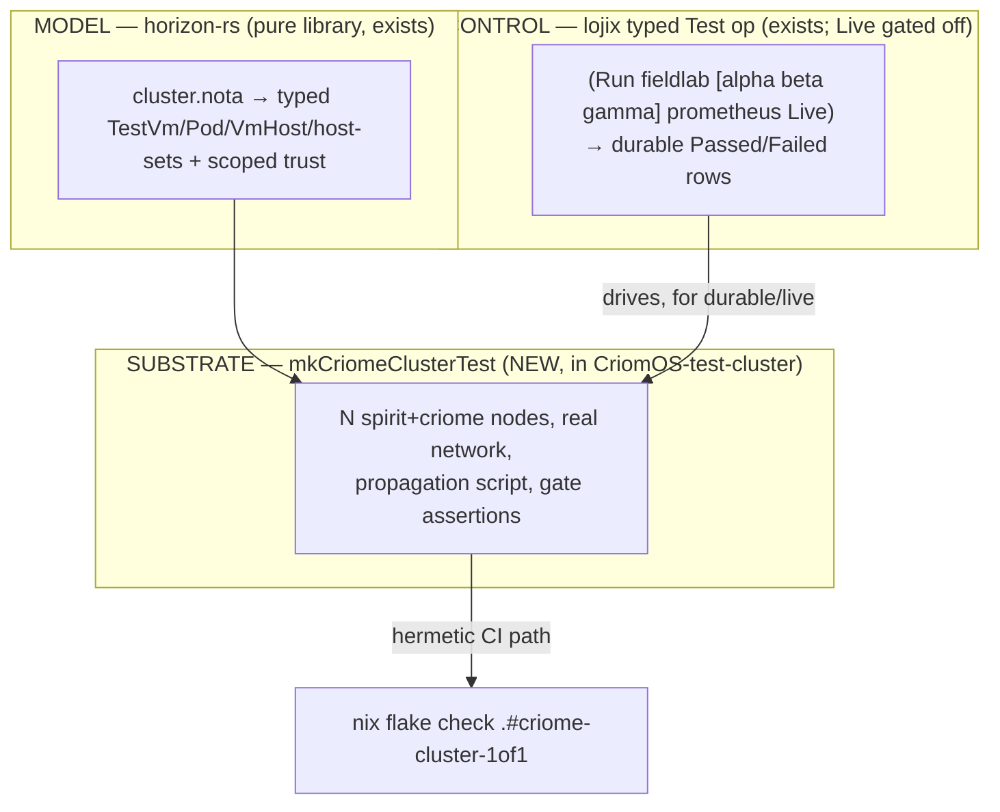

# 704-2 — A reusable networked criome test cluster: design + plan

One interface, three substrates, the spirit gate proven on the wire. This is
the designer synthesis: the workflow's draft design corrected by the adversarial
completeness critic, then re-grounded by the designer against the dossiers in
`1-dossiers-evidence.md`. Evidence lives there; this file is the decision.

## 0. The ask and the precondition

A *fully tested* criome cluster = *actually networked* sandboxes (not in-process
mocks), the *spirit gate authenticated* end-to-end, through *one easily-reusable
interface* targeting prometheus VMs and DigitalOcean droplets.

**Precondition, off-lane:** production Spirit is down — the generation activated
03:14 today runs a migrator that rejects the live v10 store; `main` HEAD
(`f1bc797`) recognizes v10. The store is intact; the fix is a system-maintainer
redeploy (`0-frame-and-method.md:38-54`). The **headline near-term deliverable
(Stage A on a branch) does not depend on this** — it needs no live Spirit. Only
intent capture and the `durable`/`live` substrates on real hosts are blocked.

## 1. Inventory — reuse the shape, build the criome content

The honest headline: **the reusable-generator pattern, the substrate profile,
the 3-proof gate template, and the DO lifecycle all exist and are proven; what
does not exist is the criome+spirit-shaped instance of them and the cross-machine
rungs that put a REAL criome on the wire.** Grow from scaffold; the scaffold just
encodes the wrong component today.

### Reuse as-is (proven, load-bearing)

| Asset | Why reusable |
|---|---|
| `mkVmTest.nix` generator + auto-pickup | The exact "author writes a small decl → get a `runNixOSTest` check" shape, cluster-data-driven |
| `mkDeployTest.nix` 2-node pattern | The only existing multi-node networked test; solves offline build, `<node>.<cluster>.criome` DNS, ssh-ng host-key trust, silent-daemon polling |
| `test-substrate.nix` profile | One bake-once profile of every live-run guest fix; `substrate → {guestModule, vmTypeModule}` |
| spirit 1-of-1 gate (LANDED) | Real, fail-closed, real blst BLS, real socket — `criome_gate.rs:141` |
| `criome_gate_1of1.rs` 3-proof shape | The single-host template to lift cross-kernel: authorized-ships / denied-holds / unconfigured-holds |
| horizon-rs typed cluster model | The schema a cluster test authors (TestVm / Pod / VmHost / host-sets / scoped trust) |
| **lojix typed `Test` op** | A durable, push-based, validated control plane already shaped for this — `(Check/Run … mode)` → durable rows; **Live mode stubbed-off, not absent** |
| prometheus VmHost + policy | Designated VM-test host in cluster data; gpuPassthrough decision settled |
| cloud DO adapter | Working create/observe/destroy lifecycle, mock/Http swap, credential-by-handle, idempotent teardown |

### Build-new (the gap to fully-tested)

| Missing piece | Scope (corrected) |
|---|---|
| **`mkCriomeClusterTest` generator** | The headline: N interconnected spirit+criome nodes from one decl. New. |
| **criome/spirit/signal-criome flake inputs** | The test-cluster pins old `persona-spirit`, not the gate-bearing `spirit`, and has no `criome`. Input migration, not just addition. |
| **Per-component NixOS service modules** | criome/spirit/router/mirror each: NOTA→rkyv `ExecStartPre`, `ExecStart <daemon> <config.rkyv>`. The hardest reuse work — §5. |
| **E1 cross-criome transport LANE** | **Narrowed:** the wire vocab (`RouteSignatureRequest`/`SubmitSignature`) and local actor routing already exist; only the daemon-to-daemon *network* lane is missing (`transport.rs` is Unix-only). |
| **E4 cross-socket router push** | `publish()` returns the delivery set in-process; nothing pushes the ref to a remote spirit. |
| **E5 fetch-by-digest mirror restore** | `RestoreQuery` is store-name-only; acquire-exactly-D needs locate-by-digest + `HeadNotHeld`. |
| **CriomeForwardVerifier reconciliation** | Replace router's FNV identity stub so "real BLS over a real hop" is honest. |
| **DO → NixOS bring-up layer** | Droplet boots stock Ubuntu; **bias to nixos-anywhere** (cloud's own Phase-2 lean, `hetzner.rs:10`) + a `DesiredHostState` bring-up field. |

## 2. The reusable interface — three layers that compose (resolved fork)

The draft asserted "a new Nix generator IS the interface, lojix a thin layer
below." The critic was right to challenge that: **lojix already owns a typed,
durable, validated test control plane with a (gated-off) Live mode aimed at
exactly this goal.** They are not rivals. The clean architecture is three layers,
each keeping its existing job:



- **Author surface (what a human/agent writes):** a small declaration —
  `{cluster, members, components, contract, substrate, propagation}` — fed to
  `mkCriomeClusterTest`. For hermetic CI that is a `nix flake check` target; for
  `durable`/`live` it is submitted through lojix's existing typed
  `(Run … mode)` op, which already validates node/host selection against the
  real projection and records durable results. **The new generator is the
  thing-under-test and the assertion harness; lojix is the orchestrator;
  horizon-rs is the model.** No layer is inverted; each does what it already does.

```nix
# CriomOS-test-cluster/lib/mkCriomeClusterTest.nix  (the single entry point)
mkCriomeClusterTest {
  cluster     = "fieldlab";                       # synthetic, never goldragon
  members     = [ "alpha" "beta" "gamma" ];       # criome member set: 1 → 1-of-1, 3 → 2-of-3
  components  = [ "criome" "spirit" "router" "mirror" ];
  contract    = ./contracts/two-of-three.nota;    # admitted quorum contract (NOTA)
  substrate   = "hermetic";                        # "hermetic" | "durable" | "live"
  propagation = ''
    # python testScript — IDENTICAL across all three substrates:
    # drive spirit.alpha working-write → assert AuthorizedObjectReference fans out
    # → beta/gamma acquire exactly head D; then negative: a threshold-short head
    # is Denied and never ships.
  '';
}
```

Internally the generator: projects each member via horizon-rs; applies
`test-substrate`'s `guestModule` (never re-typing guest fixes); attaches the
per-component service modules (§5); derives the peer-routing table from the
member set (socket names are predictable hashes of peer master pubkeys —
Dossier 1); seeds each criome (`RegisterIdentity` + `AdmitContract`, the
`LocalCriomePolicy::seed` shape pointed at member sockets); runs the propagation
script. `nodes.<member>` is a `genAttrs members` fold of mkVmTest's single
`nodes.${vmNode}`.

## 3. Substrate strategy — one interface, three backends

The `substrate` arg is a 3-valued axis; **the `propagation` script is
byte-identical across all three** — only node-realization changes.

| Dimension | `hermetic` (default, CI gate) | `durable` | `live` |
|---|---|---|---|
| Node realization | `runNixOSTest` q35 guests on the driver vlan | `microvm.nix` TestVm, `autostart=false`, real taps | DO droplets via `cloud` daemon |
| Network | driver's internal vlan (single-HOST) | host tap from `VmHost.guest_subnet` | real internet + DO private network |
| Peer address | per-node Unix socket (co-located guests) | per-node Unix socket + tap IP | **TCP host:port (needs E1 lane)** |
| Cost / speed | free, hermetic, seconds–minutes | free, persistent, host-touching | ~sub-cent–$/run, minutes |
| Intent | Spirit `7let` host-untouched | Spirit `77ic` (conflicts `7let`) | L3 manual acceptance |
| Cross-machine? | NO (cross-KERNEL only) | NO (one host) | **YES** |

**The cross-machine peer ADDRESS is the honest dividing line.** Hermetic and
durable run guests on one host, so criome peers reach each other over per-node
Unix sockets (or tap IPs) — they prove **cross-kernel** behavior (separate
guests, real sockets, real BLS) but **not cross-machine routing**. Only `live`
(and real-host L3) crosses machines, and that is exactly what the missing E1
transport lane carries: a TCP `host:port` connector for `RouteSignatureRequest`,
derived from each member's projected address. So: hermetic/durable are
runnable now (cross-kernel); `live` waits on E1.

**Input migration (critic-caught, load-bearing):** the test-cluster flake pins
`persona-spirit` (the OLD name) and has no `criome`. Stage A requires migrating
that input to the current `spirit` repo (the one holding `criome_gate.rs`) and
adding `criome` + `signal-criome`. This is a flake-input change, not a no-op
addition — the gate does not exist in the pinned `persona-spirit`.

**DO bring-up = nixos-anywhere (biased by prior art, not an open choice).**
`cloud/src/hetzner.rs:10` already names nixos-anywhere as the Phase-2 direction;
DO should follow it: kexec-install over SSH against the fresh droplet, keyed off
the returned IP. Add one `DesiredHostState` bring-up field (no back-compat
concern, pre-production). **Cost/teardown guard, mandatory from the first live
run:** the generator's `substrate=live` path wires the DO adapter's idempotent
teardown + `Drop` guard as a guarantee, plus a hard `max-N` droplet cap, so a
failed run cannot leak money. The keep-warm reuse pool (Spirit `6ks1`) is a
later cost optimization, not a v1 requirement.

## 4. The end-to-end test — what "fully tested" asserts

Real daemon **processes** across **separate kernels**, fail-closed by
construction, a positive AND negative witness per constraint. It must NOT call
`engine.gate_and_ship_head()` directly and must NOT use the FNV stub.

### Stage A — 1-of-1 local gate, proven cross-kernel (the xhwa near-term target)

`members = ["alpha"]`, one-member `Threshold(1)` contract. **No criome
quorum-code change** — criome's majority rule already admits n=1,k=1. Lift
`criome_gate_1of1.rs`'s three proofs from cross-thread to cross-kernel:

1. **Positive:** spirit.alpha working-write → captures head D → asks co-resident
   criome over the real socket → `Authorized` → head ships, emitted
   `AuthorizedObjectReference` digest **== D**; durability
   `QueuedForMirror → ServerCommitted`.
2. **Negative (denied):** threshold-short head → `Denied` → no ship, stays
   `QueuedForMirror`.
3. **Negative (unconfigured):** unconfigured criome → held back (fail-closed).

The single change from today's test: drive the **spirit-daemon binary** so the
gate runs inside `handle_working_input` over the wire, criome on a **separate
guest kernel**.

**Honest scope (critic correction):** Stage A proves *the interface works and
the 1-of-1 gate is real cross-kernel* — the near-term production posture (xhwa).
It does **not** prove cross-machine quorum or cross-machine routing; that is
Stage B. "Stage A proves the whole loop end-to-end" would be an overclaim — it
proves the single-host cross-kernel half.

### Stage B — multi-node quorum, proven networked (jk1w / p3td)

`members = ["alpha" "beta" "gamma"]`, `Threshold(2,3)`. Red-but-honest until the
rebuild items land. Must prove: criome.alpha aggregates **real BLS signatures
from beta/gamma over the wire** (true 2-of-3, not co-resident self-quorum); the
ref is **delivered across machines** (E4); spirit.beta/gamma **acquire exactly
D** (E5) or fail `MirrorRestoreHeadMismatch`; and the negatives —
denied/unreachable holds end-to-end, impostor-key rejected, clock-skew rejected,
durable-replay-across-restart honored.

**Unblock-the-blocker inside the test:** build missing pieces in the fixture, do
not stub. Before E1 exists, Stage B asserts the *honest failure* (no
cross-machine fan-out) so it never fakes green — a red Stage B that fails
honestly is the correct interim state.

### Definition of "fully tested" (the exit gate the draft lacked)

The criome cluster is **fully tested** when, on CI's authorized host:
1. Stage A (1-of-1) is **green hermetic** (cross-kernel, daemon-process gate).
2. Stage B (2-of-3) is **green hermetic** cross-kernel (real BLS quorum across
   guests; E1/E4/E5/CriomeForwardVerifier landed).
3. Every Stage-B **negative witness** (denied, unreachable, impostor-key,
   clock-skew, durable-replay) is green.
4. The `live` substrate runs Stage A green on real DO droplets **once,
   on-demand** (proving cross-machine), with teardown verified.
5. The real-host L3 2-of-3 (prometheus+ouranos+zeus) passes a manual acceptance
   run.

Items 1 is reachable now; 2-3 gate on the operator chain; 4-5 gate on bring-up +
deploy. "Fully tested" is item 3 for hermetic correctness, item 5 for production
acceptance.

## 5. Per-component NixOS service module design (the hardest reuse piece)

Each `components` entry maps to a NixOS module the generator attaches per node.
Because **daemons take exactly one rkyv startup arg and never parse NOTA**, every
module follows one shape (the router two-kernel `*-encode-configuration` /
`-bootstrap` template):

```
systemd.services.<component> = {
  serviceConfig.ExecStartPre =
    "<component>-encode-config <node-config.nota> <runtime>/config.rkyv";   # deploy-time NOTA→rkyv
  serviceConfig.ExecStart =
    "<component>-daemon <runtime>/config.rkyv";                              # one rkyv arg, no flags
};
```

What the generator derives per component from cluster data:
- **criome:** socket path (per-Unix-user, 9s52), the admitted `contract`, this
  node's keypair, and the peer-routing table (peer socket = hash of peer master
  pubkey). The seed step (`RegisterIdentity`+`AdmitContract`) runs post-start.
- **spirit:** its SEMA store path, the **criome socket path to gate against**
  (this is the "arm the gate" config, flowing through spirit's meta-signal
  `Configure`, not process args), and the mirror endpoint.
- **router:** the fan-out interest table (who subscribes to
  `AuthorizedObjectReference`).
- **mirror:** the fetch endpoint + restore policy.

Each component-config is itself authored as NOTA and encoded to rkyv at
`ExecStartPre` — so the generator emits typed NOTA per node and the deploy step
binarizes it before the daemon sees it. This is the one place the generator does
real per-component work; everything else is a fold over the member set.

## 6. Implementation plan — ordered, lane-owned

Lane discipline: designer designs + prototypes on `next`/feature branches in
`~/wt`; operator owns code-repo `main` + rebase; system-operator /
system-maintainer own host + deploy.

**Phase 0 — unblock (system-maintainer, before anything live).**
0. Redeploy spirit from current `main` (recognizes the v10 store), restoring
   intent capture workspace-wide and the path to record the parked Spirit
   `Decision`. **Owner: system-maintainer.**

**Phase 1 — designer prototypes hermetic NOW (branch; no live host, no E1).**
1. Migrate the test-cluster flake input `persona-spirit → spirit`; add `criome`
   + `signal-criome`. **Owner: designer (branch).**
2. `mkCriomeClusterTest.nix` — the generator, `nodes.<member>` fold,
   `test-substrate` reuse, `{members,components,contract,substrate,propagation}`.
   **Owner: designer (branch).**
3. Per-component service modules (criome, spirit) — §5. **Owner: designer
   (branch) → operator lands.**
4. **Stage A test (1-of-1 cross-kernel)** — lift the 3 proofs to two guests
   driving the spirit-daemon binary. First green deliverable; proves the
   interface + the 1-of-1 gate cross-kernel. **Owner: designer (branch) →
   operator (main).**
5. Declare criome member nodes + the 1-of-1 and 2-of-3 contracts in
   `fieldlab.nota`. **Owner: designer (branch).**

**Phase 2 — operator builds the cross-kernel rungs (code-repo main).**
6. E1 cross-criome **transport lane** (TCP `host:port` connector for the
   existing `RouteSignatureRequest`/`SubmitSignature` vocab). **Owner: operator.**
7. E2 cluster-root admission ceremony surface. **Owner: operator builds;
   system-operator runs per machine.**
8. E4 cross-socket router push of `AuthorizedObjectReference`. **Owner: operator.**
9. E5 fetch-by-digest mirror restore (`RestoreQuery` + target head +
   `HeadNotHeld`; designer specs the signal-mirror contract). **Owner: operator.**
10. CriomeForwardVerifier reconciliation (kill the FNV stub). **Owner: operator.**
11. E3 multi-machine quorum + E6 aggregate verify. **Owner: operator.**
    → As 6-11 land, Stage B (hermetic cross-kernel) goes green.

**Phase 3 — substrates beyond hermetic.**
12. `durable` substrate — wire `substrate=durable` to the microvm TestVm path;
    depends on clearing the clavifaber/nota-derive breakage + /128 route bug
    (149). **Owner: system-operator/system-maintainer (host); designer wires the knob.**
13. DO NixOS bring-up (nixos-anywhere) + `DesiredHostState` field + private-net
    fields. **Owner: operator (cloud code) + cloud-operator (deploy).**
14. `live` substrate — `substrate=live` to the DO backend with the mandatory
    teardown guard + max-N cap. **Owner: cloud-operator; designer wires the knob.**

**Phase 4 — real-host acceptance (L3).**
15. 2-of-3 on prometheus + ouranos + zeus (decided). **Owner: system-operator
    deploy; cluster-operator acceptance.**

**Existing-test regression note (critic-caught):** adding criome/signal-criome
inputs and a new generator to an auto-pickup (`genAttrs`) flake changes the
every-commit check surface. Phase 1 must confirm no impact on existing checks
(`projections-match-fieldlab`, `lojix-deploy-smoke`, `vm-*`,
`vm-testing-prometheus-policy`) and name the new checks `criome-cluster-*` so
they are discoverable and host-gated like the other VM checks.

**What designer can branch-prototype immediately: Phase 1 (items 1-5)** —
hermetic-only. Stage A green on a branch is the proof the interface works.

## 7. What the adversarial pass corrected

The completeness critic verified the load-bearing claims against the repos and
forced these corrections, all folded in above:
- **Interface fork argued, not asserted** — lojix is the control plane, the new
  generator the substrate/assertion layer; they compose (§2).
- **E1 narrowed** — the wire vocab + local routing exist; only the cross-machine
  transport lane is missing (§1, §3, §6).
- **spirit/persona-spirit input migration** surfaced as load-bearing (§1, §3, §6).
- **DO bring-up biased to nixos-anywhere** by the repo's own prior art (§3, §6).
- **Stage A overclaim removed** — it proves the cross-kernel 1-of-1 half, not the
  whole loop (§4).
- **"Fully tested" given a concrete exit gate** (§4).
- **Per-component service modules designed**, not just named (§5).
- **Cross-machine peer address** made explicit (§3).
- **Live cost/teardown guard + max-N cap** made mandatory v1, not deferred (§3).
- **Existing-test regression** enumerated (§6).

## 8. Open forks for the psyche

Genuine decisions, surfaced in chat via structured options:
1. **Spirit redeploy** — who/when (it blocks all intent capture).
2. **prometheus default — the `7let`/`77ic` intent conflict** — hermetic-only
   (host-untouched) vs a durable microvm node on prometheus.
3. **Implementation appetite now** — start Phase 1 hermetic prototype on a branch
   vs design-review first.
4. **DO scope** (chat, has a default) — on-demand manual only, strict
   create-and-destroy, low cost ceiling; flag if a CI soak run is wanted instead.
