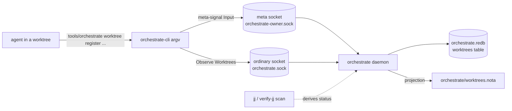

# 707-3 — Orchestrate-tool worktree registry (design pass for Decision `eh5a`)

Stream C. DESIGN ONLY — no build, no commit in this wave. This report
specifies the worktree registry that realizes Decision `eh5a` (agents
register every worktree in the orchestrate tool; lifecycle = merge /
archive (manifest for GC) / recycle (rebase on main)), tools the
Principle `kb4k` (track every worktree; periodic archive passes), and
sits inside the `oust` worktree-path convention
(`~/wt/github.com/LiGoldragon/<repo>/<feature>/`).

## What the orchestrate tool already is

The single most important finding for this design: `tools/orchestrate`
is not a bash tool with lock files. It is a thin shim
(`/home/li/primary/tools/orchestrate`, 21 lines) that execs the
`orchestrate-cli` Rust binary, which is itself a **compatibility surface
over a long-lived typed daemon** — the `orchestrate` component triad at
`/git/github.com/LiGoldragon/orchestrate` + `signal-orchestrate` +
`meta-signal-orchestrate`. The daemon owns durable state in a
`sema_engine` (redb-backed) store at `orchestrate/orchestrate.redb`; the
`orchestrate/*.lock` files are a **projection** the daemon writes for
humans, not the source of truth. `roles.list` is a transitional
bash-readable mirror of a typed lane registry the daemon already keeps in
its `lane_registry` table.

This collapses the migration concern stated in the task. The "implement
in orchestrate-cli now, port to persona-orchestrate later" framing
(`w190`/`tz5j`/`udgu`) is *already* the shape of the live system: the CLI
projects typed contract requests onto the daemon. So the worktree
registry should be designed as **daemon-owned typed state from the start**,
with the CLI as its argv front door — exactly how claims, lanes, and the
repository index already work. There is no throwaway bash version to
build and discard.

The decisive precedent is `StoredRepository` in the daemon's
`tables.rs`: a typed record (`name`, `path: WirePath`, `active: bool`,
`refreshed_at: TimestampNanos`) in a `repositories` table, populated by a
`RepositoryRegistry` that scans `/git/github.com/LiGoldragon`, projected
out over the **meta** socket via `RefreshRepositoryIndexOrder` →
`RepositoryIndexRefreshed`. The worktree registry is the same pattern
applied to `~/wt`, with one addition: worktree records carry a lifecycle
status the agent drives, not just a passive scan.



## 1. Record schema

The worktree record lives in the daemon as a typed `StoredWorktree`
(rkyv `Archive`/`Serialize`/`Deserialize`, the same derive set every
table value carries), and in the contract as a `Worktree` payload type
in `signal-orchestrate` (so it can be observed) plus the order/ack types
in `meta-signal-orchestrate`. Fields, every identifier a full English
word per the workspace naming override:

| Field | Type | Source | Meaning |
|---|---|---|---|
| `repository` | `RepositoryName` (newtype over `String`) | agent | repo the worktree belongs to (e.g. `criome`); matches a `repositories`-table key |
| `branch` | `BranchName` (newtype) | agent | the jj bookmark / feature branch (e.g. `client-approval-runtime`) |
| `path` | `WirePath` | agent (resolved) | absolute worktree path, e.g. `/home/li/wt/github.com/LiGoldragon/criome/client-approval-runtime` |
| `owning_lane` | `LaneIdentifier` | infrastructure (the calling lane) | which lane created it — reuses the existing lane identity type |
| `purpose` | `ScopeReason` | agent | one-line why; reuses the existing single-line-reason type already used by claims/activity |
| `status` | `WorktreeStatus` (enum) | agent + derived | `Active` \| `Merged` \| `Archived` \| `Recycled` |
| `pushed_state` | `PushedState` (enum) | derived from jj | `Unpushed` \| `Pushed` \| `AncestorOfMain` |
| `created_at` | `TimestampNanos` | store-minted | infrastructure mints time, never the agent (ESSENCE rule) |
| `updated_at` | `TimestampNanos` | store-minted | last lifecycle transition |

`WorktreeStatus` is the lifecycle from `eh5a`:

```text
enum WorktreeStatus { Active, Merged, Archived, Recycled }
```

`PushedState` separates "merged into the work" (a `status` the agent
asserts) from "where the branch sits relative to its remote and main" (a
fact derived from jj). This split matters: a worktree can be `Active`
(agent still using it) but already `AncestorOfMain` (operator integrated
it) — the GC pass needs both signals. The daemon can derive
`pushed_state` for free: `verify_jj.rs` already computes exactly these
booleans per bookmark — `has_remote` (→ `Pushed`) and `ancestor_of_main`
(→ `AncestorOfMain`), plus `age_days` for staleness. The worktree
registry should consume that existing machinery rather than re-shell jj.

Naming notes honoring the override: the type is `Worktree` and its store
form `StoredWorktree` (parallel to `Repository`/`StoredRepository`),
never `WorktreeRecord` or `WorktreeEntry` — the table name carries the
"record" sense. Fields are bare (`path`, `branch`, `purpose`), not
`worktreePath` / `branchName` / `worktreePurpose`. `RepositoryName` and
`BranchName` are introduced as validated newtypes (no whitespace, no path
separators in the branch token) rather than bare `String`, matching how
`LaneIdentifier`, `TaskToken`, and `RoleToken` are all validated wire
newtypes in `signal-orchestrate`.

### Record key

The store key is `repository|branch` (mirroring `ClaimKey`'s
`role|scope` composite, which is the established keying idiom in
`tables.rs`). One worktree per (repo, branch) pair — registering the same
pair upserts, which is correct for `recycle` (rebase-on-main keeps the
same repo+branch, transitions status). Path is a field, not the key,
because recycle can keep the path while the branch's relationship to main
changes, and because two registrations of the same branch at different
paths is the error we want an upsert-on-key to fold, not silently
duplicate.

## 2. Command surface on orchestrate-cli

New `worktree` subcommand group, verb style matched to the existing
`claim` / `release` / `status` / `verify-jj` argv surface (positional
args, `--` to introduce a free-text reason, no flags — the workspace
forbids flags on component processes and the CLI keeps that discipline):

```text
tools/orchestrate worktree register <repository> <branch> <path> -- <purpose>
tools/orchestrate worktree list [<repository>]
tools/orchestrate worktree update <repository> <branch> <status>
tools/orchestrate worktree archive <repository> <branch>
tools/orchestrate worktree recycle <repository> <branch>
tools/orchestrate worktree unregister <repository> <branch>
tools/orchestrate worktree scan
```

- **`register`** — the creation hook. Projects to a meta-signal
  `RegisterWorktreeOrder`. `<path>` is normalized the same way claim
  scopes are (`NormalizedScope`/lexical-resolve → `WirePath`). The lane
  is taken from the invoking identity, not an argument (consistent with
  how release takes only the role and the daemon knows the rest). Status
  starts `Active`; `created_at`/`updated_at` store-minted.
- **`list`** — read-only, projects to an **ordinary**-socket
  `Observe(Worktrees)` (an addition to the existing `Observation` enum,
  joining `Roles` and `Lanes`). Optional repository filter. This is the
  one verb on the working socket because it is observation, not
  substrate mutation — same boundary that puts `status` (observe) on the
  ordinary socket and role/lane creation on the meta socket.
- **`update`** — generic status transition (`<status>` ∈ `active |
  merged | archived | recycled`); `archive` and `recycle` are sugar for
  the two transitions agents use most, so the lifecycle reads cleanly in
  shell history and in the AGENTS protocol prose.
- **`archive`** — transition to `Archived`; this is the verb a periodic
  GC pass and the kb4k "archive the branches and dismantle the trees"
  step call. It does **not** delete the tree (non-destructive at the
  registry layer); a separate operator/maintainer step dismantles the
  filesystem worktree after the manifest records the archive.
- **`recycle`** — transition to `Recycled` and re-stamp `updated_at`;
  the rebase-on-main lifecycle from `eh5a`. The agent does the actual
  `jj rebase` in the worktree; this records the decision.
- **`unregister`** — retract the record (the rare "registered by
  mistake / never really a tracked tree" escape; normal end-of-life is
  `archive`, which keeps the record for the GC manifest).
- **`scan`** — meta-signal `RefreshWorktreeIndexOrder`: the daemon walks
  `~/wt/github.com/LiGoldragon/<repo>/<feature>/`, reconciles discovered
  trees against the table (adds untracked ones as `Active` with an
  empty/auto purpose, refreshes `pushed_state` for all via the
  `verify_jj` machinery), and writes the manifest projection. This is the
  exact analogue of the existing `Refresh` → `RepositoryIndexRefreshed`
  repository scan. It is what makes the registry self-healing when an
  agent forgets to `register`.

After every mutating verb the CLI re-prints the worktree list (mirroring
how `claim`/`release` re-print lock state), so the agent sees the table
it just changed.

## 3. Where the data lives and its format

**Source of truth:** a new `worktrees` table in the daemon's existing
`orchestrate.redb` store (`TableName::new("worktrees")`, registered in
`OrchestrateTables::open` alongside `claims`, `roles`, `lane_registry`,
`repositories`). This is binary rkyv inside the sema engine — consistent
with every other piece of orchestrate state, transactional, and already
backed up / versioned by the engine's `VersioningPolicy`.

**Human/agent-readable projection:** `orchestrate/worktrees.nota`, a
typed-NOTA file the daemon rewrites on every worktree mutation (the same
way it projects `<lane>.lock` files). NOTA, not the per-lane `.lock`
plain-text format, because a worktree record is a multi-field structured
value — the `.lock` files are deliberately flat (one scope per line) and
would lose the schema. A NOTA projection is positional records the agent
can read and that round-trips back through the contract. Sketch (records
are positional, type-first, no labels — per the NOTA override):

```text
;; orchestrate/worktrees.nota — daemon projection, do not hand-edit
(Worktrees
  [(Worktree criome client-approval-runtime
     /home/li/wt/github.com/LiGoldragon/criome/client-approval-runtime
     operator [client-approval runtime + witnesses]
     Active AncestorOfMain 1718900000000000000 1718986400000000000)
   (Worktree mentci egui-daemon-signal
     /home/li/wt/github.com/LiGoldragon/mentci/egui-daemon-signal
     designer [mentci-egui daemon-state subscription views]
     Active Unpushed 1718900000000000000 1718900000000000000)])
```

Bracketed `[...]` only where a string needs delimiters (the `purpose`
free text); bare atoms everywhere else (`criome`, `Active`, the path).
The projection is a convenience read surface and a GC input; the redb
table remains canonical, so a corrupt or stale `.nota` is regenerated by
`worktree scan`, never trusted over the store.

## 4. Reconciliation with stream B (the GC manifest)

**The GC manifest and the worktree registry are the same artifact —
`orchestrate/worktrees.nota` is the manifest, derived from the
`worktrees` table.** There is no second file. This is the single
coherent shape the task asks for, and it falls out naturally because the
registry already carries every field a GC pass needs:

- **What B audits, C records.** Stream B's audit of ~50 worktrees across
  ~25 repos produces, per tree: repo, branch, path, owning lane,
  merged?, unpushed work?, stale?, classification (merge / archive /
  recycle / keep-active). Every one of those maps onto a `StoredWorktree`
  field: `repository`/`branch`/`path`/`owning_lane` directly;
  "merged?" → `pushed_state = AncestorOfMain`; "unpushed work?" →
  `pushed_state = Unpushed`; "stale?" → derivable from `updated_at` /
  jj `age_days`; the classification → the target `status`.
- **B is the first bulk population of C's table.** B's audit is run once
  as the seed: each ratified classification becomes a `register` (for
  trees not yet tracked) plus an `update`/`archive`/`recycle` to the
  decided status. After that, `worktree scan` keeps the table in sync and
  agents `register` at creation time, so the manifest stays live instead
  of needing a fresh hand audit each GC pass.
- **The GC manifest view** the periodic archive pass consumes is simply
  `worktree list` filtered to `status = Archived` (or `Merged` +
  `AncestorOfMain`) — the trees whose work is captured and whose
  filesystem trees are safe to dismantle. "Archived" in the registry is
  precisely "named in the GC manifest." A maintainer's GC step reads that
  filtered view, dismantles each tree, then `unregister`s (or the daemon
  drops archived records past a retention window during `scan`).

So B does not propose a separate manifest format; B's deliverable is the
classification data, and C's registry is where that data lives. The
report-3 (this) / report-2 (B) boundary is: B decides the verdicts, C
defines the schema and the verbs that store them.

## 5. Lifecycle — how an agent registers and transitions

At worktree **creation** (designer cutting a feature branch under `~/wt`,
per the `oust`/`feature-development` flow):

```text
# after: jj new main@origin / setting up the worktree
tools/orchestrate worktree register criome client-approval-runtime \
  /home/li/wt/github.com/LiGoldragon/criome/client-approval-runtime \
  -- [criome client-approval runtime + witnesses]
```

This is the standard step the task asks to make protocol — it belongs in
`skills/feature-development.md` and `skills/jj.md` as a required action
right after creating a worktree, alongside the existing claim discipline.

Through the **lifecycle** (the three `eh5a` outcomes):

- **merge** — operator integrates the branch into main. Either the agent
  runs `worktree update criome client-approval-runtime merged`, or the
  next `worktree scan` flips `pushed_state` to `AncestorOfMain` and the
  agent confirms with `merged`. Then the work is captured; archive
  follows.
- **archive** — `worktree archive criome client-approval-runtime`. The
  idea/work is captured into a report (kb4k: "gather ideas into reports
  then archive the branches"); the record stays as the GC-manifest entry;
  the filesystem tree is dismantled by a later maintainer GC step.
- **recycle** — `worktree recycle criome client-approval-runtime`. The
  agent rebases the existing tree on main for new work; the record's
  `branch`/`path` persist, `status` → `Recycled` → back to `Active` on
  the next `register`/`update` for the new task, `updated_at` re-stamped.

Non-destructive guard: the registry never deletes a filesystem worktree.
`archive`/`unregister` only mutate the record. Tree dismantling stays an
explicit operator/maintainer action, gated (like the existing
`release_guard` / `verify-jj`) on no unpushed non-ancestor work —
`pushed_state = Unpushed` on an archive candidate is the blocker the GC
pass must surface before any `rm`.

## 6. Persona-orchestrate migration note

Because the registry is daemon-owned typed state from day one, the
"migration" is just where the verb names settle, not a rewrite:

- **Contract types** (`Worktree`, `WorktreeStatus`, `PushedState`,
  `RepositoryName`, `BranchName`) land in `signal-orchestrate` (the
  observable `Observe(Worktrees)` → `WorktreesObserved` reply) and the
  order/ack types in `meta-signal-orchestrate`
  (`RegisterWorktreeOrder` / `UpdateWorktreeStatusOrder` /
  `RefreshWorktreeIndexOrder` → `WorktreeRegistered` /
  `WorktreeStatusSet` / `WorktreeIndexRefreshed`). These are the typed
  surface persona-orchestrate consumes verbatim; nothing is CLI-private.
- **Store** is the existing sema engine; bump
  `ORCHESTRATE_SCHEMA_VERSION` (currently `2`) when the `worktrees` table
  is added — the engine's versioning policy handles the migration, and
  the no-backward-compatibility override means breaking the store shape
  pre-production is fine.
- **CLI argv** (`worktree register/list/...`) is the only transitional
  surface. When `persona-orchestrate` supersedes `tools/orchestrate`, the
  argv front door is reimplemented against the same contract — the
  daemon, tables, and meta/ordinary channel split are unchanged. The
  mapping is 1:1: each argv verb is already defined as a contract
  operation, so the port is "expose these operations through the new
  front end," not "redesign the data model."
- **roles.list parallel:** worktree registration follows the same
  trajectory as the lane registry — bash-mirror now (`roles.list` ↔ the
  `.nota` projection), typed daemon table as the destination. The
  `worktrees.nota` projection is the worktree analogue of `roles.list`'s
  eventual `roles.nota`.

## Implementation plan (for the later build wave — not this wave)

1. **Contract first.** Add `Worktree` + `WorktreeStatus` + `PushedState`
   + `RepositoryName`/`BranchName` newtypes to `signal-orchestrate`;
   extend `Observation` with `Worktrees` and `Reply` with
   `WorktreesObserved`. Add the order/ack types and channel operations to
   `meta-signal-orchestrate`. Regenerate the schema (`schema/lib.rs` is
   `@generated by schema-rust-next`).
2. **Store.** Add the `worktrees` `TableReference<StoredWorktree>` to
   `OrchestrateTables`; methods `worktree_records`,
   `insert_worktree` (upsert on `repository|branch` key),
   `set_worktree_status`, `remove_worktree`, `replace_worktrees` (for
   `scan`) — modeled directly on the `repositories` and `lane_registry`
   methods already there. Bump `ORCHESTRATE_SCHEMA_VERSION`.
3. **Registry + scan.** A `WorktreeRegistry` struct (parallel to
   `RepositoryRegistry`) that scans `~/wt/...`, reconciles, and derives
   `pushed_state` by reusing the `verify_jj` bookmark logic. Add the
   `worktrees.nota` projection (parallel to `LockProjection`).
4. **Daemon handlers.** Wire the new ordinary `Observe(Worktrees)` and
   meta `Register/Update/Refresh` operations through
   `OrchestrateService` / the meta service path, alongside the existing
   role/lane/repository handlers.
5. **CLI.** Add the `worktree` subcommand group to
   `orchestrate-cli/src/bin/orchestrate.rs` and a `worktree.rs` module
   (request construction parallel to `request.rs`), routing `list` to the
   ordinary socket and the mutating verbs to the meta socket. Extend
   `usage()`. New typed `Error` variants for worktree-specific failures.
6. **Tests.** A `tests/worktree.rs` integration test (parallel to
   `tests/registry.rs` / `tests/claim_release.rs`): register → list →
   update → archive round-trips against a tempfile store.
7. **Protocol prose.** Add the register-at-creation step and the
   merge/archive/recycle verbs to `skills/feature-development.md`,
   `skills/jj.md`, and `orchestrate/AGENTS.md` so the registry is the
   standard agent worktree protocol `eh5a` calls for.

## Open questions for the orchestrator

- **Lane attribution on `register`.** The CLI knows the invoking lane
  only by argument today (claim/release take the lane positionally). Do
  we pass `owning_lane` as an explicit first arg (consistent with
  claim/release), or does the daemon infer it from `SO_PEERCRED` /
  environment? Consistency argues for an explicit lane arg now; the
  peercred path is the persona-orchestrate-era refinement.
- **Archived-record retention.** Should `scan` auto-drop `Archived`
  records whose filesystem tree is gone (self-cleaning manifest), or keep
  them as a permanent ledger until explicit `unregister`? Proposal:
  keep until the tree is dismantled, then drop on the next `scan` that
  finds the path missing — so the manifest is exactly "trees that still
  exist and are archivable" plus a short tail.
- **B/C sequencing.** Confirm B's audit output lands as the seed
  population script (a batch of `register`/`update` calls) rather than a
  standalone markdown manifest — this report assumes the registry *is*
  the manifest, so B should emit classification data in a form C's verbs
  can ingest.
