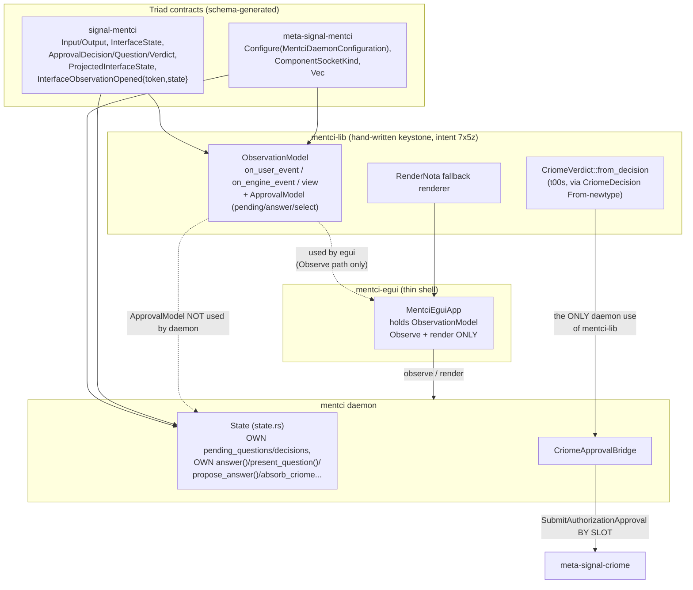
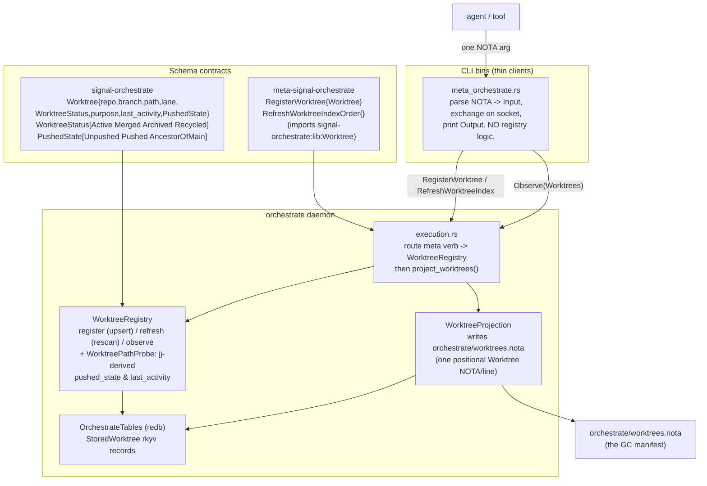

# 708-1 — Size & architecture

## Totals

Nine repos in this sweep: 4,456 hand-written LOC against 2,859 generated LOC and 99 tests. The split is the architecture in miniature — every working/meta signal contract (`signal-mentci`, `meta-signal-mentci`, `signal-orchestrate`, `meta-signal-orchestrate`, `signal-criome`) carries the bulk of its line count as schema-emitted code (`// @generated by schema-rust-next`, refreshed via `build.rs` + `expect_fresh()`), with hand-authored Rust confined to a thin `src/lib.rs` ergonomics layer. The two daemons (`mentci`, `orchestrate`) and the two consumers (`mentci-lib`, `mentci-egui`) carry zero generated code by design: they consume the contracts, they don't emit them.

| Repo | Hand-written LOC | Generated LOC | Tests |
|---|---:|---:|---:|
| mentci-lib | 756 | 0 | 9 |
| signal-mentci | 164 | 1,713 | 5 |
| meta-signal-mentci | 195 | 694 | 4 |
| mentci | 1,336 | 0 | 15 |
| mentci-egui | 501 | 0 | 1 |
| signal-orchestrate | 303 | 85 | 33 |
| meta-signal-orchestrate | 83 | 157 | 5 |
| orchestrate | 1,083 | 150 | 37 |
| signal-criome | 35 | 60 | 20 |
| **TOTAL** | **4,456** | **2,859** | **99** |

Two daemons dominate hand-written volume (`mentci` 1,336, `orchestrate` 1,083); the contract repos dominate generated volume (`signal-mentci` alone is 1,713 generated lines, 60% of the total). Test density is lopsided toward the orchestrate side (`signal-orchestrate` 33, `orchestrate` 37, `signal-criome` 20) — the mentci cluster's 34 tests cluster in the daemon and library, with `mentci-egui` at a single test.

## Architecture: mentci cluster

A five-repo re-founding around intent 7x5z — `mentci-lib` is meant to be the ONE shared model reused by the daemon AND every thin client. The triad (`signal-mentci` working contract, `meta-signal-mentci` meta-policy contract, `mentci` daemon) is structurally clean and schema-generated as the rules demand. The keystone claim — the daemon shares the same model so canonical and painted state cannot drift — is the part that does not hold up.

### What's coherent

- The triad boundary is clean and rule-conformant. `signal-mentci` and `meta-signal-mentci` are wire-only, schema-generated (`build.rs` + `expect_fresh()`), with hand-written ergonomics confined to `src/lib.rs`. `meta-signal-mentci` correctly carries the `Configure` verb plus the `ComponentSocketKind`/`Vec<ComponentSocket>` generalization, and the daemon decodes binary startup + indexes sockets by kind (`DaemonConfiguration::component_socket_path` over `ComponentSocketKind::{Mentci, MetaCriome}`). One-argument CLI and binary-only daemon discipline holds.
- The cross-contract `CriomeVerdict` consolidation (t00s) is genuinely realized and genuinely shared. The daemon's old private `map_decision` match is gone; `criome_bridge.rs:40` now calls `mentci_lib::CriomeVerdict::from_decision`. The approve/reject/defer projection lives in exactly one place, consumed by the daemon — a real, verified de-duplication.
- The deferred `signal-standard` cross-import is documented honestly in schema comments (`StandardSocket`/`ComponentKind` as local stand-ins with named collapse targets) rather than silently forked. Approval is always BY SLOT, never resubmitting by value (gc0n/p43g honored).

### What's incoherent (the headline gap)

- **mentci-lib is NOT the one shared model.** The daemon depends on mentci-lib but uses exactly one symbol — `CriomeVerdict`. `state.rs` reimplements its own pending-question queue, its own `answer()` (with the same Defer-keeps-pending rule), its own `present_question`/`propose_answer`, its own criome-parked absorption. So `ObservationModel` and `ApprovalModel` — the literal heart the crate doc-comment names — have NO production caller. There are two independent approval state machines (`State::answer` vs `ApprovalModel::answer`) that drift trivially because nothing forces them to agree. The "canonical and painted state cannot drift" guarantee is unbacked.
- **egui does not prove the model the way the delta claims.** The declared "proving consumer" calls `on_user_event` only with `UserEvent::Observe` (`app.rs:72`). There is no answer button, no select gesture, no propose-edit control. `ApprovalModel::answer`/`select` are exercised only by mentci-lib's own unit tests. egui validates the read/render/socket-row slice plus the NOTA renderer — real, but a fraction. The approval state machine (the largest module, ~305 LOC) has zero non-test callers across all five repos.
- Net: the re-founding deleted a dead skeleton and built a clean, well-typed, well-tested *library* that is largely orphaned on the write path. Report 707-1's "mentci-lib was orphaned" finding is only half-closed: egui now consumes the observation/render surface, but the daemon still owns a private duplicate of the approval/MVU core that mentci-lib exists to be the single copy of. To realize 7x5z, the daemon's `State` approval logic should be replaced by `mentci_lib::ApprovalModel`, and egui should route answer/select gestures through `on_user_event`.

## Architecture: worktree-registry cluster

Intent eh5a — agents register worktrees; lifecycle merge/archive/recycle; `worktrees.nota` IS the GC manifest. This cluster is built as a proper triad extension of the existing orchestrate daemon, and the daemon-owned-state + thin-CLI shape is realized cleanly.

### What's coherent

- **Genuinely daemon-owned typed state with a thin CLI.** `WorktreeRegistry` owns the redb `worktrees` table via `OrchestrateTables`; `StoredWorktree` is the rkyv storage type with clean `From<Worktree>`/`From<StoredWorktree>` bridges. `meta_orchestrate.rs` only parses one NOTA argument into the schema `Input`, exchanges it on the socket, and prints the reply — zero registry logic leaks into the client.
- **The triad cross-import is clean.** `meta-signal-orchestrate` imports `signal-orchestrate:lib:Worktree` rather than redefining it, so the meta order `RegisterWorktree { Worktree }` carries the working-contract record directly. No duplicate vocabulary.
- **`worktrees.nota` IS the GC manifest, daemon-written.** `WorktreeProjection::project` renders one positional `Worktree` NOTA record per line, and `execution.rs` (lines 441-450) calls `project_worktrees()` after every `RegisterWorktree` and `RefreshWorktreeIndex` — the manifest is daemon-maintained, never agent-written, an explicit sibling of the existing `LockProjection`/`.lock` mechanism.
- **Infrastructure-minted facts stay infrastructure-minted.** `register()` discards any agent-supplied `last_activity`/`pushed_state` and re-derives both from `jj` via `WorktreePathProbe` (pushed_state from `@-::main` ancestry + remote check; last_activity from committer timestamp). Agents supply only what they legitimately know.

### What's incoherent (one real gap, one minor leak)

- **The lifecycle half of eh5a is contract-only, not behavior.** `WorktreeStatus [Active Merged Archived Recycled]` exists as a typed enum and can be set, but there is NO daemon-side lifecycle logic — no archive/recycle/merge/prune/reap function anywhere in `orchestrate/src/`. Transitions happen only by an agent re-registering the same worktree with a different status; the daemon never promotes status from the `PushedState::AncestorOfMain` evidence it holds at scan time, never garbage-collects, never recycles. The manifest is a GC *input*; the GC itself is unbuilt.
- **`refresh()` is lossy against `register()`.** A full re-scan rewrites every worktree as `WorktreeStatus::Active` with a synthetic `"scanned worktree <branch>"` purpose and an `unknown` owning lane, clobbering richer registered status/purpose/lane. The code comments this honestly ("the scan is a discovery floor, registration the authoritative source"), but with no merge between scan-discovered and registered rows, a `RefreshWorktreeIndex` after registrations silently demotes Merged/Archived worktrees back to Active and erases ownership — actively fighting the lifecycle intent. Refresh should reconcile against existing records, not replace them wholesale.

## Logic in one paragraph per repo

- **mentci-lib** (`/git/github.com/LiGoldragon/mentci-lib`) — Hand-written keystone library consuming the live contracts. `ObservationModel` is an MVU core (`on_user_event`/`on_engine_event` → `Vec<Cmd>`, pure `view()`) keyed by `ComponentSocketKey(u8)` over `ComponentSocketKind`, holding one `SocketObservation` per socket; `ApprovalModel` is the client-side approval state machine (pending queue, selection cursor, answered log, local subscription fan-out) over signal-mentci's own `ApprovalQuestion`/`ApprovalVerdict` vocabulary; `decision::CriomeVerdict::from_decision` is the closed-decision → criome authorization mapping (t00s); `render::RenderNota` is the blanket NOTA-fallback renderer. No generated code, no `build.rs`.
- **signal-mentci** (`/git/github.com/LiGoldragon/signal-mentci`) — The working wire contract: schema-generated `Input`/`Output` roots, `InterfaceState`, `ProjectedInterfaceState`, the `InterfaceObservationOpened { token, state }` observe reply, the closed `ApprovalDecision` verdict enum, and the `MentciEvent` stream. Hand-written `src/lib.rs` adds Mentci-facing type aliases, the `string_accessor!` macro over 16 string newtypes, constructors, and the reader methods (`InterfaceState::pending_questions`, `ProjectedInterfaceState::pending_questions`, etc.) that pierce the `pub(crate)` field-wrappers so consumers can project state back out.
- **meta-signal-mentci** (`/git/github.com/LiGoldragon/meta-signal-mentci`) — The meta policy contract: the single privileged verb `Configure(MentciDaemonConfiguration)` with `Configured`/`ConfigurationRejected`/`RequestUnimplemented` replies. Headline type `ComponentSocketKind { Mentci, MetaMentci, Criome, MetaCriome }` and a `Vec<ComponentSocket>` generalize the daemon from fixed positional sockets to N self-describing component sockets; hand-written `MentciDaemonConfiguration::component_socket(kind)` is the linear lookup. `StandardSocket`/`ComponentKind` are documented stand-ins for the not-yet-existing `signal-standard` crate.
- **mentci** (`/git/github.com/LiGoldragon/mentci`) — The Kameo-actor Unix-socket daemon over length-prefixed rkyv `MentciFrame`s, plus its one-argument thin CLI. `Daemon`/`BoundDaemon` wrap a `StateOwner` actor over `State` (its own pending_questions, decisions, answer proposals, subscriptions, `criome_request_slots`); `CriomeApprovalBridge` dials criome's meta socket to fetch parked authorizations, fold them into the pending queue (`absorb_criome_parked_authorizations`), and submit verdicts BY SLOT via the shared `CriomeVerdict::from_decision`. The CLI's `CriomeCommand` handles `criome:parked` / `criome:approve|reject|defer:<slot>`; the `mentci-write-configuration` bin encodes a typed `Configure` rkyv frame for binary startup.
- **mentci-egui** (`/git/github.com/LiGoldragon/mentci-egui`) — Thin egui/eframe GUI client holding a `mentci_lib::ObservationModel`. It registers shell gestures via `on_user_event` (only `UserEvent::Observe` today), dispatches the resulting `Cmd`s over signal-mentci, folds daemon pushes back through `on_engine_event`, and paints `view()` plus the `RenderNota` transcript. Rendering and request dispatch only — no approval logic, and currently no answer/select/propose UI.
- **signal-orchestrate** (`/git/github.com/LiGoldragon/signal-orchestrate`) — The orchestrate working-signal contract: the request/reply/event vocabulary for claim/release/handoff, role/lane/worktree observation, and activity log. Carries the `Worktree { repo, branch, path, lane, WorktreeStatus, purpose, last_activity, PushedState }` record plus the `WorktreeStatus [Active Merged Archived Recycled]` and `PushedState [Unpushed Pushed AncestorOfMain]` enums. `src/lib.rs` is the canonical hand-written contract; `src/schema/lib.rs` is the `@generated` mirror built from `schema/lib.schema`.
- **meta-signal-orchestrate** (`/git/github.com/LiGoldragon/meta-signal-orchestrate`) — The orchestrate meta policy signal. Defines the meta orders `RegisterWorktree { Worktree }` and `RefreshWorktreeIndexOrder {}`, importing `signal-orchestrate:lib:Worktree` directly rather than redefining the working record — the clean cross-import that keeps the registry vocabulary single-sourced.
- **orchestrate** (`/git/github.com/LiGoldragon/orchestrate`) — The orchestrate daemon. `execution.rs` routes each meta verb to `WorktreeRegistry` (register = upsert with jj-derived facts via `WorktreePathProbe`; refresh = full rescan; observe = projection), persists `StoredWorktree` rkyv records in the redb `worktrees` table via `OrchestrateTables`, then calls `project_worktrees()` to (re)write `orchestrate/worktrees.nota` as the daemon-owned GC manifest. Lifecycle status exists as data but has no enacting transition logic yet, and `refresh()` does not reconcile against registered rows.
- **signal-criome** (`/git/github.com/LiGoldragon/signal-criome`; audited in worktree `/home/li/wt/github.com/LiGoldragon/signal-criome/signal-criome-peers`) — The working-signal leg of the criome triad: the schema-generated criome wire vocabulary the mentci daemon consumes for client-approval bridging (parked authorizations, authorization request slots). Small hand-written surface (35 LOC) over a 60-LOC generated contract, but heavily tested (20 tests) for its size.
