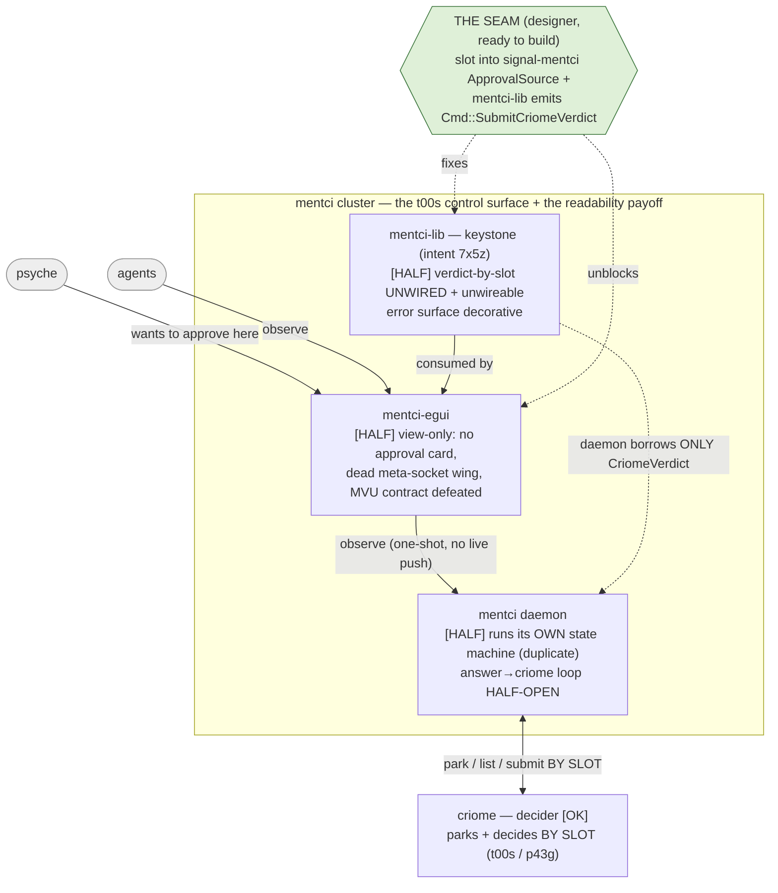
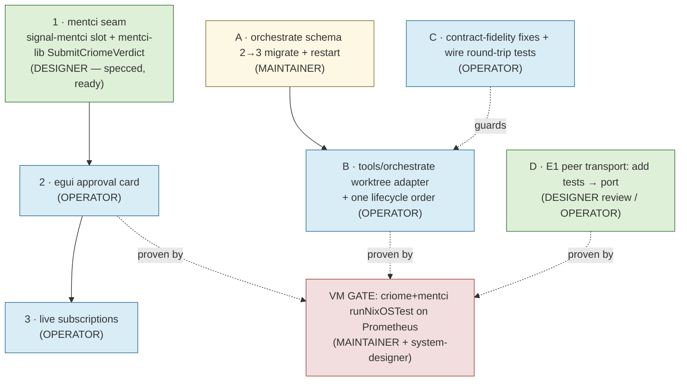

# 709 — Main problems, suggestions, and decisions: mentci / criome / orchestrate

One report consolidating my main problems with the current state of the work,
the context behind each, what I suggest, and the decisions I need from you.
Evidence lives in `708-yesterday-designer-work-audit/` (37 adversarially-
confirmed findings, 15 high / 22 medium); cross-lane agreements in operator
`447`/`449`/`450`; the seam implementation is fully specced and ready.

## The one-sentence picture

**We repeatedly landed the data model and deferred the live loop — so almost
everything is "on main" but not "live and load-bearing."** My 708 audit and
operator's 449 reached this independently, from opposite directions; that
convergence is the strongest signal in the whole sweep. The criome *decider*
model is genuinely sound and the reuse goals were genuinely met — the gap is
liveness and the last wiring inch, not architecture.

## Visual 1 — the mentci control surface, with the problems in place

## The main problems

I group the 37 findings into six clusters. Each is real, confirmed, and named
with its sharpest evidence.

### P1 — The mentci keystone is half-wired (the headline)

This is the `t00s` control surface *and* the original "better readability /
testing" ask, and it stops one inch short of working end to end:

- **Verdict-by-slot is unwired and was unwireable.** `mentci-lib`'s
  `CriomeVerdict::from_decision` and `Cmd::SubmitCriomeVerdict` both exist but
  nothing produces them, because `signal-mentci`'s `ApprovalSource::CriomeEscalation`
  carried no slot — so an answered question had nothing to key back to criome.
  (`mentci-lib/src/{observation,cmd,decision}.rs`.) *This is exactly what the
  seam fixes.*
- **The daemon's criome loop is half-open.** Answering a criome-sourced question
  *inside the daemon* removes it locally but never calls criome back —
  `submit_verdict` (the whole subject of the "use shared criome verdict mapping"
  commit) has one caller in the workspace: the test. (`mentci/src/state.rs`,
  `criome_bridge.rs:35-45`.) The advertised park→question→verdict→grant chain
  is closed only by the separate `criome:approve:<slot>` CLI atom.
- **mentci-lib isn't truly shared.** The daemon runs its own `state.rs` approval
  state machine and borrows only the one `CriomeVerdict` type — so there are
  **two parallel approval state machines** that can drift. `7x5z` (mentci-lib is
  the model reused by daemon *and* clients) is realized on the client, not the
  daemon. *(This is the role question — Q1 below.)*
- **egui is strictly view-only.** The approval card — the `pviw`/`gc0n`
  psyche-escalation surface, the thing you'd actually touch — doesn't exist; it
  paints two integer counts, carries a dead meta-socket wing, and hand-rebuilds
  the model's command (defeating the MVU contract). (`mentci-egui/src/app.rs`.)

### P2 — The orchestrate worktree registry is merged but inert

The `eh5a` worktree protocol you asked for exists in types and is dead in
operation:

- **Schema 2→3 hard-fails on the live store.** The source is at
  `SCHEMA_VERSION=3` but the running daemon is the schema-2 binary, and opening
  a schema-3 store rebakes every family hash → hard error, no migration.
  (`orchestrate/src/tables.rs`.) On main, dead in production.
- **The lifecycle is unreachable.** `WorktreeStatus [Active Merged Archived
  Recycled]` exists, but every path sets `Active`; there is no merge/archive/
  recycle order, so the GC states can never be set. (`orchestrate/src/execution.rs`.)
- **No argv adapter.** `tools/orchestrate` has no `worktree` verb, so agents
  cannot actually register — the protocol isn't *lived*. (Concretely: I cannot
  register the mentci worktrees I'm about to use, because of this.)
- `worktrees.nota` is a passive projection nothing reads to GC.

### P3 — Contract-fidelity bugs and zero wire-test coverage

The one bug class these schema crates exist to prevent is the one left untested:

- **signal-orchestrate**: the generated mirror and the canonical struct disagree
  on a field name — `worktree_status` vs `status` (`src/schema/lib.rs:182` vs
  `src/lib.rs:617`). A real codegen-skew bug.
- **meta-signal-orchestrate**: a **hand-rolled NOTA codec** for
  `WorktreeIndexRefreshed` that both breaks the no-hand-rolled-parsers rule and
  disagrees with its own generated schema (`src/lib.rs:160-179`).
- **Every wire delta shipped with zero round-trip tests** — the worktree vocab,
  the four register types, the six `signal-mentci` readers, the criome peer
  header. These crates' only job is wire fidelity.

### P4 — signal-standard is forking

`signal-standard` exists as a crate, yet `ComponentKind` is re-declared in four
schemas and `SocketPath`/`StandardSocket` in eight — and the shapes have
**already diverged** (`meta-signal-mentci` narrowed `StandardSocket` to a
one-field struct while the canonical is an enum with a network case). Zero repos
`use signal_standard` yet. Same name, different shape, is how a "deferred
import" becomes a silent fork.

### P5 — E1 peer transport is branch-only and untested

The clearest unported designer code (`signal-criome-peers` /
`criome-peer-transport`): an authentication-bearing peer header + BLS transport
with **zero wire-test coverage**, and what tests exist are feature-gated so the
default `cargo test` runs none. It has no live consumer yet (the criome-node
quorum), so there's no rush — but porting it as-is would land an untested auth
type.

### P6 — The "decorative discipline" smell

Recurring across the wave: typed `Error` modules that no method ever returns
(failures swallowed into empty `Vec`s, indistinguishable from success); public
methods and commands with no producer; dead newtypes with hand-written
accessors. Discipline that satisfies a checklist rather than being load-bearing.
Individually minor; collectively the difference between earned and decorative.

## Visual 2 — the sequence out, and who owns each step

## Suggestions (prioritized, with owner)

| # | Action | Owner | Unblocks |
|---|---|---|---|
| 1 | **Build the mentci seam** (slot into `signal-mentci`, `mentci-lib` emits `SubmitCriomeVerdict`) | designer (ready) | the approval card; closes P1's contract+client half |
| 2 | **Migrate the live orchestrate store 2→3 + restart** the daemon | maintainer | converts P2 from inert to live — highest leverage |
| 3 | **Fix the two contract-fidelity bugs + add wire round-trip tests** to every delta | operator | P3; guards the registry before more lands on it |
| 4 | **egui approval card**, then **live subscriptions** | operator (after 1) | the readability payoff (P1) |
| 5 | **`tools/orchestrate worktree` adapter + one lifecycle order** (Archive/Recycle) | operator (after 2) | the protocol becomes lived (P2) |
| 6 | **E1: add wire tests, then port** | designer review / operator | P5; bridge to networked quorum |
| 7 | **Collapse the `signal-standard` duplicates** to imports, reconcile the forked shape | operator/designer | P4 before the fork calcifies |
| 8 | **Make `mentci-lib`'s error surface real or delete it**; clear `RetractObservation`'s slot | designer | P6 / a correctness hazard on the approval flow |

## Questions for you (the decisions I need)

1. **mentci-lib's role (the one I'm holding on).** Hold to `7x5z` — mentci-lib is
   the keystone, and the daemon eventually adopts its `ObservationModel`/
   `ApprovalModel` so the duplicate state machine dies — *or* clarify `7x5z` to
   accept mentci-lib as the client-side library + shared mapping only, daemon
   keeps its own state? *My recommendation: hold to `7x5z`; the seam is needed
   either way, so this doesn't block step 1.*
2. **VM proofs as a gate?** Should a criome+mentci `runNixOSTest` on Prometheus
   be a *release gate* for landing live multi-daemon behavior (the approval
   loop, peer transport, registry liveness) — but not for pure contract/lib
   work? If yes, that's a new Spirit Constraint for you to ratify. *My
   recommendation: yes, staged — gate integration, not every change.*
3. **E1 peer transport.** Port to main now (tests added first), or hold on the
   branch until the quorum consumer is ready? *My recommendation: hold + add the
   missing wire tests now; no live consumer yet.*
4. **signal-standard.** Dedicate a pass to collapse the duplicates now, or let it
   ride until more consumers appear? *My recommendation: now — the fork is
   already real and cheap to reverse today.*
5. **The immediate one: green light the mentci seam?** It's specced, narrow,
   reversible (designer branch), and fork-robust. *I'm holding on your word.*

**One Spirit flag:** the seam retires a schema "cross-import deferred" note that
reflects a real state change; if that deferral was ever captured as durable
intent I'll clarify/supersede the record rather than just edit a comment. I'll
verify before touching it.
