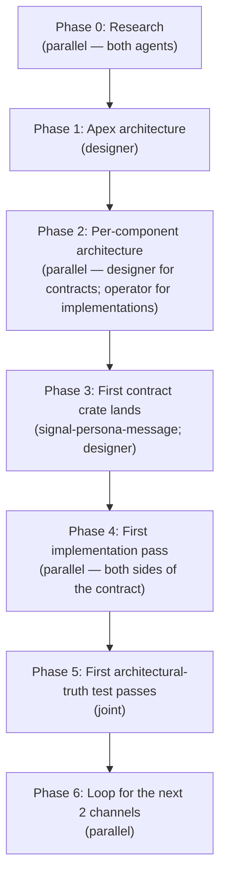
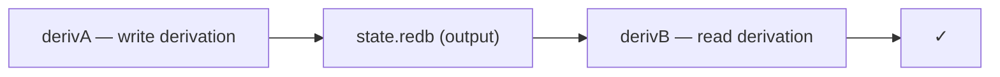

# 71 · Parallel implementation plan — choreographed via per-channel Signal contracts

Status: detailed plan for **designer + operator working in
parallel** to land the messaging stack (per
`designer/70`'s phased plan), choreographed through
**per-channel signal-persona-* contract repos**.

The pattern: each component-to-component channel gets its
own contract repo; the contract is what agents agree on
*first*; both sides are then implementable in parallel.
**No code lands before architecture is revamped.**

Author: Claude (designer)

---

## 0 · TL;DR



| Concern | Mechanism |
|---|---|
| Parallel work without conflict | Per-channel signal-persona-* contracts as the synchronization point; designer owns contracts, operator owns implementations |
| Architecture before code | Phases 0-2 produce arch docs; Phase 3 starts code |
| Discipline re-read | Mandatory **before-coding read** check in `skills/autonomous-agent.md` extension |
| Tidiness | Channel-by-channel contract extraction = continuous tidying of signal-persona's wide module list |
| Coherence | Apex `persona/ARCHITECTURE.md` + the channel inventory = the shared mental model |

| Phase | Owner | Effort | Outputs |
|---|---|---:|---|
| 0 — Research | parallel | 1-2 days | per-crate cheat sheets |
| 1 — Apex arch | designer | 0.5 day | revamped `persona/ARCHITECTURE.md` |
| 2 — Per-component arch | parallel | 1-2 days | 9 ARCHITECTURE.md files current |
| 3 — First contract crate | designer | 0.5 day | `signal-persona-message` repo + records + tests |
| 4 — First implementation | parallel | 2-3 days | message-cli emits frame; persona-router consumes |
| 5 — Architectural-truth test | joint | 0.5 day | nix-chained writer/reader passes |
| 6 — Channels 2 + 3 | parallel | 4-6 days | signal-persona-system + signal-persona-harness |

**Total to first messaging end-to-end: ~10-15 days**, with substantial parallelism saving wall-clock time.

---

## 1 · The choreography pattern

### 1.1 · Why per-channel contracts

Today: one wide `signal-persona` crate (916 LoC, 12 modules)
holds every record kind for every channel. Any change
touches the whole vocabulary, and operator's parallel work
in persona-router blocks designer's contract refinements.

Tomorrow: each component-to-component channel gets its own
`signal-persona-<channel>` contract repo:

```mermaid
flowchart LR
    msg["message-cli"] -->|signal-persona-message| router["persona-router"]
    sys["persona-system"] -->|signal-persona-system| router
    router -->|signal-persona-harness| harness["persona-harness"]
    harness -->|signal-persona-harness (replies)| router
```

Each contract repo:
- Pins the closed enum of message kinds for that channel
- Pins the Frame envelope reused from signal-core
- Has its own version-skew guard
- Has its own AuthProof variants (if narrow)
- Has its own tests (round-trip per record kind)
- Has one owner (the agent who claims it for editing)

### 1.2 · The agent handoff

```mermaid
sequenceDiagram
    participant D as designer
    participant C as signal-persona-&lt;channel&gt; (contract)
    participant O as operator

    D->>C: claim + edit + push (new record kind, e.g. SendMessage)
    D->>O: pushed; bead-comment or in-channel notification
    O->>C: pull
    O->>O: implement producer side (e.g. message-cli emits SendMessage)
    O->>O: implement consumer side (e.g. persona-router handles SendMessage)
    O->>O: architectural-truth tests fire
    O->>D: status report (bead comment or short report)
```

When operator finds a design gap during implementation:

```mermaid
sequenceDiagram
    participant O as operator
    participant R as reports/operator/&lt;N&gt;
    participant D as designer
    participant C as signal-persona-&lt;channel&gt;

    O->>R: file implementation-consequences report
    R->>D: designer reads
    D->>C: contract update (claim + edit + push)
    D->>O: design-response notification
    O->>O: continue implementation
```

The orchestration claim discipline (`tools/orchestrate
claim ...`) keeps each contract single-writer:

```sh
# designer claims a contract for editing
tools/orchestrate claim designer \
    /git/github.com/LiGoldragon/signal-persona-message \
    -- 'add SendMessage / MessageEvent records'

# operator avoids the contract path; works in their crates
tools/orchestrate claim operator \
    /git/github.com/LiGoldragon/persona-router \
    /git/github.com/LiGoldragon/persona-message \
    -- 'consume signal-persona-message contract'
```

**No overlap** — operator never edits the contract; designer
never edits the implementation crates. Each side moves at
its own pace once the contract is agreed.

### 1.3 · When the contract is "agreed"

A contract is **agreed** when:
1. The closed enum of records is settled for the channel.
2. Each record has a round-trip test (text → typed → text).
3. The crate compiles + `nix flake check` passes.
4. ARCHITECTURE.md describes what the channel is for + its
   boundaries.

Not when:
- Records "look right" — they need test witnesses.
- The operator hasn't yet implemented the consumer — that's
  the next phase, not part of agreement.

The agreement bar is intentionally low (don't pre-design
all kinds; iterate). What matters is that whatever's there
has a falsifiable spec.

---

## 2 · Channel inventory + contract repo plan

### 2.1 · Cross-process channels (need signal contracts)

| # | Producer → Consumer | Contract repo | Records |
|---|---|---|---|
| 1 | message-cli → persona-router | **signal-persona-message** | `Send`, `Inbox`, `Tail`, etc. (CLI verbs as Signal Assertions) |
| 2 | persona-system → persona-router | **signal-persona-system** | `FocusObservation`, `InputBufferObservation`, `WindowClosed` |
| 3 | persona-router ↔ persona-harness | **signal-persona-harness** | `DeliverMessage`, `HarnessObservation`, `InteractionResolution` |

That's 3 contract repos for the messaging stack today. Future channels (signal-persona-orchestrate, signal-persona-store-events for cross-process subscriptions, etc.) can split off as needed.

### 2.2 · In-process library calls (no signal contract)

| Caller → Callee | Mechanism |
|---|---|
| persona-router → persona-sema | typed `Table<K, V>` calls; library, not wire |
| persona-harness ↔ persona-wezterm | PTY transport library; `pty.rs` API |

These don't need contract repos because they're crate-level
Rust APIs, not wire protocols.

### 2.3 · What happens to today's `signal-persona`?

`signal-persona` becomes either:

**Option A — apex umbrella** (recommended): keeps the
universal records that span multiple channels (Lock,
Harness, Authorization, Binding, Deadline). Channel-specific
records (Message, Observation, StreamFrame, Transition)
move to their per-channel contracts.

**Option B — retired**: every record migrates to a
per-channel contract; `signal-persona` becomes empty + gets
deleted. Contract types that span channels live in
signal-core (PatternField is the precedent).

I'd lean Option A pending operator's input — universal
records (Lock, Authorization) genuinely span channels, and
having one home for them avoids forcing them into the
"channel" mold.

**Decision needed in Phase 2.**

### 2.4 · Naming convention

Per `skills/contract-repo.md` §"Naming a contract repo":
- `signal-persona-<channel>` follows the established
  `signal-<consumer>` pattern, scoped further by channel.
- Each is its own repo at `/git/github.com/LiGoldragon/signal-persona-<channel>`.
- Each consumes `signal-core` directly (not via signal-persona).

---

## 3 · Phase 0 — Research (parallel; 1-2 days)

**No code or arch doc edits yet.** The goal is to load
state into both agents' context so the arch revamp is
informed.

### 3.1 · Research items (designer)

| Item | Output | Cross-ref |
|---|---|---|
| Read every signal-persona module; map records to channels | "signal-persona current state" cheat sheet | designer/68 §3.3 |
| Read signal-core; confirm kernel surface | "signal-core current state" cheat sheet | designer/68 §3.2 |
| Read criome's signal usage (signal-forge, signal-arca) | comparison notes — what does criome do that persona should mirror? | criome/ARCHITECTURE.md |
| Re-read designer/4, designer/40, designer/63, designer/64, designer/68, designer/70 | refresher notes | (in this list) |

### 3.2 · Research items (operator)

| Item | Output | Cross-ref |
|---|---|---|
| Read every persona-* crate; for each: what's shipped, what's stubbed, what drifts from designer/4 | per-crate "current state" cheat sheets | operator/67 (use as lens) |
| Read persona-message's polling tail; understand the failure paths | "polling-tail removal" notes | designer/12 |
| Read persona-router's RouterActor; understand the in-memory queue | "ractor migration" notes | skills/rust-discipline.md §"Actors" |
| Re-read operator/52, 54, 61, 67, 69 | implementation-history refresher | (in this list) |

### 3.3 · Joint research (one paired session)

| Item | Output |
|---|---|
| Walk the §10 implementation-review plan from designer/68 (5 phases, ~3 hours) | shared mental map of current state |
| Confirm channel inventory (§2 above) — is 3 contracts the right granularity? | adjust if needed |
| Confirm Option A vs B for signal-persona (§2.3) | decision logged |

### 3.4 · Output of Phase 0

A `reports/designer/<N>-research-pass.md` (mine) and
`reports/operator/<N>-research-pass.md` (operator's), each
naming what was read + key findings. **These reports are
the input to Phase 1.**

---

## 4 · Phase 1 — Apex architecture (designer; 0.5 day)

Revamp `persona/ARCHITECTURE.md` with the new pattern:

### 4.1 · What persona/ARCHITECTURE.md needs

| Section | Content |
|---|---|
| 0 · TL;DR | The 8-component map, the choreography pattern, the messaging-first plan |
| 1 · The choreography model | Per-channel signal contracts; designer owns contracts; operator owns implementations |
| 2 · Channel inventory | The 3 contracts (signal-persona-message, signal-persona-system, signal-persona-harness) + future channels |
| 3 · Component map | The 8 sibling crates + their roles |
| 4 · Wire (signal) | Reference signal-core + signal-persona-* |
| 5 · State (sema) | Reference sema + persona-sema |
| 6 · Runtime topology | The actual process map (which daemons run, what they hold open) |
| 7 · Boundaries | What persona owns vs what each component owns |
| 8 · Invariants | The architectural rules (push-not-pull; commit-before-deliver; safety property; etc.) |
| 9 · Architectural-truth tests | Reference `skills/architectural-truth-tests.md`; list the load-bearing witnesses |
| 10 · See also | The component ARCHITECTURE.md files + relevant designer reports |

### 4.2 · How to revamp

Read the current `persona/ARCHITECTURE.md` (already brief);
rewrite using the structure above. Most content is captured
in designer/68 + designer/70 — this is consolidation into
one apex reference.

### 4.3 · Quality gate

Before commit:
- Re-read `skills/architecture-editor.md` (§"What goes
  where", §"Editing rules")
- Re-read `skills/reporting.md` §"Mermaid — node labels vs
  edge labels" (don't break diagrams again)
- `nix flake check` passes for the persona repo
- Cross-references resolve

---

## 5 · Phase 2 — Per-component architecture (parallel; 1-2 days)

The 9 ARCHITECTURE.md files that need to be current.
**No code yet — just architecture.**

### 5.1 · Designer-owned arch docs (the contracts)

| File | What it describes |
|---|---|
| `signal-persona/ARCHITECTURE.md` | The umbrella crate's role (per Option A); what records live here vs in per-channel repos |
| `signal-persona-message/ARCHITECTURE.md` (new repo) | The CLI ↔ router channel; record kinds; Frame variant |
| `signal-persona-system/ARCHITECTURE.md` (new repo) | The OS-facts channel; observation record kinds |
| `signal-persona-harness/ARCHITECTURE.md` (new repo) | The router ↔ harness channel; delivery + observation record kinds |

For each, structure per `skills/architecture-editor.md`:
- Role
- Boundaries
- Format (the record types)
- Code map
- Invariants
- Cross-cutting context

### 5.2 · Operator-owned arch docs (the implementations)

| File | What it describes |
|---|---|
| `persona-message/ARCHITECTURE.md` | The text-projection layer (becomes message-cli + typed records library) |
| `persona-router/ARCHITECTURE.md` | The routing actor + delivery state machine |
| `persona-system/ARCHITECTURE.md` | OS facts source (NiriFocusSource, future PromptSource) |
| `persona-sema/ARCHITECTURE.md` | Typed-storage layer + persona's table layouts |
| `persona-harness/ARCHITECTURE.md` | Harness actor model |
| `persona-wezterm/ARCHITECTURE.md` | PTY transport library |

For each:
- What this crate is for
- What's currently shipped vs. stubbed
- What signal-persona-* contracts it consumes/produces
- What sema tables it touches
- What architectural-truth tests prove the invariants
- What the next implementation slice is

### 5.3 · Working in parallel

Designer and operator work concurrently on different files.
The orchestration claim keeps them isolated:

```sh
# designer
tools/orchestrate claim designer \
    /git/github.com/LiGoldragon/persona/ARCHITECTURE.md \
    /git/github.com/LiGoldragon/signal-persona/ARCHITECTURE.md \
    -- 'phase 1 + 2 architecture revamp'

# operator (different paths)
tools/orchestrate claim operator \
    /git/github.com/LiGoldragon/persona-message/ARCHITECTURE.md \
    /git/github.com/LiGoldragon/persona-router/ARCHITECTURE.md \
    /git/github.com/LiGoldragon/persona-system/ARCHITECTURE.md \
    /git/github.com/LiGoldragon/persona-sema/ARCHITECTURE.md \
    /git/github.com/LiGoldragon/persona-harness/ARCHITECTURE.md \
    /git/github.com/LiGoldragon/persona-wezterm/ARCHITECTURE.md \
    -- 'phase 2 per-implementation arch revamp'
```

When both finish, **joint review session**: walk through
each file, find inconsistencies, reconcile. The output is
9 ARCHITECTURE.md files that all tell the same story from
different angles.

### 5.4 · Quality gate

Before commit, the editing agent declares:
> *Re-read for this edit: `skills/architecture-editor.md`,
> `skills/contract-repo.md`, `skills/skill-editor.md`,
> `skills/reporting.md` (Mermaid section).*

The declaration goes in the commit message. Auditing
catches missing declarations.

---

## 6 · Phase 3 — First contract crate lands (designer; 0.5 day)

The first new contract repo: **signal-persona-message**.

### 6.1 · The repo's structure

```
/git/github.com/LiGoldragon/signal-persona-message/
├── AGENTS.md
├── ARCHITECTURE.md
├── CLAUDE.md
├── Cargo.toml
├── README.md
├── flake.nix
├── flake.lock
├── rust-toolchain.toml
├── skills.md
├── src/
│   ├── lib.rs       — re-exports
│   ├── frame.rs     — Frame variant for this channel (or use signal-core's Frame directly)
│   ├── send.rs      — SendMessage record
│   ├── inbox.rs     — Inbox query record
│   ├── tail.rs      — Tail subscription record
│   ├── reply.rs     — reply types
│   └── error.rs     — typed error
└── tests/
    └── round_trip.rs — text → typed → text per record kind
```

### 6.2 · The contract creation steps

1. `gh repo create LiGoldragon/signal-persona-message --public`
2. `ghq get -p https://github.com/LiGoldragon/signal-persona-message`
3. Initialize: `Cargo.toml` (deps on `signal-core`, `nota-codec`, `nota-derive`, `rkyv`, `thiserror`); `flake.nix` (crane + fenix; copy from sema's elaborate flake); `rust-toolchain.toml`; `AGENTS.md` (per `skills/skill-editor.md` shim form); `CLAUDE.md` (`@AGENTS.md`); `README.md`; `skills.md` (per-repo skill).
4. Define records (start small — `SendMessage` only)
5. Round-trip tests (text → typed → text)
6. ARCHITECTURE.md per `skills/architecture-editor.md`
7. `nix flake check` (all checks per `sema`'s elaborate flake pattern)
8. Push

### 6.3 · The Phase 3 deliverable

A `signal-persona-message v0.1.0` that compiles, all tests
pass, all nix checks pass, ARCHITECTURE.md describes the
channel + its boundaries. **No consumer or producer code
exists yet** — that's Phase 4.

---

## 7 · Phase 4 — First implementation pass (parallel; 2-3 days)

Operator implements both sides of the contract in parallel
in the existing crates:

### 7.1 · Producer side — message-cli

The current `persona-message` CLI writes text files. The
new shape:

```
message designer "stack test"
  ↓
construct signal_persona_message::SendMessage { from: <ancestry-resolved>, to: "designer", body: "stack test" }
  ↓
encode as Frame
  ↓
write length-prefix + frame bytes to persona-router's UDS
```

The polling tail goes away in Phase 5; for Phase 4, the
priority is "the new path works."

### 7.2 · Consumer side — persona-router

The current `RouterActor` (plain struct) handles
`RouterInput::RouteMessage`. The new shape:

```
length-prefix + frame bytes on UDS
  ↓
decode as signal_persona_message::Frame
  ↓
match on variant (SendMessage / Inbox / Tail)
  ↓
for SendMessage: call into persona-sema (Phase 5 wires this; Phase 4 stub)
```

Phase 4 wires the contract decode + dispatch; the full
storage path lands in Phase 5.

### 7.3 · Architectural-truth tests for Phase 4

| Test | Witness |
|---|---|
| `message_cli_emits_signal_persona_message_frame` | golden bytes: `message X "Y" \| xxd` matches expected length-prefix + rkyv archive |
| `router_decodes_signal_persona_message_frame` | typed test in persona-router/tests; pass a frame, assert `RouterInput::SendMessage` is constructed |
| `message_cli_does_not_write_files` | `lsof` or `strace` witness — only socket writes happen |
| `nexus_cli_equivalent_produces_same_frame` | `message X "Y" == nexus '(SendMessage X "Y")'` byte-equal |

### 7.4 · Parallelism in Phase 4

Designer can work on `signal-persona-system` (Phase 6 prep)
while operator implements the message channel.

---

## 8 · Phase 5 — Architectural-truth test passes (joint; 0.5 day)

The end-to-end nix-chained writer/reader test from
`designer/70 §3.2 phase 6`:



derivA:
- Spawn `persona-router-daemon`
- Run `message designer "phase 5 test"`
- Wait for commit
- Kill daemon
- Output `state.redb`

derivB:
- Open `state.redb` via `persona-sema-reader` (a small CLI
  binary that takes a path + table name + expected value)
- Assert the message landed

If both pass, **the messaging stack is real for one use
case** — every architectural claim has a witness.

---

## 9 · Phase 6 — Loop for next 2 channels (parallel; 4-6 days)

Repeat Phases 3-5 for:

### 9.1 · signal-persona-system

| Item | Notes |
|---|---|
| Records | `FocusObservation`, `InputBufferObservation`, `WindowClosed` |
| Producer | persona-system (NiriFocusSource + future PromptSource) |
| Consumer | persona-router (subscribe-while-blocked pattern per operator/54) |
| Architectural-truth tests | typed event trace; subscription lifetime; no-polling witness via tokio-test |

This channel resolves `primary-3fa` (FocusObservation
contract convergence).

### 9.2 · signal-persona-harness

| Item | Notes |
|---|---|
| Records | `DeliverMessage`, `HarnessObservation`, `InteractionResolution` |
| Producer (router → harness) | persona-router |
| Consumer (router ← harness) | persona-router (observation events) |
| Architectural-truth tests | router commits before deliver; safety property (no inject when prompt occupied + focused) |

This channel enables the safe-delivery pattern from
operator/59 (retired) and operator/67's framing.

### 9.3 · Hygiene fixes interleaved

While the channel work happens, these P2 beads land in
parallel (any agent picks up the next one):

| Bead | Owner |
|---|---|
| `primary-tlu` Persona* prefix sweep | operator |
| `primary-186` ractor refactor (during Phase 4 + 6) | operator |
| `primary-0cd` endpoint enum | operator |
| `primary-4zr` sema kernel hygiene batch | designer (sema is designer's lane) |
| `primary-nyc` Table::iter | designer |

---

## 10 · The discipline re-read mechanism

Force agents to re-skim the relevant skill files **before
each substantive edit**, not just at session start.

### 10.1 · The rule

**Before any code or arch-doc edit, re-skim the skill files
that govern the kind of edit being made.** Declare the
re-read in the commit message.

### 10.2 · Skill files by edit type

| Edit type | Skills to re-skim |
|---|---|
| Rust source code | `rust-discipline.md`, `naming.md`, `abstractions.md`, `architectural-truth-tests.md` (just landed) |
| Test code | `architectural-truth-tests.md`, `rust-discipline.md` §"Tests" |
| Contract repo (signal-persona-*, sema, etc.) | `contract-repo.md`, `architecture-editor.md` |
| ARCHITECTURE.md | `architecture-editor.md`, `reporting.md` (Mermaid section) |
| Design report | `reporting.md` (full), `skill-editor.md` if cross-ref to skills |
| Skill | `skill-editor.md`, `naming.md` (for skill prose) |
| flake.nix | `nix-discipline.md` |
| Cargo.toml (cross-repo deps) | `micro-components.md` §"Cargo.toml dependencies" |
| Daemon / actor / state | `push-not-pull.md`, `rust-discipline.md` §"Actors" + §"redb + rkyv" |
| Commit / push | `jj.md` |
| BEADS task | `beads.md` |
| Repository creation | `repository-management.md` (now with ghq section) |

### 10.3 · How the declaration looks

Commit message footer:

```
designer: signal-persona-message v0.1.0 — first contract crate

Records: SendMessage. Round-trip tests pass. nix flake check
all checks green.

Re-read: contract-repo.md, architecture-editor.md,
skill-editor.md, micro-components.md, nix-discipline.md.
```

The audit catches missing declarations:
- *"Where did you re-read `architectural-truth-tests.md`
  before adding this test?"*
- *"Where did you re-read `push-not-pull.md` before adding
  this loop?"*

The norm is enforceable by review, not by automation.

### 10.4 · Skill update needed

Extend `skills/autonomous-agent.md` §"Required reading
before applying this skill" with a §"Before-each-edit
re-read" subsection. The required-reading list at session
start is necessary but not sufficient; the per-edit re-read
catches drift inside long sessions.

**Action:** I'll land this skill update in Phase 1 (along
with the apex arch revamp).

---

## 11 · Tidying — continuous, by phase

| Tidy item | When |
|---|---|
| Split `signal-persona` into channel repos | Phase 3 (signal-persona-message) + Phase 6 (others) |
| Delete `persona-message`'s polling tail | Phase 5 |
| Migrate `persona-router::RouterActor` to ractor | Phase 4 (during the consumer-side rewrite) |
| Persona* prefix sweep | Phase 4 (interleaved, mechanical) |
| `endpoint.kind` closed enum | Phase 4 (during persona-router rewrite) |
| sema kernel hygiene batch | Designer in Phase 5-6 (in parallel with channel work) |
| Module split sema's lib.rs | Designer in Phase 6 |
| Drop the hard-coded crate list in `skills/operator.md` | Cleanup pass during Phase 1 |

The principle: **tidiness happens as a side effect of every
phase's substantive work**. There's no separate "tidying
sprint" — the work itself produces clean code.

---

## 12 · Cross-agent coherence — the apex doc + bead inventory

What keeps designer + operator on the same page across days
of parallel work:

1. **`persona/ARCHITECTURE.md` (apex)** — the shared mental
   model. Updated whenever the channel inventory or
   component boundaries change.
2. **`designer/68 §11 BEADS inventory`** — the rolling
   work queue. Each agent picks the next item appropriate
   for their lane.
3. **`reports/<role>/<N>-status-update.md`** — per-phase
   status reports (see §13).
4. **The orchestration claim flow** — at any moment, both
   agents can see who's holding what.
5. **The discipline re-read declaration** in commit
   messages — provides audit trail.

If the apex doc + bead inventory + status reports tell
different stories, **stop coding** and reconcile. The
divergence is the failure signal.

---

## 13 · Status reports — per phase

After each phase completes, the lead agent writes a short
report:

| Phase | Report path | Owner |
|---|---|---|
| 0 — Research | `reports/designer/<N>-research-pass.md` + `reports/operator/<N>-research-pass.md` | both |
| 1 — Apex arch | `reports/designer/<N>-apex-arch-revamp.md` | designer |
| 2 — Per-component arch | `reports/designer/<N>-contracts-arch-pass.md` + `reports/operator/<N>-implementations-arch-pass.md` | both |
| 3 — First contract | `reports/designer/<N>-signal-persona-message-v0.1.md` | designer |
| 4 — First implementation | `reports/operator/<N>-message-channel-implementation.md` | operator |
| 5 — Architectural-truth test | `reports/designer/<N>-messaging-stack-end-to-end.md` | joint (designer writes; operator reviews) |
| 6 (per channel) | per-channel implementation reports | operator |

Each report short (~100-200 lines): what was done, what
witnesses fired, what's next.

---

## 14 · Open architectural decisions — surface to user before Phase 2

Phase 2 needs the user to weigh in on:

| # | Question | Phase blocked by |
|---|---|---|
| 1 | signal-persona retains umbrella records (Option A) or fully retires (Option B)? | Phase 2 — affects the per-component arch docs |
| 2 | Is signal-persona-message the right name, or signal-persona-cli? Or signal-message? | Phase 2 — affects the new repo's name |
| 3 | Does the message-cli become its own crate or stay inside persona-message? | Phase 4 — affects the implementation repo |
| 4 | Harness boundary text language — Nexus, NOTA, "PersonaText"? | Phase 6 — only matters for the harness channel |
| 5 | ZST exception for Bind/Wildcard | (deferable; not blocking the messaging stack) |

`primary-kxb` aggregates these. Phase 2 won't start until 1
+ 2 + 3 are answered.

---

## 15 · What kicks off this plan

After this report lands, **before Phase 0 starts**:

1. **User approval** of:
   - The choreography pattern (per-channel contracts; designer owns; operator implements)
   - The phase ordering (research → arch → contract → implementation, no shortcuts)
   - The discipline-re-read mechanism
2. **User decisions** on §14's questions 1, 2, 3
3. **Designer claims** `skills/autonomous-agent.md` to add the before-each-edit re-read section
4. **Phase 0 begins** — research with parallel work

---

## 16 · See also

- `~/primary/reports/designer/68-architecture-amalgamation-and-review-plan.md`
  — the workspace amalgamation; this plan operates on its
  drift register
- `~/primary/reports/designer/70-code-stack-amalgamation-and-messaging-vision.md`
  — the user's messaging-first vision; this plan
  operationalizes it
- `~/primary/reports/operator/67-signal-actor-messaging-gap-audit.md`
  — operator's gap audit; this plan resolves the gaps
- `~/primary/reports/operator/69-architectural-truth-tests.md`
  — the test discipline (lifted to `skills/architectural-truth-tests.md`)
- `~/primary/skills/contract-repo.md` — the kernel-extraction
  + naming convention this plan follows
- `~/primary/skills/architectural-truth-tests.md` — the test
  discipline this plan invokes for every phase
- `~/primary/skills/architecture-editor.md` — the
  ARCHITECTURE.md conventions Phase 2 follows
- `~/primary/skills/repository-management.md` (with new ghq
  section) — repo-creation discipline for the new contract
  crates
- `~/primary/protocols/orchestration.md` — the claim flow
  that keeps parallel work non-overlapping

---

*End report. Awaiting user approval to start Phase 0.*
