# 712 — criome/mentci bootstrap: overview, how it works, and I/O


## The shape in one picture

The stack is a set of single-Unix-user component daemons, each a triad of **daemon + `signal-<c>` (working wire) + `meta-signal-<c>` (meta policy wire)**, schema-derived over `signal-frame` rkyv frames and `sema-engine` storage. The spine is the criome approval flow that mentci serves: **criome verifies and parks; mentci is the human approval organ that projects parked authorizations as questions and routes the human's verdict back.**

```mermaid
flowchart TD
    subgraph criome_daemon["criome daemon (holds master key, identity registry, policy, parked queue)"]
        park["1. Park: ClientApproval mode<br/>AuthorizationEvaluation held by value<br/>behind store-minted AuthorizationRequestSlot"]
        record["6. Record: resolve parked eval by slot,<br/>grant / deny / defer<br/>reply AuthorizationApprovalRecorded"]
    end

    subgraph mentci_daemon["mentci daemon (owns programmable UI state + CriomeApprovalBridge)"]
        absorb["2. Absorb + project<br/>ObserveParkedAuthorizations over MetaCriome socket<br/>admit as pending question<br/>ApprovalSource::CriomeEscalation(slot)<br/>CriomeAccess = ReadWrite"]
        route["5. Route by slot<br/>look up parked slot from CriomeEscalation<br/>map ApprovalDecision -> AuthorizationApprovalDecision<br/>SubmitAuthorizationApproval(slot, decision)"]
    end

    subgraph client["thin client (CLI or egui) — NO criome socket"]
        observe["3. Observe<br/>ObservationModel subscribes<br/>reads ProjectedInterfaceState + criome_access<br/>renders answerable card only when ReadWrite"]
        answer["4. Human answers<br/>ApproveSuggestedAnswer / Reject / Defer<br/>UserEvent::AnswerQuestion<br/>-> AnswerQuestion(ApprovalVerdict)"]
    end

    park -->|ObserveParkedAuthorizations<br/>ParkedAuthorizationSnapshot| absorb
    absorb -->|InterfaceState projection| observe
    observe --> answer
    answer -->|AnswerQuestion(ApprovalVerdict)<br/>to mentci daemon, NOT criome| route
    route -->|meta-signal-criome<br/>SubmitAuthorizationApproval| record
    record -.->|AuthorizationApprovalRecorded| route
```

The request/response wire underneath every hop is binary, not text. The single NOTA string lives only at the CLI/human/agent edge; it is decoded to a typed value before it ever reaches a socket, and the socket only ever carries typed rkyv.

```mermaid
flowchart LR
    argv["argv: one string<br/>(inline NOTA, .nota file, or binary frame file)"]
    parse["NotaSource::parse::<MentciRequest><br/>(nota-next — the NOTA decode boundary)"]
    frame["MentciFrame Request<br/>(signal-frame ExchangeFrameBody)"]
    encode["encode_length_prefixed()<br/>u32 BE length · 8B ShortHeader · rkyv body"]
    sock["UnixStream<br/>(Unix domain socket)"]
    daemon["mentci-daemon<br/>StateOwner kameo actor"]
    reply["reply frame<br/>(length-prefixed rkyv)"]
    out["stdout:<br/>binary frame (raw path)<br/>OR NOTA text (observe path, via RenderNota)"]

    argv --> parse --> frame --> encode --> sock --> daemon
    daemon --> reply --> sock
    reply --> out
```



## Where everything is

Per-repo `INTENT.md`/`ARCHITECTURE.md` and source confirmed; last-commit dates 2026-06-19 to 2026-06-21, all current.

| Component | What it is (one line) | Triad | Current state |
|---|---|---|---|
| **criome** `/git/github.com/LiGoldragon/criome` | Spartan BLS-signature auth/attestation substrate; one Kameo daemon per Unix user holding master key, identity registry, policy table, replay guard, pending-approval queue. *Criome verifies; Persona decides.* | `criome` + `signal-criome` + `meta-signal-criome` | main, current |
| **signal-criome** `/git/.../signal-criome` | Peer-callable wire contract: identity registration, signature envelopes, attestations, `AuthorizeSignalCall`, `ObserveAuthorization`, `ObserveParkedAuthorizations`. Owns `AuthorizationRequestSlot`. | (contract leg) | main, current |
| **meta-signal-criome** `/git/.../meta-signal-criome` | Owner-only meta contract: `Configure(CriomeDaemonConfiguration)`, parked-authorization observation, `SubmitAuthorizationApproval(AuthorizationApproval)` carrying the closed `AuthorizationApprovalDecision`. | (meta leg) | main, current |
| **mentci** `/git/.../mentci` | The human approval organ for the local criome — daemon because the programmable UI state is daemon-owned. Holds pending questions, projects `InterfaceState`, owns `CriomeApprovalBridge` (sole criome-facing approver). | `mentci` + `signal-mentci` + `meta-signal-mentci` | main, current; README stale (see CLI) |
| **signal-mentci** `/git/.../signal-mentci` | Working programmable-UI contract: `PresentQuestion`, `AnswerQuestion(ApprovalVerdict)`, `ObserveInterfaceState`. Re-exports `AuthorizationRequestSlot` into `ApprovalSource::CriomeEscalation`; carries `criome_access: CriomeAccess`. | (contract leg) | main, current; 6th `InterfaceState::new` arg `criome_access` on `re-found-on-live-contracts` |
| **meta-signal-mentci** `/git/.../meta-signal-mentci` | Meta config contract: one verb `Configure(MentciDaemonConfiguration)` — typed component socket endpoints (`Mentci`, `MetaCriome`), persona identity, notification clients. | (meta leg) | main, current |
| **mentci-lib** `/git/.../mentci-lib` | Client-side MVU library (`ObservationModel`, `ApprovalModel`, `RenderNota`) reused by all thin shells; owns `decision::CriomeVerdict::from_decision(slot, decision)`. Not a triad leg. | (client lib of mentci triad) | main, current |
| **mentci-egui** `/git/.../mentci-egui` | Thin egui shell over `mentci-lib`'s `ObservationModel`; paints the approval card, feeds `UserEvent::AnswerQuestion`, has **no** criome socket. Not a triad leg. | (client shell of mentci triad) | `re-found-on-live-contracts` worktree; **test does not build** (dep skew, see GUI) |
| **spirit** `/git/.../spirit` | Production Spirit daemon (intent log); the copyable triad-runtime exemplar — schema-derived Nexus/SEMA, the shape criome/mentci/router/orchestrate follow. | `spirit` + `signal-spirit` (+ meta-signal-spirit) | main, production |
| **signal-spirit** `/git/.../signal-spirit` | Ordinary wire contract: submit psyche statements, observe psyche/intent state, intent-stream subscription. | (contract leg) | main, current |
| **router** `/git/.../router` | Owns routing policy, delivery state, authorized-channel authority; receives channel mutations over `meta-signal-router`, issues delivery + observation deltas; verifies attestations against criome's identity registry. | `router` + `signal-router` (+ meta-signal-router) | main, current |
| **signal-router** `/git/.../signal-router` | Ordinary observation contract + payload-blind router-to-router forwarding envelope (`RoutedContractObject`). | (contract leg) | main, current |
| **orchestrate** `/git/.../orchestrate` | Real triad component replacing the shell orchestration helper: owns role claims, lane registry, activity log, agent-run lifecycle as dynamic data (not closed role enums). | `orchestrate` + `signal-orchestrate` + `meta-signal-orchestrate` | main, current |

## How it works

**Daemon owns state; clients are thin.** Each component's authoritative state lives in its daemon (a Kameo actor over `sema-engine` storage). mentci is a daemon specifically *because the programmable UI state is daemon-owned* — pending questions, the projected `InterfaceState`, and the `CriomeApprovalBridge` all live there. Clients (the `mentci` CLI, mentci-egui) hold only `mentci-lib`'s `ObservationModel` MVU core: they subscribe, receive projections, render, and emit user events. A client never holds approval logic or per-socket state of its own.

**Daemon-routing (decided 2026-06-21).** The client never sees or sends a criome verdict. The client model only ever emits `SendRequest` to the *mentci* daemon (`AnswerQuestion(ApprovalVerdict)`). The mentci daemon — the sole criome-facing approver — looks up the parked `AuthorizationRequestSlot` carried in `ApprovalSource::CriomeEscalation`, maps the closed `ApprovalDecision` to criome's `AuthorizationApprovalDecision`, and submits `SubmitAuthorizationApproval` over the `MetaCriome` socket. The bridge votes on the already-parked, criome-held object **by slot** — it never resubmits an `AuthorizationEvaluation` by value.

**Read-only vs write mode — the `MetaCriome` socket is the switch.** Present ⇒ the daemon holds a criome write bridge ⇒ projects `CriomeAccess::ReadWrite` ⇒ clients render answer controls and verdicts route. Absent ⇒ the daemon still binds and serves ordinary/read-only mentci observations, projects `CriomeAccess::ReadOnly`, and never submits criome verdicts — clients observe parked questions but show no answer controls. In `State::answer`, a question carrying a criome slot answered without the write bridge is rejected with `RejectionReason::UnauthorizedProjection`.

**The one-argument CLI text edge.** This is the component-triad one-argument rule. The `mentci` CLI takes exactly one positional argument (any other count → `Error::ClientArgumentCount`, "expected exactly one Mentci request argument"); no flags. The argument is one of: an observe atom, a `.nota` file path, a binary-frame file path, or inline NOTA text. The matching daemon rule: `mentci-daemon` takes exactly one argument too, and rejects a `.nota` extension (`Error::StartupNotaRejected`) — daemons take only the pre-generated binary `Configure` frame and never parse NOTA. NOTA embeds escape-free inside the shell double quotes because the encoder structurally cannot emit `"`.

## The CLI interaction model

**Is there a basic interaction mode?** The CLI is strictly **one-shot, atom-per-invocation — there is no REPL / read-eval loop.** `main()` calls `ClientCommand::from_environment().run()` once and exits; `run_with_writer` opens one `UnixStream`, writes one request frame, reads one reply frame, writes it out, returns. No `read_line`/stdin loop exists in the client (the only `loop` in the codebase is the daemon's accept loop). The interactive answer surface is the **GUI**, not the CLI.

The recognized atom roster is exactly five observe atoms; every other string falls through to NOTA/file parsing:

| Atom | InterfaceInterest sent | What it projects |
|---|---|---|
| `observe` | `FullInterfaceState` | full: status, notification, panes, pending questions, `CriomeAccess` |
| `observe:full` | `FullInterfaceState` | alias of `observe` |
| `observe:pending` | `PendingQuestions` | pending approval questions only |
| `observe:status` | `StatusOnly` | the status text only |
| `observe:notifications` | `Notifications` | the latest notification only |

The direct `criome:*` atoms have been **removed** from the CLI (commits `cab247b` "route cli observe through shared model" and `25acda3` "route clients through daemon for criome approvals"). The `from_argument` match contains no `criome:` arm. **`README.md` lines 15-18 are stale** — they still advertise `criome:parked` / `criome:approve:<slot>` / `criome:reject:<slot>` / `criome:defer:<slot>`, none of which the CLI recognizes; `ARCHITECTURE.md` is current.

**There is no answer/verdict atom in the CLI.** The CLI can submit a verdict only by hand-encoding the NOTA/binary `MentciRequest::AnswerQuestion(ApprovalVerdict)` as the one argument; the daemon's state machine handles it, gated behind the criome write bridge. The CLI's first-class surface is observe.

Real one-shot input → output (from `tests/client.rs`):

Pair A — inline NOTA `PushUpdate`, the exact NOTA from `to_nota()`:

```
# argv (inline NOTA):
(PushUpdate (InterfaceUpdate update-1 (SetStatus waiting)))

# daemon reply payload:
MentciReply::UpdateAccepted(UpdateAccepted { identifier: update-1, revision: <n> })
```

Pair B — `observe:pending` atom, rendered text output (no pending question):

```
# argv:
observe:pending

# stdout (rendered), exact substrings asserted:
socket Mentci Connected rev 0
approval pending 0 answered 0 subscriptions 0
reply (InterfaceObservationOpened ...)
```

Pair C — `observe:pending` with one pending question present:

```
# argv:
observe:pending

# stdout (rendered):
socket Mentci Connected rev 7
approval pending 1 answered 0 subscriptions 0
reply (InterfaceObservationOpened ...)
```

Pair D — the daemon-side verdict round trip the CLI would drive by hand-encoding `AnswerQuestion` (integration `tests/criome_bridge.rs`), when the write bridge is configured:

```
# request over the mentci socket:
MentciRequest::AnswerQuestion(ApprovalVerdict {
    question: question-1,
    decision: ApprovalDecision::ApproveSuggestedAnswer,
    answered_by: SubscriberName::new("psyche"),
})
# mentci reply:
MentciReply::VerdictAccepted(...)
# daemon forwards to criome meta socket, recorded as:
AuthorizationApprovalDecision::Approve  (by request_slot)
```

## Inputs / outputs (real NOTA)

All strings below are captured literals — produced by calling `to_nota()` on the exact values the tests construct. NOTA records are positional (type first, then declared fields); newtypes unwrap to their inner atom; bare atoms stay bare; digests are blake3 hex.

**1. `ObserveInterfaceState` request and the `InterfaceObservationOpened` reply.** The working-socket observe request (`subscriber: status-bar, interest: PendingQuestions`):

```nota
(ObserveInterfaceState (status-bar PendingQuestions))
```

The reply carrying a subscription token plus a `ProjectedInterfaceState` at revision 2 holding one criome-sourced `ApprovalQuestion`:

```nota
(InterfaceObservationOpened (subscription-1 (2 (PendingQuestionsProjection [(question-1 ((CriomeEscalation slot-1) approve-spirit-record (Some approve) agent-proposed-answer [(record content-addressed-preimage)]))]))))
```

Field order: `(token (revision (PendingQuestionsProjection [questions])))`; each question is `(identifier (proposal...))`; the proposal is `(source prompt suggested-answer explanation [context])`.

**2. `AnswerQuestion` / `ApprovalVerdict` request** — `ApprovalVerdict { question: question-1, decision: ApproveSuggestedAnswer, answered_by: psyche }`:

```nota
(AnswerQuestion (question-1 ApproveSuggestedAnswer psyche))
```

The `ApprovalDecision` variants emit as bare atoms `ApproveSuggestedAnswer` / `Reject` / `Defer`. The accepted reply (`(question decision accepted_at)`):

```nota
(VerdictAccepted (question-1 Reject 11))
```

**3. The `AuthorizationApproval` verdict criome receives by slot** (`meta_signal_criome::Input::SubmitAuthorizationApproval`, `AuthorizationApproval { request_slot: slot-1, decision: Approve }`) — routed back by slot:

```nota
(SubmitAuthorizationApproval (slot-1 Approve))
```

The daemon's echo reply:

```nota
(AuthorizationApprovalRecorded (slot-1 Approve))
```

The parked authorization criome holds before the verdict (`signal_criome::ParkedAuthorization`, field order `(request_slot (contract object evidence))`; digests are blake3 hex of a sample preimage):

```nota
(slot-1 (412313e55afd1561b0a98eeef1ad0444161d4d1bd1af4772da7cda769e16f2f3 (Spirit 412313e55afd1561b0a98eeef1ad0444161d4d1bd1af4772da7cda769e16f2f3 Head) (Spirit 412313e55afd1561b0a98eeef1ad0444161d4d1bd1af4772da7cda769e16f2f3 (((10 20) 1 []) []) [] [])))
```

**4. An `ApprovalSource::CriomeEscalation(AuthorizationRequestSlot)` projected question** — the seam that keeps the criome-parked slot typed inside the mentci question, so answering routes the verdict back by that slot:

```nota
((CriomeEscalation slot-1) approve-spirit-record (Some approve) agent-proposed-answer [(record content-addressed-preimage)])
```

`ApprovalSource` encodes the criome case as the nested record `(CriomeEscalation slot-1)`; the non-payload variants are bare `AgentQuestion` / `LocalSystemPrompt`. The witness binary `criome-client-approval-witness-test` exercises the full live round trip over two sockets: working `EvaluateAuthorization` → `AuthorizationPending`(slot), meta `ObserveParkedAuthorizations` → `ParkedAuthorizationSnapshot`, meta `SubmitAuthorizationApproval(Approve)` → `AuthorizationApprovalRecorded`, working `ObserveAuthorization(slot)` → `Granted` (the reject path settles `Denied`).

Note on the question-identifier seam: the daemon mints a local `QuestionIdentifier` (e.g. `question-1`) for a parked criome request, but the `AuthorizationApproval` it submits back carries the original `request_slot`, not the question id — that is the slot-keyed routing section 3 relies on.

## The GUI and testing it

mentci-egui is the first egui client for the mentci daemon. The shell is deliberately thin: it owns no approval logic and no per-socket state — it holds a `mentci_lib::ObservationModel`, feeds it typed `signal-mentci` replies as `EngineEvent`s, paints the model's `ObservationView`, and renders each reply through mentci-lib's NOTA-fallback `RenderNota`. "mentci-lib is the application; this file is the rendering."

Canonical source is the `re-found-on-live-contracts` worktree (the worktree lives under `~/wt`; the bare repo at `/git/.../mentci-egui` is a slightly different revision — the two `app.rs` copies differ, the test files are identical):
- `/home/li/wt/github.com/LiGoldragon/mentci-egui/re-found-on-live-contracts/src/app.rs`
- `/home/li/wt/github.com/LiGoldragon/mentci-egui/re-found-on-live-contracts/src/daemon_client.rs`
- `/home/li/wt/github.com/LiGoldragon/mentci-egui/re-found-on-live-contracts/tests/daemon_client.rs`

**The three panels.** Top header — the `mentci` heading, socket label + path, an `observe` button (disabled with spinner while a request is in flight), one group per observed socket painted from `model.view().sockets` (name, liveness, revision), and a `pending N | answered M` summary. **Left side panel — the approval card** (the psyche-escalation surface made real): it reads `model.approval().pending()`, `model.approval().current()`, and `model.view().criome_access`, shows `N pending` and a mode line (`criome: read-write` / `read-only` / `observation-only`), and for the selected question shows source, prompt, `why:` explanation, optional suggested answer, and collapsible context. **Approve / Reject / Defer are gated on the mirrored mode** — `let can_answer = matches!(criome_access, Some(CriomeAccess::ReadWrite))`; when false the buttons are replaced by `observation-only — this daemon has no criome write access`. Central panel — the transcript, newest-first, each `ObservationEntry { operation, rendered }` shown in a read-only monospace `TextEdit`; empty state `waiting for mentci-daemon`.

**Action flow (button → UserEvent → ObservationModel → Cmd → DaemonClient → daemon).** Immediate-mode render closures never mutate the app; they record a `CardAction` applied after rendering. *Select* records `CardAction::Select` → `model.on_user_event(UserEvent::SelectQuestion)` — a **local cursor move**, no `Cmd`, nothing leaves the client. *Answer* records `CardAction::Answer(decision)`; `self.answer` asks the model for the verdict (`verdict_for_selected(decision, SubscriberName::new("mentci-egui"))`) and feeds `UserEvent::AnswerQuestion`; the model emits `Cmd::send(ComponentSocketKind::Mentci, MentciRequest::AnswerQuestion(verdict))`. `dispatch` handles only `Cmd::SendRequest` (MVU — the shell sends the model's own request, never re-derives it), running `client.send_request_typed` on `spawn_blocking` and returning the typed reply over an `mpsc`. `DaemonClient::send_request_typed` wraps in a `MentciFrame`, opens a `UnixStream`, writes the length-prefixed frame, reads the reply, extracts the typed `MentciReply`. `drain_daemon_replies` → `absorb_reply` renders to NOTA and, for `InterfaceObservationOpened`, feeds `EngineEvent::ObservationOpened` into the model — which is how `criome_access` and the pending queue refresh. **The shell never sees a criome verdict**: the client model only emits `SendRequest`; the daemon routes the criome-sourced verdict by the parked slot.

**How it is tested headlessly.** egui's immediate-mode UI is hard to unit-test, so the test target doesn't render a frame — it exercises the load-bearing seam, the `DaemonClient` transport against a **real** mentci `Daemon` over a **temp Unix socket**:

```rust
#[test]
fn daemon_client_observes_live_mentci_daemon_as_nota() {
    let directory = tempfile::tempdir().expect("tempdir");
    let mentci_socket = directory.path().join("mentci.socket");
    let criome_socket = directory.path().join("criome.socket");
    let configuration = DaemonConfiguration::new(MentciDaemonConfiguration::new(
        vec![
            ComponentSocket::new(
                ComponentSocketKind::Mentci,
                StandardSocket::unix(mentci_socket.display().to_string()),
            ),
            ComponentSocket::new(
                ComponentSocketKind::MetaCriome,
                StandardSocket::unix(criome_socket.display().to_string()),
            ),
        ],
        PersonaIdentity::new(
            PersonaName::new("psyche"),
            ComponentKind::Persona,
            PersonaKeyLabel::new("home-verdict"),
        ),
        vec![NotificationClient::StatusBar],
    ));
    let daemon = Daemon::from_configuration(configuration)
        .expect("daemon")
        .bind()
        .expect("bind daemon");
    let server = std::thread::spawn(move || daemon.serve_next().expect("serve one request"));

    let entry = DaemonClient::new(&mentci_socket)
        .observe_interface_state()
        .expect("observe interface state");

    server.join().expect("join server");
    assert_eq!(entry.socket_kind, SocketKind::Mentci);
    assert_eq!(entry.operation, "ObserveInterfaceState");
    assert!(entry.request_nota.contains("ObserveInterfaceState"));
    assert!(entry.reply_nota.contains("InterfaceObservationOpened"));
}
```

`Daemon::from_configuration(...).bind()` does real I/O — `UnixListener::bind`, chmod 0600, spawns the kameo `StateOwner` actor. A background thread runs `daemon.serve_next()` (accept one connection, decode the request frame, apply through the actor, write a reply frame); the client opens its own `UnixStream` via `observe_interface_state` and the threads join. No mocks: real socket, real daemon, real frame codec, real NOTA on both sides. The assertions prove the round-trip — entry tagged `SocketKind::Mentci`, operation `ObserveInterfaceState`, request NOTA contains `ObserveInterfaceState`, and (proving the daemon answered) reply NOTA contains `InterfaceObservationOpened`.

**Run / test status — the egui test does not build right now**, and the reason is informative. The mentci-egui worktree depends on `signal-mentci` from `re-found-on-live-contracts`, whose `InterfaceState::new` now takes a 6th argument `criome_access: CriomeAccess`. But the `mentci` daemon dev-dependency is pinned `branch = "main"` (checkout `6784322`), and its `State::full_state` still calls `InterfaceState::new(...)` with five args. The fix is to land the `criome_access` contract change on mentci's main (or re-pin the dev-dependency to the same branch) so the daemon and the contract agree, then `cargo test` in the worktree.

## MCP as a dumb NOTA pipe?

**Direct answer: NO — MCP is not used anywhere in the stack.** A case-insensitive grep for `mcp`, `model context protocol`, `ModelContext`, and `model_context` across `mentci`, `mentci-egui`, `signal-frame`, `nota-next`, `criome`, `spirit`, and `orchestrate` returns zero matches. There is no MCP server, client, tool definition, or wrapper. Components talk over the `signal-frame` envelope on Unix domain sockets; the one-argument CLI is the text edge. MCP is simply absent.

**What the wire actually is (binary, not MCP).** Length-prefixed rkyv: `u32` big-endian length → 8-byte little-endian `ShortHeader` → archived (rkyv) frame body (a typed `ExchangeFrameBody` / `StreamingFrameBody` whose `Request`/`Reply`/`SubscriptionEvent` variants carry the contract's typed payloads). `encode_length_prefixed()` rkyv-serializes the body, prepends the header, prepends the length. **The wire never carries text.** The NOTA string is decoded to a typed `MentciRequest` (`NotaSource::new(source).parse::<MentciRequest>()`) before it ever reaches the socket.

**Does the psyche's "single string per call/response, embedding NOTA" picture hold?** Yes — but **only at the CLI/human/agent edge.** An agent already runs `mentci "<NOTA>"`: one NOTA string in. NOTA embeds escape-free inside the shell double quotes because the encoder structurally cannot emit `"`. Underneath, the transport is binary `signal-frame` over a Unix socket. So the single-NOTA-string framing is real at the edge; it is *not* the transport.

**Design assessment — MCP as a thin wrapper around the one-NOTA-string edge.** Mechanically trivial: an MCP tool `mentci(nota: string) -> string` would parse the NOTA argument exactly as the CLI does, round-trip the frame, and `to_nota()` the reply. It sits cleanly above the existing edge and changes nothing below it.

- **What MCP would add:** a tool listing the model sees natively (discoverability without knowing the binary name/path), structured error surfacing back into the model loop, an in-process or daemon-mediated channel avoiding per-call process spawn, and a uniform handle if many components later expose tools. For a remote/sandboxed agent with no shell, MCP is the obvious bridge.
- **What it adds nothing over:** the actual call/response. The shell invocation is already "one NOTA string in, one string out." NOTA already embeds escape-free in any host including a JSON-RPC string field, so MCP buys **no encoding safety** — same NOTA payload, just inside a JSON-RPC envelope. No type-safety gain (typing happens at `parse::<MentciRequest>`, identical either way), no transport gain (still `signal-frame`).

**Net:** MCP here would be a discovery/loop-integration convenience for agents that lack a shell or want native tool affordances — a thin alias for `mentci "<NOTA>"`, **not** a transport. It must remain a wrapper around the existing one-NOTA-string CLI edge, never component-to-component transport: that role is owned by `signal-frame` and the hard rule that daemons take only binary startup and never parse NOTA. The right shape, if adopted, is one MCP tool per component contract that forwards a NOTA string to the local daemon socket and returns NOTA — keeping the typed-rkyv socket boundary exactly where it is.

**One follow-up item for the psyche:** `mentci/README.md` lines 15-18 are stale — they still document the removed `criome:*` CLI atoms (`criome:parked`, `criome:approve:<slot>`, `criome:reject:<slot>`, `criome:defer:<slot>`). They should be updated to the observe-only roster to match the current CLI and `ARCHITECTURE.md`.
