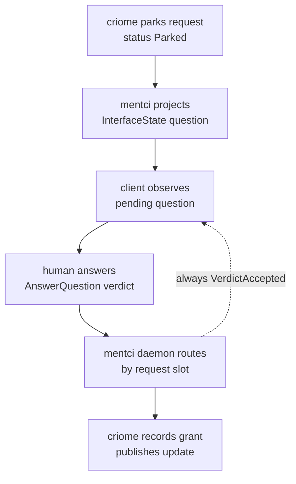
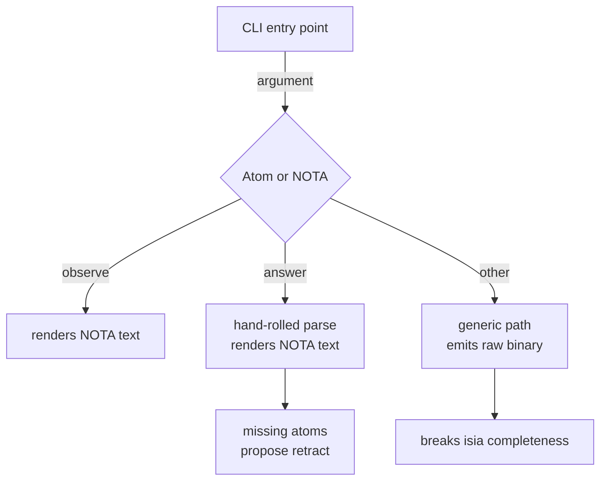
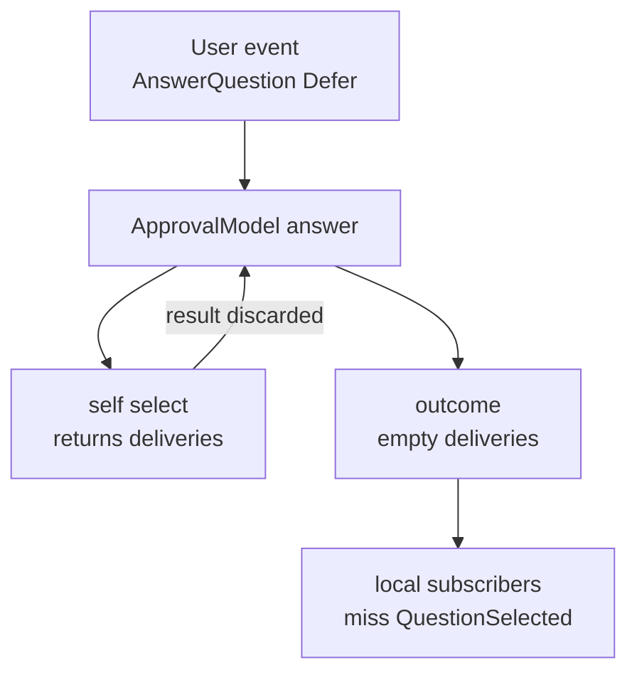
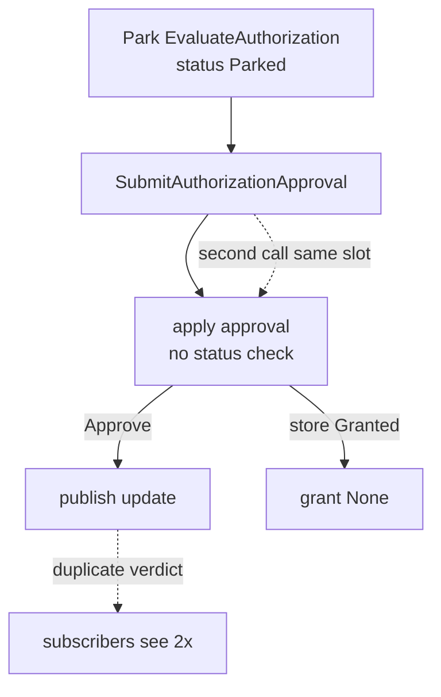
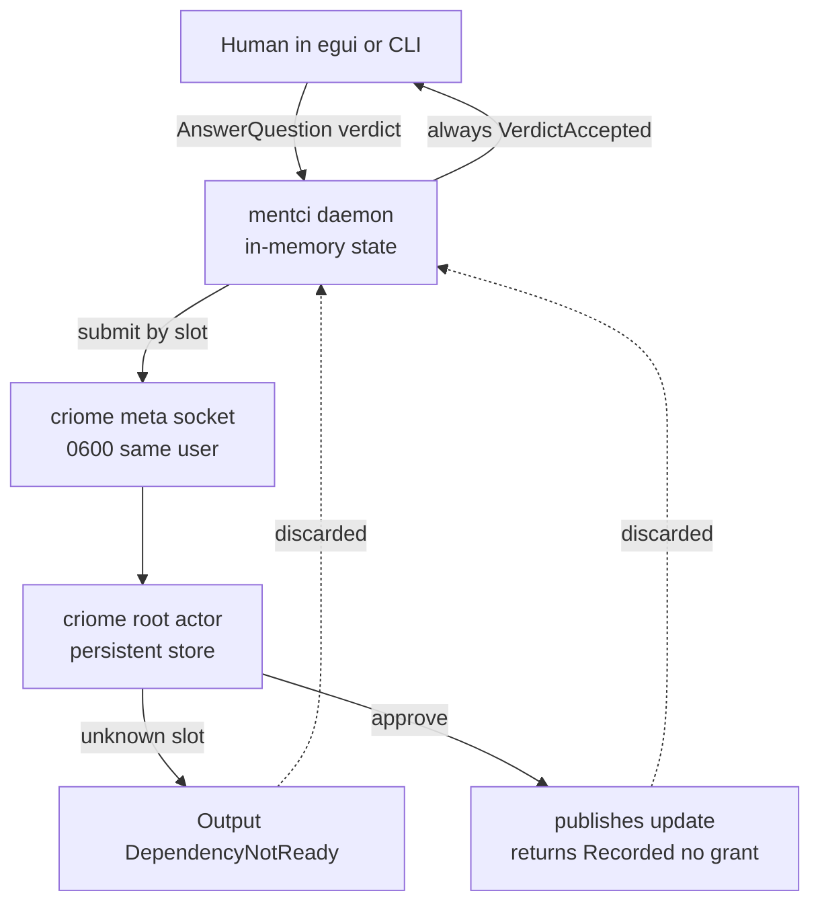

# 714 — Operator Bootstrap Audit (criome / mentci / spirit verdict-routing)

Audit of the OPERATOR-integrated criome/mentci/spirit bootstrap, all on
main: mentci `b7837b08`, mentci-lib `a53bce0e`, signal-mentci `951c9c2a`,
mentci-egui `befd358e`, criome `68b92c66`. The psyche's ask: "review
everything and audit operator. look for missing designs and bad
patterns. insight and questions with visuals and code." 15 sub-agents
audited 8 surfaces against real source, then each finding was
adversarially re-verified. Confirmed findings: 28 (including 6
cross-cutting from the critic and 1 live-confirmed). Refuted: 1.

## Verdict

The bootstrap is coherently version-pinned and the happy path works:
every mentci-side consumer and the daemon lock to signal-mentci rev
`951c9c2a`, so the wire-break shipped atomically via committed
`Cargo.lock` files, and the MVU client model, criome-access gating, and
daemon-routing-by-slot are all implemented and partially tested. The
health is "demo-good, production-incomplete": the deepest gaps are at the
daemon-to-criome verdict seam under failure (mentci tells the client
`VerdictAccepted` even when criome dropped the slot as unknown or
recorded a Reject), in the missing restart contract (mentci is in-memory
while criome persists, yielding duplicate-grant-after-restart paths), and
in the fact that the central new mechanism has no end-to-end proof and
*cannot* get one — mentci has no flake, neither daemon has a NixOS
module, and criome's flake has no nixosTest. Most per-surface findings
are real but small (stringly errors, String-keyed collections,
hand-rolled atom parsing, test gaps); the load-bearing problems all sit
*between* surfaces, which is why the critic pass surfaced them.

## The daemon-routing approval path



The dotted edge is the live bug: the client is told `VerdictAccepted`
regardless of what criome actually did with the slot, and the observed
view does not refresh after answering (see the live-confirmed finding
below).

## Findings by surface

### mentci thin CLI command path

Health: one-argument discipline and atom routing are correct, but the
generic NOTA path emits binary instead of rendered text, atom parsing is
hand-rolled, and two request variants have no atom. 5 confirmed, 0
refuted.



**high / discipline-violation — `src/client.rs:102-103`.** Generic NOTA
path emits raw binary instead of rendered NOTA text.

```rust
let bytes = reply.encode_length_prefixed()?;
writer.write_all(&bytes)?;
```

The atom paths (observe/answer at lines 92/95) render via
`ClientReplyRender::write_to` → `reply.render_nota()`, but the generic
path bypasses rendering and writes length-prefixed rkyv frames. Only
special atoms produce readable text; arbitrary NOTA input produces
binary — the asymmetry breaks the "readable atoms" contract. Fix: apply
the `ClientReplyRender` pattern on the generic path (extract
`MentciReply`, `render_nota(RenderOrigin::Reply)`, then `writeln!`).

**medium / bad-pattern — `src/client.rs:189-202`.** Answer atoms use
hand-rolled string parsing instead of NOTA schema parsing.

```rust
if let Some(question) = argument.strip_prefix("answer:approve:") {
    return Some(Self::new(question, ApprovalDecision::ApproveSuggestedAnswer,));
}
if let Some(question) = argument.strip_prefix("answer:reject:") {
    return Some(Self::new(question, ApprovalDecision::Reject));
}
if let Some(question) = argument.strip_prefix("answer:defer:") {
    return Some(Self::new(question, ApprovalDecision::Defer));
}
```

Workspace discipline forbids hand-rolled parsers. Keep the atom-prefix
recognition but construct the verdict through a typed builder that
validates the question identifier, or synthesize a full
`AnswerQuestion(...)` NOTA string and parse via `NotaSource`.

**medium / missing-design — `src/client.rs:188-202`.** No `retract:<token>`
atom; `MentciRequest::RetractInterfaceObservation(SubscriptionToken)`
(declared `signal-mentci/src/schema/lib.rs:554`) is unreachable from the
CLI. Clients cannot retract subscriptions without encoding bare
`SubscriptionToken` NOTA, which breaks the readable-atoms design. Add a
`ClientRetractCommand` recognizing `retract:`.

**medium / missing-design — `src/client.rs:188-202`.** No
`propose:<id>:<text>` atom;
`MentciRequest::ProposeEditedAnswer(AnswerProposal)` (declared
`signal-mentci/src/schema/lib.rs:553`) is unreachable. Multi-step flows
(present question → propose alternate answer) cannot be driven from the
CLI. Add a `ClientProposeCommand` recognizing `propose:`.

**low / bad-pattern — `src/client.rs:190-200`.** Answer atoms use
`approve`/`reject`/`defer` labels while the enum variants are
`ApproveSuggestedAnswer`/`Reject`/`Defer`. Full words (not abbreviations,
so discipline is technically met), but the atom vocabulary doesn't mirror
the domain vocabulary. Consider `answer:suggested:<question>` to mirror
`ApproveSuggestedAnswer`, or document the mapping.

### Mentci daemon core

Health: strong startup discipline (exactly one binary rkyv file, NOTA
paths rejected, no flags) and typed slot routing, undermined by a
silent-success-discriminant bug and several stringly/String-keyed
patterns. 6 confirmed, 0 refuted.

**high / missing-design — `src/daemon.rs:137`.** Daemon discards the
criome verdict-routing result.

```rust
let _ = bridge.submit_criome_verdict(&verdict)?;
```

The `?` propagates transport errors, but `let _ =` discards the success
`Output` discriminant. The client then receives `VerdictAccepted`
unconditionally. (The critic pass shows this is worse than "silent error"
— see the cross-cutting section: criome returns *successful* `Output`s
for unknown-slot and recorded-Reject, both `Ok`, so they are thrown
away.) Fix: inspect the `Output`; on a rejection/unknown-slot discriminant
return a `Rejection` to the client.

**medium / bad-pattern — `src/daemon.rs:128`.** Actor error flattened to
a string.

```rust
.map_err(|error| Error::ActorCall(error.to_string()))?
```

The kameo actor error is stringified before wrapping in
`Error::ActorCall(String)`, losing structured error information. Define a
typed `ActorError` variant that preserves the underlying error.

**medium / bad-pattern — `src/client.rs:288,290,294`.** Unexpected reply
frames stringified via `format!`.

```rust
Err(Error::UnexpectedMentciReply(format!("{other:?}")))
```

Debug representations are formatted into a `String`, losing type info and
making tests harder. Capture the actual reply variant in a typed error,
e.g. `UnexpectedMentciReply(MentciReply)`.

**medium / bad-pattern — `src/state.rs:21,30`.** Internal state uses raw
`String` keys instead of typed identifiers.

```rust
subscriptions: BTreeMap<String, InterfaceInterest>,
...
criome_request_slots: BTreeSet<String>,
```

Use `BTreeMap<SubscriptionToken, InterfaceInterest>` and
`BTreeSet<AuthorizationRequestSlot>` to match the typed-domain-values
discipline and prevent key mixing.

**medium / bad-pattern — `src/state.rs:412-414`.** `slot_key()` extracts a
`String` instead of returning the typed slot.

```rust
pub fn slot_key(&self) -> String {
        self.parked.request_slot.payload().clone()
}
```

This forces the caller (line 129 in `absorb_criome_parked_authorizations`)
into String keys, propagating the String-keyset bad pattern. Return
`&AuthorizationRequestSlot` and store it typed.

**low / dead-code — `src/criome_bridge.rs:35-42`.**
`CriomeApprovalBridge::submit_verdict` is unused after the refactor.

```rust
pub fn submit_verdict(
        &self,
        request_slot: AuthorizationRequestSlot,
        verdict: &ApprovalVerdict,
    ) -> Result<meta_signal_criome::Output> {
        let criome_verdict = CriomeVerdict::from_decision(request_slot, verdict.decision);
        self.submit_criome_verdict(&criome_verdict)
    }
```

The daemon now routes via `submit_criome_verdict` directly (`daemon.rs:137`);
this method is never called. Delete it to keep the API surface minimal.

### mentci-lib MVU model, approval state machine, daemon routing seam

Health: well-founded MVU client rebased onto live signal-mentci
contracts; `Cmd` is correctly single-variant `SendRequest` (no
`SubmitCriomeVerdict` leftover), criome-access derivation has correct
`None` semantics for narrow interests, daemon-routing is enforced and
tested. One correctness bug. 3 confirmed, 0 refuted.



**medium / bad-pattern — `src/approval.rs:264-269`.** Defer verdict
discards `QuestionSelected` deliveries to local subscribers.

```rust
if matches!(verdict.decision, ApprovalDecision::Defer) {
    let _ = self.select(verdict.question.clone());
    return ApprovalAnswerOutcome {
        answered: None,
        verdict: Some(verdict),
        deliveries: Vec::new(),
    };
```

`select()` returns a `Vec<ApprovalDelivery>` containing a
`QuestionSelected` update for local subscribers, but it is discarded with
`let _` and the outcome returns empty deliveries — shells subscribed via
`ApprovalModel::subscribe()` miss the selection. Fix: capture the
deliveries and return them in the `ApprovalAnswerOutcome`.

**low / test-gap — `tests/model.rs:210-221`.** No test verifies the Defer
case emits a `QuestionSelected` delivery.

```rust
#[test]
fn defer_keeps_the_question_pending() {
    let mut approval = mentci_lib::approval::ApprovalModel::default();
    let _ = approval.absorb_pending(vec![question("question-1")]);
    let outcome = approval.answer(ApprovalVerdict {
        question: QuestionIdentifier::new("question-1"),
        decision: ApprovalDecision::Defer,
        answered_by: SubscriberName::new("test-client"),
    });
    assert!(outcome.answered().is_none());
    assert_eq!(approval.pending().len(), 1);
}
```

The test asserts only "stays pending" and "answered is None"; no case
creates a subscription, defers, and asserts deliveries contain a
`QuestionSelected`. This gap masked the lost-deliveries bug.

**low / test-gap — `tests/model.rs:281-303`.** No test verifies
`criome_access` stays `None` for narrow interests (`StatusOnly`,
`PendingQuestions`). The implementation is correct (narrow projections
chain through `ProjectedInterfaceState::criome_access()` returning
`None`), but only `FullInterfaceState` is exercised. Add a `StatusOnly`
observation that asserts `model.view().criome_access == None`.

### signal-mentci contract (951c9c2a "add criome access mode to interface state")

Health: clean. The `CriomeAccess` enum (`ReadOnly`/`ReadWrite`) is
schema-declared as bare PascalCase, generated correctly, and integrated
as a final positional field on `InterfaceState`; the
`AuthorizationRequestSlot` cross-import is re-exported (not duplicated),
the wire change is lockstep-only with no compat shim, narrow projections
are unchanged, and all tests (round-trip, interface reader) pass. 0
findings, 0 refuted. No questions raised by this surface.

### mentci-egui shell discipline and gating

Health: clean. The shell holds no approval logic, only renders the shared
`ObservationModel` and dispatches `Cmd::SendRequest`; criome-access
gating is enforced both as a UI gate (`can_answer` from
`model.view().criome_access`) and a model gate (`verdict_for_selected`).
Request/reply round-trips through `encode_length_prefixed` /
`decode_length_prefixed` with no hand-rolled frame parsing; `Error` is
typed via thiserror; `Cargo.toml` has no `[patch]` entries; free
functions are confined to `fn main()`. 0 findings, 0 refuted. (See the
live-confirmed finding below for a behavioral gap the static audit could
not see.)

### Criome end — park→observe→verdict→grant lifecycle

Health: three significant seam issues — non-idempotent approval, no
parked-request expiry, and no end-to-end verdict-routing test. 5
confirmed, 0 refuted.



**high / bad-pattern — `src/actors/root.rs:406-482`.**
`SubmitAuthorizationApproval` is not idempotent; repeated calls on the
same slot publish duplicate verdicts.

```rust
async fn apply_authorization_approval(
        &self,
        state: AuthorizationStateRecord,
        decision: AuthorizationApprovalDecision,
    ) {
        if decision == AuthorizationApprovalDecision::Defer {
            return;
        }
        let Some(evaluation) = state.parked_evaluation().cloned() else {
            return;
        };
        if decision == AuthorizationApprovalDecision::Approve {
            self.publish_authorized_object_update(AuthorizedObjectUpdate {
```

No status guard precedes the publish path, and `parked_evaluation` is
deliberately preserved (`with_parked_evaluation()` at line 477) even after
status becomes `Granted`, so a second approval on the same slot
re-executes `publish_authorized_object_update`. Fix: return early when
`state.status != AuthorizationStatus::Parked`.

**medium / missing-design — `src/actors/root.rs:359-375`.** Parked
`ClientApproval` requests have no expiry; they accumulate indefinitely.

```rust
async fn park_authorization(&self, evaluation: AuthorizationEvaluation) -> CriomeReply {
        match self
            .create_authorization_state(store::CreateAuthorizationState::parked(evaluation))
            .await
        {
            Ok(stored) => {
                let state = stored.state();
                CriomeReply::AuthorizationPending(AuthorizationPending::new(
                    state.request_slot.clone(),
                    state.request_digest.clone(),
                    Vec::new(),
```

`SignalCallAuthorization` has an `expires_at` check (`authorization.rs:105-108`),
but the `ClientApproval` park path has no TTL, GC, or auto-transition.
The store grows without bound if parked requests are never decided. Fix:
add a `parked_at` timestamp + expiry duration and auto-transition expired
slots to a terminal `Expired` state.

**high / test-gap —
`mentci/src/bin/` and `criome/src/bin/`.** No end-to-end test for
daemon→criome verdict routing by slot. The existing witnesses
(`criome-client-approval-witness-test`, `-auto-approve-`, `-cluster-`,
`mentci-criome-pickup-witness-test`) either exercise park→approve→observe
within one criome process across two sockets, or only park and exit. None
drives: park on working socket → meta Configure ClientApproval →
`SubmitAuthorizationApproval` (verdict) → observe Granted on working
socket — nor idempotency (same approval twice → one verdict). Add
`criome-observe-authorization-verdict-test.rs`.

**medium / claim-mismatch — `src/actors/store.rs:186-227` and
`src/actors/authorization.rs:160-172`.** `AuthorizationGrant` is never
persisted; the grant field is always `None` in stored state.
`CreateAuthorizationState::signing()/::expired()/::parked()` all
initialize `grant: None`; only `verify_authorization` returns a populated
grant, and that path runs in Quorum mode, not the ClientApproval
park→approve flow, where `apply_authorization_approval` stores
`grant: None` explicitly. A later `ObserveAuthorization` on a Granted
slot sees `None`. Fix: decide intent — persist the grant on transition to
Granted, or remove the field and document grants as one-shot.

**low / bad-pattern — `src/tables.rs:497-508`.** Slot minting falls back
to an O(n) record scan.

```rust
fn next_authorization_slot(&self) -> Result<AuthorizationSlot> {
        let stored = self.read_key(
            self.authorization_next_slot,
            AUTHORIZATION_NEXT_SLOT_KEY.to_owned(),
        )?;
        match stored {
            Some(next_slot) => Ok(AuthorizationSlot::new(next_slot)),
            None => Ok(AuthorizationSlot::after_records(
                &self.authorization_states()?,
            )),
        }
    }
```

When the counter is missing (first run / recovery) the fallback scans all
records. Acceptable for bootstrap (steady state is O(1) via the stored
counter); document it, optionally cache the counter at startup.

### Nix packaging and criome+mentci nixosTest readiness

Health: severely incomplete. mentci has no flake and no `[[bin]]`
declarations; CriomOS has no service module for either daemon; the
promised two-daemon nixosTest exists only as design intent. 6 confirmed,
1 refuted.

Refuted (1): `criome-nix-encoder-bin-mismatch` — the `flake.nix` comment
at lines 78-80 uses the generic phrase "rkyv-config encoder", not a
specific missing binary name; the produced binary
`criome-write-configuration` matches the intent. Not a defect.

**high / missing-design — `mentci/Cargo.toml` (no `flake.nix`).** mentci
has no flake and no `[[bin]]` declarations despite three binaries
(`mentci-daemon.rs`, `mentci-write-configuration.rs`,
`mentci-criome-pickup-witness-test.rs`). This blocks any `nix-build` and
makes mentci unreferenceable from a nixosTest harness. Add
`mentci/flake.nix` (crane+fenix, mirroring criome) and `[[bin]]`
sections.

**high / missing-design (adjusted) — `mentci/Cargo.toml`.** Mentci's text
client exists but is not explicitly declared as a binary. A `src/main.rs`
plus `src/client.rs` implement a `ClientCommand`, creating an *implicit*
package-named binary (`mentci`), but with three explicit `src/bin/` files
and no `[[bin]]` section the build strategy is ambiguous. Fix: add an
explicit `[[bin]]` declaration for the client so it is reliably
buildable. (Verdict adjusted from "no client at all": the client code is
present; only the declaration is missing.)

**high / missing-design —
`CriomOS/modules/nixos/` (no `criome.nix`).** No criome NixOS service
module. `grep` finds only DNS/TLD references (`criomeDomainName`,
`.criome`), no `systemd.services.criome`. Without a module declaring the
systemd service, 0600 socket unit, dedicated Unix user, and pre-start
rkyv encoding, criome cannot be activated in a nixosTest VM. Add
`services/criome.nix`.

**high / missing-design —
`CriomOS/modules/nixos/` (no `mentci.nix`).** No mentci NixOS service
module; `grep` for `mentci` is empty. Add `services/mentci.nix`
(pre-start rkyv encode via `mentci-write-configuration`, listening
socket, Unix user, dependency on the criome socket being ready).

**high / missing-design — `CriomOS` (no test file).** No criome+mentci
nixosTest exists anywhere; `runNixOSTest`/`mkVmTest` appear only in
unrelated substrate files, and `two-daemon` matches nothing across the
three repos. The flake's report-704 comment is a comment, not a test. Add
a `runNixOSTest` composing both daemons and verifying socket
mode/ownership, mentci→criome reachability, and the request→approval flow.

**medium / missing-design —
`mentci/src/bin/mentci-criome-pickup-witness-test.rs:1-6`.** The pickup
witness only parks the request and exits; no standalone
observe-then-answer driver exists.

```rust
//! Seed a live criome daemon with one parked ClientApproval request for Mentci.
//!
//! This process-boundary witness configures criome through its meta socket, then
//! submits one authorization evaluation through the working socket. It exits
//! after criome parks the request, leaving Mentci to pick it up through
//! `ObserveInterfaceState`.
```

It does the first half (park in criome) but never verifies mentci's
`ObserveInterfaceState` or the approval flow. Add a two-daemon witness
that starts and configures both daemons and drives the full
park→observe→answer→grant path.

### Operator claims audit (reports 449-452)

Health: the operator reports accurately describe most current tree state;
the stale-claim concern itself needed correction. 2 confirmed, 0 refuted.

**medium / claim-mismatch (adjusted) — `mentci-lib/src/cmd.rs` vs reports
450/451.** The audit alleged reports 450/451 claim
`Cmd::SubmitCriomeVerdict` *exists*; verification adjusted this: at report
time (2026-06-21 10:15) mentci-lib was at `0731c37`, which did NOT contain
that variant. The variant was *added* later (`ad5bbed`, 11:55) and then
*removed* (`a13115b`, 13:34) in favor of daemon-routing. So the reports
described a recommended/proposed design, not a stale current claim.

```rust
// current cmd.rs
pub enum Cmd {
    SendRequest { socket: ComponentSocketKind, request: MentciRequest },
}

// historical ad5bbed
pub enum Cmd {
    SendRequest { ... },
    SubmitCriomeVerdict { verdict: crate::decision::CriomeVerdict },
}
```

Fix: annotate reports 450/451 as pre-implementation design discussion;
the realized daemon-routing (verdicts via `AnswerQuestion` to the Mentci
socket, `observation.rs:165-180`) is the superior outcome.

**low / claim-mismatch — reports 450/451 vs commit `a13115b`.** The
reports (committed ~10:15-10:29) predate the entire verdict-routing
refactor chain and discuss wiring `Cmd::SubmitCriomeVerdict`, which was
superseded. They are valuable for design evolution but should be marked
"pre-refactoring".

## Cross-cutting / missing designs (critic pass)

The critic re-read every surface together. Its thesis: the load-bearing
problems all sit *between* surfaces, so no single audit owned the
conclusion.



**high / missing-design — `mentci/src/daemon.rs:137`; `criome/src/actors/root.rs:425-436`.**
mentci tells the client `VerdictAccepted` even when criome rejected the
slot as unknown or recorded a Reject.

```rust
// mentci/src/daemon.rs:137
            let _ = bridge.submit_criome_verdict(&verdict)?;
// then unconditionally:
            reply: Reply::committed(NonEmpty::single(SubReply::Ok(reply))),  // VerdictAccepted
// criome/src/actors/root.rs:425
            None => {
                return meta_signal_criome::Output::request_unimplemented(RequestUnimplemented {
                    operation: OperationKind::SubmitAuthorizationApproval,
                    reason: UnimplementedReason::DependencyNotReady,
```

The `?` propagates only transport errors. criome returns a *successful*
`Output` for unknown-slot (`request_unimplemented`/`DependencyNotReady`)
and for a recorded Reject — both `Ok`, so `?` does not catch them and
`let _ =` throws them away. The daemon-core audit saw the mentci side, the
criome audit saw criome's side; neither reconciled them. Fix: match on
the criome `Output` in `submit_decision`, map unknown-slot and
Reject-mismatch to typed errors, and return a `Rejection` to the client.

**high / missing-design — `mentci/src/state.rs:1-25`;
`criome/src/tables.rs:49-68,275`.** mentci's daemon state is in-memory
while criome persists, producing orphaned parked authorizations and
duplicate grants across a mentci restart.

```rust
pub struct State {
    pending_questions: Vec<ApprovalQuestion>,
    decisions: Vec<ApprovalVerdict>,
    ...
    criome_request_slots: BTreeSet<String>,
}
// no persist/SEMA/resume anywhere in mentci/src/*.rs
// criome/src/tables.rs: pub struct StoreLocation { path: PathBuf }
```

The hard override says "on restart a daemon self-resumes from persisted
SEMA state." criome is path-backed; mentci's `State` (including the
in-memory `criome_request_slots` dedup set) is entirely RAM. On a mentci
restart mid-question: native `PresentQuestion` questions and all recorded
decisions vanish, and the empty dedup set re-mints new question
identifiers for already-parked slots — re-presenting a question. Combined
with criome's non-idempotent approval, this is a concrete
duplicate-grant-after-restart path. Fix: give mentci a persisted SEMA
store, or make criome-snapshot reconciliation the single source of truth
on startup AND make criome's approval idempotent. Document the restart
contract in mentci's INTENT/ARCHITECTURE.

**high / test-gap — mentci (no flake); criome/flake.nix (no nixosTest);
CriomOS (no module).** The verdict-routing seam's only possible
end-to-end proof is structurally unbuildable: mentci is unpackaged for
Nix, neither daemon has a NixOS service module, and criome's flake has no
nixosTest harness. So park→observe→answer→verdict-by-slot→grant is
currently *unprovable* across the process boundary. This is the gating
dependency for regression-testing every failure path above. Fix: add
`mentci/flake.nix` + two CriomOS service modules + a criome nixosTest, in
that order.

**high / discipline-violation — `mentci/src/client.rs:97-104` vs
`176-184`.** The generic NOTA CLI path emits raw binary exactly for the
request variants that have no atom shortcut.

```rust
// generic path:
        let reply = codec.read_mentci_frame(&mut stream)?;
        let bytes = reply.encode_length_prefixed()?;
        writer.write_all(&bytes)?;   // raw binary frame
// atom path (observe/answer):
        let rendered = session.absorb_frame(reply)?;
        rendered.write_to(writer)    // rendered NOTA text
```

`ProposeEditedAnswer` and `RetractInterfaceObservation` (the two variants
with no atom) are reachable *only* through the generic path — so they are
doubly broken: even hand-crafted NOTA yields an unreadable binary reply.
The CLI audit saw the binary asymmetry and the unreachable variants as
two separate findings; together they mean those component paths are not
genuinely reachable through thin CLI calls, so isia is not met for the
proposal/retraction flows. Fix: render every reply through
`render_nota(RenderOrigin::Reply)` on the generic path, then either add
the atoms or genuinely document raw-NOTA fallback.

**medium / claim-mismatch — `criome/src/actors/root.rs:433-436`;
`mentci/src/daemon.rs:137`.** The `AuthorizationGrant` is produced by
neither end of the seam.

```rust
// criome returns an acknowledgement, not a grant:
        meta_signal_criome::Output::authorization_approval_recorded(AuthorizationApprovalRecorded {
            request_slot,
            decision: recorded_decision,
        })
// mentci discards even that:
            let _ = bridge.submit_criome_verdict(&verdict)?;
```

criome's `SubmitAuthorizationApproval` reply is
`AuthorizationApprovalRecorded` (slot + decision), carrying no grant, and
mentci throws even that away. There is no surface where the
human-visible proof-of-grant lives: not persisted in criome, not returned
to mentci, not observable via `ObserveAuthorization`. The "grant" exists
only in reports. Fix: decide and *encode* where the grant lives, in the
signal-criome/signal-mentci contract + ARCHITECTURE, not a report.

**medium / missing-design — `criome/src/daemon.rs:135`;
`mentci/src/daemon.rs:62`; `mentci/src/criome_bridge.rs:59`.** criome's
privileged meta socket is isolated from ordinary clients only by
path-secrecy, not OS permission, when co-located under one user.

```rust
// criome/src/daemon.rs:135
        std::fs::set_permissions(socket, std::fs::Permissions::from_mode(0o600))?;
// mentci connects to criome META socket to submit verdicts:
        CriomeMetaClient::new(&self.meta_socket).send(... SubmitAuthorizationApproval ...)
```

The load-bearing invariant is "clients reach criome ONLY through the
mentci daemon." That holds in the mentci model/CLI, but at the OS layer
both daemons chmod 0600 — under a single-user co-located deployment, *any*
process of that user (including a read-only mentci client) can open
criome's meta socket and submit verdicts directly, bypassing the routing
invariant. Fix: run criome and mentci as distinct Unix users with the
meta socket owner/group-restricted to mentci's identity (the NixOS module
is the right place); capture the requirement in criome INTENT/ARCHITECTURE.

**low / inconsistency — `mentci/Cargo.toml:11-19`; the three consumers'
Cargo.toml.** Wire coherence holds today via committed lockfiles but the
design relies on floating `branch = main` deps with no version-bump
discipline for the next break.

```toml
signal-mentci = { git = "...signal-mentci", branch = "main", features = ["nota-text"] }
# Cargo.lock (all three consumers): source = "...signal-mentci?branch=main#951c9c2a..."  (coherent today)
```

Atomicity is an artifact of synchronized lockfile commits, not of the
dependency declaration. Every dep is `branch = main` at version `0.1.0`,
so the *next* wire break offers no signal — a stale consumer running
`cargo update` silently jumps to an incompatible `951c9c2a`+ with the same
version number. Fix: document the lockstep mechanism in the mentci-stack
ARCHITECTURE and bump signal-mentci's version on each wire break so skew
is visible.

## Live-confirmed finding (not in the static audit)

**high / missing-design — `mentci-egui` + `mentci-lib` (post-answer
refresh).** After a client answers (`AnswerQuestion` → `VerdictAccepted`)
the GUI/model does NOT refresh. Canonical state changed — the question
moved pending→answered and a criome grant was recorded — but the client
view stays stale until a manual `observe`. Operator reproduced this live.

Why it matters: this is the user-visible face of the seam. The human
clicks approve, sees nothing change, and has no way to know the verdict
landed (worsened by the `VerdictAccepted`-always bug: even the daemon's
"accepted" is unconditional). The MVU loop closes locally but never
re-reads the canonical interface state.

Two designs:

(a) Cheap, in-scope now: have `mentci-lib` emit an `Observe` `Cmd` in
response to the `VerdictAccepted` engine event. This stays pure MVU
(event → command), requires no contract change, and immediately
re-projects the post-answer interface state into the view. It is the
right first move regardless of (b).

(b) Real fix (open design question): the daemon pushes interface-state
deltas on the observation token, so no client polls. signal-mentci
`d0fea7bf` already returns an observation token alongside the snapshot —
the contract seam for server-push exists. The open questions: does the
daemon hold a per-token subscriber set and fan out `InterfaceState`
deltas on each canonical change? What is the delta shape (full snapshot
vs. typed change events)? How does this interact with the (currently
in-memory) mentci state and the restart contract above? Frame (b) as the
durable design; ship (a) now.

## Insight

- The static per-surface audits are clean where the surface is
  self-contained (signal-mentci contract, egui shell) and noisy where the
  surface owns a seam. Every high-severity *correctness* finding is a
  cross-surface reconciliation the per-surface passes structurally could
  not make — the audit method itself argues for the critic pass.
- `let _ = ...?` is the recurring antipattern and it is more dangerous
  than it looks: it discards *success* discriminants while propagating
  only transport errors, so the loudest failure modes (unknown slot,
  recorded Reject) are exactly the ones silenced. Three findings collapse
  into "inspect the criome `Output`."
- The grant is a documented concept with no home in code — not persisted,
  not returned, not observable. A design that lives only in reports is a
  missing design.
- mentci-in-memory vs criome-persistent is a contract gap, not a bug:
  until the restart contract is written down, "self-resume from SEMA" is
  unmet on the mentci side and every dedup/idempotency fix is provisional.
- The two-daemon nixosTest is the keystone. It is not merely absent but
  unbuildable, and it gates regression coverage for every failure path
  found here — so the highest-leverage single task is the Nix packaging +
  module + harness chain, owned end-to-end by one lane.
- The CLI's isia gap and the post-answer no-refresh gap are the two
  human-facing defects; both are cheap to close (render the generic path;
  emit an `Observe` `Cmd` on `VerdictAccepted`) and both should land
  before any deeper seam work.

## Questions for the psyche

1. When criome returns `DependencyNotReady` (unknown slot) or records a
   Reject for a slot the human approved, should the mentci daemon surface
   that to the client as a `Rejection`, or is silent `VerdictAccepted`
   intentional? (The seam currently always reports acceptance.)
2. What is the intended mentci-daemon restart contract — stateless and
   fully re-derived from criome's parked snapshot on every observe, or
   persisted SEMA state per the workspace override? Current code is
   in-memory with partial reconciliation that recovers only
   criome-escalation questions, not native `PresentQuestion` questions or
   recorded decisions.
3. Where is the human-visible `AuthorizationGrant` meant to live —
   persisted in criome and observable via `ObserveAuthorization`, or
   carried back through the verdict reply into mentci's `InterfaceState`?
   Right now it lives in neither, only in reports.
4. In the target deployment, do criome and mentci run as distinct Unix
   users? If co-located under one user, 0600 does not stop a read-only
   mentci client from opening criome's meta socket directly and bypassing
   the daemon-routing invariant.
5. For the post-answer refresh: ship the cheap MVU fix (emit an `Observe`
   `Cmd` on `VerdictAccepted`) now, and adopt server-push interface-state
   deltas on the observation token (`d0fea7bf`) as the durable design? Or
   go straight to push?
6. Are `propose:`/`retract:` atoms planned? If the documented fallback is
   raw NOTA, when will the generic NOTA path render readable NOTA replies
   instead of binary so that fallback is actually usable?
7. Is the two-daemon nixosTest blocked on a single owner? It needs
   `mentci/flake.nix` + two CriomOS service modules + a criome nixosTest
   harness — three repos, currently spanning the Nix and operator lanes
   with no one holding the end-to-end proof.
8. Should parked `ClientApproval` requests carry a TTL with auto-expiry,
   or is indefinite holding acceptable as long as the operator can
   manually reject?
