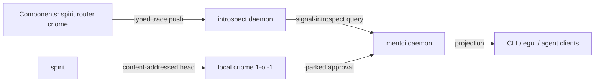

# 715 — Working-with-mentci: the epic roadmap

The psyche opened the next epic: stop building the bootstrap and *start using*
mentci — observe components, see real behavior, debug, hook components together,
get the cluster up, get spirit gating through criome. This report grounds that
directive against the live tree and sequences it.

The governing finding: **almost the entire directive is already-decided intent**,
not new design. The work is execution and wiring, plus a small number of genuine
forks that need the psyche's call. Grounding ran as a 6-surface parallel pass
(introspect, tracing, schema-help, mentci-lib, egui-theme, criome-cluster); the
operator-side defects are in the sibling audit `reports/designer/714-Audit-operator-bootstrap.md`.

## What is already decided (cite, do not re-design)

- mentci is the observation/debug surface that **queries introspect**, filtering
  by component type, message type, and schema-derived signal I/O shape — Spirit
  `80bl`; introspect itself is the configurable trace destination — `so0p`,
  `cd76`.
- The whole **optional-tracing architecture** — schema-defined trace interface
  with closed enum vocabularies (`m5jl`), hooks on generated engine traits via
  default no-op impls (`q13r`), an optional instrumentation build surface
  (`xqkv`), a trace-client library + thin CLI (`4frx`), NOTA at the edge
  (`8p0r`), COMPACT/EXTENDED forms (`bwid`), SEMA trace storage (`jaz4`), no
  daemon printline (`beaj`).
- **Schema-derived CLI help** — generated typed help tree, client-resolved before
  transport (`6th4`); `(Help)`/`(Help Main)`/`(Help Verb)` as one NOTA arg
  (`hetk`); every enum carries a Help variant via the signal-channel macro
  (`m91k`).
- **criome quorum** — 1-of-1 local is the first production milestone (`xhwa`,
  importance bumped this session); quorum is criome's universal primitive with
  k-of-n BLS (`pviw`); the first cluster contract mirrors SSH authorized-keys —
  permissive 1-of-any, add nodes, tighten later (`mzfj`, recorded this session).
- mentci write-mode **is** meta-mode: `CriomeAccess::ReadWrite` ≡ the daemon
  holds the MetaCriome socket, mirrored to clients (`xlrk`, `7x5z`).

So this epic is a **wiring epic**. The grounding's job was to find what is live
vs drafted vs abandoned. The answer: more is alive than the directive assumed.

## Current-state map

| Surface | Live today | The real gap | First increment | Owner |
|---|---|---|---|---|
| **introspect** | v0.2.0, 187 commits, Kameo actors, router-observation path wired, sema-engine store, supervision listener | Manager/Terminal clients are scaffolds; snapshots synthetic; **no push subscription**; schema files are concept stubs; persona references the pre-rename `signal-persona-introspect` (revision drift); mentci can't query it | Realign persona onto renamed `signal-introspect`; e2e orchestrated witness (persona spawns introspect+router, queries live Summary) | system-designer |
| **tracing** | actor-boundary emission (Signal/Nexus/SEMA trait wrappers) → TraceLog → Unix socket; rkyv+NOTA; in-process + process-boundary tests pass; `testing-trace` gate | **route-level** trace not emitted (only actor phases); schema-rust-next doesn't emit the `TraceEventFrame` adapter (hand-written in `spirit/src/trace.rs`); introspect ingests delivery-hops, not schema-typed component events | Emit route-activation events from generated engine wrappers; then wire one component's typed trace into introspect (push) | system-designer + designer |
| **schema-help** | built, green, deploy-ready on **5 feature branches** (works offline, no daemon, Nix passes) | **not merged to main**; no Help in signal-mentci; mentci-lib has zero Help awareness | Merge the 5 branches in dependency order; generalize the runtime-projection pattern into schema-rust-next | operator (schema-operator) |
| **mentci daemon + lib** | daemon on main (criome bridge, mode projection, slot routing); mentci-lib MVU core green, used by egui | verdict seam lies under failure (714); no restart contract; grant produced by neither end; mentci-lib error-handling decorative; dead code (`ApprovalModel::receive`, unused renderer) | Fix the seam defects (714) before adding surface | operator |
| **egui theme** | nothing — egui default (dark) visuals, no detection | system theme never read; `set_visuals` never called | `dark-light` crate + `ctx.set_visuals(light/dark)` on startup | **designer (this session)** |
| **criome cluster** | **1-of-1 LOCAL gating works e2e** (spirit→criome socket); AutoApprove mode; BLS12-381 proven; witness tests pass | spirit startup doesn't yet receive signer-keypair + admitted-contract via meta-signal-criome (hard-coded in tests); 2-of-2 not built; peer routing designed-not-wired | Wire spirit startup config (signer keypair + contract admission) so 1-of-1 production gates without touching criome code | system-designer + operator |

## Target shape

The two arrows that do not exist yet are **components→introspect (typed trace
push)** and **introspect→mentci (query)**. Everything else is live or one
increment away.

## The forks that need the psyche's call

### 1. Is mentci-lib an embeddable engine, or client-only?

You floated (hedged) letting mentci-lib host its own actor system (Nexus + SEMA)
so a GUI runs the daemon in-process. Grounding makes the cost explicit: hosting
the engines inside the library would (a) make it a daemon, not a library; (b)
require a tokio/kameo runtime inside a *library* (against discipline); (c) break
`l6zw` [engines stay daemon-internal; clients speak only Signal].

**Recommendation:** keep the wire/socket boundary inviolable, and make the
**daemon crate** the embeddable unit. A GUI (or an Android app) embeds the daemon
crate and runs it on an in-process socket or in-process transport; mentci-lib
stays the client of that embedded daemon. You get the portable-embed story
without dissolving the Signal boundary. If you'd rather bypass the wire boundary
when both ends are in-process, that's the alternative — but it changes what a
"component" is, so it's yours to choose. I did **not** record this; it's a fork.

### 2. Is mentci-lib a *universal* typed client for all components?

You described mentci-lib as the standardization library — typed methods to
construct/read/filter the signal types of any component (introspect, criome,
spirit, message, logics). Today it is keyed by a closed `ComponentSocketKind`
(Mentci/Criome only). Universalizing means a generic component-identifier key and
a per-component contract shape any wire can fill. **Recommendation:** prove it
with exactly two components first (mentci + introspect, since introspect is the
nearest live target), then generalize — don't universalize on paper. Also a fork:
confirm the direction before the refactor.

### 3. Theme: follow-live or startup-only?

Minor: detect on startup and on focus, or poll every N frames for live OS theme
flips? I'm implementing startup + a manual override hook; live-follow can be a
follow-up. (Not a blocker.)

## Sequenced plan

**Phase 0 — close the bootstrap epic** (operator): fix the 714 verdict-seam
defects (the `let _ = …?` discard, idempotent approval, the restart contract),
version-tag the mentci stack, run a context-cleanup/report-agglomeration pass.

**Phase 1 — spirit gating in production** (system-designer + operator): wire
spirit startup to receive its signer keypair + admitted contract over
meta-signal-criome, so 1-of-1 local auto-approve gates real heads. This is the
"get spirit working with criome" milestone (`xhwa`); criome code is untouched.

**Phase 2 — schema-help to main** (operator): merge the 5 branches in dependency
order; lift the runtime-projection pattern into schema-rust-next so signal-mentci
and mentci-lib can consume Help without per-contract duplication.

**Phase 3 — tracing → introspect → mentci** (system-designer + designer):
route-level trace emission from generated engine wrappers; push one component's
typed trace events into introspect; add mentci query extensions to
signal-introspect (filter by component kind / message kind / schema-object name).

**Phase 4 — mentci as the observation surface** (designer): mentci-lib query
methods over introspect; egui/CLI views that render them. The CLI must reach
every path (`isia`); the GUI's post-answer refresh gap (714) is fixed here.

**Phase 5 — cluster** (system-designer): 2-of-2 on two localhost criome daemons
under the permissive SSH-mirror contract (`mzfj`), collecting approval data, then
network transport. Builds on the live E1 peer-transport work.

**Cross-cutting now:** the **maintainer lane** takes standing audit duty —
monitoring what merges to main and production-spirit health, reporting to the
psyche — the human bridge to the automated auditor (`2gj4`). (This was *not*
Spirit-recordable: the guardian ruled it covered by `6u6o`+`2gj4`; it lives here
and in orchestrate coordination.) Designer maintains the epic prototype branches
and the GUI theme.

## Intent captured this session

- `mzfj` (Decision): [the first criome cluster quorum contract mirrors SSH
  authorized-keys — permissive 1-of-any, always approve, add nodes incrementally,
  tighten to k-of-n later].
- `xhwa` importance bumped (the 1-of-1 local production milestone, repeated).
- Maintainer-audit assignment → coordination docs (rejected for Spirit as
  `InsufficientWarrant`).
- mentci-lib embeddable-engine + universal-client → **held as forks** above,
  pending the psyche's decision.
