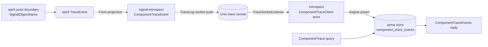
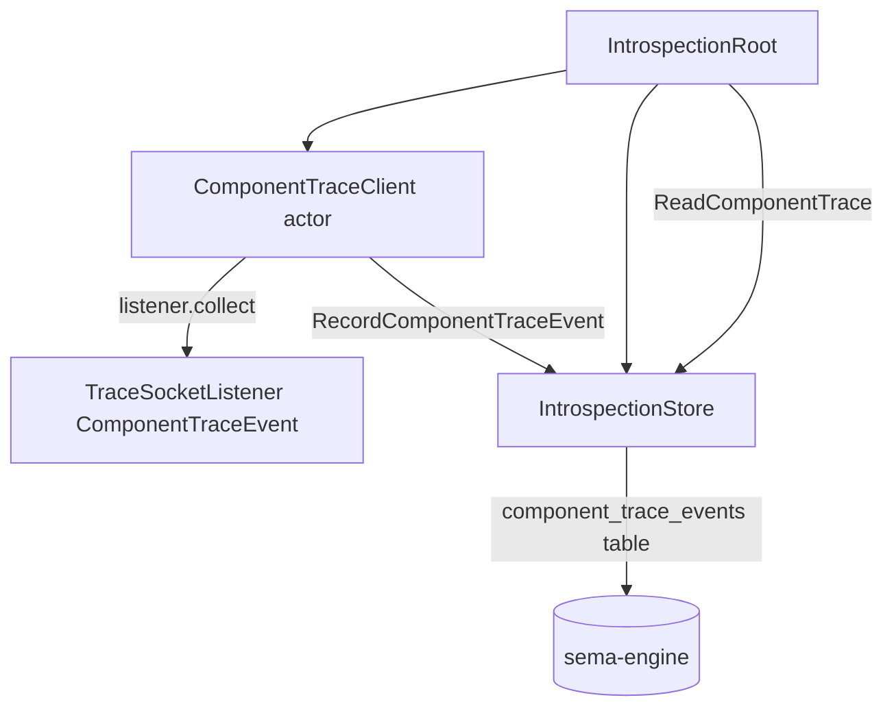

# 716 — First Demonstrable Slice: tracing -> introspect -> (next) mentci

The smallest end-to-end proof that the decided path is real, built only on
infrastructure that is live today. One spirit component emits its already-live
actor-boundary trace; introspect ingests those pushed events into its sema
store; an introspect-owned `ComponentTrace` query returns them filtered by
component and event name. Mentci consuming that query is the explicitly-named
NEXT slice, deferred so this one is independently provable.

## What is already live (the floor we stand on)

- Spirit emits typed binary trace frames via `triad_runtime::trace::TraceLog<TraceEvent>`,
  push-based, over a Unix socket — gated by the `testing-trace` feature
  (`spirit/src/daemon.rs:111-118`, `spirit/src/trace.rs:8-19`).
- `triad_runtime::trace` is generic: `TraceLog<T>` (sink) and
  `TraceSocketListener<T>` (receiver) work for any `T: TraceEventFrame`
  (rkyv encode/decode). The transport carries no spirit coupling
  (`triad-runtime/src/trace.rs:16-19, 199-260`).
- Introspect already has a sema-engine store with a registered-table pattern
  and an actor tree that ingests peer observations and answers typed queries
  (`introspect/src/store.rs:60-150`, `introspect/src/runtime.rs:46-277`).
- `signal-introspect` already carries the `DeliveryTraceEvent` correlation-key
  vocabulary the new `ComponentTraceEvent` mirrors
  (`signal-introspect/src/lib.rs:370-530`).

## What this slice deliberately does NOT touch

- Route-level / per-message trace-emission schema-codegen (the macro/foundation
  work the grounding flags `[WAIT]`). This slice reuses spirit's existing
  hand-emitted `testing-trace` actor-boundary events verbatim and adds zero new
  emission points.
- Mentci. The query lands in introspect's own contract and is proven by an
  introspect integration test, not by a mentci client.
- Router as an emitter. Router still traces in-memory only; it is the
  second emitter after this wiring exists.

## The one architectural decision that makes the slice honest

The trace event on the wire is rkyv bytes. For introspect to decode them
without depending on `spirit` (introspect is the inspection plane; depending on
a component inverts the layering) AND without a brittle byte-layout mirror, the
**wire record must be a contract type both ends import**.

Resolution: `signal-introspect` owns a new positional contract record
`ComponentTraceEvent`. Spirit takes a thin dependency on `signal-introspect`
and, under `testing-trace`, pushes `ComponentTraceEvent` (projected from its
own `TraceEvent` via `impl From<TraceEvent> for ComponentTraceEvent`). Introspect
binds `TraceSocketListener<ComponentTraceEvent>` — the same generic transport.
Both ends share the exact rkyv-archived contract type: no introspect->spirit
dependency, no layout hack, schema-owned noun on the wire. There is no
dependency cycle: `signal-introspect` depends only on `signal-persona`,
`signal-message`, `signal-frame` — never on `spirit`.



## Contract additions — `signal-introspect` (positional NOTA records)

New typed domain values and records, mirroring the `DeliveryTraceEvent`
vocabulary already in the crate. Every identifier full-English; no String/bool
soup. `ComponentKind` reuses the existing `IntrospectionTarget` enum (it already
carries the component-type axis the query filters on; `IntrospectionTarget`
needs a `Signal` variant added since spirit's component is not yet in the eight).

```rust
// signal-introspect/src/lib.rs — new records

/// The schema-derived name of one actor-boundary trace point, e.g.
/// "SignalAdmitted", "NexusEntered", "SemaWriteApplied". Bare-eligible atom.
#[derive(Archive, RkyvSerialize, RkyvDeserialize, NotaEncode, NotaDecode,
         Debug, Clone, PartialEq, Eq)]
pub struct TraceEventName(String);  // new(), payload(), as_str(), From<String>

/// Which actor-boundary layer the event came from. Closed; the signal I/O
/// shape axis mentci will filter on in the next slice.
#[derive(Archive, RkyvSerialize, RkyvDeserialize, NotaEncode, NotaDecode,
         Debug, Clone, Copy, PartialEq, Eq, Hash)]
pub enum TraceLayer { Signal, Nexus, Sema }

/// One pushed component-internal trace observation. Mirrors DeliveryTraceEvent:
/// component identity + ordering + a closed classification.
#[derive(Archive, RkyvSerialize, RkyvDeserialize, NotaEncode, NotaDecode,
         Debug, Clone, PartialEq, Eq)]
pub struct ComponentTraceEvent {
    pub engine: EngineIdentifier,
    pub component: IntrospectionTarget,
    pub layer: TraceLayer,
    pub event_name: TraceEventName,
    pub sequence: TraceSequence,   // monotonic per-emitter order key
}

#[derive(Archive, RkyvSerialize, RkyvDeserialize, NotaEncode, NotaDecode,
         Debug, Clone, Copy, PartialEq, Eq, PartialOrd, Ord, Hash)]
pub struct TraceSequence(u64);     // new(), value(), next()

/// Filter request: by component kind, optionally narrowed to one event name.
/// `event_name: None` returns every event for the component.
#[derive(Archive, RkyvSerialize, RkyvDeserialize, NotaEncode, NotaDecode,
         Debug, Clone, PartialEq, Eq)]
pub struct ComponentTraceQuery {
    pub engine: EngineIdentifier,
    pub component: IntrospectionTarget,
    pub event_name: Option<TraceEventName>,
}

/// Reply: sequence-ordered events for the selected component.
#[derive(Archive, RkyvSerialize, RkyvDeserialize, NotaEncode, NotaDecode,
         Debug, Clone, PartialEq, Eq)]
pub struct ComponentTrace {
    pub engine: EngineIdentifier,
    pub component: IntrospectionTarget,
    pub events: ComponentTraceEvents,  // newtype over Vec<ComponentTraceEvent>
}
```

`TraceEventFrame` for the wire type is implemented in `signal-introspect`
(rkyv archive, identical body to spirit's existing impl):

```rust
impl triad_runtime::trace::TraceEventFrame for ComponentTraceEvent {
    fn to_trace_archive(&self) -> Result<Vec<u8>, TraceError> {
        rkyv::to_bytes::<rkyv::rancor::Error>(self)
            .map(|a| a.to_vec()).map_err(|_| TraceError::ArchiveEncode)
    }
    fn from_trace_archive(archive: &[u8]) -> Result<Self, TraceError> {
        rkyv::from_bytes::<Self, rkyv::rancor::Error>(archive)
            .map_err(|_| TraceError::ArchiveDecode)
    }
}
```

Channel-macro additions (the macro already generates `Operation` / reply enums
and `kind()`; this is two added lines plus the filter query/reply types above):

```rust
signal_channel! {
    channel Introspection {
        operation EngineSnapshot(EngineSnapshotQuery),
        operation ComponentSnapshot(ComponentSnapshotQuery),
        operation DeliveryTrace(DeliveryTraceQuery),
        operation PrototypeWitness(PrototypeWitnessQuery),
        operation ComponentTrace(ComponentTraceQuery),       // NEW
    }
    reply IntrospectionReply {
        EngineSnapshot(EngineSnapshot),
        ComponentSnapshot(ComponentSnapshot),
        DeliveryTrace(DeliveryTrace),
        PrototypeWitness(PrototypeWitness),
        ComponentTrace(ComponentTrace),                      // NEW
        Unimplemented(IntrospectionUnimplemented),
        Denied(IntrospectionDenied),
    }
}
```

The `.concept.schema` gains `ComponentTrace` to the section-1 operation heads
and section-3 reply map, plus section-4 dictionary entries for the new records
(positional, full-English, bare-eligible strings as `String`).

## Spirit additions (thin, feature-gated, no new emission points)

Spirit keeps every existing `testing-trace` emission site untouched. It gains:

1. A `signal-introspect` dependency (the wire contract).
2. `impl From<TraceEvent> for ComponentTraceEvent` — maps `ObjectName` ->
   `(TraceLayer, TraceEventName)` using the existing `ObjectName::name()`
   strings (`spirit/src/engine.rs:276-283` etc.), stamps `engine` /
   `component: IntrospectionTarget::Signal` from configuration, and a
   per-engine `TraceSequence`.
3. A push path: under `testing-trace`, `build_runtime` opens
   `TraceLog<ComponentTraceEvent>::socket(path)` and the trace sink records the
   projected event. (Existing in-memory `TraceLog<TraceEvent>` recording stays
   for spirit's own tests; only the socket sink is retargeted to the shared
   type.) The conversion happens at the sink boundary so the actor-boundary
   call sites that pass `TraceEvent` do not change.

This keeps spirit's process-argument and daemon discipline intact (still
binary startup, still `testing-trace`-gated, still push).

## Introspect additions (mirror the RouterClient ingestion pattern)



1. **Configuration**: add `trace_socket_path: WirePath` to
   `IntrospectDaemonConfiguration` (`signal-introspect/src/lib.rs:643-662`) and
   surface it through `IntrospectionDaemonConfiguration`
   (`introspect/src/daemon.rs:148-170`). Empty path = no trace ingestion
   (mirrors the empty-peer-socket convention at `daemon.rs:159-165`).
2. **Listener actor** `ComponentTraceListener` in `introspect/src/runtime.rs`,
   mirroring `RouterClient` (`runtime.rs:367-472`): binds
   `TraceSocketListener::<ComponentTraceEvent>::bind(path)` in `on_start`,
   drains via `collect_for` on a `spawn_blocking` loop, and forwards each event
   to the store actor as `RecordComponentTraceEvent`. Pull-from-socket on
   introspect's side; push-from-spirit on the wire — PUSH-based as decided.
3. **Store**: register a `component_trace_events` table following
   `store.rs:63-68`. New `StoredComponentTraceEvent` with `EngineRecord`
   record key `engine/component/sequence:020` (mirrors
   `DeliveryTraceEventRecordKey`, `store.rs:341-363`). Add
   `record_component_trace_event` (engine.assert, `store.rs:99-107` shape) and
   `component_trace(query)` (key-range scan + `event_name` filter + sort by
   sequence, `store.rs:131-150` shape).
4. **Query answer**: add a `ComponentTrace` arm to `handle_request`
   (`runtime.rs:115-155`) calling `store.ask(ReadComponentTrace::new(query))`.
5. **Children**: spawn `ComponentTraceListener` in `spawn_root`
   (`runtime.rs:62-82`) and stop it in `stop_children` (`runtime.rs:177-192`).

All new logic lands as methods on data-bearing nouns (`IntrospectionStore`,
`ComponentTraceListener`, `StoredComponentTraceEvent`) or trait impls
(`EngineRecord`, `Message<...>`, `From`) — no free functions, no ZST namespace.
Errors flow through the existing typed `introspect::Error`
(`introspect/src/error.rs`); the listener adds one variant
(`Error::TraceIngestion { detail }`) rather than a String-typed catch-all.

## Repos touched

| Repo | Edits |
|---|---|
| `signal-introspect` | new wire/query/reply records + `TraceEventFrame` impl; `ComponentTrace` op + reply in `signal_channel!`; `IntrospectionTarget::Signal`; `trace_socket_path` config field; `.concept.schema` entries; round-trip tests |
| `spirit` | `signal-introspect` dep (Cargo); `From<TraceEvent> for ComponentTraceEvent`; retarget the `testing-trace` socket sink to `TraceLog<ComponentTraceEvent>` in `build_runtime` |
| `introspect` | `ComponentTraceListener` actor; store table + record/query methods + `StoredComponentTraceEvent`; `handle_request` arm; config plumbing; one `Error` variant; integration test |

## Why this is the right first slice

It proves the decided architecture (push emit -> introspect persist -> typed
filtered query) with a real component, a real socket, and the real sema store,
adding no speculative emission machinery. The deferred route-level codegen, when
it lands, simply produces richer `event_name` values into the same
`ComponentTraceEvent` contract — the ingestion and query path proven here does
not change. Mentci then consumes `ComponentTrace` exactly as the introspect test
does, over the signal socket.
