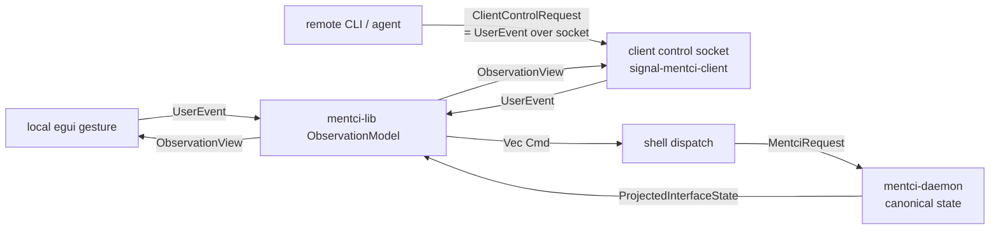
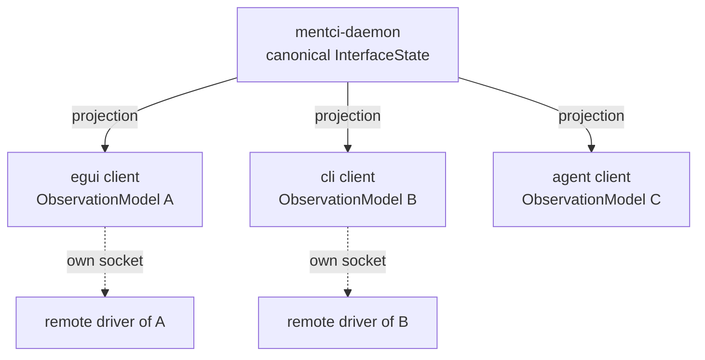
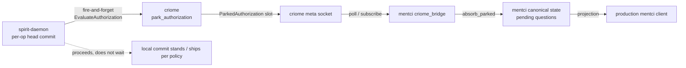

# 719 — Design: Remotely-Driveable Mentci Client + Spirit Ungated-Request Monitoring

Designer epic-branch design, trace-introspect-slice family (rebases on main).
Guardian ruling carried forward: the driveable client is **the triad/CLI
pattern (`7sx6`, `3d5z`) + isia applied to the CLIENT** — the client exposes
its own controls + view through its own socket as a schema signal interface,
reusing `mentci-lib` (same code drives local GUI and remote CLI/agent). This is
not a new arrow. The one genuinely-new lean to surface: **clients owning their
own view-state** vs `7x5z`'s daemon-owns-interface-state.

## What the grounding already proves

The remoteable-client gap is **smaller than the brief's GAP list reads**.
`mentci-egui` already ships a working control socket with the full
remote-control policy machine and already routes remote commands through the
shared model. The honest implemented-vs-design split:

Implemented today (`mentci-egui/src/control.rs`, `app.rs`):

- `RemoteControlMode { LocalOnly, RemoteEnabled, RemotePresentation, DualWrite }`
  with `remote_can_drive()` / `local_can_drive()` policy methods
  (`control.rs:87-107`). Presentation mode already locks local input —
  `app.rs:365` gates the observe button on `local_can_drive()`,
  `app.rs:406-419` gates the answer buttons and paints "local input locked".
- A bound, permissioned Unix-socket server (`GuiControlServer`, `0o600`,
  `MENTCI_EGUI_CONTROL_SOCKET`), spawned at bootstrap (`app.rs:188-198`).
- Remote commands **already flow through `model.on_user_event`**:
  `apply_control_input` (`app.rs:270-300`) maps `SelectQuestion ->
  model.on_user_event(UserEvent::SelectQuestion)`, `AnswerSelected ->
  self.answer() -> model.on_user_event(UserEvent::AnswerQuestion)`,
  `TriggerObserve -> request_interface_state()`. The request channel **is**
  consumed (`drain_control_requests`, `app.rs:302-307`, called every frame at
  `app.rs:541`). The brief's GAP #2 ("request_sender never consumed") is stale.
- The client already owns its own view-state: `MentciEguiApp` holds
  `model: ObservationModel` (`app.rs:141`), each client process keyed by its own
  `SubscriberName` (`app.rs:165`). GAP #3/#4's "multiple independent clients"
  is structurally already true.

Genuinely missing (this design's real surface):

1. **`GuiControlInput` is a hand-rolled shadow of `UserEvent`, not `UserEvent`
   itself.** `SelectQuestion(QuestionIdentifier)` and
   `AnswerSelected(ApprovalDecision)` are manually translated to the matching
   `UserEvent` variant. `Observe { socket, interest }`,
   `RetractObservation`, `ProposeEditedAnswer`, `PushQuestion` are
   **unreachable** remotely — the remote surface is a strict subset of the
   local one. An agent cannot do everything the GUI user can.
2. **No double-write indicator.** `DualWrite` mode exists as a policy bit but
   nothing records that local + remote both drove, and nothing surfaces it in
   the view or the control reply.
3. **`GuiControlState` is a lossy snapshot**, not the real `ObservationView`. A
   remote reader gets `pending_questions: u64` counts, not socket liveness,
   panes, or the selected question's content.
4. **No streaming**: the control socket is one-shot request/reply
   (`handle_stream` reads to EOF, `control.rs:213-227`). An agent polls; it
   cannot subscribe to the client's view changes.
5. **No client-control schema contract.** The control vocabulary lives in
   `mentci-egui` as ad-hoc `NotaEncode` enums, not a schema-emitted signal
   crate. So `mentci-cli` cannot reuse it, and the types are hand-authored
   rather than schema-emitted nouns (`isia` violation).

## The architecture, in one frame



The client's own socket carries `UserEvent` in and `ObservationView` out. Both
the local GUI closures and the remote socket feed the **same**
`model.on_user_event`, and both read the **same** `model.view()`. There is one
code path; the GUI and the socket are two mouths into it. This is the triad/CLI
pattern turned inward: the **client** is a tiny daemon over its own state, and
its "CLI" is any remote driver.

## Decision: clients own view-state (`7x5z` inversion, the lean to confirm)

`7x5z` framed the daemon as owning interface-state and clients as thin painters.
The grounding shows reality already inverted this for the GUI: the daemon owns
**canonical** state; each client owns its **projection + cursor + subscription
tokens** in its own `ObservationModel`. This design makes that explicit and
load-bearing:



Each client is a separate process with its own `SubscriberName`, its own
subscription tokens, its own approval cursor, and its own control socket.
Multiple clients coexist because none holds another's view-state; the daemon
fans projections to all. **This is the recommended shape and the thing to
confirm with the psyche** — the alternative (daemon owns one shared
interface-state that all clients drive and observe identically) collapses the
multi-presenter and agent-isolation use cases and is rejected here, but the
psyche owns the call.

## Part 1 — Driveable Client

### New contract crate: `signal-mentci-client`

A schema-emitted working signal for the **client's own** socket (not the
daemon's). It is the `signal-<component>` leg of the triad pattern applied to
the client, distinct from `signal-mentci` (the daemon's working signal). The
schema emits the nouns; nothing is hand-authored.

Root request type (schema-emitted, positional NOTA):

```
ClientControlRequest =
  | Drive(UserEvent)              ;; the SAME UserEvent the GUI raises
  | SetRemoteControl(RemoteControlMode)
  | ObserveView                  ;; one-shot read of current ObservationView
  | SubscribeView                ;; open a streaming view subscription
  | RetractViewSubscription(ClientSubscriptionToken)
```

Root reply / event types:

```
ClientControlReply =
  | ViewState(ClientView)        ;; schema mirror of ObservationView
  | Accepted(ClientView)
  | Rejected(ClientControlRejection)
  | SubscriptionOpened(ClientSubscriptionToken, ClientView)

ClientControlEvent =            ;; stream events on a SubscribeView token
  | ViewChanged(ClientSubscriptionToken, ClientView)
```

`UserEvent` itself must become a schema-derived contract type so it can ride
`ClientControlRequest::Drive`. Today `UserEvent` lives in `mentci-lib` and
carries live `signal-mentci` payloads (`event.rs:13-50`). The clean move:
`UserEvent` is **emitted by `signal-mentci-client`'s schema**, re-exported by
`mentci-lib`, so the model and the wire share one definition. This is the isia
core: the control surface **is** the model's input type, not a parallel
vocabulary.

`ClientView` is the schema mirror of `ObservationView`
(`observation.rs:295-306`) — sockets (with liveness + revision), approval
summary, panes, criome access, **plus the new drive-attribution fields**
(below). `From<ObservationView> for ClientView` is the projection (a method on
the noun, not a free function).

### Double-write attribution (genuinely new state)

Each driven `UserEvent` carries (or is wrapped with) a `DriveOrigin`:

```
DriveOrigin = | Local | Remote(RemoteDriverLabel)
```

The model records the origin of the last gesture per gesture-class and a
`DoubleWriteIndicator` that latches when local and remote both drove within a
window. This lives in `ObservationModel` (it is view-state, which the client
owns) and surfaces in `ObservationView` / `ClientView`:

```
DoubleWriteIndicator = | Single(DriveOrigin) | Contended(DriveOrigin, DriveOrigin)
```

The egui shell paints `Contended` as a visible "local + remote both driving"
banner; a remote reader sees the same in `ClientView`.

### Increments (epic branch; designer owns `next` in `~/wt`)

The client surface is **designer territory** end to end (`mentci-lib`,
`mentci-egui`, new `signal-mentci-client`, `mentci-cli`). No operator/spirit
dependency. Ordered:

1. **`signal-mentci-client` (new repo).** Schema crate, triad working-signal
   leg for the client socket. Schema source emits `UserEvent`,
   `RemoteControlMode`, `DriveOrigin`, `DoubleWriteIndicator`,
   `ClientControlRequest`, `ClientControlReply`, `ClientControlEvent`,
   `ClientView`, `ClientSubscriptionToken`, `ClientControlRejection`.
   `UserEvent` payloads stay the live `signal-mentci` types (the schema imports
   them). Files: `signal-mentci-client/src/schema/lib.rs` (schema source),
   `src/lib.rs` (type aliases: `ClientFrame =
   signal_frame::StreamingFrame<ClientControlRequest, ClientControlReply,
   ClientControlEvent>`, mirroring `signal-mentci/src/lib.rs:16`). Register in
   `protocols/active-repositories.md`.

2. **`mentci-lib`: adopt the emitted `UserEvent`, add drive attribution.**
   - Replace `mentci-lib/src/event.rs`'s hand-authored `UserEvent` with a
     re-export of `signal_mentci_client::UserEvent`; keep `EngineEvent`
     (daemon-push side, unchanged).
   - `observation.rs`: extend `ObservationModel` with `last_origin` per gesture
     class + `double_write: DoubleWriteIndicator`. `on_user_event` gains an
     origin: `on_user_event(&mut self, event: UserEvent, origin: DriveOrigin)
     -> Vec<Cmd>` — a method on the data-bearing model, still pure-MVU (returns
     `Cmd`s, no I/O).
   - `observation.rs:244` `view()`: add `double_write` to `ObservationView`.
   - `From<ObservationView> for ClientView` (new, in `mentci-lib` since it owns
     both sides of the projection).

3. **`mentci-egui`: replace `GuiControl*` with the schema contract.**
   - Delete `control.rs`'s hand-rolled `GuiControlInput` / `GuiControlState` /
     `GuiControlOutput`. The control server now deserializes
     `ClientControlRequest` (schema `NotaDecode`) and serializes
     `ClientControlReply`. No hand-rolled parser — `signal-mentci-client`'s
     emitted decode is the only parser.
   - `app.rs apply_control_input` becomes: `ClientControlRequest::Drive(event)
     -> self.model.on_user_event(event, DriveOrigin::Remote(label))`, dispatch
     the `Cmd`s, reply `Accepted(self.model.view().into())`. The local-drive
     guard (`requires_remote_drive` + `remote_can_drive`, `app.rs:271`) stays —
     now applied to `Drive(_)` vs `ObserveView` / `SetRemoteControl`.
   - Local egui closures call `on_user_event(event, DriveOrigin::Local)`
     (`app.rs:248-252`, `234-245`).
   - Presentation-mode local lock is already done (`app.rs:365,406-419`); add a
     **remote reset** path: `SetRemoteControl(LocalOnly)` from a remote driver
     re-enables local input (already works via the existing match arm, just
     reachable now through the schema request).
   - Paint `DoubleWriteIndicator::Contended` in the header.

4. **Streaming on the client socket.** `GuiControlServer` today is one-shot
   (`control.rs:186-227`). Add `SubscribeView`: register the connection in a
   per-client subscription registry, push `ClientControlEvent::ViewChanged`
   when `model.view()` changes (revision-gated, like the daemon's
   `InterfaceStateChanged`). This mirrors `signal-frame` streaming the daemon
   already does; reuse `triad-runtime`'s emitted subscription registry rather
   than hand-rolling. (Smallest viable first cut: ship 1-3 without streaming;
   agents poll `ObserveView`. Streaming is increment 4, separable.)

5. **`mentci-cli`: the remote driver as a first-class client.** Two roles,
   both reuse the contract:
   - **Drive another client**: `mentci-cli drive <client-socket>
     '(Drive (SelectQuestion ...))'` — one NOTA string argument (component
     one-arg rule), encoded to `ClientControlRequest`, sent to the target
     client's control socket.
   - **Be its own client**: link `mentci-lib`, own its `ObservationModel`,
     subscribe to the **daemon** directly with its own `SubscriberName`. This is
     the agent-as-independent-client path; it needs no other client running.
   - The CLI is the daemon's/client's first client, not a triad leg (per the
     component-triad override).

### Use cases satisfied

- **Agent drives/tests a client**: agent sends `ClientControlRequest::Drive`
  for any `UserEvent` (now the full set) to the target's control socket;
  `SetRemoteControl(RemoteEnabled)` first; reads `ObserveView` /
  `SubscribeView` for assertions. The contended indicator catches a test
  racing a human.
- **Presenter drives a mentci-backed visual**: `SetRemoteControl(Presentation)`
  locks the local machine's input, the presenter drives from a remote CLI, and
  `SetRemoteControl(LocalOnly)` (remote reset) hands control back.

## Part 2 — Spirit Ungated-Request Monitoring

Goal restated: spirit emits a **non-blocking** criome authorization request per
operation (`2st7`), **proceeds regardless of verdict** so the flow is
observable, and a **production-launchable mentci** watches the requests stream
via the criome↔mentci seam. Smallest path to "psyche launches a production
mentci and watches spirit requests flow."



### The two changes that make the flow observable

**(A) Spirit: a non-blocking emit variant (`2st7`).** Today
`authorize_head` (`criome_gate.rs:200-232`) sends `EvaluateAuthorization` via
`spawn_blocking` and **waits** for the reply to parse `EvaluationDecision`,
and `gate_and_ship_head` (`engine.rs:607-619`) ships only when
`decision.ships()`. For the observable-flow mode the gate must **emit and
proceed**:

- Add `GateDecision::Emitted` (the request was sent fire-and-forget; the head
  proceeds per the observe-only policy). Keep the gating variants
  (`Authorized`/`Denied`/`Unreachable`/`Unconfigured`) for the
  fail-closed production stack — this is a **mode**, not a replacement.
- Add `CriomeGate::emit_authorization(&self, capture) -> Result<(),
  CriomeGateError>`: spawns the `CriomeClient::send` on a detached task,
  returns immediately, does not parse the reply. The request lands in criome's
  parked slots regardless (criome's `ClientApproval` mode already parks via
  `park_authorization`, returning `AuthorizationPending`).
- Gate this behind an `AuthorizationMode` carried in spirit's binary config
  (`Gating` vs `Observing`). In `Observing` mode `gate_and_ship_head` calls
  `emit_authorization` and proceeds; in `Gating` it keeps today's blocking
  behavior. **Configuration is a typed binary meta-signal field**, not a flag
  (daemon-one-arg / no-flags override).

**This part is operator + spirit-production territory** — it touches
`spirit/src/criome_gate.rs`, `engine.rs`, `daemon.rs:139-171`, spirit's binary
`Configuration`, and the signer-keypair deploy wiring that is still
test-stubbed (`engine.arm_criome_gate()`). It lands on spirit's own branch;
the designer surfaces the seam shape, the operator/spirit-production lane
implements and deploys. The signer keypair (deploy-config attestor) is a hard
prerequisite for any real criome round-trip and is out of designer scope.

**(B) Mentci: continuous monitoring of parked authorizations.** The seam
already exists one-shot: `criome_bridge.rs:69-79` `parked_authorizations()`
sends `ObserveParkedAuthorizations` and returns a `ParkedAuthorizationSnapshot`;
`daemon.rs fetch_parked_authorizations` calls it during request handling;
`state.rs absorb_criome_parked_authorizations` folds the parked list into
pending questions. What is missing is **continuous** observation:

- Smallest first cut (no contract change): a poll loop in `mentci/src/daemon.rs`
  that calls `parked_authorizations()` on an interval, diffs against
  known slots, and folds new ones via `absorb_criome_parked_authorizations`.
  This is the smallest path to "watch requests flow" — criome's meta socket is
  snapshot-only today, so polling is the honest minimum.
- Better (separable increment, criome territory): a streaming
  `SubscribeParkedAuthorizations` on `meta-signal-criome` so criome pushes new
  parked slots. That is **criome/operator territory** (new meta-signal variant
  + criome actor emit). Designer surfaces it; do not block the poll-loop first
  cut on it.

Once parked requests land in mentci's canonical pending-questions state, the
**existing** projection path carries them to any observing client — including
the driveable client from Part 1. The production mentci needs no new client
code to show them.

### Increments

Designer-surfaceable seam shape, then operator/criome/spirit implements:

1. **(spirit, operator/spirit-production)** Add `AuthorizationMode { Gating,
   Observing }` to spirit's binary `Configuration` (typed field) +
   `meta-signal-spirit` config shape. Add `GateDecision::Emitted` and
   `CriomeGate::emit_authorization`. In `engine.rs gate_and_ship_head`, branch
   on mode. Files: `spirit/src/criome_gate.rs`, `spirit/src/engine.rs`,
   `spirit/src/daemon.rs`, spirit config schema. **Prereq**: signer-keypair
   deploy wiring (replaces `arm_criome_gate()` test stub).

2. **(mentci, designer can shape; operator lands prod loop)** Add a parked-auth
   poll loop to `mentci/src/daemon.rs` driving the existing
   `criome_bridge.parked_authorizations()` +
   `state.absorb_criome_parked_authorizations` on an interval. Typed
   `PollInterval` in mentci's binary config (no flag). Correlate parked slot to
   originating spirit head — **needs spirit to expose the
   `AuthorizationRequestSlot` derivation in its output** (today it does not;
   slot derives from `operation_digest` inside criome). Surface this as a
   contract gap.

3. **(criome, operator) — separable, do not block #2.** Add
   `SubscribeParkedAuthorizations` streaming variant to `meta-signal-criome` +
   criome actor push, replacing the poll with a subscription. Mentci's
   `criome_bridge` adopts the stream.

4. **(production launch, system-operator/cluster-operator)** A deploy/bootstrap
   tool encodes the typed mentci + spirit binary configs (Observing mode,
   sockets, poll interval, signer keypair) into rkyv and starts the daemons
   (daemons reject inline NOTA). The smallest "psyche launches and watches" =
   bootstrap script + the production mentci client (Part 1) pointed at the
   production mentci daemon. **System-operator/deploy territory.**

### Smallest path to "psyche launches a production mentci and watches"

Increments 1 + 2 + 4, in that order. Streaming (3) and the full driveable
contract (Part 1, increments 4-5) are enhancements, not on the critical path.
The critical path is: spirit emits non-blocking (1) → mentci polls parked slots
into pending state (2) → deploy encodes config + launches (4) → the existing
projection + a read-only mentci client shows the flow.

## Honest implemented-vs-design status

- **Implemented**: remote-control modes, presentation local-lock, control
  socket bound + permissioned + consumed, remote gestures already routed
  through `model.on_user_event`, per-client `ObservationModel` ownership, the
  one-shot criome parked-auth bridge + state absorption.
- **Design-only (this report)**: `signal-mentci-client` schema crate,
  `UserEvent`-as-wire-contract, full `UserEvent` remote reach, double-write
  attribution, `ClientView` rich snapshot, view streaming, `mentci-cli`
  remote-drive, spirit `Observing` mode + non-blocking emit, mentci poll loop,
  criome parked-auth streaming, production deploy encode.
- **Hard external prereq (not designer)**: spirit signer-keypair deploy wiring;
  spirit exposing `AuthorizationRequestSlot` for head correlation.

## Discipline conformance

- Methods on data-bearing nouns: `on_user_event` / `view` /
  `emit_authorization` are model/gate methods; `From<ObservationView> for
  ClientView` and `From<LocalHeadCapture> for AuthorizedObjectReference` are
  trait impls, not free converters.
- Typed domain values: `DriveOrigin`, `DoubleWriteIndicator`,
  `AuthorizationMode`, `PollInterval`, `RemoteDriverLabel` are typed enums/
  newtypes, never bools or raw ints.
- Typed per-crate `Error`: `signal-mentci-client` gets its own `Error`; reuse
  `mentci-lib::Error`, `spirit::CriomeGateError`.
- No hand-rolled parsers: the schema-emitted `NotaDecode` is the only control
  parser; `control.rs`'s `from_nota` hand-call is deleted in favor of it.
- Schema-emitted types are the nouns: `UserEvent` and the whole client control
  vocabulary move into `signal-mentci-client`'s schema.
- Positional NOTA records: `ClientControlRequest` / `ClientView` are positional.
- MVU: the shell dispatches the model's `Cmd`; `on_user_event` stays pure
  `(state, event, origin) -> Vec<Cmd>`; the socket server and the egui closures
  are both shells over the one model.
