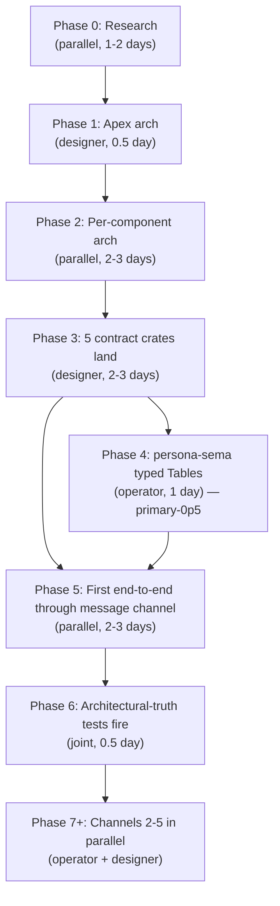
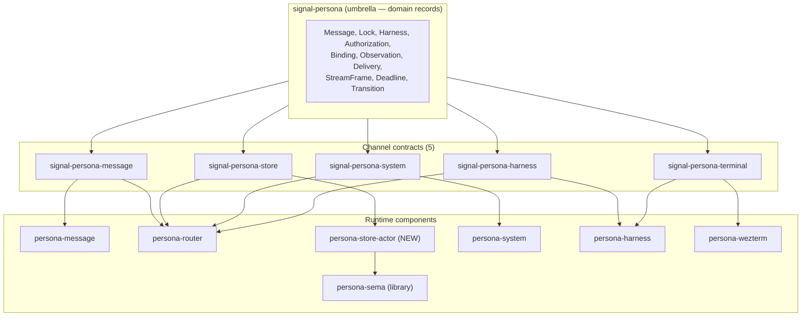
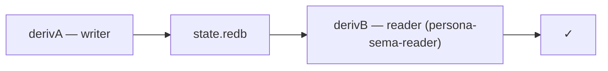

# 72 · Harmonized implementation plan

Status: **single canonical plan** — supersedes
`designer/71` (deleted in same commit). Synthesizes
operator/71's stronger framings + designer/71's research
phase + status-report cadence + the user's two decisions
(2026-05-09):

1. **More channels are better** — adopt operator/71's
   5-contract inventory (`signal-persona-{message,store,system,harness,terminal}`).
   Forcing correctness with more components prevents agents
   drifting into hallucination or cutting architectural
   corners.
2. **Blunt test names** — adopt operator/71's
   `router_cannot_deliver_without_store_commit` style over
   designer/71's `x_cannot_happen_without_y` template.

Plus addresses: signal-derive disposition (defer), naming
refinement (just landed in `skills/naming.md`).

Author: Claude (designer)

---

## 0 · TL;DR



| Channel-count decision | **5 channels** (per user 2026-05-09) |
| Test-naming decision | **Blunt** (`router_cannot_deliver_without_store_commit`) |
| Skills enforcement | **Per-repo `skills.md` checkpoint** (operator/71 §6) |
| Phase 0 research | **Yes** (designer/71 §3, kept) |
| Status reports per phase | **Yes** (designer/71 §13, kept) |
| signal-derive expansion | **Defer** (per `skills/rust-discipline.md` §"When to lift to a shared crate"; wait for 2-3 contract repos to crystallize their patterns) |
| Naming refinement | Just landed in `skills/naming.md` §"Field naming" |

---

## 1 · The choreography pattern

**Per-channel signal-persona-* contract repos as the
synchronization point.** Designer owns contracts; operator
owns implementations. The orchestration claim flow keeps
them non-overlapping.

```mermaid
sequenceDiagram
    participant D as Designer
    participant C as Contract repo
    participant O as Operator
    participant A as Component A
    participant B as Component B

    D->>C: claim + propose channel vocabulary in ARCHITECTURE.md
    O->>C: review + add implementation-facing invariants and truth tests
    D->>C: settle names and examples; release
    O->>C: claim + land minimal typed contract; release
    O->>A: implement producer against contract
    D->>B: implement or review consumer shape against contract
    O->>A: run producer-side truth tests
    D->>B: run consumer-side truth tests
    O->>A: run integration test through contract
```

When operator finds a design gap during implementation:
1. Operator files `reports/operator/<N>-<channel>-implementation-consequences.md`
2. Designer responds with a contract update or a follow-up design report
3. Resume

**No runtime repo invents local duplicate message types
while waiting for a contract change** (operator/71 §3).

---

## 2 · Channel inventory — 5 contracts (per user)



### 2.1 · The 5 contracts

| Contract repo | Channel | Producer / Consumer | Owns |
|---|---|---|---|
| **signal-persona-message** | CLI/text ingress to router | `persona-message` → `persona-router` | `SubmitMessage`, submit reply, sender-derivation receipt |
| **signal-persona-store** | router to store actor | `persona-router` → `persona-store-actor` | `CommitRequest`, `CommitOutcome`, table-slot receipt |
| **signal-persona-system** | OS facts to router | `persona-system` → `persona-router` | `FocusObservation`, `InputBufferObservation`, `WindowClosed` |
| **signal-persona-harness** | router to harness actor | `persona-router` ↔ `persona-harness` | `DeliverRequest`, `DeliveryEvent`, `BlockedReason`, `HarnessObservation` |
| **signal-persona-terminal** | harness actor to terminal | `persona-harness` → `persona-wezterm` | terminal-projection command, terminal receipt |

### 2.2 · `signal-persona` retains the umbrella role

The records that span multiple channels stay in
`signal-persona`. Each per-channel contract **imports** them
and defines how two components exchange them. They do **not
redefine them.**

Records in the umbrella (operator/71 §4):
- `Message`, `Delivery`, `Binding`, `Harness`,
  `Observation`, `Authorization`, `Lock`, `StreamFrame`,
  `Transition`

### 2.3 · `persona-store-actor` is a new component

Per the user's decision (more channels = more correctness),
the store actor lives in its own repo with its own mailbox.
`persona-sema` stays a library only. The router talks to
the store actor through `signal-persona-store`; the store
actor calls `persona-sema` directly as a library.

**New repo:** `/git/github.com/LiGoldragon/persona-store-actor`
(scaffold in Phase 3).

---

## 3 · Phase 0 — Research (parallel; 1-2 days)

**No code or arch-doc edits yet.** Output is per-crate
"current state" cheat sheets that feed Phase 1.

### 3.1 · Designer's research items

| Item | Output |
|---|---|
| Read every `signal-persona` module; map records to channels | "signal-persona current state" cheat sheet |
| Read `signal-core`; confirm kernel surface (Frame API, AuthProof variants, ProtocolVersion semantics) | "signal-core current state" cheat sheet |
| Read criome's signal usage (signal-forge, signal-arca) | "criome's signaling patterns" notes — comparison to persona's needs |
| Re-read designer/4, /40, /63, /64, /68, /70 + operator/67 | refresher notes |

### 3.2 · Operator's research items (per operator/71 §5)

| Item | Why |
|---|---|
| `signal-core::Frame` exact API | all channel contracts must use one frame shape |
| `signal-persona` current record surface | docs must not invent records already present |
| `sema::Table<K,V>` bounds | `persona-sema` docs must name real storable values |
| ractor pattern in workspace | actor docs must match real implementation style |
| Niri/system fact shape | focus/prompt contracts need real OS witness boundaries |

### 3.3 · Joint research items

| Item | Owner |
|---|---|
| Confirm channel naming (signal-persona-* prefix; no churn later) | designer + operator |
| ~~Decide harness text projection~~ — ✅ resolved 2026-05-08: **Nexus** (Nota-formatted; no new text formats — see `skills/language-design.md` §0) |
| Truth-test skill adoption — every Persona repo points at `skills/architectural-truth-tests.md` | both |

### 3.4 · Phase 0 outputs

- `reports/designer/<N>-research-pass.md` (designer)
- `reports/operator/<N>-research-pass.md` (operator)

---

## 4 · Phase 1 — Apex architecture (designer; 0.5 day)

Revamp `repos/persona/ARCHITECTURE.md` per the structure
below. **Apex doc is the single mental model both agents
read whenever the work is in doubt.**

### 4.1 · Apex structure

| Section | Content |
|---|---|
| 0 · TL;DR | 7-component map, the choreography pattern, the messaging-first plan, the 5 contracts |
| 1 · The choreography model | Per-channel signal contracts; designer owns contracts; operator owns implementations |
| 2 · Channel inventory | The 5 contracts (§2 above) + how new channels join |
| 3 · Component map | The 7 sibling crates + new persona-store-actor |
| 4 · Wire (signal-family) | Reference signal-core + signal-persona + the 5 channel contracts |
| 5 · State (sema-family) | Reference sema + persona-sema (library only) + persona-store-actor |
| 6 · Runtime topology | The actual process map (which daemons run, what UDS they hold open) |
| 7 · Boundaries | What persona owns vs each component |
| 8 · Invariants | The architectural rules (push-not-pull; commit-before-deliver; safety property; no-direct-cross-component-Rust-calls) |
| 9 · Architectural-truth tests | Reference `skills/architectural-truth-tests.md`; list the load-bearing witnesses (operator/71 §7's table is the seed) |
| 10 · See also | Component ARCHITECTURE.md files + relevant designer + operator reports |

### 4.2 · Quality gate (per skills re-read mechanism)

Before commit, declare in commit message:
> *Re-read for this edit:
> `skills/architecture-editor.md`,
> `skills/contract-repo.md`,
> `skills/skill-editor.md`,
> `skills/reporting.md` §"Mermaid — node labels vs edge labels".*

---

## 5 · Phase 2 — Per-component architecture (parallel; 2-3 days)

10 ARCHITECTURE.md files current and consistent. **No code
yet.**

### 5.1 · The architecture skeleton (operator/71 §2)

Every Persona **runtime** component's ARCHITECTURE.md
answers:

| Section | Required answer |
|---|---|
| Role | what this repo owns and does not own |
| **Inbound Signal** | which contract repo messages it receives |
| **Outbound Signal** | which contract repo messages it emits |
| State | whether it owns state, and through which actor/table |
| Actor boundary | which data-bearing actor owns long-lived behavior |
| Text boundary | whether NOTA/Nexus is allowed here |
| Forbidden shortcuts | what future agents are likely to bypass |
| Truth tests | which witnesses prove the architecture is obeyed |

Every Persona **contract repo**'s ARCHITECTURE.md answers:

| Section | Required answer |
|---|---|
| Channel | which two components this contract connects |
| Record source | which domain records imported from `signal-persona` |
| Messages | closed request/event/reply enums |
| Versioning | Signal frame/version expectations |
| Examples | canonical Nexus/NOTA text projection per record |
| Round trips | text round-trip + rkyv frame round-trip |
| **Non-ownership** | no actors, daemons, routing, storage, or terminal logic |

### 5.2 · The 10 files

Designer's lane (5 files):

```
signal-persona/ARCHITECTURE.md             umbrella
signal-persona-message/ARCHITECTURE.md     channel
signal-persona-store/ARCHITECTURE.md       channel
signal-persona-system/ARCHITECTURE.md      channel
signal-persona-harness/ARCHITECTURE.md     channel
signal-persona-terminal/ARCHITECTURE.md    channel
```

Operator's lane (7 files):

```
persona/ARCHITECTURE.md                     apex (already in Phase 1)
persona-message/ARCHITECTURE.md             runtime
persona-router/ARCHITECTURE.md              runtime
persona-store-actor/ARCHITECTURE.md         runtime (new)
persona-sema/ARCHITECTURE.md                runtime
persona-system/ARCHITECTURE.md              runtime
persona-harness/ARCHITECTURE.md             runtime
persona-wezterm/ARCHITECTURE.md             runtime
```

### 5.3 · Joint review session

After both finish: walk through each file, find
inconsistencies, reconcile. The output is a coherent set of
arch docs that all tell the same story from different
angles.

### 5.4 · Status reports

- `reports/designer/<N>-contracts-arch-pass.md`
- `reports/operator/<N>-implementations-arch-pass.md`

---

## 6 · Phase 3 — Five contract crates land (designer; 2-3 days)

Create the 5 new repos with minimal typed contracts +
round-trip tests + nix flake checks. **No consumer or
producer code yet.**

### 6.1 · Order

```
1. signal-persona-message      (drives Phase 5 — first end-to-end)
2. signal-persona-store        (drives Phase 4 — store actor implementation)
3. signal-persona-system       (next-priority for safety property)
4. signal-persona-harness      (router-to-harness delivery)
5. signal-persona-terminal     (harness-to-wezterm — last; might defer)
```

### 6.2 · Per-repo creation steps (`signal-persona-message` as worked example)

1. `gh repo create LiGoldragon/signal-persona-message --public`
2. `ghq get -p https://github.com/LiGoldragon/signal-persona-message` (per `skills/repository-management.md` §"Where repositories live")
3. Initialize structure (mirror `sema`'s shape):
   - `Cargo.toml` — deps on `signal-core`, `signal-persona`, `nota-codec`, `nota-derive`, `rkyv`, `thiserror`
   - `flake.nix` — crane + fenix; **7 nix checks** (build, test, test-`<file>`, test-doc, doc with `RUSTDOCFLAGS=-D warnings`, fmt, clippy)
   - `rust-toolchain.toml`
   - `AGENTS.md` shim — `@~/primary/AGENTS.md`
   - `CLAUDE.md` shim — `@AGENTS.md`
   - `README.md`
   - `skills.md` — per-repo skill (see §6.3)
4. `src/`:
   - `lib.rs` — re-exports
   - `frame.rs` — channel Frame variant (or use signal-core's directly)
   - per-record modules
   - `error.rs`
5. `tests/round_trip.rs` — text → typed → text per record kind + rkyv archive round-trip
6. ARCHITECTURE.md per §5.1 (contract-repo skeleton)
7. `nix flake check` — all 7 checks pass
8. Push

### 6.3 · Per-repo `skills.md` checkpoint (operator/71 §6)

Each new contract repo's `skills.md`:

```markdown
# skills — signal-persona-message

*Per-repo agent guide.*

## Checkpoint — read before editing

Before changing code in this repo, read:
- `~/primary/skills/contract-repo.md`
- `~/primary/skills/architecture-editor.md`
- `~/primary/skills/architectural-truth-tests.md`
- `~/primary/skills/nix-discipline.md`
- this repo's `ARCHITECTURE.md`
- the consumer/producer ARCHITECTURE.md files
  (persona-message, persona-router)

If your change adds a cross-component message, edit this
contract first, then push, then update consumer/producer.

## What this repo owns

(channel role; record kinds; non-ownership)

## What this repo does not own

(daemon code; runtime; routing; etc.)
```

The runtime repos' `skills.md` get the same checkpoint
shape, with their inbound/outbound contract list.

### 6.4 · Status report

`reports/designer/<N>-five-contract-crates.md`

---

## 7 · Phase 4 — `persona-sema` typed Tables (operator; 1 day) — `primary-0p5`

The load-bearing missing piece (per `designer/68 §9` +
`designer/70 §3.2 phase 2`). With contracts in place
(Phase 3), this can land in parallel with Phase 5.

### 7.1 · What lands

`persona-sema/src/tables.rs`:

```rust
use sema::Table;
use signal_persona::{
    Authorization, Binding, Delivery, Harness, Lock, Message,
    Observation, StreamFrame, Deadline, DeadlineExpired, Transition,
};

pub const MESSAGES:       Table<&str, Message>          = Table::new("messages");
pub const LOCKS:          Table<&str, Lock>             = Table::new("locks");
pub const HARNESSES:      Table<&str, Harness>          = Table::new("harnesses");
pub const DELIVERIES:     Table<&str, Delivery>         = Table::new("deliveries");
pub const AUTHORIZATIONS: Table<&str, Authorization>    = Table::new("authorizations");
pub const BINDINGS:       Table<&str, Binding>          = Table::new("bindings");
pub const OBSERVATIONS:   Table<&str, Observation>      = Table::new("observations");
// ... StreamFrame, Deadline, DeadlineExpired, Transition
```

### 7.2 · Architectural-truth tests

```text
persona_sema_cannot_store_local_message_type
messages_table_round_trips_signal_persona_message
schema_version_mismatch_hard_fails
schema_version_match_succeeds
```

The first one is a **compile-fail test** — defining a local
`struct LocalMessage` and trying to insert into `MESSAGES`
should not compile.

### 7.3 · Verification gate

Before commit:
1. Verify `signal-persona`'s records satisfy
   `Archive + Serialize<...> + Deserialize + CheckBytes`
2. If not, file `primary-<N>` and add bytecheck derives in
   signal-persona (designer's lane)

(Note: operator already started this work — `persona-sema/src/lib.rs`
references `mod tables;` and the Cargo.toml now depends on
signal-persona. Phase 4 finishes what's in flight.)

### 7.4 · Status report

`reports/operator/<N>-persona-sema-typed-tables.md`

---

## 8 · Phase 5 — First end-to-end through message channel (parallel; 2-3 days)

Operator implements both sides; designer implements/audits the channel-vocabulary side.

### 8.1 · Producer side — message-cli (operator)

Rewrite `persona-message`'s CLI to emit a Signal frame, not
write text files:

```
message designer "stack test"
  ↓
construct signal_persona_message::SubmitMessage { from, to, body }
  ↓
encode as Frame
  ↓
send length-prefix + frame bytes to persona-router's UDS
```

### 8.2 · Consumer side — persona-router (operator)

`persona-router` receives the Signal frame, dispatches to a
ractor actor (`primary-186`), and forwards to the
`persona-store-actor` via `signal-persona-store` for commit.

The current 200ms polling tail in `persona-message/src/store.rs`
**deletes** in this phase (`primary-2w6`).

### 8.3 · `persona-store-actor` — new component (operator)

A small ractor actor that holds the `PersonaSema` handle and
owns the only mailbox into the database:

```
persona-store-actor receives signal-persona-store::CommitRequest
  ↓
opens write txn on persona-sema
  ↓
calls into typed Tables (MESSAGES, etc.)
  ↓
commits
  ↓
sends signal-persona-store::CommitOutcome back
```

### 8.4 · Architectural-truth tests for Phase 5

| Test name (blunt, per user) | Witness |
|---|---|
| `message_cli_emits_signal_persona_message_frame` | golden bytes (`message X "Y" \| xxd` matches expected) |
| `message_cli_cannot_write_private_message_log` | `lsof`/`strace` witness — only socket writes |
| `message_cli_equivalent_to_nexus_cli` | byte equality (`message X Y` == `nexus '(SubmitMessage X "Y")'`) |
| `router_decodes_signal_persona_message_frame` | typed test in persona-router/tests |
| `router_cannot_deliver_without_store_commit` | typed event trace; `CommitMessage` precedes any `DeliverToHarness` |
| `router_cannot_import_persona_wezterm` | `cargo metadata` dependency-boundary check |
| `store_actor_commits_through_persona_sema` | typed event + nix-chained writer/reader |
| `delivery_is_push_based` | `tokio-test` paused-clock; zero retries with no pushed observation |

### 8.5 · Status report

`reports/operator/<N>-message-channel-end-to-end.md`

---

## 9 · Phase 6 — Architectural-truth tests fire (joint; 0.5 day)

The nix-chained writer/reader test from designer/70 §3.2:



derivA: spawn `persona-router-daemon` + `persona-store-actor`,
run `message designer "phase 6"`, wait for commit, kill,
output `state.redb`.

derivB: open `state.redb` via `persona-sema-reader` (a small
new CLI binary), assert the message landed in the MESSAGES
table.

When both pass, **the messaging stack is real for one use
case** with witnesses on every architectural claim.

### 9.1 · Status report

`reports/designer/<N>-messaging-stack-end-to-end.md`

---

## 10 · Phase 7+ — Channels 2-5 in parallel

Repeat Phases 3-5-6 for:

1. **signal-persona-system** — focus + prompt observations
   (resolves `primary-3fa` FocusObservation contract
   convergence)
2. **signal-persona-harness** — delivery + observations
   (enables operator/67's safety property)
3. **signal-persona-terminal** — harness-to-wezterm
   (resolves `primary-kxb` #5)

Hygiene fixes interleaved (`primary-tlu` Persona* prefix
sweep, `primary-0cd` endpoint enum, `primary-4zr` sema
hygiene batch, `primary-nyc` `Table::iter`).

---

## 11 · The discipline re-read mechanism

Two-layer enforcement (combining operator/71's per-repo
checkpoint + designer/71's commit-message declaration):

### 11.1 · Per-repo `skills.md` checkpoint

Every repo's `skills.md` opens with a "Checkpoint — read
before editing" section listing the workspace skills + the
relevant ARCHITECTURE.md + the inbound/outbound contract
ARCHITECTURE.md files.

This is the **on-entry** checkpoint. Forces re-read at the
moment the agent starts editing in a repo.

### 11.2 · Commit-message declaration

Every commit message lists which skill files were re-read
for this edit:

```
designer: signal-persona-message v0.1.0 — first contract crate

Records: SubmitMessage. Round-trip tests pass. nix flake check
all green.

Re-read: contract-repo.md, architecture-editor.md, skill-editor.md,
micro-components.md, nix-discipline.md, architectural-truth-tests.md.
```

This is the **on-exit** declaration. Audit catches missing
re-reads.

### 11.3 · Skill update needed in Phase 0

Land in `skills/autonomous-agent.md` a §"Before-each-edit
re-read" subsection naming both layers. Designer claims
`skills/autonomous-agent.md` for this edit.

---

## 12 · `signal-derive` disposition — defer

`signal-derive` exists today (268 LoC) providing
`#[derive(Schema)]` for criome's old schema-introspection
pattern. Its status note says *"role under review"*; the
`DESCRIPTOR` consts have no obvious consumer.

For the new per-channel contract repos, `signal-derive` is
**not needed**:

- `nota-derive` provides text-codec derives (`NotaRecord`,
  `NotaEnum`, `NotaSum`, `NotaTransparent`,
  `NotaTryTransparent`)
- `rkyv` provides `Archive`/`Serialize`/`Deserialize` derives
- The bound chain for `sema::Table<K, V>` is gnarly but
  doesn't repeat per record kind enough to warrant a derive
  yet

**Defer signal-derive expansion** until 2-3 channel
contracts have shipped and a real boilerplate emerges. Per
`skills/rust-discipline.md` §"When to lift to a shared
crate" — the same wait-for-3-consumers rule applies to
derive macros. Premature derives for a not-yet-real
boilerplate are themselves a boilerplate.

When the time comes, candidate `signal-derive` macros:
1. `#[derive(Channel)]` on a channel's request enum —
   emits Frame construction + dispatch
2. `#[derive(SemaStorable)]` — emits the bound
   chain + a `compile_check` const for `Table<K, V>`
3. `#[derive(BluntTruthTest)]` — emits the
   `x_cannot_happen_without_y` test scaffolds

None of these are clearly worth the macro overhead today.
Reassess after Phase 7+.

The existing `Schema` derive: keep dormant; revisit when
criome's schema-introspection consumer (if any) lands.

---

## 13 · Naming refinement (just landed)

`skills/naming.md` §"Field naming — `profileSize` vs `size`
vs `profile::size`" (just landed, this commit) captures
the user's 2026-05-09 directive:

> *"I prefer more indirection and logical planes, more
> naming accuracy — `profileSize` is better than `size`,
> unless it is `profile::size`."*

The rule: **the name carries the context the namespace
doesn't.** Naked names *claim* a context they don't have;
when the namespace already names the parent (`profile.size`,
`message.id`), the field can stay short. When the field
appears outside its parent's context (function parameters,
top-level bindings), the prefix is mandatory
(`profileSize`, `messageId`).

This refines the existing "full English words" rule rather
than replacing it.

---

## 14 · Open architectural decisions (`primary-kxb`) — still open

| # | Question | Phase blocked by |
|---|---|---|
| 1 | ~~Harness boundary text language~~ | ✅ resolved 2026-05-08 — **Nexus** (Nota is the format; Nexus is the Nota-implemented vocabulary; no new text formats — see `skills/language-design.md` §0) |
| 2 | Commands naming: verb-form or noun-form? | ✅ resolved 2026-05-08 — **noun-form** ("messages are things; verbs are method names") |
| 3 | ZST exception for `Bind`/`Wildcard` | (deferable; not blocking) |
| 4 | When does signal-network design begin? | (deferable; `primary-uea`) |

Note: the channel-count question (3 vs 5) is **resolved per
user 2026-05-09 — 5 channels**. The store-actor-as-separate-
repo question is **resolved — yes** (consequence of the
channel-count decision).

---

## 15 · Status-report cadence

Each phase produces a short report (~100-200 lines) by the
lead agent. The reports become the timeline:

| Phase | Report | Owner |
|---|---|---|
| 0 — Research | `<N>-research-pass.md` (×2) | both |
| 1 — Apex arch | `<N>-apex-arch-revamp.md` | designer |
| 2 — Per-component arch | `<N>-{contracts,implementations}-arch-pass.md` (×2) | both |
| 3 — Contract crates | `<N>-five-contract-crates.md` | designer |
| 4 — persona-sema typed Tables | `<N>-persona-sema-typed-tables.md` | operator |
| 5 — Message channel end-to-end | `<N>-message-channel-end-to-end.md` | operator |
| 6 — Architectural-truth tests | `<N>-messaging-stack-end-to-end.md` | joint |
| 7+ — Each subsequent channel | per-channel implementation report | operator |

If apex doc + bead inventory + status reports tell different
stories, **stop and reconcile**. Divergence is the failure
signal.

---

## 16 · What kicks off the plan

Before Phase 0 starts:

1. **User confirms** this harmonized plan is the canonical one
2. **Designer claims** `skills/autonomous-agent.md` to add
   the §"Before-each-edit re-read" subsection (per §11.3)
3. **Phase 0 begins** — research with parallel work

---

## 17 · Cleanup record

Reports retired in same commit as this report lands:
- `reports/designer/71-parallel-implementation-plan-via-signal-contracts.md`
  — superseded; substance carried into this report

`reports/operator/71-parallel-signal-contract-architecture-plan.md`
**stays** — it's the operator's input record + I cite it
heavily here.

---

## 18 · See also

- `~/primary/reports/operator/71-parallel-signal-contract-architecture-plan.md`
  — operator's plan; this harmonization adopts §0, §2, §4,
  §6, §7 (truth-test names), §10
- `~/primary/reports/designer/68-architecture-amalgamation-and-review-plan.md`
  — workspace amalgamation; §11 BEADS inventory feeds the
  parallel work allocation
- `~/primary/reports/designer/70-code-stack-amalgamation-and-messaging-vision.md`
  — code-stack amalgamation + messaging-stack vision; this
  plan operationalizes its phased plan
- `~/primary/reports/operator/67-signal-actor-messaging-gap-audit.md`
  — operator's gap audit; the channel split addresses the
  layering inversions named there
- `~/primary/reports/operator/69-architectural-truth-tests.md`
  — the test discipline (lifted to
  `skills/architectural-truth-tests.md`)
- `~/primary/skills/architectural-truth-tests.md` — the
  discipline; blunt naming convention captured here
- `~/primary/skills/contract-repo.md` — the kernel-extraction
  + naming convention this plan follows
- `~/primary/skills/architecture-editor.md` — Phase 1 + 2
  ARCHITECTURE.md conventions
- `~/primary/skills/repository-management.md` — Phase 3
  repo-creation discipline (with new ghq section)
- `~/primary/skills/naming.md` — the refinement landed
  alongside this report (§13)
- `~/primary/protocols/orchestration.md` — the claim flow
  that keeps parallel work non-overlapping

---

*End report. Awaiting user kickoff for Phase 0.*
