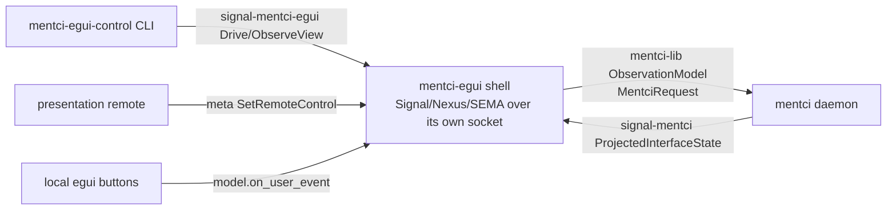

# 720 — Design: the schema-generated `mentci-egui` component triad

The psyche ruled operator's hand-rolled typed-NOTA control slice wrong:
`mentci-egui` is a real component and must be a proper triad with
schema-generated contracts. This report designs that triad —
`signal-mentci-egui` (working signal), `meta-signal-mentci-egui` (meta
policy), and the `mentci-egui` rework — and gives exact repo-creation
steps and ordered increments.

## Why a second triad exists at all (the distinction operator missed)

`signal-mentci` is already a triad contract — but it is the *daemon's*
contract. Its subject is the **mentci daemon's canonical interface
state**: present a question, push an update, observe the daemon's
projected `InterfaceState`, answer. The egui shell is a *client* of that
contract (it holds a `mentci_lib::ObservationModel` and sends
`MentciRequest`s).

The hand-rolled `control.rs` slice is a **different** wire: it addresses
the **egui process's own socket**, and its subject is *this client's
view-state and this client's input* — drive a `UserEvent` into the
running shell, observe what the shell is showing, flip the shell's
remote-control policy. A second egui process, a presentation remote, or
`mentci-egui-control` talks to *that* socket, not the daemon's.

Spirit `6kw3` named exactly this: the GUI is its own socket-addressable
component with its own control state, distinct from `mentci-daemon`.
Spirit `7sx6` then requires every component carry `signal-<c>` +
`meta-signal-<c>`. So the egui shell needs its **own** two contracts.
That is the triad operator hand-rolled instead of generating.



The load-bearing rule from the psyche (`isia`): **`UserEvent` IS the
control wire.** The hand-rolled `GuiControlInput` enum
(`ObserveState` / `SetRemoteControl` / `TriggerObserve` /
`SelectQuestion` / `AnswerSelected`) is a *parallel mirror vocabulary* of
`mentci_lib::UserEvent` — exactly the duplication `61ei` forbids. The
schema contract must make the wire input *be* `UserEvent` (a single
`Drive(UserEvent)` verb), so remote drive and local buttons travel the
identical `model.on_user_event(event)` path.

## The single hardest design decision: one `UserEvent`, two crates

`mentci_lib::UserEvent` (event.rs:22-50) is today a hand-written enum in
`mentci-lib` whose payloads are `signal-mentci` types. The psyche's
directive — "UserEvent schema-emitted, re-exported by mentci-lib so the
model input type and the wire are one type" — means `UserEvent` must
**move into `signal-mentci-egui`** as a schema-emitted type, and
`mentci-lib` re-exports it (`pub use signal_mentci_egui::UserEvent;`)
rather than declaring its own.

This is the only way `Drive(UserEvent)` on the wire and
`model.on_user_event(event)` in memory are literally the **same type** —
no `From`/`Into` bridge, no second decode, no mirror. It does mean
`signal-mentci-egui` **cross-imports** the payload types `UserEvent`
already references (`InterfaceInterest`, `SubscriptionToken`,
`QuestionIdentifier`, `ApprovalVerdict`, `AnswerProposal`,
`QuestionProposal` from `signal-mentci`; `ComponentSocketKind` from
`meta-signal-mentci`) — the same single-colon path-import mechanism
`signal-mentci` already uses for `signal-criome:lib:AuthorizationRequestSlot`
(schema/lib.schema:74-76, build.rs:28-36). This is the genuinely novel
part versus how `signal-mentci` was born; everything else mirrors it.

`open_questions` below flags the one risk here (cross-import of a
two-crate fan-in) for operator/schema-operator confirmation.

## `signal-mentci-egui` — the working signal contract

Subject: **this client's input + this client's view-state.** Served over
the egui process's own socket. The verb roster:

| Verb | Payload | Meaning |
|---|---|---|
| `Drive` | `UserEvent` | push one UI event — the SAME type the model consumes; maps straight to `model.on_user_event(event, origin)` |
| `ObserveView` | `ViewObservation` | open a stream of the client's projected `ClientView`; daemon (the shell) mints the token |
| `SubscribeView` | `ViewObservation` | alias entry for a long-lived streaming subscription (same payload, separate verb for clarity of intent) |
| `RetractViewSubscription` | `ViewSubscriptionToken` | close a view subscription by its shell-minted token |

Replies (output root): `EventAccepted`, `ViewObservationOpened`,
`ViewSubscriptionRetracted`, `Rejection`. Stream: `ViewChangeStream`,
opened by `ObserveView`, carrying `ViewEvent` frames, closed by token.

Core types and the `ClientView` projection (this is the per-client
view-state, confirmed psyche-owned by each client):

- `UserEvent` — moved here from `mentci-lib`, schema-emitted, the model
  input type; cross-imports its payloads from `signal-mentci` /
  `meta-signal-mentci`.
- `ClientView` `{ revision.ViewRevision projection.ViewProjection }` —
  projected from the client's own `mentci_lib::ObservationView`, NOT the
  daemon's `InterfaceState`. This is the projection of *what this shell
  is showing right now*: socket rows, the approval cursor, panes, the
  remote-control mode.
- `ViewProjection` `[(FullView ClientViewState) (ApprovalOnly ApprovalViewSlice) (EventsOnly ...)]` — the per-client view interests `FullViewState`/`ComponentOnly`/`EventsOnly`.
- `ViewObservation` `{ subscriber.SubscriberName interest.ViewInterest }`
  — subscriber names itself + interest; shell mints
  `ViewSubscriptionToken` (never client-supplied, per operator 421 §3 and
  Spirit `qz6j`).
- Newtypes (distinct, no transparent aliases per `qz6j`):
  `ViewIdentifier String`, `ViewSubscriptionToken String`,
  `UserEventId String`, `ViewRevision Integer`.

The full schema sketch (roots + types dict) is in the recipe section
below; it follows the `signal-mentci/schema/lib.schema` grammar exactly
(positional records, `field.Type` only when the field name differs from
the snake-cased type, `(FieldRole (Vector X))` / `(Optional X)` heads,
single-field braces collapse to newtypes).

### `DriveOrigin` — the attribution the rework needs

`Drive` must carry **who drove** so the rework's double-write
attribution works. Add `DriveOrigin [LocalShell RemoteClient Presentation]`
and make the verb `(Drive DriveInput)` where
`DriveInput { event.UserEvent origin.DriveOrigin }`. Then
`apply_control_input` maps `Drive(DriveInput { event, origin })` →
`model.on_user_event(event)` with the origin recorded for the transcript
— the exact same path local buttons take, with origin = `LocalShell`.
(This is the cleanest place to satisfy "double-write attribution via
DriveOrigin" without a parallel attribution side-channel.)

## `meta-signal-mentci-egui` — the meta policy contract

Subject: **the shell's remote-control policy + startup.** This is where
the `RemoteControlMode` machine moves, because flipping remote control
on/off, locking presentation, and resetting remote state are **policy /
authority** operations, not working traffic — exactly the meta/working
split `7sx6` draws.

Verbs (input root):

| Verb | Payload | Meaning |
|---|---|---|
| `SetRemoteControl` | `RemoteControlMode` | the on/off + presentation-lock + dual-write policy switch |
| `ResetRemoteControl` | `RemoteResetScope` | the remote-reset meta operation |
| `Configure` | `MentciEguiDaemonConfiguration` | the one rkyv startup message (daemons accept only binary startup) |

Replies: `RemoteControlSet { mode.RemoteControlMode }`, `Configured
{ generation.ConfigurationGeneration }`, `ConfigurationRejected
{ reason.ConfigurationRejectionReason }`, `RequestUnimplemented
{ operation.OperationKind reason.UnimplementedReason }`.

`RemoteControlMode [LocalOnly RemoteEnabled Presentation DualWrite]` —
moved verbatim from `control.rs:20-26`; its policy predicates
(`remote_can_drive` / `local_can_drive`, control.rs:87-107) become
methods on the schema-emitted enum in `meta-signal-mentci-egui/src/lib.rs`
(hand-written reader impls, the same way `signal-mentci/src/lib.rs`
attaches `as_str`/`value`/projection readers to generated types).

`MentciEguiDaemonConfiguration { (ComponentSockets (Vector
ComponentSocket)) PersonaIdentity EguiRenderingConfiguration
(NotificationClients (Vector NotificationClient)) }` mirrors
`MentciDaemonConfiguration` (meta-signal-mentci/schema/lib.schema:181-185)
plus an `EguiRenderingConfiguration { theme.ThemeName
window_width.Integer window_height.Integer }`. Until `signal-standard`
exists, `ComponentSocketKind` / `ComponentKind` are local stand-ins
carrying the full 681 roster, each tagged `;; (cross-import target:
signal-standard:lib:…)`, exactly as `meta-signal-mentci` does
(schema/lib.schema:108-147).

This honors the component override: the egui shell's daemon side accepts
only a pre-generated rkyv `Configure` — never inline NOTA, never a
`.nota` path — and a virgin shell may start unconfigured and wait.

## `mentci-egui` rework — replace the hand-rolled slice

The rework is a **deletion plus a rewire**, not new behavior. Implemented
vs design-only is honest below: the MVU core, the model path, the
presentation-lock UI gating, and per-client view-state already exist; the
work is swapping the hand-rolled NOTA enums for the emitted contract codec
and routing `Drive` into the existing `on_user_event` path.

Delete from `control.rs`:

- `GuiControlInput` / `GuiControlOutput` / `GuiControlState` /
  `GuiControlRejection` / `GuiControlRejectionReason` enums and their
  `#[derive(NotaEncode, NotaDecode)]` (control.rs:28-63) — the
  hand-rolled mirror vocabulary.
- `GuiControlInput::from_nota` (control.rs:110-114) and
  `GuiControlOutput::to_nota_text` (control.rs:121-125) — hand-rolled
  decode/encode. Replaced by the schema codec: the shell decodes a
  `signal-mentci-egui` request frame and encodes a reply frame through
  the generated `StreamingFrame` codec (the `signal-frame` envelope the
  emitted contract already provides), exactly as the daemon client does
  for `MentciFrame` in `signal-mentci`. **No `nota_next` hand decode.**
- `RemoteControlMode` enum (control.rs:19-26) — moves to
  `meta-signal-mentci-egui`; `control.rs` re-imports it.

Keep / rewire:

- `GuiControlServer` / `GuiControlClient` socket transport
  (control.rs:171-243) stays as the transport, but its
  read-NOTA-text/write-NOTA-text body (control.rs:213-227, 235-242) is
  replaced by frame encode/decode of the emitted contract. The socket
  becomes the egui component's Signal/Nexus/SEMA endpoint over
  `signal-mentci-egui` + `meta-signal-mentci-egui`.
- `apply_control_input` (app.rs:270-300) is rewritten so its driving
  arms collapse to one: `Drive(DriveInput { event, origin })` →
  `self.model.on_user_event(event)` then `self.dispatch(commands)` — the
  IDENTICAL path local buttons take (app.rs:200-252). No
  per-variant re-derivation; `TriggerObserve` / `SelectQuestion` /
  `AnswerSelected` cease to exist as separate wire verbs because they are
  already `UserEvent::Observe` / `SelectQuestion` / `AnswerQuestion`.
- `RemoteControlMode` machine + presentation lock: the runtime flag
  (`app.rs:150`) and its UI enforcement (`local_can_drive` gating at
  app.rs:365-371 and the "local input locked" label at app.rs:406-422)
  are **preserved unchanged**; they are driven from the meta contract's
  `SetRemoteControl` instead of `GuiControlInput::SetRemoteControl`.
- Per-client view-state: each client gets its own `ObservationModel`
  (observation.rs:78-82) and projects its own `ObservationView` →
  `ClientView`. Today the model is single-instance and app-global; the
  psyche confirmed *clients own their own view-state*, so multi-client
  support is design-only here and noted as a follow-on (the contract
  supports it; the shell wiring for multiple concurrent `ClientView`
  projections is a later increment).

`mentci-egui/src/error.rs` gains schema-frame error variants
(`SignalMentciEgui(#[from] signal_mentci_egui::SignalFrameError)` and the
meta equivalent) and drops `ControlParse` (no more hand parse).

### `mentci-egui-control` CLI

`src/bin/mentci-egui-control.rs` (today wraps `GuiControlInput::from_nota`)
becomes a thin one-NOTA-arg client of `signal-mentci-egui` /
`meta-signal-mentci-egui`: it takes ONE NOTA string (a `UserEvent` to
drive, or a meta `SetRemoteControl`), encodes it through the emitted
contract's request builder, connects to a target client socket, and
prints the decoded reply. One argument, no flags — the component-process
rule. It is the egui component's first client, not a triad leg.

```rust
// shape only — the decode is the emitted codec, never nota_next by hand
fn main() -> Result<()> {
    let nota = std::env::args().nth(1).expect("usage: mentci-egui-control '<NOTA>'");
    let request = MentciEguiRequestBuilder::from_nota(&nota)?; // emitted codec
    let reply = ClientControlClient::connect(target_socket())?.submit(request)?;
    println!("{}", reply.to_nota());
    Ok(())
}
```

## Repo creation — mirroring how `signal-mentci` was born

New-repo creation authorized by the psyche. Both repos are pure
schema-derived wire-vocabulary crates: NO daemon, actor, storage, or
rendering implementation (identical charter to `signal-mentci` /
`meta-signal-mentci`). Designer creates the branches/scaffold; the
GitHub repo creation + main push is operator/spirit-production (noted
separately at the end).

Exact steps for **each** new repo (`signal-mentci-egui`,
`meta-signal-mentci-egui`), under `~/wt/github.com/LiGoldragon/<repo>/`
on a designer branch:

1. `gh repo create LiGoldragon/<repo> --private --source=. --remote=origin`
   (or `--public`; `signal-mentci` is `publish = false`, private-leaning).
2. `jj git init --colocate` (mirror the `.jj` colocated layout the
   sibling contract crates use).
3. Scaffold files, copying the `signal-mentci` / `meta-signal-mentci`
   tree verbatim and editing names: `Cargo.toml`, `build.rs`,
   `schema/lib.schema`, `src/lib.rs`, `src/schema/mod.rs` (the 2-line
   `pub mod lib;` stub), `tests/round_trip.rs`, `.gitignore`
   (`/target`, `/.direnv`, `result`), `README.md`, `rust-toolchain.toml`,
   `INTENT.md`, `ARCHITECTURE.md`, `AGENTS.md` (`@../primary/AGENTS.md`
   pointer like the siblings), `flake.nix` + `flake.lock` (copy from a
   sibling contract crate).
4. `Cargo.toml` (`signal-mentci-egui`): `name = "signal-mentci-egui"`,
   `version = "0.1.0"`, `edition = "2024"`, `rust-version = "1.88"`,
   `publish = false`, `links = "signal-mentci-egui"`, `build = "build.rs"`;
   `[lib] name = "signal_mentci_egui"`; `[features] default = []`,
   `nota-text = ["dep:nota-next", "signal-mentci/nota-text",
   "meta-signal-mentci/nota-text", "signal-frame/nota-text"]`;
   `[dependencies]` `nota-next` (optional), `rkyv` 0.8 (default-features
   false, features `std bytecheck little_endian pointer_width_32
   unaligned`), `signal-mentci` (git, branch main), `meta-signal-mentci`
   (git, branch main), `signal-frame` (git, branch main, default-features
   false), `thiserror = "2"`; `[build-dependencies] schema-rust-next`
   (git, branch main); `[[test]] name = "round_trip" path =
   "tests/round_trip.rs" required-features = ["nota-text"]`; the
   `[lints.rust]` block from `signal-mentci`.
5. `build.rs` (`signal-mentci-egui`, working signal WITH cross-imports —
   mirrors `signal-mentci/build.rs` not the meta short form): print
   `cargo:rerun-if-changed=schema/lib.schema`,
   `cargo:rerun-if-changed=src/schema/lib.rs`, and
   `cargo:rerun-if-env-changed=DEP_SIGNAL_MENTCI_SCHEMA_DIR` +
   `DEP_META_SIGNAL_MENTCI_SCHEMA_DIR`;
   `CargoSchemaMetadata::new("signal-mentci-egui").emit_schema_directory(&crate_root)`;
   build two `DependencySchema::from_cargo_metadata(...)` (one for
   `signal-mentci` 0.1.0, one for `meta-signal-mentci` 0.1.0); then
   `GenerationDriver::new(GenerationPlan::wire_contract(&crate_root,
   "signal-mentci-egui", "0.1.0").with_dependency_schema(signal_mentci).with_dependency_schema(meta_signal_mentci))
   .generate().expect(...).write_or_check("SIGNAL_MENTCI_EGUI_UPDATE_SCHEMA_ARTIFACTS").expect(...)`.
6. `Cargo.toml` (`meta-signal-mentci-egui`): same skeleton, `name =
   "meta-signal-mentci-egui"`, `links = "meta-signal-mentci-egui"`,
   `[lib] name = "meta_signal_mentci_egui"`, no signal-mentci dep,
   `nota-text = ["dep:nota-next", "signal-frame/nota-text"]`.
7. `build.rs` (`meta-signal-mentci-egui`, meta-only short form — mirrors
   `meta-signal-mentci/build.rs`):
   `ContractCrateBuild::from_environment("meta-signal-mentci-egui",
   "0.1.0", "META_SIGNAL_MENTCI_EGUI_UPDATE_SCHEMA_ARTIFACTS").expect_fresh();`
8. `schema/lib.schema` for each — the roots + types dicts sketched above
   and in the recipe table below, in `signal-mentci` grammar.
9. `src/lib.rs` for each: `#[rustfmt::skip] #[allow(...)] pub mod schema;`
   then `pub use schema::lib::*;` then the type aliases
   (`MentciEguiRequest = Input`, `MentciEguiReply = Output`,
   `MentciEguiFrame = signal_frame::StreamingFrame<Input, Output,
   ViewEvent>`, `MentciEguiRequestBuilder = RequestBuilder`,
   `MentciEguiOperationKind = InputRoute`) and the hand-written reader
   impls (`ViewSubscriptionToken::as_str`, `ViewRevision::value`,
   `ClientView` constructors/readers; for meta: `RemoteControlMode`
   predicates, `ConfigurationGeneration::value`, the `From` conversions).
10. `tests/round_trip.rs` for each: mirror
    `signal-mentci/tests/round_trip.rs` — `exchange()`/`SessionEpoch`
    fixtures, `assert_request_round_trips` / `assert_reply_round_trips`
    over the frame codec, `assert_nota_round_trips` for newtypes, and a
    stream open/event/close cycle.
11. Generate artifacts and check them in:
    `SIGNAL_MENTCI_EGUI_UPDATE_SCHEMA_ARTIFACTS=1 cargo build` /
    `META_SIGNAL_MENTCI_EGUI_UPDATE_SCHEMA_ARTIFACTS=1 cargo build`,
    commit `src/schema/lib.rs`.
12. Consumer pinning (`6x2k`): in `mentci-lib` and `mentci-egui`
    `Cargo.toml`, add `signal-mentci-egui = { git =
    "https://github.com/LiGoldragon/signal-mentci-egui", branch = "main"
    }` and the meta crate the same way — HTTPS URL, not ssh.

## Schema recipe (the two `lib.schema` shapes)

`signal-mentci-egui/schema/lib.schema`:

```
;; cross-imports — UserEvent's payloads live in the daemon contracts
{
  InterfaceInterest        signal-mentci:lib:InterfaceInterest
  SubscriptionToken        signal-mentci:lib:SubscriptionToken
  QuestionIdentifier       signal-mentci:lib:QuestionIdentifier
  ApprovalVerdict          signal-mentci:lib:ApprovalVerdict
  AnswerProposal           signal-mentci:lib:AnswerProposal
  QuestionProposal         signal-mentci:lib:QuestionProposal
  ComponentSocketKind      meta-signal-mentci:lib:ComponentSocketKind
}

[(Drive DriveInput)
 (ObserveView ViewObservation opens ViewChangeStream)
 (SubscribeView ViewObservation opens ViewChangeStream)
 (RetractViewSubscription ViewSubscriptionToken)]

[(EventAccepted EventAccepted)
 (ViewObservationOpened ViewObservationOpened)
 (ViewSubscriptionRetracted ViewSubscriptionRetracted)
 (Rejection Rejection)]

{
  ViewIdentifier String
  ViewSubscriptionToken String
  UserEventId String
  ViewRevision Integer
  SubscriberName String
  TimestampNanos Integer

  DriveOrigin [LocalShell RemoteClient Presentation]
  UserEvent [ ;; the model input type — moved here, re-exported by mentci-lib
    (Observe ObserveTarget)
    (RetractObservation RetractTarget)
    (SelectQuestion QuestionIdentifier)
    (AnswerQuestion ApprovalVerdict)
    (ProposeEditedAnswer AnswerProposal)
    (PushQuestion PushTarget) ]
  ObserveTarget { socket.ComponentSocketKind interest.InterfaceInterest }
  RetractTarget { socket.ComponentSocketKind token.SubscriptionToken }
  PushTarget   { socket.ComponentSocketKind proposal.QuestionProposal }
  DriveInput   { event.UserEvent origin.DriveOrigin }

  ViewInterest [FullViewState ComponentOnly EventsOnly]
  ViewObservation { subscriber.SubscriberName interest.ViewInterest }
  ClientView { revision.ViewRevision projection.ViewProjection }
  ViewProjection [(FullView ClientViewState) (ComponentView ...) (EventsView ...)]
  ;; ClientViewState mirrors mentci_lib::ObservationView (sockets/approval/panes/mode)

  EventAccepted { (UserEvent (Optional UserEventId)) accepted_at.TimestampNanos }
  ViewObservationOpened { token.ViewSubscriptionToken view.ClientView }
  ViewSubscriptionRetracted { token.ViewSubscriptionToken }
  RejectionReason [RemoteControlDisabled NoSelectedQuestion UnknownSubscriber UnsupportedEvent]
  Rejection { reason.RejectionReason }

  ViewEvent [(ViewChanged ClientView belongs ViewChangeStream)]
  ViewChangeStream (Stream { token ViewSubscriptionToken opened ClientView event ViewEvent close ViewSubscriptionToken })
}
```

`meta-signal-mentci-egui/schema/lib.schema` (roots; types mirror
`meta-signal-mentci` plus the egui-specific pieces):

```
[(SetRemoteControl RemoteControlMode)
 (ResetRemoteControl RemoteResetScope)
 (Configure MentciEguiDaemonConfiguration)]

[(RemoteControlSet RemoteControlSet)
 (Configured Configured)
 (ConfigurationRejected ConfigurationRejected)
 (RequestUnimplemented RequestUnimplemented)]
;; RemoteControlMode [LocalOnly RemoteEnabled Presentation DualWrite]
;; RemoteResetScope [RemoteState ViewSubscriptions All]
;; MentciEguiDaemonConfiguration { (ComponentSockets (Vector ComponentSocket))
;;   PersonaIdentity EguiRenderingConfiguration (NotificationClients (Vector NotificationClient)) }
;; EguiRenderingConfiguration { theme.ThemeName window_width.Integer window_height.Integer }
;; OperationKind [SetRemoteControl ResetRemoteControl Configure]
;; ComponentSocketKind / ComponentKind: local 681-roster stand-ins (cross-import target: signal-standard)
```

The `RejectionReason` variants `RemoteControlDisabled` /
`NoSelectedQuestion` carry forward the exact hand-rolled rejection
semantics (control.rs:59-63), now schema-typed.

## Ordered increments (designer epic branch, rebased on current main)

Epic branch rebased on: `mentci-egui 28844bca`, `mentci 32ec6f80`,
`signal-introspect a9269952`, plus `signal-mentci 951c9c2`,
`meta-signal-mentci 5a22f9f`, `mentci-lib 3421ae8`. Each increment is one
landed-and-verified step.

The increments are listed in the structured output; the gist:

1. Scaffold + ship `meta-signal-mentci-egui` (no cross-imports — lands
   first, unblocks nothing else but is the simplest).
2. Scaffold + ship `signal-mentci-egui` with the two cross-imports;
   prove the round-trip witness compiles (this is the cross-import risk
   gate).
3. Move `UserEvent` into `signal-mentci-egui` schema; `mentci-lib`
   re-exports it and drops its hand-written `event.rs` enum (`on_user_event`
   signature unchanged).
4. Rework `mentci-egui/control.rs`: delete the hand-rolled enums, swap
   the socket body to the emitted frame codec, re-import `RemoteControlMode`
   from the meta crate.
5. Rework `apply_control_input` to the single `Drive` → `on_user_event`
   path with `DriveOrigin`; preserve the presentation-lock UI gating.
6. Rework `mentci-egui-control` CLI to the one-NOTA-arg emitted-contract
   client.
7. Per-client `ClientView` projection + `ObserveView`/`SubscribeView`
   streaming wired in the shell (the per-client view-state increment).

## Implemented vs design-only (honesty)

- **Implemented today, preserved:** MVU core (`ObservationModel`,
  `on_user_event` → `Cmd` → shell `dispatch`), the model-owns-the-request
  invariant (app.rs:216-229), the presentation-lock policy + UI
  enforcement, per-socket `SocketObservation` slots, the closed
  `ApprovalDecision` answer path.
- **Design-only, this report:** both new contract crates, `UserEvent`
  schema-emission + cross-import, the `Drive`/`DriveOrigin` single-path
  rewire, the meta `RemoteControlMode` relocation, the emitted-frame
  socket codec, `ClientView` projection, multi-client view-state.

## Operator / spirit-production parts (separate from designer)

- **operator:** owns `mentci-egui` / `mentci-lib` main + rebase from the
  designer branches; integrates increments 3-7. Designer ships `next` /
  feature branches under `~/wt`; operator carries main.
- **operator / spirit-production (repo birth):** the `gh repo create`
  for both new repos and the `git push -u origin main` are the
  production-side acts; designer scaffolds on a branch, operator/
  spirit-production publishes the repo and pins consumers, mirroring how
  `signal-mentci` was published. Adding `signal-mentci-egui` /
  `meta-signal-mentci-egui` to `protocols/active-repositories.md` is a
  primary-main edit (this report's follow-on).
- **spirit-production:** if the psyche's "control slice is wrong" ruling
  should land as a durable Spirit record (Correction superseding the
  hand-rolled-slice decision), that capture is a psyche-facing lane's
  job, not this designer report.
