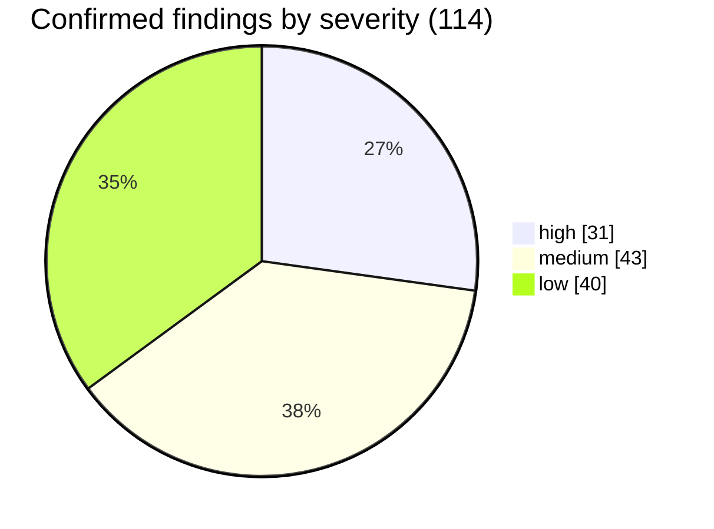
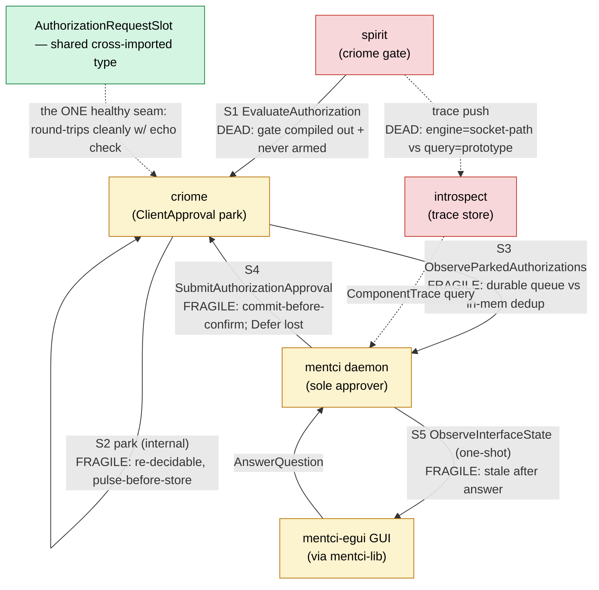

# 722 — Audit: recent designer + operator work on the criome/mentci/spirit/introspect stack

A full-stack audit of the recent epic — the criome authorization seam, the
trace → introspect → mentci observability plane, the driveable mentci-egui
control triad, and the theme fix — across 13 repos and both lanes. Method: 9
parallel subsystem readers → 4 cross-cutting auditors → **adversarial
verification of every finding against current `main`** → synthesis. Verification
matters here because operator landed fixes since report `714`; I wanted stale
findings filtered, not re-reported.

**Result: 115 candidate findings → 114 confirmed/partial, 0 stale, 1 overturned
as wrong.** Severity 31 high / 43 medium / 40 low. The full finding table is the
appendix at the foot of this report; this body is the synthesis, the visuals, and
the designer reading.

## The one-sentence finding

The recent work built a **complete-looking authorization + observability + control
architecture whose two load-bearing planes are inert end-to-end** — not because
the seams are buggy (most type-check and round-trip cleanly) but because the
production build never turns them on, and the per-repo `INTENT.md` files present
the inert scaffold as live fact.

## Distribution

The 31 highs are fewer problems than they look: viewed across repos they
**collapse to ~9 distinct root causes**. Fixing each root clears a cluster of
findings.

| # | Root cause | Repos / findings | Sev |
|---|---|---|---|
| A | spirit criome gate is **compiled out** of the shipped daemon AND never armed by any code path — the production binary performs no authorization at all | spirit (1,2) | high |
| B | the **trace plane is dead end-to-end**: producer stamps `engine = socket-path`, consumer queries `engine = "prototype"` → zero matches; key omits layer/event_name; per-process sequence resets to 0 on restart → silent overwrite; component mislabeled `Signal`; drain swallows all faults | spirit + introspect (3,17,18,19,20,26) | high |
| C | criome approval is **re-decidable forever + non-idempotent**: no terminal-state guard, `parked_evaluation` kept after settle, pulse-before-store, store-write `Result` discarded; no honest reply for conflict/already-decided/store-failure | criome + meta-signal-criome (4,5,6,22,25,31) | high |
| D | mentci **commits local state before criome confirms** and cannot roll back — on rejection the client sees a Rejection while the question is gone and a verdict criome never recorded is stored (714 still open) | mentci (8,28,30) | high |
| E | **no daemon self-resumes from SEMA**: mentci is wholly in-memory poll-only (INTENT claims durable+push), so on restart it re-mints duplicate questions for criome's still-durable parked slots | mentci (24,29) | high |
| F | **Defer is structurally undeliverable** by mentci (short-circuits before building the verdict) — a deferred criome slot parks forever, though criome and the contract both support Defer | mentci + criome + meta-signal-criome (21) | high |
| G | client shells run the **synchronous one-shot path INTENT forbids** — no subscription consumer, mutating replies discarded → the queue goes stale after every answer until a manual "observe" | mentci-egui + mentci-lib (10,11) | high |
| H | **remote AnswerQuestion bypasses the criome-write-access guard** the local UI enforces | mentci-egui + mentci-lib (12) | high |
| I | the meta-client **Configure verb is NOTA-reachable** (violates its own binary-only charter), silently drops all config fields but one, and its entire rejection/authority roster is dead | meta-signal-mentci-client + mentci-egui (14,15,16) | high |

Two more highs are real but narrower: the parked-observation surface is duplicated
onto the working `signal-criome` contract while its docs still say "escalation
lives only in meta" (7, mostly doc-drift), and the `criome_access` mirror is
absent from the `PendingQuestions` projection the schema labels "the approval UI"
(13, downgraded to design-smell since the real UI subscribes with
`FullInterfaceState`).

## The end-to-end picture

The shared `AuthorizationRequestSlot` is the one genuinely healthy seam — a single
cross-imported type round-trips across spirit/criome/mentci/mentci-lib with a real
`is_recorded` echo check. Almost every other seam is fragile or dead.

## Three designer readings (beyond the raw findings)

### 1. It is scaffold all the way down — and the docs lie about it

The criome gate is `#[cfg(feature = "mirror-shipper")]`, off by default, and the
deploy flake never enables it (`flake.nix` builds `--features agent-guardian`
only). Even in a feature build, `arm_criome_gate` has **only test callers** — the
owner-config path `Engine::configure` arms the mirror-shipper but never touches the
criome gate — so `authorize_head`/`emit_authorization` always return
`Unconfigured` and ship nothing. In parallel the trace plane is dead because the
producer keys on its socket-path string and the only consumer queries the literal
`"prototype"`. Both are honest scaffold per Spirit `2st7` (Observing = trace
scaffold). The problem is the **per-repo `INTENT.md` presents the scaffold as
current fact**: mentci INTENT asserts "the SEMA state is the canonical UI state …
the daemon published a projected state delivery" for a daemon that is in-memory
and poll-only; introspect INTENT omits the trace slice it just landed; signal-criome
docs say escalation is meta-only while the working schema now carries
`ObserveParkedAuthorizations`. AGENTS.md mandates `INTENT.md` as the
first-read-before-code file — so the drift is not cosmetic, it actively misleads
the next agent (and the incoming auditor role will trip on it immediately). **The
cheapest highest-leverage fix in this whole audit is reconciling ~10 INTENT/
ARCHITECTURE files to say "scaffold, not yet armed/shipped."**

### 2. One pattern recurs in every lane: commit-before-confirm, then swallow the Result

It shows up structurally identical five times:

- **spirit** — Observing fire-and-forgets the criome send and ships regardless; `GateDecision` discarded.
- **criome** — the authorized-object pulse is published *before* the durable store-write, whose `Result` is then `let _ = …`.
- **mentci** — `answer()` removes the question and pushes the decision *before* contacting criome; on rejection there is no rollback.
- **introspect** — the trace drain loop `Ok(Err(_)) => Vec::new()` swallows every transport/decode fault with no observability.
- **mentci-egui** — control servers swallow bind/serve failures and die on first stream error.

This is the inverse of the typed-`Error` discipline the workspace already
mandates: the types exist (criome's store ask returns `crate::Result<…>`; introspect
carries `Error::TraceIngestion`) but they are **dropped at the await/socket
boundary**. The discipline rule catches "untyped error"; it does not catch
"typed error swallowed." That gap is worth a written principle — see the
questions.

### 3. The contract split is right; the runtime hasn't caught up — including my own work

The driveable-client triad I designed splits cleanly: working `signal-mentci-client`
= control vocabulary, meta `meta-signal-mentci-client` = policy/Configure with
`RemoteControlMode` predicates as inherent methods. The audit confirms the
*contract* is sound. But the *runtime* is hollow: `Configure` is NOTA-parseable
from a CLI argument (violates the binary-only charter the schema header itself
declares), drops `mentci_socket`/`introspect_socket`/`egui_rendering_configuration`
while returning `Configured`, the whole `ConfigurationRejected`/`RequestUnimplemented`/
`Busy` roster is dead with no authority path, `DualWrite` is behaviorally identical
to `RemoteEnabled` (the `DriveOrigin` attribution it promises is built nowhere),
and **multi-client view ownership — the explicit psyche intent "each client owns
its views" — is unmodeled**: there is one shared `remote_control_mode` and one
model. So the headline driveable-GUI intent is contract-complete and
runtime-incomplete. Honest about my lane: the design landed, the enforcement
didn't.

## What verification corrected (keeping us honest)

- **Correlation token (27) — overturned to cosmetic.** I'd have reported "the chain carries no correlation token." Wrong: the spirit head digest threads spirit → criome `request_digest` → mentci `QuestionContext` → the egui collapsible. The only real gap is the *headline* prompt string says "Authorize criome request {slot}" (the opaque counter) instead of surfacing the digest — a UX nit, not a missing token.
- **criome → introspect trace (23) — partial.** criome is *not* a trace component by design: `IntrospectionTarget` has no `Criome` variant. So a "criome authorization trace event" is not loose wiring — it needs a **design decision** to make criome trace-emitting, or the watch must ride spirit's emit-side trace (spirit is the emitter). Directly relevant to the pending production-watch.
- **Unknown-slot false-ack (6) — partial.** A missing slot does *not* get a positive ack; it gets `RequestUnimplemented(DependencyNotReady)` — dishonest (a build-status sentinel pressed into slot-not-found duty) but not a false success. The real, confirmed gap is the absence of an honest `AlreadyDecided`/`SlotNotFound`/store-failure reply.

## Questions for you

These are the genuine forks the audit surfaced; I've put my lean on each.

1. **Gate graduation trigger.** The criome gate is compiled out + never armed; the flake never enables `mirror-shipper`. Is this intentionally-staged scaffold awaiting the signer-keypair-through-meta-config wiring (the documented remaining step), or has production arming slipped off the roadmap? What event graduates it? *(This is the production-watch "gate" half from 721.)*
2. **Watch's trace source.** Since criome is deliberately not a trace component, should the production-watch's criome-auth trace ride **spirit's emit side** (spirit already projects trace; add a criome-auth event there) rather than teaching criome to emit? My lean: yes — spirit is the emitter, keep criome out of the trace plane.
3. **Trace engine identity.** What is the source of truth for `EngineIdentifier` on the trace key — config-derived per daemon, or a stable component constant — and should spirit/criome get dedicated `IntrospectionTarget` variants instead of overloading `Signal`? Until this is decided the trace plane stays dead even with `testing-trace` on.
4. **SEMA-resume as the next committed increment.** Both daemons violate the self-resume hard override (criome's `configuration_generation` resets; mentci is wholly in-memory). Is durable SEMA + a push/subscription surface the committed next increment for both, and who owns parked-question correlation across restart — criome's durable slot, or mentci's (currently volatile) dedup set? My lean: criome's slot is canonical; mentci must persist its slot→question map or re-derive it from the slot on every observe.
5. **Swallow-the-Result as a written principle.** The commit-before-confirm + dropped-`Result` pattern recurs in all five lanes. Worth a Spirit Principle / `skills/` rule ("no `let _ =` on a fallible actor/socket ask; sequence durable-write before the externally-visible pulse")? My lean: yes, a short rule — it's a repeatable footgun, not five coincidences.
6. **Multi-client view ownership.** "Each client owns its views" is unmodeled — one shared `remote_control_mode`, one model. Is per-client view/subscription state the next driveable increment, and does `DualWrite` need its promised `DriveOrigin` attribution to mean anything distinct from `RemoteEnabled`?

## Appendix

Full confirmed-finding table (all 114, grouped by subsystem, high → low) follows.

## Appendix — all 114 confirmed/partial findings

Generated from the audit run (workflow `wroo5yjvo`). `[v]` = verification verdict (confirmed / partial). Grouped by subsystem, high → medium → low.

### missing designs & unhardened seams
_11 findings — 6 high, 4 medium, 1 low_

- **[HIGH/bug]** (confirmed) SubmitAuthorizationApproval is replay-unsafe across the whole mentci→criome chain — a redelivered Reject flips an already-Granted slot and re-pulses
  - `criome:src/actors/root.rs:406-482 (record_authorization_approval lines 406-437 / apply_authorization_approval lines 439-482) + mentci:src/daemon.rs:144-155 (submit_criome_verdict call) + meta-signal-criome:src/schema/lib.rs:147-153 (Output enum, no already-decided variant)`
  - The replay-unsafety is real and present on current main (criome HEAD==main 68b92c6, mentci HEAD==main 29ab22e). apply_authorization_approval (root.rs:439-482) never inspects the slot's current status: it only branches on the incoming decision (Defer short-circuit line 444), requires a parked_evaluation (line 447), and then on Approve unconditionally re-publishes AuthorizedObjectUpdate to all subscribers (lines 451-457) and on any non-Defer decision constructs a fresh AuthorizationStateRecord with status Granted/Denied (lines 464-481) and stores it. The state value passed in carries state.st…
- **[HIGH/bug]** (confirmed) spirit trace events overwrite themselves across restarts AND collide with the real Signal component — sequence resets to 0, key omits identity disambiguation
  - `spirit:src/trace.rs:44,54; src/trace_event.rs:81; src/daemon.rs:116 → introspect:src/store.rs:534-535,582`
  - Both halves hold on current main. (1) Restart-overwrite: ComponentTraceSink::new sets `sequence: Arc::new(AtomicU64::new(0))` (trace.rs:44) and push() stamps `TraceSequence::new(self.sequence.fetch_add(1, Relaxed))` (trace.rs:54). There is no resume from persisted state — the only sequence-resume in spirit is the unrelated SEMA commit sequence (store/mod.rs:310), a different subsystem. The engine identity IS stable across restarts: daemon.rs:116 derives it from `configuration.socket_path()`. The introspect record key is `format!("{}/{:020}", prefix, sequence)` (store.rs:535) with prefix = `…
- **[HIGH/bug]** (confirmed) mentci commits local state (removes question, records decision) BEFORE criome confirms the verdict — only recovery is a frame-level Rejection the client must reinterpret
  - `mentci src/daemon.rs 143-159`
  - State answer at state.rs 235/241 removes the pending question and records the decision before daemon.rs 150 contacts criome. On criome failure neither rolls back.
- **[HIGH/missing-design]** (partial) The criome authorization event is invisible to the trace plane — no criome→introspect TRACE event exists; only the parked-poll surfaces it
  - `criome:src/actors/root.rs:249-251 (EvaluateAuthorization→evaluate_authorization), 331-357 (evaluate_authorization), 359-375 (park_authorization), 386-404 (record_evaluation_decision→publish_authorized_object_update); criome/Cargo.toml:43-49 (features: default/nota-text/cluster-witness only, no testing-trace); signal-introspect:src/lib.rs:122-132 (IntrospectionTarget enum); spirit:src/criome_gate.rs:240-253 (emit_authorization)`
  - The literal observation is true — criome emits no introspect ComponentTraceEvent. Verified: criome has no trace module, no testing-trace feature (Cargo.toml:43-49 lists only default, nota-text, cluster-witness), no introspect/signal-introspect dependency, and the EvaluateAuthorization handler (root.rs:249-251) routes to evaluate_authorization (root.rs:331) which either records a decision or parks, with no trace push anywhere. spirit's emit_authorization (criome_gate.rs:250) fire-and-forgets the EvaluateAuthorization over the socket and ignores the verdict, confirming watch-mode produces no…
- **[HIGH/missing-design]** (confirmed) mentci re-mints duplicate questions for the SAME criome parked slots after restart — durable criome queue vs in-memory mentci dedup set
  - `mentci src/state.rs:30,71,126-138,349-353; mentci src/daemon.rs:80,126,163-177,230-231; criome src/actors/store.rs:217-227,420-421,447-455; criome src/tables.rs:28,275-326,384-445; criome src/actors/root.rs:508-533`
  - Confirmed on current main (mentci 29ab22e, criome 68b92c6, both == origin/main). criome persists each parked authorization durably: store.rs:217 Self::parked sets AuthorizationStatus::Parked, store.rs:421 self.tables.put_authorization_state writes it, and tables.rs opens an on-disk versioned redb-backed store (EngineOpen::new(store.as_path()...), AUTHORIZATION_STATES table keyed by slot) so a Parked entry survives criome restart until settled. root.rs:508-533 read_parked_authorization_snapshot returns every still-Parked entry (filter keeps status==Parked) on each observe. mentci dedups that…
- **[HIGH/missing-design]** (partial) The spirit→criome→mentci→psyche chain carries no correlation token — psyche sees an uncorrelated chronological stream
  - `spirit:src/criome_gate.rs:110-114 (evaluation.object = AuthorizedObjectReference::from(capture)) and :241-252 (Emitted(reference)); criome:src/actors/store.rs:219 (request_digest = evaluation.object.digest) + criome:src/tables.rs:405,620-622 (monotonic slot mint) + criome:src/tables.rs:457-460 (slot sort-key, the actual u64 parse the finding miscited as store.rs:457); mentci:src/state.rs:437 (prompt text) AND :449-453 (object digest surfaced as context body); mentci-egui:src/app.rs:546-549 (context rendered to psyche)`
  - The correlation token DOES thread the full chain — the finding's central thesis is wrong; only its narrow observation about the prompt headline string is correct. spirit projects ONE reference: criome_gate.rs:111-114 `evaluation()` sets `object: AuthorizedObjectReference::from(capture)`, the identical projection that `GateDecision::Emitted(reference)` returns (criome_gate.rs:242, the module note at :36-37 and :107-109 states "authorized head == fanned head by construction"). criome persists that digest as the parked state's request_digest: store.rs:219 `request_digest: evaluation.object.dig…
- **[MEDIUM/bad-pattern]** (confirmed) Fire-and-forget Observing-mode emit spawns a detached blocking task whose criome result is fully swallowed
  - `spirit:src/criome_gate.rs:241-253 (emit_authorization) — consumed at spirit:src/engine.rs:625-631 (gate_and_ship_head, Observing arm) with ships() at src/criome_gate.rs:142-147; criome reject paths at criome:src/actors/root.rs:331-356 (evaluate_authorization), NOT 419-430 as cited`
  - The finding is accurate. emit_authorization (criome_gate.rs:248-252) spawns a detached spawn_blocking whose body is `let _ = CriomeClient::new(socket).send(CriomeRequest::EvaluateAuthorization(evaluation));`, binds the JoinHandle to `let _handle` (dropped), and immediately returns GateDecision::Emitted(reference). The verdict is fully swallowed: criome's evaluate_authorization (root.rs:331) can return rejection(MalformedRequest) (object/evidence digest mismatch, missing registry/store), ContractMissing, AuthorizationPending (ClientApproval mode), or record_evaluation_decision with a non-Aut…
- **[MEDIUM/contract-skew]** (confirmed) DualWrite is behaviorally identical to RemoteEnabled — attribution promised by the contract is built nowhere
  - `meta-signal-mentci-client (HEAD == main, d8a6064): schema/lib.schema:84-85 (DualWrite "both local and remote drive, attributed by DriveOrigin") + src/lib.rs:37-41 remote_can_drive, src/lib.rs:44-47 local_can_drive. Consumer: mentci-egui (HEAD == main, 56be482) src/app.rs:288 (sole remote gate), src/app.rs:456 & 497 (local gates).`
  - DualWrite and RemoteEnabled produce identical predicate results, so selecting DualWrite changes nothing observable. src/lib.rs:38-41 `remote_can_drive` returns true for `RemoteEnabled | Presentation | DualWrite`; src/lib.rs:46-47 `local_can_drive` returns true for everything except `Presentation`. Thus for both DualWrite and RemoteEnabled: remote_can_drive=true AND local_can_drive=true (confirmed by the crate's own tests at mentci-egui src/control.rs:481-485). The schema comment at lib.schema:85 promises DualWrite is "attributed by DriveOrigin," but no `DriveOrigin` type exists: a grep for…
- **[MEDIUM/missing-design]** (confirmed) Multi-client driveable view-state ownership is not modeled — one shared remote_control_mode and one model, no per-client views
  - `mentci-egui:src/app.rs:154-155 (single remote_control_mode + default_remote_control_mode fields), 182-183 (their init), 287 (apply_control_input, no client identity), 356-368 (Configure/SetRemoteControl/ResetRemoteControl mutate the one shared mode); meta-signal-mentci-client:schema/lib.schema:84-85 (DriveOrigin named only in a comment) and 101-106 (RemoteResetScope incl. ViewSubscriptions); signal-mentci-client:schema/lib.schema:13-19 (GuiControlInput root, no origin field)`
  - Confirmed on current main (mentci-egui HEAD 56be482, file read from main:src/app.rs). mentci-egui's App holds exactly one ObservationModel (`model: ObservationModel`) and one `remote_control_mode: RemoteControlMode` (line 154) plus one `default_remote_control_mode` (155). Every GuiControlInput variant — the working-signal root has 7 (ObserveState/ObserveComponent/RetractObservation/SelectQuestion/AnswerQuestion/ProposeEditedAnswer/PushQuestion) — routes into that single shared self.model via apply_control_input (line 287), which carries no client/origin identity. Meta ops mutate the one glo…
- **[MEDIUM/smell]** (partial) Engine identity injected into introspect's record key is an unvalidated socket-path string containing the '/' key delimiter
  - `spirit:src/daemon.rs:116-118 (EngineIdentifier::new(configuration.socket_path().to_string_lossy().into_owned()), inside a #[cfg(feature = "testing-trace")] block); introspect:src/store.rs:532-535 (ComponentTraceEventRecordKey::into_record_key) + store.rs:555-561 (ComponentTraceQueryRange::into_range) + store.rs:582-584 (ComponentTraceKeyPrefix::into_string); signal-persona:src/schema/lib.rs:69 + 691-700 (EngineIdentifier(String), new(impl Into<String>) with no validation)`
  - The seam exists as described: spirit stamps its EngineIdentifier from the raw socket-path string (daemon.rs:117, `EngineIdentifier::new(configuration.socket_path().to_string_lossy().into_owned())`), and introspect builds the component-trace record key as `{engine}/{component:?}/{sequence:020}` (store.rs:535 over the prefix from store.rs:582-584 `format!("{}/{:?}", self.engine.payload().as_str(), self.component)`). EngineIdentifier IS an unvalidated newtype `struct EngineIdentifier(String)` whose `new(payload: impl Into<String>)` accepts any string including '/' (signal-persona schema/lib.rs…
- **[LOW/smell]** (partial) mentci silently drops the introspect/criome bridge projection (set_pane and parked snapshot) when the bridge errors
  - `mentci src/daemon.rs:163-176 (parked_authorizations_for_request → .unwrap_or_default()); contrast src/daemon.rs:179-192 + src/introspection_bridge.rs:110-112 (from_error surfaces an error pane); src/state.rs:167 + src/state.rs:291 (set_pane returns bool, not Result)`
  - One of the three cited swallows is real; the other two are misread or overstated. REAL: daemon.rs:176 `.unwrap_or_default()` turns any error from `bridge.parked_authorizations()` (which can be `Err(UnexpectedCriomeMetaReply)` or a transport error via `?`, criome_bridge.rs:69-78) into an empty Vec, so a criome meta-bridge outage silently shows zero parked authorizations with no trace/log — a genuine low-severity error-swallow at the cross-repo bridge boundary. WRONG (overstated): the introspect path does NOT silently drop or show a stale/missing pane. On error it builds a VISIBLE error pane…

### mentci-egui (GUI client)
_12 findings — 3 high, 4 medium, 5 low_

- **[HIGH/bug]** (confirmed) Remote AnswerQuestion bypasses the criome-write-access guard the local UI enforces
  - `mentci-egui/src/app.rs:313-328 (remote AnswerQuestion branch) vs 496-498 + 552-567 (local render_approval_card); model path mentci-lib/src/observation.rs:170-186 (on_user_event AnswerQuestion). mentci-egui HEAD 56be482; mentci-lib HEAD 3421ae8.`
  - Confirmed on current main. The local egui approval card computes `can_answer = local_can_drive && matches!(criome_access, Some(CriomeAccess::ReadWrite))` (app.rs:498) and, when false, replaces the approve/reject/defer buttons with the label "observation-only — this daemon has no criome write access" (app.rs:565-566). The remote control surface's AnswerQuestion branch (app.rs:313-328) checks ONLY that the question is in `self.model.approval().pending()` (the `known` check, app.rs:314-322) and then calls `self.model.on_user_event(UserEvent::AnswerQuestion { verdict })` with no criome_access c…
- **[HIGH/missing-design]** (confirmed) Mutating replies are never folded into the model — approval state goes stale after every answer
  - `mentci-egui src/app.rs:409-421 (absorb_reply) and src/app.rs:218-247 (request_interface_state/dispatch — answering never re-observes), src/app.rs:629-653 (update loop has no auto-refresh); mentci-lib src/observation.rs:228-235 (no-op acknowledgement arm) and src/observation.rs:271-275 (fold_projection only reached via ObservationOpened/InterfaceStateChanged); daemon mentci src/state.rs:201-251 (answer removes pending question server-side, replies one-shot VerdictAccepted, no push)`
  - Confirmed on current main. In mentci-egui, absorb_reply (app.rs:409-421) forwards only MentciReply::InterfaceObservationOpened into the shared model via on_engine_event; every other reply (VerdictAccepted, QuestionPresented, AnswerProposalAdmitted, UpdateAccepted, InterfaceObservationRetracted, Rejection) is only pushed to the transcript. mentci-lib's on_engine_event (observation.rs:228-235) explicitly treats QuestionPresented/VerdictAccepted/AnswerProposalAdmitted/Rejected as no-op acknowledgements, with a comment claiming 'the canonical change arrives as the next InterfaceStateChanged pus…
- **[HIGH/missing-design]** (confirmed) Shell is the synchronous CLI path the INTENT says it must not be — no subscription consumer exists
  - `mentci-egui/src/daemon_client.rs:131-135 (send_ordinary_frame); INTENT.md:46-48; corroborated by mentci-egui/src/app.rs:234-247 (dispatch via spawn_blocking one-shot) and :393-421 (drain_daemon_replies/absorb_reply); mentci-lib/src/observation.rs:210-227 (unreachable InterfaceStateChanged branch)`
  - INTENT.md:46-48 states verbatim: "The full client is long-lived and subscription-oriented; it should receive daemon events as they arrive rather than feeling like the single synchronous CLI path." The implementation is exactly that synchronous path. send_ordinary_frame (daemon_client.rs:131-135) does `UnixStream::connect -> write_mentci_frame -> read_mentci_frame` and drops the stream — one frame in, one frame out, per request. Every daemon interaction routes through it (observe_interface_state_typed:104, send_request_typed:117). No persistent stream, no read loop, and no SubscriptionEvent…
- **[MEDIUM/bad-pattern]** (confirmed) Control servers swallow bind/serve failures and die permanently on first stream error
  - `mentci-egui src/app.rs:204-216 (start_control_server_if_needed); src/control.rs:163-164 + 173-182 (GuiControlServer::spawn/serve_forever) and 208-209 + 218-227 (MetaControlServer::spawn/serve_forever); bind in ControlListener::bind`
  - Confirmed verbatim on current main (HEAD 56be482, == main). In start_control_server_if_needed (src/app.rs) both servers are launched with the JoinHandle<Result<()>> discarded: app.rs:210 `let _ = server.spawn();` and app.rs:215 `let _ = meta_server.spawn();`. spawn (control.rs:163-164 / 208-209) returns `thread::JoinHandle<Result<()>>` and runs `serve_forever` on the new thread; bind is lazy inside serve_forever via `let listener = ControlListener::bind(&self.endpoint)?;` (control.rs:174 / 219), where ControlListener::bind can fail on remove_file/UnixListener::bind/set_permissions. Any such…
- **[MEDIUM/missing-design]** (confirmed) Busy rejection reason never emitted; concurrent drive commands silently fire overlapping requests
  - `mentci-egui/src/app.rs:234-247 (dispatch — no in-flight guard), 287-345 (apply_control_input — no ordinary_request_in_flight check on any path), 393-404 (drain_daemon_replies clears the bool unconditionally), 218-221 + 456 (local "observe" IS guarded, the asymmetric path); contract: signal-mentci-client/src/schema/lib.rs:113-118 (RejectionReason::Busy), re-exported as GuiControlRejectionReason in mentci-egui/src/control.rs:26.`
  - Confirmed on current main (mentci-egui 56be482, app.rs 722 lines, HEAD==main). The contract defines `RejectionReason::Busy` (signal-mentci-client/src/schema/lib.rs:117) and mentci-egui aliases the whole enum as `GuiControlRejectionReason` (control.rs:26: `RejectionReason as GuiControlRejectionReason`). `grep "Busy" src/` returns zero hits in mentci-egui — `Busy` is never emitted; the only emit sites are `RemoteControlDisabled` (app.rs:289) and `UnknownQuestion` (app.rs:321), so both `Busy` and `NoSelectedQuestion` are dead variants in the GUI. The local drive path IS guarded: `request_inter…
- **[MEDIUM/missing-design]** (confirmed) ResetRemoteControl(ViewSubscriptions) is a silent no-op; All resets mode but not subscriptions
  - `mentci-egui/src/app.rs:368-382 (apply_meta_control_input, ResetRemoteControl arm); scope enum at meta-signal-mentci-client/src/schema/lib.rs:72-76; success/unimplemented reply shapes at meta-signal-mentci-client/src/schema/lib.rs:115-118, 187-189, 204-209; retraction capability at mentci-lib/src/event.rs:31-34 and observation token accessor mentci-lib/src/observation.rs:52`
  - Confirmed on current main (mentci-egui HEAD 56be482). RemoteResetScope has exactly three variants — RemoteState, ViewSubscriptions, All (meta-signal-mentci-client/src/schema/lib.rs:72-76). The ResetRemoteControl handler resets self.remote_control_mode to LocalOnly only for RemoteState | All (app.rs:369-375); ViewSubscriptions has no branch, and no branch ever retracts view subscriptions. Subscription retraction lives solely on the separate GuiControlInput::RetractObservation path (app.rs:301-307). All three scopes return the success-shaped MetaControlOutput::RemoteControlReset { mode, scope…
- **[MEDIUM/missing-design]** (confirmed) Configure meta input discards socket and rendering configuration, applying only default_remote_control
  - `mentci-egui src/app.rs:356-363 (apply_meta_control_input, MetaControlInput::Configure arm), HEAD 56be482e. Config type: meta-signal-mentci-client src/schema/lib.rs:86-105 (EguiRenderingConfiguration, MentciClientConfiguration).`
  - Confirmed on current main. MentciClientConfiguration (meta-signal-mentci-client src/schema/lib.rs:100-105) carries mentci_socket: StandardSocket, introspect_socket: IntrospectSocket(Option<StandardSocket>), egui_rendering_configuration: EguiRenderingConfiguration, and default_remote_control: RemoteControlMode. EguiRenderingConfiguration (lib.rs:86-90) itself bundles theme_name, window_width, window_height. The Configure handler reads only default_remote_control: `self.default_remote_control_mode = configuration.default_remote_control; self.remote_control_mode = self.default_remote_control_m…
- **[LOW/discipline-violation]** (confirmed) Socket liveness rendered via Debug formatting instead of a schema/typed label
  - `/git/github.com/LiGoldragon/mentci-egui src/app.rs:475 (render of view.sockets); type at /git/github.com/LiGoldragon/mentci-lib src/event.rs:101 (SocketLiveness) and src/observation.rs:311 (SocketView.liveness)`
  - On current main, src/app.rs:475 renders user-facing UI with `ui.label(format!("{:?}", socket.liveness));`. `socket.liveness` is the typed mentci-lib enum `SocketLiveness` (event.rs:101): `#[derive(Debug, Clone, PartialEq, Eq)] enum SocketLiveness { Disconnected, Connecting, Connected, Failed { reason: String } }`. mentci-lib has no `label()`/display method on `SocketLiveness` (grep finds only error.rs:45 `as_str` on a different type and render.rs:31 `label` on a different type), so `{:?}` Debug is the only formatting path used — leaking the `Failed { reason: \"...\" }` struct shape into the…
- **[LOW/doc-drift]** (partial) ARCHITECTURE.md claims main.rs re-syncs theme 'each frame through dark-light' — contradicts the portal-first throttled probe
  - `mentci-egui: src/main.rs:20-23 (doc comment) — the real drift. ARCHITECTURE.md:29-37 is accurate, not stale.`
  - Only the main.rs doc comment is stale. Current main, src/main.rs lines 20-23, still reads: "The app also re-syncs the system theme each frame through `dark-light` (see app.rs)." This misstates both cadence and source. app.rs reality (read on main): SystemColorScheme::detect() is `Self::from_freedesktop_portal().or_else(|| Self::from_dark_light(dark_light::detect())).unwrap_or(Self::Light)` — portal first, dark-light only as fallback; and SystemThemeFollower::follow() throttles via `const PROBE_INTERVAL_SECONDS: f64 = 2.0` with `if let Self::Following { last_probe, .. } = self && now - *last…
- **[LOW/missing-design]** (confirmed) Control exchange identifier is hardcoded constant — no correlation across requests
  - `mentci-egui src/control.rs:298-309 (ControlExchangeIdentifier::next); call sites src/control.rs:247-253 and 260-266; cf. src/daemon_client.rs:202-208 (exchange)`
  - On current main (HEAD 56be482), ControlExchangeIdentifier::next() at control.rs:298-309 unconditionally returns ExchangeIdentifier::new(SessionEpoch::new(1), ExchangeLane::Connector, LaneSequence::first()) — a constant, despite the monotonic-sounding name 'next'. Both GuiControlClient::submit (control.rs:247-253) and MetaControlClient::submit (control.rs:260-266) call it, so every exchange id on the control sockets is byte-identical. daemon_client.rs::exchange() (lines 202-208) produces the same lane/sequence but with SessionEpoch::new(0), so the two client surfaces disagree on epoch (1 vs…
- **[LOW/smell]** (partial) Dead daemon_client surface: legacy CLI-style methods, meta_socket plumbing, and stale placeholder prose
  - `mentci-egui (commit 56be482, == main): src/daemon_client.rs:27-33 (DaemonTranscriptEntry), 68-90 (observe_interface_state + reply_nota method @165), 92-107 (observe_interface_state_typed), 121-130 (meta_mode_placeholder), 22/50/55-58/64-65/125/220 (meta_socket field/with_meta_socket/meta_socket accessor); Cargo.toml:36-38`
  - The core of the finding holds, but the "no call sites" framing is partly wrong. Verified on main (working tree 56be482 == main HEAD "mentci-egui: split client control meta policy"). Genuinely unreachable (zero call sites anywhere, incl. tests): observe_interface_state_typed (only its definition + a doc-comment mention at 92,110), meta_mode_placeholder (121), and the meta_socket() accessor (64-65). The stale prose at line 127 is real verbatim ("mentci-daemon does not expose a live meta socket yet; startup configuration is still supplied as one binary meta-signal Configure file.") and is genu…
- **[LOW/smell]** (confirmed) ControlListener::bind constructs a struct only to immediately discard it for one field
  - `/git/github.com/LiGoldragon/mentci-egui/src/control.rs:286-296 (impl ControlListener / fn bind); struct def at 270-272`
  - On current main (HEAD 56be482), ControlListener::bind returns Result<UnixListener> and its body ends with `Ok(Self { listener }.listener)` (control.rs:294) — it constructs the single-field struct and extracts the field back in the same expression, so the struct value never escapes the line. ControlListener is never instantiated or held anywhere else: every reference (control.rs:168, 174, 213, 219) is a call to ControlListener::bind, and grep across src/ outside control.rs finds zero uses. The type exists purely as a namespace for one associated fn, dressing a free function as a method — exa…

### doc / intent vs reality drift
_10 findings — 3 high, 3 medium, 4 low_

- **[HIGH/bug]** (confirmed) 714 high finding STILL OPEN — mentci removes the question and records the decision BEFORE criome confirms
  - `mentci src/state.rs:201 (fn answer), :235 (pending_questions.remove), :241 (decisions.push), :243 (with_criome_verdict); mentci src/daemon.rs:130-141 (state.ask().send()), :143 (into_parts), :150-153 (submit + is_recorded + Rejection swap). Main at 29ab22e6.`
  - The finding is accurate on current main (29ab22e6). State.answer() mutates the actor's in-memory state irreversibly and unconditionally before criome is contacted: state.rs:235 `let answered = self.pending_questions.remove(index);` removes the pending question, and state.rs:241 `self.decisions.push(verdict.clone());` records the decision, then state.rs:243 returns `StateApplication::with_criome_verdict(...)` carrying the criome verdict for the daemon to route. This mutation completes inside `self.state.ask(...).send()` (daemon.rs:130-141) before `applied.into_parts()` (daemon.rs:143). Only…
- **[HIGH/bug]** (confirmed) 714 high finding STILL OPEN — criome settled authorization slot is re-decidable; second Approve re-publishes, store-write discarded
  - `/git/github.com/LiGoldragon/criome/src/actors/root.rs:439-482 (apply_authorization_approval), caller record_authorization_approval at 406-437; supporting: signal-criome/src/lib.rs:408-411 with_parked_evaluation, 425-427 parked_evaluation`
  - apply_authorization_approval (root.rs:439) guards only on `decision == Defer` (444-446) and on a present parked_evaluation (447-449). It has NO `state.status == AuthorizationStatus::Parked` guard, and neither does its caller record_authorization_approval (406), which looks up the state and passes it through unconditionally (421-423). Critically, line 477 calls `.with_parked_evaluation(evaluation)` unconditionally — with_parked_evaluation (signal-criome/src/lib.rs:408) sets parked_evaluation to Some regardless of the resulting status — so the persisted settled state (status Granted or Denied…
- **[HIGH/doc-drift]** (confirmed) mentci INTENT asserts a SEMA-durable, push-delivery daemon that does not exist — the code is in-memory and poll-only
  - `mentci INTENT.md:12 and 58-59 vs src/state.rs:16-31 (State struct) + 56-74 (impl Default) + src/daemon.rs:78-80 (State::default at startup), 104-107 (serve_forever accept loop), 119-160 (handle_connection synchronous request/reply); Cargo.toml (no sema/persist/store dep); src/bin/mentci-criome-pickup-witness-test.rs:34-36 (only .sema reference, for the spawned CRIOME daemon)`
  - The finding is accurate. INTENT.md states the daemon design as current fact — line 12 "the UI revision as durable daemon state" and lines 58-59 "The SEMA state is the canonical UI state. A client render exists only after a SEMA revision changed and the daemon published a projected state delivery." Neither holds in code on current main. (1) No SEMA/persistence: Cargo.toml has no sema-engine/persist/store dependency; the only `.sema` reference in src is src/bin/mentci-criome-pickup-witness-test.rs:34-36, which mints a `.sema` store path for the CRIOME daemon it spawns (CRIOME_STORE / CriomeDa…
- **[MEDIUM/contract-skew]** (confirmed) criome INTENT documents a ParkedAuthorizationId key and a vote-by-identifier model that exist in no code or contract
  - `criome/INTENT.md:38-44 (and the t00s Decision quote at :45-48) vs signal-criome/schema/lib.schema:71 (AuthorizationRequestSlot), signal-criome/schema/lib.schema:381-382 (AuthorizationObservation.request_slot), and criome/src/actors/root.rs:406-437 (record_authorization_approval / apply_authorization_approval); slot allocation at criome/src/tables.rs:497-507`
  - criome/INTENT.md:39 states parked authorizations are "held in criome's own store keyed by a `ParkedAuthorizationId`" and :41-42 "an approval answers by that identifier." That type name exists in NO criome code or contract: a repo-wide `git grep ParkedAuthorizationId` in criome returns only INTENT.md:39 itself, and grep across signal-criome and meta-signal-criome returns empty. The actual key is `AuthorizationRequestSlot` (signal-criome/schema/lib.schema:71 `AuthorizationRequestSlot String`), monotonically allocated via next_authorization_slot / AuthorizationSlot::after_records (criome/src/t…
- **[MEDIUM/contract-skew]** (confirmed) signal-criome ARCHITECTURE and INTENT both assert 'escalation/parked observation lives only in meta' while the working schema now carries ObserveParkedAuthorizations
  - `signal-criome: schema/lib.schema:21 (ObserveParkedAuthorizations request root), :45 + :478 (ParkedAuthorizationSnapshot reply + payload), plus :85 AuthorizationStatus includes `Parked`, :134/:209 `EscalateToPsyche`, :464 `ParkedEvaluation`; vs ARCHITECTURE.md:184-188 ("does not carry meta-class operations ... escalation-approval prompts and replies. Those live on ... meta-signal-criome") and :163-164, and INTENT.md:23-25 ("escalation-approval replies live in meta-signal-criome").`
  - Confirmed on current main (HEAD ff9ac19 "signal-criome: add parked authorization surface"). The cited line numbers match exactly: schema/lib.schema:21 declares `(ObserveParkedAuthorizations ParkedAuthorizationObservation)` as a working request root, and :45 / :478 declare `ParkedAuthorizationSnapshot` (payload: `(ParkedAuthorizations (Vec ParkedAuthorization))`, where each carries `request_slot` + `evaluation.AuthorizationEvaluation`). The working contract goes further than the finding states: :85 `AuthorizationStatus [Pending Signing Parked Granted Denied Expired Unavailable]` models `Park…
- **[MEDIUM/doc-drift]** (confirmed) introspect and signal-introspect INTENT omit the landed trace-ingestion mechanism entirely
  - `introspect: /git/github.com/LiGoldragon/introspect/INTENT.md (lines 14-40, persisted-state sentence at ~16-17 + delivery-trace recap at 36-39) vs src/store.rs:13,24,62,162-190 and src/runtime.rs:58,78,551-640. signal-introspect: /git/github.com/LiGoldragon/signal-introspect/INTENT.md (Requests/Replies listing at lines 30-35; channel-carries listing at 28-40) vs src/lib.rs:725-821. Both repos: HEAD == main (introspect 1ddad60, signal-introspect a926995).`
  - Accurate as stated. On current main the full component-trace slice is landed in code but absent from both per-repo INTENT.md files. introspect/src/store.rs:24 defines `const COMPONENT_TRACE_EVENTS: TableName = TableName::new("component_trace_events")`, :62 holds `component_trace_events: TableReference<StoredComponentTraceEvent>`, :162 `pub fn record_component_trace_event(...)`, and :177 `pub fn component_trace(&self, query: ComponentTraceQuery) -> Result<ComponentTrace>`. introspect/src/runtime.rs:58 holds `trace_listener: ActorRef<ComponentTraceListener>`, spawned at :78; the actor (:551-6…
- **[LOW/doc-drift]** (confirmed) meta-signal-mentci INTENT still describes the retired singular 'home criome socket' model after the typed component_sockets vector landed
  - `/git/github.com/LiGoldragon/meta-signal-mentci/INTENT.md:7 vs /git/github.com/LiGoldragon/meta-signal-mentci/schema/lib.schema:24, 108-126, 175-180`
  - INTENT.md:7-8 still says the Configure message "tells a Mentci daemon where to listen, which home criome socket to use for verdict signing" — a singular socket model. The schema on current main has retired that: MentciDaemonConfiguration (schema/lib.schema ~line 175) carries `(ComponentSockets (Vector ComponentSocket))`, a typed vector keyed by ComponentSocketKind [Mentci MetaMentci Criome MetaCriome Introspect MetaIntrospect]. No singular socket_path/home_criome_socket field exists anywhere in the schema (grep for 'home criome', 'socket_path', 'home_criome', 'verdict' returns zero schema h…
- **[LOW/doc-drift]** (confirmed) spirit ARCHITECTURE describes only TraceEvent over the trace socket; the wire type is now the shared ComponentTraceEvent
  - `spirit: ARCHITECTURE.md:51-67 and INTENT.md:235 vs src/trace.rs:22,28-29,49-56 + src/trace_event.rs:68-87`
  - On current main (HEAD 0ea0863), the trace docs describe only spirit's own TraceEvent over the trace socket and never mention the shared wire contract. ARCHITECTURE.md:51-53 says 'the daemon can emit rkyv `TraceEvent` frames to a configured trace socket, and the CLI can listen on that socket and render decoded trace events', and :61-62 say 'The CLI renders the decoded `TraceEvent` through its typed NOTA surface'. INTENT.md:235 says 'Spirit owns the typed `TraceEvent` over plane-local object names'. But the actual wire type is the shared signal-introspect contract: src/trace.rs:28 `pub type T…
- **[LOW/doc-drift]** (confirmed) spirit daemon comment claims a gate-machinery fault 'is logged' but the handler discards it
  - `/git/github.com/LiGoldragon/spirit src/daemon.rs:167-168 (comment) vs :173-175 (handler), on current main (HEAD 0ea0863)`
  - The doc comment at src/daemon.rs lines 164-168 states the gate "INVERTS the prior best-effort ship: an UNCONFIGURED, DENIED, or UNREACHABLE criome holds the head back ... and a gate-machinery fault is logged." The actual error arm of the `match engine.gate_and_ship_head().await` at lines 171-175 is `Ok(_decision) => {}` / `Err(error) => { let _ = error; }` — the error is explicitly bound and discarded via `let _ = error;`, with no logging or trace emission of any kind. The comment's "is logged" claim is contradicted by the code immediately below it. This is a genuine comment-vs-code drift,…
- **[LOW/doc-drift]** (confirmed) mentci-egui main.rs comment still says theme re-syncs 'each frame through dark-light' though ARCHITECTURE was corrected to a portal-first throttled probe
  - `mentci-egui: src/main.rs:21-22 (stale comment) vs ARCHITECTURE.md theme paragraph ("a SystemThemeFollower reads the desktop colour-scheme (via the desktop portal) ... re-probing on a coarse timer") and src/app.rs:65-69 (detect), 86-101 (from_freedesktop_portal), 112-125 (PROBE_INTERVAL_SECONDS=2.0 throttle)`
  - The main.rs comment is doc-drift and wrong on two counts. It says (main.rs:21-22) "The app also re-syncs the system theme each frame through `dark-light` (see app.rs)." The real code: SystemColorScheme::detect() (app.rs:65-68) is portal-FIRST — `Self::from_freedesktop_portal().or_else(|| Self::from_dark_light(dark_light::detect())).unwrap_or(Self::Light)` — so the freedesktop portal (zbus session call to org.freedesktop.portal.Desktop Settings Read of org.freedesktop.appearance/color-scheme, app.rs:86-101) is the primary source and `dark-light` is only the fallback, not the mechanism named.…

### introspect + trace ingestion (component trace events over a Unix socket, persisted to sema, served by ComponentTrace query)
_9 findings — 3 high, 3 medium, 3 low_

- **[HIGH/bad-pattern]** (confirmed) Drain loop swallows every push/transport failure with no observability
  - `introspect: src/runtime.rs:588-601 (ComponentTraceListener::drain, defined at 579-603); Error::TraceIngestion at src/error.rs:20, constructed only in on_start at src/runtime.rs:617`
  - Confirmed on current main. ComponentTraceListener::drain (src/runtime.rs:579-603) silently absorbs all three failure classes exactly as cited. The match at lines 588-592 reads `Ok(Ok(events)) => events, Ok(Err(_trace_error)) => Vec::new(), Err(_join_error) => break`. (1) `collect_for` returns `Err(TraceError::Io(_))` on a non-WouldBlock socket accept failure or a frame decode failure (triad-runtime/src/trace.rs:248-258, where `TraceFrame::read_from(...)?` and `Err(error) => return Err(TraceError::Io(error))` both propagate), and the drain discards it as an empty Vec and re-enters the loop —…
- **[HIGH/bug]** (confirmed) Trace record key omits layer and event_name — same-sequence events silently overwrite
  - `introspect: src/store.rs:532-536 (ComponentTraceEventRecordKey::into_record_key) + prefix at src/store.rs:574-586 (ComponentTraceKeyPrefix::into_string); signal-introspect: src/lib.rs:719-731 (ComponentTraceEvent), :654-655 (TraceSequence doc), :702-717 (TraceLayer); fold last-write-wins at sema-engine@73eea24 src/fold.rs:127 (rows: BTreeMap<ViewKey, Vec<u8>>), :187 and :207 (self.rows.insert)`
  - The component-trace record key is exactly `{engine}/{component:?}/{sequence:020}` and excludes both `layer` and `event_name`. Verified on current main (HEAD==main for both introspect @1ddad60 and signal-introspect @a926995). store.rs:534-535 builds the key as `RecordKey::new(format!("{}/{:020}", prefix, self.event.sequence.value()))` where prefix = `format!("{}/{:?}", engine.payload().as_str(), component)` (ComponentTraceKeyPrefix::into_string, store.rs:582-585) — no layer, no event_name. The view fold in the pinned sema-engine (Cargo.lock pins 73eea24b...) stores rows in `rows: BTreeMap<Vi…
- **[HIGH/missing-design]** (confirmed) Emitter restart resets TraceSequence to 0, overwriting prior-run trace events (no restart/resume design)
  - `introspect: src/store.rs:162-175 (record_component_trace_event) and src/store.rs:532-536 (ComponentTraceEventRecordKey::into_record_key); signal-introspect: src/lib.rs:673-687 (TraceSequence contract type); ACTUAL emitter reset site: spirit/src/trace.rs:44 and :54 (ComponentTraceSink) — not cited in the finding but confirms it.`
  - The component-trace record key is derived solely from engine/component/sequence with no run/epoch/boot-id discriminator, no ingest timestamp, and no idempotency token, so a restarted emitter's fresh 0-based sequence reuses prior keys and the engine's keyed assert overwrites the previous run under last-write-wins. Verified end-to-end on current main (signal-introspect@a926995, introspect@1ddad60, spirit@HEAD, all == main).  Key derivation (introspect/src/store.rs:532-536): `into_record_key` builds `format!("{}/{:020}", prefix, self.event.sequence.value())` where prefix (ComponentTraceKeyPref…
- **[MEDIUM/contract-skew]** (confirmed) IntrospectionScope enum has no ComponentTrace variant — contract skew with the new operation
  - `signal-introspect/src/lib.rs:147-152 (enum IntrospectionScope) vs lib.rs:874-889 (channel Introspection + reply IntrospectionReply) and lib.rs:552-555 / 579-582 (IntrospectionUnimplemented / IntrospectionDenied, both carrying `scope: IntrospectionScope`)`
  - Confirmed on current main (HEAD a926995, == main). `IntrospectionScope` (lib.rs:147-151) enumerates exactly four variants: EngineSnapshot, ComponentSnapshot, DeliveryTrace, PrototypeWitness — no ComponentTrace. The Introspection channel (lib.rs:874-880) declares five operations including `operation ComponentTrace(ComponentTraceQuery)` (line 879), and IntrospectionReply (881-889) carries a positive `ComponentTrace(ComponentTrace)` arm (886) plus `Unimplemented(IntrospectionUnimplemented)` and `Denied(IntrospectionDenied)`. Both negative reply structs carry `pub scope: IntrospectionScope` (li…
- **[MEDIUM/missing-design]** (confirmed) Trace events lost during the forward gap between collect windows; tight 5ms busy-poll
  - `triad-runtime/src/trace.rs:190-196 (write_event one-frame-per-connection), :166 (record discards error), :222-229 (collect_for window), :248-259 (collect_available_event, 5ms WouldBlock sleep at :254); introspect/src/runtime.rs:561 (COLLECT_WINDOW=50ms), :579-602 (drain loop), :586 (spawn_blocking collect_for), :593-600 (serial awaited ask)`
  - The mechanism is present on current main exactly as described. Emitter is one-frame-per-connection: TraceSocketPath::write_event does UnixStream::connect(&self.path)? then TraceFrame::new(event).write_to(&mut stream) and drops the stream (trace.rs:190-196); TraceLog::record swallows any error with `let _ = self.record_result(event)` (trace.rs:166), so a refused/failed connect is silently lost with no emitter backpressure. The listener accepts exactly one connection and reads one frame per collect_available_event call (trace.rs:249-251). The introspect drain loop runs collect_for over a 50ms…
- **[MEDIUM/missing-design]** (confirmed) Trace ingestion socket binds with no mode/permission — unauthenticated local write into durable store
  - `signal-introspect/src/lib.rs:917-941 (IntrospectDaemonConfiguration, no trace_socket_mode); triad-runtime@60e0ed7 src/trace.rs:203-220 (bind) + collect_available_event; contrast src/async_runtime.rs:1071-1073 (working/meta set_permissions); introspect/src/runtime.rs:579-622 (drain); introspect/src/daemon.rs:173-203 (BindingSurface). NOTE: claimed daemon.rs:173-203 is now BindingSurface for the query/supervision sockets, and the trace bind lives in the triad-runtime git dep pinned at rev 60e0ed7, not the introspect repo.`
  - Confirmed on current main. IntrospectDaemonConfiguration carries introspect_socket_mode and supervision_socket_mode but defines no trace_socket_mode for the trace ingestion socket (lib.rs:917-941). TraceSocketListener::bind (triad-runtime trace.rs:203-220) does create_dir_all + remove_file + UnixListener::bind(&path) + set_nonblocking(true) and applies NO set_permissions, so the trace socket lands at the process-umask default, while the working/meta listeners explicitly chmod via fs::set_permissions(..., Permissions::from_mode(socket_mode.bits())) (async_runtime.rs:1071-1073). The ingest pa…
- **[LOW/smell]** (confirmed) Record-key prefix uses Debug-formatted enum and unvalidated engine string with '/' delimiter
  - `introspect src/store.rs ComponentTraceKeyPrefix::into_string (~582-584); signal-persona/src/schema/lib.rs:69 EngineIdentifier(String)`
  - Both halves verified on main: the prefix is formatted as engine-payload, slash, then the IntrospectionTarget enum via Debug; that enum has no Display/as_str, and EngineIdentifier is an unvalidated String, so a slash in the engine name shifts key boundaries.
- **[LOW/smell]** (confirmed) TraceLayer is carried on the event but never persisted-as-key nor queryable
  - `/git/github.com/LiGoldragon/signal-introspect/src/lib.rs:695-715 (TraceLayer + doc), 728 (layer field), 750-758 (matches_query), 784-794 (ComponentTraceQuery)`
  - On current main (commit a926995), TraceLayer { Signal, Nexus, Sema } is documented (lib.rs:695-697) as "the signal I/O shape axis mentci filters on in the next slice" and is a field on every ComponentTraceEvent (lib.rs:728), set only in the constructor (lib.rs:744). The query surface ComponentTraceQuery (lib.rs:784-794) has exactly three fields — engine, component, event_name: Option<TraceEventName> — and no layer field. ComponentTraceEvent::matches_query (lib.rs:750-757) consults only engine, component, and optional event_name; self.layer is never read: `self.engine == query.engine && self…
- **[LOW/smell]** (confirmed) drain loop liveness keyed on store.is_alive(), not the listener's own actor lifecycle
  - `/git/github.com/LiGoldragon/introspect src/runtime.rs:583 (while store.is_alive()), :622 (detached tokio::spawn of Self::drain), :627-636 (on_stop aborts drain_task JoinHandle); supervision ordering at :203-222 (stop_children stops trace_listener before store)`
  - Confirmed exactly as claimed on current main. The drain loop continuation condition is `while store.is_alive()` (line 583) — it watches the sibling IntrospectionStore actor, not the ComponentTraceListener that owns the task. The task is detached via `tokio::spawn(Self::drain(Arc::new(listener), store))` in on_start (line 622), so its lifetime is not linked to the listener's ActorRef. on_stop aborts the stored JoinHandle (lines 633), so graceful stop is covered; and IntrospectionRoot::stop_children stops trace_listener (line 218) before store (line 219), so the orderly teardown path aborts t…

### spirit (emit + trace): criome gate authorization modes + actor-boundary trace projection into signal-introspect
_9 findings — 3 high, 4 medium, 2 low_

- **[HIGH/bug]** (confirmed) Every spirit trace event is mislabeled as component IntrospectionTarget::Signal — collides with the real Signal component
  - `spirit src/trace_event.rs:76-86 (From<TraceEvent> for ComponentTraceEvent, literal at line 81); spirit src/trace.rs:143-151 (test projects_signal_admitted_onto_contract_event, assertion at 148); signal-introspect a926995 src/lib.rs:122-132 (IntrospectionTarget enum, no Spirit variant) and src/lib.rs:725-731 (ComponentTraceEvent with component + layer axes); introspect src/store.rs:520-585 (ComponentTraceKeyPrefix keys on engine/component)`
  - Confirmed on current main. ComponentTraceEvent carries two axes — `component: IntrospectionTarget` and `layer: TraceLayer` (signal-introspect lib.rs:726-727). Spirit's projection hardcodes `IntrospectionTarget::Signal` for ALL events (trace_event.rs:81), only varying `layer` via `TraceLayer::from(object_name)` (Signal/Nexus/Sema). IntrospectionTarget's nine variants are EngineManager/Mind/Message/Router/System/Harness/Terminal/Introspect/Signal (lib.rs:122-132) — there is NO Spirit variant, so `Signal` here denotes a distinct component process, not spirit's internal Signal admission layer.…
- **[HIGH/contract-skew]** (confirmed) Entire criome gate (Gating/Observing) is compiled out of the production daemon binary
  - `spirit @ current main (0ea0863): Cargo.toml:30-32,54,71; src/lib.rs:30-31; src/engine.rs:306,319-321,612-631 (esp. :621); src/daemon.rs:141,170-171; flake.nix:683-688,739-746,767,769`
  - Confirmed. The entire criome gate is #[cfg(feature = "mirror-shipper")]: the criome_gate module (lib.rs:30-31), the criome_gate and mirror_shipper engine fields (engine.rs:319-321), gate_and_ship_head (engine.rs:613), and its daemon invocation (daemon.rs:170-171). mirror-shipper is OFF by default (Cargo.toml default = []) and pulls criome/signal-criome/mirror/signal-mirror. The authorization_mode field is unconditional and is set unconditionally at daemon.rs:141, but its ONLY reader is the match at engine.rs:621 inside the gated gate_and_ship_head, so both AuthorizationMode::Gating and the…
- **[HIGH/missing-design]** (confirmed) The criome gate is never armed by any production code path — arm_criome_gate is test-only
  - `spirit (HEAD 0ea0863d): src/engine.rs:586-592 (arm_criome_gate, only callers tests/criome_gate_1of1.rs:330,387,446); src/engine.rs:525-558 (configure) and its delegate src/engine.rs:643-645 (configure_async, the actual daemon-invoked method via src/daemon.rs:194); gate-and-ship wired at src/daemon.rs:171 -> src/engine.rs:614-633; unarmed behavior src/criome_gate.rs:208-209 and 243-244; ships() src/criome_gate.rs:142-147; doc note src/criome_gate.rs:87-88.`
  - Confirmed on current main. arm_criome_gate (engine.rs:586) and SpiritAttestor::new (criome_gate.rs:98) have ZERO production callers — arm_criome_gate is invoked only in tests/criome_gate_1of1.rs (330/387/446), and a src-wide grep for `.arm(`, `arm_criome`, and `SpiritAttestor` finds no call in bin/, config.rs, or daemon.rs. The only owner meta-config path, Engine::configure (engine.rs:525-558, reached via configure_async at 643-645 from daemon.rs:194), arms self.mirror_shipper.configure(...) at engine.rs:544-547 but never references self.criome_gate. So in any real daemon (even a mirror-shi…
- **[MEDIUM/bad-pattern]** (confirmed) Trace push sink does a blocking UnixStream::connect per event on the async actor handler thread
  - `spirit src/trace.rs:51-56 (ComponentTraceSink::push) and :94-99 (TraceLog::record) -> triad-runtime src/trace.rs:165-198 (record -> record_result -> TraceSocketPath::write_event, UnixStream::connect at :194); triad-runtime pinned in spirit Cargo.lock at 60e0ed7 == current main HEAD. Async call sites: engine.rs handle_async:451 -> admit:749 -> trace_signal_admitted:810 -> trace_signal_activation:803-806 record; engine.rs process_with:850 -> trace_signal_triaged:862; nexus.rs:952, :1086-1089; store/mod.rs:174-176.`
  - Confirmed exactly as claimed against current main. spirit TraceLog::record (src/trace.rs:94-99) calls sink.push (src/trace.rs:51-56), which calls triad_runtime TraceLog::socket().record -> record_result -> TraceSocketPath::write_event (triad-runtime src/trace.rs:192-198), which does `let mut stream = UnixStream::connect(&self.path)?;` (:194) using std::os::unix::net::UnixStream (blocking, import at src/trace.rs:5) — a fresh synchronous connect + write per event. These record calls fire inside async actor handlers with no spawn_blocking: handle_async (async, engine.rs:451) directly calls the…
- **[MEDIUM/discipline-violation]** (confirmed) Daemon swallows gate-machinery faults while the comment claims they are logged
  - `/git/github.com/LiGoldragon/spirit/src/daemon.rs:167-176 (comment 167-168, swallow 173-175); error type at src/engine.rs:36-46`
  - In current main, handle_working_input's mirror-shipper gate call is `match engine.gate_and_ship_head().await { Ok(_decision) => {} Err(error) => { let _ = error; } }` (daemon.rs:171-176). The typed GateAndShipError (engine.rs:36-46: a thiserror enum with Store, Gate, and Ship variants) is explicitly discarded via `let _ = error;`. The surrounding comment (daemon.rs:167-168) asserts "a gate-machinery fault is logged," but nothing logs it: no trace event is emitted on this path, and daemons cannot printline by rule (no println/eprintln exist in daemon.rs). The codebase DOES have a trace mecha…
- **[MEDIUM/missing-design]** (partial) Observing mode discards criome send result and verdict; ships unconditionally
  - `spirit: src/criome_gate.rs:241-253 (emit_authorization), src/engine.rs:625-631 (gate_and_ship_head Observing arm), GateDecision::ships() at src/criome_gate.rs:144-147; intent framing in spirit/INTENT.md:216-224 (commit 0ea0863, Spirit record 2st7); AuthorizationEvaluation shape in signal-criome/src/schema/lib.rs:561-565 + AuthorizedObjectReference:628-632`
  - The mechanical facts are accurate against current main. emit_authorization (criome_gate.rs:248-251) spawns spawn_blocking and drops both the JoinHandle (`let _handle = ...`) and the send Result (`let _ = CriomeClient::new(socket).send(...)`), then returns GateDecision::Emitted(reference) unconditionally. Emitted.ships() == true (criome_gate.rs:145), and engine.rs:629-631 ships the unshipped suffix whenever decision.ships(). So a down/erroring local criome socket is invisible in Observing mode and the head fans out regardless. AuthorizationEvaluation (signal-criome schema lib.rs:561-565) has…
- **[MEDIUM/smell]** (confirmed) authorization_mode is dead state in the default daemon build
  - `spirit src/engine.rs:306 (field), :428-430 (setter), :432-434 (getter), :621 (sole reader inside #[cfg(feature = "mirror-shipper")] gate_and_ship_head at :613-614); src/daemon.rs:141 (unconditional set call) vs :170-171 (cfg-gated reader call); src/config.rs:24 (field), :96-98 (getter)`
  - Engine::authorization_mode (field engine.rs:306, setter set_authorization_mode :428, getter authorization_mode :432) and Configuration::authorization_mode (config.rs:24, getter :96) carry no cfg gate. daemon.rs:141 `engine.set_authorization_mode(configuration.authorization_mode());` runs on every build, unconditionally. The ONLY read of self.authorization_mode is engine.rs:621 `let decision = match self.authorization_mode {` inside gate_and_ship_head, whose definition (engine.rs:613-614) and only call site (daemon.rs:170-171) are both `#[cfg(feature = "mirror-shipper")]`. Cargo.toml sets `d…
- **[LOW/doc-drift]** (confirmed) ARCHITECTURE.md still says TraceEvent flows over the trace socket; the wire type is now ComponentTraceEvent
  - `spirit (current main): ARCHITECTURE.md:52-54, 62-67, 670 (doc, stale) vs src/trace.rs:28-29 (code); signal-introspect src/lib.rs:725-731 (ComponentTraceEvent def); spirit tests/process_boundary.rs:19,566-571 (decodes ComponentTraceEvent)`
  - The trace contract drifted: the on-wire frame and the CLI-decoded noun are now signal_introspect::ComponentTraceEvent, not TraceEvent. trace.rs:28-29 reads `pub type TraceClient = triad_runtime::trace::TraceClient<ComponentTraceEvent>;` and `pub type TraceSocketListener = triad_runtime::trace::TraceSocketListener<ComponentTraceEvent>;`. ComponentTraceEvent carries exactly engine: EngineIdentifier, component: IntrospectionTarget, layer: TraceLayer, event_name: TraceEventName, sequence: TraceSequence (signal-introspect src/lib.rs:725-731). The process-boundary test now parses each trace line…
- **[LOW/doc-drift]** (confirmed) INTENT.md conflates the criome EvaluateAuthorization emission with the introspect ComponentTraceEvent push
  - `spirit: INTENT.md:217-224 (Observing-mode paragraph) vs src/criome_gate.rs:239-253 (emit_authorization) and src/trace.rs:1-56 (ComponentTraceSink::push)`
  - INTENT.md's Observing-mode paragraph describes the criome authorization request stream as the channel "so mentci/introspection can observe the request stream" and as the "observability/tracing substrate." The code routes that stream to the LOCAL criome daemon only and provides no introspect-facing path for it; the actual introspect observation is a separate ComponentTraceEvent push. Two distinct channels, distinct transports, distinct payloads, distinct feature gates: (1) Observing-mode criome emission — criome_gate.rs:259 emit_authorization spawns CriomeClient::new(socket).send(CriomeReque…

### driveable-client triad (signal-mentci-client + meta-signal-mentci-client, runtime in mentci-egui)
_8 findings — 3 high, 2 medium, 3 low_

- **[HIGH/bug]** (confirmed) Configure handler silently drops mentci_socket, introspect_socket, and egui_rendering_configuration
  - `/git/github.com/LiGoldragon/mentci-egui/src/app.rs:356-363 (MetaControlInput::Configure handler in apply_meta_control_input); type defined at /git/github.com/LiGoldragon/meta-signal-mentci-client/src/schema/lib.rs:100-109`
  - On current main (commit 56be482), MentciClientConfiguration carries exactly four fields: `pub mentci_socket: StandardSocket`, `pub(crate) introspect_socket: IntrospectSocket`, `pub egui_rendering_configuration: EguiRenderingConfiguration`, `pub default_remote_control: RemoteControlMode` (schema/lib.rs:100-109). The sole Configure handler reads only `configuration.default_remote_control` (sets default_remote_control_mode and remote_control_mode), bumps `meta_control_generation`, and returns `MetaControlOutput::configured(generation)`. A whole-crate grep for `mentci_socket`, `introspect_socke…
- **[HIGH/discipline-violation]** (confirmed) Configure(MentciClientConfiguration) routes alongside policy verbs and is reachable over NOTA, contradicting the contract's own binary-only charter
  - `meta-signal-mentci-client/schema/lib.schema:53-55 (Input root) + header lines 30-35; generated meta-signal-mentci-client/src/schema/lib.rs:195-200 (enum Input with Configure variant) and :491-497 (impl FromStr for Input via NotaSource), all NOTA-derived under cfg(feature="nota-text"); tests/round_trip.rs:81-92 (Input::Configure(configuration()) through assert_nota_round_trips); mentci-egui/src/control.rs:21 (pub use MetaMentciClientRequest as MetaControlInput, i.e. = Input) and src/control.rs MetaControlClient::submit; mentci-egui/src/bin/mentci-egui-meta-control.rs:4,17 (argument.parse::<MetaControlInput>() over usage 'mentci-egui-meta-control <MetaControlInput NOTA>')`
  - On current main the binary-only daemon/client-config type is fully NOTA-encodable and NOTA-parseable at the client edge. The schema header (lib.schema:30-35) declares DAEMON-CONFIG-IS-BINARY: 'a client shell accepts only a pre-generated rkyv startup/meta message — never inline NOTA, never a .nota path. MentciClientConfiguration is that binary message's TYPE.' Yet the Input root (lib.schema:53-55) places '(Configure MentciClientConfiguration)' in the SAME root as the live policy verbs SetRemoteControl/ResetRemoteControl, so Configure travels the ordinary meta request/reply envelope. The gene…
- **[HIGH/missing-design]** (confirmed) ConfigurationRejected and RequestUnimplemented rosters are entirely dead; no authority or validation path exists
  - `Schema rosters: meta-signal-mentci-client/schema/lib.schema:170-188 (ConfigurationRejectionReason/ConfigurationRejected/OperationKind/UnimplementedReason/RequestUnimplemented) and the Output root union at lib.schema:71-76; emitted types/constructors at meta-signal-mentci-client/src/schema/lib.rs:138,147,187,208-209,427-430,477-486. Consumer handler: mentci-egui/src/app.rs:354-384 (fn apply_meta_control_input).`
  - The meta contract defines a full rejection/sentinel surface — ConfigurationRejectionReason [ManagerAuthorityRequired MalformedConfiguration RemoteControlDisabled StoreUnavailable] -> ConfigurationRejected, and RequestUnimplemented{operation.OperationKind reason.UnimplementedReason[NotBuiltYet DependencyNotReady]} — and both are emitted into the generated Output union with working constructors (Output::configuration_rejected at src/schema/lib.rs:427, request_unimplemented at :429, plus From impls at :477/:484). But the sole consumer, mentci-egui apply_meta_control_input (app.rs:354-384), is…
- **[MEDIUM/missing-design]** (confirmed) DualWrite promises DriveOrigin attribution that exists in no contract or consumer
  - `meta-signal-mentci-client/schema/lib.schema:85 (comment); behavior in meta-signal-mentci-client/src/lib.rs:35-58 (RemoteControlMode methods); consumer guard mentci-egui/src/app.rs:287-288`
  - The schema comment at meta-signal-mentci-client/schema/lib.schema:85 documents RemoteControlMode::DualWrite as "both local and remote drive, attributed by DriveOrigin." A case-sensitive grep for `DriveOrigin` across the entire stack (spirit, criome, mentci, mentci-lib, mentci-egui, introspect, and all six signal/meta-signal contracts) returns exactly one hit: that comment line. No type, newtype, field, enum variant, or wire element named DriveOrigin exists anywhere. DualWrite differs from RemoteEnabled only behaviorally: in src/lib.rs, `remote_can_drive(self)` (line 37) returns true for `Re…
- **[MEDIUM/missing-design]** (confirmed) Busy rejection reason is dead and the in-flight guard is not applied to the remote drive path
  - `signal-mentci-client/schema/lib.schema:62-67 (RejectionReason incl. Busy) and :58 (ordinary_request_in_flight); mentci-egui/src/app.rs:218-221 (guarded request_interface_state), :234-247 (dispatch sets flag at :238), :287-345 (unguarded apply_control_input); alias at mentci-egui/src/control.rs:26`
  - Confirmed on current main (signal-mentci-client @2b0a4c2, mentci-egui @56be482, both = origin/main). The working contract's RejectionReason carries Busy (schema/lib.schema:66; emitted enum src/schema/lib.rs:117) and StateSnapshot carries ordinary_request_in_flight (schema/lib.schema:58). In mentci-egui, dispatch() unconditionally sets self.ordinary_request_in_flight = true (app.rs:238). The ONLY in-flight guard is in request_interface_state (app.rs:219-221: `if self.ordinary_request_in_flight { return; }`). apply_control_input — the remote-driven path — matches each verb and calls self.disp…
- **[LOW/contract-skew]** (partial) ConfigurationRejected carries RemoteControlDisabled — a working-drive reason in a configuration-rejection roster
  - `meta-signal-mentci-client/schema/lib.schema:168-176 (ConfigurationRejectionReason roster + ConfigurationRejected); shared-reply declaration at lines 24-28, 65; cross-ref signal-mentci-client/schema/lib.schema:62-67 (RejectionReason). Working-side consumer of the working variant: mentci-egui/src/app.rs:289.`
  - The roster exists exactly as cited on current main (d8a6064c): ConfigurationRejectionReason [ManagerAuthorityRequired MalformedConfiguration RemoteControlDisabled StoreUnavailable], and RemoteControlDisabled is byte-identical to the working RejectionReason variant in signal-mentci-client (RejectionReason [RemoteControlDisabled NoSelectedQuestion UnknownQuestion Busy], lines 62-67). Nothing emits ConfigurationRejected yet (no Rust consumer; the only RemoteControlDisabled use in code, mentci-egui/src/app.rs:289, is the WORKING variant imported as GuiControlRejectionReason from signal-mentci-c…
- **[LOW/doc-drift]** (confirmed) ARCHITECTURE.md names mentci-egui-control as the working consumer but the meta repo is silent on the same runtime
  - `signal-mentci-client/ARCHITECTURE.md:3-5 (working) and meta-signal-mentci-client/ARCHITECTURE.md:4 + 21-22 (meta "Not Owned" bullet); binaries at mentci-egui/src/bin/mentci-egui-control.rs and mentci-egui/src/bin/mentci-egui-meta-control.rs`
  - The asymmetry is real on current main. signal-mentci-client/ARCHITECTURE.md:3-5 names a concrete consumer binary: "the ordinary client-control wire used by `mentci-egui-control`, agents, and future Mentci client shells." The meta contract's ARCHITECTURE.md never names any binary: its intro (line 4) says only "a Mentci client shell" and the "Not Owned" section (lines 21-22) says "- The shell runtime, egui rendering, view-state, actors, durable state, and sockets." A full search of meta ARCHITECTURE.md for egui/control/binary/consumer turns up no process name. Both halves of the triad are fac…
- **[LOW/smell]** (partial) NoSelectedQuestion rejection reason is dead vocabulary
  - `signal-mentci-client/schema/lib.schema:62-66 (RejectionReason variant NoSelectedQuestion at :64, Busy at :65); signal-mentci-client/src/schema/lib.rs:113-118 (generated enum, NoSelectedQuestion at :115, Busy at :116); mentci-egui/src/app.rs:287-345 (apply_control_input — only RemoteControlDisabled at :289 and UnknownQuestion at :321 are produced)`
  - RejectionReason::NoSelectedQuestion is genuinely dead: it is defined in the working contract (schema lib.schema:64 and generated src/schema/lib.rs:115) but produced by no consumer. A repo-wide grep for NoSelectedQuestion (excluding .git) hits only those two definition sites — never a construction site. In mentci-egui/src the only rejection reasons constructed are RemoteControlDisabled (app.rs:289) and UnknownQuestion (app.rs:321). The SelectQuestion handler sets the selection unconditionally and returns Accepted ('GuiControlInput::SelectQuestion(selection) => { self.select(selection.into_pa…

### end-to-end contract coherence & pin skew
_8 findings — 3 high, 2 medium, 3 low_

- **[HIGH/contract-skew]** (confirmed) Trace path is end-to-end dead in production: spirit stamps engine = its socket-path string, mentci queries engine = "prototype" — zero matches
  - `spirit:src/daemon.rs:116-118 (engine_identity) + spirit:src/trace.rs:51-53 (push overwrites event.engine); mentci:src/introspection_bridge.rs:83-90 (prototype_signal_trace, ComponentTraceQuery engine="prototype"); signal-introspect:src/lib.rs:750-757 (matches_query requires self.engine == query.engine); introspect:src/store.rs:178-190 (component_trace) + 546-562 (ComponentTraceQueryRange keys the range by engine/component prefix); masking test introspect:tests/component_trace.rs:87`
  - The ComponentTrace trace chain is keyed on EngineIdentifier and producer and the only production consumer disagree on the key, so mentci's overview signal-trace half can never match a spirit-emitted event. Producer: spirit daemon.rs:116-118 sets engine_identity = configuration.socket_path().to_string_lossy(), and TraceLog::push (trace.rs:51-53) does `let mut projected = ComponentTraceEvent::from(event); projected.engine = self.engine.clone();` — every pushed event carries the socket-path string. Consumer: mentci introspection_bridge.rs prototype_signal_trace() builds `ComponentTraceQuery::n…
- **[HIGH/contract-skew]** (confirmed) Defer authorization decision is a first-class meta-signal-criome variant handled by criome but the only routing daemon (mentci) structurally cannot deliver it — slot parks forever
  - `meta-signal-criome:schema/lib.schema (AuthorizationApprovalDecision [Approve Reject Defer]); mentci:src/state.rs:206-214 (answer() early-returns on ApprovalDecision::Defer before the criome_slot routing at 237-240); mentci:src/daemon.rs:143-150 (only forwards when criome_verdict is Some); mentci-lib:src/decision.rs:32-40 (CriomeVerdict::from_decision) + decision.rs:64-70 (impl From<ApprovalDecision> for CriomeDecision, Defer arm at 67); criome:src/actors/root.rs:444 (apply_authorization_approval early-returns on Defer leaving status Parked; Defer->Parked arm at 467)`
  - The contract-skew dead branch is real and present on current main across all three repos. meta-signal-criome's schema defines AuthorizationApprovalDecision with a Defer variant; criome's apply_authorization_approval (root.rs:444) explicitly handles Defer by returning early, leaving the AuthorizationStateRecord at AuthorizationStatus::Parked. mentci-lib's CriomeVerdict::from_decision maps ApprovalDecision::Defer -> AuthorizationApprovalDecision::Defer via impl From<ApprovalDecision> for CriomeDecision (decision.rs:67). But mentci's State::answer() (state.rs:206) does `if matches!(verdict.dec…
- **[HIGH/contract-skew]** (confirmed) Slot-not-found at criome meta becomes a misleading 'UnauthorizedProjection' client rejection AND diverged mentci state — overloaded DependencyNotReady has no honest consumer mapping
  - `criome src/actors/root.rs record_authorization_approval None branch, meta-signal-criome src/schema/lib.rs 147-153 and 122-125, mentci src/criome_bridge.rs 88-93, mentci src/daemon.rs 150-153, mentci src/state.rs 234-243, signal-mentci src/schema/lib.rs 524-531`
  - All five sub-claims hold on current main. The criome None branch returns request_unimplemented with operation SubmitAuthorizationApproval and reason DependencyNotReady, overloading it to mean slot-not-found. The criome meta Output enum has no not-found variant and UnimplementedReason has only NotBuiltYet and DependencyNotReady. The mentci is_recorded helper returns false for RequestUnimplemented. The mentci daemon maps not-recorded to RejectionReason UnauthorizedProjection. State answer removes the pending question and pushes the decision inside the actor before the daemon bridge submit, an…
- **[MEDIUM/contract-skew]** (confirmed) signal-introspect's own Cargo.lock is stale across the entire shared toolchain — the trace contract producer pins a different schema-rust-next/signal-frame/nota-next/signal-persona generation than every consumer
  - `signal-introspect:Cargo.lock (main @ a926995) vs spirit/mentci/mentci-egui/introspect Cargo.lock`
  - Confirmed on current main. signal-introspect's committed Cargo.lock pins schema-rust-next #bb4dfe293e03e64e89f899621cc5dfa5bff6958e, signal-frame #b0c2c65c3da5117caa01819655de9952c4a0710c, nota-next #7105c2be36067cb3d5b8f744aaf628ffdac7a112, and signal-persona #b4c66501f1b81e80fccd34211b023b72a139fa29 — all four matching the cited stale SHAs exactly. All four consumers (spirit, mentci, mentci-egui, introspect) resolve the identical four crates one generation newer: schema-rust-next #90d853c33ade57cfafca5942dd0790a3302a605f, signal-frame #c75053210b1b1e0d22833f0cfc461363213cf860, nota-next #…
- **[MEDIUM/doc-drift]** (confirmed) mentci-lib digest 'decision::CriomeVerdict is dead client-side code' is wrong cross-repo: it is the daemon's deliberate contact point, consumed by mentci
  - `mentci-lib:src/decision.rs:22-49 (CriomeVerdict struct + from_decision), mentci-lib:src/lib.rs:43 (re-export); consumed by mentci:src/criome_bridge.rs:4,40-52, mentci:src/state.rs:3,240, and driven to the criome meta socket at mentci:src/daemon.rs:144-150`
  - The audit's "decision::CriomeVerdict is dead client-side code" digest is wrong cross-repo. CriomeVerdict is the daemon's deliberate, load-bearing contact point. mentci (the daemon) imports it (criome_bridge.rs:4 and state.rs:3 both `use mentci_lib::CriomeVerdict;`), constructs it in State::answer via `CriomeVerdict::from_decision(slot.clone(), verdict.decision)` (state.rs:240), threads it through StateApplication (state.rs:48,402,409,417), and in the daemon's apply loop submits it to criome's meta socket through `bridge.submit_criome_verdict(&verdict)?` (daemon.rs:150, with the verdict pull…
- **[LOW/smell]** (partial) criome's Cargo.lock pins an older triad-runtime and nota-next than spirit/introspect — the two trace-transport peers resolve different triad-runtime generations in their solo builds
  - `criome:Cargo.lock L943 (triad-runtime f46f66ee), L457 (nota-next c43d04a1, v0.5.0) vs spirit:Cargo.lock L1804 (triad-runtime 60e0ed7c), L785 (nota-next f94b5462, v0.5.1) and introspect:Cargo.lock L935 (triad-runtime 60e0ed7c), L434 (nota-next f94b5462)`
  - The lock divergence is real and present on current main. criome's Cargo.lock pins triad-runtime f46f66ee (v0.6.1) and nota-next c43d04a1 (v0.5.0); spirit and introspect both pin triad-runtime 60e0ed7c (v0.6.1) and nota-next f94b5462 (v0.5.1). Both criome (Cargo.toml L63) and spirit (Cargo.toml L171) declare triad-runtime as a direct branch=main dependency, so the lock SHAs are genuinely stale, not a config artifact. There is NO transport-shape skew: the single commit between f46f66ee and 60e0ed7c ('use Kameo lifecycle fork') touches only triad-runtime's Cargo.toml/Cargo.lock — `git diff f46…
- **[LOW/smell]** (confirmed) AuthorizationRequestSlot round-trips cleanly across the criome seam (verified) — single cross-imported type, no duplication
  - `Canonical: signal-criome/src/schema/lib.rs:79 `pub struct AuthorizationRequestSlot(String);` (SHA ff9ac192b21c). Re-exports: signal-mentci/src/schema/lib.rs:13 and meta-signal-criome/src/schema/lib.rs:14 (`pub use signal_criome::schema::lib::AuthorizationRequestSlot`); meta-signal-criome/schema/lib.schema:16 (`AuthorizationRequestSlot signal-criome:lib:AuthorizationRequestSlot`). Consumer: mentci-lib/src/decision.rs:15,24 (CriomeVerdict.request_slot). Echo check: mentci/src/criome_bridge.rs:91-93 (is_recorded), submit at 54-66.`
  - The slot type round-trips as a single nominal type with no parallel newtypes. signal-criome defines `pub struct AuthorizationRequestSlot(String)` once; signal-mentci, meta-signal-criome, and mentci-lib all reach it via `pub use signal_criome::schema::lib::AuthorizationRequestSlot` (or, in the .schema, the explicit cross-import `signal-criome:lib:AuthorizationRequestSlot`). So ApprovalSource::CriomeEscalation(slot), AuthorizationApproval.request_slot, AuthorizationApprovalRecorded.request_slot, and CriomeVerdict.request_slot are the SAME type. mentci's CriomeApprovalSubmission::is_recorded()…
- **[LOW/smell]** (partial) ComponentTraceEvent fields are identical end-to-end and all contract build.rs crates pin the current schema-rust-next — no StaleGeneratedArtifact in the generated contracts
  - `signal-introspect:src/lib.rs:725-731 (struct; claimed 721-731 is off by ~4 lines); spirit:src/trace_event.rs:76-86 (From<TraceEvent>); introspect:src/store.rs:162-190 (ingest/query, not runtime.rs which only routes); build gate split: ContractCrateBuild::expect_fresh() in meta-signal-mentci/build.rs, meta-signal-mentci-client/build.rs, signal-criome/build.rs; hand-rolled SchemaBuild...write_or_check() in signal-mentci/build.rs, signal-mentci-client/build.rs, meta-signal-criome/build.rs; all six Cargo.lock pin schema-rust-next #90d853c33ade`
  - The finding's central conclusion is correct and verified: ComponentTraceEvent carries exactly {engine: EngineIdentifier, component: IntrospectionTarget, layer: TraceLayer, event_name: TraceEventName, sequence: TraceSequence} — five fields, same order/types — at the spirit producer projection, the signal-introspect wire contract, and the introspect ingest/query. There is a single shared definition: both introspect/src/store.rs (line 12-13: `use signal_introspect::{ComponentTrace, ComponentTraceEvent, ...}`) and spirit/src/trace_event.rs import the type from signal_introspect; nobody re-defin…

### criome (authorization seam) — ClientApproval park/approve flow, meta socket, AuthorizationMode configure
_12 findings — 2 high, 6 medium, 4 low_

- **[HIGH/bug]** (confirmed) Settled authorization slot is re-decidable forever; Approve re-publishes and Reject can flip a Granted verdict to Denied
  - `criome:src/actors/root.rs:406-481 (record_authorization_approval 406-433, apply_authorization_approval 439-481)`
  - On current main (criome HEAD 68b92c66), record_authorization_approval looks up the slot and, on Some(state), calls apply_authorization_approval(state, decision) with no inspection of state.status (root.rs:415-425). apply_authorization_approval (root.rs:439-481) only early-returns for Defer (443-444) or when there is no parked_evaluation (447-449). For Approve it re-publishes AuthorizedObjectUpdate{decision: Authorized} (451-460); it then rebuilds AuthorizationStateRecord with status = Granted (Approve) / Denied (Reject) and crucially calls .with_parked_evaluation(evaluation) (root.rs:477),…
- **[HIGH/bug]** (confirmed) Approval publishes the authorized-object pulse before (and independently of) the durable settle; store-write failure is swallowed
  - `/git/github.com/LiGoldragon/criome/src/actors/root.rs:439-482 (publish at line 451, discarded store ask at lines 478-480)`
  - In `apply_authorization_approval` on current main, when `decision == AuthorizationApprovalDecision::Approve` the daemon awaits `self.publish_authorized_object_update(AuthorizedObjectUpdate { ... })` FIRST (root.rs:451-458), emitting the Authorized pulse to subscribers. Only afterward does it persist the settled state via `let _ = self.store.ask(store::StoreAuthorizationState::new(state)).await;` (root.rs:478-480), discarding the result. That result is fallible and meaningful: `impl Message<StoreAuthorizationState> for StoreKernel` has `type Reply = crate::Result<StoredAuthorizationStateRepl…
- **[MEDIUM/contract-skew]** (confirmed) RequestUnimplemented(DependencyNotReady) is overloaded to mean slot-not-found; the meta Output enum has no not-found result
  - `criome:src/actors/root.rs:425-430 (record_authorization_approval, None branch); meta-signal-criome:src/schema/lib.rs:122-126 (UnimplementedReason) and 147-153 (Output enum); test at criome:tests/daemon_skeleton.rs:1412-1427`
  - On current main (criome 68b92c66, meta-signal-criome 4940e4b1) the finding holds in full. In `record_authorization_approval`, when `lookup_authorization_state(request_slot)` returns `None` (slot has no stored state), the daemon returns `Output::request_unimplemented(RequestUnimplemented { operation: SubmitAuthorizationApproval, reason: DependencyNotReady })` (root.rs:425-430). `UnimplementedReason` defines only `NotBuiltYet` and `DependencyNotReady` (schema/lib.rs:122-126) — both express implementation/runtime readiness, neither expresses 'you named a slot that does not exist'. The meta `Ou…
- **[MEDIUM/discipline-violation]** (confirmed) ClusterRoot reconfigure result is discarded; Configure returns Configured even if the registry update failed
  - `/git/github.com/LiGoldragon/criome/src/actors/root.rs:308-329 (specifically the discarded ask at lines 321-324 and the unconditional Configured reply at lines 325-328)`
  - On current main (commit 68b92c66), configure() discards the registry mailbox-send result with `let _ = self.registry.ask(registry::ConfigureClusterRoot::new(cluster_root)).await;` (root.rs:321-324), then unconditionally `self.configuration_generation += 1;` (line 325) and returns `meta_signal_criome::Output::configured(...)` (lines 326-328). The Message<ConfigureClusterRoot> impl for IdentityRegistry has `type Reply = ();` (registry.rs:278-288), so kameo's ask returns Result<(), SendError>; a dead/closed registry mailbox surfaces only via that Err, which is dropped. ConfigurationRejectionRe…
- **[MEDIUM/discipline-violation]** (confirmed) Free functions in non-test, non-main code (rejection, actor_reply, synthetic_exchange, authorization_store_rejection)
  - `criome (main @ 68b92c66): src/actors/mod.rs:26 (rejection) and :30 (actor_reply); src/transport.rs:14 (synthetic_exchange); src/actors/authorization.rs:297 (authorization_store_rejection)`
  - All four module-scope free functions are present in current main and none is gated by #[cfg(test)] or inside fn main, so all four violate the every-fn-is-a-method rule. src/actors/mod.rs:26 `pub fn rejection(reason: RejectionReason) -> CriomeReply { CriomeReply::Rejection(Rejection::new(reason)) }` is a RejectionReason->CriomeReply conversion suited to `impl From<RejectionReason> for CriomeReply`. src/actors/mod.rs:30 `pub fn actor_reply(reply: CriomeReply) -> CriomeActorReply { CriomeActorReply::new(reply) }` is a redundant wrapper over the already-existing `CriomeActorReply::new` (mod.rs:…
- **[MEDIUM/missing-design]** (confirmed) configuration_generation is in-memory only; resets to 0 on every daemon restart
  - `criome:src/actors/root.rs:36 (field), 151 (init to 0), 319 (authorization_mode set), 325-328 (increment + Configured echo); on_start at 682-790 builds CriomeRoot::new with arguments.authorization_mode and no store reload; store::StoreKernel::on_start at src/actors/store.rs:529 only calls Self::open(location)`
  - Both halves of the finding are accurate on current main (HEAD 68b92c6; main tip 68b92c6). `CriomeRoot.configuration_generation: u64` (root.rs:36) is initialized to 0 in `CriomeRoot::new` (root.rs:151) and incremented only in `configure` (root.rs:325: `self.configuration_generation += 1;`), which then echoes `ConfigurationGeneration::new(self.configuration_generation)` (root.rs:326-328). A full `git grep configuration_generation main -- src/` returns ONLY those four lines — the value is never written to or read back from the store. `authorization_mode` is likewise set from runtime config at…
- **[MEDIUM/missing-design]** (confirmed) Working-socket EvaluateAuthorization under ClientApproval parks an unbounded new slot per call with no replay/dedup guard
  - `criome:src/actors/store.rs:217-227 (CreateAuthorizationState::parked); src/actors/root.rs:359-375 (park_authorization); src/tables.rs:390-435 (put_new_authorization_state dedup gate) and src/tables.rs:497-508 (next_authorization_slot); schema in signal-criome/schema/lib.schema:200-203 (AuthorizationEvaluation)`
  - Confirmed on current main (HEAD == main == 68b92c66). The dedup/replay guard is content-keyed only via an Optional AuthorizationReplayIdentity. CreateAuthorizationState::parked(evaluation) sets replay_identity: None (store.rs:225), whereas signing() and expired() set replay_identity: Some(AuthorizationReplayIdentity::new(authorization.requester, authorization.nonce)) (store.rs:195, 210). The store gate at tables.rs:399-403 only checks/registers a replay slot when replay_identity.is_some(): `if let Some(replay_identity) = replay_identity.as_ref() { if self.authorization_replay_slot(replay_id…
- **[MEDIUM/smell]** (confirmed) Runtime Configure validates socket_path/store_path then silently ignores them
  - `criome:src/actors/root.rs:308-329 (CriomeRoot::configure); contrast startup path criome:src/daemon.rs:48-61 (CriomeDaemon::from_configuration) and bind at src/daemon.rs:102-120`
  - Confirmed on current main (HEAD 68b92c6). CriomeRoot::configure (root.rs:308-329) takes a CriomeDaemonConfiguration via a meta Configure signal, rejects it with MalformedConfiguration if socket_path.payload() or store_path.payload() is empty (root.rs:312-313), but then applies only authorization_mode (line 318) and cluster_root (line 319, forwarded to the registry via ConfigureClusterRoot). socket_path, store_path and meta_socket_path are never read at runtime. The actual listeners and StoreLocation are bound once at startup: CriomeDaemon::from_configuration (daemon.rs:48-61) reads socket_p…
- **[LOW/contract-skew]** (confirmed) Dead meta rejection variant: ManagerAuthorityRequired is never produced
  - `meta-signal-criome:src/schema/lib.rs:47-50 (enum definition); criome:src/actors/root.rs:308-318 (the configure() rejection block, MalformedConfiguration emitted at line 316)`
  - ConfigurationRejectionReason defines three variants — ManagerAuthorityRequired, MalformedConfiguration, StoreUnavailable (meta-signal-criome src/schema/lib.rs:47-50). The criome daemon only ever constructs ConfigurationRejectionReason::MalformedConfiguration, in configure() at root.rs:316 when socket_path or store_path payload is empty. A workspace-wide git grep finds ManagerAuthorityRequired referenced ONLY inside the schema crate itself (definition lib.rs:48, schema/lib.schema:36, examples/canonical.nota:25, tests/canonical_examples.rs:97, tests/round_trip.rs:149) — never in any daemon, c…
- **[LOW/discipline-violation]** (confirmed) Daemon process path uses eprintln! for startup banners; no schema-defined, feature-gated tracing
  - `/git/github.com/LiGoldragon/criome/src/daemon.rs:92-96 (the eprintln! lines at 94-95); reached from src/bin/criome-daemon.rs:4 -> src/command.rs:89-90`
  - CriomeDaemon::run() emits two unconditional eprintln! lines to stderr at startup. daemon.rs:92-96: `pub fn run(self) -> Result<()> { let bound = self.bind()?; eprintln!("criome socket={}", bound.socket().display()); eprintln!("criome meta_socket={}", bound.meta_socket().display()); bound.serve_forever() }`. This is squarely on the production daemon process path: src/bin/criome-daemon.rs main() calls CriomeDaemonCommand::from_environment().run(), which at command.rs:90 calls CriomeDaemon::from_configuration(...).run(). Cargo.toml [features] defines only `default`, `nota-text`, and `cluster-w…
- **[LOW/doc-drift]** (confirmed) INTENT/contract drift: parked authorizations keyed by ParkedAuthorizationId in docs, by monotonic AuthorizationRequestSlot in code
  - `criome/INTENT.md:37-40 (the `ParkedAuthorizationId` language); signal-criome/src/schema/lib.rs:79 (AuthorizationRequestSlot def), :1035-1038 (ParkedAuthorization), :1536-1547 (impl); criome/src/tables.rs:602-627 (AuthorizationSlot), :405-407 + :497-505 (next_authorization_slot, single shared counter)`
  - The doc-code drift is real and present on current main. criome/INTENT.md:39 says each parked authorization evaluation is "held in criome's own store keyed by a `ParkedAuthorizationId` ... an approval answers by that identifier". No `ParkedAuthorizationId` type exists anywhere in the stack (grep across signal-criome, criome, mentci-lib, signal-mentci-client returns only the INTENT.md mention). The contract type `ParkedAuthorization` (signal-criome/src/schema/lib.rs:1035) keys on `request_slot: AuthorizationRequestSlot`, and every authorization-state record (Pending, Denied, Expired, Unavaila…
- **[LOW/smell]** (partial) AutoApprove evaluation leaves no durable record and no replay guard, unlike Quorum and ClientApproval
  - `criome:src/actors/root.rs:336-340 (AutoApprove branch), 346-356 (Quorum branch), 386-404 (record_evaluation_decision); 359-375 (park_authorization/ClientApproval); contrast subsystem: criome:src/actors/authorization.rs:104-126 + criome:src/actors/store.rs:187-227`
  - The factual half is correct: under AutoApprove, evaluate_authorization (root.rs:336-340) calls record_evaluation_decision (root.rs:386-404), which only publish_authorized_object_update + replies AuthorizationEvaluated — no slot, no AuthorizationStateRecord, no store write, so an identical evaluation re-publishes unconditionally. BUT the central comparison "unlike Quorum" is WRONG and is a misread conflating two subsystems. The AuthorizationMode::Quorum branch of evaluate_authorization (root.rs:346-356) calls store.evaluate (language.rs:136-147, a PURE evaluation with no store write) and the…

### criome contracts (signal-criome + meta-signal-criome)
_8 findings — 2 high, 3 medium, 3 low_

- **[HIGH/contract-skew]** (confirmed) Parked-escalation observation surface duplicated onto signal-criome, contradicting the stated 'escalation lives only in meta' boundary
  - `signal-criome/schema/lib.schema:21 (ROOTS `(ObserveParkedAuthorizations ParkedAuthorizationObservation)`), :45 (reply `(ParkedAuthorizationSnapshot ParkedAuthorizationSnapshot)`), :471-480 (`ParkedAuthorization { request_slot.AuthorizationRequestSlot evaluation.AuthorizationEvaluation }` + `ParkedAuthorizationObservation { }` + `ParkedAuthorizationSnapshot`), :206-210 (`EvaluationDecision [ Authorized (Rejected ...) EscalateToPsyche ]` inside `AuthorizationEvaluation` at :200) vs signal-criome/ARCHITECTURE.md:79, :164, :187, :394 and INTENT.md:24. Cross-import on meta-signal-criome/schema/lib.schema:17-18, op at :21/:58.`
  - Real contract-skew on current main. The working signal-criome contract carries `ObserveParkedAuthorizations` (ROOTS:21) and its reply `ParkedAuthorizationSnapshot` (:45); the parked record carries an `AuthorizationEvaluation` whose `EvaluationDecision` includes `EscalateToPsyche` (:206-210, :471-473), so this is genuinely the escalation/parking queue surface. Yet the contract's own docs still flatly state escalation is meta-only: ARCHITECTURE.md:164 "is **not** on this contract; it is on meta-signal-criome as an escalation-to-approve prompt", and :79/:187/:394 + INTENT.md:24 list "escalatio…
- **[HIGH/missing-design]** (partial) Meta approval verb has no rejection/error reply — unknown, stale, or already-decided slots cannot be answered
  - `Contract: /git/github.com/LiGoldragon/meta-signal-criome/schema/lib.schema:20-27 (verb/reply blocks), :49-56 (AuthorizationApproval / AuthorizationApprovalRecorded). Daemon: /git/github.com/LiGoldragon/criome/src/actors/root.rs:406-437 (record_authorization_approval) and :439-482 (apply_authorization_approval).`
  - The contract still has exactly one positive reply for SubmitAuthorizationApproval — AuthorizationApprovalRecorded{request_slot, decision} (lib.schema:53-56) — and no approval-specific rejection/conflict/failure reply type exists anywhere in the contract (grep for ApprovalRejected/Conflict/Failed/AlreadyDecided/SlotNotFound returns nothing). The reply set is Configured, ParkedAuthorizationSnapshot, AuthorizationApprovalRecorded, ConfigurationRejected (config-only), RequestUnimplemented (build-status placeholder), exactly as the finding quotes. So the SCHEMA-LEVEL gap is confirmed: there is n…
- **[MEDIUM/doc-drift]** (confirmed) signal-criome ARCHITECTURE §2 message tree is stale — six request roots and eight reply roots missing
  - `signal-criome/ARCHITECTURE.md:96-117 (§2 Messages tree); schema heads at signal-criome/schema/lib.schema:7-58 (request roots 7-32, reply roots 33-58), AuthorizationMode at lib.schema:84, AuthorizationStatus (incl. Parked) at lib.schema:85`
  - Confirmed on current HEAD ff9ac19 ("add parked authorization surface"), the latest commit on signal-criome. The §2 CriomeRequest/CriomeReply tree (ARCHITECTURE.md lines 99-117) omits six request roots that exist in schema/lib.schema lines 21-26: ObserveParkedAuthorizations (21), AdmitContract (22), LookupContract (23), EvaluateAuthorization (24), ScheduleContractTimeCheck (26), RunDueContractChecks (27). It also omits eight reply roots present in lib.schema lines 45-56: ParkedAuthorizationSnapshot (45), ContractAdmitted (46), ContractFound (47), ContractMissing (48), ContractAdmissionReject…
- **[MEDIUM/missing-design]** (confirmed) ObserveParkedAuthorizations is a one-shot snapshot while ObserveAuthorization opens a stream — no live parked-queue updates, no correlation token
  - `signal-criome/schema/lib.schema:16 (ObserveAuthorization ... opens AuthorizationObservationStream), :21 (ObserveParkedAuthorizations ParkedAuthorizationObservation — no opens), :381-383 (AuthorizationObservation is request_slot-scoped), :476-480 (ParkedAuthorizationObservation {} / ParkedAuthorizationSnapshot is a Vec snapshot), :591-598 (CriomeEvent + AuthorizationObservationStream); meta-signal-criome/schema/lib.schema:21 (ObserveParkedAuthorizations ParkedAuthorizationObservation), :24 reply ParkedAuthorizationSnapshot; criome/src/actors/root.rs:225,297-298,379-381,510-532 (handler returns a single snapshot, no stream/token registration)`
  - Confirmed on current main. ObserveAuthorization is declared `opens AuthorizationObservationStream` (signal-criome line 16); the stream emits CriomeEvent (line 597: `AuthorizationObservationStream (Stream { token AuthorizationObservationToken opened AuthorizationObservationSnapshot event CriomeEvent close AuthorizationObservationToken })`) and the `AuthorizationUpdate` variant `belongs AuthorizationObservationStream` (line 593), carrying an AuthorizationStateRecord whose status can be Parked (AuthorizationStatus includes Parked at line 85). ObserveParkedAuthorizations (signal-criome line 21,…
- **[MEDIUM/smell]** (partial) ParkedAuthorizationSnapshot omits the authorization status of each parked item
  - `signal-criome/schema/lib.schema:471-474 (ParkedAuthorization); cf. 457-465 (AuthorizationStateRecord), 85 (AuthorizationStatus), 192-203 + 176-180 + 170-173 (Evidence/AttestedMoment/TimeWindow); criome/src/actors/root.rs:508-533 (builder)`
  - The structural claim is correct: ParkedAuthorization (lib.schema:471-474) carries only request_slot.AuthorizationRequestSlot + evaluation.AuthorizationEvaluation, with no AuthorizationStatus field, while AuthorizationStateRecord (457-465) carries status.AuthorizationStatus alongside (ParkedEvaluation (Optional AuthorizationEvaluation)). The two parked-revealing views do differ in what they expose. However the severity rationale is overstated on two points. (1) The status omission is largely redundant rather than lossy: criome/src/actors/root.rs:512-531 builds the snapshot by filtering ReadA…
- **[LOW/bad-pattern]** (confirmed) meta-signal-criome OperationKind is a hand-maintained duplicate of the emitted InputRoute
  - `meta-signal-criome/schema/lib.schema:58 (hand-declared OperationKind) and :20-22/:60-63 (Input ROOTS + RequestUnimplemented). Generated mirror: src/schema/lib.rs:104-108 (OperationKind) vs src/schema/lib.rs:395-399 (engine-emitted InputRoute, with Input::route() at :422-433). Sole non-test consumer: criome/src/actors/root.rs:426-429.`
  - Confirmed on current main (meta-signal-criome HEAD 4940e4b). schema/lib.schema:58 hand-declares `OperationKind [Configure ObserveParkedAuthorizations SubmitAuthorizationApproval]` whose only purpose is `RequestUnimplemented.operation` (schema line 61). The schema engine independently emits, from the same Input ROOTS list (schema lines 20-22), the route enum: src/schema/lib.rs:395-399 `pub enum InputRoute { Configure, ObserveParkedAuthorizations, SubmitAuthorizationApproval }`, plus `Input::route()` (lib.rs:422-433) that already derives the route from each Input variant. The generated Operat…
- **[LOW/doc-drift]** (confirmed) meta-signal-criome INTENT.md and ARCHITECTURE.md predate the approval/parked surface
  - `meta-signal-criome/INTENT.md:26-36 and meta-signal-criome/ARCHITECTURE.md:14-18 (new surface present in src/schema/lib.rs:106-150 and schema/lib.schema; doc comments updated in src/lib.rs:4-6 and skills.md:16-18)`
  - Confirmed on current main (HEAD 4940e4b). INTENT.md still understates the contract: line 26-27 says "The channel carries a single Configure operation"; lines 34-36 list Request `Configure(CriomeDaemonConfiguration)` and Replies only `Configured`, `ConfigurationRejected`, `RequestUnimplemented`. ARCHITECTURE.md "## Owned" lists only line 17 "The Configure(CriomeDaemonConfiguration) operation." and line 18 config replies. Neither names ObserveParkedAuthorizations, SubmitAuthorizationApproval, ParkedAuthorizationSnapshot, or AuthorizationApprovalRecorded. Those four DID land in the contract: s…
- **[LOW/missing-design]** (partial) AutoApprove / ClientApproval authorization modes are wire vocabulary with no documented semantics in the contract
  - `signal-criome/schema/lib.schema:84 (AuthorizationMode [Quorum AutoApprove ClientApproval]); signal-criome/src/lib.rs:146-149 (with_authorization_mode doc); generated enum at signal-criome/src/schema/lib.rs:247-251. Full mode semantics actually live in criome/ARCHITECTURE.md:629-635 and criome/INTENT.md:34-47.`
  - The narrow facts hold: AuthorizationMode [Quorum AutoApprove ClientApproval] is defined in the contract repo schema (signal-criome/schema/lib.schema:84) and the builder doc comment at signal-criome/src/lib.rs:146-149 documents only Quorum and AutoApprove, omitting ClientApproval; signal-criome's own ARCHITECTURE.md and INTENT.md contain zero references to the modes (grep returned nothing). That doc-comment omission is a real, minor gap. BUT the finding's core framing — that ClientApproval is undocumented wire vocabulary with "no documented semantics" — is inaccurate. The full semantics of a…

### mentci (daemon + bridge)
_10 findings — 1 high, 4 medium, 5 low_

- **[HIGH/bug]** (confirmed) Answer removes the question and records the decision BEFORE criome confirms — state diverges on criome rejection/failure
  - `mentci/src/state.rs:235-242 (answer mutation) + src/state.rs:126-138 (absorb dedup, line 129 slot insert) + src/daemon.rs:143-155 (handle_connection submit-after-ask) + tests/criome_bridge.rs:197 (test fn) asserting only at 250-253`
  - On current main (HEAD 29ab22e, commit f537bdf present), State::answer commits all local mutations before criome is contacted: state.rs:235 `let answered = self.pending_questions.remove(index);` removes the question, :241 `self.decisions.push(verdict.clone());` records the decision, :242 `self.bump_revision();`. It then returns StateApplication::with_criome_verdict (:243) carrying the verdict for later submission. Only after the actor ask returns does daemon.rs:143 unpack the application and daemon.rs:150 run `let submission = bridge.submit_criome_verdict(&verdict)?;`; daemon.rs:151-153 then…
- **[MEDIUM/contract-skew]** (confirmed) Application-level Rejection is wrapped in a frame-level Accepted (SubReply::Ok)
  - `/git/github.com/LiGoldragon/mentci/src/daemon.rs:156-160 (framing at line 158); Rejection sources daemon.rs:152-153 and src/state.rs:220-222,231-233,259,287; client path src/client.rs:283-296; contract signal-frame src/reply.rs:14-21,45-49,187-192,202-221`
  - Real and present on current main (HEAD 29ab22e6). handle_connection unconditionally frames every reply as Reply::committed(NonEmpty::single(SubReply::Ok(reply))) (daemon.rs:158), where reply: MentciReply can be MentciReply::Rejection. Rejection is produced by State for UnknownQuestion (state.rs:220-222,259), UnauthorizedProjection (state.rs:231-233), UnknownSubscriber (state.rs:287), and the criome-unrecorded path (daemon.rs:152-153). Reply::committed expands to Reply::Accepted{outcome:AcceptedOutcome::Committed,..} (reply.rs:54-59). This violates the signal-frame contract: SubReply::Ok is…
- **[MEDIUM/missing-design]** (confirmed) Defer on a criome-escalated question never reaches criome and never closes the slot
  - `mentci: src/state.rs:206-214 (answer() Defer early-return), with downstream daemon routing at src/daemon.rs:143-150 and the no-criome StateApplication::reply at src/state.rs:393-398; the Defer->Defer mapping is at mentci-lib/src/decision.rs:64-72 (impl From<ApprovalDecision> for CriomeDecision), reached via CriomeVerdict::from_decision (state.rs:240).`
  - The finding holds on current main. answer() begins with `if matches!(verdict.decision, ApprovalDecision::Defer) { return StateApplication::reply(MentciReply::VerdictAccepted(...)); }` (state.rs:206-214). This returns BEFORE the pending_questions position lookup (216-221), BEFORE the criome_slot()/criome_write_available() gate (224-234), and BEFORE any CriomeVerdict is constructed (236-240). StateApplication::reply hardcodes criome_verdict: None (state.rs:394-398), and the daemon only submits to criome when criome_verdict is Some (daemon.rs:143-150 calls bridge.submit_criome_verdict). Theref…
- **[MEDIUM/missing-design]** (confirmed) serve_forever dies on the first connection error — no per-connection isolation
  - `mentci: src/daemon.rs:103-108 (serve_forever); handle_connection at src/daemon.rs:120-159; error variants at src/error.rs:45,48,51,75,78; codec read at src/frame_codec.rs:69-88`
  - On current main, serve_forever (daemon.rs:103-108) is exactly `loop { let (mut stream, _address) = self.listener.accept()?; self.handle_connection(&mut stream)?; }`. The `?` on handle_connection propagates Err out of the loop, up through run() (daemon.rs:94 `self.bind()?.serve_forever()`), terminating the whole daemon for every client. handle_connection (daemon.rs:120) can return: Error::Io (from frame_codec.rs:74/87 read_exact on a mid-frame disconnect, via #[from] at error.rs:45), Error::Frame including FrameError::LengthMismatch (frame_codec.rs:77, via #[from] at error.rs:48) for malform…
- **[MEDIUM/missing-design]** (confirmed) No restart/resume design: in-memory SEMA loses pending questions, decisions, and the dedup set across daemon restart
  - `mentci: src/daemon.rs:80 (Daemon::bind spawns StateOwner::new(State::default())); src/state.rs:56-74 (State::default with revision: 0, next_question: 1, criome_request_slots: BTreeSet::new()); src/state.rs:126-138 (absorb_criome_parked_authorizations re-mints fresh question identifiers). Corroborated by ARCHITECTURE.md:73-76 and INTENT.md:11,58-59.`
  - Confirmed on current main (HEAD 29ab22e6). Daemon::bind always constructs an empty in-memory SEMA with no persistence load path: daemon.rs:80 `runtime.block_on(async { StateOwner::spawn(StateOwner::new(State::default())) })`, and a grep of src/ finds no from_path/load/read/restore/snapshot state-loading anywhere — only State::default and StateOwner::new exist. State::default (state.rs:56-74) zeroes everything: `revision: 0` (line 63), `next_question: 1` (line 65), `criome_request_slots: BTreeSet::new()` (line 71), plus empty pending_questions/decisions. So after restart the revision counter…
- **[LOW/bad-pattern]** (confirmed) Introspection/criome panes are rendered as hand-built NOTA-ish strings via format!, not emitted by the schema encoder
  - `mentci/src/introspection_bridge.rs:111,134,137-138 (from_error, from_replies, wrap) and mentci/src/state.rs:433,451-455 (CriomeParkedApproval::into_question_proposal); types in signal-criome/src/schema/lib.rs:561-563 (AuthorizationEvaluation), 628-632 (AuthorizedObjectReference), 54 (ContractDigest)`
  - Confirmed on current main (mentci HEAD 29ab22e, working tree on main). Pane bodies are assembled by string concatenation, not emitted as a single schema document. introspection_bridge.rs:111 `Self::new(format!("(IntrospectUnavailable [{}])", error))`, :134 `Self::new(format!("(IntrospectOverview {rendered})"))`, and :137-138 `fn wrap(head: &str, payload: String) -> String { format!("({head} {payload})") }` hand-build the NOTA-ish wrappers around the inner payloads. The inner payloads themselves DO use the schema encoder via `self.to_nota()` (NotaEncode, imported at :4) on the signal-introsp…
- **[LOW/discipline-violation]** (partial) criome_request_slots dedup keys on a stringly slot copy, not the typed AuthorizationRequestSlot
  - `mentci: src/state.rs:30 (field criome_request_slots, a BTreeSet of String) + src/state.rs:427-429 (CriomeParkedApproval::slot_key) + src/state.rs:129 (insert). Design-intent doc is signal-mentci src/lib.rs:189-194 (NOT a decision.rs). Type def: signal-criome src/schema/lib.rs:79.`
  - The core violation is real and present on current main (HEAD 29ab22e). The dedup set is criome_request_slots, a BTreeSet of String (state.rs:30), keyed by slot_key returning String via self.parked.request_slot.payload().clone() (state.rs:427-429). AuthorizationRequestSlot::payload() returns a borrowed String (signal-criome schema/lib.rs:1540), so slot_key produces a bare String, inserted at state.rs:129. This is a bare String standing in for the AuthorizationRequestSlot domain newtype (schema/lib.rs:79) — the real shared criome identity the code already holds (inside ParkedAuthorization.req…
- **[LOW/discipline-violation]** (partial) IntrospectionPane::wrap is a method on a namespace type, not on data it owns
  - `mentci: src/introspection_bridge.rs — wrap at lines 137-139 (assoc fn on IntrospectionPane); IntrospectionPane struct at lines 29-31; render_payload callers at lines 178-218 (verified on main, HEAD 29ab22e)`
  - The quoted code is present verbatim on main: `fn wrap(head: &str, payload: String) -> String { format!("({head} {payload})") }` (lines 137-139), called as `IntrospectionPane::wrap("EngineSnapshot", self.to_nota())` etc. from the seven IntrospectionPanePayload::render_payload trait impls (178-218). BUT the finding's core characterization is wrong: IntrospectionPane is NOT a namespace/ZST type. It is `struct IntrospectionPane { content: PaneContent }` (lines 29-31), a genuine non-zero-sized data-bearing type with a real job — it owns PaneContent and is constructed/returned across the file via…
- **[LOW/smell]** (confirmed) Parked-authorization and introspect projection are dropped silently on observe when the bridge errors
  - `mentci src/daemon.rs:163-178 (parked_authorizations_for_request) and 179-190 (introspection_pane_for_request); supporting: src/criome_bridge.rs:69-79 (parked_authorizations -> Result), src/error.rs:54 (UnexpectedCriomeMetaReply)`
  - On current main (HEAD 29ab22e), parked_authorizations_for_request collapses the bridge Result to an empty Vec: `bridge.parked_authorizations().map(|snapshot| snapshot.into_parked()).unwrap_or_default()`. The Err arm — which fires when the criome meta socket send fails (the `?` in criome_bridge.rs:73) or when the reply is not ParkedAuthorizationSnapshot (Err(Error::UnexpectedCriomeMetaReply), criome_bridge.rs:75-77) — is discarded with no pane, no error Reply, and no trace. By contrast introspection_pane_for_request handles its bridge failure visibly: `match bridge.prototype_overview_pane()…
- **[LOW/smell]** (confirmed) Introspect bridge hardcodes the engine identifier as "prototype"
  - `mentci: src/introspection_bridge.rs:78 (prototype_witness) and :86 (prototype_signal_trace); const at :20; pane wiring at :121`
  - Both introspection observations bake in EngineIdentifier::new("prototype") as a string literal. prototype_witness() at src/introspection_bridge.rs:78 sets `engine: EngineIdentifier::new("prototype")`, and prototype_signal_trace() at :86 calls `ComponentTraceQuery::new(EngineIdentifier::new("prototype"), IntrospectionTarget::Signal, None)` — so the only component-trace target is Signal. The pane label is a const `INTROSPECT_PANE_LABEL: &str = "introspect"` at :20, used at :121 via `PaneLabel::new(INTROSPECT_PANE_LABEL)`. EngineIdentifier is a typed newtype `EngineIdentifier(String)` (signal-…

### mentci-lib (observation model)
_7 findings — 1 high, 3 medium, 3 low_

- **[HIGH/smell]** (confirmed) decision::CriomeVerdict is dead client-side code after the daemon-routing pivot
  - `mentci-lib (current main 3421ae8): src/decision.rs:23-72 (CriomeVerdict, CriomeDecision, from_decision, impl From<ApprovalDecision> for CriomeDecision); re-export at src/lib.rs:43; doc-pillar at src/lib.rs:19-21; observation.rs AnswerQuestion at src/observation.rs:172-186; ARCHITECTURE.md:95-104 (the "named contact point where the two enums meet" sentence is at line 100, not the cited 100-103 range); Cargo.toml:14-15,28-29 (signal-criome / meta-signal-criome deps).`
  - Confirmed on current main. src/observation.rs:172-186 handles UserEvent::AnswerQuestion exactly as cited: `let outcome = self.approval.answer(verdict.clone()); if outcome.verdict().is_some() { vec![Cmd::send(ComponentSocketKind::Mentci, MentciRequest::AnswerQuestion(verdict))] } else { Vec::new() }` — no criome_slot read, no CriomeVerdict construction. src/cmd.rs has no SubmitCriomeVerdict/Criome variant. grep across src/ and tests/ shows from_decision / CriomeVerdict / CriomeDecision reachable only from the re-export and doc in src/lib.rs (lines 19-21, 43) and from tests/model.rs:262-269 —…
- **[MEDIUM/bad-pattern]** (confirmed) Entire typed Error enum and Result alias are never constructed or returned
  - `mentci-lib HEAD 3421ae81: src/error.rs:6-33 (Error enum, five variants + Result alias); only external reference is the re-export at src/lib.rs:44 `pub use error::{Error, Result};`. Swallowed-failure paths: src/observation.rs:~217-226 (foreign-token push -> Vec::new()) and src/approval.rs:277-281 (answer() returns ApprovalAnswerOutcome { verdict: None } for an unknown question).`
  - error.rs defines `pub enum Error` with exactly the five variants UnobservedSocket, UnknownQuestion, UnknownSubscription, MissingSubscriptionToken, InvariantViolated, plus `pub type Result<T> = core::result::Result<T, Error>;`. Across src/ and tests/ there are zero construction sites for any variant (grep for the variant names outside error.rs returns nothing) and zero functions returning Result (grep for `-> Result` across the whole crate returns nothing; exit 1). The only reference to the types anywhere outside error.rs is the re-export at src/lib.rs:44. The public model API returns Vec<Cm…
- **[MEDIUM/bug]** (confirmed) Defer on a non-pending question still emits a daemon AnswerQuestion Cmd
  - `mentci-lib (HEAD, commit 3421ae8): src/approval.rs:263-271 (ApprovalModel::answer, Defer branch) vs the binding-path else at 272-282; src/observation.rs:170-186 (UserEvent::AnswerQuestion handler)`
  - Confirmed on current main. ApprovalModel::answer (approval.rs:263) matches Defer first and returns `ApprovalAnswerOutcome { answered: None, verdict: Some(verdict), deliveries }` unconditionally — there is no is_pending check on the Defer path. The deliveries come from self.select(verdict.question.clone()) (approval.rs:251-258), which returns Vec::new() when the question is not pending, but verdict stays Some regardless. By contrast the binding path (approval.rs:272-282) returns `verdict: None` when the question is not found in `pending`. observation.rs:177-178 calls self.approval.answer(...…
- **[MEDIUM/discipline-violation]** (confirmed) panes_from_projection is a free function disguised as an assoc fn on ObservationModel
  - `mentci-lib src/observation.rs:283-290 (call site 257-261); signal-mentci src/lib.rs:144-173 (impl ProjectedInterfaceState, no panes() reader)`
  - Confirmed exactly as stated, against current main (mentci-lib HEAD 3421ae8 "expose daemon panes in observation view"; signal-mentci HEAD 951c9c2). observation.rs:283-290 reads: `fn panes_from_projection(state: &ProjectedInterfaceState) -> Vec<PaneContent> { match &state.projection { InterfaceProjection::FullProjection(state) => state.panes().to_vec(), InterfaceProjection::StatusProjection(_) | InterfaceProjection::NotificationProjection(_) | InterfaceProjection::PendingQuestionsProjection(_) => Vec::new() } }`. It takes no `self`, never reads any ObservationModel field, and pattern-matches…
- **[LOW/contract-skew]** (confirmed) ComponentSocketKind<->u8 mapping hand-maintained in three parallel matches
  - `mentci-lib (HEAD 3421ae8): src/observation.rs:90-101 (From for ComponentSocketKey, kind to u8), src/observation.rs:103-113 (ComponentSocketKey::kind, u8 to kind), src/error.rs:56-67 (From for ComponentSocketLabel, kind to and-str). Schema enum: meta-signal-mentci/src/schema/lib.rs:43-60.`
  - The schema-emitted ComponentSocketKind (meta-signal-mentci/src/schema/lib.rs:53-60) is the noun, and mentci-lib hand-rolls three parallel six-arm matches over it: ComponentSocketKey::from (kind to u8, observation.rs:92-99), ComponentSocketKey::kind (u8 to kind, observation.rs:105-112), and ComponentSocketLabel::from (kind to str, error.rs:59-66). The schema enum derives only Archive/Serialize/Deserialize/Clone/Copy/Debug/PartialEq/Eq with NO Ord, Hash, or PartialOrd (verified at lib.rs:43-52), which is why the ComponentSocketKey(u8) newtype exists to key the BTreeMap and why the u8-to-kind…
- **[LOW/doc-drift]** (confirmed) ARCHITECTURE.md scaffold note describes a [patch] that no longer exists
  - `/git/github.com/LiGoldragon/mentci-lib: ARCHITECTURE.md "## Scaffold note (designer prototype)" section; Cargo.toml line 11 (signal-mentci dep); Cargo.lock line 480 (signal-mentci source pin)`
  - The "Scaffold note (designer prototype)" in mentci-lib ARCHITECTURE.md is stale doc-drift: it tells the next maintainer this branch "consumes a matching signal-mentci feature branch by local [patch]" because "the operator's main does not yet expose" the pending_questions/panes/notification/suggested_answer/context readers, and that "when the operator merges the readers, the patch collapses." That merge has already happened. Cargo.toml depends on signal-mentci via a plain git dep with branch="main" and contains NO [patch] section (grep for "patch" returns nothing). Cargo.lock pins signal-men…
- **[LOW/smell]** (confirmed) Defer is invisible to AnsweredVerdicts subscribers though it is sent to the daemon
  - `mentci-lib/src/approval.rs:60-77 (ApprovalInterest::accepts), 263-271 (answer Defer branch); corroborated by mentci-lib/src/observation.rs:170-186 (UserEvent::AnswerQuestion forwards to daemon)`
  - On current main, ApprovalModel::answer (approval.rs:263-271) special-cases ApprovalDecision::Defer: it calls self.select(verdict.question) — which only ever produces ApprovalUpdate::QuestionSelected (approval.rs:251-258) — and returns ApprovalAnswerOutcome { answered: None, verdict: Some(verdict), deliveries }. It never pushes to self.answered and never emits ApprovalUpdate::QuestionAnswered. By contrast, a binding verdict (lines 283-290) does self.answered.push(verdict.clone()) and emits QuestionAnswered. ApprovalInterest::AnsweredVerdicts.accepts (approval.rs:70-75) matches only Snapshot…

### mentci contracts (signal-mentci + meta-signal-mentci)
_6 findings — 1 high, 2 medium, 3 low_

- **[HIGH/missing-design]** (partial) criome_access mirror is unreachable on the PendingQuestions projection — the exact interest the approval UI uses
  - `signal-mentci/src/lib.rs:165-172 (criome_access reader) and schema/lib.schema:277 (PendingQuestions "approval UI" comment) + 324-326 (PendingQuestionsView carries only VisibleQuestions, no CriomeAccess); contrasted against the ACTUAL approval UI in mentci-egui/src/app.rs:224,495-498 (render_approval_card) and the wire-vs-local interest split in mentci/src/client.rs:168 vs mentci-lib/src/approval.rs:56`
  - All cited code is literally present: criome_access() returns None for StatusProjection | NotificationProjection | PendingQuestionsProjection (lib.rs:165-172), schema/lib.schema:277 labels PendingQuestions "the pending-question queue + revision (approval UI)", PendingQuestionsView (schema 324-326) carries only (VisibleQuestions (Vector ApprovalQuestion)) so it structurally cannot mirror CriomeAccess, and INTENT.md:34-43 does say a client reads the mode through ProjectedInterfaceState::criome_access. BUT the finding's load-bearing consequence — that the answer-control surface subscribes with…
- **[MEDIUM/doc-drift]** (confirmed) meta INTENT.md still describes the retired singular socket model (socket_path / home_criome_socket)
  - `meta-signal-mentci: INTENT.md:6-9 (the singular-socket clause is on lines 7-8)`
  - On current main, INTENT.md:7-8 still reads: "the binary startup/reconfiguration message that tells a Mentci daemon where to listen, which home criome socket to use for verdict signing, which persona identity it represents, and which notification clients are enabled." This is the pre-42222f3 singular model: one listen socket + one home-criome socket. The schema and ARCHITECTURE.md have moved past it. schema/lib.schema:24 now documents the config field as "component_sockets — typed component connection-points by authority lane", and the schema defines ComponentSocketKind [ Mentci MetaMentci C…
- **[MEDIUM/smell]** (confirmed) The headline criome_access reader (951c9c2) has zero test coverage
  - `signal-mentci tests/interface_readers.rs and tests/round_trip.rs; readers at src/lib.rs:127 and src/lib.rs:165`
  - Confirmed on current main (verified HEAD == main == origin/main == 951c9c2). Neither InterfaceState::criome_access() (src/lib.rs:127) nor ProjectedInterfaceState::criome_access() (src/lib.rs:165) is ever called or asserted anywhere under tests/ — `grep -rn criome_access tests/` returns nothing (exit 1). tests/interface_readers.rs passes CriomeAccess::ReadWrite into InterfaceState::new (lines 40, 69) but its only asserts are state.notification(), state.panes()/[0].pane, state.pending_questions() (lines 43-49); the projection test asserts only .pending_questions() (lines 73-80); and question_…
- **[LOW/discipline-violation]** (confirmed) thiserror is a hard dependency in both crates but never used; SignalFrameError is hand-rolled Display+Error
  - `signal-mentci: Cargo.toml:31 `thiserror = "2"`; src/schema/lib.rs:1421-1451 (enum 1422, Display 1430, empty Error impl 1451). meta-signal-mentci: Cargo.toml:30 `thiserror = "2"`; src/schema/lib.rs:492-522 (enum 493, Display 501, empty Error impl 522).`
  - Both crates declare `thiserror = "2"` as a non-optional dependency, yet `thiserror` appears in no .rs file in either crate — `grep -rl thiserror` returns only Cargo.toml and Cargo.lock in each. The single error type per crate, SignalFrameError, is a plain enum (`#[derive(Clone, Debug, PartialEq, Eq)]`) with a hand-written `impl std::fmt::Display` and an empty marker `impl std::error::Error for SignalFrameError {}` — no `thiserror::Error` derive, no `#[error(...)]` attributes. The dependency is carried (build cost, lockfile surface) while contradicted by the code. Refinement to the finding:…
- **[LOW/missing-design]** (confirmed) component_socket(kind) silently returns the first match with no uniqueness invariant on component_sockets
  - `meta-signal-mentci src/lib.rs:67-71 (component_socket); MentciDaemonConfiguration::new at src/lib.rs:50-60 (raw Vec, no dedup); schema/lib.schema:116-119 (ComponentSocket record), 199-203 (ConfigurationRejectionReason closed set). Also exercised daemon-side: mentci src/configuration.rs:68-74 (DaemonConfiguration::component_socket_path).`
  - Confirmed on current main (meta-signal-mentci HEAD 5a22f9f). `component_socket(&self, kind)` returns `self.component_sockets().iter().find(|cs| cs.kind == kind)` — first match wins. `MentciDaemonConfiguration::new` takes a raw `Vec<ComponentSocket>` and wraps it via the schema-emitted `ComponentSockets::new` (a plain `(Vector ComponentSocket)`, no validation). Nothing in the contract, the constructor, or the daemon's `Daemon::from_configuration` path rejects two sockets sharing a ComponentSocketKind (grep for unique/duplicate/dedup across meta-signal-mentci and mentci returns nothing). The…
- **[LOW/smell]** (confirmed) signal-mentci defines SocketPath/StandardSocket/ComponentLabel vocabulary that no Input/Output/State references
  - `signal-mentci: src/schema/lib.rs:72 (ComponentLabel), :107 (SocketPath), :469 (StandardSocket); schema/lib.schema:108 (ComponentLabel), :115 (SocketPath), :329-338 (StandardSocket); re-exported src/lib.rs:51,56; masked by #[allow(dead_code)] at src/lib.rs:9`
  - Confirmed on current main (HEAD 951c9c2). In signal-mentci, ComponentLabel(String) (src/schema/lib.rs:72), SocketPath(Path) (:107), and StandardSocket(SocketPath) (:469) are each declared with full new/payload/From impls (:761, :894, :1046-1059) and re-exported (src/lib.rs:51,56), but none appears as a field in any request, reply, event, or InterfaceState. A grep across src/ and schema/lib.schema returns these symbols ONLY at their own definition/impl/re-export sites: the targeted grep for any field-position use (e.g. `: StandardSocket`, `: ComponentLabel`, `path.SocketPath` outside its own…

### discipline conformance
_4 findings — 0 high, 3 medium, 1 low_

- **[MEDIUM/bad-pattern]** (confirmed) mentci IntrospectionPane builds NOTA-shaped records by hand via format!, embedding raw error Display into a record body without bare-atom/delimiter discipline
  - `/git/github.com/LiGoldragon/mentci/src/introspection_bridge.rs:110-139 (from_error line 111, from_replies line 134, wrap lines 137-139); error Display source /git/github.com/LiGoldragon/mentci/src/error.rs:56-57`
  - On current main (HEAD == main == origin/main == 29ab22e6), IntrospectionPane builds NOTA-shaped records by hand with format! string interpolation rather than the schema NotaEncode encoder. Verbatim: from_error -> Self::new(format!("(IntrospectUnavailable [{}])", error)) (line 111); from_replies -> Self::new(format!("(IntrospectOverview {rendered})")) (line 134); fn wrap(head: &str, payload: String) -> String { format!("({head} {payload})") } (lines 137-139). The heads IntrospectUnavailable, IntrospectOverview, EngineSnapshot, ComponentSnapshot, DeliveryTrace, ComponentTrace, PrototypeWitnes…
- **[MEDIUM/discipline-violation]** (confirmed) criome synthetic_exchange is a free function in non-test, non-main code; identical logic is a method in sibling repos
  - `criome:src/transport.rs:14 (free fn, called at lines 62, 89, 141, 172) vs mentci:src/client.rs:145, mentci:src/introspection_bridge.rs:100, mentci-egui:src/daemon_client.rs:202 (all inherent `fn exchange()` methods)`
  - criome defines `fn synthetic_exchange() -> ExchangeIdentifier` at src/transport.rs:14 as a module-level free function outside any impl, in non-test/non-main library code, violating the every-fn-is-a-method rule. Body: `ExchangeIdentifier::new(SessionEpoch::new(0), ExchangeLane::Connector, LaneSequence::first())`. It is invoked only from inherent methods of `CriomeFrameCodec` (write_request line 62, write_reply line 89) and `CriomeMetaFrameCodec` (lines 141, 172) — both data-bearing structs that already exist as natural owners. The byte-identical logic is correctly an inherent method named `…
- **[MEDIUM/missing-design]** (confirmed) Systemic constant zero/one-epoch ExchangeIdentifier minted across criome, mentci, and mentci-egui — correlation tokens are not unique anywhere
  - `criome:src/transport.rs:14-20 (synthetic_exchange, used at lines 62/89/141/172); mentci:src/client.rs:145-151 and :298-303, src/daemon.rs:340-345, src/introspection_bridge.rs:100-106; mentci-egui:src/control.rs:299-310 and src/daemon_client.rs:202-208; PLUS uncited introspect sites: src/daemon.rs:413-417, src/meta.rs:62-68, src/runtime.rs:428-433. Contract: signal-frame/src/exchange.rs:27-108.`
  - Confirmed and broader than cited. Every request-origination site in the stack mints a constant ExchangeIdentifier with no per-process epoch seed (no clock/random/persisted SessionEpoch) and no per-call LaneSequence advance. signal-frame/src/exchange.rs documents the intended contract explicitly — SessionEpoch "A reconnect mints a fresh epoch so stale in-flight replies cannot land on a new one", LaneSequence is "Monotonic sequence within a single ExchangeLane", and ExchangeIdentifier "The request frame mints it; the reply frame echoes it. The pair is the exchange." All consumers defeat this…
- **[LOW/smell]** (confirmed) ControlExchangeIdentifier::next() is named for monotonic advance but returns a constant, and constructs the struct only to discard it
  - `mentci-egui:src/control.rs:298-311 (impl ControlExchangeIdentifier, fn next); callers at lines 248 and 262; struct def at 274-276`
  - Confirmed on main (HEAD 56be482). `fn next() -> ExchangeIdentifier` returns a fixed identifier on every call — `ExchangeIdentifier::new(SessionEpoch::new(1), ExchangeLane::Connector, LaneSequence::first())` — with no internal state and no increment, despite `next` being the conventional name for a monotonic-counter advance. It also exhibits the construct-to-discard pattern: `Self { exchange: ... }.exchange` builds the one-field struct value only to immediately read back `.exchange` and drop it — the same shape as ControlListener::bind's `Ok(Self { listener }.listener)` two impls above (line…
